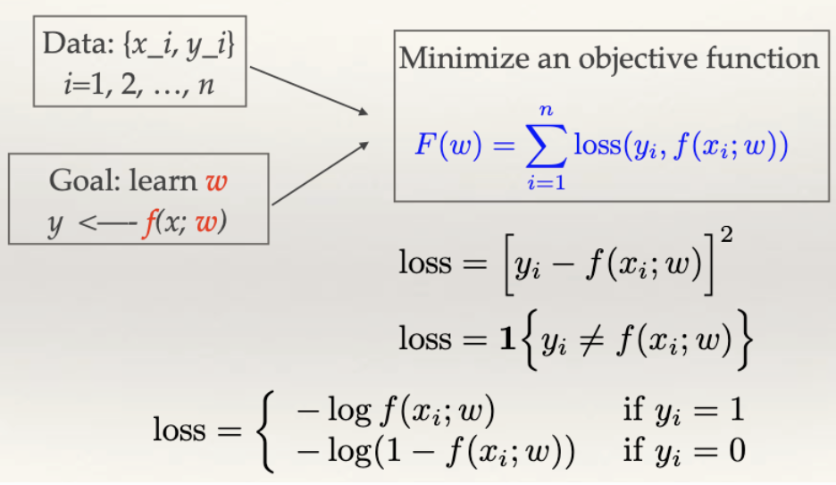
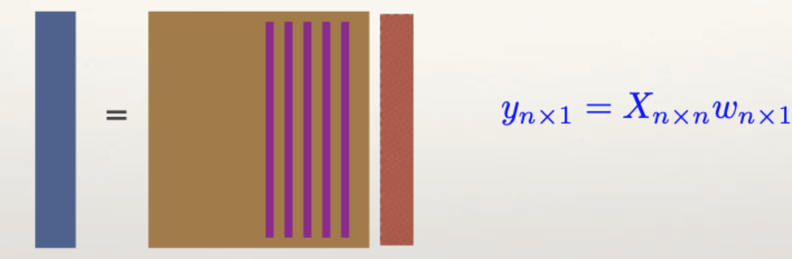

# Introduction to Statistical Learning

Statistical learning is a fundamental framework for understanding how to extract meaningful patterns from data and make predictions about future observations. This field combines principles from statistics, computer science, and mathematics to develop algorithms that can learn from data without being explicitly programmed for every possible scenario.

## 1.1.1. Types of Statistical Learning Problems

Statistical learning problems can be broadly categorized based on the nature of the data and the learning objectives. Understanding these categories is crucial for selecting appropriate methods and interpreting results correctly.


*Figure: Supervised vs Unsupervised Learning*

### Supervised Learning: Predicting Numerical Values (Regression)

Supervised learning addresses problems where we have a target variable, denoted as $`Y`$, and a set of features or covariates, represented as $`X`$, which is typically a multidimensional vector. Our goal is to build a predictive model $`f: \mathcal{X} \rightarrow \mathcal{Y}`$ that maps input features to target values.

**Mathematical Framework:**
Given a training dataset $`\mathcal{D} = \{(x_1, y_1), (x_2, y_2), \ldots, (x_n, y_n)\}`$ where:
- $`x_i \in \mathbb{R}^p`$ represents the feature vector for the $`i`$-th observation
- $`y_i \in \mathbb{R}`$ represents the target value for the $`i`$-th observation
- $`n`$ is the number of training examples
- $`p`$ is the number of features

We seek to find a function $`f`$ that minimizes the expected prediction error:

```math
f^* = \arg\min_{f \in \mathcal{F}} \mathbb{E}_{(X,Y)}[L(Y, f(X))]
```

where $`L`$ is a loss function and $`\mathcal{F}`$ is the class of functions we consider.

**Understanding the Mathematical Notation:**

1. **$`\mathcal{D}`$**: The training dataset containing pairs of inputs and outputs
2. **$`x_i \in \mathbb{R}^p`$**: Each input is a p-dimensional real vector (e.g., house features like square footage, bedrooms, location)
3. **$`y_i \in \mathbb{R}`$**: Each output is a real number (e.g., house price)
4. **$`f: \mathcal{X} \rightarrow \mathcal{Y}`$**: A function that maps from input space to output space
5. **$`\mathbb{E}_{(X,Y)}`$**: Expectation over the joint distribution of inputs and outputs
6. **$`L(Y, f(X))`$**: Loss function measuring prediction error

**Common Loss Functions for Regression:**

1. **Mean Squared Error (MSE):**
```math
L(y, \hat{y}) = (y - \hat{y})^2
```

2. **Mean Absolute Error (MAE):**
```math
L(y, \hat{y}) = |y - \hat{y}|
```

3. **Huber Loss (robust to outliers):**
```math
L(y, \hat{y}) = \begin{cases}
\frac{1}{2}(y - \hat{y})^2 & \text{if } |y - \hat{y}| \leq \delta \\
\delta|y - \hat{y}| - \frac{1}{2}\delta^2 & \text{if } |y - \hat{y}| > \delta
\end{cases}
```

**Real-World Examples:**
- **Project 1**: Predicting house sale prices in Ames, Iowa based on features like square footage, number of bedrooms, location, etc.
- **Project 2**: Forecasting Walmart store sales at a department level using historical sales data, promotional events, and seasonal patterns.

In these examples, the target variable $`Y`$ takes continuous numerical values, making them **regression** problems. The goal is to predict a continuous outcome rather than discrete categories.

### Supervised Learning: Classifying Categorical Data (Classification)

Classification problems involve predicting categorical outcomes where $`Y`$ takes discrete values from a finite set of classes. The mathematical framework is similar, but the target space is discrete.

**Mathematical Framework:**
For classification with $`K`$ classes, we have:
- $`y_i \in \{1, 2, \ldots, K\}`$ for the $`i`$-th observation
- The model $`f: \mathbb{R}^p \rightarrow \{1, 2, \ldots, K\}`$ maps features to class labels
- Often, we work with probability estimates $`P(Y = k | X = x)`$ for each class $`k`$

The optimal classifier (Bayes classifier) is given by:

```math
f^*(x) = \arg\max_{k \in \{1,\ldots,K\}} P(Y = k | X = x)
```

**Understanding Classification:**

1. **Binary Classification ($`K = 2`$):** The simplest case where we predict one of two classes
   - Example: Spam detection (spam vs. not spam)
   - Example: Medical diagnosis (disease present vs. absent)

2. **Multi-class Classification ($`K > 2`$):** Predicting one of multiple classes
   - Example: Digit recognition (0-9)
   - Example: Image classification (cat, dog, bird, etc.)

**Common Loss Functions for Classification:**

1. **0-1 Loss (misclassification rate):**
```math
L(y, \hat{y}) = \mathbb{I}(y \neq \hat{y}) = \begin{cases}
0 & \text{if } y = \hat{y} \\
1 & \text{if } y \neq \hat{y}
\end{cases}
```

2. **Cross-entropy Loss (for probabilistic predictions):**
```math
L(y, \hat{p}) = -\sum_{k=1}^K y_k \log(\hat{p}_k)
```
where $`y_k`$ is 1 if the true class is $`k`$, 0 otherwise, and $`\hat{p}_k`$ is the predicted probability for class $`k`$.

3. **Hinge Loss (for Support Vector Machines):**
```math
L(y, \hat{y}) = \max(0, 1 - y \cdot \hat{y})
```
where $`y \in \{-1, 1\}`$ and $`\hat{y}`$ is the predicted score.

**Real-World Examples:**
- **Project 3**: Determining whether movie reviews are positive or negative based on text content
- **Credit Risk Assessment**: Predicting whether a borrower will default on a loan based on financial history, income, and other characteristics

These are **classification** problems where the goal is to assign observations to predefined categories.

### Unsupervised Learning: Discovering Hidden Patterns

Unsupervised learning operates without target variables. Instead, we seek to discover intrinsic structure, patterns, or relationships within the data itself.

**Mathematical Framework:**
Given only feature data $`\mathcal{D} = \{x_1, x_2, \ldots, x_n\}`$ where $`x_i \in \mathbb{R}^p`$, we aim to:
- Find clusters or groups in the data
- Discover latent variables or factors
- Identify associations and dependencies
- Reduce dimensionality while preserving important structure

**Key Techniques:**

1. **Clustering**: Partition data into groups based on similarity
   - **K-means**: Minimize within-cluster variance
```math
\min_{C_1, \ldots, C_K} \sum_{k=1}^K \sum_{x_i \in C_k} \|x_i - \mu_k\|^2
```
   where $`C_k`$ are clusters and $`\mu_k`$ are cluster centers.

2. **Dimensionality Reduction**: Find lower-dimensional representations
   - **Principal Component Analysis (PCA)**: Find directions of maximum variance
```math
\max_{w: \|w\| = 1} \text{Var}(w^T X)
```

3. **Association Rules**: Discover relationships between variables
   - **Apriori Algorithm**: Find frequent itemsets and generate rules

4. **Density Estimation**: Model the underlying data distribution
   - **Kernel Density Estimation**: Estimate probability density function
```math
\hat{f}(x) = \frac{1}{nh} \sum_{i=1}^n K\left(\frac{x - x_i}{h}\right)
```

**Real-World Examples:**
- **Market Segmentation**: Identifying distinct customer groups based on purchasing behavior
- **Recommendation Systems**: Finding associations between products purchased together
- **Anomaly Detection**: Identifying unusual patterns in network traffic or financial transactions

### Summary of Statistical Learning Problem Types

| Learning Type | Target Variable | Goal | Example | Key Challenge |
|---------------|-----------------|------|---------|---------------|
| **Supervised - Regression** | Continuous $`Y \in \mathbb{R}`$ | Predict numerical values | House price prediction | Balancing bias and variance |
| **Supervised - Classification** | Categorical $`Y \in \{1,\ldots,K\}`$ | Assign to categories | Spam detection | Handling class imbalance |
| **Unsupervised** | None | Discover patterns | Customer segmentation | Evaluating quality of discovered patterns |

### Beyond the Basics: Advanced Learning Paradigms

Real-world problems often don't fit neatly into these categories, leading to hybrid approaches:

**Semi-Supervised Learning:**
When labeled data is scarce or expensive to obtain, we can leverage both labeled and unlabeled data:

```math
\mathcal{D}_{\text{labeled}} = \{(x_1, y_1), \ldots, (x_l, y_l)\}
```
```math
\mathcal{D}_{\text{unlabeled}} = \{x_{l+1}, \ldots, x_n\}
```

The goal is to use the unlabeled data to improve the model learned from the limited labeled data.

**Mathematical Framework:**
```math
\min_{f} \sum_{i=1}^l L(y_i, f(x_i)) + \lambda \sum_{i=l+1}^n \text{Regularizer}(f(x_i))
```

**Active Learning:**
Instead of passively receiving labeled data, the algorithm actively selects which examples to label, maximizing information gain.

**Mathematical Framework:**
```math
x^* = \arg\max_{x \in \mathcal{U}} \text{InformationGain}(x)
```

**Transfer Learning:**
Leverage knowledge learned from one task to improve performance on a related task, even when the data distributions differ.

**Mathematical Framework:**
```math
f_{\text{target}} = f_{\text{source}} + \Delta f
```

## 1.1.2. The Challenge of Supervised Learning

Supervised learning appears deceptively simple: collect data, build a model, and make predictions. However, the fundamental challenge lies in the tension between fitting the training data well and generalizing to unseen data.

### The Learning Process

The supervised learning process can be visualized as a systematic pipeline:

**Step 1: Data Collection**
We start with a collection of $`n`$ training examples $`\mathcal{D} = \{(x_1, y_1), \ldots, (x_n, y_n)\}`$. Each $`x_i \in \mathbb{R}^p`$ is a feature vector, and $`y_i`$ is the corresponding target value.

**Data Quality Considerations:**
- **Representativeness**: Does the data reflect the population of interest?
- **Completeness**: Are there missing values that need handling?
- **Consistency**: Are there inconsistencies or errors in the data?
- **Timeliness**: Is the data current and relevant?

**Step 2: Model Specification**
We choose a family of functions $`\mathcal{F} = \{f(x; \theta) : \theta \in \Theta\}`$ parameterized by $`\theta`$. Common choices include:

1. **Linear Models:**
```math
f(x; w, b) = w^T x + b
```
where $`w \in \mathbb{R}^p`$ are weights and $`b \in \mathbb{R}`$ is the bias term.

2. **Polynomial Models:**
```math
f(x; w) = w_0 + w_1 x + w_2 x^2 + \cdots + w_d x^d
```

3. **Neural Networks:**
```math
f(x; W, b) = \sigma(W^T x + b)
```
where $`\sigma`$ is an activation function (e.g., ReLU, sigmoid, tanh).

4. **Decision Trees:** Piecewise constant functions that partition the input space.

**Step 3: Loss Function Definition**
We define a loss function $`L(y, \hat{y})`$ that measures the cost of predicting $`\hat{y}`$ when the true value is $`y`$:

**For Regression:**
- **Mean Squared Error (MSE):**
```math
L(y, \hat{y}) = (y - \hat{y})^2
```

- **Mean Absolute Error (MAE):**
```math
L(y, \hat{y}) = |y - \hat{y}|
```

- **Huber Loss (robust):**
```math
L(y, \hat{y}) = \begin{cases}
\frac{1}{2}(y - \hat{y})^2 & \text{if } |y - \hat{y}| \leq \delta \\
\delta|y - \hat{y}| - \frac{1}{2}\delta^2 & \text{if } |y - \hat{y}| > \delta
\end{cases}
```

**For Classification:**
- **Cross-entropy loss:**
```math
L(y, \hat{y}) = -\sum_{k=1}^K y_k \log(\hat{y}_k)
```

- **Hinge loss (for SVM):**
```math
L(y, \hat{y}) = \max(0, 1 - y \cdot \hat{y})
```

**Step 4: Empirical Risk Minimization**
We minimize the empirical risk (average loss on training data):

```math
\hat{\theta} = \arg\min_{\theta \in \Theta} \frac{1}{n} \sum_{i=1}^n L(y_i, f(x_i; \theta))
```

**Understanding Empirical Risk Minimization:**

The empirical risk $`R_n(f)`$ is an estimate of the true risk $`R(f)`$:

```math
R_n(f) = \frac{1}{n} \sum_{i=1}^n L(y_i, f(x_i))
```
```math
R(f) = \mathbb{E}_{(X,Y)}[L(Y, f(X))]
```

The key insight is that we minimize $`R_n(f)`$ but care about $`R(f)`$.

### The Fundamental Challenge: Generalization

The core challenge in supervised learning is that minimizing training error doesn't guarantee good performance on new data. This is formalized through the concept of **generalization error**:

```math
R(f) = \mathbb{E}_{(X,Y)}[L(Y, f(X))]
```

The generalization error measures the expected loss on unseen data drawn from the same distribution as the training data.

**The Bias-Variance Tradeoff:**
The generalization error can be decomposed into three components:

```math
\mathbb{E}[(Y - f(X))^2] = \text{Bias}^2 + \text{Variance} + \text{Irreducible Error}
```

where:
- **Bias**: $`\text{Bias}^2 = (\mathbb{E}[f(X)] - f^*(X))^2`$ - how far our predictions are from the true function on average
- **Variance**: $`\text{Var}(f(X))`$ - how much our predictions vary across different training sets
- **Irreducible Error**: $`\text{Var}(\epsilon)`$ - noise in the data that cannot be predicted

**Understanding the Bias-Variance Decomposition:**

1. **Bias**: Measures the systematic error of our model
   - High bias: Model is too simple, underfits the data
   - Low bias: Model is complex enough to capture the true relationship

2. **Variance**: Measures the variability of our predictions
   - High variance: Model is too complex, overfits the data
   - Low variance: Model is stable across different training sets

3. **Irreducible Error**: Noise inherent in the data generation process
   - Cannot be reduced by any model
   - Sets a lower bound on achievable error

**Visualizing the Bias-Variance Tradeoff:**

Consider a dart-throwing analogy:
- **High Bias, Low Variance**: Consistently miss the target in the same direction (systematic error)
- **Low Bias, High Variance**: Sometimes hit the target, sometimes miss widely (unstable)
- **Low Bias, Low Variance**: Consistently hit near the target (ideal)

### Overfitting: The Central Problem

**Overfitting** occurs when a model learns the training data too well, including noise and idiosyncrasies, leading to poor generalization. This happens when:

1. The model is too complex relative to the amount of training data
2. The number of parameters $`p`$ is large compared to the sample size $`n`$
3. The training data contains noise or outliers

**Mathematical Characterization:**
Let $`\hat{f}_n`$ be the model learned from $`n`$ training examples. Overfitting occurs when:

```math
\text{Training Error}(\hat{f}_n) \ll \text{Test Error}(\hat{f}_n)
```

**Signs of Overfitting:**
- Training error continues to decrease while validation error increases
- Model performs well on training data but poorly on new data
- Model has learned noise or spurious correlations

**Prevention Strategies:**

1. **Regularization**: Add penalty terms to the loss function
```math
\hat{\theta} = \arg\min_{\theta} \left\{ \frac{1}{n} \sum_{i=1}^n L(y_i, f(x_i; \theta)) + \lambda \Omega(\theta) \right\}
```

Common regularization terms:
- **L1 (Lasso)**: $`\Omega(\theta) = \|\theta\|_1`$ - promotes sparsity
- **L2 (Ridge)**: $`\Omega(\theta) = \|\theta\|_2^2`$ - prevents large weights
- **Elastic Net**: $`\Omega(\theta) = \alpha \|\theta\|_1 + (1-\alpha)\|\theta\|_2^2`$ - combines both

2. **Cross-Validation**: Use held-out data to estimate generalization error
   - **K-fold CV**: Divide data into K folds, train on K-1, validate on 1
   - **Leave-one-out CV**: Use n-1 samples for training, 1 for validation

3. **Early Stopping**: Stop training before the model overfits
   - Monitor validation error during training
   - Stop when validation error starts increasing

4. **Model Selection**: Choose simpler models when data is limited
   - Occam's Razor: Prefer simpler explanations
   - Use domain knowledge to guide model choice

### Learning vs. Optimization: A Critical Distinction

While optimization is essential for learning, it's crucial to understand that learning is not just optimization. The key insight is that we optimize an **empirical risk** $`R_n(f)`$ but care about the **true risk** $`R(f)`$:

```math
R_n(f) = \frac{1}{n} \sum_{i=1}^n L(y_i, f(x_i))
```
```math
R(f) = \mathbb{E}_{(X,Y)}[L(Y, f(X))]
```

**The Learning Guarantee:**
Under certain conditions, we can bound the difference between empirical and true risk:

```math
P(|R_n(f) - R(f)| > \epsilon) \leq 2\exp(-2n\epsilon^2)
```

This bound shows that as $`n \rightarrow \infty`$, $`R_n(f) \rightarrow R(f)`$ with high probability.

**Practical Implications:**
- Sometimes suboptimal solutions (e.g., from gradient descent) generalize better than exact optima
- The goal is good generalization, not perfect optimization
- Regularization often improves generalization even when it increases training error

**Example: Linear Regression with Gradient Descent**

Consider linear regression with MSE loss:
```math
L(y, \hat{y}) = (y - w^T x)^2
```

The empirical risk is:
```math
R_n(w) = \frac{1}{n} \sum_{i=1}^n (y_i - w^T x_i)^2
```

Gradient descent update:
```math
w_{t+1} = w_t - \eta \nabla R_n(w_t)
```

where $`\eta`$ is the learning rate and $`\nabla R_n(w_t) = -\frac{2}{n} \sum_{i=1}^n (y_i - w_t^T x_i) x_i`$.


*Figure: Example of a Linear Function*

## 1.1.3. The Curse of Dimensionality

The curse of dimensionality refers to the phenomenon where the performance of many algorithms deteriorates as the number of features (dimensions) increases, even when the additional features contain no useful information.

### Mathematical Intuition

Consider a unit hypercube in $`p`$ dimensions. The volume of a sphere inscribed in this cube decreases exponentially with dimension:

```math
V_{\text{sphere}} = \frac{\pi^{p/2}}{\Gamma(p/2 + 1)} \left(\frac{1}{2}\right)^p
```

As $`p \rightarrow \infty`$, $`V_{\text{sphere}} \rightarrow 0`$, meaning most of the volume is concentrated in the corners.

**Understanding the Volume Formula:**

1. **$`\Gamma(p/2 + 1)`$**: Gamma function, generalizes factorial to non-integers
2. **$`\pi^{p/2}`$**: Volume scaling factor for p-dimensional sphere
3. **$`(1/2)^p`$**: Exponential decay with dimension

**Implications for Learning:**
- Data becomes increasingly sparse in high dimensions
- Distance metrics become less meaningful
- The "neighborhood" of any point becomes empty

**Example: Data Sparsity**

In 1D, if we have 1000 points in [0,1], average distance between points is ~0.001.
In 10D, if we have 1000 points in [0,1]^10, average distance between points is ~0.5.
In 100D, average distance is ~0.9.

This means points become increasingly isolated as dimension increases.

### Impact on k-Nearest Neighbors (kNN)

The kNN algorithm is particularly susceptible to the curse of dimensionality. Consider the 1-NN classifier:

**Algorithm:**
1. For a new point $`x`$, find the nearest neighbor $`x_i`$ in the training set
2. Predict $`y_i`$ as the class for $`x`$

**Mathematical Analysis:**
Let $`d(x, x_i)`$ be the Euclidean distance between points. In high dimensions, all points become approximately equidistant:

```math
\lim_{p \rightarrow \infty} \frac{\max_{i,j} d(x_i, x_j) - \min_{i,j} d(x_i, x_j)}{\min_{i,j} d(x_i, x_j)} = 0
```

This means kNN loses its discriminative power in high dimensions.

**Proof Sketch:**

For independent features, the expected squared distance between two points is:
```math
\mathbb{E}[d^2(x_i, x_j)] = \sum_{k=1}^p \mathbb{E}[(x_{ik} - x_{jk})^2] = p \cdot \text{Var}(X)
```

The variance of distances is:
```math
\text{Var}(d^2(x_i, x_j)) = 2p \cdot \text{Var}(X)^2
```

The coefficient of variation is:
```math
CV = \frac{\sqrt{\text{Var}(d^2)}}{\mathbb{E}[d^2]} = \frac{\sqrt{2p \cdot \text{Var}(X)^2}}{p \cdot \text{Var}(X)} = \frac{\sqrt{2}}{\sqrt{p}}
```

As $`p \rightarrow \infty`$, $`CV \rightarrow 0`$, meaning all distances become similar.

### Impact on Linear Classifiers

Linear classifiers face a different but related challenge. Consider the linear model:

```math
f(x; w) = w^T x + b
```

**The Interpolation Problem:**
When $`p \geq n`$ (more features than samples), we can often find a perfect fit to the training data:

```math
\exists w \text{ such that } w^T x_i + b = y_i \text{ for all } i = 1, \ldots, n
```

This perfect fit on training data typically corresponds to poor generalization.

**Mathematical Illustration:**
For $`p = n`$, the system of equations $`Xw = y`$ has a unique solution when $`X`$ is full rank. This solution achieves zero training error but may have high test error.

**Example: Linear Interpolation in High Dimensions**

Consider $`n = 100`$ training points and $`p = 1000`$ features. The system $`Xw = y`$ is underdetermined (more variables than equations), so there are infinitely many solutions that achieve zero training error.

However, most of these solutions will generalize poorly because they've learned noise rather than true patterns.

### Strategies for Combating the Curse of Dimensionality

**1. Feature Selection:**
Choose a subset of relevant features:
```math
\mathcal{S} \subset \{1, 2, \ldots, p\}, \quad |\mathcal{S}| \ll p
```

**Methods:**
- **Filter methods**: Select features based on statistical measures (correlation, mutual information)
- **Wrapper methods**: Use model performance to guide feature selection
- **Embedded methods**: Feature selection is part of the learning algorithm (e.g., Lasso)

**2. Dimensionality Reduction:**
Project data to a lower-dimensional space:
```math
z = W^T x, \quad W \in \mathbb{R}^{p \times k}, \quad k \ll p
```

**Methods:**
- **Principal Component Analysis (PCA)**: Find directions of maximum variance
- **Linear Discriminant Analysis (LDA)**: Find directions that maximize class separation
- **t-SNE**: Non-linear dimensionality reduction for visualization
- **Autoencoders**: Neural network-based dimensionality reduction

**3. Regularization:**
Add constraints to prevent overfitting:
```math
\|w\|_1 \leq t \quad \text{(Lasso)} \quad \text{or} \quad \|w\|_2 \leq t \quad \text{(Ridge)}
```

**Lasso (L1):**
```math
\min_w \frac{1}{n} \sum_{i=1}^n (y_i - w^T x_i)^2 + \lambda \|w\|_1
```

**Ridge (L2):**
```math
\min_w \frac{1}{n} \sum_{i=1}^n (y_i - w^T x_i)^2 + \lambda \|w\|_2^2
```

**4. Kernel Methods:**
Work in high-dimensional feature spaces implicitly through kernels:
```math
K(x_i, x_j) = \phi(x_i)^T \phi(x_j)
```

**Common Kernels:**
- **Linear**: $`K(x_i, x_j) = x_i^T x_j`$
- **Polynomial**: $`K(x_i, x_j) = (x_i^T x_j + c)^d`$
- **RBF**: $`K(x_i, x_j) = \exp(-\gamma \|x_i - x_j\|^2)`$

### Practical Guidelines

1. **Collect more data** when possible (increase $`n`$)
   - More data helps combat the curse of dimensionality
   - Rule of thumb: $`n \geq 10p`$ for linear models

2. **Use domain knowledge** to select relevant features
   - Understand which features are likely to be predictive
   - Remove irrelevant or redundant features

3. **Apply regularization** to prevent overfitting
   - Use L1/L2 regularization
   - Cross-validate regularization strength

4. **Consider simpler models** when data is limited
   - Linear models before non-linear
   - Fewer parameters when sample size is small

5. **Use cross-validation** to estimate generalization error
   - Don't rely solely on training error
   - Monitor bias-variance tradeoff

### Code Example: Demonstrating the Curse of Dimensionality

```python
import numpy as np
import matplotlib.pyplot as plt
from sklearn.neighbors import KNeighborsClassifier
from sklearn.model_selection import train_test_split
from sklearn.metrics import accuracy_score

# Generate synthetic data
def generate_data(n_samples, n_features, n_classes=2):
    X = np.random.randn(n_samples, n_features)
    y = np.random.randint(0, n_classes, n_samples)
    return X, y

# Test kNN performance across dimensions
n_samples = 1000
n_features_list = [1, 2, 5, 10, 20, 50, 100]
accuracies = []

for n_features in n_features_list:
    X, y = generate_data(n_samples, n_features)
    X_train, X_test, y_train, y_test = train_test_split(X, y, test_size=0.3, random_state=42)
    
    knn = KNeighborsClassifier(n_neighbors=5)
    knn.fit(X_train, y_train)
    y_pred = knn.predict(X_test)
    accuracy = accuracy_score(y_test, y_pred)
    accuracies.append(accuracy)

# Plot results
plt.figure(figsize=(10, 6))
plt.plot(n_features_list, accuracies, 'bo-')
plt.xlabel('Number of Features')
plt.ylabel('Test Accuracy')
plt.title('kNN Performance vs. Dimensionality')
plt.grid(True)
plt.show()
```

The curse of dimensionality is a fundamental challenge in statistical learning that requires careful consideration of the trade-off between model complexity and available data. Understanding this phenomenon is crucial for developing effective learning algorithms and interpreting their performance.

## 1.1.4. Practical Considerations and Best Practices

### Data Preprocessing

**1. Feature Scaling:**
Many algorithms are sensitive to the scale of features. Common scaling methods:

**Standardization (Z-score normalization):**
```math
x' = \frac{x - \mu}{\sigma}
```

**Min-Max scaling:**
```math
x' = \frac{x - x_{\min}}{x_{\max} - x_{\min}}
```

**2. Handling Missing Values:**
- **Deletion**: Remove observations with missing values
- **Imputation**: Fill missing values with mean, median, or mode
- **Advanced methods**: Use models to predict missing values

**3. Outlier Detection:**
- **Statistical methods**: Z-score, IQR-based detection
- **Distance-based**: Mahalanobis distance, local outlier factor
- **Model-based**: Isolation forest, one-class SVM

### Model Evaluation

**1. Performance Metrics:**

**For Regression:**
- **Mean Squared Error (MSE):** $`\frac{1}{n} \sum_{i=1}^n (y_i - \hat{y}_i)^2`$
- **Root Mean Squared Error (RMSE):** $`\sqrt{\text{MSE}}`$
- **Mean Absolute Error (MAE):** $`\frac{1}{n} \sum_{i=1}^n |y_i - \hat{y}_i|`$
- **R-squared:** $`1 - \frac{\sum_{i=1}^n (y_i - \hat{y}_i)^2}{\sum_{i=1}^n (y_i - \bar{y})^2}`$

**For Classification:**
- **Accuracy:** $`\frac{\text{Correct Predictions}}{\text{Total Predictions}}`$
- **Precision:** $`\frac{\text{True Positives}}{\text{True Positives} + \text{False Positives}}`$
- **Recall:** $`\frac{\text{True Positives}}{\text{True Positives} + \text{False Negatives}}`$
- **F1-score:** $`2 \cdot \frac{\text{Precision} \cdot \text{Recall}}{\text{Precision} + \text{Recall}}`$

**2. Cross-Validation:**
```math
\text{CV Error} = \frac{1}{K} \sum_{k=1}^K \text{Error}_k
```

where $`\text{Error}_k`$ is the error on the k-th fold.

### Hyperparameter Tuning

**1. Grid Search:**
Systematically search through a predefined grid of hyperparameters.

**2. Random Search:**
Randomly sample from the hyperparameter space.

**3. Bayesian Optimization:**
Use probabilistic models to guide the search efficiently.

**Example: Grid Search for Ridge Regression**
```python
from sklearn.linear_model import Ridge
from sklearn.model_selection import GridSearchCV

param_grid = {'alpha': [0.001, 0.01, 0.1, 1, 10, 100]}
ridge = Ridge()
grid_search = GridSearchCV(ridge, param_grid, cv=5)
grid_search.fit(X_train, y_train)
best_alpha = grid_search.best_params_['alpha']
```

### Interpretability and Explainability

**1. Model Interpretability:**
- **Linear models**: Coefficients directly interpretable
- **Decision trees**: Rules-based interpretation
- **Neural networks**: Often considered "black boxes"

**2. Feature Importance:**
- **Permutation importance**: Measure performance drop when feature is permuted
- **SHAP values**: Shapley Additive Explanations for feature contributions
- **Partial dependence plots**: Show relationship between feature and prediction

**3. Model-Agnostic Methods:**
- **LIME**: Local Interpretable Model-agnostic Explanations
- **SHAP**: Unified framework for model explanations

### Ethical Considerations

**1. Bias and Fairness:**
- **Data bias**: Training data may reflect societal biases
- **Algorithmic bias**: Models may amplify existing biases
- **Fairness metrics**: Equal opportunity, demographic parity

**2. Privacy:**
- **Differential privacy**: Add noise to protect individual privacy
- **Federated learning**: Train models without sharing raw data
- **Secure multi-party computation**: Compute on encrypted data

**3. Transparency:**
- **Model cards**: Document model behavior and limitations
- **Data sheets**: Document dataset characteristics
- **Explainable AI**: Provide interpretable explanations

### Deployment Considerations

**1. Model Serving:**
- **Batch prediction**: Process data in batches
- **Real-time prediction**: Serve predictions with low latency
- **Model versioning**: Track different model versions

**2. Monitoring:**
- **Data drift**: Monitor changes in input data distribution
- **Model drift**: Monitor degradation in model performance
- **Concept drift**: Monitor changes in the relationship between inputs and outputs

**3. Maintenance:**
- **Retraining**: Update models with new data
- **A/B testing**: Compare different model versions
- **Rollback strategies**: Revert to previous model versions if needed

This comprehensive introduction provides the foundation for understanding statistical learning. The key concepts of supervised vs. unsupervised learning, the bias-variance tradeoff, overfitting, and the curse of dimensionality are fundamental to all subsequent topics in this course.

