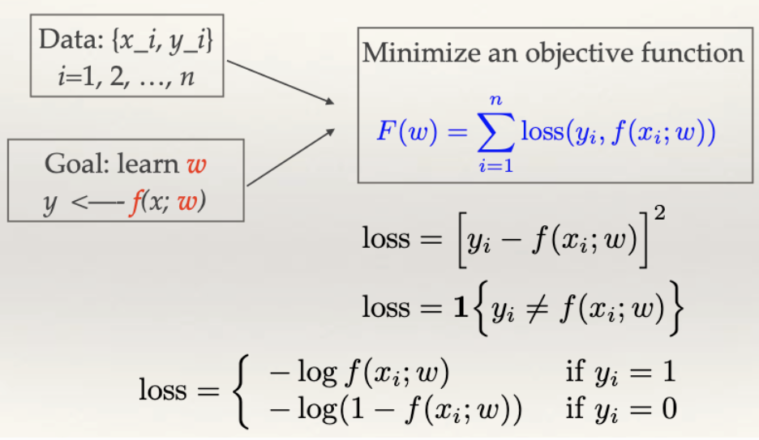
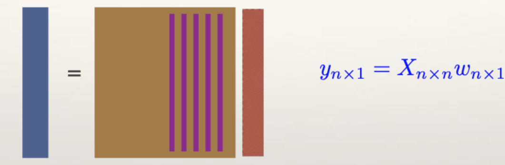

# Introduction to Statistical Learning

Statistical learning is a fundamental framework for understanding how to extract meaningful patterns from data and make predictions about future observations. This field combines principles from statistics, computer science, and mathematics to develop algorithms that can learn from data without being explicitly programmed for every possible scenario.

**Think of statistical learning as teaching a computer to recognize patterns the way humans do.** Just as a child learns to recognize cats by seeing many examples of cats (and non-cats), statistical learning algorithms learn patterns by analyzing data. The key insight is that we don't need to explicitly program every rule - instead, we provide examples and let the algorithm discover the underlying patterns.

## 1.1.1. Types of Statistical Learning Problems

Statistical learning problems can be broadly categorized based on the nature of the data and the learning objectives. Understanding these categories is crucial for selecting appropriate methods and interpreting results correctly.

*Figure: Supervised vs Unsupervised Learning*

### Supervised Learning: Predicting Numerical Values (Regression)

Supervised learning addresses problems where we have a target variable, denoted as $`Y`$, and a set of features or covariates, represented as $`X`$, which is typically a multidimensional vector. Our goal is to build a predictive model $`f: \mathcal{X} \rightarrow \mathcal{Y}`$ that maps input features to target values.

**Intuitive Understanding:**
Imagine you're trying to predict house prices. You have information about each house (square footage, number of bedrooms, location, age, etc.) - these are your features $`X`$. The actual sale price is your target $`Y`$. You want to learn a function that takes house features as input and outputs a predicted price. This is supervised learning because you have "supervision" - you know the correct answers (actual prices) for your training data.

**Mathematical Framework:**
Given a training dataset $`\mathcal{D} = \{(x_1, y_1), (x_2, y_2), \ldots, (x_n, y_n)\}`$ where:
- $`x_i \in \mathbb{R}^p`$ represents the feature vector for the $`i`$-th observation
- $`y_i \in \mathbb{R}`$ represents the target value for the $`i`$-th observation
- $`n`$ is the number of training examples
- $`p`$ is the number of features

We seek to find a function $`f`$ that minimizes the expected prediction error:

$$f^* = \arg\min_{f \in \mathcal{F}} \mathbb{E}_{(X,Y)}[L(Y, f(X))]$$

where $`L`$ is a loss function and $`\mathcal{F}`$ is the class of functions we consider.

**Understanding the Mathematical Notation:**

1. **$`\mathcal{D}`$**: The training dataset containing pairs of inputs and outputs - think of it as your "textbook" with questions and answers
2. **$`x_i \in \mathbb{R}^p`$**: Each input is a p-dimensional real vector (e.g., house features like square footage, bedrooms, location). The $`\mathbb{R}^p`$ means we have p real numbers representing different characteristics
3. **$`y_i \in \mathbb{R}`$**: Each output is a real number (e.g., house price). This is what we're trying to predict
4. **$`f: \mathcal{X} \rightarrow \mathcal{Y}`$**: A function that maps from input space to output space - like a recipe that takes ingredients (features) and produces a dish (prediction)
5. **$`\mathbb{E}_{(X,Y)}`$**: Expectation over the joint distribution of inputs and outputs - this means we're averaging over all possible data we might encounter
6. **$`L(Y, f(X))`$**: Loss function measuring prediction error - how "wrong" our prediction is

**Common Loss Functions for Regression:**

1. **Mean Squared Error (MSE):**
$$L(y, \hat{y}) = (y - \hat{y})^2$$

**Why square the error?** Squaring has several advantages:
- It penalizes large errors more heavily than small ones (a $10 error is 100 times worse than a $1 error)
- It's differentiable everywhere, making optimization easier
- It's mathematically convenient for many algorithms

2. **Mean Absolute Error (MAE):**
$$L(y, \hat{y}) = |y - \hat{y}|$$

**When to use MAE?** When you want to treat all errors equally, regardless of size. This is more robust to outliers than MSE.

3. **Huber Loss (robust to outliers):**
$$L(y, \hat{y}) = \begin{cases}
\frac{1}{2}(y - \hat{y})^2 & \text{if } |y - \hat{y}| \leq \delta \\
\delta|y - \hat{y}| - \frac{1}{2}\delta^2 & \text{if } |y - \hat{y}| > \delta
\end{cases}$$

**Why Huber Loss?** It combines the best of both worlds: quadratic behavior for small errors (like MSE) and linear behavior for large errors (like MAE), making it robust to outliers.

**Real-World Examples:**
- **Project 1**: Predicting house sale prices in Ames, Iowa based on features like square footage, number of bedrooms, location, etc.
- **Project 2**: Forecasting Walmart store sales at a department level using historical sales data, promotional events, and seasonal patterns.

In these examples, the target variable $`Y`$ takes continuous numerical values, making them **regression** problems. The goal is to predict a continuous outcome rather than discrete categories.

### Supervised Learning: Classifying Categorical Data (Classification)

Classification problems involve predicting categorical outcomes where $`Y`$ takes discrete values from a finite set of classes. The mathematical framework is similar, but the target space is discrete.

**Intuitive Understanding:**
Think of classification like sorting items into bins. You have an email and want to decide if it's spam or not spam. You have features (sender, subject line, content, etc.) and want to assign it to one of two categories. This is supervised learning because you have examples of emails that are already labeled as spam or not spam.

**Mathematical Framework:**
For classification with $`K`$ classes, we have:
- $`y_i \in \{1, 2, \ldots, K\}`$ for the $`i`$-th observation
- The model $`f: \mathbb{R}^p \rightarrow \{1, 2, \ldots, K\}`$ maps features to class labels
- Often, we work with probability estimates $`P(Y = k | X = x)`$ for each class $`k`$

The optimal classifier (Bayes classifier) is given by:

$$f^*(x) = \arg\max_{k \in \{1,\ldots,K\}} P(Y = k | X = x)$$

**Understanding Classification:**

1. **Binary Classification ($`K = 2`$):** The simplest case where we predict one of two classes
   - Example: Spam detection (spam vs. not spam)
   - Example: Medical diagnosis (disease present vs. absent)
   - **Intuition**: Like a yes/no question - "Is this email spam?"

2. **Multi-class Classification ($`K > 2`$):** Predicting one of multiple classes
   - Example: Digit recognition (0-9)
   - Example: Image classification (cat, dog, bird, etc.)
   - **Intuition**: Like a multiple choice question - "What digit is this?"

**Common Loss Functions for Classification:**

1. **0-1 Loss (misclassification rate):**
$$L(y, \hat{y}) = \mathbb{I}(y \neq \hat{y}) = \begin{cases}
0 & \text{if } y = \hat{y} \\
1 & \text{if } y \neq \hat{y}
\end{cases}$$

**Understanding 0-1 Loss**: This is the simplest loss function - you get 0 points for correct predictions and 1 point penalty for wrong predictions. It's intuitive but not differentiable, which can make optimization challenging.

2. **Cross-entropy Loss (for probabilistic predictions):**
$$L(y, \hat{p}) = -\sum_{k=1}^K y_k \log(\hat{p}_k)$$

**Understanding Cross-entropy**: This measures how well our predicted probabilities match the true distribution. If we predict probability 0.9 for the correct class, the loss is -log(0.9) ≈ 0.1. If we predict 0.1 for the correct class, the loss is -log(0.1) ≈ 2.3. So it heavily penalizes confident wrong predictions.

3. **Hinge Loss (for Support Vector Machines):**
$$L(y, \hat{y}) = \max(0, 1 - y \cdot \hat{y})$$

**Understanding Hinge Loss**: This encourages the model to be confident in its predictions. If the prediction is correct and confident (y·ŷ > 1), the loss is 0. If the prediction is wrong or not confident enough, there's a penalty.

**Real-World Examples:**
- **Project 3**: Determining whether movie reviews are positive or negative based on text content
- **Credit Risk Assessment**: Predicting whether a borrower will default on a loan based on financial history, income, and other characteristics

These are **classification** problems where the goal is to assign observations to predefined categories.

### Unsupervised Learning: Discovering Hidden Patterns

Unsupervised learning operates without target variables. Instead, we seek to discover intrinsic structure, patterns, or relationships within the data itself.

**Intuitive Understanding:**
Imagine you're given a collection of objects without any labels and asked to organize them. You might group similar objects together, find natural categories, or identify unusual items. This is unsupervised learning - you're discovering structure without being told what to look for.

**Mathematical Framework:**
Given only feature data $`\mathcal{D} = \{x_1, x_2, \ldots, x_n\}`$ where $`x_i \in \mathbb{R}^p`$, we aim to:
- Find clusters or groups in the data
- Discover latent variables or factors
- Identify associations and dependencies
- Reduce dimensionality while preserving important structure

**Key Techniques:**

1. **Clustering**: Partition data into groups based on similarity
   - **K-means**: Minimize within-cluster variance
$$ \min_{C_1, \ldots, C_K} \sum_{k=1}^K \sum_{x_i \in C_k} \|x_i - \mu_k\|^2 $$
   where $`C_k`$ are clusters and $`\mu_k`$ are cluster centers.

   **Intuition**: Like organizing books by topic - you want books on similar subjects to be close together.

2. **Dimensionality Reduction**: Find lower-dimensional representations
   - **Principal Component Analysis (PCA)**: Find directions of maximum variance
$$ \max_{w: \|w\| = 1} \text{Var}(w^T X) $$

   **Intuition**: Like creating a summary of a long document - you want to capture the most important information in fewer words.

3. **Association Rules**: Discover relationships between variables
   - **Apriori Algorithm**: Find frequent itemsets and generate rules

   **Intuition**: Like discovering that people who buy bread often also buy milk.

4. **Density Estimation**: Model the underlying data distribution
   - **Kernel Density Estimation**: Estimate probability density function
$$ \hat{f}(x) = \frac{1}{nh} \sum_{i=1}^n K\left(\frac{x - x_i}{h}\right) $$

   **Intuition**: Like creating a map showing where data points are most concentrated.

**Real-World Examples:**
- **Market Segmentation**: Identifying distinct customer groups based on purchasing behavior
- **Recommendation Systems**: Finding associations between products purchased together
- **Anomaly Detection**: Identifying unusual patterns in network traffic or financial transactions

### Summary of Statistical Learning Problem Types

| Learning Type | Target Variable | Goal | Example | Key Challenge |
|---------------|-----------------|------|---------|---------------|
| **Supervised - Regression** | Continuous $`Y \in \mathbb{R}`$ | Predict numerical values | House price prediction | Balancing bias and variance |
| **Supervised - Classification** | Categorical $`Y \in \{1,\ldots,K\}`$ | Assign to categories | Spam detection | Handling class imbalance |
| **Unsupervised** | None | Discover patterns | Customer segmentation | Evaluating quality of discovered patterns |

### Beyond the Basics: Advanced Learning Paradigms

Real-world problems often don't fit neatly into these categories, leading to hybrid approaches:

**Semi-Supervised Learning:**
When labeled data is scarce or expensive to obtain, we can leverage both labeled and unlabeled data:

$$ \mathcal{D}_{\text{labeled}} = \{(x_1, y_1), \ldots, (x_l, y_l)\} $$
$$ \mathcal{D}_{\text{unlabeled}} = \{x_{l+1}, \ldots, x_n\} $$

The goal is to use the unlabeled data to improve the model learned from the limited labeled data.

**Intuition**: Like learning a language - you might have a few labeled examples (this word means "hello"), but you can learn more by observing how words are used in context.

**Mathematical Framework:**
$$ \min_{f} \sum_{i=1}^l L(y_i, f(x_i)) + \lambda \sum_{i=l+1}^n \text{Regularizer}(f(x_i)) $$

**Active Learning:**
Instead of passively receiving labeled data, the algorithm actively selects which examples to label, maximizing information gain.

**Intuition**: Like a smart student who asks the most important questions to understand a topic quickly.

**Mathematical Framework:**
$$ x^* = \arg\max_{x \in \mathcal{U}} \text{InformationGain}(x) $$

**Transfer Learning:**
Leverage knowledge learned from one task to improve performance on a related task, even when the data distributions differ.

**Intuition**: Like learning to ride a bicycle helping you learn to ride a motorcycle - some skills transfer even though the tasks are different.

**Mathematical Framework:**
$$ f_{\text{target}} = f_{\text{source}} + \Delta f $$

## 1.1.2. The Challenge of Supervised Learning

Supervised learning appears deceptively simple: collect data, build a model, and make predictions. However, the fundamental challenge lies in the tension between fitting the training data well and generalizing to unseen data.

**The Core Dilemma:**
Think of this like studying for an exam. You could memorize every question and answer from your textbook, but this wouldn't help you on new questions. You need to understand the underlying concepts to generalize to new problems. Similarly, a model that memorizes training data won't perform well on new data.

### The Learning Process

The supervised learning process can be visualized as a systematic pipeline:

**Step 1: Data Collection**
We start with a collection of $`n`$ training examples $`\mathcal{D} = \{(x_1, y_1), \ldots, (x_n, y_n)\}`$. Each $`x_i \in \mathbb{R}^p`$ is a feature vector, and $`y_i`$ is the corresponding target value.

**Data Quality Considerations:**
- **Representativeness**: Does the data reflect the population of interest? (Like making sure your study group represents the entire class)
- **Completeness**: Are there missing values that need handling? (Like having incomplete homework assignments)
- **Consistency**: Are there inconsistencies or errors in the data? (Like conflicting information in different sources)
- **Timeliness**: Is the data current and relevant? (Like using outdated textbooks)

**Step 2: Model Specification**
We choose a family of functions $`\mathcal{F} = \{f(x; \theta) : \theta \in \Theta\}`$ parameterized by $`\theta`$. Common choices include:

1. **Linear Models:**
$$ f(x; w, b) = w^T x + b $$
where $`w \in \mathbb{R}^p`$ are weights and $`b \in \mathbb{R}`$ is the bias term.

**Intuition**: Like a simple rule: "Price = $100 × square footage + $50,000 base price"

2. **Polynomial Models:**
$$ f(x; w) = w_0 + w_1 x + w_2 x^2 + \cdots + w_d x^d $$

**Intuition**: Like fitting a curved line through data points - more flexible than a straight line

3. **Neural Networks:**
$$ f(x; W, b) = \sigma(W^T x + b) $$
where $`\sigma`$ is an activation function (e.g., ReLU, sigmoid, tanh).

**Intuition**: Like having multiple simple rules that work together to make complex decisions

4. **Decision Trees:** Piecewise constant functions that partition the input space.

**Intuition**: Like a flowchart: "If square footage > 2000, then if bedrooms > 3, predict high price, else predict medium price"

**Step 3: Loss Function Definition**
We define a loss function $`L(y, \hat{y})`$ that measures the cost of predicting $`\hat{y}`$ when the true value is $`y`$:

**For Regression:**
- **Mean Squared Error (MSE):**
$$ L(y, \hat{y}) = (y - \hat{y})^2 $$

- **Mean Absolute Error (MAE):**
$$ L(y, \hat{y}) = |y - \hat{y}| $$

- **Huber Loss (robust):**
$$ L(y, \hat{y}) = \begin{cases}
\frac{1}{2}(y - \hat{y})^2 & \text{if } |y - \hat{y}| \leq \delta \\
\delta|y - \hat{y}| - \frac{1}{2}\delta^2 & \text{if } |y - \hat{y}| > \delta
\end{cases} $$

**For Classification:**
- **Cross-entropy loss:**
$$ L(y, \hat{y}) = -\sum_{k=1}^K y_k \log(\hat{y}_k) $$

- **Hinge loss (for SVM):**
$$ L(y, \hat{y}) = \max(0, 1 - y \cdot \hat{y}) $$

**Step 4: Empirical Risk Minimization**
We minimize the empirical risk (average loss on training data):

$$ \hat{\theta} = \arg\min_{\theta \in \Theta} \frac{1}{n} \sum_{i=1}^n L(y_i, f(x_i; \theta)) $$

**Understanding Empirical Risk Minimization:**

The empirical risk $`R_n(f)`$ is an estimate of the true risk $`R(f)`$:

$$ R_n(f) = \frac{1}{n} \sum_{i=1}^n L(y_i, f(x_i)) $$
$$ R(f) = \mathbb{E}_{(X,Y)}[L(Y, f(X))] $$

**Key Insight**: We minimize $`R_n(f)`$ but care about $`R(f)`$. This is like studying for an exam by practicing on sample questions - you hope that doing well on the practice questions means you'll do well on the actual exam.

### The Fundamental Challenge: Generalization

The core challenge in supervised learning is that minimizing training error doesn't guarantee good performance on new data. This is formalized through the concept of **generalization error**:

$$ R(f) = \mathbb{E}_{(X,Y)}[L(Y, f(X))] $$

The generalization error measures the expected loss on unseen data drawn from the same distribution as the training data.

**The Bias-Variance Tradeoff:**
The generalization error can be decomposed into three components:

$$ \mathbb{E}[(Y - f(X))^2] = \text{Bias}^2 + \text{Variance} + \text{Irreducible Error} $$

where:
- **Bias**: $`\text{Bias}^2 = (\mathbb{E}[f(X)] - f^*(X))^2`$ - how far our predictions are from the true function on average
- **Variance**: $`\text{Var}(f(X))`$ - how much our predictions vary across different training sets
- **Irreducible Error**: $`\text{Var}(\epsilon)`$ - noise in the data that cannot be predicted

**Understanding the Bias-Variance Decomposition:**

1. **Bias**: Measures the systematic error of our model
   - **High bias**: Model is too simple, underfits the data (like using a straight line to fit curved data)
   - **Low bias**: Model is complex enough to capture the true relationship

2. **Variance**: Measures the variability of our predictions
   - **High variance**: Model is too complex, overfits the data (like memorizing training examples)
   - **Low variance**: Model is stable across different training sets

3. **Irreducible Error**: Noise inherent in the data generation process
   - Cannot be reduced by any model
   - Sets a lower bound on achievable error

**Visualizing the Bias-Variance Tradeoff:**

Consider a dart-throwing analogy:
- **High Bias, Low Variance**: Consistently miss the target in the same direction (systematic error) - like always throwing too high
- **Low Bias, High Variance**: Sometimes hit the target, sometimes miss widely (unstable) - like throwing with inconsistent aim
- **Low Bias, Low Variance**: Consistently hit near the target (ideal) - like being both accurate and precise

### Overfitting: The Central Problem

**Overfitting** occurs when a model learns the training data too well, including noise and idiosyncrasies, leading to poor generalization. This happens when:

1. The model is too complex relative to the amount of training data
2. The number of parameters $`p`$ is large compared to the sample size $`n``
3. The training data contains noise or outliers

**Mathematical Characterization:**
Let $`\hat{f}_n`$ be the model learned from $`n`$ training examples. Overfitting occurs when:

$$ \text{Training Error}(\hat{f}_n) \ll \text{Test Error}(\hat{f}_n) $$

**Signs of Overfitting:**
- Training error continues to decrease while validation error increases
- Model performs well on training data but poorly on new data
- Model has learned noise or spurious correlations

**Prevention Strategies:**

1. **Regularization**: Add penalty terms to the loss function
$$ \hat{\theta} = \arg\min_{\theta} \left\{ \frac{1}{n} \sum_{i=1}^n L(y_i, f(x_i; \theta)) + \lambda \Omega(\theta) \right\} $$

Common regularization terms:
- **L1 (Lasso)**: $`\Omega(\theta) = \|\theta\|_1`$ - promotes sparsity (sets some coefficients to exactly zero)
- **L2 (Ridge)**: $`\Omega(\theta) = \|\theta\|_2^2`$ - prevents large weights (shrinks coefficients toward zero)
- **Elastic Net**: $`\Omega(\theta) = \alpha \|\theta\|_1 + (1-\alpha)\|\theta\|_2^2`$ - combines both

**Intuition**: Regularization is like adding constraints to prevent the model from becoming too complex. It's like telling a student "keep your answer simple" to prevent overthinking.

2. **Cross-Validation**: Use held-out data to estimate generalization error
   - **K-fold CV**: Divide data into K folds, train on K-1, validate on 1
   - **Leave-one-out CV**: Use n-1 samples for training, 1 for validation

**Intuition**: Cross-validation is like taking multiple practice exams to get a better estimate of how you'll do on the real exam.

3. **Early Stopping**: Stop training before the model overfits
   - Monitor validation error during training
   - Stop when validation error starts increasing

**Intuition**: Early stopping is like stopping studying when you start to get tired and make mistakes.

4. **Model Selection**: Choose simpler models when data is limited
   - Occam's Razor: Prefer simpler explanations
   - Use domain knowledge to guide model choice

**Intuition**: Model selection is like choosing the right tool for the job - you don't need a sledgehammer to hang a picture.

### Learning vs. Optimization: A Critical Distinction

While optimization is essential for learning, it's crucial to understand that learning is not just optimization. The key insight is that we optimize an **empirical risk** $`R_n(f)`$ but care about the **true risk** $`R(f)`$:

$$ R_n(f) = \frac{1}{n} \sum_{i=1}^n L(y_i, f(x_i)) $$
$$ R(f) = \mathbb{E}_{(X,Y)}[L(Y, f(X))] $$

**The Learning Guarantee:**
Under certain conditions, we can bound the difference between empirical and true risk:

$$ P(|R_n(f) - R(f)| > \epsilon) \leq 2\exp(-2n\epsilon^2) $$

This bound shows that as $`n \rightarrow \infty`$, $`R_n(f) \rightarrow R(f)`$ with high probability.

**Practical Implications:**
- Sometimes suboptimal solutions (e.g., from gradient descent) generalize better than exact optima
- The goal is good generalization, not perfect optimization
- Regularization often improves generalization even when it increases training error

**Example: Linear Regression with Gradient Descent**

Consider linear regression with MSE loss:
$$ L(y, \hat{y}) = (y - w^T x)^2 $$

The empirical risk is:
$$ R_n(w) = \frac{1}{n} \sum_{i=1}^n (y_i - w^T x_i)^2 $$

Gradient descent update:
$$ w_{t+1} = w_t - \eta \nabla R_n(w_t) $$

where $`\eta`$ is the learning rate and $`\nabla R_n(w_t) = -\frac{2}{n} \sum_{i=1}^n (y_i - w_t^T x_i) x_i`$.

**Intuition**: Gradient descent is like walking downhill to find the lowest point. The learning rate controls how big your steps are - too big and you might overshoot, too small and it takes forever.

*Figure: Example of a Linear Function*

## 1.1.3. The Curse of Dimensionality

The curse of dimensionality refers to the phenomenon where the performance of many algorithms deteriorates as the number of features (dimensions) increases, even when the additional features contain no useful information.

**Intuitive Understanding:**
Imagine trying to find your friend in a crowd. In a 1D line, it's easy - just look left or right. In a 2D square, it's harder - you need to look in all directions. In a 3D cube, even harder. Now imagine trying to find someone in a 100-dimensional space - it becomes nearly impossible because there are so many directions to look, and most of the space is empty!

### Mathematical Intuition

Consider a unit hypercube in $`p`$ dimensions. The volume of a sphere inscribed in this cube decreases exponentially with dimension:

$$ V_{\text{sphere}} = \frac{\pi^{p/2}}{\Gamma(p/2 + 1)} \left(\frac{1}{2}\right)^p $$

As $`p \rightarrow \infty`$, $`V_{\text{sphere}} \rightarrow 0`$, meaning most of the volume is concentrated in the corners.

**Understanding the Volume Formula:**

1. **$`\Gamma(p/2 + 1)`$**: Gamma function, generalizes factorial to non-integers
2. **$`\pi^{p/2}`$**: Volume scaling factor for p-dimensional sphere
3. **$`(1/2)^p`$**: Exponential decay with dimension

**Implications for Learning:**
- Data becomes increasingly sparse in high dimensions
- Distance metrics become less meaningful
- The "neighborhood" of any point becomes empty

**Example: Data Sparsity**

In 1D, if we have 1000 points in [0,1], average distance between points is ~0.001.
In 10D, if we have 1000 points in [0,1]^10, average distance between points is ~0.5.
In 100D, average distance is ~0.9.

This means points become increasingly isolated as dimension increases.

### Impact on k-Nearest Neighbors (kNN)

The kNN algorithm is particularly susceptible to the curse of dimensionality. Consider the 1-NN classifier:

**Algorithm:**
1. For a new point $`x`$, find the nearest neighbor $`x_i`$ in the training set
2. Predict $`y_i`$ as the class for $`x`$

**Mathematical Analysis:**
Let $`d(x, x_i)`$ be the Euclidean distance between points. In high dimensions, all points become approximately equidistant:

$$ \lim_{p \rightarrow \infty} \frac{\max_{i,j} d(x_i, x_j) - \min_{i,j} d(x_i, x_j)}{\min_{i,j} d(x_i, x_j)} = 0 $$

This means kNN loses its discriminative power in high dimensions.

**Proof Sketch:**

For independent features, the expected squared distance between two points is:
$$ \mathbb{E}[d^2(x_i, x_j)] = \sum_{k=1}^p \mathbb{E}[(x_{ik} - x_{jk})^2] = p \cdot \text{Var}(X) $$

The variance of distances is:
$$ \text{Var}(d^2(x_i, x_j)) = 2p \cdot \text{Var}(X)^2 $$

The coefficient of variation is:
$$ CV = \frac{\sqrt{\text{Var}(d^2)}}{\mathbb{E}[d^2]} = \frac{\sqrt{2p \cdot \text{Var}(X)^2}}{p \cdot \text{Var}(X)} = \frac{\sqrt{2}}{\sqrt{p}} $$

As $`p \rightarrow \infty`$, $`CV \rightarrow 0`$, meaning all distances become similar.

**Intuition**: In high dimensions, every point is roughly the same distance from every other point, making the concept of "nearest neighbor" meaningless.

### Impact on Linear Classifiers

Linear classifiers face a different but related challenge. Consider the linear model:

$$ f(x; w) = w^T x + b $$

**The Interpolation Problem:**
When $`p \geq n`$ (more features than samples), we can often find a perfect fit to the training data:

$$ \exists w \text{ such that } w^T x_i + b = y_i \text{ for all } i = 1, \ldots, n $$

This perfect fit on training data typically corresponds to poor generalization.

**Mathematical Illustration:**
For $`p = n`$, the system of equations $`Xw = y`$ has a unique solution when $`X`$ is full rank. This solution achieves zero training error but may have high test error.

**Example: Linear Interpolation in High Dimensions**

Consider $`n = 100`$ training points and $`p = 1000`$ features. The system $`Xw = y`$ is underdetermined (more variables than equations), so there are infinitely many solutions that achieve zero training error.

However, most of these solutions will generalize poorly because they've learned noise rather than true patterns.

**Intuition**: It's like having more variables than equations in algebra - there are infinitely many solutions, but most of them don't make sense.

### Strategies for Combating the Curse of Dimensionality

**1. Feature Selection:**
Choose a subset of relevant features:
$$ \mathcal{S} \subset \{1, 2, \ldots, p\}, \quad |\mathcal{S}| \ll p $$

**Methods:**
- **Filter methods**: Select features based on statistical measures (correlation, mutual information)
- **Wrapper methods**: Use model performance to guide feature selection
- **Embedded methods**: Feature selection is part of the learning algorithm (e.g., Lasso)

**Intuition**: Feature selection is like packing for a trip - you can't take everything, so you choose the most important items.

**2. Dimensionality Reduction:**
Project data to a lower-dimensional space:
$$ z = W^T x, \quad W \in \mathbb{R}^{p \times k}, \quad k \ll p $$

**Methods:**
- **Principal Component Analysis (PCA)**: Find directions of maximum variance
- **Linear Discriminant Analysis (LDA)**: Find directions that maximize class separation
- **t-SNE**: Non-linear dimensionality reduction for visualization
- **Autoencoders**: Neural network-based dimensionality reduction

**Intuition**: Dimensionality reduction is like creating a summary - you're capturing the most important information in fewer dimensions.

**3. Regularization:**
Add constraints to prevent overfitting:
$$ \|w\|_1 \leq t \quad \text{(Lasso)} \quad \text{or} \quad \|w\|_2 \leq t \quad \text{(Ridge)} $$

**Lasso (L1):**
$$ \min_w \frac{1}{n} \sum_{i=1}^n (y_i - w^T x_i)^2 + \lambda \|w\|_1 $$

**Ridge (L2):**
$$ \min_w \frac{1}{n} \sum_{i=1}^n (y_i - w^T x_i)^2 + \lambda \|w\|_2^2 $$

**Intuition**: Regularization is like adding constraints to prevent the model from becoming too complex - it's like telling someone to keep their explanation simple.

**4. Kernel Methods:**
Work in high-dimensional feature spaces implicitly through kernels:
$$ K(x_i, x_j) = \phi(x_i)^T \phi(x_j) $$

**Common Kernels:**
- **Linear**: $`K(x_i, x_j) = x_i^T x_j`$
- **Polynomial**: $`K(x_i, x_j) = (x_i^T x_j + c)^d`$
- **RBF**: $`K(x_i, x_j) = \exp(-\gamma \|x_i - x_j\|^2)`$

**Intuition**: Kernel methods are like working in a higher-dimensional space without actually going there - like using a telescope to see distant objects without traveling to them.

### Practical Guidelines

1. **Collect more data** when possible (increase $`n`$)
   - More data helps combat the curse of dimensionality
   - Rule of thumb: $`n \geq 10p`$ for linear models

2. **Use domain knowledge** to select relevant features
   - Understand which features are likely to be predictive
   - Remove irrelevant or redundant features

3. **Apply regularization** to prevent overfitting
   - Use L1/L2 regularization
   - Cross-validate regularization strength

4. **Consider simpler models** when data is limited
   - Linear models before non-linear
   - Fewer parameters when sample size is small

5. **Use cross-validation** to estimate generalization error
   - Don't rely solely on training error
   - Monitor bias-variance tradeoff

### Code Example: Demonstrating the Curse of Dimensionality

See the complete implementation in [`code/curse_of_dimensionality_demo.py`](code/curse_of_dimensionality_demo.py) which demonstrates how kNN performance degrades as the number of features increases, illustrating the curse of dimensionality.

The curse of dimensionality is a fundamental challenge in statistical learning that requires careful consideration of the trade-off between model complexity and available data. Understanding this phenomenon is crucial for developing effective learning algorithms and interpreting their performance.

## 1.1.4. Practical Considerations and Best Practices

### Data Preprocessing

**1. Feature Scaling:**
Many algorithms are sensitive to the scale of features. Common scaling methods:

**Standardization (Z-score normalization):**
$$ x' = \frac{x - \mu}{\sigma} $$

**Intuition**: Standardization is like converting temperatures from Fahrenheit to Celsius - you're putting everything on the same scale.

**Min-Max scaling:**
$$ x' = \frac{x - x_{\min}}{x_{\max} - x_{\min}} $$

**Intuition**: Min-max scaling is like normalizing grades to a 0-100 scale.

**2. Handling Missing Values:**
- **Deletion**: Remove observations with missing values
- **Imputation**: Fill missing values with mean, median, or mode
- **Advanced methods**: Use models to predict missing values

**Intuition**: Handling missing values is like filling in blanks on a form - you need to decide whether to skip the question, guess, or ask someone else.

**3. Outlier Detection:**
- **Statistical methods**: Z-score, IQR-based detection
- **Distance-based**: Mahalanobis distance, local outlier factor
- **Model-based**: Isolation forest, one-class SVM

**Intuition**: Outlier detection is like finding the odd one out in a group - you're looking for data points that don't fit the pattern.

### Model Evaluation

**1. Performance Metrics:**

**For Regression:**
- **Mean Squared Error (MSE):** $`\frac{1}{n} \sum_{i=1}^n (y_i - \hat{y}_i)^2`$
- **Root Mean Squared Error (RMSE):** $`\sqrt{\text{MSE}}`$
- **Mean Absolute Error (MAE):** $`\frac{1}{n} \sum_{i=1}^n |y_i - \hat{y}_i|`$
- **R-squared:** $`1 - \frac{\sum_{i=1}^n (y_i - \hat{y}_i)^2}{\sum_{i=1}^n (y_i - \bar{y})^2}`$

**For Classification:**
- **Accuracy:** $`\frac{\text{Correct Predictions}}{\text{Total Predictions}}`$
- **Precision:** $`\frac{\text{True Positives}}{\text{True Positives} + \text{False Positives}}`$
- **Recall:** $`\frac{\text{True Positives}}{\text{True Positives} + \text{False Negatives}}`$
- **F1-score:** $`2 \cdot \frac{\text{Precision} \cdot \text{Recall}}{\text{Precision} + \text{Recall}}`$

**Intuition**: These metrics are like different ways of grading a test - accuracy is like the overall score, precision is like "when you said it was right, how often were you actually right?", and recall is like "how many of the right answers did you find?"

**2. Cross-Validation:**
$$ \text{CV Error} = \frac{1}{K} \sum_{k=1}^K \text{Error}_k $$

where $`\text{Error}_k`$ is the error on the k-th fold.

**Intuition**: Cross-validation is like taking multiple practice exams to get a better estimate of how you'll do on the real exam.

### Hyperparameter Tuning

**1. Grid Search:**
Systematically search through a predefined grid of hyperparameters.

**Intuition**: Grid search is like trying every combination of settings on a machine to find the best one.

**2. Random Search:**
Randomly sample from the hyperparameter space.

**Intuition**: Random search is like trying random settings - sometimes you get lucky and find a good one quickly.

**3. Bayesian Optimization:**
Use probabilistic models to guide the search efficiently.

**Intuition**: Bayesian optimization is like having a smart assistant who learns from your previous attempts and suggests the most promising settings to try next.

**Example: Grid Search for Ridge Regression**

See the implementation in [`code/ridge_regression_grid_search.py`](code/ridge_regression_grid_search.py) which demonstrates how to use GridSearchCV for hyperparameter tuning with Ridge regression.

### Interpretability and Explainability

**1. Model Interpretability:**
- **Linear models**: Coefficients directly interpretable
- **Decision trees**: Rules-based interpretation
- **Neural networks**: Often considered "black boxes"

**Intuition**: Interpretability is like being able to explain how you made a decision - "I chose this because of these reasons" vs. "I just know it's right."

**2. Feature Importance:**
- **Permutation importance**: Measure performance drop when feature is permuted
- **SHAP values**: Shapley Additive Explanations for feature contributions
- **Partial dependence plots**: Show relationship between feature and prediction

**Intuition**: Feature importance is like understanding which ingredients matter most in a recipe.

**3. Model-Agnostic Methods:**
- **LIME**: Local Interpretable Model-agnostic Explanations
- **SHAP**: Unified framework for model explanations

**Intuition**: Model-agnostic methods are like having a translator who can explain any model's decisions, regardless of how complex it is.

### Ethical Considerations

**1. Bias and Fairness:**
- **Data bias**: Training data may reflect societal biases
- **Algorithmic bias**: Models may amplify existing biases
- **Fairness metrics**: Equal opportunity, demographic parity

**Intuition**: Bias and fairness are like making sure a hiring process treats all candidates equally, regardless of their background.

**2. Privacy:**
- **Differential privacy**: Add noise to protect individual privacy
- **Federated learning**: Train models without sharing raw data
- **Secure multi-party computation**: Compute on encrypted data

**Intuition**: Privacy is like having a conversation where you can learn from what someone says without knowing exactly who they are.

**3. Transparency:**
- **Model cards**: Document model behavior and limitations
- **Data sheets**: Document dataset characteristics
- **Explainable AI**: Provide interpretable explanations

**Intuition**: Transparency is like being open about how you make decisions - "Here's my reasoning, and here are the limitations of my approach."

### Deployment Considerations

**1. Model Serving:**
- **Batch prediction**: Process data in batches
- **Real-time prediction**: Serve predictions with low latency
- **Model versioning**: Track different model versions

**Intuition**: Model serving is like running a restaurant - you need to serve customers quickly, handle different types of orders, and keep track of your recipes.

**2. Monitoring:**
- **Data drift**: Monitor changes in input data distribution
- **Model drift**: Monitor degradation in model performance
- **Concept drift**: Monitor changes in the relationship between inputs and outputs

**Intuition**: Monitoring is like keeping an eye on your car's performance - you want to catch problems before they become serious.

**3. Maintenance:**
- **Retraining**: Update models with new data
- **A/B testing**: Compare different model versions
- **Rollback strategies**: Revert to previous model versions if needed

**Intuition**: Maintenance is like keeping your house in good condition - you need to make repairs, try new improvements, and have a backup plan if something goes wrong.

This comprehensive introduction provides the foundation for understanding statistical learning. The key concepts of supervised vs. unsupervised learning, the bias-variance tradeoff, overfitting, and the curse of dimensionality are fundamental to all subsequent topics in this course.

---

**Navigation:**
- **Next Topic:** [Learning Theory](02_learning_theory.md) - Mathematical foundations and theoretical understanding of machine learning algorithms
- **Previous Topic:** *This is the first topic in the introduction section*

