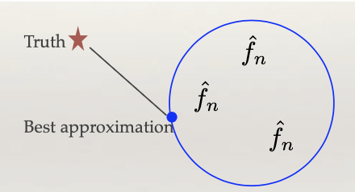
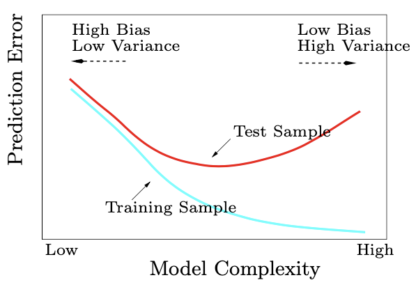

# 1.1.5. Bias and Variance Tradeoff

The bias-variance tradeoff is one of the most fundamental concepts in statistical learning, providing a mathematical framework for understanding the sources of prediction error and guiding model selection decisions. This tradeoff explains why complex models don't always perform better than simple ones and helps us understand the limitations of our learning algorithms.

## The Darts Game Analogy

To build intuition for the bias-variance tradeoff, let's examine the performance of two players in a darts game.


### Player Analysis

**Player 1**: Consistently throws darts close together, but they consistently miss the target by aiming at the wrong point. This player exhibits:
- **Low Variance**: Darts land close to each other (consistent)
- **High Bias**: Darts consistently miss the true target (systematic error)

**Player 2**: Throws show high variability, with darts landing both near and far from the target. However, these attempts are distributed around the correct target area:
- **High Variance**: Darts are scattered widely (inconsistent)
- **Low Bias**: Darts are centered around the true target (no systematic error)

**Mathematical Interpretation**: If we evaluate performance by calculating the expected squared distance from the true center, both players achieve similar overall performance:

```math
\text{MSE} = \text{Bias}^2 + \text{Variance}
```

This fundamental relationship holds in both darts and machine learning.

## Mathematical Foundation of Bias-Variance Tradeoff

### The Decomposition

In statistical learning, the total prediction error can be mathematically decomposed into three components:

```math
\mathbb{E}[(Y - \hat{f}(X))^2] = \underbrace{(\mathbb{E}[\hat{f}(X)] - f^*(X))^2}_{\text{Bias}^2} + \underbrace{\text{Var}(\hat{f}(X))}_{\text{Variance}} + \underbrace{\text{Var}(\epsilon)}_{\text{Irreducible Error}}
```

where:
- $`Y`$ is the true target value
- $`\hat{f}(X)`$ is our model's prediction
- $`f^*(X)`$ is the true optimal function (Bayes predictor)
- $`\epsilon`$ is the irreducible noise in the data

### Understanding Each Component

**Bias**: $`(\mathbb{E}[\hat{f}(X)] - f^*(X))^2`$
- Measures how far our model's average prediction is from the true function
- Represents systematic error that cannot be reduced by collecting more data
- Arises from model assumptions and limitations

**Variance**: $`\text{Var}(\hat{f}(X))`$
- Measures how much our model's predictions vary across different training sets
- Represents the sensitivity of our model to the specific training data
- Can be reduced by collecting more data or using regularization

**Irreducible Error**: $`\text{Var}(\epsilon)``
- Represents the inherent noise in the data-generating process
- Cannot be reduced by any model, regardless of complexity
- Sets a fundamental lower bound on prediction error

## Function Space Perspective



### The Function Space Constraint

When learning a regression or classification function, we must work within a predefined function space $`\mathcal{F}`$ (represented by the blue circle). This space may consist of:
- Linear functions: $`\mathcal{F} = \{f(x) = w^T x + b : w \in \mathbb{R}^p, b \in \mathbb{R}\}`$
- Polynomial functions: $`\mathcal{F} = \{f(x) = \sum_{j=0}^d \beta_j x^j : \beta_j \in \mathbb{R}\}`$
- Neural networks with fixed architecture
- Decision trees with limited depth

**Key Insight**: The "truth" $`f^*`$ may lie outside our chosen function space $`\mathcal{F}`$, implying that even with infinite data, we cannot perfectly capture it.

### Mathematical Characterization

Let $`f^*_{\mathcal{F}} = \arg\min_{f \in \mathcal{F}} \mathbb{E}[(Y - f(X))^2]`$ be the best possible function in our class.

**Bias**: The gap between the truth and the best approximation achievable within the function space:
```math
\text{Bias}^2 = \mathbb{E}[(\mathbb{E}[\hat{f}_n(X)] - f^*(X))^2]
```

**Variance**: The fluctuations of our learned function within the function space:
```math
\text{Variance} = \mathbb{E}[(\hat{f}_n(X) - \mathbb{E}[\hat{f}_n(X)])^2]
```

where $`\hat{f}_n`$ denotes the function learned from a training set of size $`n`$.

## Model Complexity and the Tradeoff

### Complexity Measures

Model complexity can be quantified in several ways:

1. **Number of Parameters**: $`p`$ (dimension of parameter space)
2. **Function Space Size**: $`|\mathcal{F}|`$ or VC dimension
3. **Flexibility**: Ability to fit complex patterns

**Examples**:
- Linear model with 2 predictors: $`p = 3`$ (low complexity)
- Linear model with 10 predictors: $`p = 11`$ (medium complexity)
- Polynomial model with degree 5: $`p = 6`$ (high complexity)

### The Fundamental Tradeoff

As model complexity increases, we observe:

```math
\text{Complexity} \uparrow \implies \begin{cases}
\text{Bias} \downarrow & \text{(better approximation)} \\
\text{Variance} \uparrow & \text{(more sensitive to data)}
\end{cases}
```

**Mathematical Intuition**:
- **Low Complexity**: Limited function space $`\mathcal{F}`$ leads to high bias but low variance
- **High Complexity**: Large function space $`\mathcal{F}`$ leads to low bias but high variance

### The U-Shaped Error Curve



The test error typically follows a U-shaped curve with respect to model complexity:

```math
\text{Test Error} = \text{Bias}^2 + \text{Variance} + \text{Irreducible Error}
```

**Optimal Complexity**: The sweet spot where the sum of bias and variance is minimized.

**Mathematical Analysis**: At the optimal point:
```math
\frac{d}{d\text{Complexity}}(\text{Bias}^2 + \text{Variance}) = 0
```

### The Double Descent Phenomenon

In modern machine learning, particularly with deep neural networks, researchers have observed a "double descent" curve:

```math
\text{Test Error} = \begin{cases}
\text{Classical U-shape} & \text{for low complexity} \\
\text{Second descent} & \text{for very high complexity}
\end{cases}
```

**Explanation**: When the number of parameters exceeds the number of training samples, models can achieve zero training error while still generalizing well, leading to a second minimum in test error.

## Practical Strategies for Managing the Tradeoff

### 1. Regularization

Regularization techniques add constraints to reduce model complexity:

**Ridge Regression (L2)**:
```math
\hat{\beta} = \arg\min_{\beta} \left\{ \frac{1}{n} \sum_{i=1}^n (y_i - x_i^T \beta)^2 + \lambda \sum_{j=1}^p \beta_j^2 \right\}
```

**Lasso (L1)**:
```math
\hat{\beta} = \arg\min_{\beta} \left\{ \frac{1}{n} \sum_{i=1}^n (y_i - x_i^T \beta)^2 + \lambda \sum_{j=1}^p |\beta_j| \right\}
```

**Effect**: Regularization reduces variance at the cost of increased bias.

### 2. Cross-Validation for Model Selection

Cross-validation helps find the optimal complexity:

```math
\text{CV}(\lambda) = \frac{1}{K} \sum_{k=1}^K \frac{1}{|V_k|} \sum_{i \in V_k} L(y_i, \hat{f}^{(-k)}_{\lambda}(x_i))
```

where $`\hat{f}^{(-k)}_{\lambda}`$ is trained on data excluding fold $`k`$ with regularization parameter $`\lambda`$.

### 3. Ensemble Methods

Ensemble methods combine multiple models to reduce variance:

**Bagging (Bootstrap Aggregating)**:
```math
\hat{f}_{\text{bag}}(x) = \frac{1}{B} \sum_{b=1}^B \hat{f}_b(x)
```

where $`\hat{f}_b`$ is trained on bootstrap sample $`b`$.

**Effect**: Averaging reduces variance while maintaining low bias.

### 4. Early Stopping

For iterative algorithms (e.g., gradient descent), stop training before convergence:

```math
\hat{f}_{\text{early}} = \hat{f}^{(t^*)} \quad \text{where } t^* = \arg\min_t \text{Validation Error}(t)
```

## Mathematical Analysis of the Tradeoff

### Bias-Variance Decomposition Derivation

Let's derive the bias-variance decomposition step by step:

```math
\begin{align}
\mathbb{E}[(Y - \hat{f}(X))^2] &= \mathbb{E}[(Y - f^*(X) + f^*(X) - \hat{f}(X))^2] \\
&= \mathbb{E}[(Y - f^*(X))^2] + \mathbb{E}[(f^*(X) - \hat{f}(X))^2] + 2\mathbb{E}[(Y - f^*(X))(f^*(X) - \hat{f}(X))]
\end{align}
```

Since $`Y - f^*(X) = \epsilon`$ (noise) and $`\epsilon`$ is independent of $`\hat{f}(X)`$, the cross-term vanishes:

```math
\mathbb{E}[(Y - \hat{f}(X))^2] = \mathbb{E}[\epsilon^2] + \mathbb{E}[(f^*(X) - \hat{f}(X))^2]
```

The second term can be further decomposed:

```math
\begin{align}
\mathbb{E}[(f^*(X) - \hat{f}(X))^2] &= \mathbb{E}[(f^*(X) - \mathbb{E}[\hat{f}(X)] + \mathbb{E}[\hat{f}(X)] - \hat{f}(X))^2] \\
&= \mathbb{E}[(f^*(X) - \mathbb{E}[\hat{f}(X)])^2] + \mathbb{E}[(\mathbb{E}[\hat{f}(X)] - \hat{f}(X))^2] \\
&= \text{Bias}^2 + \text{Variance}
\end{align}
```

### Complexity-Dependent Bounds

For many learning algorithms, we can derive complexity-dependent bounds:

```math
\mathbb{E}[\text{Test Error}] \leq \text{Training Error} + O\left(\sqrt{\frac{\text{Complexity}(\mathcal{F})}{n}}\right)
```

This bound shows that:
- More complex models require more data to control variance
- The optimal complexity depends on the sample size $`n`$

## Practical Guidelines

### When to Use Simple Models
- Limited training data ($`n \ll p`$)
- Need for interpretability
- Computational constraints
- Domain knowledge suggests simple relationships

### When to Use Complex Models
- Abundant training data ($`n \gg p`$)
- Complex underlying relationships
- Black-box predictions are acceptable
- Computational resources available

### Model Selection Strategy
1. **Start Simple**: Begin with linear models
2. **Increase Complexity**: Gradually add features or use more flexible models
3. **Monitor Validation Error**: Use cross-validation to find the sweet spot
4. **Consider Ensemble Methods**: Combine multiple models for better performance

## Summary

The bias-variance tradeoff provides a fundamental framework for understanding prediction error in statistical learning:

1. **Bias** represents systematic error due to model limitations
2. **Variance** represents random error due to sensitivity to training data
3. **Optimal Complexity** balances these competing sources of error
4. **Regularization** and **Ensemble Methods** help manage the tradeoff
5. **Cross-Validation** guides model selection in practice

Understanding this tradeoff is crucial for making informed decisions about model complexity, feature selection, and algorithm choice in real-world applications.
