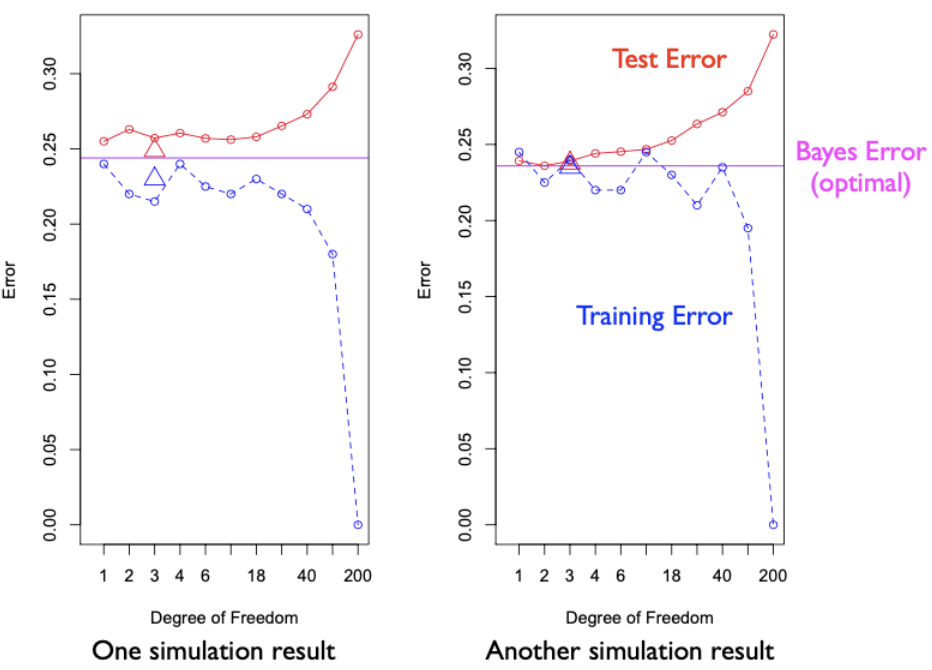
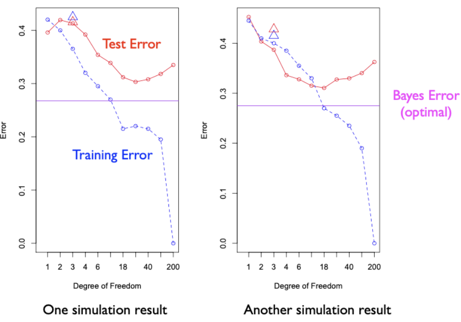

# 1.2.3. Compute Bayes Rule

The Bayes classification rule represents the theoretical optimal classifier - the best possible decision rule when we know the true data-generating process. Understanding how to derive and compute the Bayes rule is fundamental to statistical learning theory, as it provides a benchmark against which we can evaluate the performance of any learning algorithm.

## Probabilistic Model Specification

### Data Generating Process for Example 1

The Bayes classification rule is derived from Bayes' Theorem under a specific probabilistic model. For Example 1, we assume the following data-generating process:

```math
\begin{split}
Y &\sim \textsf{Bern}(p), \\
X \mid Y=0 &\sim \textsf{N}(\mu_0, \sigma^2 \mathbf{I}_2), \\
X \mid Y=1 &\sim \textsf{N}(\mu_1, \sigma^2 \mathbf{I}_2).
\end{split}
```

**Model Interpretation**:
- $`Y`$ is a Bernoulli random variable with parameter $`p`$, representing the class label
- $`X \mid Y=0`$ follows a bivariate normal distribution with mean $`\mu_0`$ and covariance $`\sigma^2 \mathbf{I}_2`$
- $`X \mid Y=1`$ follows a bivariate normal distribution with mean $`\mu_1`$ and covariance $`\sigma^2 \mathbf{I}_2`$

### Mixed Distribution Framework

The joint distribution of $`X`$ and $`Y`$ is neither purely discrete nor continuous, but a mixture:

**Discrete Component**: $`Y`$ is described by a probability mass function (PMF)
- $`P(Y=1) = p`$
- $`P(Y=0) = 1-p`$

**Continuous Component**: $`X`$ is described by a probability density function (PDF)
- $`f(x \mid Y=0) = \frac{1}{2\pi\sigma^2} \exp\left(-\frac{1}{2\sigma^2}\|x - \mu_0\|^2\right)`$
- $`f(x \mid Y=1) = \frac{1}{2\pi\sigma^2} \exp\left(-\frac{1}{2\sigma^2}\|x - \mu_1\|^2\right)`$

**Key Insight**: For discrete variables, we discuss probabilities of specific values (e.g., $`P(Y=1)`$). For continuous variables, the probability of any specific value is zero, so we work with densities and probabilities of intervals.

## Bayes Theorem and Conditional Probability

### The Fundamental Formula

Bayes' Theorem provides the foundation for computing the optimal classification rule. The conditional probability is calculated as the joint probability divided by the marginal probability:

```math
P(Y=1 \mid X=x) = \frac{P(Y=1, X=x)}{P(X=x)}
```

### Step-by-Step Derivation

**Step 1**: Express the joint probability using the chain rule:
```math
P(Y=1, X=x) = P(Y=1) \cdot P(X=x \mid Y=1)
```

**Step 2**: Use the law of total probability for the denominator:
```math
P(X=x) = P(Y=1, X=x) + P(Y=0, X=x) = P(Y=1) P(X=x \mid Y=1) + P(Y=0) P(X=x \mid Y=0)
```

**Step 3**: Combine to get the complete formula:
```math
\begin{split}
P(Y=1 \mid X=x) &= \frac{P(Y=1, X=x)}{P(X=x)} \\
&= \frac{P(Y=1, X=x)}{P(Y=1, X=x) + P(Y=0, X=x)} \\
&= \frac{P(Y=1) P(X=x \mid Y=1)}{P(Y=1) P(X=x \mid Y=1) + P(Y=0) P(X=x \mid Y=0)}
\end{split}
```

### Mathematical Simplification

Substituting the normal densities for $`X \mid Y`$ and simplifying algebraically:

```math
P(Y=1 \mid X=x) = \frac{p \cdot f(x \mid Y=1)}{p \cdot f(x \mid Y=1) + (1-p) \cdot f(x \mid Y=0)}
```

Plugging in the normal density functions and simplifying:

```math
P(Y=1 \mid X=x) = \left[ 1 + \exp \left\{ \frac{1}{2 \sigma^2} ( \| x- \mu_1\|^2 - \| x - \mu_0\|^2) - \log \frac{p}{1-p} \right\} \right]^{-1}
```

**Interpretation**: This is the sigmoid function applied to a quadratic form in $`x`$, which will lead to a linear decision boundary.

## Optimal Decision Rule: Bayes Classifier

### The Bayes Decision Rule

The optimal decision rule (Bayes rule) for binary classification is:

```math
\text{Predict } Y=1 \text{ if } P(Y=1 \mid X=x) > 0.5
```

This rule minimizes the expected 0-1 loss (misclassification error).

### Equivalent Formulation

The decision rule can be rewritten in terms of the log-odds:

```math
\frac{1}{2 \sigma^2} ( \| x- \mu_1\|^2 - \| x - \mu_0\|^2) < \log \frac{p}{1-p}
```

**Special Case**: If $`p=0.5`$ (equal class priors), then $`\log(p/(1-p))=0`$, and the rule simplifies to:

```math
\| x - \mu_1\|^2 < \| x - \mu_0\|^2
```

**Geometric Interpretation**: Assign $`x`$ to the class whose center it is closest to in Euclidean distance.

### Decision Boundary Analysis

The decision boundary is the set of points where $`P(Y=1 \mid X=x) = 0.5`$, or equivalently:

```math
\frac{1}{2 \sigma^2} ( \| x- \mu_1\|^2 - \| x - \mu_0\|^2) = \log \frac{p}{1-p}
```

## Linear Decision Boundary Derivation

### Algebraic Manipulation

The decision rule can be rewritten as a linear function of $`x`$:

```math
\begin{split}
\| x - \mu_1\|^2 - \| x - \mu_0\|^2 &= \| x\|^2 - 2 x^T \mu_1 + \| \mu_1\|^2 - ( \| x\|^2 - 2 x^T \mu_0 + \| \mu_0\|^2) \\
&= \| \mu_1\|^2 - \| \mu_0\|^2 - 2 x^T (\mu_1 - \mu_0)
\end{split}
```

### Linear Form

Substituting back into the decision rule:

```math
\| \mu_1\|^2 - \| \mu_0\|^2 - 2 x^T (\mu_1 - \mu_0) < 2\sigma^2 \log \frac{p}{1-p}
```

This can be written as:

```math
x^T (\mu_1 - \mu_0) > \frac{1}{2}(\| \mu_1\|^2 - \| \mu_0\|^2) - \sigma^2 \log \frac{p}{1-p}
```

**Linear Decision Boundary**: The optimal decision boundary for Example 1 is a hyperplane in $`\mathbb{R}^2`$.

### Geometric Interpretation

The decision boundary is perpendicular to the vector $`\mu_1 - \mu_0`$ (the line connecting the two class means) and passes through a point that depends on:
1. The squared norms of the class means
2. The class prior ratio
3. The noise variance

## Extension to Mixture Distributions (Example 2)

### Complex Data Generating Process

For Example 2, where $`Y=1`$ follows a mixture of 10 normal distributions, the derivation follows the same principles but with more complex class-conditional densities.

**Class 1 Data Generation**:
```math
X \mid Y=1 \sim \sum_{j=1}^{10} w_j \textsf{N}(\mu_{1j}, \sigma^2 \mathbf{I}_2)
```

**Class 0 Data Generation**:
```math
X \mid Y=0 \sim \sum_{j=1}^{10} w_j \textsf{N}(\mu_{0j}, \sigma^2 \mathbf{I}_2)
```

### Modified Bayes Rule

The Bayes rule is still based on comparing conditional probabilities:

```math
P(Y=1 \mid X=x) = \frac{p \cdot f(x \mid Y=1)}{p \cdot f(x \mid Y=1) + (1-p) \cdot f(x \mid Y=0)}
```

But now $`f(x \mid Y=1)`$ is the mixture density:

```math
f(x \mid Y=1) = \sum_{j=1}^{10} w_j \frac{1}{2\pi\sigma^2} \exp\left(-\frac{1}{2\sigma^2}\|x - \mu_{1j}\|^2\right)
```

### Non-Linear Decision Boundary

The resulting decision boundary is typically non-linear due to the complex mixture structure, making it challenging for linear methods to approximate well.

## Computational Implementation

### Algorithm for Bayes Rule

1. **Compute Class-Conditional Densities**: Calculate $`f(x \mid Y=0)`$ and $`f(x \mid Y=1)`$ for each test point
2. **Apply Bayes' Theorem**: Compute $`P(Y=1 \mid X=x)`$
3. **Make Decision**: Predict class 1 if $`P(Y=1 \mid X=x) > 0.5`$

### Example 1 Implementation

For the simple Gaussian case:
```python
def bayes_classifier(x, mu0, mu1, sigma2, p):
    # Compute class-conditional densities
    f0 = np.exp(-0.5 * np.sum((x - mu0)**2) / sigma2) / (2*np.pi*sigma2)
    f1 = np.exp(-0.5 * np.sum((x - mu1)**2) / sigma2) / (2*np.pi*sigma2)
    
    # Apply Bayes' theorem
    numerator = p * f1
    denominator = p * f1 + (1-p) * f0
    
    # Return probability and decision
    prob = numerator / denominator
    decision = 1 if prob > 0.5 else 0
    
    return prob, decision
```

### Example 2 Implementation

For the mixture case, we need to sum over mixture components:
```python
def mixture_bayes_classifier(x, mu0_list, mu1_list, sigma2, p, weights):
    # Compute mixture densities
    f0 = sum(w * np.exp(-0.5 * np.sum((x - mu)**2) / sigma2) 
             for w, mu in zip(weights, mu0_list)) / (2*np.pi*sigma2)
    f1 = sum(w * np.exp(-0.5 * np.sum((x - mu)**2) / sigma2) 
             for w, mu in zip(weights, mu1_list)) / (2*np.pi*sigma2)
    
    # Apply Bayes' theorem
    numerator = p * f1
    denominator = p * f1 + (1-p) * f0
    
    prob = numerator / denominator
    decision = 1 if prob > 0.5 else 0
    
    return prob, decision
```

## Theoretical Properties

### Optimality

**Theorem**: The Bayes classifier minimizes the expected 0-1 loss:
```math
f^* = \arg\min_f \mathbb{E}[\mathbb{I}[Y \neq f(X)]]
```

**Proof**: For any classifier $`f`$,
```math
\mathbb{E}[\mathbb{I}[Y \neq f(X)]] = \mathbb{E}_X[P(Y \neq f(X) \mid X)]
```

The optimal choice for each $`x`$ is to predict the most likely class:
```math
f^*(x) = \arg\max_y P(Y = y \mid X = x)
```

### Bayes Error Rate

The Bayes error rate is the minimum possible error rate:
```math
R^* = \mathbb{E}_X[\min\{P(Y=0 \mid X), P(Y=1 \mid X)\}]
```

This provides a fundamental lower bound on the performance of any classifier.

## 1.2.4. Discussion

Our comprehensive simulation study provides concrete evidence of the bias-variance tradeoff and demonstrates the theoretical concepts in practice. We provide scripts for data generation, performance evaluation for kNN, linear regression, and the optimal Bayes rule, along with visualization tools.

### Example 1: Linear Decision Boundary

Let's examine the performance plots derived from datasets generated by Example 1. The x-axis represents the degree of freedom (model complexity).



**Performance Analysis**:

**kNN Performance**:
- **Red curve**: Test error for different $`k`$ values
- **Blue dashed line**: Training error for kNN
- **Complexity mapping**: $`k=1`$ corresponds to DF ≈ 200, $`k=200`$ corresponds to DF ≈ 1

**Linear Regression Performance**:
- **Red triangle**: Test error for linear model
- **Blue triangle**: Training error for linear model
- **Fixed complexity**: DF = 3 (2 slope parameters + 1 intercept)

**Bayes Performance**:
- **Purple line**: Bayes error rate (theoretical optimum)
- **No training**: Computed using true data-generating process

**Key Observations**:
1. **Comparable Performance**: Linear model and kNN with appropriate $`k`$ perform similarly to Bayes rule
2. **Linear Assumption Valid**: The optimal decision boundary is indeed linear for Example 1
3. **Bias-Variance Tradeoff**: As complexity increases, training error decreases while test error shows U-shaped pattern

### Example 2: Non-Linear Decision Boundary

The second example reveals a different story, with a wider performance gap between methods.



**Performance Analysis**:

**Linear Regression Limitations**:
- **High Bias**: Linear model cannot capture the complex non-linear decision boundary
- **Performance Gap**: Significant difference from Bayes optimal performance

**kNN Performance**:
- **U-shaped Test Error**: Optimal $`k`$ exists in the middle range
- **Better Approximation**: Can capture non-linear patterns better than linear regression
- **Performance Gap**: Still exists between kNN and Bayes rule due to finite sample effects

**Cross-Validation Reality Check**:
The "perfect" performance at optimal $`k`$ is not achievable in practice because:
1. **Unknown Optimal $`k`$**: We don't have access to test data during model selection
2. **Cross-Validation**: Provides a more realistic estimate of generalization performance
3. **Implementation**: The cvKNN technique will be explored in upcoming assignments

### Bias-Variance Analysis Summary

**Linear Regression**:
- **Low Variance**: Only 3 parameters to estimate in 2D setting
- **High Bias**: When true function is non-linear (Example 2)
- **Assumption**: Strong linear relationship between features and target

**kNN**:
- **Low Bias**: Can approximate any function given sufficient data
- **High Variance**: Sensitive to training data, especially for small $`k`$
- **Assumption**: Local smoothness (nearby points have similar responses)

**Consistency Requirements**:
For kNN to be consistent (converge to Bayes rule):
- $`k \rightarrow \infty`$ as $`n \rightarrow \infty`$
- $`k/n \rightarrow 0`$ as $`n \rightarrow \infty`$

This ensures the neighborhood becomes smaller and more localized as sample size grows.

### Practical Implications

**Model Selection**: The simulation demonstrates the importance of choosing appropriate model complexity based on:
1. **Data Characteristics**: Linear vs. non-linear relationships
2. **Sample Size**: More data allows for more complex models
3. **Domain Knowledge**: Understanding the underlying data-generating process

**Performance Evaluation**: Cross-validation provides realistic estimates of generalization performance, essential for practical model selection.

**Theoretical Foundation**: Understanding the Bayes rule helps us:
1. **Set Performance Benchmarks**: Know the best possible performance
2. **Guide Model Selection**: Choose methods appropriate for the data structure
3. **Interpret Results**: Understand why certain methods perform well or poorly

This comprehensive analysis bridges theoretical concepts with practical implementation, providing a solid foundation for understanding the fundamental principles of statistical learning.
