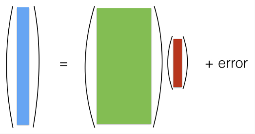
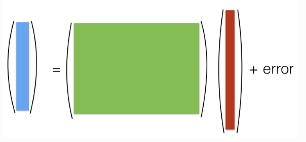
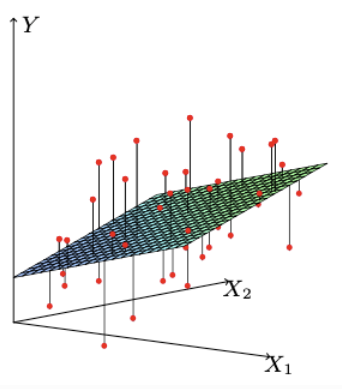

# 2. Linear Regression: Foundation of Statistical Learning

## 2.1. Multiple Linear Regression: A Comprehensive Guide

Multiple linear regression (MLR) is the cornerstone of statistical learning and predictive modeling. It provides a powerful yet interpretable framework for understanding relationships between variables and making predictions. This section provides a deep dive into the theory, implementation, and practical considerations of MLR.

### What is Multiple Linear Regression?

Multiple linear regression models the relationship between a single response variable and multiple predictor variables using a linear function. The model assumes that the response variable can be expressed as a weighted sum of the predictors plus some random error.

**Key Insight**: Despite its name, "linear" refers to linearity in the parameters, not necessarily in the predictor variables themselves. This allows for polynomial terms, interactions, and transformations while maintaining the linear framework.

### Why Study Multiple Linear Regression?

1. **Foundation**: Many advanced methods build upon linear regression concepts
2. **Interpretability**: Coefficients have clear, meaningful interpretations
3. **Computational Efficiency**: Fast to fit and make predictions
4. **Statistical Theory**: Well-understood properties and inference methods
5. **Benchmark**: Often serves as a baseline for comparing more complex models

## 2.1.1. Mathematical Foundation

### The Linear Model

The general form of the multiple linear regression model is:

```math
y = \beta_0 + \beta_1 x_1 + \beta_2 x_2 + \cdots + \beta_p x_p + \varepsilon
```

where:
- $`y`$ is the response (dependent) variable
- $`x_1, x_2, \ldots, x_p`$ are the predictor (independent) variables
- $`\beta_0`$ is the intercept (baseline value when all predictors are zero)
- $`\beta_1, \beta_2, \ldots, \beta_p`$ are the regression coefficients (slopes)
- $`\varepsilon`$ is the error term, representing unmodeled variation

### Understanding the Components

**Intercept ($`\beta_0`$)**:
- Represents the expected value of $`y`$ when all predictors are zero
- May or may not have practical interpretation depending on the data
- Can be eliminated by centering predictors: $`x_i' = x_i - \bar{x}_i`$

**Regression Coefficients ($`\beta_j`$)**:
- $`\beta_j`$ represents the expected change in $`y`$ for a one-unit increase in $`x_j`$, holding all other predictors constant
- This is the **partial effect** of $`x_j`$ on $`y`$
- Units: change in $`y`$ per unit change in $`x_j`$

**Error Term ($`\varepsilon`$)**:
- Captures all variation in $`y`$ not explained by the linear combination of predictors
- Assumed to be random with mean zero and constant variance
- Represents measurement error, omitted variables, and model misspecification

### Assumptions of Linear Regression

For valid inference and optimal properties, we typically assume:

1. **Linearity**: $`E[y \mid x_1, \ldots, x_p] = \beta_0 + \beta_1 x_1 + \cdots + \beta_p x_p`$
2. **Independence**: Observations are independent of each other
3. **Homoscedasticity**: $`\text{Var}(\varepsilon_i) = \sigma^2`$ for all $`i`$
4. **Normality**: $`\varepsilon_i \sim N(0, \sigma^2)`$ (for inference)
5. **No Multicollinearity**: Predictors are not perfectly correlated

## 2.1.2. Matrix Representation: The Power of Linear Algebra

### Why Use Matrix Notation?

Matrix notation provides several advantages:
- **Compactness**: Express complex operations in simple formulas
- **Computational Efficiency**: Leverage optimized linear algebra libraries
- **Theoretical Clarity**: Reveal geometric and algebraic insights
- **Generalization**: Extends naturally to more complex models

### The Matrix Formulation

For $`n`$ observations and $`p`$ predictors, we can write the model as:

```math
\mathbf{y} = \mathbf{X}\boldsymbol{\beta} + \boldsymbol{\varepsilon}
```

where:
- $`\mathbf{y}`$ is an $`n \times 1`$ vector of observed responses
- $`\mathbf{X}`$ is the $`n \times (p+1)`$ design matrix (including intercept column)
- $`\boldsymbol{\beta}`$ is a $`(p+1) \times 1`$ vector of coefficients
- $`\boldsymbol{\varepsilon}`$ is an $`n \times 1`$ vector of errors

### Detailed Matrix Structure

**Response Vector**:
```math
\mathbf{y} = \begin{pmatrix} y_1 \\ y_2 \\ \vdots \\ y_n \end{pmatrix}
```

**Design Matrix**:
```math
\mathbf{X} = \begin{pmatrix} 
1 & x_{11} & x_{12} & \cdots & x_{1p} \\
1 & x_{21} & x_{22} & \cdots & x_{2p} \\
\vdots & \vdots & \vdots & \ddots & \vdots \\
1 & x_{n1} & x_{n2} & \cdots & x_{np}
\end{pmatrix}
```

**Coefficient Vector**:
```math
\boldsymbol{\beta} = \begin{pmatrix} \beta_0 \\ \beta_1 \\ \vdots \\ \beta_p \end{pmatrix}
```

**Error Vector**:
```math
\boldsymbol{\varepsilon} = \begin{pmatrix} \varepsilon_1 \\ \varepsilon_2 \\ \vdots \\ \varepsilon_n \end{pmatrix}
```

### Complete Matrix Equation

```math
\begin{pmatrix} y_1 \\ y_2 \\ \vdots \\ y_n \end{pmatrix} = 
\begin{pmatrix} 
1 & x_{11} & x_{12} & \cdots & x_{1p} \\
1 & x_{21} & x_{22} & \cdots & x_{2p} \\
\vdots & \vdots & \vdots & \ddots & \vdots \\
1 & x_{n1} & x_{n2} & \cdots & x_{np}
\end{pmatrix}
\begin{pmatrix} \beta_0 \\ \beta_1 \\ \vdots \\ \beta_p \end{pmatrix} +
\begin{pmatrix} \varepsilon_1 \\ \varepsilon_2 \\ \vdots \\ \varepsilon_n \end{pmatrix}
```

### Understanding the Design Matrix

**Column Structure**:
- **First column**: All ones (for the intercept term)
- **Remaining columns**: Observed values of each predictor
- **Row $`i`$**: Values for observation $`i`$ across all predictors

**Matrix Dimensions**:
- $`n`$ rows (one per observation)
- $`p+1`$ columns ($`p`$ predictors plus intercept)
- Total elements: $`n \times (p+1)`$

### Classical vs. Modern Settings

**Classical Setting ($`n \gg p`$):**
- More observations than predictors
- Design matrix is "tall and skinny"
- $`\mathbf{X}^T\mathbf{X}`$ is typically invertible
- Unique solution exists
- Well-understood statistical properties



*Figure: Classical setting with many observations and few predictors*

**Modern Setting ($`p \gg n`$):**
- More predictors than observations
- Design matrix is "short and fat"
- $`\mathbf{X}^T\mathbf{X}`$ is not invertible
- Infinitely many solutions exist
- Requires regularization or feature selection



*Figure: Modern setting with many predictors and few observations*

**Example**: In genomics, we might have 100 patients ($`n=100`$) but 20,000 gene expressions ($`p=20,000`$).

## 2.1.3. Least Squares Estimation: The Foundation

### The Least Squares Principle

The most common method for estimating regression coefficients is **least squares**. The idea is to find the coefficient values that minimize the sum of squared differences between observed and predicted values.

**Objective Function**:
```math
\text{RSS}(\boldsymbol{\beta}) = \sum_{i=1}^n (y_i - \hat{y}_i)^2 = \sum_{i=1}^n \left(y_i - \beta_0 - \sum_{j=1}^p \beta_j x_{ij}\right)^2
```

where:
- $`\text{RSS}`$ = Residual Sum of Squares
- $`y_i`$ = observed value for observation $`i`$
- $`\hat{y}_i`$ = predicted value for observation $`i`$

### Matrix Form of RSS

In matrix notation, the RSS becomes:
```math
\text{RSS}(\boldsymbol{\beta}) = \|\mathbf{y} - \mathbf{X}\boldsymbol{\beta}\|^2 = (\mathbf{y} - \mathbf{X}\boldsymbol{\beta})^T(\mathbf{y} - \mathbf{X}\boldsymbol{\beta})
```

### Geometric Interpretation

**Vector Space View**:
- $`\mathbf{y}`$ is a point in $`\mathbb{R}^n`$
- $`\mathbf{X}\boldsymbol{\beta}`$ lies in the column space of $`\mathbf{X}`$
- The residual $`\mathbf{y} - \mathbf{X}\boldsymbol{\beta}`$ is the vector from the prediction to the observed value
- Least squares finds the point in the column space closest to $`\mathbf{y}`$

**2D Example**: For simple linear regression, we find the line that minimizes the sum of squared vertical distances from points to the line.



*Figure: Least Squares Principle—minimizing the sum of squared vertical distances from points to the regression line*

### Why Squared Error?

**Mathematical Advantages**:
1. **Differentiability**: Smooth function, easy to optimize
2. **Closed-form solution**: Leads to analytical solution
3. **Statistical properties**: Optimal under normality assumption
4. **Computational efficiency**: Fast algorithms available

**Alternative Loss Functions**:
- **Absolute error**: $`\sum |y_i - \hat{y}_i|`$ (robust to outliers)
- **Huber loss**: Combines squared and absolute error
- **Quantile loss**: For quantile regression

## 2.1.4. The Normal Equation: Analytical Solution

### Derivation of the Normal Equation

To find the minimum of RSS, we take the derivative with respect to $`\boldsymbol{\beta}`$ and set it to zero:

**Step 1**: Expand the RSS
```math
\text{RSS}(\boldsymbol{\beta}) = \mathbf{y}^T\mathbf{y} - 2\boldsymbol{\beta}^T\mathbf{X}^T\mathbf{y} + \boldsymbol{\beta}^T\mathbf{X}^T\mathbf{X}\boldsymbol{\beta}
```

**Step 2**: Take the derivative
```math
\frac{\partial \text{RSS}}{\partial \boldsymbol{\beta}} = -2\mathbf{X}^T\mathbf{y} + 2\mathbf{X}^T\mathbf{X}\boldsymbol{\beta}
```

**Step 3**: Set to zero and solve
```math
-2\mathbf{X}^T\mathbf{y} + 2\mathbf{X}^T\mathbf{X}\boldsymbol{\beta} = \mathbf{0}
```

**Step 4**: Rearrange to get the normal equation
```math
\mathbf{X}^T\mathbf{X}\boldsymbol{\beta} = \mathbf{X}^T\mathbf{y}
```

### The Least Squares Solution

If $`\mathbf{X}^T\mathbf{X}`$ is invertible, the unique solution is:
```math
\hat{\boldsymbol{\beta}} = (\mathbf{X}^T\mathbf{X})^{-1}\mathbf{X}^T\mathbf{y}
```

**Components**:
- $`\mathbf{X}^T\mathbf{X}`$: Gram matrix (contains inner products of predictor columns)
- $`\mathbf{X}^T\mathbf{y}`$: Cross-product of predictors with response
- $`(\mathbf{X}^T\mathbf{X})^{-1}`$: Inverse of Gram matrix

### Understanding the Solution

**Geometric Interpretation**:
- $`\mathbf{X}^T\mathbf{X}`$ measures the "spread" of the predictors
- $`\mathbf{X}^T\mathbf{y}`$ measures the "alignment" between predictors and response
- The solution finds the optimal linear combination of predictors

**Statistical Interpretation**:
- $`\hat{\boldsymbol{\beta}}`$ is the best linear unbiased estimator (BLUE) under Gauss-Markov assumptions
- The solution minimizes both bias and variance among linear estimators

### Computational Implementation

See the complete implementation in [`code/least_squares_estimation.py`](code/least_squares_estimation.py) which demonstrates least squares estimation using the normal equation.

### Numerical Stability Considerations

**Potential Issues**:
1. **Near-singular $`\mathbf{X}^T\mathbf{X}`$**: Can cause numerical instability
2. **Large condition number**: Small changes in data cause large changes in estimates
3. **Computational complexity**: $`O(p^3)`$ for matrix inversion

**Solutions**:
1. **QR decomposition**: More numerically stable
2. **Singular value decomposition (SVD)**: Handles rank-deficient cases
3. **Regularization**: Adds stability (ridge regression)

## 2.1.5. Fitted Values, Residuals, and Model Diagnostics

### Fitted Values

Once we have $`\hat{\boldsymbol{\beta}}`$, we can compute fitted values:
```math
\hat{\mathbf{y}} = \mathbf{X}\hat{\boldsymbol{\beta}}
```

**Properties**:
- $`\hat{\mathbf{y}}`$ lies in the column space of $`\mathbf{X}`$
- $`\hat{\mathbf{y}}`$ is the orthogonal projection of $`\mathbf{y}`$ onto the column space
- $`\hat{\mathbf{y}}`$ minimizes the distance from $`\mathbf{y}`$ to the column space

### Residuals

Residuals are the differences between observed and fitted values:
```math
\mathbf{r} = \mathbf{y} - \hat{\mathbf{y}} = \mathbf{y} - \mathbf{X}\hat{\boldsymbol{\beta}}
```

**Properties**:
- $`\mathbf{r}`$ is orthogonal to the column space of $`\mathbf{X}`$
- $`\sum_{i=1}^n r_i = 0`$ (if intercept is included)
- $`\sum_{i=1}^n r_i x_{ij} = 0`$ for all $`j`$ (orthogonality conditions)

### Residual Sum of Squares (RSS)

```math
\text{RSS} = \|\mathbf{r}\|^2 = \mathbf{r}^T\mathbf{r} = \sum_{i=1}^n r_i^2
```

**Degrees of Freedom**:
- Total degrees of freedom: $`n`$
- Model degrees of freedom: $`p+1`$ (number of parameters)
- Residual degrees of freedom: $`n - p - 1`$

### Error Variance Estimation

The error variance $`\sigma^2`$ is estimated by:
```math
\hat{\sigma}^2 = \frac{\text{RSS}}{n - p - 1} = \frac{\|\mathbf{r}\|^2}{n - p - 1}
```

**Why $`n - p - 1`$?**
- Each parameter estimated reduces degrees of freedom
- We need at least $`p+1`$ observations to estimate $`p+1`$ parameters
- The denominator ensures unbiased estimation

### Comprehensive Implementation

See the complete implementation in [`code/linear_regression_analysis.py`](code/linear_regression_analysis.py) which demonstrates complete linear regression analysis including coefficient estimation, standard errors, and goodness-of-fit measures.

### Model Diagnostics

**Residual Analysis**:

See the complete implementation in [`code/diagnostic_plots.py`](code/diagnostic_plots.py) which creates diagnostic plots for linear regression including residuals vs fitted, Q-Q plots, scale-location plots, and residuals vs leverage.

## 2.1.6. Statistical Inference and Hypothesis Testing

### Coefficient Inference

Under the normality assumption, the least squares estimator follows:
```math
\hat{\boldsymbol{\beta}} \sim N(\boldsymbol{\beta}, \sigma^2(\mathbf{X}^T\mathbf{X})^{-1})
```

**Individual Coefficient Tests**:
For testing $`H_0: \beta_j = 0`$ vs $`H_1: \beta_j \neq 0`$:
```math
t_j = \frac{\hat{\beta}_j}{\text{SE}(\hat{\beta}_j)} \sim t_{n-p-1}
```

where:
```math
\text{SE}(\hat{\beta}_j) = \sqrt{\hat{\sigma}^2 [(\mathbf{X}^T\mathbf{X})^{-1}]_{jj}}
```

### Confidence Intervals

A $`100(1-\alpha)\%`$ confidence interval for $`\beta_j`$ is:
```math
\hat{\beta}_j \pm t_{\alpha/2, n-p-1} \cdot \text{SE}(\hat{\beta}_j)
```

### F-Test for Overall Model

Test $`H_0: \beta_1 = \beta_2 = \cdots = \beta_p = 0`$ vs $`H_1: \text{at least one } \beta_j \neq 0`$:
```math
F = \frac{(\text{TSS} - \text{RSS})/p}{\text{RSS}/(n-p-1)} \sim F_{p, n-p-1}
```

### Implementation of Statistical Tests

See the complete implementation in [`code/statistical_inference.py`](code/statistical_inference.py) which performs statistical inference including confidence intervals, hypothesis tests, and F-tests for linear regression.

## 2.1.7. Model Assessment and Validation

### Goodness of Fit Measures

**R-squared ($`R^2`$)**:
```math
R^2 = 1 - \frac{\text{RSS}}{\text{TSS}} = \frac{\text{SSR}}{\text{TSS}}
```

where:
- $`\text{TSS} = \sum_{i=1}^n (y_i - \bar{y})^2`$ (Total Sum of Squares)
- $`\text{SSR} = \sum_{i=1}^n (\hat{y}_i - \bar{y})^2`$ (Sum of Squares Regression)

**Interpretation**: $`R^2`$ is the proportion of variance in $`y`$ explained by the model.

**Adjusted R-squared**:
```math
R^2_{adj} = 1 - \frac{\text{RSS}/(n-p-1)}{\text{TSS}/(n-1)} = 1 - (1-R^2)\frac{n-1}{n-p-1}
```

**Interpretation**: Penalizes for model complexity, more appropriate for model comparison.

### Cross-Validation

See the complete implementation in [`code/cross_validation_assessment.py`](code/cross_validation_assessment.py) which demonstrates cross-validation assessment for linear regression using scikit-learn.

## 2.1.8. Practical Considerations and Best Practices

### Data Preprocessing

**Centering and Scaling**:

See the complete implementation in [`code/data_preprocessing.py`](code/data_preprocessing.py) which shows data preprocessing techniques including centering and scaling for linear regression.

### Handling Multicollinearity

**Variance Inflation Factor (VIF)**:

See the complete implementation in [`code/multicollinearity_check.py`](code/multicollinearity_check.py) which computes Variance Inflation Factors (VIF) to detect multicollinearity.

### Model Selection

**Stepwise Selection**:

See the complete implementation in [`code/forward_selection.py`](code/forward_selection.py) which implements forward stepwise selection for variable selection in linear regression.

## 2.1.9. Advanced Topics

### Ridge Regression (L2 Regularization)

When $`\mathbf{X}^T\mathbf{X}`$ is near-singular, we can add regularization:
```math
\hat{\boldsymbol{\beta}}_{ridge} = \arg\min_{\boldsymbol{\beta}} \left\{ \|\mathbf{y} - \mathbf{X}\boldsymbol{\beta}\|^2 + \lambda \|\boldsymbol{\beta}\|^2 \right\}
```

**Solution**:
```math
\hat{\boldsymbol{\beta}}_{ridge} = (\mathbf{X}^T\mathbf{X} + \lambda\mathbf{I})^{-1}\mathbf{X}^T\mathbf{y}
```

### Lasso Regression (L1 Regularization)

For feature selection:
```math
\hat{\boldsymbol{\beta}}_{lasso} = \arg\min_{\boldsymbol{\beta}} \left\{ \|\mathbf{y} - \mathbf{X}\boldsymbol{\beta}\|^2 + \lambda \|\boldsymbol{\beta}\|_1 \right\}
```

### Polynomial Regression

Extend linear regression to capture non-linear relationships:

See the complete implementation in [`code/polynomial_regression.py`](code/polynomial_regression.py) which demonstrates polynomial regression to capture non-linear relationships.

## 2.1.10. Summary and Key Takeaways

### What We've Learned

1. **Mathematical Foundation**: Linear regression models relationships using linear combinations of predictors
2. **Matrix Formulation**: Compact representation enabling efficient computation and theoretical insights
3. **Least Squares**: Optimal estimation method under standard assumptions
4. **Statistical Inference**: Hypothesis testing and confidence intervals for coefficients
5. **Model Assessment**: R-squared, cross-validation, and diagnostic plots
6. **Practical Considerations**: Data preprocessing, multicollinearity, and model selection

### Key Properties

**Optimality**: Under Gauss-Markov assumptions, least squares estimators are BLUE (Best Linear Unbiased Estimators)

**Interpretability**: Coefficients represent partial effects, holding other variables constant

**Flexibility**: Can handle polynomial terms, interactions, and transformations while maintaining linear framework

**Computational Efficiency**: Fast to fit and make predictions, even with large datasets

### When to Use Linear Regression

**Appropriate When**:
- Relationship between predictors and response is approximately linear
- Predictors are not highly correlated
- Sample size is sufficient relative to number of predictors
- Interpretability is important

**Consider Alternatives When**:
- Strong non-linear relationships exist
- High-dimensional data with many predictors
- Complex interaction patterns
- Non-Gaussian error distributions

### Next Steps

This foundation in linear regression prepares us for:
1. **Generalized Linear Models**: Extending to non-Gaussian responses
2. **Regularization Methods**: Ridge, Lasso, and Elastic Net
3. **Non-linear Methods**: Polynomial regression, splines, and kernel methods
4. **Advanced Topics**: Mixed models, time series, and causal inference

Linear regression remains one of the most important tools in statistical learning, providing both practical utility and theoretical insights that extend to more complex modeling approaches.
