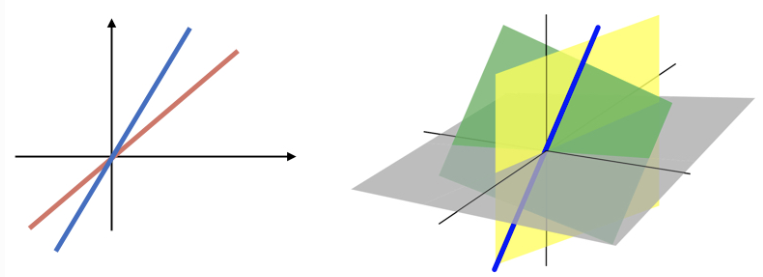

# 2.2. Geometric Interpretation: The Visual Foundation of Linear Regression

The geometric interpretation of least squares provides a powerful visual and mathematical framework for understanding linear regression. Instead of focusing on the $`(p+1)`$-dimensional feature space, we work in the $`n`$-dimensional space of observations, where each data point is represented as a vector. This perspective reveals the fundamental structure of linear regression and helps us understand concepts like projection, orthogonality, and the coefficient of determination.

## 2.2.1. Vector Spaces: The Mathematical Foundation

### What is a Vector Space?

A vector space is a mathematical structure that provides the foundation for understanding linear regression geometrically. It's a collection of objects (vectors) that can be added together and multiplied by scalars while satisfying certain axioms.

**Key Properties of Vector Spaces**:
1. **Closure under addition**: Adding two vectors gives another vector
2. **Closure under scalar multiplication**: Multiplying a vector by a scalar gives another vector
3. **Associative and commutative properties**: Vector addition behaves like regular addition
4. **Distributive properties**: Scalar multiplication distributes over vector addition
5. **Identity elements**: Zero vector and scalar identity (1)

### Understanding Vectors

**Definition**: A vector is an ordered list of numbers that can be visualized as:
- A point in space
- An arrow from the origin to that point
- A directed line segment

**Notation**: We typically write vectors as column vectors:
```math
\mathbf{v} = \begin{pmatrix} v_1 \\ v_2 \\ \vdots \\ v_n \end{pmatrix}
```

**Dimensions**: Vectors can be:
- **2D**: $`\mathbf{v} = \begin{pmatrix} x \\ y \end{pmatrix}`$ (points in a plane)
- **3D**: $`\mathbf{v} = \begin{pmatrix} x \\ y \\ z \end{pmatrix}`$ (points in space)
- **nD**: $`\mathbf{v} = \begin{pmatrix} v_1 \\ v_2 \\ \vdots \\ v_n \end{pmatrix}`$ (points in n-dimensional space)

### Vector Operations

**Vector Addition**:
```math
\mathbf{a} + \mathbf{b} = \begin{pmatrix} a_1 \\ a_2 \\ \vdots \\ a_n \end{pmatrix} + \begin{pmatrix} b_1 \\ b_2 \\ \vdots \\ b_n \end{pmatrix} = \begin{pmatrix} a_1 + b_1 \\ a_2 + b_2 \\ \vdots \\ a_n + b_n \end{pmatrix}
```

**Scalar Multiplication**:
```math
c \mathbf{a} = c \begin{pmatrix} a_1 \\ a_2 \\ \vdots \\ a_n \end{pmatrix} = \begin{pmatrix} c a_1 \\ c a_2 \\ \vdots \\ c a_n \end{pmatrix}
```

**Geometric Interpretation**:
- **Addition**: Move from the tip of one vector to the tip of another
- **Scalar multiplication**: Scale the length of a vector by a factor

### Example: Vector Operations in Practice

```math
2 \begin{pmatrix} 1 \\ 2 \\ 0 \end{pmatrix} + 3 \begin{pmatrix} 3 \\ 1 \\ 1 \end{pmatrix} = \begin{pmatrix} 2 \\ 4 \\ 0 \end{pmatrix} + \begin{pmatrix} 9 \\ 3 \\ 3 \end{pmatrix} = \begin{pmatrix} 11 \\ 7 \\ 3 \end{pmatrix}
```

**What this means**:
- Scale the first vector by 2: $`\begin{pmatrix} 1 \\ 2 \\ 0 \end{pmatrix} \rightarrow \begin{pmatrix} 2 \\ 4 \\ 0 \end{pmatrix}`$
- Scale the second vector by 3: $`\begin{pmatrix} 3 \\ 1 \\ 1 \end{pmatrix} \rightarrow \begin{pmatrix} 9 \\ 3 \\ 3 \end{pmatrix}`$
- Add the scaled vectors component-wise

### Python Implementation: Vector Operations

```python
import numpy as np
import matplotlib.pyplot as plt
from mpl_toolkits.mplot3d import Axes3D

def demonstrate_vector_operations():
    """Demonstrate basic vector operations"""
    
    # Define vectors
    a = np.array([1, 2, 0])
    b = np.array([3, 1, 1])
    
    # Scalar multiplication
    scaled_a = 2 * a
    scaled_b = 3 * b
    
    # Vector addition
    result = scaled_a + scaled_b
    
    print("Vector a:", a)
    print("Vector b:", b)
    print("2a:", scaled_a)
    print("3b:", scaled_b)
    print("2a + 3b:", result)
    
    # Vector norms (lengths)
    norm_a = np.linalg.norm(a)
    norm_b = np.linalg.norm(b)
    norm_result = np.linalg.norm(result)
    
    print(f"\nNorms:")
    print(f"||a|| = {norm_a:.3f}")
    print(f"||b|| = {norm_b:.3f}")
    print(f"||2a + 3b|| = {norm_result:.3f}")
    
    return a, b, result

# Run demonstration
a, b, result = demonstrate_vector_operations()

# Visualize in 3D
def plot_vectors_3d(a, b, result):
    """Plot vectors in 3D space"""
    fig = plt.figure(figsize=(12, 8))
    ax = fig.add_subplot(111, projection='3d')
    
    # Plot vectors as arrows from origin
    ax.quiver(0, 0, 0, a[0], a[1], a[2], color='blue', arrow_length_ratio=0.1, label='a')
    ax.quiver(0, 0, 0, b[0], b[1], b[2], color='red', arrow_length_ratio=0.1, label='b')
    ax.quiver(0, 0, 0, result[0], result[1], result[2], color='green', arrow_length_ratio=0.1, label='2a + 3b')
    
    # Plot scaled vectors
    ax.quiver(0, 0, 0, 2*a[0], 2*a[1], 2*a[2], color='lightblue', alpha=0.5, arrow_length_ratio=0.1, label='2a')
    ax.quiver(0, 0, 0, 3*b[0], 3*b[1], 3*b[2], color='lightcoral', alpha=0.5, arrow_length_ratio=0.1, label='3b')
    
    # Set labels and limits
    ax.set_xlabel('X')
    ax.set_ylabel('Y')
    ax.set_zlabel('Z')
    ax.set_title('Vector Operations in 3D Space')
    ax.legend()
    
    # Set equal aspect ratio
    max_range = max(result)
    ax.set_xlim([-max_range, max_range])
    ax.set_ylim([-max_range, max_range])
    ax.set_zlim([-max_range, max_range])
    
    plt.show()

# Create visualization
plot_vectors_3d(a, b, result)
```

### Linear Subspaces: The Building Blocks

**Definition**: A linear subspace is a subset of a vector space that is closed under vector addition and scalar multiplication.

**Formal Definition**: A subset $`S`$ of $`\mathbb{R}^n`$ is a linear subspace if:

1. **Zero vector**: $`\mathbf{0} \in S`$ (contains the origin)
2. **Closure under addition**: If $`\mathbf{u}, \mathbf{v} \in S`$, then $`\mathbf{u} + \mathbf{v} \in S`$
3. **Closure under scalar multiplication**: If $`\mathbf{u} \in S`$ and $`c`$ is a scalar, then $`c\mathbf{u} \in S``

**Key Properties**:
- Always contains the origin (zero vector)
- Dimension is the number of linearly independent vectors needed to span it
- In $`\mathbb{R}^2`$: subspaces are lines through the origin
- In $`\mathbb{R}^3`$: subspaces can be lines or planes through the origin

### Examples of Linear Subspaces

**1D Subspace (Line)**:
```math
S = \{ c \begin{pmatrix} 1 \\ 2 \end{pmatrix} : c \in \mathbb{R} \}
```

**2D Subspace (Plane)**:
```math
S = \{ c_1 \begin{pmatrix} 1 \\ 0 \\ 0 \end{pmatrix} + c_2 \begin{pmatrix} 0 \\ 1 \\ 0 \end{pmatrix} : c_1, c_2 \in \mathbb{R} \}
```


*Figure: Examples of linear subspaces in regression geometry*

### Column Space: The Heart of Linear Regression

**Definition**: The column space of a matrix $`X`$ is the set of all possible linear combinations of its columns:

```math
C(X) = \{ \mathbf{X} \boldsymbol{\beta} : \boldsymbol{\beta} \in \mathbb{R}^{p+1} \}
```

**Interpretation in Regression**:
- Each column of $`X`$ represents a predictor variable
- The column space contains all possible predicted values
- It's a subspace of $`\mathbb{R}^n`$ (where $`n`$ is the number of observations)

**Example**: For a design matrix with 2 predictors:
```math
X = \begin{pmatrix} 1 & x_{11} & x_{12} \\ 1 & x_{21} & x_{22} \\ 1 & x_{31} & x_{32} \end{pmatrix}
```

The column space is:
```math
C(X) = \{ \beta_0 \begin{pmatrix} 1 \\ 1 \\ 1 \end{pmatrix} + \beta_1 \begin{pmatrix} x_{11} \\ x_{21} \\ x_{31} \end{pmatrix} + \beta_2 \begin{pmatrix} x_{12} \\ x_{22} \\ x_{32} \end{pmatrix} : \beta_0, \beta_1, \beta_2 \in \mathbb{R} \}
```

### Python Implementation: Column Space

```python
def demonstrate_column_space():
    """Demonstrate the concept of column space"""
    
    # Create a simple design matrix
    X = np.array([[1, 2], [1, 4], [1, 6]])  # n=3, p=1
    print("Design matrix X:")
    print(X)
    
    # Different coefficient vectors
    beta1 = np.array([1, 2])
    beta2 = np.array([0, 1])
    beta3 = np.array([-1, 0.5])
    
    # Compute different points in the column space
    y1 = X @ beta1
    y2 = X @ beta2
    y3 = X @ beta3
    
    print("\nColumn space examples:")
    print(f"X * {beta1} = {y1}")
    print(f"X * {beta2} = {y2}")
    print(f"X * {beta3} = {y3}")
    
    # Visualize column space in 3D
    fig = plt.figure(figsize=(12, 8))
    ax = fig.add_subplot(111, projection='3d')
    
    # Plot the column vectors
    ax.quiver(0, 0, 0, X[0, 0], X[1, 0], X[2, 0], color='blue', arrow_length_ratio=0.1, label='Column 1 (intercept)')
    ax.quiver(0, 0, 0, X[0, 1], X[1, 1], X[2, 1], color='red', arrow_length_ratio=0.1, label='Column 2 (predictor)')
    
    # Plot some points in the column space
    ax.scatter(y1[0], y1[1], y1[2], color='green', s=100, label=f'X*{beta1}')
    ax.scatter(y2[0], y2[1], y2[2], color='orange', s=100, label=f'X*{beta2}')
    ax.scatter(y3[0], y3[1], y3[2], color='purple', s=100, label=f'X*{beta3}')
    
    # Plot the plane spanned by the columns
    # Generate points on the plane
    t = np.linspace(-2, 2, 20)
    s = np.linspace(-2, 2, 20)
    T, S = np.meshgrid(t, s)
    
    plane_x = T * X[0, 0] + S * X[0, 1]
    plane_y = T * X[1, 0] + S * X[1, 1]
    plane_z = T * X[2, 0] + S * X[2, 1]
    
    ax.plot_surface(plane_x, plane_y, plane_z, alpha=0.3, color='gray')
    
    ax.set_xlabel('X')
    ax.set_ylabel('Y')
    ax.set_zlabel('Z')
    ax.set_title('Column Space of Design Matrix X')
    ax.legend()
    
    plt.show()
    
    return X, y1, y2, y3

# Demonstrate column space
X, y1, y2, y3 = demonstrate_column_space()
```

## 2.2.2. Projection: The Geometric Foundation of Least Squares

### The Projection Problem

The least squares optimization problem can be understood geometrically as finding the projection of the response vector $`\mathbf{y}`$ onto the column space of $`X`$.

**Mathematical Formulation**:
```math
\min_{\boldsymbol{\beta}} \| \mathbf{y} - \mathbf{X} \boldsymbol{\beta} \|^2
```

**Geometric Interpretation**:
- The column space $`C(X)`$ is a subspace of $`\mathbb{R}^n`$
- The vector $`\mathbf{y}`$ may not lie in $`C(X)`$
- The least squares solution finds the point in $`C(X)`$ closest to $`\mathbf{y}`$
- This closest point is the **orthogonal projection** of $`\mathbf{y}`$ onto $`C(X)`$

### Understanding Projection

**What is Projection?**
Projection is the process of finding the closest point in a subspace to a given vector. It's like casting a shadow of a vector onto a plane or line.

**Key Properties**:
1. **Minimal Distance**: The projected point is the closest point in the subspace to the original vector
2. **Orthogonality**: The difference between the original vector and its projection is orthogonal to the subspace
3. **Uniqueness**: The projection is unique (assuming the subspace is well-defined)

### Orthogonal Decomposition

The least squares solution decomposes $`\mathbf{y}`$ into two orthogonal components:

1. **Predicted values**: $`\hat{\mathbf{y}} = \mathbf{X} \hat{\boldsymbol{\beta}}`$ (lies in $`C(X)`$)
2. **Residual vector**: $`\mathbf{r} = \mathbf{y} - \hat{\mathbf{y}}`$ (orthogonal to $`C(X)`$)

**Mathematical Properties**:
- **Orthogonality**: $`\hat{\mathbf{y}}^T \mathbf{r} = 0`$
- **Decomposition**: $`\mathbf{y} = \hat{\mathbf{y}} + \mathbf{r}`$
- **Pythagorean Theorem**: $`\|\mathbf{y}\|^2 = \|\hat{\mathbf{y}}\|^2 + \|\mathbf{r}\|^2`$

### Visual Understanding

**2D Example**: Imagine projecting a point onto a line
- The projection is the foot of the perpendicular from the point to the line
- The residual is the perpendicular distance from the point to the line

**3D Example**: Imagine projecting a point onto a plane
- The projection is the foot of the perpendicular from the point to the plane
- The residual is the perpendicular distance from the point to the plane

### Python Implementation: Projection and Orthogonality

```python
def demonstrate_projection():
    """Demonstrate projection and orthogonality in linear regression"""
    
    # Generate synthetic data
    np.random.seed(42)
    n = 10
    p = 2
    
    # Create design matrix
    X_raw = np.random.randn(n, p)
    X = np.column_stack([np.ones(n), X_raw])  # Add intercept
    
    # True coefficients
    beta_true = np.array([2, 1, -0.5])
    
    # Generate response with noise
    y = X @ beta_true + np.random.normal(0, 0.1, n)
    
    # Least squares solution
    beta_hat = np.linalg.inv(X.T @ X) @ X.T @ y
    y_hat = X @ beta_hat
    r = y - y_hat
    
    print("=== Projection Analysis ===")
    print(f"True coefficients: {beta_true}")
    print(f"Estimated coefficients: {beta_hat}")
    print(f"Estimation error: {np.linalg.norm(beta_hat - beta_true):.6f}")
    
    # Check orthogonality
    orthogonality = y_hat @ r
    print(f"\nOrthogonality check (should be close to 0): {orthogonality:.10f}")
    
    # Check Pythagorean theorem
    norm_y_sq = np.sum(y**2)
    norm_yhat_sq = np.sum(y_hat**2)
    norm_r_sq = np.sum(r**2)
    pythagorean_check = abs(norm_y_sq - (norm_yhat_sq + norm_r_sq))
    print(f"Pythagorean theorem check: {pythagorean_check:.10f}")
    
    # Visualize in 3D (if n=3) or show relationships
    if n == 3:
        fig = plt.figure(figsize=(15, 5))
        
        # Plot 1: Original data and fitted values
        ax1 = fig.add_subplot(131, projection='3d')
        ax1.scatter(X[:, 1], X[:, 2], y, color='blue', s=50, label='Observed')
        ax1.scatter(X[:, 1], X[:, 2], y_hat, color='red', s=50, label='Fitted')
        ax1.set_xlabel('X1')
        ax1.set_ylabel('X2')
        ax1.set_zlabel('Y')
        ax1.set_title('Observed vs Fitted Values')
        ax1.legend()
        
        # Plot 2: Residuals
        ax2 = fig.add_subplot(132, projection='3d')
        ax2.scatter(X[:, 1], X[:, 2], r, color='green', s=50)
        ax2.set_xlabel('X1')
        ax2.set_ylabel('X2')
        ax2.set_zlabel('Residuals')
        ax2.set_title('Residuals')
        
        # Plot 3: Orthogonality
        ax3 = fig.add_subplot(133, projection='3d')
        ax3.scatter(y_hat, r, np.zeros_like(r), color='purple', s=50)
        ax3.set_xlabel('Fitted Values')
        ax3.set_ylabel('Residuals')
        ax3.set_zlabel('Z')
        ax3.set_title('Orthogonality: Fitted vs Residuals')
        
        plt.tight_layout()
        plt.show()
    
    return X, y, y_hat, r, beta_hat

# Demonstrate projection
X, y, y_hat, r, beta_hat = demonstrate_projection()

# Additional analysis
def analyze_projection_properties(X, y, y_hat, r):
    """Analyze key properties of the projection"""
    
    print("\n=== Projection Properties Analysis ===")
    
    # 1. Residuals sum to zero (if intercept included)
    residual_sum = np.sum(r)
    print(f"Sum of residuals: {residual_sum:.10f}")
    
    # 2. Residuals are orthogonal to all predictors
    for j in range(X.shape[1]):
        orthogonality_j = r @ X[:, j]
        print(f"Residuals orthogonal to predictor {j}: {orthogonality_j:.10f}")
    
    # 3. Variance decomposition
    y_mean = np.mean(y)
    TSS = np.sum((y - y_mean)**2)  # Total sum of squares
    RSS = np.sum(r**2)  # Residual sum of squares
    ESS = TSS - RSS  # Explained sum of squares
    
    print(f"\nVariance Decomposition:")
    print(f"Total SS: {TSS:.4f}")
    print(f"Explained SS: {ESS:.4f}")
    print(f"Residual SS: {RSS:.4f}")
    print(f"R² = {ESS/TSS:.4f}")
    
    # 4. Projection matrix properties
    H = X @ np.linalg.inv(X.T @ X) @ X.T  # Hat matrix
    print(f"\nProjection Matrix (Hat Matrix) Properties:")
    print(f"Trace(H) = {np.trace(H):.4f} (should equal p+1)")
    print(f"H is symmetric: {np.allclose(H, H.T)}")
    print(f"H is idempotent: {np.allclose(H @ H, H)}")

# Analyze projection properties
analyze_projection_properties(X, y, y_hat, r)
```

### The Projection Matrix (Hat Matrix)

**Definition**: The projection matrix $`H`$ is defined as:
```math
H = \mathbf{X}(\mathbf{X}^T\mathbf{X})^{-1}\mathbf{X}^T
```

**Properties**:
1. **Projection**: $`\hat{\mathbf{y}} = H\mathbf{y}`$
2. **Idempotent**: $`H^2 = H`$
3. **Symmetric**: $`H^T = H`$
4. **Trace**: $`\text{tr}(H) = p+1`$ (number of parameters)

**Interpretation**: The hat matrix "puts a hat" on $`\mathbf{y}`$ to get $`\hat{\mathbf{y}}`$.

### Geometric Intuition

**Why Projection Works**:
- The column space $`C(X)`$ contains all possible linear combinations of predictors
- The response vector $`\mathbf{y}`$ may not lie exactly in this space due to noise
- Projection finds the closest point in the space to $`\mathbf{y}`$
- This closest point gives us the best linear approximation

**Connection to Least Squares**:
- Minimizing $`\|\mathbf{y} - \mathbf{X}\boldsymbol{\beta}\|^2`$ is equivalent to finding the projection
- The residual vector $`\mathbf{r}`$ is perpendicular to the column space
- This perpendicularity ensures we've found the closest point

## 2.2.3. R²: The Coefficient of Determination

### What is R²?

$`R^2`$ (R-squared) is a fundamental measure of model fit that quantifies the proportion of variance in the response variable explained by the predictors. It's one of the most widely used metrics in regression analysis.

### Mathematical Definition

```math
R^2 = \frac{\sum_{i=1}^n (\hat{y}_i - \bar{y})^2}{\sum_{i=1}^n (y_i - \bar{y})^2} = \frac{\| \hat{\mathbf{y}} - \bar{\mathbf{y}} \|^2}{\| \mathbf{y} - \bar{\mathbf{y}} \|^2}
```

where $`\bar{y} = \frac{1}{n}\sum_{i=1}^n y_i`$ is the sample mean of the response.

### Geometric Interpretation

The geometric interpretation of $`R^2`$ comes from the Pythagorean theorem applied to centered vectors:

```math
\| \mathbf{y} - \bar{\mathbf{y}} \|^2 = \| \hat{\mathbf{y}} - \bar{\mathbf{y}} \|^2 + \| \mathbf{r} \|^2
```

This decomposition gives us:

- **Total Sum of Squares (TSS)**: $`\| \mathbf{y} - \bar{\mathbf{y}} \|^2`$
- **Explained Sum of Squares (ESS)**: $`\| \hat{\mathbf{y}} - \bar{\mathbf{y}} \|^2`$
- **Residual Sum of Squares (RSS)**: $`\| \mathbf{r} \|^2`$

### Alternative Expressions

```math
R^2 = \frac{\text{ESS}}{\text{TSS}} = 1 - \frac{\text{RSS}}{\text{TSS}}
```

### Key Properties

1. **Range**: $`0 \leq R^2 \leq 1`$
2. **Perfect Fit**: $`R^2 = 1`$ means all residuals are zero
3. **No Improvement**: $`R^2 = 0`$ means the model performs no better than predicting the mean
4. **Correlation**: In multiple regression, $`R^2`$ is the squared correlation between $`y`$ and $`\hat{y}`$
5. **Simple Regression**: In simple regression, $`R^2`$ is the squared correlation between $`y`$ and $`x`$

### Understanding R² Geometrically

**Visual Interpretation**:
- Imagine the response vector $`\mathbf{y}`$ centered at the mean
- The fitted values $`\hat{\mathbf{y}}`$ are the projection onto the column space
- $`R^2`$ measures how much of the total variation is "explained" by the projection
- It's the ratio of the squared length of the projection to the squared length of the original vector

**Example**: If $`R^2 = 0.8`$, then 80% of the variance in $`y`$ is explained by the linear model.

### Python Implementation: R² Analysis

```python
def analyze_r_squared(X, y, y_hat, r):
    """Comprehensive analysis of R-squared"""
    
    print("=== R-squared Analysis ===")
    
    # Compute components
    y_mean = np.mean(y)
    y_centered = y - y_mean
    y_hat_centered = y_hat - y_mean
    
    # Sums of squares
    TSS = np.sum(y_centered**2)  # Total sum of squares
    ESS = np.sum(y_hat_centered**2)  # Explained sum of squares
    RSS = np.sum(r**2)  # Residual sum of squares
    
    print(f"Total Sum of Squares (TSS): {TSS:.4f}")
    print(f"Explained Sum of Squares (ESS): {ESS:.4f}")
    print(f"Residual Sum of Squares (RSS): {RSS:.4f}")
    
    # Verify decomposition
    decomposition_check = abs(TSS - (ESS + RSS))
    print(f"Decomposition check (should be 0): {decomposition_check:.10f}")
    
    # Compute R-squared
    R2_manual = ESS / TSS
    R2_alternative = 1 - RSS / TSS
    
    print(f"\nR-squared (ESS/TSS): {R2_manual:.4f}")
    print(f"R-squared (1 - RSS/TSS): {R2_alternative:.4f}")
    
    # Correlation interpretation
    correlation_y_yhat = np.corrcoef(y, y_hat)[0, 1]
    R2_correlation = correlation_y_yhat**2
    
    print(f"Correlation between y and ŷ: {correlation_y_yhat:.4f}")
    print(f"R-squared from correlation: {R2_correlation:.4f}")
    
    # Geometric interpretation
    norm_y_centered = np.linalg.norm(y_centered)
    norm_yhat_centered = np.linalg.norm(y_hat_centered)
    norm_r = np.linalg.norm(r)
    
    print(f"\nGeometric Interpretation:")
    print(f"||y - ȳ|| = {norm_y_centered:.4f}")
    print(f"||ŷ - ȳ|| = {norm_yhat_centered:.4f}")
    print(f"||r|| = {norm_r:.4f}")
    print(f"R² = (||ŷ - ȳ||/||y - ȳ||)² = {(norm_yhat_centered/norm_y_centered)**2:.4f}")
    
    return {
        'TSS': TSS,
        'ESS': ESS,
        'RSS': RSS,
        'R2': R2_manual,
        'correlation': correlation_y_yhat
    }

# Analyze R-squared
r2_results = analyze_r_squared(X, y, y_hat, r)

# Visualization of R-squared
def visualize_r_squared(X, y, y_hat, r):
    """Visualize the geometric interpretation of R-squared"""
    
    fig, axes = plt.subplots(2, 2, figsize=(15, 12))
    
    # Plot 1: Original vs Fitted
    axes[0,0].scatter(y, y_hat, alpha=0.6)
    axes[0,0].plot([y.min(), y.max()], [y.min(), y.max()], 'r--', lw=2)
    axes[0,0].set_xlabel('Observed Values (y)')
    axes[0,0].set_ylabel('Fitted Values (ŷ)')
    axes[0,0].set_title('Observed vs Fitted Values')
    axes[0,0].grid(True, alpha=0.3)
    
    # Plot 2: Residuals vs Fitted
    axes[0,1].scatter(y_hat, r, alpha=0.6)
    axes[0,1].axhline(y=0, color='red', linestyle='--')
    axes[0,1].set_xlabel('Fitted Values (ŷ)')
    axes[0,1].set_ylabel('Residuals (r)')
    axes[0,1].set_title('Residuals vs Fitted Values')
    axes[0,1].grid(True, alpha=0.3)
    
    # Plot 3: Variance decomposition
    y_mean = np.mean(y)
    y_centered = y - y_mean
    y_hat_centered = y_hat - y_mean
    
    # Create a bar plot showing the decomposition
    components = ['Total SS', 'Explained SS', 'Residual SS']
    values = [np.sum(y_centered**2), np.sum(y_hat_centered**2), np.sum(r**2)]
    colors = ['blue', 'green', 'red']
    
    bars = axes[1,0].bar(components, values, color=colors, alpha=0.7)
    axes[1,0].set_ylabel('Sum of Squares')
    axes[1,0].set_title('Variance Decomposition')
    
    # Add value labels on bars
    for bar, value in zip(bars, values):
        height = bar.get_height()
        axes[1,0].text(bar.get_x() + bar.get_width()/2., height,
                      f'{value:.2f}', ha='center', va='bottom')
    
    # Plot 4: R-squared interpretation
    R2 = np.sum(y_hat_centered**2) / np.sum(y_centered**2)
    axes[1,1].pie([R2, 1-R2], labels=[f'Explained\n({R2:.1%})', f'Unexplained\n({1-R2:.1%})'],
                  colors=['lightgreen', 'lightcoral'], autopct='%1.1f%%')
    axes[1,1].set_title('R-squared: Proportion of Variance Explained')
    
    plt.tight_layout()
    plt.show()

# Create R-squared visualization
visualize_r_squared(X, y, y_hat, r)
```

### Invariance Properties

$`R^2`$ has several important invariance properties:

1. **Location Invariance**: Adding a constant to $`y`$ does not change $`R^2`$
2. **Scale Invariance**: Multiplying $`y`$ by a constant does not change $`R^2`$
3. **Symmetry in Simple Regression**: $`R^2`$ is the same whether we predict $`Y`$ from $`X`$ or $`X`$ from $`Y``

### Interpretation and Limitations

**Interpretation**:
- **High $`R^2`$** (e.g., 0.7 or 0.8): Suggests a good fit, but doesn't guarantee model validity
- **Low $`R^2`$**: Doesn't necessarily mean the model is useless; it may still provide useful predictions
- **Context Matters**: What constitutes a "good" $`R^2`$ depends on the field and application

**Limitations**:
1. **Overfitting**: Adding more predictors (even irrelevant ones) can artificially increase $`R^2`$
2. **No Penalty**: $`R^2`$ doesn't account for the number of predictors
3. **Non-linear Relationships**: $`R^2`$ only measures linear relationships
4. **Outliers**: Can be sensitive to outliers

### Adjusted R²

To address the limitation of $`R^2`$ increasing with more predictors, we use adjusted $`R^2`$:

```math
R^2_{\text{adj}} = 1 - \frac{\text{RSS}/(n-p-1)}{\text{TSS}/(n-1)} = 1 - (1 - R^2) \frac{n-1}{n-p-1}
```

**Properties**:
- Penalizes models with many predictors
- Can decrease when adding irrelevant variables
- More appropriate for model comparison
- Accounts for degrees of freedom

### Python Implementation: Adjusted R²

```python
def compute_adjusted_r_squared(X, y, y_hat, r):
    """Compute adjusted R-squared"""
    
    n, p_plus_1 = X.shape
    p = p_plus_1 - 1  # Number of predictors (excluding intercept)
    
    # Compute R-squared
    y_mean = np.mean(y)
    TSS = np.sum((y - y_mean)**2)
    RSS = np.sum(r**2)
    R2 = 1 - RSS / TSS
    
    # Compute adjusted R-squared
    R2_adj = 1 - (1 - R2) * (n - 1) / (n - p - 1)
    
    print(f"=== Adjusted R-squared Analysis ===")
    print(f"Sample size (n): {n}")
    print(f"Number of predictors (p): {p}")
    print(f"Degrees of freedom (n-p-1): {n-p-1}")
    print(f"R-squared: {R2:.4f}")
    print(f"Adjusted R-squared: {R2_adj:.4f}")
    
    # Compare with different numbers of predictors
    print(f"\nComparison with different model complexities:")
    for p_test in range(1, min(p+3, n-1)):
        R2_adj_test = 1 - (1 - R2) * (n - 1) / (n - p_test - 1)
        print(f"  p={p_test}: Adjusted R² = {R2_adj_test:.4f}")
    
    return R2_adj

# Compute adjusted R-squared
R2_adj = compute_adjusted_r_squared(X, y, y_hat, r)
```

This geometric understanding of $`R^2`$ provides a solid foundation for interpreting model performance and understanding the relationship between observed and predicted values in linear regression.

## 2.2.4. Linear Transformations of X: Understanding Invariance

Linear transformations of the design matrix $`X`$ have important implications for the least squares solution. Understanding these transformations helps us interpret results and handle data preprocessing.

### What are Linear Transformations?

A linear transformation of $`X`$ involves multiplying $`X`$ by a matrix $`A`$:
```math
X' = XA
```

where $`A`$ is a $`(p+1) \times (p+1)`$ transformation matrix.

### Effect on the Fit

**Key Result**: If we transform $`X`$ to $`X' = XA`$ where $`A`$ is a full-rank matrix, then:

- The column space $`C(X') = C(X)`$ remains the same
- The fitted values $`\hat{\mathbf{y}}`$ are unchanged
- The residuals $`\mathbf{r}`$ are unchanged
- $`R^2`$ is unchanged
- However, the coefficients $`\boldsymbol{\beta}`$ will change

**Mathematical Justification**:
```math
\hat{\mathbf{y}}' = X' \hat{\boldsymbol{\beta}}' = XA \hat{\boldsymbol{\beta}}' = X \hat{\boldsymbol{\beta}} = \hat{\mathbf{y}}
```

This means $`A \hat{\boldsymbol{\beta}}' = \hat{\boldsymbol{\beta}}`$, so $`\hat{\boldsymbol{\beta}}' = A^{-1} \hat{\boldsymbol{\beta}}`$.

### Common Linear Transformations

**1. Scaling Predictors**:
```math
X' = X \begin{pmatrix} 1 & 0 & 0 \\ 0 & c & 0 \\ 0 & 0 & 1 \end{pmatrix}
```

This scales the second predictor by a factor $`c`$.

**2. Centering Predictors**:
```math
X' = X \begin{pmatrix} 1 & -\bar{x}_1 & -\bar{x}_2 \\ 0 & 1 & 0 \\ 0 & 0 & 1 \end{pmatrix}
```

This centers the predictors around their means.

**3. Standardization**:
```math
X' = X \begin{pmatrix} 1 & -\bar{x}_1/s_1 & -\bar{x}_2/s_2 \\ 0 & 1/s_1 & 0 \\ 0 & 0 & 1/s_2 \end{pmatrix}
```

This standardizes the predictors to have mean 0 and standard deviation 1.

### Example: Scaling Predictors

**Original Model**:
```math
y = \beta_0 + \beta_1 x_1 + \beta_2 x_2
```

**Scaled Model**:
```math
y = \beta_0' + \beta_1' (c x_1) + \beta_2' x_2
```

**Relationship**:
```math
\beta_1' = \beta_1 / c
```

### Python Implementation: Linear Transformations

```python
def demonstrate_linear_transformations():
    """Demonstrate the effect of linear transformations on regression"""
    
    # Generate data
    np.random.seed(42)
    n = 100
    p = 2
    
    X_raw = np.random.randn(n, p)
    X = np.column_stack([np.ones(n), X_raw])
    beta_true = np.array([1, 2, -1.5])
    y = X @ beta_true + np.random.normal(0, 0.1, n)
    
    print("=== Linear Transformations Analysis ===")
    print(f"Original coefficients: {beta_true}")
    
    # 1. Scaling transformation
    scale_factor = 2.0
    A_scale = np.array([[1, 0, 0], [0, scale_factor, 0], [0, 0, 1]])
    X_scaled = X @ A_scale
    
    # Fit both models
    beta_orig = np.linalg.inv(X.T @ X) @ X.T @ y
    beta_scaled = np.linalg.inv(X_scaled.T @ X_scaled) @ X_scaled.T @ y
    
    print(f"\n1. Scaling Transformation (factor = {scale_factor})")
    print(f"Original coefficients: {beta_orig}")
    print(f"Scaled coefficients: {beta_scaled}")
    print(f"Ratio (should be {scale_factor}): {beta_orig[1] / beta_scaled[1]:.6f}")
    
    # Check invariance of fitted values
    y_hat_orig = X @ beta_orig
    y_hat_scaled = X_scaled @ beta_scaled
    invariance_check = np.linalg.norm(y_hat_orig - y_hat_scaled)
    print(f"Fitted values invariance check: {invariance_check:.10f}")
    
    # 2. Centering transformation
    x1_mean = np.mean(X[:, 1])
    x2_mean = np.mean(X[:, 2])
    A_center = np.array([[1, -x1_mean, -x2_mean], [0, 1, 0], [0, 0, 1]])
    X_centered = X @ A_center
    
    beta_centered = np.linalg.inv(X_centered.T @ X_centered) @ X_centered.T @ y
    
    print(f"\n2. Centering Transformation")
    print(f"Original coefficients: {beta_orig}")
    print(f"Centered coefficients: {beta_centered}")
    print(f"Intercept change: {beta_centered[0] - beta_orig[0]:.6f}")
    print(f"Expected intercept change: {beta_orig[1] * x1_mean + beta_orig[2] * x2_mean:.6f}")
    
    # 3. Standardization transformation
    x1_std = np.std(X[:, 1])
    x2_std = np.std(X[:, 2])
    A_standardize = np.array([[1, -x1_mean/x1_std, -x2_mean/x2_std], 
                              [0, 1/x1_std, 0], 
                              [0, 0, 1/x2_std]])
    X_standardized = X @ A_standardize
    
    beta_standardized = np.linalg.inv(X_standardized.T @ X_standardized) @ X_standardized.T @ y
    
    print(f"\n3. Standardization Transformation")
    print(f"Original coefficients: {beta_orig}")
    print(f"Standardized coefficients: {beta_standardized}")
    print(f"Slope scaling check: {beta_orig[1] * x1_std:.6f} vs {beta_standardized[1]:.6f}")
    
    return {
        'original': beta_orig,
        'scaled': beta_scaled,
        'centered': beta_centered,
        'standardized': beta_standardized
    }

# Demonstrate linear transformations
transformation_results = demonstrate_linear_transformations()

# Visualization of transformations
def visualize_transformations(X, y, transformation_results):
    """Visualize the effect of different transformations"""
    
    fig, axes = plt.subplots(2, 2, figsize=(15, 12))
    
    # Original data
    axes[0,0].scatter(X[:, 1], y, alpha=0.6)
    axes[0,0].set_xlabel('X1')
    axes[0,0].set_ylabel('Y')
    axes[0,0].set_title('Original Data')
    axes[0,0].grid(True, alpha=0.3)
    
    # Scaled data
    scale_factor = 2.0
    X_scaled = X.copy()
    X_scaled[:, 1] *= scale_factor
    axes[0,1].scatter(X_scaled[:, 1], y, alpha=0.6)
    axes[0,1].set_xlabel('X1 (scaled)')
    axes[0,1].set_ylabel('Y')
    axes[0,1].set_title('Scaled Data')
    axes[0,1].grid(True, alpha=0.3)
    
    # Centered data
    X_centered = X.copy()
    X_centered[:, 1] -= np.mean(X[:, 1])
    axes[1,0].scatter(X_centered[:, 1], y, alpha=0.6)
    axes[1,0].set_xlabel('X1 (centered)')
    axes[1,0].set_ylabel('Y')
    axes[1,0].set_title('Centered Data')
    axes[1,0].grid(True, alpha=0.3)
    
    # Standardized data
    X_standardized = X.copy()
    X_standardized[:, 1] = (X[:, 1] - np.mean(X[:, 1])) / np.std(X[:, 1])
    axes[1,1].scatter(X_standardized[:, 1], y, alpha=0.6)
    axes[1,1].set_xlabel('X1 (standardized)')
    axes[1,1].set_ylabel('Y')
    axes[1,1].set_title('Standardized Data')
    axes[1,1].grid(True, alpha=0.3)
    
    plt.tight_layout()
    plt.show()

# Create transformation visualization
visualize_transformations(X, y, transformation_results)
```

## 2.2.5. Rank Deficiency: When Things Go Wrong

Rank deficiency occurs when the design matrix $`X`$ does not have full column rank, meaning some columns are linear combinations of others. This is a critical issue in linear regression that affects the uniqueness and interpretation of solutions.

### What is Rank Deficiency?

**Definition**: $`X`$ is rank deficient if its rank is less than $`p+1`$ (the number of columns).

**Mathematical Condition**:
```math
\text{rank}(X) < p + 1
```

This means $`X^T X`$ is not invertible, and the normal equation has infinitely many solutions.

### Common Causes of Rank Deficiency

**1. Perfect Collinearity**:
Two predictors are perfectly correlated:
```python
# Example: Temperature in Celsius and Fahrenheit
temp_c = np.array([0, 10, 20, 30])
temp_f = 9/5 * temp_c + 32  # Perfect linear relationship
X = np.column_stack([np.ones(4), temp_c, temp_f])
```

**2. Redundant Variables**:
A predictor is a linear combination of others:
```python
# Example: Sum to constant
age_young = np.array([30, 25, 40])
age_middle = np.array([45, 50, 35])
age_old = 100 - age_young - age_middle  # Perfect linear combination
X = np.column_stack([np.ones(3), age_young, age_middle, age_old])
```

**3. Categorical Variables**:
Including all levels of a categorical variable with an intercept:
```python
# Example: One-hot encoding with all levels
category_A = np.array([1, 0, 0, 1])
category_B = np.array([0, 1, 0, 0])
category_C = np.array([0, 0, 1, 0])
# category_D = 1 - category_A - category_B - category_C (perfect collinearity)
X = np.column_stack([np.ones(4), category_A, category_B, category_C])
```

### Consequences of Rank Deficiency

**1. Non-unique Solutions**:
- $`(X^T X)^{-1}`$ does not exist
- There are infinitely many $`\boldsymbol{\beta}`$ that give the same fitted values
- The normal equation has multiple solutions

**2. Software Behavior**:
Different software packages handle rank deficiency differently:
- **R's `lm()`**: Drops redundant columns and marks their coefficients as `NA`
- **Python's scikit-learn**: Returns the minimum-norm solution using the Moore-Penrose pseudoinverse
- **NumPy's `np.linalg.lstsq()`**: Also uses the pseudoinverse

**3. Interpretation Problems**:
- Individual coefficients may not be interpretable
- Standard errors may be infinite or very large
- Confidence intervals may be meaningless

### Python Implementation: Rank Deficiency Analysis

```python
def analyze_rank_deficiency():
    """Demonstrate and analyze rank deficiency"""
    
    print("=== Rank Deficiency Analysis ===")
    
    # 1. Perfect collinearity example
    print("\n1. Perfect Collinearity Example")
    temp_c = np.array([0, 10, 20, 30, 40])
    temp_f = 9/5 * temp_c + 32
    X_collinear = np.column_stack([np.ones(5), temp_c, temp_f])
    y_collinear = np.array([1, 2, 3, 4, 5])
    
    print("Design matrix:")
    print(X_collinear)
    
    # Check rank
    rank = np.linalg.matrix_rank(X_collinear)
    print(f"Rank of X: {rank}")
    print(f"Number of columns: {X_collinear.shape[1]}")
    print(f"Rank deficient: {rank < X_collinear.shape[1]}")
    
    # Check correlation
    correlation = np.corrcoef(temp_c, temp_f)[0, 1]
    print(f"Correlation between temp_c and temp_f: {correlation:.6f}")
    
    # Try different solution methods
    try:
        # Direct inverse (will fail)
        beta_direct = np.linalg.inv(X_collinear.T @ X_collinear) @ X_collinear.T @ y_collinear
        print("Direct inverse solution:", beta_direct)
    except np.linalg.LinAlgError:
        print("Direct inverse failed due to rank deficiency")
    
    # Pseudoinverse (works)
    beta_pinv = np.linalg.pinv(X_collinear) @ y_collinear
    print("Pseudoinverse solution:", beta_pinv)
    
    # Sklearn solution
    from sklearn.linear_model import LinearRegression
    model = LinearRegression()
    model.fit(X_collinear, y_collinear)
    print("Sklearn solution:", np.concatenate([[model.intercept_], model.coef_]))
    
    # 2. Redundant variables example
    print("\n2. Redundant Variables Example")
    age_young = np.array([30, 25, 40, 35, 45])
    age_middle = np.array([45, 50, 35, 40, 30])
    age_old = 100 - age_young - age_middle
    X_redundant = np.column_stack([np.ones(5), age_young, age_middle, age_old])
    y_redundant = np.array([1, 2, 3, 4, 5])
    
    print("Design matrix:")
    print(X_redundant)
    
    # Check rank
    rank = np.linalg.matrix_rank(X_redundant)
    print(f"Rank of X: {rank}")
    print(f"Number of columns: {X_redundant.shape[1]}")
    print(f"Rank deficient: {rank < X_redundant.shape[1]}")
    
    # Check the linear relationship
    check_sum = age_young + age_middle + age_old
    print(f"Sum of age variables: {check_sum}")
    
    return {
        'collinear_X': X_collinear,
        'collinear_y': y_collinear,
        'redundant_X': X_redundant,
        'redundant_y': y_redundant
    }

# Analyze rank deficiency
rank_deficiency_results = analyze_rank_deficiency()

# Detection and handling methods
def detect_and_handle_rank_deficiency(X, y):
    """Detect and handle rank deficiency"""
    
    print("\n=== Rank Deficiency Detection and Handling ===")
    
    n, p_plus_1 = X.shape
    p = p_plus_1 - 1
    
    # 1. Check rank
    rank = np.linalg.matrix_rank(X)
    print(f"Matrix rank: {rank}")
    print(f"Number of columns: {p_plus_1}")
    print(f"Rank deficient: {rank < p_plus_1}")
    
    if rank < p_plus_1:
        print("⚠️  Rank deficiency detected!")
        
        # 2. Check condition number
        eigenvals = np.linalg.eigvals(X.T @ X)
        condition_number = np.max(eigenvals) / np.min(eigenvals[eigenvals > 1e-10])
        print(f"Condition number: {condition_number:.2e}")
        
        if condition_number > 1e12:
            print("⚠️  High condition number - numerical instability likely")
        
        # 3. Find linear dependencies
        print("\nLinear dependency analysis:")
        for i in range(1, p_plus_1):
            # Try to predict column i from other columns
            X_others = np.delete(X, i, axis=1)
            X_i = X[:, i].reshape(-1, 1)
            
            try:
                beta_i = np.linalg.lstsq(X_others, X_i.flatten(), rcond=None)[0]
                y_pred_i = X_others @ beta_i
                rss_i = np.sum((X_i.flatten() - y_pred_i)**2)
                r_squared_i = 1 - rss_i / np.sum((X_i.flatten() - np.mean(X_i))**2)
                
                if r_squared_i > 0.99:
                    print(f"  Column {i} is highly predictable from others (R² = {r_squared_i:.4f})")
            except:
                pass
    
    # 4. Solutions
    print("\nSolution approaches:")
    
    # Pseudoinverse solution
    beta_pinv = np.linalg.pinv(X) @ y
    print(f"Pseudoinverse solution: {beta_pinv}")
    
    # Ridge regression (regularization)
    lambda_ridge = 0.01
    beta_ridge = np.linalg.inv(X.T @ X + lambda_ridge * np.eye(p_plus_1)) @ X.T @ y
    print(f"Ridge regression solution (λ={lambda_ridge}): {beta_ridge}")
    
    # Compare fitted values
    y_hat_pinv = X @ beta_pinv
    y_hat_ridge = X @ beta_ridge
    y_hat_diff = np.linalg.norm(y_hat_pinv - y_hat_ridge)
    print(f"Difference in fitted values: {y_hat_diff:.10f}")
    
    return {
        'rank': rank,
        'condition_number': condition_number if rank < p_plus_1 else None,
        'beta_pinv': beta_pinv,
        'beta_ridge': beta_ridge
    }

# Detect and handle rank deficiency
rank_analysis = detect_and_handle_rank_deficiency(
    rank_deficiency_results['collinear_X'], 
    rank_deficiency_results['collinear_y']
)
```

### Handling Rank Deficiency

**1. Remove Redundant Variables**:
- Identify and remove perfectly collinear predictors
- Use stepwise selection or regularization
- Consider the scientific meaning of the variables

**2. Regularization**:
- Ridge regression: $`\hat{\boldsymbol{\beta}}_{ridge} = (X^T X + \lambda I)^{-1} X^T y`$
- Lasso regression: Adds L1 penalty
- Elastic net: Combines L1 and L2 penalties

**3. Principal Component Analysis (PCA)**:
- Transform to orthogonal components
- Use only the first few principal components
- Maintains most of the variance while eliminating collinearity

**4. Data Collection**:
- Collect more diverse data
- Ensure predictors are not perfectly correlated
- Consider the experimental design

### Best Practices

**1. Always Check Rank**:
```python
rank = np.linalg.matrix_rank(X)
if rank < X.shape[1]:
    print("Warning: Rank deficiency detected")
```

**2. Monitor Condition Number**:
```python
eigenvals = np.linalg.eigvals(X.T @ X)
condition_number = np.max(eigenvals) / np.min(eigenvals[eigenvals > 1e-10])
if condition_number > 1e12:
    print("Warning: High condition number")
```

**3. Use Regularization**:
When rank deficiency is detected, consider using regularized methods that provide stable solutions.

**4. Interpret Results Carefully**:
- Individual coefficients may not be meaningful
- Focus on overall model performance
- Consider the scientific context

## 2.2.6. Advanced Geometric Concepts

### The Hat Matrix and Leverage

**Hat Matrix Properties**:
The projection matrix $`H = X(X^T X)^{-1} X^T`$ has several important properties:

1. **Projection**: $`\hat{\mathbf{y}} = H\mathbf{y}`$
2. **Idempotent**: $`H^2 = H`$
3. **Symmetric**: $`H^T = H`$
4. **Trace**: $`\text{tr}(H) = p+1`$

**Leverage**:
The diagonal elements $`h_{ii}`$ of the hat matrix are called leverage values:
```math
h_{ii} = \mathbf{x}_i^T (X^T X)^{-1} \mathbf{x}_i
```

**Interpretation**:
- $`h_{ii}`$ measures the influence of observation $`i`$ on its own fitted value
- High leverage points are potentially influential
- Rule of thumb: $`h_{ii} > 2(p+1)/n`$ indicates high leverage

### Cook's Distance

Cook's distance measures the influence of each observation on the entire regression:

```math
D_i = \frac{(\hat{\boldsymbol{\beta}} - \hat{\boldsymbol{\beta}}_{(i)})^T X^T X (\hat{\boldsymbol{\beta}} - \hat{\boldsymbol{\beta}}_{(i)})}{(p+1) \hat{\sigma}^2}
```

where $`\hat{\boldsymbol{\beta}}_{(i)}`$ is the estimate with observation $`i`$ removed.

### Python Implementation: Advanced Diagnostics

```python
def advanced_diagnostics(X, y, y_hat, r):
    """Compute advanced diagnostic measures"""
    
    print("=== Advanced Diagnostic Measures ===")
    
    n, p_plus_1 = X.shape
    p = p_plus_1 - 1
    
    # Hat matrix
    H = X @ np.linalg.inv(X.T @ X) @ X.T
    leverage = np.diag(H)
    
    print(f"Leverage statistics:")
    print(f"  Mean leverage: {np.mean(leverage):.4f}")
    print(f"  Expected leverage: {(p+1)/n:.4f}")
    print(f"  Max leverage: {np.max(leverage):.4f}")
    print(f"  Min leverage: {np.min(leverage):.4f}")
    
    # High leverage threshold
    threshold = 2 * (p+1) / n
    high_leverage = leverage > threshold
    print(f"  High leverage observations: {np.sum(high_leverage)}")
    
    # Standardized residuals
    sigma_hat = np.sqrt(np.sum(r**2) / (n - p - 1))
    standardized_residuals = r / (sigma_hat * np.sqrt(1 - leverage))
    
    print(f"\nStandardized residuals:")
    print(f"  Mean: {np.mean(standardized_residuals):.4f}")
    print(f"  Std: {np.std(standardized_residuals):.4f}")
    print(f"  Max: {np.max(standardized_residuals):.4f}")
    print(f"  Min: {np.min(standardized_residuals):.4f}")
    
    # Studentized residuals (externally studentized)
    def compute_studentized_residuals():
        studentized = np.zeros(n)
        for i in range(n):
            # Remove observation i
            X_i = np.delete(X, i, axis=0)
            y_i = np.delete(y, i)
            
            # Fit model without observation i
            beta_i = np.linalg.inv(X_i.T @ X_i) @ X_i.T @ y_i
            y_hat_i = X_i @ beta_i
            r_i = y_i - y_hat_i
            
            # Compute sigma without observation i
            sigma_i = np.sqrt(np.sum(r_i**2) / (n - p - 2))
            
            # Compute studentized residual
            x_i = X[i, :].reshape(1, -1)
            y_hat_i_full = x_i @ beta_i
            studentized[i] = (y[i] - y_hat_i_full) / (sigma_i * np.sqrt(1 + x_i @ np.linalg.inv(X_i.T @ X_i) @ x_i.T))
        
        return studentized
    
    studentized_residuals = compute_studentized_residuals()
    
    print(f"\nStudentized residuals:")
    print(f"  Mean: {np.mean(studentized_residuals):.4f}")
    print(f"  Std: {np.std(studentized_residuals):.4f}")
    print(f"  Max: {np.max(studentized_residuals):.4f}")
    print(f"  Min: {np.min(studentized_residuals):.4f}")
    
    # Cook's distance
    def compute_cooks_distance():
        cooks = np.zeros(n)
        sigma_hat = np.sqrt(np.sum(r**2) / (n - p - 1))
        
        for i in range(n):
            # Remove observation i
            X_i = np.delete(X, i, axis=0)
            y_i = np.delete(y, i)
            
            # Fit model without observation i
            beta_i = np.linalg.inv(X_i.T @ X_i) @ X_i.T @ y_i
            
            # Compute Cook's distance
            beta_diff = beta_hat - beta_i
            cooks[i] = (beta_diff.T @ X.T @ X @ beta_diff) / ((p+1) * sigma_hat**2)
        
        return cooks
    
    cooks_distance = compute_cooks_distance()
    
    print(f"\nCook's distance:")
    print(f"  Mean: {np.mean(cooks_distance):.4f}")
    print(f"  Max: {np.max(cooks_distance):.4f}")
    print(f"  Threshold (4/n): {4/n:.4f}")
    
    high_influence = cooks_distance > 4/n
    print(f"  High influence observations: {np.sum(high_influence)}")
    
    return {
        'leverage': leverage,
        'standardized_residuals': standardized_residuals,
        'studentized_residuals': studentized_residuals,
        'cooks_distance': cooks_distance,
        'high_leverage': high_leverage,
        'high_influence': high_influence
    }

# Compute advanced diagnostics
diagnostics = advanced_diagnostics(X, y, y_hat, r)

# Visualization of diagnostics
def plot_advanced_diagnostics(X, y, diagnostics):
    """Plot advanced diagnostic measures"""
    
    fig, axes = plt.subplots(2, 2, figsize=(15, 12))
    
    # Leverage vs residuals
    axes[0,0].scatter(diagnostics['leverage'], diagnostics['standardized_residuals'], alpha=0.6)
    axes[0,0].axhline(y=0, color='red', linestyle='--')
    axes[0,0].axvline(x=2*(X.shape[1])/X.shape[0], color='red', linestyle='--')
    axes[0,0].set_xlabel('Leverage')
    axes[0,0].set_ylabel('Standardized Residuals')
    axes[0,0].set_title('Leverage vs Standardized Residuals')
    axes[0,0].grid(True, alpha=0.3)
    
    # Cook's distance
    axes[0,1].plot(range(len(diagnostics['cooks_distance'])), diagnostics['cooks_distance'], 'o-')
    axes[0,1].axhline(y=4/len(y), color='red', linestyle='--', label='4/n threshold')
    axes[0,1].set_xlabel('Observation Index')
    axes[0,1].set_ylabel("Cook's Distance")
    axes[0,1].set_title("Cook's Distance")
    axes[0,1].legend()
    axes[0,1].grid(True, alpha=0.3)
    
    # Studentized residuals
    axes[1,0].scatter(range(len(diagnostics['studentized_residuals'])), 
                     diagnostics['studentized_residuals'], alpha=0.6)
    axes[1,0].axhline(y=0, color='red', linestyle='--')
    axes[1,0].axhline(y=2, color='orange', linestyle='--', label='±2')
    axes[1,0].axhline(y=-2, color='orange', linestyle='--')
    axes[1,0].set_xlabel('Observation Index')
    axes[1,0].set_ylabel('Studentized Residuals')
    axes[1,0].set_title('Studentized Residuals')
    axes[1,0].legend()
    axes[1,0].grid(True, alpha=0.3)
    
    # Q-Q plot of studentized residuals
    from scipy import stats
    stats.probplot(diagnostics['studentized_residuals'], dist="norm", plot=axes[1,1])
    axes[1,1].set_title('Q-Q Plot of Studentized Residuals')
    
    plt.tight_layout()
    plt.show()

# Create diagnostic plots
plot_advanced_diagnostics(X, y, diagnostics)
```

## 2.2.7. Summary and Key Insights

### What We've Learned

The geometric interpretation of linear regression provides deep insights into:

1. **Vector Spaces**: The mathematical foundation for understanding regression
2. **Projection**: The geometric basis of least squares estimation
3. **R-squared**: The proportion of variance explained by the model
4. **Linear Transformations**: How data preprocessing affects results
5. **Rank Deficiency**: When and why problems occur
6. **Diagnostics**: How to assess model quality and identify influential observations

### Key Geometric Insights

**1. Projection is Optimal**:
- Least squares finds the orthogonal projection of $`\mathbf{y}`$ onto $`C(X)`$
- This projection minimizes the Euclidean distance
- The residual vector is orthogonal to the column space

**2. R-squared is Geometric**:
- $`R^2`$ measures the ratio of explained to total variation
- It's the squared cosine of the angle between centered vectors
- Perfect fit means $`\mathbf{y}`$ lies in the column space

**3. Invariance Under Transformations**:
- Linear transformations preserve the column space
- Fitted values and residuals are unchanged
- Only coefficient interpretations change

**4. Rank Deficiency is Geometric**:
- Occurs when columns are linearly dependent
- The column space has lower dimension than expected
- Solutions exist but are not unique

### Practical Applications

**1. Model Diagnostics**:
- Use leverage to identify influential points
- Use Cook's distance to assess overall influence
- Use studentized residuals to detect outliers

**2. Data Preprocessing**:
- Centering affects intercept interpretation
- Scaling affects coefficient magnitudes
- Standardization makes coefficients comparable

**3. Model Selection**:
- R-squared helps assess fit quality
- Adjusted R-squared penalizes complexity
- Cross-validation provides out-of-sample assessment

### Advanced Topics

This geometric foundation prepares us for:

1. **Generalized Linear Models**: Extending beyond normal errors
2. **Regularization**: Ridge, Lasso, and Elastic Net
3. **Non-linear Methods**: Kernel methods and splines
4. **Multivariate Analysis**: Principal components and factor analysis
5. **Time Series**: Autocorrelation and stationarity

### Code Summary

Throughout this document, we've implemented:

- **Vector operations** and visualization
- **Projection analysis** with orthogonality checks
- **R-squared computation** and interpretation
- **Linear transformation** effects
- **Rank deficiency** detection and handling
- **Advanced diagnostics** including leverage and influence measures

This comprehensive geometric understanding provides the foundation for mastering linear regression and understanding more advanced statistical learning methods.
