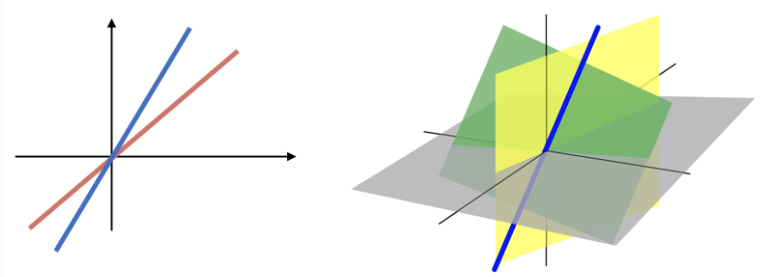

# 2.2. Geometric Interpretation: The Visual Foundation of Linear Regression

The geometric interpretation of least squares provides a powerful visual and mathematical framework for understanding linear regression. Instead of focusing on the $`(p+1)`$-dimensional feature space, we work in the $`n`$-dimensional space of observations, where each data point is represented as a vector. This perspective reveals the fundamental structure of linear regression and helps us understand concepts like projection, orthogonality, and the coefficient of determination.

**Think of geometric interpretation as the "blueprint" of linear regression.** Just as architects use blueprints to understand how a building's structure works, geometric interpretation shows us how linear regression's mathematical structure works. It's like having a map that shows you exactly where everything fits and how all the pieces connect together.

## 2.2.1. Vector Spaces: The Mathematical Foundation

### What is a Vector Space?

A vector space is a mathematical structure that provides the foundation for understanding linear regression geometrically. It's a collection of objects (vectors) that can be added together and multiplied by scalars while satisfying certain axioms.

**Intuitive Understanding**: A vector space is like a playground where you can move around freely in any direction. Just as you can walk forward, backward, left, or right in a playground, in a vector space you can add vectors together and stretch or shrink them by multiplying by numbers. It's a mathematical "space" where the rules of geometry work perfectly.

**Key Properties of Vector Spaces**:
1. **Closure under addition**: Adding two vectors gives another vector - like combining two steps to get a new position
2. **Closure under scalar multiplication**: Multiplying a vector by a scalar gives another vector - like taking bigger or smaller steps
3. **Associative and commutative properties**: Vector addition behaves like regular addition - like the order of steps doesn't matter
4. **Distributive properties**: Scalar multiplication distributes over vector addition - like scaling a combination of steps
5. **Identity elements**: Zero vector and scalar identity (1) - like having a "do nothing" step and a "normal size" step

### Understanding Vectors

**Definition**: A vector is an ordered list of numbers that can be visualized as:
- A point in space - like marking a location on a map
- An arrow from the origin to that point - like drawing a line from home to your destination
- A directed line segment - like showing both where you are and where you're going

**Intuition**: Vectors are like directions or movements. If you're at point A and want to get to point B, the vector from A to B tells you exactly how to move - how far in each direction.

**Notation**: We typically write vectors as column vectors:
$$ \mathbf{v} = \begin{pmatrix} v_1 \\ v_2 \\ \vdots \\ v_n \end{pmatrix} $$

**Intuition**: This notation is like writing down a list of instructions: "move $`v_1`$ units in direction 1, $`v_2`$ units in direction 2, and so on."

**Dimensions**: Vectors can be:
- **2D**: $`\mathbf{v} = \begin{pmatrix} x \\ y \end{pmatrix}`$ (points in a plane) - like locations on a flat map
- **3D**: $`\mathbf{v} = \begin{pmatrix} x \\ y \\ z \end{pmatrix}`$ (points in space) - like locations in a 3D world
- **nD**: $`\mathbf{v} = \begin{pmatrix} v_1 \\ v_2 \\ \vdots \\ v_n \end{pmatrix}`$ (points in n-dimensional space) - like having many different characteristics

**Intuition**: Higher dimensions are like having more ways to describe something. A 2D vector might describe a house's location (latitude, longitude), while a 10D vector might describe a house's features (price, size, bedrooms, bathrooms, age, etc.).

### Vector Operations

**Vector Addition**:
$$ \mathbf{a} + \mathbf{b} = \begin{pmatrix} a_1 \\ a_2 \\ \vdots \\ a_n \end{pmatrix} + \begin{pmatrix} b_1 \\ b_2 \\ \vdots \\ b_n \end{pmatrix} = \begin{pmatrix} a_1 + b_1 \\ a_2 + b_2 \\ \vdots \\ a_n + b_n \end{pmatrix} $$

**Intuition**: Vector addition is like combining two movements. If you walk 3 steps north and then 2 steps east, you end up at the same place as if you walked directly to that point in one movement.

**Scalar Multiplication**:
$$ c \mathbf{a} = c \begin{pmatrix} a_1 \\ a_2 \\ \vdots \\ a_n \end{pmatrix} = \begin{pmatrix} c a_1 \\ c a_2 \\ \vdots \\ c a_n \end{pmatrix} $$

**Intuition**: Scalar multiplication is like scaling a movement. If you walk 2 steps north, that's the same as walking 1 step north twice as fast, or taking 2 steps that are each half the size.

**Geometric Interpretation**:
- **Addition**: Move from the tip of one vector to the tip of another - like following one direction and then another
- **Scalar multiplication**: Scale the length of a vector by a factor - like making your steps bigger or smaller

### Example: Vector Operations in Practice

$$ 2 \begin{pmatrix} 1 \\ 2 \\ 0 \end{pmatrix} + 3 \begin{pmatrix} 3 \\ 1 \\ 1 \end{pmatrix} = \begin{pmatrix} 2 \\ 4 \\ 0 \end{pmatrix} + \begin{pmatrix} 9 \\ 3 \\ 3 \end{pmatrix} = \begin{pmatrix} 11 \\ 7 \\ 3 \end{pmatrix} $$

**What this means**:
- Scale the first vector by 2: $`\begin{pmatrix} 1 \\ 2 \\ 0 \end{pmatrix} \rightarrow \begin{pmatrix} 2 \\ 4 \\ 0 \end{pmatrix}`$ - like taking twice as big steps in the first direction
- Scale the second vector by 3: $`\begin{pmatrix} 3 \\ 1 \\ 1 \end{pmatrix} \rightarrow \begin{pmatrix} 9 \\ 3 \\ 3 \end{pmatrix}`$ - like taking three times as big steps in the second direction
- Add the scaled vectors component-wise - like combining these two movements

**Intuition**: This is like saying "take 2 steps in direction A and 3 steps in direction B, then combine them to see where you end up."

### Python Implementation: Vector Operations

See the complete implementation in [`code/vector_operations.py`](code/vector_operations.py) which demonstrates basic vector operations in 3D space with visualization.

### Linear Subspaces: The Building Blocks

**Definition**: A linear subspace is a subset of a vector space that is closed under vector addition and scalar multiplication.

**Intuitive Understanding**: A linear subspace is like a smaller playground within the bigger playground. It's a space where you can still move around freely, but you're restricted to certain directions. Think of it like being on a flat surface (a plane) within 3D space - you can move in any direction on that surface, but you can't move up or down.

**Formal Definition**: A subset $`S`$ of $`\mathbb{R}^n`$ is a linear subspace if:

1. **Zero vector**: $`\mathbf{0} \in S`$ (contains the origin) - like always being able to stay where you are
2. **Closure under addition**: If $`\mathbf{u}, \mathbf{v} \in S`$, then $`\mathbf{u} + \mathbf{v} \in S`$ - like being able to combine any two movements within the space
3. **Closure under scalar multiplication**: If $`\mathbf{u} \in S`$ and $`c`$ is a scalar, then $`c\mathbf{u} \in S`$ - like being able to scale any movement within the space

**Key Properties**:
- Always contains the origin (zero vector) - like always having a starting point
- Dimension is the number of linearly independent vectors needed to span it - like the number of different directions you can move
- In $`\mathbb{R}^2`$: subspaces are lines through the origin - like being restricted to a straight line
- In $`\mathbb{R}^3`$: subspaces can be lines or planes through the origin - like being restricted to a line or a flat surface

### Examples of Linear Subspaces

**1D Subspace (Line)**:
$$ S = \{ c \begin{pmatrix} 1 \\ 2 \end{pmatrix} : c \in \mathbb{R} \} $$

**Intuition**: This is like being restricted to move only along a specific line. You can go forward or backward along that line, but you can't move sideways.

**2D Subspace (Plane)**:
$$ S = \{ c_1 \begin{pmatrix} 1 \\ 0 \\ 0 \end{pmatrix} + c_2 \begin{pmatrix} 0 \\ 1 \\ 0 \end{pmatrix} : c_1, c_2 \in \mathbb{R} \} $$

**Intuition**: This is like being restricted to a flat surface (like a table). You can move in any direction on that surface, but you can't move up or down off the surface.


*Figure: Examples of linear subspaces in regression geometry*

### Column Space: The Heart of Linear Regression

**Definition**: The column space of a matrix $`X`$ is the set of all possible linear combinations of its columns:

$$ C(X) = \{ \mathbf{X} \boldsymbol{\beta} : \boldsymbol{\beta} \in \mathbb{R}^{p+1} \} $$

**Intuitive Understanding**: The column space is like the "playground" where your model can make predictions. Each column of $`X`$ represents a direction you can move in, and the column space contains all the places you can reach by combining these directions in different ways.

**Interpretation in Regression**:
- Each column of $`X`$ represents a predictor variable - like each column being a different feature (square footage, number of bedrooms, etc.)
- The column space contains all possible predicted values - like all the house prices your model could predict
- It's a subspace of $`\mathbb{R}^n`$ (where $`n`$ is the number of observations) - like a smaller space within the space of all possible outcomes

**Example**: For a design matrix with 2 predictors:
$$ X = \begin{pmatrix} 1 & x_{11} & x_{12} \\ 1 & x_{21} & x_{22} \\ 1 & x_{31} & x_{32} \end{pmatrix} $$

The column space is:
$$ C(X) = \{ \beta_0 \begin{pmatrix} 1 \\ 1 \\ 1 \end{pmatrix} + \beta_1 \begin{pmatrix} x_{11} \\ x_{21} \\ x_{31} \end{pmatrix} + \beta_2 \begin{pmatrix} x_{12} \\ x_{22} \\ x_{32} \end{pmatrix} : \beta_0, \beta_1, \beta_2 \in \mathbb{R} \} $$

**Intuition**: This says that any prediction your model can make is a combination of:
- A baseline amount (the intercept column of ones)
- Some amount of the first predictor (square footage)
- Some amount of the second predictor (number of bedrooms)

### Python Implementation: Column Space

See the complete implementation in [`code/column_space_demo.py`](code/column_space_demo.py) which demonstrates the concept of column space with 3D visualization and examples of different coefficient vectors.

## 2.2.2. Projection: The Geometric Foundation of Least Squares

### The Projection Problem

The least squares optimization problem can be understood geometrically as finding the projection of the response vector $`\mathbf{y}`$ onto the column space of $`X`$.

**Intuitive Understanding**: Projection is like finding the closest point on a surface to where you actually are. Imagine you're standing in a room and want to find the closest point on the floor to your current position. The projection would be the point directly below you on the floor.

**Mathematical Formulation**:
$$ \min_{\boldsymbol{\beta}} \| \mathbf{y} - \mathbf{X} \boldsymbol{\beta} \|^2 $$

**Geometric Interpretation**:
- The column space $`C(X)`$ is a subspace of $`\mathbb{R}^n`$ - like the floor of the room
- The vector $`\mathbf{y}`$ may not lie in $`C(X)`$ - like you might be floating above the floor
- The least squares solution finds the point in $`C(X)`$ closest to $`\mathbf{y}`$ - like finding the point on the floor directly below you
- This closest point is the **orthogonal projection** of $`\mathbf{y}`$ onto $`C(X)`$ - like dropping a plumb line from your position to the floor

### Understanding Projection

**What is Projection?**
Projection is the process of finding the closest point in a subspace to a given vector. It's like casting a shadow of a vector onto a plane or line.

**Intuition**: Think of projection as "flattening" a vector onto a surface. If you shine a light directly above an object, the shadow it casts on the ground is the projection of that object onto the ground.

**Key Properties**:
1. **Minimal Distance**: The projected point is the closest point in the subspace to the original vector - like the shadow being the closest point on the ground to the object
2. **Orthogonality**: The difference between the original vector and its projection is orthogonal to the subspace - like the line from the object to its shadow being perpendicular to the ground
3. **Uniqueness**: The projection is unique (assuming the subspace is well-defined) - like there being only one shadow for each object

### Orthogonal Decomposition

The least squares solution decomposes $`\mathbf{y}`$ into two orthogonal components:

1. **Predicted values**: $`\hat{\mathbf{y}} = \mathbf{X} \hat{\boldsymbol{\beta}}`$ (lies in $`C(X)`$) - like the shadow on the floor
2. **Residual vector**: $`\mathbf{r} = \mathbf{y} - \hat{\mathbf{y}}`$ (orthogonal to $`C(X)`$) - like the line from the object to its shadow

**Intuition**: This decomposition is like breaking down your position into two parts: where you are on the floor (the prediction) and how far above the floor you are (the residual).

**Mathematical Properties**:
- **Orthogonality**: $`\hat{\mathbf{y}}^T \mathbf{r} = 0`$ - like the shadow and the line to the shadow being perpendicular
- **Decomposition**: $`\mathbf{y} = \hat{\mathbf{y}} + \mathbf{r}`$ - like your total position being the sum of your position on the floor and your height above it
- **Pythagorean Theorem**: $`\|\mathbf{y}\|^2 = \|\hat{\mathbf{y}}\|^2 + \|\mathbf{r}\|^2`$ - like the total distance squared being the sum of the horizontal and vertical distances squared

### Visual Understanding

**2D Example**: Imagine projecting a point onto a line
- The projection is the foot of the perpendicular from the point to the line - like dropping a perpendicular from a point to a line
- The residual is the perpendicular distance from the point to the line - like the shortest distance from the point to the line

**3D Example**: Imagine projecting a point onto a plane
- The projection is the foot of the perpendicular from the point to the plane - like dropping a perpendicular from a point to a flat surface
- The residual is the perpendicular distance from the point to the plane - like the height of the point above the surface

### Python Implementation: Projection and Orthogonality

See the complete implementation in [`code/projection_analysis.py`](code/projection_analysis.py) which demonstrates projection and orthogonality in linear regression, including 3D visualization and analysis of projection properties.

### The Projection Matrix (Hat Matrix)

**Definition**: The projection matrix $`H`$ is defined as:
$$ H = \mathbf{X}(\mathbf{X}^T\mathbf{X})^{-1}\mathbf{X}^T $$

**Intuition**: The projection matrix is like a "shadow machine" - it takes any vector and projects it onto the column space. It's the mathematical tool that does the projection for us.

**Properties**:
1. **Projection**: $`\hat{\mathbf{y}} = H\mathbf{y}`$ - like the matrix creating the shadow
2. **Idempotent**: $`H^2 = H`$ - like projecting a shadow doesn't change it
3. **Symmetric**: $`H^T = H`$ - like the projection working the same way in both directions
4. **Trace**: $`\text{tr}(H) = p+1`$ (number of parameters) - like the "size" of the projection space

**Interpretation**: The hat matrix "puts a hat" on $`\mathbf{y}`$ to get $`\hat{\mathbf{y}}`$.

**Intuition**: Just like putting a hat on someone changes their appearance, the hat matrix transforms the observed values into predicted values.

### Geometric Intuition

**Why Projection Works**:
- The column space $`C(X)`$ contains all possible linear combinations of predictors - like all the places your model can reach
- The response vector $`\mathbf{y}`$ may not lie exactly in this space due to noise - like the real data not being perfectly predictable
- Projection finds the closest point in the space to $`\mathbf{y}`$ - like finding the best possible prediction
- This closest point gives us the best linear approximation - like the best we can do with our model

**Connection to Least Squares**:
- Minimizing $`\|\mathbf{y} - \mathbf{X}\boldsymbol{\beta}\|^2`$ is equivalent to finding the projection - like finding the shortest distance
- The residual vector $`\mathbf{r}`$ is perpendicular to the column space - like the error being in a direction the model can't predict
- This perpendicularity ensures we've found the closest point - like having found the truly shortest distance

**Intuition**: Projection is the geometric way of saying "find the best possible prediction within the constraints of our model." It's like finding the closest point on a map to where you actually are.

## 2.2.3. R²: The Coefficient of Determination

### What is R²?

$`R^2`$ (R-squared) is a fundamental measure of model fit that quantifies the proportion of variance in the response variable explained by the predictors. It's one of the most widely used metrics in regression analysis.

**Intuitive Understanding**: R-squared is like a "success rate" for your model. If $`R^2 = 0.8`$, it means your model explains 80% of the variation in the data. It's like saying "my recipe works 80% of the time" - the model captures most of the patterns, but there's still some randomness left over.

### Mathematical Definition

$$ R^2 = \frac{\sum_{i=1}^n (\hat{y}_i - \bar{y})^2}{\sum_{i=1}^n (y_i - \bar{y})^2} = \frac{\| \hat{\mathbf{y}} - \bar{\mathbf{y}} \|^2}{\| \mathbf{y} - \bar{\mathbf{y}} \|^2} $$

where $`\bar{y} = \frac{1}{n}\sum_{i=1}^n y_i`$ is the sample mean of the response.

**Intuition**: This formula compares how much variation your model explains to how much variation there is in total. It's like comparing how much of a story you can tell with your model versus how much of the story there is to tell.

### Geometric Interpretation

The geometric interpretation of $`R^2`$ comes from the Pythagorean theorem applied to centered vectors:

$$ \| \mathbf{y} - \bar{\mathbf{y}} \|^2 = \| \hat{\mathbf{y}} - \bar{\mathbf{y}} \|^2 + \| \mathbf{r} \|^2 $$

This decomposition gives us:

- **Total Sum of Squares (TSS)**: $`\| \mathbf{y} - \bar{\mathbf{y}} \|^2`$ - like the total amount of variation in the data
- **Explained Sum of Squares (ESS)**: $`\| \hat{\mathbf{y}} - \bar{\mathbf{y}} \|^2`$ - like the amount of variation your model can explain
- **Residual Sum of Squares (RSS)**: $`\| \mathbf{r} \|^2`$ - like the amount of variation your model can't explain

**Intuition**: This is like breaking down the total variation into two parts: what your model can explain (the signal) and what it can't explain (the noise).

### Alternative Expressions

$$ R^2 = \frac{\text{ESS}}{\text{TSS}} = 1 - \frac{\text{RSS}}{\text{TSS}} $$

**Intuition**: The first expression says "what fraction of the total variation does my model explain?" The second expression says "what fraction of the total variation does my model NOT explain?" Since these must add to 1, we can write R-squared either way.

### Key Properties

1. **Range**: $`0 \leq R^2 \leq 1`$ - like a percentage that can't be negative or exceed 100%
2. **Perfect Fit**: $`R^2 = 1`$ means all residuals are zero - like your model explaining everything perfectly
3. **No Improvement**: $`R^2 = 0`$ means the model performs no better than predicting the mean - like your model being no better than just guessing the average
4. **Correlation**: In multiple regression, $`R^2`$ is the squared correlation between $`y`$ and $`\hat{y}`$ - like measuring how well your predictions match the actual values
5. **Simple Regression**: In simple regression, $`R^2`$ is the squared correlation between $`y`$ and $`x`$ - like measuring the strength of the linear relationship

**Intuition**: These properties help you understand what R-squared means. It's always between 0 and 1, where 1 is perfect and 0 is useless. It's also related to correlation, which makes sense because correlation measures how well two things move together.

### Understanding R² Geometrically

**Visual Interpretation**:
- Imagine the response vector $`\mathbf{y}`$ centered at the mean - like moving all your data points so they average to zero
- The fitted values $`\hat{\mathbf{y}}`$ are the projection onto the column space - like the shadow of your data on the model's "floor"
- $`R^2`$ measures how much of the total variation is "explained" by the projection - like what fraction of the total movement is captured by the shadow
- It's the ratio of the squared length of the projection to the squared length of the original vector - like comparing the size of the shadow to the size of the object

**Example**: If $`R^2 = 0.8`$, then 80% of the variance in $`y`$ is explained by the linear model.

**Intuition**: This geometric interpretation shows that R-squared is really about how much of the data's "movement" your model can capture. A high R-squared means your model's shadow is almost as big as the original data, while a low R-squared means the shadow is much smaller.

### Python Implementation: R² Analysis

See the complete implementation in [`code/r_squared_analysis.py`](code/r_squared_analysis.py) which provides comprehensive analysis of R-squared including geometric interpretation, variance decomposition, and visualization.

### Invariance Properties

$`R^2`$ has several important invariance properties:

1. **Location Invariance**: Adding a constant to $`y`$ does not change $`R^2`$ - like shifting all your data up or down doesn't affect how well your model fits
2. **Scale Invariance**: Multiplying $`y`$ by a constant does not change $`R^2`$ - like changing the units (dollars to cents) doesn't affect the fit quality
3. **Symmetry in Simple Regression**: $`R^2`$ is the same whether we predict $`Y`$ from $`X``$ or $`X`$ from $`Y`$ - like the relationship being equally strong in both directions

**Intuition**: These invariance properties mean that R-squared measures the quality of the relationship, not the specific values. It's like measuring how well two things are related, regardless of what units you use or where you start measuring from.

### Interpretation and Limitations

**Interpretation**:
- **High $`R^2`$** (e.g., 0.7 or 0.8): Suggests a good fit, but doesn't guarantee model validity - like having a good recipe but still needing to check if the ingredients are fresh
- **Low $`R^2`$**: Doesn't necessarily mean the model is useless; it may still provide useful predictions - like a simple recipe that works reliably even if it doesn't explain everything
- **Context Matters**: What constitutes a "good" $`R^2`$ depends on the field and application - like what's considered good cooking depends on whether you're making fast food or fine dining

**Limitations**:
1. **Overfitting**: Adding more predictors (even irrelevant ones) can artificially increase $`R^2`$ - like adding more ingredients to a recipe even if they don't help
2. **No Penalty**: $`R^2`$ doesn't account for the number of predictors - like not caring how many ingredients you use
3. **Non-linear Relationships**: $`R^2`$ only measures linear relationships - like only being able to measure straight-line relationships
4. **Outliers**: Can be sensitive to outliers - like one bad ingredient ruining the whole recipe

**Intuition**: These limitations remind us that R-squared is just one measure of model quality. It's like having a taste test - it tells you if the food tastes good, but it doesn't tell you if it's healthy, affordable, or easy to make.

### Adjusted R²

To address the limitation of $`R^2`$ increasing with more predictors, we use adjusted $`R^2`$:

$$ R^2_{\text{adj}} = 1 - \frac{\text{RSS}/(n-p-1)}{\text{TSS}/(n-1)} = 1 - (1 - R^2) \frac{n-1}{n-p-1} $$

**Intuition**: Adjusted R-squared is like R-squared with a penalty for using too many ingredients. It asks "Is the improvement worth the extra complexity?"

**Properties**:
- Penalizes models with many predictors - like preferring simpler recipes
- Can decrease when adding irrelevant variables - like recognizing when extra ingredients don't help
- More appropriate for model comparison - like comparing recipes fairly
- Accounts for degrees of freedom - like considering how much data you have relative to how many parameters you're estimating

**Intuition**: Adjusted R-squared is like having a more sophisticated taste test that considers not just how good the food tastes, but also how complicated the recipe is. A simple recipe that tastes good might score higher than a complicated recipe that tastes slightly better.

### Python Implementation: Adjusted R²

The adjusted R-squared computation is included in [`code/r_squared_analysis.py`](code/r_squared_analysis.py) as part of the comprehensive R-squared analysis.

This geometric understanding of $`R^2`$ provides a solid foundation for interpreting model performance and understanding the relationship between observed and predicted values in linear regression.

**Intuition**: Understanding R-squared geometrically is like understanding why a recipe works. You can see exactly how much of the final result comes from your ingredients (the model) versus random factors (the residuals). This helps you know when your model is doing well and when you might need to try a different approach.

## 2.2.4. Linear Transformations of X: Understanding Invariance

Linear transformations of the design matrix $`X`$ have important implications for the least squares solution. Understanding these transformations helps us interpret results and handle data preprocessing.

**Intuitive Understanding**: Linear transformations are like changing the units or scale of your measurements. Just as you can measure a room in feet or meters without changing the room itself, you can transform your data in certain ways without changing the fundamental relationships.

### What are Linear Transformations?

A linear transformation of $`X`$ involves multiplying $`X`$ by a matrix $`A`$:
$$ X' = XA $$

where $`A`$ is a $`(p+1) \times (p+1)`$ transformation matrix.

**Intuition**: This is like applying a "filter" or "lens" to your data. The transformation changes how you see the data, but doesn't change the underlying relationships.

### Effect on the Fit

**Key Result**: If we transform $`X`$ to $`X' = XA`$ where $`A`$ is a full-rank matrix, then:

- The column space $`C(X') = C(X)`$ remains the same - like the room staying the same even if you measure it differently
- The fitted values $`\hat{\mathbf{y}}`$ are unchanged - like the predictions staying the same
- The residuals $`\mathbf{r}`$ are unchanged - like the errors staying the same
- $`R^2`$ is unchanged - like the quality of fit staying the same
- However, the coefficients $`\boldsymbol{\beta}`$ will change - like the recipe changing even though the final dish tastes the same

**Mathematical Justification**:
$$ \hat{\mathbf{y}}' = X' \hat{\boldsymbol{\beta}}' = XA \hat{\boldsymbol{\beta}}' = X \hat{\boldsymbol{\beta}} = \hat{\mathbf{y}} $$

This means $`A \hat{\boldsymbol{\beta}}' = \hat{\boldsymbol{\beta}}`$, so $`\hat{\boldsymbol{\beta}}' = A^{-1} \hat{\boldsymbol{\beta}}`$.

**Intuition**: This is like saying that if you change how you measure your ingredients, you need to adjust your recipe amounts, but the final dish will taste the same.

### Common Linear Transformations

**1. Scaling Predictors**:
$$ X' = X \begin{pmatrix} 1 & 0 & 0 \\ 0 & c & 0 \\ 0 & 0 & 1 \end{pmatrix} $$

This scales the second predictor by a factor $`c`$.

**Intuition**: This is like changing the units of one measurement. If you measure square footage in hundreds of square feet instead of square feet, the coefficient will change, but the relationship stays the same.

**2. Centering Predictors**:
$$ X' = X \begin{pmatrix} 1 & -\bar{x}_1 & -\bar{x}_2 \\ 0 & 1 & 0 \\ 0 & 0 & 1 \end{pmatrix} $$

This centers the predictors around their means.

**Intuition**: This is like measuring everything relative to the average. Instead of measuring house size in absolute square feet, you measure it relative to the average house size.

**3. Standardization**:
$$ X' = X \begin{pmatrix} 1 & -\bar{x}_1/s_1 & -\bar{x}_2/s_2 \\ 0 & 1/s_1 & 0 \\ 0 & 0 & 1/s_2 \end{pmatrix} $$

This standardizes the predictors to have mean 0 and standard deviation 1.

**Intuition**: This is like putting all your measurements on the same scale. It's like measuring everything in "standard deviations from the mean" so that all variables are comparable.

### Example: Scaling Predictors

**Original Model**:
$$ y = \beta_0 + \beta_1 x_1 + \beta_2 x_2 $$

**Scaled Model**:
$$ y = \beta_0' + \beta_1' (c x_1) + \beta_2' x_2 $$

**Relationship**:
$$ \beta_1' = \beta_1 / c $$

**Intuition**: If you measure square footage in hundreds of square feet instead of square feet, the coefficient will be 100 times smaller, but it will still represent the same relationship.

### Python Implementation: Linear Transformations

See the complete implementation in [`code/linear_transformations.py`](code/linear_transformations.py) which demonstrates the effect of different linear transformations (scaling, centering, standardization) on regression coefficients while preserving fitted values.

## 2.2.5. Rank Deficiency: When Things Go Wrong

Rank deficiency occurs when the design matrix $`X`$ does not have full column rank, meaning some columns are linear combinations of others. This is a critical issue in linear regression that affects the uniqueness and interpretation of solutions.

**Intuitive Understanding**: Rank deficiency is like having redundant ingredients in a recipe. If you have both "salt" and "sodium chloride" in your recipe, you're essentially measuring the same thing twice. This creates problems because the model can't tell which one is really important.

### What is Rank Deficiency?

**Definition**: $`X`$ is rank deficient if its rank is less than $`p+1`$ (the number of columns).

**Mathematical Condition**:
$$ \text{rank}(X) < p + 1 $$

This means $`X^T X`$ is not invertible, and the normal equation has infinitely many solutions.

**Intuition**: This is like having a recipe where some ingredients are just combinations of others. You can't determine the unique contribution of each ingredient because they're not independent.

### Common Causes of Rank Deficiency

**1. Perfect Collinearity**:
Two predictors are perfectly correlated:
```python
# Example: Temperature in Celsius and Fahrenheit
temp_c = np.array([0, 10, 20, 30])
temp_f = 9/5 * temp_c + 32  # Perfect linear relationship
X = np.column_stack([np.ones(4), temp_c, temp_f])
```

**Intuition**: This is like having both Celsius and Fahrenheit temperature in your model. They're the same information, just measured differently.

**2. Redundant Variables**:
A predictor is a linear combination of others:
```python
# Example: Sum to constant
age_young = np.array([30, 25, 40])
age_middle = np.array([45, 50, 35])
age_old = 100 - age_young - age_middle  # Perfect linear combination
X = np.column_stack([np.ones(3), age_young, age_middle, age_old])
```

**Intuition**: This is like having age categories that always add up to 100%. If you know two of them, you automatically know the third.

**3. Categorical Variables**:
Including all levels of a categorical variable with an intercept:
```python
# Example: One-hot encoding with all levels
category_A = np.array([1, 0, 0, 1])
category_B = np.array([0, 1, 0, 0])
category_C = np.array([0, 0, 1, 0])
# category_D = 1 - category_A - category_B - category_C (perfect collinearity)
X = np.column_stack([np.ones(4), category_A, category_B, category_C])
```

**Intuition**: This is like having a category for "everything else" when you already have categories for all the specific cases. The "everything else" category is automatically determined.

### Consequences of Rank Deficiency

**1. Non-unique Solutions**:
- $`(X^T X)^{-1}`$ does not exist - like not being able to solve the equation uniquely
- There are infinitely many $`\boldsymbol{\beta}`$ that give the same fitted values - like having many different recipes that produce the same dish
- The normal equation has multiple solutions - like having multiple answers to the same question

**2. Software Behavior**:
Different software packages handle rank deficiency differently:
- **R's `lm()`**: Drops redundant columns and marks their coefficients as `NA` - like removing the redundant ingredient
- **Python's scikit-learn**: Returns the minimum-norm solution using the Moore-Penrose pseudoinverse - like choosing the simplest recipe
- **NumPy's `np.linalg.lstsq()`**: Also uses the pseudoinverse - like using a mathematical trick to get a unique answer

**3. Interpretation Problems**:
- Individual coefficients may not be interpretable - like not being able to say which ingredient is really important
- Standard errors may be infinite or very large - like being very uncertain about the recipe
- Confidence intervals may be meaningless - like not being able to trust your measurements

### Python Implementation: Rank Deficiency Analysis

See the complete implementation in [`code/rank_deficiency.py`](code/rank_deficiency.py) which demonstrates rank deficiency detection and handling, including examples of perfect collinearity and redundant variables.

### Handling Rank Deficiency

**1. Remove Redundant Variables**:
- Identify and remove perfectly collinear predictors - like removing duplicate ingredients
- Use stepwise selection or regularization - like being more careful about which ingredients to include
- Consider the scientific meaning of the variables - like understanding what each variable really represents

**2. Regularization**:
- Ridge regression: $`\hat{\boldsymbol{\beta}}_{ridge} = (X^T X + \lambda I)^{-1} X^T y`$ - like adding a small amount of all ingredients to avoid zero amounts
- Lasso regression: Adds L1 penalty - like preferring recipes with fewer ingredients
- Elastic net: Combines L1 and L2 penalties - like balancing simplicity and completeness

**3. Principal Component Analysis (PCA)**:
- Transform to orthogonal components - like creating new ingredients that are independent of each other
- Use only the first few principal components - like using only the most important new ingredients
- Maintains most of the variance while eliminating collinearity - like keeping most of the flavor while removing redundancy

**4. Data Collection**:
- Collect more diverse data - like getting ingredients from different sources
- Ensure predictors are not perfectly correlated - like making sure ingredients are truly different
- Consider the experimental design - like planning your recipe carefully

### Best Practices

**1. Always Check Rank**:
```python
rank = np.linalg.matrix_rank(X)
if rank < X.shape[1]:
    print("Warning: Rank deficiency detected")
```

**Intuition**: This is like checking your recipe before you start cooking to make sure you don't have redundant ingredients.

**2. Monitor Condition Number**:
```python
eigenvals = np.linalg.eigvals(X.T @ X)
condition_number = np.max(eigenvals) / np.min(eigenvals[eigenvals > 1e-10])
if condition_number > 1e12:
    print("Warning: High condition number")
```

**Intuition**: This is like checking how sensitive your recipe is to small changes. A high condition number means small changes in ingredients cause big changes in the result.

**3. Use Regularization**:
When rank deficiency is detected, consider using regularized methods that provide stable solutions.

**Intuition**: This is like using cooking techniques that are more forgiving when you have similar ingredients.

**4. Interpret Results Carefully**:
- Individual coefficients may not be meaningful - like not being able to isolate the effect of one ingredient
- Focus on overall model performance - like caring more about how the dish tastes than which specific ingredient caused what
- Consider the scientific context - like understanding what the variables really mean in your domain

## 2.2.6. Advanced Geometric Concepts

### The Hat Matrix and Leverage

**Hat Matrix Properties**:
The projection matrix $`H = X(X^T X)^{-1} X^T`$ has several important properties:

1. **Projection**: $`\hat{\mathbf{y}} = H\mathbf{y}`$ - like the matrix creating the shadow
2. **Idempotent**: $`H^2 = H`$ - like projecting a shadow doesn't change it
3. **Symmetric**: $`H^T = H`$ - like the projection working the same way in both directions
4. **Trace**: $`\text{tr}(H) = p+1`$ - like the "size" of the projection space

**Leverage**:
The diagonal elements $`h_{ii}`$ of the hat matrix are called leverage values:
$$ h_{ii} = \mathbf{x}_i^T (X^T X)^{-1} \mathbf{x}_i $$

**Intuition**: Leverage measures how much influence each observation has on its own prediction. It's like measuring how much each ingredient affects the final taste of the dish.

**Interpretation**:
- $`h_{ii}`$ measures the influence of observation $`i`$ on its own fitted value - like how much each ingredient affects its own contribution
- High leverage points are potentially influential - like ingredients that have a big impact
- Rule of thumb: $`h_{ii} > 2(p+1)/n`$ indicates high leverage - like identifying ingredients that are unusually important

### Cook's Distance

Cook's distance measures the influence of each observation on the entire regression:

$$ D_i = \frac{(\hat{\boldsymbol{\beta}} - \hat{\boldsymbol{\beta}}_{(i)})^T X^T X (\hat{\boldsymbol{\beta}} - \hat{\boldsymbol{\beta}}_{(i)})}{(p+1) \hat{\sigma}^2} $$

where $`\hat{\boldsymbol{\beta}}_{(i)}`$ is the estimate with observation $`i`$ removed.

**Intuition**: Cook's distance measures how much the entire recipe changes when you remove one ingredient. It's like seeing how much the dish changes when you leave out one component.

### Python Implementation: Advanced Diagnostics

See the complete implementation in [`code/advanced_diagnostics.py`](code/advanced_diagnostics.py) which provides comprehensive diagnostic measures including leverage, studentized residuals, Cook's distance, and visualization plots.

## 2.2.7. Summary and Key Insights

### What We've Learned

The geometric interpretation of linear regression provides deep insights into:

1. **Vector Spaces**: The mathematical foundation for understanding regression - like understanding the playground where your model works
2. **Projection**: The geometric basis of least squares estimation - like understanding how shadows work
3. **R-squared**: The proportion of variance explained by the model - like understanding the success rate
4. **Linear Transformations**: How data preprocessing affects results - like understanding how changing units affects the recipe
5. **Rank Deficiency**: When and why problems occur - like understanding when ingredients are redundant
6. **Diagnostics**: How to assess model quality and identify influential observations - like quality control for your model

### Key Geometric Insights

**1. Projection is Optimal**:
- Least squares finds the orthogonal projection of $`\mathbf{y}`$ onto $`C(X)`$ - like finding the best possible shadow
- This projection minimizes the Euclidean distance - like finding the shortest path
- The residual vector $`\mathbf{r}`$ is orthogonal to the column space - like the error being perpendicular to the model

**Intuition**: Projection is the geometric way of saying "find the best possible prediction." It's like finding the closest point on a map to where you actually are.

**2. R-squared is Geometric**:
- $`R^2`$ measures the ratio of explained to total variation - like measuring what fraction of the movement your model captures
- It's the squared cosine of the angle between centered vectors - like measuring how well aligned your predictions are with reality
- Perfect fit means $`\mathbf{y}`$ lies in the column space - like the data being perfectly predictable

**Intuition**: R-squared is really about how much of the data's "story" your model can tell. A high R-squared means your model captures most of the important patterns.

**3. Invariance Under Transformations**:
- Linear transformations preserve the column space - like changing units doesn't change the room
- Fitted values and residuals are unchanged - like the predictions staying the same
- Only coefficient interpretations change - like the recipe changing but the dish tasting the same

**Intuition**: This invariance means that the quality of your model doesn't depend on how you measure things, only on the underlying relationships.

**4. Rank Deficiency is Geometric**:
- Occurs when columns are linearly dependent - like having redundant ingredients
- The column space has lower dimension than expected - like having a smaller playground than you thought
- Solutions exist but are not unique - like having many recipes that produce the same dish

**Intuition**: Rank deficiency is like having a recipe where some ingredients are just combinations of others. You can't determine the unique contribution of each ingredient.

### Practical Applications

**1. Model Diagnostics**:
- Use leverage to identify influential points - like finding which ingredients have the biggest impact
- Use Cook's distance to assess overall influence - like seeing how much the dish changes when you remove one ingredient
- Use studentized residuals to detect outliers - like finding ingredients that don't fit the pattern

**2. Data Preprocessing**:
- Centering affects intercept interpretation - like measuring everything relative to the average
- Scaling affects coefficient magnitudes - like changing the units of measurement
- Standardization makes coefficients comparable - like putting everything on the same scale

**3. Model Selection**:
- R-squared helps assess fit quality - like tasting the dish to see if it's good
- Adjusted R-squared penalizes complexity - like considering both taste and simplicity
- Cross-validation provides out-of-sample assessment - like testing the recipe on different ingredients

### Advanced Topics

This geometric foundation prepares us for:

1. **Generalized Linear Models**: Extending beyond normal errors - like adapting recipes for different types of dishes
2. **Regularization**: Ridge, Lasso, and Elastic Net - like adding constraints to make recipes more reliable
3. **Non-linear Methods**: Kernel methods and splines - like using more sophisticated cooking techniques
4. **Multivariate Analysis**: Principal components and factor analysis - like creating new ingredients from combinations of old ones
5. **Time Series**: Autocorrelation and stationarity - like understanding how recipes change over time

### Code Summary

Throughout this document, we've implemented comprehensive Python code examples:

- **Vector operations** and visualization: [`code/vector_operations.py`](code/vector_operations.py)
- **Column space demonstration**: [`code/column_space_demo.py`](code/column_space_demo.py)
- **Projection analysis** with orthogonality checks: [`code/projection_analysis.py`](code/projection_analysis.py)
- **R-squared computation** and interpretation: [`code/r_squared_analysis.py`](code/r_squared_analysis.py)
- **Linear transformation** effects: [`code/linear_transformations.py`](code/linear_transformations.py)
- **Rank deficiency** detection and handling: [`code/rank_deficiency.py`](code/rank_deficiency.py)
- **Advanced diagnostics** including leverage and influence measures: [`code/advanced_diagnostics.py`](code/advanced_diagnostics.py)

This comprehensive geometric understanding provides the foundation for mastering linear regression and understanding more advanced statistical learning methods.

**Intuition**: Understanding linear regression geometrically is like understanding the blueprint of a building. Once you see how all the pieces fit together, you can build more complex structures, adapt to different situations, and troubleshoot problems when they arise. The geometric perspective gives you the "big picture" that makes all the mathematical details make sense.

---

**Navigation:**
- **Next Topic:** [Practical Issues](03_practical_issues.md) - Real-world implementation considerations and best practices
- **Previous Topic:** [Multiple Linear Regression](01_mulitple_linear_regression.md) - Core concepts and mathematical foundations
