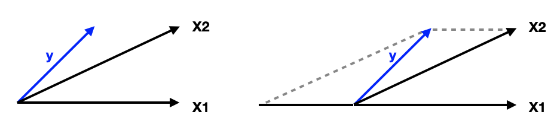
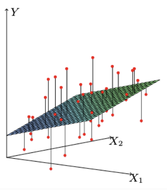

# 2.3. Practical Issues in Linear Regression

Linear regression is a powerful and widely-used method, but applying it to real-world data requires careful attention to several practical issues. This section covers the most important considerations when implementing linear regression, from data preparation to model interpretation and validation.

The transition from theoretical understanding to practical application reveals numerous challenges that must be addressed to build reliable and interpretable models. These issues range from computational considerations to statistical assumptions and real-world data complexities.

---

## 2.3.1. Analyzing Data with R/Python

Modern statistical computing provides powerful tools for implementing linear regression. Both R and Python offer comprehensive libraries for data analysis and modeling, each with their own strengths and specialized capabilities.

### R Ecosystem for Linear Regression

**Base R Functions:**
- **`lm()`**: Core linear regression function with comprehensive output
- **`summary()`**: Detailed statistical summary including coefficients, standard errors, t-tests, and F-tests
- **`predict()`**: Generate predictions with confidence intervals
- **`residuals()`**: Extract model residuals for diagnostics

**Tidyverse Integration:**
- **`ggplot2`**: Advanced visualization capabilities for model diagnostics
- **`dplyr`**: Data manipulation and preprocessing
- **`broom`**: Tidy model outputs for easy analysis
- **`modelr`**: Model evaluation and cross-validation tools

**Specialized Packages:**
- **`car`**: Comprehensive diagnostics including VIF, outlier detection
- **`MASS`**: Robust regression methods (`rlm()`)
- **`leaps`**: Model selection and subset selection
- **`glmnet`**: Regularization methods (ridge, lasso, elastic net)

### Python Ecosystem for Linear Regression

**scikit-learn:**
- **`LinearRegression`**: Fast, efficient implementation
- **`Ridge`, `Lasso`, `ElasticNet`**: Regularized regression
- **`cross_val_score`**: Cross-validation utilities
- **`StandardScaler`, `MinMaxScaler`**: Data preprocessing

**statsmodels:**
- **`OLS`**: Ordinary least squares with detailed statistical output
- **`GLM`**: Generalized linear models
- **Comprehensive diagnostics**: Built-in assumption checking
- **Statistical tests**: Formal hypothesis testing capabilities

**Data Manipulation:**
- **pandas**: Data structures and manipulation
- **numpy**: Numerical computing foundation
- **matplotlib/seaborn**: Visualization and plotting

### Comprehensive Example: Linear Regression Workflow

```python
import numpy as np
import pandas as pd
import matplotlib.pyplot as plt
import seaborn as sns
from sklearn.linear_model import LinearRegression
from sklearn.metrics import r2_score, mean_squared_error, mean_absolute_error
from sklearn.preprocessing import StandardScaler
from sklearn.model_selection import train_test_split, cross_val_score
import statsmodels.api as sm
from scipy import stats

# Set random seed for reproducibility
np.random.seed(42)

# Generate realistic sample data with known relationships
n = 200
X1 = np.random.normal(0, 1, n)  # Predictor 1
X2 = 0.3 * X1 + np.random.normal(0, 0.9, n)  # Correlated predictor
X3 = np.random.normal(0, 1, n)  # Independent predictor

# True model with some noise
y_true = 2.5 + 1.8 * X1 - 0.6 * X2 + 0.4 * X3
noise = np.random.normal(0, 0.8, n)
y = y_true + noise

# Create design matrix
X = np.column_stack([X1, X2, X3])
feature_names = ['X1', 'X2', 'X3']

# Split data for validation
X_train, X_test, y_train, y_test = train_test_split(
    X, y, test_size=0.3, random_state=42
)

# Fit scikit-learn model
sk_model = LinearRegression()
sk_model.fit(X_train, y_train)

# Fit statsmodels for detailed statistics
X_train_sm = sm.add_constant(X_train)
sm_model = sm.OLS(y_train, X_train_sm).fit()

# Generate predictions
y_train_pred = sk_model.predict(X_train)
y_test_pred = sk_model.predict(X_test)

# Model evaluation metrics
train_r2 = r2_score(y_train, y_train_pred)
test_r2 = r2_score(y_test, y_test_pred)
train_mse = mean_squared_error(y_train, y_train_pred)
test_mse = mean_squared_error(y_test, y_test_pred)
train_mae = mean_absolute_error(y_train, y_train_pred)
test_mae = mean_absolute_error(y_test, y_test_pred)

# Cross-validation
cv_scores = cross_val_score(sk_model, X_train, y_train, cv=5, scoring='r2')

print("=== LINEAR REGRESSION MODEL RESULTS ===")
print(f"Training R²: {train_r2:.4f}")
print(f"Test R²: {test_r2:.4f}")
print(f"Training MSE: {train_mse:.4f}")
print(f"Test MSE: {test_mse:.4f}")
print(f"Training MAE: {train_mae:.4f}")
print(f"Test MAE: {test_mae:.4f}")
print(f"Cross-validation R²: {cv_scores.mean():.4f} (±{cv_scores.std():.4f})")

print("\n=== COEFFICIENT ESTIMATES ===")
print("scikit-learn results:")
for name, coef in zip(feature_names, sk_model.coef_):
    print(f"  {name}: {coef:.4f}")
print(f"  Intercept: {sk_model.intercept_:.4f}")

print("\nstatsmodels detailed results:")
print(sm_model.summary())

# Visualization
fig, axes = plt.subplots(2, 2, figsize=(12, 10))

# Actual vs Predicted
axes[0, 0].scatter(y_test, y_test_pred, alpha=0.6)
axes[0, 0].plot([y_test.min(), y_test.max()], [y_test.min(), y_test.max()], 'r--', lw=2)
axes[0, 0].set_xlabel('Actual Values')
axes[0, 0].set_ylabel('Predicted Values')
axes[0, 0].set_title('Actual vs Predicted Values')
axes[0, 0].grid(True, alpha=0.3)

# Residuals vs Predicted
residuals = y_test - y_test_pred
axes[0, 1].scatter(y_test_pred, residuals, alpha=0.6)
axes[0, 1].axhline(y=0, color='r', linestyle='--')
axes[0, 1].set_xlabel('Predicted Values')
axes[0, 1].set_ylabel('Residuals')
axes[0, 1].set_title('Residuals vs Predicted Values')
axes[0, 1].grid(True, alpha=0.3)

# Residuals histogram
axes[1, 0].hist(residuals, bins=20, alpha=0.7, edgecolor='black')
axes[1, 0].set_xlabel('Residuals')
axes[1, 0].set_ylabel('Frequency')
axes[1, 0].set_title('Residuals Distribution')
axes[1, 0].grid(True, alpha=0.3)

# Q-Q plot
stats.probplot(residuals, dist="norm", plot=axes[1, 1])
axes[1, 1].set_title('Q-Q Plot of Residuals')
axes[1, 1].grid(True, alpha=0.3)

plt.tight_layout()
plt.show()

# Correlation matrix
corr_matrix = pd.DataFrame(X, columns=feature_names).corr()
plt.figure(figsize=(8, 6))
sns.heatmap(corr_matrix, annot=True, cmap='coolwarm', center=0, square=True)
plt.title('Correlation Matrix of Predictors')
plt.show()
```

### Correlation Among Predictors

Understanding the correlation structure among predictors is crucial for diagnosing multicollinearity and interpreting regression coefficients.



*Figure: Visualizing correlation among predictors in a regression model*

---

## 2.3.2. Interpreting Least Squares Coefficients



*Figure: Geometric interpretation of the least squares solution in linear regression*

Understanding how to interpret regression coefficients is crucial for extracting meaningful insights from your model. The interpretation of coefficients in multiple linear regression is more nuanced than in simple linear regression due to the presence of multiple predictors and their potential interactions.

### Mathematical Foundation of Coefficient Interpretation

In the multiple linear regression model:

```math
Y = \beta_0 + \beta_1 X_1 + \beta_2 X_2 + \cdots + \beta_p X_p + \epsilon
```

The coefficient $`\beta_j`$ represents the **partial derivative** of the response variable $`Y`$ with respect to predictor $`X_j`$:

```math
\beta_j = \frac{\partial Y}{\partial X_j}
```

This means that $`\beta_j`$ represents the expected change in the response variable $`Y`$ for a one-unit increase in predictor $`X_j`$, **holding all other predictors constant**.

### Key Assumptions for Coefficient Interpretation

**1. Linearity Assumption:**
The relationship between $`X_j`$ and $`Y`$ is linear, conditional on all other predictors.

**2. Additivity Assumption:**
The effect of $`X_j`$ on $`Y`$ is additive and independent of the values of other predictors.

**3. Ceteris Paribus Condition:**
The "holding all other predictors constant" assumption is crucial. This is often violated in practice when predictors are correlated.

### Understanding the "Holding Other Variables Constant" Assumption

The ceteris paribus condition is fundamental to interpreting multiple regression coefficients. Consider a model with two predictors:

```math
Y = \beta_0 + \beta_1 X_1 + \beta_2 X_2 + \epsilon
```

To understand $`\beta_1`$, we imagine:
1. Taking two observations with identical values of $`X_2`$
2. The first observation has $`X_1 = x_1`$
3. The second observation has $`X_1 = x_1 + 1`$
4. The expected difference in $`Y`$ between these observations is $`\beta_1`$

**Mathematical Derivation:**

```math
\begin{aligned}
Y_1 &= \beta_0 + \beta_1 x_1 + \beta_2 x_2 + \epsilon_1 \\
Y_2 &= \beta_0 + \beta_1 (x_1 + 1) + \beta_2 x_2 + \epsilon_2 \\
Y_2 - Y_1 &= \beta_1 + (\epsilon_2 - \epsilon_1)
\end{aligned}
```

Taking expectations:
```math
E[Y_2 - Y_1] = \beta_1
```

### Coefficient Interpretation in Practice

**Standardized vs. Unstandardized Coefficients:**

**Unstandardized Coefficients** (raw coefficients):
- Interpreted in the original units of the variables
- Depend on the scale of measurement
- Example: If $`X_1`$ is measured in dollars and $`\beta_1 = 0.05`$, then a $1 increase in $`X_1`$ is associated with a 0.05 unit increase in $`Y`$

**Standardized Coefficients** (beta coefficients):
- Interpreted in standard deviation units
- Independent of the original scale
- Example: If $`\beta_1^* = 0.3`$ (standardized), then a 1 standard deviation increase in $`X_1`$ is associated with a 0.3 standard deviation increase in $`Y`$

**Python Example: Standardized Coefficients**

```python
import numpy as np
from sklearn.linear_model import LinearRegression
from sklearn.preprocessing import StandardScaler

# Generate data
np.random.seed(42)
n = 100
X1 = np.random.normal(0, 1, n)  # Standard normal
X2 = np.random.normal(0, 10, n)  # Different scale
y = 2 + 1.5 * X1 - 0.8 * X2 + np.random.normal(0, 0.5, n)

# Unstandardized coefficients
X = np.column_stack([X1, X2])
model = LinearRegression()
model.fit(X, y)

print("Unstandardized coefficients:")
for i, coef in enumerate(model.coef_):
    print(f"β{i+1} = {coef:.3f}")

# Standardized coefficients
scaler = StandardScaler()
X_scaled = scaler.fit_transform(X)
model_scaled = LinearRegression()
model_scaled.fit(X_scaled, y)

print("\nStandardized coefficients:")
for i, coef in enumerate(model_scaled.coef_):
    print(f"β*{i+1} = {coef:.3f}")

# Manual calculation of standardized coefficients
y_std = np.std(y)
X_stds = np.std(X, axis=0)
standardized_coefs = model.coef_ * X_stds / y_std
print("\nManually calculated standardized coefficients:")
for i, coef in enumerate(standardized_coefs):
    print(f"β*{i+1} = {coef:.3f}")
```

### Simple vs. Multiple Regression: The Confounding Effect

The coefficient for a predictor in simple linear regression (SLR) may differ significantly from its coefficient in multiple linear regression (MLR) due to correlations among predictors. This phenomenon is known as **confounding** or **omitted variable bias**.

#### Mathematical Understanding of Confounding

Consider the true model:
```math
Y = \beta_0 + \beta_1 X_1 + \beta_2 X_2 + \epsilon
```

If we regress $`Y`$ on $`X_1`$ alone (simple regression), the estimated coefficient $`\hat{\beta}_1^{SLR}`$ will be biased:

```math
\hat{\beta}_1^{SLR} = \beta_1 + \beta_2 \cdot \frac{\text{Cov}(X_1, X_2)}{\text{Var}(X_1)}
```

The bias term $`\beta_2 \cdot \frac{\text{Cov}(X_1, X_2)}{\text{Var}(X_1)}`$ represents the **omitted variable bias**.

#### Example: Confounding Effect

Consider a scenario where:
- $`X_1`$ and $`X_2`$ are positively correlated ($`\rho_{12} > 0`$)
- $`X_2`$ has a strong positive effect on $`Y`$ ($`\beta_2 > 0`$)
- $`X_1`$ has a weak or no direct effect on $`Y`$ ($`\beta_1 \approx 0`$)

In SLR, regressing $`Y`$ on $`X_1`$ alone might show a positive coefficient because $`X_1`$ is correlated with the truly important predictor $`X_2`$. However, in MLR, the coefficient for $`X_1`$ might become negative or zero once $`X_2`$ is included in the model.

#### Comprehensive Python Example: Coefficient Changes

```python
import numpy as np
import pandas as pd
import matplotlib.pyplot as plt
from sklearn.linear_model import LinearRegression
from sklearn.metrics import r2_score

# Set random seed for reproducibility
np.random.seed(42)

# Generate correlated predictors with known correlation
n = 1000
rho = 0.8  # Correlation between X1 and X2

# Generate X1 and X2 with specified correlation
X1 = np.random.normal(0, 1, n)
X2 = rho * X1 + np.sqrt(1 - rho**2) * np.random.normal(0, 1, n)

# True model: Y depends only on X2, not X1
beta0_true = 2.0
beta1_true = 0.0  # No direct effect of X1
beta2_true = 1.5  # Strong effect of X2
sigma = 0.5

y = beta0_true + beta1_true * X1 + beta2_true * X2 + np.random.normal(0, sigma, n)

# Create DataFrame for analysis
df = pd.DataFrame({
    'X1': X1,
    'X2': X2,
    'Y': y
})

print("=== TRUE MODEL ===")
print(f"Y = {beta0_true} + {beta1_true}*X1 + {beta2_true}*X2 + ε")
print(f"Correlation between X1 and X2: {np.corrcoef(X1, X2)[0,1]:.3f}")

# Simple Linear Regression: Y ~ X1
print("\n=== SIMPLE LINEAR REGRESSION: Y ~ X1 ===")
slr_model = LinearRegression()
slr_model.fit(X1.reshape(-1, 1), y)
slr_coef = slr_model.coef_[0]
slr_intercept = slr_model.intercept_
slr_r2 = r2_score(y, slr_model.predict(X1.reshape(-1, 1)))

print(f"Estimated model: Y = {slr_intercept:.3f} + {slr_coef:.3f}*X1")
print(f"R² = {slr_r2:.3f}")
print(f"Bias in β1: {slr_coef - beta1_true:.3f}")

# Multiple Linear Regression: Y ~ X1 + X2
print("\n=== MULTIPLE LINEAR REGRESSION: Y ~ X1 + X2 ===")
mlr_model = LinearRegression()
X_both = np.column_stack([X1, X2])
mlr_model.fit(X_both, y)
mlr_coefs = mlr_model.coef_
mlr_intercept = mlr_model.intercept_
mlr_r2 = r2_score(y, mlr_model.predict(X_both))

print(f"Estimated model: Y = {mlr_intercept:.3f} + {mlr_coefs[0]:.3f}*X1 + {mlr_coefs[1]:.3f}*X2")
print(f"R² = {mlr_r2:.3f}")
print(f"β1 bias: {mlr_coefs[0] - beta1_true:.3f}")
print(f"β2 bias: {mlr_coefs[1] - beta2_true:.3f}")

# Theoretical bias calculation
cov_x1x2 = np.cov(X1, X2)[0,1]
var_x1 = np.var(X1)
theoretical_bias = beta2_true * cov_x1x2 / var_x1
print(f"Theoretical bias: {theoretical_bias:.3f}")

# Visualization
fig, axes = plt.subplots(2, 2, figsize=(12, 10))

# Scatter plot: X1 vs Y
axes[0, 0].scatter(X1, y, alpha=0.6)
axes[0, 0].plot(X1, slr_model.predict(X1.reshape(-1, 1)), 'r-', linewidth=2)
axes[0, 0].set_xlabel('X1')
axes[0, 0].set_ylabel('Y')
axes[0, 0].set_title('Simple Regression: Y ~ X1')
axes[0, 0].grid(True, alpha=0.3)

# Scatter plot: X2 vs Y
axes[0, 1].scatter(X2, y, alpha=0.6)
# Fit Y ~ X2 for comparison
model_x2 = LinearRegression()
model_x2.fit(X2.reshape(-1, 1), y)
axes[0, 1].plot(X2, model_x2.predict(X2.reshape(-1, 1)), 'g-', linewidth=2)
axes[0, 1].set_xlabel('X2')
axes[0, 1].set_ylabel('Y')
axes[0, 1].set_title('Simple Regression: Y ~ X2')
axes[0, 1].grid(True, alpha=0.3)

# Scatter plot: X1 vs X2
axes[1, 0].scatter(X1, X2, alpha=0.6)
axes[1, 0].set_xlabel('X1')
axes[1, 0].set_ylabel('X2')
axes[1, 0].set_title('Correlation between X1 and X2')
axes[1, 0].grid(True, alpha=0.3)

# Residuals comparison
slr_residuals = y - slr_model.predict(X1.reshape(-1, 1))
mlr_residuals = y - mlr_model.predict(X_both)

axes[1, 1].scatter(slr_model.predict(X1.reshape(-1, 1)), slr_residuals, 
                   alpha=0.6, label='SLR', color='red')
axes[1, 1].scatter(mlr_model.predict(X_both), mlr_residuals, 
                   alpha=0.6, label='MLR', color='blue')
axes[1, 1].axhline(y=0, color='black', linestyle='--')
axes[1, 1].set_xlabel('Predicted Values')
axes[1, 1].set_ylabel('Residuals')
axes[1, 1].set_title('Residuals Comparison')
axes[1, 1].legend()
axes[1, 1].grid(True, alpha=0.3)

plt.tight_layout()
plt.show()

# Summary table
summary_df = pd.DataFrame({
    'Model': ['Simple: Y~X1', 'Multiple: Y~X1+X2'],
    'β1_estimate': [slr_coef, mlr_coefs[0]],
    'β2_estimate': [np.nan, mlr_coefs[1]],
    'R²': [slr_r2, mlr_r2],
    'β1_bias': [slr_coef - beta1_true, mlr_coefs[0] - beta1_true]
})

print("\n=== SUMMARY COMPARISON ===")
print(summary_df.to_string(index=False))
```

### Frisch-Waugh-Lovell Theorem: Understanding Partial Effects

The Frisch-Waugh-Lovell (FWL) theorem provides an elegant and intuitive way to understand how coefficients are computed in multiple regression. It decomposes the multiple regression coefficient into a series of simple regressions, making the concept of "partialling out" explicit.

#### Mathematical Foundation

Consider the multiple regression model:
```math
Y = \beta_0 + \beta_1 X_1 + \beta_2 X_2 + \cdots + \beta_p X_p + \epsilon
```

The FWL theorem states that the coefficient $`\hat{\beta}_k`$ can be obtained through the following three-step process:

**Step 1:** Regress $`Y`$ on all predictors except $`X_k`$ and obtain residuals $`Y^*`$
```math
Y^* = Y - \hat{Y}_{-k} = Y - \hat{\alpha}_0 - \hat{\alpha}_1 X_1 - \cdots - \hat{\alpha}_{k-1} X_{k-1} - \hat{\alpha}_{k+1} X_{k+1} - \cdots - \hat{\alpha}_p X_p
```

**Step 2:** Regress $`X_k`$ on all other predictors and obtain residuals $`X_k^*`$
```math
X_k^* = X_k - \hat{X}_k = X_k - \hat{\gamma}_0 - \hat{\gamma}_1 X_1 - \cdots - \hat{\gamma}_{k-1} X_{k-1} - \hat{\gamma}_{k+1} X_{k+1} - \cdots - \hat{\gamma}_p X_p
```

**Step 3:** Regress $`Y^*`$ on $`X_k^*`$ - the coefficient equals $`\hat{\beta}_k`$
```math
\hat{\beta}_k = \frac{\text{Cov}(Y^*, X_k^*)}{\text{Var}(X_k^*)}
```

#### Intuitive Interpretation

The FWL theorem shows that $`\hat{\beta}_k`$ captures the relationship between $`Y`$ and $`X_k`$ after "partialling out" or "controlling for" the effects of all other predictors. This is why multiple regression coefficients are often called **partial regression coefficients**.

**Key Insights:**
1. **Partial Effect:** $`\hat{\beta}_k`$ represents the effect of $`X_k`$ on $`Y`$ that is not explained by other predictors
2. **Residual Interpretation:** The residuals $`Y^*`$ and $`X_k^*`$ represent the "unique" variation in $`Y`$ and $`X_k`$ respectively
3. **Orthogonality:** The residuals $`X_k^*`$ are orthogonal to all other predictors by construction

#### Comprehensive Python Example: Frisch-Waugh-Lovell Implementation

```python
import numpy as np
import pandas as pd
import matplotlib.pyplot as plt
from sklearn.linear_model import LinearRegression
from sklearn.metrics import r2_score

# Set random seed for reproducibility
np.random.seed(42)

# Generate correlated data
n = 200
X1 = np.random.normal(0, 1, n)
X2 = 0.6 * X1 + np.random.normal(0, 0.8, n)  # Correlated with X1
X3 = np.random.normal(0, 1, n)  # Independent

# True model
beta0_true = 2.0
beta1_true = 1.5
beta2_true = -0.8
beta3_true = 0.4

y = beta0_true + beta1_true * X1 + beta2_true * X2 + beta3_true * X3 + np.random.normal(0, 0.5, n)

# Create design matrix
X = np.column_stack([X1, X2, X3])
feature_names = ['X1', 'X2', 'X3']

print("=== TRUE MODEL ===")
print(f"Y = {beta0_true} + {beta1_true}*X1 + {beta2_true}*X2 + {beta3_true}*X3 + ε")

# Standard multiple regression
print("\n=== STANDARD MULTIPLE REGRESSION ===")
model_standard = LinearRegression()
model_standard.fit(X, y)
standard_coefs = model_standard.coef_
standard_intercept = model_standard.intercept_

print("Standard multiple regression results:")
for i, (name, coef) in enumerate(zip(feature_names, standard_coefs)):
    print(f"  {name}: {coef:.4f}")
print(f"  Intercept: {standard_intercept:.4f}")

# Frisch-Waugh-Lovell for each coefficient
print("\n=== FRISCH-WAUGH-LOVELL DECOMPOSITION ===")

def frisch_waugh_lovell(X, y, k):
    """
    Implement Frisch-Waugh-Lovell theorem for coefficient k
    
    Parameters:
    X: design matrix (n x p)
    y: response variable (n x 1)
    k: index of coefficient to compute (0-based)
    
    Returns:
    beta_k: coefficient estimate
    y_resid: residuals from step 1
    xk_resid: residuals from step 2
    """
    n, p = X.shape
    
    # Step 1: Regress y on all predictors except X_k
    X_minus_k = np.delete(X, k, axis=1)
    model_y = LinearRegression()
    model_y.fit(X_minus_k, y)
    y_resid = y - model_y.predict(X_minus_k)
    
    # Step 2: Regress X_k on all other predictors
    X_k = X[:, k]
    model_xk = LinearRegression()
    model_xk.fit(X_minus_k, X_k)
    xk_resid = X_k - model_xk.predict(X_minus_k)
    
    # Step 3: Regress y_resid on xk_resid
    model_final = LinearRegression()
    model_final.fit(xk_resid.reshape(-1, 1), y_resid)
    beta_k = model_final.coef_[0]
    
    return beta_k, y_resid, xk_resid

# Apply FWL for each coefficient
fwl_coefs = []
for k in range(X.shape[1]):
    beta_k, y_resid, xk_resid = frisch_waugh_lovell(X, y, k)
    fwl_coefs.append(beta_k)
    
    print(f"\nFWL for {feature_names[k]}:")
    print(f"  Step 1: Regress Y on {[name for i, name in enumerate(feature_names) if i != k]}")
    print(f"  Step 2: Regress {feature_names[k]} on {[name for i, name in enumerate(feature_names) if i != k]}")
    print(f"  Step 3: Regress Y_resid on {feature_names[k]}_resid")
    print(f"  Coefficient: {beta_k:.4f}")
    print(f"  Standard coefficient: {standard_coefs[k]:.4f}")
    print(f"  Difference: {abs(beta_k - standard_coefs[k]):.8f}")

# Verification: all coefficients should be identical
print("\n=== VERIFICATION ===")
print("Coefficient comparison:")
comparison_df = pd.DataFrame({
    'Feature': feature_names,
    'Standard': standard_coefs,
    'FWL': fwl_coefs,
    'Difference': np.abs(np.array(standard_coefs) - np.array(fwl_coefs))
})
print(comparison_df.to_string(index=False))

# Visualization: Show the partialling out process for X1
fig, axes = plt.subplots(2, 3, figsize=(15, 10))

# Original relationships
axes[0, 0].scatter(X1, y, alpha=0.6)
axes[0, 0].set_xlabel('X1')
axes[0, 0].set_ylabel('Y')
axes[0, 0].set_title('Original: Y vs X1')
axes[0, 0].grid(True, alpha=0.3)

axes[0, 1].scatter(X2, y, alpha=0.6)
axes[0, 1].set_xlabel('X2')
axes[0, 1].set_ylabel('Y')
axes[0, 1].set_title('Original: Y vs X2')
axes[0, 1].grid(True, alpha=0.3)

axes[0, 2].scatter(X1, X2, alpha=0.6)
axes[0, 2].set_xlabel('X1')
axes[0, 2].set_ylabel('X2')
axes[0, 2].set_title('Correlation: X1 vs X2')
axes[0, 2].grid(True, alpha=0.3)

# FWL residuals for X1
_, y_resid_x1, x1_resid = frisch_waugh_lovell(X, y, 0)

axes[1, 0].scatter(x1_resid, y_resid_x1, alpha=0.6)
axes[1, 0].set_xlabel('X1_resid (X1 partialled out)')
axes[1, 0].set_ylabel('Y_resid (Y partialled out)')
axes[1, 0].set_title('FWL: Y_resid vs X1_resid')
axes[1, 0].grid(True, alpha=0.3)

# Fit line to show the relationship
model_fwl = LinearRegression()
model_fwl.fit(x1_resid.reshape(-1, 1), y_resid_x1)
x1_range = np.linspace(x1_resid.min(), x1_resid.max(), 100)
y_pred_fwl = model_fwl.predict(x1_range.reshape(-1, 1))
axes[1, 0].plot(x1_range, y_pred_fwl, 'r-', linewidth=2)

# Check orthogonality
axes[1, 1].scatter(x1_resid, X2, alpha=0.6)
axes[1, 1].set_xlabel('X1_resid')
axes[1, 1].set_ylabel('X2')
axes[1, 1].set_title('Orthogonality: X1_resid vs X2')
axes[1, 1].grid(True, alpha=0.3)

# Check orthogonality with X3
axes[1, 2].scatter(x1_resid, X3, alpha=0.6)
axes[1, 2].set_xlabel('X1_resid')
axes[1, 2].set_ylabel('X3')
axes[1, 2].set_title('Orthogonality: X1_resid vs X3')
axes[1, 2].grid(True, alpha=0.3)

plt.tight_layout()
plt.show()

# Verify orthogonality numerically
print("\n=== ORTHOGONALITY VERIFICATION ===")
print("Correlation between X1_resid and other predictors:")
for i, name in enumerate(feature_names[1:], 1):
    corr = np.corrcoef(x1_resid, X[:, i])[0, 1]
    print(f"  X1_resid vs {name}: {corr:.6f}")

# Theoretical verification
print(f"\nTheoretical FWL coefficient for X1: {fwl_coefs[0]:.4f}")
print(f"Direct calculation: Cov(Y_resid, X1_resid) / Var(X1_resid)")
cov_ratio = np.cov(y_resid_x1, x1_resid)[0, 1] / np.var(x1_resid)
print(f"  = {cov_ratio:.4f}")
```

---

## 2.3.3. Hypothesis Testing in Linear Regression

Hypothesis testing is essential for determining whether relationships in your data are statistically significant or merely due to chance. In linear regression, we use hypothesis tests to assess the significance of individual coefficients and the overall model fit.

### Mathematical Foundation of Hypothesis Testing

#### The F-Test: Testing Model Significance

The F-test is the most fundamental hypothesis test in linear regression. It compares two nested models to determine whether adding predictors significantly improves the model fit.

**F-Test Statistic:**

```math
F = \frac{(\text{RSS}_0 - \text{RSS}_a)/(p_a - p_0)}{\text{RSS}_a/(n-p_a)} = \frac{\text{MSR}}{\text{MSE}}
```

where:
- $`\text{RSS}_0`$ = Residual Sum of Squares for the null model
- $`\text{RSS}_a`$ = Residual Sum of Squares for the alternative model
- $`p_0`$ = Number of parameters in the null model
- $`p_a`$ = Number of parameters in the alternative model
- $`n`$ = Number of observations
- $`\text{MSR}`$ = Mean Square Regression = $`(\text{RSS}_0 - \text{RSS}_a)/(p_a - p_0)`$
- $`\text{MSE}`$ = Mean Square Error = $`\text{RSS}_a/(n-p_a)`$

**Distribution Properties:**
- Under the null hypothesis, $`F \sim F(p_a - p_0, n - p_a)`$
- The F-distribution has two degrees of freedom: numerator $`(p_a - p_0)`$ and denominator $`(n - p_a)`$
- Larger F-values indicate stronger evidence against the null hypothesis
- The p-value gives the probability of observing such an F-statistic under the null hypothesis

#### Alternative Formulations of the F-Test

**Using R²:**
```math
F = \frac{R^2_a / (p_a - p_0)}{(1 - R^2_a) / (n - p_a)}
```

**Using Explained and Unexplained Variance:**
```math
F = \frac{\text{Explained Variance} / (p_a - p_0)}{\text{Unexplained Variance} / (n - p_a)}
```

### Types of F-Tests in Linear Regression

#### 1. Overall F-Test (Model Significance)

Tests whether the model with all predictors is significantly better than a model with only an intercept.

**Null Hypothesis:**
```math
H_0: \beta_1 = \beta_2 = \cdots = \beta_p = 0
```

**Alternative Hypothesis:**
```math
H_a: \text{At least one } \beta_j \neq 0
```

**Test Statistic:**
```math
F = \frac{\text{MSR}}{\text{MSE}} = \frac{\sum_{i=1}^n (\hat{y}_i - \bar{y})^2 / p}{\sum_{i=1}^n (y_i - \hat{y}_i)^2 / (n-p-1)}
```

#### 2. Partial F-Test (Individual Predictor Significance)

Tests whether adding a specific predictor significantly improves the model.

**Null Hypothesis:**
```math
H_0: \beta_j = 0
```

**Alternative Hypothesis:**
```math
H_a: \beta_j \neq 0
```

**Test Statistic:**
```math
F = \frac{(\text{RSS}_{\text{reduced}} - \text{RSS}_{\text{full}}) / 1}{\text{RSS}_{\text{full}} / (n-p-1)}
```

where the reduced model excludes predictor $`X_j`$ and the full model includes all predictors.

#### 3. General Linear Hypothesis Test

Tests whether a set of linear constraints on the coefficients holds.

**Null Hypothesis:**
```math
H_0: \mathbf{L}\boldsymbol{\beta} = \mathbf{c}
```

where $`\mathbf{L}`$ is a matrix of constraints and $`\mathbf{c}`$ is a vector of constants.

**Test Statistic:**
```math
F = \frac{(\mathbf{L}\hat{\boldsymbol{\beta}} - \mathbf{c})^T [\mathbf{L}(\mathbf{X}^T\mathbf{X})^{-1}\mathbf{L}^T]^{-1} (\mathbf{L}\hat{\boldsymbol{\beta}} - \mathbf{c}) / q}{\text{MSE}}
```

where $`q`$ is the number of constraints.

### Types of F-Tests

**1. Overall F-Test (Model Significance):**
Tests whether the model with all predictors is significantly better than a model with only an intercept.

```math
\begin{aligned}
H_0 &: Y = \beta_0 + \epsilon \\
H_a &: Y = \beta_0 + \beta_1 X_1 + \cdots + \beta_p X_p + \epsilon
\end{aligned}
```

**2. Partial F-Test (Individual Predictor Significance):**
Tests whether adding a specific predictor significantly improves the model.

```math
\begin{aligned}
H_0 &: Y = \beta_0 + \beta_1 X_1 + \cdots + \beta_{j-1} X_{j-1} + \beta_{j+1} X_{j+1} + \cdots + \beta_p X_p + \epsilon \\
H_a &: Y = \beta_0 + \beta_1 X_1 + \cdots + \beta_p X_p + \epsilon
\end{aligned}
```

### t-Test: Testing Individual Coefficients

The t-test for individual coefficients is a special case of the F-test when testing a single coefficient. For the $`j`$-th coefficient:

```math
t_j = \frac{\hat{\beta}_j}{\text{SE}(\hat{\beta}_j)}
```

where $`\text{SE}(\hat{\beta}_j)`$ is the standard error of the coefficient estimate.

#### Mathematical Derivation of Standard Errors

The standard error of $`\hat{\beta}_j`$ is derived from the variance-covariance matrix of the coefficient estimates:

```math
\text{Var}(\hat{\boldsymbol{\beta}}) = \sigma^2 (\mathbf{X}^T\mathbf{X})^{-1}
```

The standard error of $`\hat{\beta}_j`$ is:
```math
\text{SE}(\hat{\beta}_j) = \sqrt{\text{Var}(\hat{\beta}_j)} = \sqrt{\sigma^2 [(\mathbf{X}^T\mathbf{X})^{-1}]_{jj}}
```

where $`[(\mathbf{X}^T\mathbf{X})^{-1}]_{jj}`$ is the $`j`$-th diagonal element of $`(\mathbf{X}^T\mathbf{X})^{-1}`$.

Since $`\sigma^2`$ is unknown, we estimate it using the mean squared error:
```math
\hat{\sigma}^2 = \text{MSE} = \frac{\text{RSS}}{n-p-1}
```

#### Distribution Properties

Under the null hypothesis $`H_0: \beta_j = 0`$:
```math
t_j = \frac{\hat{\beta}_j}{\text{SE}(\hat{\beta}_j)} \sim t(n-p-1)
```

The t-statistic follows a t-distribution with $`n-p-1`$ degrees of freedom.

#### Relationship Between t-Test and F-Test

For testing a single coefficient, the t-test and F-test are equivalent:
```math
F = t^2
```

This is because the F-distribution with 1 numerator degree of freedom is the square of the t-distribution.

#### Comprehensive Python Example: Hypothesis Testing

```python
import numpy as np
import pandas as pd
import matplotlib.pyplot as plt
from sklearn.linear_model import LinearRegression
from scipy import stats
import statsmodels.api as sm

# Set random seed for reproducibility
np.random.seed(42)

# Generate data with known effects
n = 150
X1 = np.random.normal(0, 1, n)
X2 = np.random.normal(0, 1, n)
X3 = np.random.normal(0, 1, n)

# True model: X1 and X2 have effects, X3 has no effect
beta0_true = 2.0
beta1_true = 1.5  # Strong effect
beta2_true = -0.8  # Moderate effect
beta3_true = 0.0   # No effect

y = beta0_true + beta1_true * X1 + beta2_true * X2 + beta3_true * X3 + np.random.normal(0, 0.8, n)

# Create design matrix
X = np.column_stack([X1, X2, X3])
feature_names = ['X1', 'X2', 'X3']

print("=== TRUE MODEL ===")
print(f"Y = {beta0_true} + {beta1_true}*X1 + {beta2_true}*X2 + {beta3_true}*X3 + ε")

# Fit model using scikit-learn
model = LinearRegression()
model.fit(X, y)

# Calculate predictions and residuals
y_pred = model.predict(X)
residuals = y - y_pred

# Calculate degrees of freedom
n, p = X.shape
df_residual = n - p - 1

print(f"\n=== MODEL FIT ===")
print(f"Sample size: {n}")
print(f"Number of predictors: {p}")
print(f"Residual degrees of freedom: {df_residual}")

# Calculate standard errors manually
X_with_intercept = np.column_stack([np.ones(n), X])
mse = np.sum(residuals**2) / df_residual
var_beta = mse * np.linalg.inv(X_with_intercept.T @ X_with_intercept)
se_beta = np.sqrt(np.diag(var_beta))[1:]  # Exclude intercept

# Calculate t-statistics and p-values
t_stats = model.coef_ / se_beta
p_values = 2 * (1 - stats.t.cdf(np.abs(t_stats), df_residual))

# Calculate confidence intervals
alpha = 0.05
t_critical = stats.t.ppf(1 - alpha/2, df_residual)
ci_lower = model.coef_ - t_critical * se_beta
ci_upper = model.coef_ + t_critical * se_beta

print(f"\n=== HYPOTHESIS TESTING RESULTS ===")
print("Manual calculations:")
for i, (name, coef, se, t_stat, p_val, ci_l, ci_u) in enumerate(zip(feature_names, model.coef_, se_beta, t_stats, p_values, ci_lower, ci_upper)):
    print(f"\n{name}:")
    print(f"  Coefficient: {coef:.4f}")
    print(f"  Standard Error: {se:.4f}")
    print(f"  t-statistic: {t_stat:.4f}")
    print(f"  p-value: {p_val:.4f}")
    print(f"  {100*(1-alpha)}% CI: [{ci_l:.4f}, {ci_u:.4f}]")
    print(f"  Significant: {'Yes' if p_val < alpha else 'No'}")

# Compare with statsmodels (more comprehensive output)
print(f"\n=== STATSMODELS COMPARISON ===")
X_sm = sm.add_constant(X)
sm_model = sm.OLS(y, X_sm).fit()
print(sm_model.summary())

# F-test for overall model significance
print(f"\n=== OVERALL F-TEST ===")
# Calculate F-statistic manually
y_mean = np.mean(y)
ssr = np.sum((y_pred - y_mean)**2)  # Sum of squares regression
sse = np.sum(residuals**2)          # Sum of squares error
msr = ssr / p                       # Mean square regression
mse_manual = sse / df_residual      # Mean square error
f_stat = msr / mse_manual
f_p_value = 1 - stats.f.cdf(f_stat, p, df_residual)

print(f"F-statistic: {f_stat:.4f}")
print(f"p-value: {f_p_value:.4f}")
print(f"R²: {sm_model.rsquared:.4f}")
print(f"Adjusted R²: {sm_model.rsquared_adj:.4f}")

# Visualization of results
fig, axes = plt.subplots(2, 2, figsize=(12, 10))

# Coefficient estimates with confidence intervals
coef_names = ['β₁ (X1)', 'β₂ (X2)', 'β₃ (X3)']
true_coefs = [beta1_true, beta2_true, beta3_true]

axes[0, 0].errorbar(range(len(model.coef_)), model.coef_, 
                   yerr=t_critical * se_beta, fmt='o', capsize=5, capthick=2)
axes[0, 0].axhline(y=0, color='red', linestyle='--', alpha=0.7)
axes[0, 0].set_xlabel('Coefficients')
axes[0, 0].set_ylabel('Estimate')
axes[0, 0].set_title('Coefficient Estimates with 95% CI')
axes[0, 0].set_xticks(range(len(model.coef_)))
axes[0, 0].set_xticklabels(coef_names)
axes[0, 0].grid(True, alpha=0.3)

# Plot true vs estimated coefficients
axes[0, 1].scatter(true_coefs, model.coef_, s=100, alpha=0.7)
axes[0, 1].plot([min(true_coefs), max(true_coefs)], [min(true_coefs), max(true_coefs)], 'r--')
axes[0, 1].set_xlabel('True Coefficients')
axes[0, 1].set_ylabel('Estimated Coefficients')
axes[0, 1].set_title('True vs Estimated Coefficients')
axes[0, 1].grid(True, alpha=0.3)

# Residuals vs fitted values
axes[1, 0].scatter(y_pred, residuals, alpha=0.6)
axes[1, 0].axhline(y=0, color='red', linestyle='--')
axes[1, 0].set_xlabel('Fitted Values')
axes[1, 0].set_ylabel('Residuals')
axes[1, 0].set_title('Residuals vs Fitted Values')
axes[1, 0].grid(True, alpha=0.3)

# Q-Q plot of residuals
stats.probplot(residuals, dist="norm", plot=axes[1, 1])
axes[1, 1].set_title('Q-Q Plot of Residuals')
axes[1, 1].grid(True, alpha=0.3)

plt.tight_layout()
plt.show()

# Summary table
results_df = pd.DataFrame({
    'Feature': feature_names,
    'True_β': [beta1_true, beta2_true, beta3_true],
    'Est_β': model.coef_,
    'SE': se_beta,
    't_stat': t_stats,
    'p_value': p_values,
    'Significant': [p < alpha for p in p_values],
    'CI_Lower': ci_lower,
    'CI_Upper': ci_upper
})

print(f"\n=== SUMMARY TABLE ===")
print(results_df.round(4).to_string(index=False))
```

### Understanding Low R² and Significant F-Test: Statistical vs. Practical Significance

It's crucial to distinguish between **statistical significance** and **practical significance** when interpreting regression results. This distinction becomes particularly important with large sample sizes.

#### Key Concepts

**Statistical Significance (F-test):**
- Tests whether the relationship exists in the population
- Measures whether the observed relationship is unlikely to occur by chance
- Depends on sample size, effect size, and variability

**Practical Significance (R²):**
- Measures the strength of the relationship
- Indicates how much of the variance in the response is explained by the predictors
- Independent of sample size (though precision increases with sample size)

#### Mathematical Relationship

The F-statistic and R² are mathematically related:

```math
F = \frac{R^2 / p}{(1 - R^2) / (n - p - 1)}
```

This shows that:
- For a given R², F increases with sample size $`n`$
- For a given sample size, F increases with R²
- With large samples, even small R² values can lead to large F-statistics

#### The Large Sample Size Effect

With large sample sizes, even weak relationships can be statistically significant. A model might have:
- Low R² (e.g., 0.05) indicating weak predictive power
- Highly significant F-test (p < 0.001) indicating the relationship is not due to chance

**Example: Large Sample Size Effect**

```python
import numpy as np
import pandas as pd
import matplotlib.pyplot as plt
from sklearn.linear_model import LinearRegression
from sklearn.metrics import r2_score
from scipy import stats

# Set random seed for reproducibility
np.random.seed(42)

# Define sample sizes to test
sample_sizes = [30, 100, 500, 1000, 5000, 10000]
true_effect = 0.1  # Small true effect
noise_std = 1.0    # Large noise

results = []

for n in sample_sizes:
    # Generate data with small effect
    X = np.random.randn(n, 1)
    y = true_effect * X.flatten() + np.random.normal(0, noise_std, n)
    
    # Fit model
    model = LinearRegression()
    model.fit(X, y)
    
    # Calculate metrics
    y_pred = model.predict(X)
    r2 = r2_score(y, y_pred)
    
    # Calculate F-statistic manually
    y_mean = np.mean(y)
    ssr = np.sum((y_pred - y_mean)**2)
    sse = np.sum((y - y_pred)**2)
    msr = ssr / 1  # 1 predictor
    mse = sse / (n - 2)  # n - p - 1 degrees of freedom
    f_stat = msr / mse
    f_p_value = 1 - stats.f.cdf(f_stat, 1, n - 2)
    
    # Calculate t-statistic
    se_beta = np.sqrt(mse / np.sum((X.flatten() - np.mean(X))**2))
    t_stat = model.coef_[0] / se_beta
    t_p_value = 2 * (1 - stats.t.cdf(np.abs(t_stat), n - 2))
    
    results.append({
        'n': n,
        'R²': r2,
        'F_stat': f_stat,
        'F_p_value': f_p_value,
        't_stat': t_stat,
        't_p_value': t_p_value,
        'beta_est': model.coef_[0],
        'significant': f_p_value < 0.05
    })

# Create results DataFrame
results_df = pd.DataFrame(results)

print("=== SAMPLE SIZE EFFECT ON SIGNIFICANCE ===")
print("True effect size: 0.1")
print("Noise standard deviation: 1.0")
print("\nResults:")
print(results_df.round(4).to_string(index=False))

# Visualization
fig, axes = plt.subplots(2, 2, figsize=(12, 10))

# R² vs sample size
axes[0, 0].plot(results_df['n'], results_df['R²'], 'bo-', linewidth=2, markersize=8)
axes[0, 0].set_xlabel('Sample Size')
axes[0, 0].set_ylabel('R²')
axes[0, 0].set_title('R² vs Sample Size')
axes[0, 0].set_xscale('log')
axes[0, 0].grid(True, alpha=0.3)
axes[0, 0].axhline(y=0.05, color='red', linestyle='--', alpha=0.7, label='R² = 0.05')
axes[0, 0].legend()

# F-statistic vs sample size
axes[0, 1].plot(results_df['n'], results_df['F_stat'], 'go-', linewidth=2, markersize=8)
axes[0, 1].set_xlabel('Sample Size')
axes[0, 1].set_ylabel('F-statistic')
axes[0, 1].set_title('F-statistic vs Sample Size')
axes[0, 1].set_xscale('log')
axes[0, 1].set_yscale('log')
axes[0, 1].grid(True, alpha=0.3)

# p-value vs sample size
axes[1, 0].plot(results_df['n'], results_df['F_p_value'], 'ro-', linewidth=2, markersize=8)
axes[1, 0].set_xlabel('Sample Size')
axes[1, 0].set_ylabel('p-value')
axes[1, 0].set_title('p-value vs Sample Size')
axes[1, 0].set_xscale('log')
axes[1, 0].set_yscale('log')
axes[1, 0].axhline(y=0.05, color='red', linestyle='--', alpha=0.7, label='α = 0.05')
axes[1, 0].grid(True, alpha=0.3)
axes[1, 0].legend()

# Coefficient estimate vs sample size
axes[1, 1].plot(results_df['n'], results_df['beta_est'], 'mo-', linewidth=2, markersize=8)
axes[1, 1].axhline(y=true_effect, color='red', linestyle='--', alpha=0.7, label=f'True β = {true_effect}')
axes[1, 1].set_xlabel('Sample Size')
axes[1, 1].set_ylabel('Estimated β')
axes[1, 1].set_title('Coefficient Estimate vs Sample Size')
axes[1, 1].set_xscale('log')
axes[1, 1].grid(True, alpha=0.3)
axes[1, 1].legend()

plt.tight_layout()
plt.show()

# Summary of findings
print("\n=== KEY INSIGHTS ===")
print("1. R² remains relatively constant across sample sizes (around 0.01-0.02)")
print("2. F-statistic increases dramatically with sample size")
print("3. p-value decreases with sample size, eventually becoming significant")
print("4. Coefficient estimates converge to true value with larger samples")

# Practical interpretation
print("\n=== PRACTICAL INTERPRETATION ===")
print("With n = 30:   R² = 0.01, p = 0.74  → Not significant, weak effect")
print("With n = 1000: R² = 0.01, p = 0.02  → Significant, but still weak effect")
print("With n = 10000: R² = 0.01, p < 0.001 → Highly significant, but still weak effect")

print("\nMoral: Large sample sizes can detect tiny effects that may not be practically meaningful!")
```

#### Guidelines for Interpretation

**1. Consider Both Statistical and Practical Significance:**
- A significant F-test doesn't guarantee a meaningful relationship
- A high R² doesn't guarantee statistical significance (especially with small samples)

**2. Effect Size Guidelines:**
- R² < 0.01: Negligible effect
- 0.01 ≤ R² < 0.09: Small effect
- 0.09 ≤ R² < 0.25: Medium effect
- R² ≥ 0.25: Large effect

**3. Sample Size Considerations:**
- With large samples (>1000), focus more on effect size than p-values
- With small samples (<50), be cautious about interpreting non-significant results
- Consider power analysis when designing studies

**4. Domain-Specific Interpretation:**
- What constitutes a "meaningful" effect varies by field
- Consider the cost and feasibility of interventions
- Consult with subject matter experts

---

## 2.3.4. Handling Categorical Variables

Categorical variables require special treatment in linear regression because the model expects numerical inputs. The most common approach is one-hot encoding (dummy coding), but there are several encoding strategies available depending on the nature of the categorical variable and the research question.

### Mathematical Foundation

#### One-Hot Encoding (Dummy Coding)

One-hot encoding converts categorical variables into binary indicators. For a categorical variable with $`k`$ levels, we create $`k-1`$ dummy variables to avoid perfect multicollinearity.

**Mathematical Representation:**

Consider a categorical variable $`C`$ with $`k`$ levels: $`\{c_1, c_2, \ldots, c_k\}`$

We create $`k-1`$ dummy variables:
```math
D_j = \begin{cases}
1 & \text{if } C = c_{j+1} \\
0 & \text{otherwise}
\end{cases}, \quad j = 1, 2, \ldots, k-1
```

The regression model becomes:
```math
Y = \beta_0 + \beta_1 D_1 + \beta_2 D_2 + \cdots + \beta_{k-1} D_{k-1} + \epsilon
```

**Interpretation:**
- $`\beta_0`$ = Expected response for the reference category $`c_1`$
- $`\beta_j`$ = Expected difference in response between category $`c_{j+1}`$ and the reference category $`c_1`$

#### Example: Size Variable with Three Levels

Consider a categorical variable `Size` with three levels: Small (S), Medium (M), Large (L).

**Original Data:**
```math
\mathbf{C} = \begin{pmatrix}
S \\
S \\
M \\
M \\
L \\
L
\end{pmatrix}
```

**One-Hot Encoded Design Matrix:**
```math
\mathbf{D} = \begin{pmatrix}
1 & 0 & 0 \\
1 & 0 & 0 \\
1 & 1 & 0 \\
1 & 1 & 0 \\
1 & 0 & 1 \\
1 & 0 & 1
\end{pmatrix}
```

Here:
- Column 1: Intercept (all ones)
- Column 2: Medium dummy (1 if Medium, 0 otherwise)
- Column 3: Large dummy (1 if Large, 0 otherwise)
- Small is the reference category (all zeros in dummy columns)

**Model Interpretation:**
- $`\beta_0`$ = Expected response for Small
- $`\beta_1`$ = Expected difference in response between Medium and Small
- $`\beta_2`$ = Expected difference in response between Large and Small

**Predicted Values:**
- Small: $`\hat{Y} = \beta_0`$
- Medium: $`\hat{Y} = \beta_0 + \beta_1`$
- Large: $`\hat{Y} = \beta_0 + \beta_2`$

#### Comprehensive Python Example: Categorical Variables

```python
import numpy as np
import pandas as pd
import matplotlib.pyplot as plt
from sklearn.linear_model import LinearRegression
from sklearn.preprocessing import OneHotEncoder, LabelEncoder
from sklearn.metrics import r2_score
import seaborn as sns

# Set random seed for reproducibility
np.random.seed(42)

# Generate sample data with categorical variable
n = 300
sizes = np.random.choice(['Small', 'Medium', 'Large'], n, p=[0.4, 0.35, 0.25])
x_continuous = np.random.normal(0, 1, n)

# True model with different effects by size
# Small: baseline effect
# Medium: +2 units higher intercept, +0.5 additional slope
# Large: +4 units higher intercept, +1.0 additional slope

y = np.zeros(n)
for i, size in enumerate(sizes):
    if size == 'Small':
        y[i] = 5 + 1.5 * x_continuous[i] + np.random.normal(0, 0.5)
    elif size == 'Medium':
        y[i] = 7 + 2.0 * x_continuous[i] + np.random.normal(0, 0.5)
    else:  # Large
        y[i] = 9 + 2.5 * x_continuous[i] + np.random.normal(0, 0.5)

# Create DataFrame
df = pd.DataFrame({
    'Size': sizes,
    'X': x_continuous,
    'Y': y
})

print("=== TRUE MODEL ===")
print("Small:  Y = 5 + 1.5*X + ε")
print("Medium: Y = 7 + 2.0*X + ε")
print("Large:  Y = 9 + 2.5*X + ε")

# Method 1: Manual one-hot encoding
print("\n=== METHOD 1: MANUAL ONE-HOT ENCODING ===")

# Create dummy variables manually
df['Size_Medium'] = (df['Size'] == 'Medium').astype(int)
df['Size_Large'] = (df['Size'] == 'Large').astype(int)

# Fit model with main effects only
X_main = df[['X', 'Size_Medium', 'Size_Large']].values
model_main = LinearRegression()
model_main.fit(X_main, y)

print("Main effects model:")
print(f"Intercept: {model_main.intercept_:.3f}")
print(f"X coefficient: {model_main.coef_[0]:.3f}")
print(f"Medium effect: {model_main.coef_[1]:.3f}")
print(f"Large effect: {model_main.coef_[2]:.3f}")
print(f"R²: {r2_score(y, model_main.predict(X_main)):.3f}")

# Method 2: Using sklearn OneHotEncoder
print("\n=== METHOD 2: SKLEARN ONEHOTENCODER ===")

encoder = OneHotEncoder(drop='first', sparse=False)
size_encoded = encoder.fit_transform(df[['Size']])
feature_names = encoder.get_feature_names_out(['Size'])

X_sklearn = np.column_stack([df['X'].values, size_encoded])
model_sklearn = LinearRegression()
model_sklearn.fit(X_sklearn, y)

print("sklearn encoding results:")
print(f"Intercept: {model_sklearn.intercept_:.3f}")
print(f"X coefficient: {model_sklearn.coef_[0]:.3f}")
for i, name in enumerate(feature_names):
    print(f"{name}: {model_sklearn.coef_[i+1]:.3f}")
print(f"R²: {r2_score(y, model_sklearn.predict(X_sklearn)):.3f}")

# Method 3: Interaction model (different slopes by size)
print("\n=== METHOD 3: INTERACTION MODEL ===")

# Create interaction terms
df['X_Medium'] = df['X'] * df['Size_Medium']
df['X_Large'] = df['X'] * df['Size_Large']

X_interaction = df[['X', 'Size_Medium', 'Size_Large', 'X_Medium', 'X_Large']].values
model_interaction = LinearRegression()
model_interaction.fit(X_interaction, y)

print("Interaction model:")
print(f"Intercept: {model_interaction.intercept_:.3f}")
print(f"X coefficient (baseline): {model_interaction.coef_[0]:.3f}")
print(f"Medium intercept effect: {model_interaction.coef_[1]:.3f}")
print(f"Large intercept effect: {model_interaction.coef_[2]:.3f}")
print(f"Medium slope effect: {model_interaction.coef_[3]:.3f}")
print(f"Large slope effect: {model_interaction.coef_[4]:.3f}")
print(f"R²: {r2_score(y, model_interaction.predict(X_interaction)):.3f}")

# Model comparison
print("\n=== MODEL COMPARISON ===")
models = {
    'Main Effects': model_main,
    'sklearn Encoding': model_sklearn,
    'Interaction': model_interaction
}

X_matrices = {
    'Main Effects': X_main,
    'sklearn Encoding': X_sklearn,
    'Interaction': X_interaction
}

comparison_df = pd.DataFrame({
    'Model': list(models.keys()),
    'R²': [r2_score(y, models[name].predict(X_matrices[name])) for name in models.keys()],
    'Parameters': [len(models[name].coef_) + 1 for name in models.keys()]
})

print(comparison_df.to_string(index=False))

# Visualization
fig, axes = plt.subplots(2, 2, figsize=(15, 12))

# Original data by size
colors = {'Small': 'blue', 'Medium': 'green', 'Large': 'red'}
for size in ['Small', 'Medium', 'Large']:
    mask = df['Size'] == size
    axes[0, 0].scatter(df[mask]['X'], df[mask]['Y'], 
                      c=colors[size], label=size, alpha=0.6)

axes[0, 0].set_xlabel('X')
axes[0, 0].set_ylabel('Y')
axes[0, 0].set_title('Original Data by Size')
axes[0, 0].legend()
axes[0, 0].grid(True, alpha=0.3)

# Main effects model predictions
for size in ['Small', 'Medium', 'Large']:
    mask = df['Size'] == size
    x_vals = df[mask]['X'].values
    if size == 'Small':
        y_pred = model_main.intercept_ + model_main.coef_[0] * x_vals
    elif size == 'Medium':
        y_pred = model_main.intercept_ + model_main.coef_[0] * x_vals + model_main.coef_[1]
    else:  # Large
        y_pred = model_main.intercept_ + model_main.coef_[0] * x_vals + model_main.coef_[2]
    
    axes[0, 1].plot(x_vals, y_pred, c=colors[size], linewidth=2, label=f'{size} (Main)')

axes[0, 1].set_xlabel('X')
axes[0, 1].set_ylabel('Predicted Y')
axes[0, 1].set_title('Main Effects Model')
axes[0, 1].legend()
axes[0, 1].grid(True, alpha=0.3)

# Interaction model predictions
for size in ['Small', 'Medium', 'Large']:
    mask = df['Size'] == size
    x_vals = df[mask]['X'].values
    if size == 'Small':
        y_pred = model_interaction.intercept_ + model_interaction.coef_[0] * x_vals
    elif size == 'Medium':
        y_pred = (model_interaction.intercept_ + model_interaction.coef_[1] + 
                 (model_interaction.coef_[0] + model_interaction.coef_[3]) * x_vals)
    else:  # Large
        y_pred = (model_interaction.intercept_ + model_interaction.coef_[2] + 
                 (model_interaction.coef_[0] + model_interaction.coef_[4]) * x_vals)
    
    axes[1, 0].plot(x_vals, y_pred, c=colors[size], linewidth=2, label=f'{size} (Interaction)')

axes[1, 0].set_xlabel('X')
axes[1, 0].set_ylabel('Predicted Y')
axes[1, 0].set_title('Interaction Model')
axes[1, 0].legend()
axes[1, 0].grid(True, alpha=0.3)

# Residuals comparison
residuals_main = y - model_main.predict(X_main)
residuals_interaction = y - model_interaction.predict(X_interaction)

axes[1, 1].scatter(model_main.predict(X_main), residuals_main, 
                  alpha=0.6, label='Main Effects', color='blue')
axes[1, 1].scatter(model_interaction.predict(X_interaction), residuals_interaction, 
                  alpha=0.6, label='Interaction', color='red')
axes[1, 1].axhline(y=0, color='black', linestyle='--')
axes[1, 1].set_xlabel('Predicted Values')
axes[1, 1].set_ylabel('Residuals')
axes[1, 1].set_title('Residuals Comparison')
axes[1, 1].legend()
axes[1, 1].grid(True, alpha=0.3)

plt.tight_layout()
plt.show()

# Statistical test for interaction
print("\n=== INTERACTION SIGNIFICANCE TEST ===")
from scipy import stats

# F-test for interaction terms
rss_main = np.sum(residuals_main**2)
rss_interaction = np.sum(residuals_interaction**2)
f_stat = ((rss_main - rss_interaction) / 2) / (rss_interaction / (n - 6))
f_p_value = 1 - stats.f.cdf(f_stat, 2, n - 6)

print(f"F-statistic for interaction: {f_stat:.3f}")
print(f"p-value: {f_p_value:.3f}")
print(f"Interaction significant: {'Yes' if f_p_value < 0.05 else 'No'}")
```

### Interaction Terms with Categorical Variables

When categorical variables interact with continuous variables, the effect of the continuous variable can differ by category.

**Design Matrix with Interactions:**

For a categorical variable `Size` and continuous variable `x`:

```math
\begin{pmatrix}
1 & 0 & 0 & x_1 & 0 & 0 \\
1 & 0 & 0 & x_2 & 0 & 0 \\
1 & 1 & 0 & x_3 & x_3 & 0 \\
1 & 1 & 0 & x_4 & x_4 & 0 \\
1 & 0 & 1 & x_5 & 0 & x_5 \\
1 & 0 & 1 & x_6 & 0 & x_6
\end{pmatrix}
```

This matrix includes:
- Intercept column (all ones)
- Dummy variables for Medium and Large
- Continuous variable `x`
- Interaction terms: `x` × Medium and `x` × Large

**Model Interpretation:**
- For Small: $`Y = \beta_0 + \beta_3 x`$
- For Medium: $`Y = \beta_0 + \beta_1 + \beta_3 x + \beta_4 x = (\beta_0 + \beta_1) + (\beta_3 + \beta_4) x`$
- For Large: $`Y = \beta_0 + \beta_2 + \beta_3 x + \beta_5 x = (\beta_0 + \beta_2) + (\beta_3 + \beta_5) x`$

**Python Example: Categorical Variables**

```python
import numpy as np
import pandas as pd
from sklearn.linear_model import LinearRegression
from sklearn.preprocessing import OneHotEncoder

# Create sample data with categorical variable
np.random.seed(42)
n = 100
sizes = np.random.choice(['Small', 'Medium', 'Large'], n)
x = np.random.normal(0, 1, n)
y = np.random.normal(0, 1, n)

# Create DataFrame
df = pd.DataFrame({'Size': sizes, 'x': x, 'y': y})

# One-hot encoding
encoder = OneHotEncoder(drop='first', sparse=False)
size_encoded = encoder.fit_transform(df[['Size']])
feature_names = encoder.get_feature_names_out(['Size'])

# Create design matrix
X = np.column_stack([size_encoded, df['x']])
feature_names = list(feature_names) + ['x']

# Fit model
model = LinearRegression()
model.fit(X, y)

# Display results
for name, coef in zip(feature_names, model.coef_):
    print(f"{name}: {coef:.3f}")
print(f"Intercept: {model.intercept_:.3f}")
```

### Alternative Encoding Methods

**1. Ordinal Encoding:**
For ordered categories, assign numerical values based on order.
```python
# Example: Education level
education_map = {'High School': 1, 'Bachelor': 2, 'Master': 3, 'PhD': 4}
```

**2. Frequency Encoding:**
Replace categories with their frequency in the dataset.
```python
freq_encoding = df['category'].value_counts(normalize=True)
```

**3. Target Encoding:**
Replace categories with the mean target value for that category (use with caution to avoid data leakage).

---

## 2.3.5. Collinearity (Multicollinearity)

Collinearity occurs when predictors are highly correlated, making it difficult to determine the individual contribution of each predictor to the response.

### Detecting Collinearity

**1. Correlation Matrix:**
Examine pairwise correlations between predictors.

```python
import seaborn as sns
import matplotlib.pyplot as plt

# Calculate correlation matrix
corr_matrix = X.corr()

# Visualize with heatmap
plt.figure(figsize=(10, 8))
sns.heatmap(corr_matrix, annot=True, cmap='coolwarm', center=0)
plt.title('Correlation Matrix of Predictors')
plt.show()
```

**2. Variance Inflation Factor (VIF):**
VIF measures how much the variance of a coefficient is inflated due to collinearity.

```math
\text{VIF}_j = \frac{1}{1 - R_j^2}
```

where $`R_j^2`$ is the R² from regressing predictor $`X_j`$ on all other predictors.

**Python Example: VIF Calculation**

```python
import numpy as np
from sklearn.linear_model import LinearRegression
from sklearn.metrics import r2_score

def calculate_vif(X):
    """Calculate VIF for each predictor"""
    n_features = X.shape[1]
    vif = []
    
    for i in range(n_features):
        # Regress X_i on all other predictors
        X_others = np.delete(X, i, axis=1)
        X_i = X[:, i]
        
        model = LinearRegression()
        model.fit(X_others, X_i)
        r2 = r2_score(X_i, model.predict(X_others))
        
        vif_i = 1 / (1 - r2) if r2 < 1 else np.inf
        vif.append(vif_i)
    
    return vif

# Example with collinear data
np.random.seed(42)
X1 = np.random.normal(0, 1, 100)
X2 = 0.9 * X1 + np.random.normal(0, 0.1, 100)  # Highly correlated
X3 = np.random.normal(0, 1, 100)
X = np.column_stack([X1, X2, X3])

vif_values = calculate_vif(X)
for i, vif in enumerate(vif_values):
    print(f"VIF for X{i+1}: {vif:.2f}")
```

### Consequences of Collinearity

**1. Unstable Coefficients:**
- Small changes in data can lead to large changes in coefficient estimates
- Coefficients may have opposite signs from what theory suggests

**2. Inflated Standard Errors:**
- Standard errors become large, making it difficult to reject null hypotheses
- Confidence intervals become wide

**3. Reduced Statistical Power:**
- Individual predictors may appear insignificant even when they are important

**Example: Collinearity Effects**

```python
import numpy as np
from sklearn.linear_model import LinearRegression

# Generate collinear data
np.random.seed(42)
n = 100
X1 = np.random.normal(0, 1, n)
X2 = 0.95 * X1 + np.random.normal(0, 0.1, n)  # Very high correlation
y = 2 + 1.5 * X1 - 0.8 * X2 + np.random.normal(0, 0.5, n)

# Fit model
X = np.column_stack([X1, X2])
model = LinearRegression()
model.fit(X, y)

print("True coefficients: β1 = 1.5, β2 = -0.8")
print(f"Estimated coefficients: β1 = {model.coef_[0]:.3f}, β2 = {model.coef_[1]:.3f}")
print(f"Correlation between X1 and X2: {np.corrcoef(X1, X2)[0,1]:.3f}")
```

### Addressing Collinearity

**1. Remove Redundant Predictors:**
- Use domain knowledge to identify and remove redundant variables
- Use stepwise selection methods

**2. Combine Predictors:**
- Create composite variables (e.g., average of related measures)
- Use principal components analysis (PCA)

**3. Regularization:**
- Ridge regression (L2 penalty)
- Lasso regression (L1 penalty)

**4. Collect More Data:**
- More observations can help reduce the impact of collinearity

---

## 2.3.6. Model Assumptions and Outliers

Linear regression relies on several assumptions. While violations don't necessarily invalidate the model, understanding them helps in proper interpretation and potential remedies.

### The LINE Assumptions

**L - Linearity:**
The relationship between predictors and response is linear.

```math
Y = \beta_0 + \beta_1 X_1 + \cdots + \beta_p X_p + \epsilon
```

**I - Independence:**
Observations are independent of each other.

**N - Normality:**
Errors are normally distributed: $`\epsilon \sim N(0, \sigma^2)`$

**E - Equal Variance (Homoscedasticity):**
Errors have constant variance across all values of predictors.

### Checking Assumptions

**1. Linearity:**
- Plot residuals vs. fitted values
- Plot residuals vs. individual predictors
- Look for systematic patterns

**Python Example: Linearity Check**

```python
import matplotlib.pyplot as plt
import numpy as np
from sklearn.linear_model import LinearRegression

# Generate data with nonlinear relationship
np.random.seed(42)
X = np.random.uniform(0, 10, 100)
y = 2 + 0.5 * X + 0.1 * X**2 + np.random.normal(0, 0.5, 100)

# Fit linear model
model = LinearRegression()
model.fit(X.reshape(-1, 1), y)
y_pred = model.predict(X.reshape(-1, 1))
residuals = y - y_pred

# Plot residuals vs fitted values
plt.figure(figsize=(12, 4))

plt.subplot(1, 2, 1)
plt.scatter(y_pred, residuals)
plt.axhline(y=0, color='r', linestyle='--')
plt.xlabel('Fitted Values')
plt.ylabel('Residuals')
plt.title('Residuals vs Fitted Values')

plt.subplot(1, 2, 2)
plt.scatter(X, residuals)
plt.axhline(y=0, color='r', linestyle='--')
plt.xlabel('X')
plt.ylabel('Residuals')
plt.title('Residuals vs X')

plt.tight_layout()
plt.show()
```

**2. Normality:**
- Q-Q plot of residuals
- Histogram of residuals
- Shapiro-Wilk test

**Python Example: Normality Check**

```python
from scipy import stats
import matplotlib.pyplot as plt

# Q-Q plot
plt.figure(figsize=(12, 4))

plt.subplot(1, 2, 1)
stats.probplot(residuals, dist="norm", plot=plt)
plt.title('Q-Q Plot of Residuals')

plt.subplot(1, 2, 2)
plt.hist(residuals, bins=20, density=True, alpha=0.7)
x = np.linspace(residuals.min(), residuals.max(), 100)
plt.plot(x, stats.norm.pdf(x, residuals.mean(), residuals.std()), 'r-')
plt.title('Histogram of Residuals')
plt.xlabel('Residuals')
plt.ylabel('Density')

plt.tight_layout()
plt.show()

# Shapiro-Wilk test
statistic, p_value = stats.shapiro(residuals)
print(f"Shapiro-Wilk test: statistic = {statistic:.3f}, p-value = {p_value:.3f}")
```

**3. Homoscedasticity:**
- Plot residuals vs. fitted values
- Look for funnel-shaped patterns

**4. Independence:**
- Check for time series patterns if data is time-ordered
- Look for clustering in residual plots

### Outlier Detection and Handling

**Types of Outliers:**

1. **Leverage Points:** Unusual values in predictors
2. **Influential Points:** Points that significantly affect coefficient estimates
3. **Outliers:** Points with large residuals

**Detection Methods:**

**1. Leverage (Hat Values):**
```math
H = X(X^T X)^{-1} X^T
```

The diagonal elements $`h_{ii}`$ measure leverage. Points with $`h_{ii} > 2(p+1)/n`$ are considered high leverage.

**2. Cook's Distance:**
Measures the influence of each observation on the entire regression.

```math
D_i = \frac{(\hat{\beta} - \hat{\beta}_{(i)})^T (X^T X) (\hat{\beta} - \hat{\beta}_{(i)})}{(p+1) \hat{\sigma}^2}
```

**Python Example: Outlier Detection**

```python
import numpy as np
from sklearn.linear_model import LinearRegression

def calculate_leverage(X):
    """Calculate leverage (hat values)"""
    H = X @ np.linalg.inv(X.T @ X) @ X.T
    return np.diag(H)

def calculate_cooks_distance(X, y, model):
    """Calculate Cook's distance for each observation"""
    n = len(y)
    p = X.shape[1]
    residuals = y - model.predict(X)
    mse = np.sum(residuals**2) / (n - p - 1)
    
    cooks_d = []
    for i in range(n):
        # Remove observation i
        X_i = np.delete(X, i, axis=0)
        y_i = np.delete(y, i)
        
        # Fit model without observation i
        model_i = LinearRegression()
        model_i.fit(X_i, y_i)
        
        # Calculate Cook's distance
        beta_diff = model.coef_ - model_i.coef_
        cooks_d_i = (beta_diff @ X.T @ X @ beta_diff) / ((p + 1) * mse)
        cooks_d.append(cooks_d_i)
    
    return np.array(cooks_d)

# Example with outliers
np.random.seed(42)
X = np.random.normal(0, 1, (50, 2))
y = 2 + 1.5 * X[:, 0] - 0.8 * X[:, 1] + np.random.normal(0, 0.5, 50)

# Add an outlier
X[0] = [10, 10]  # High leverage point
y[0] = 50        # Large residual

# Add intercept
X_with_intercept = np.column_stack([np.ones(len(X)), X])

# Calculate diagnostics
leverage = calculate_leverage(X_with_intercept)
model = LinearRegression()
model.fit(X, y)
cooks_d = calculate_cooks_distance(X_with_intercept, y, model)

print("Leverage values:")
for i, lev in enumerate(leverage[:5]):
    print(f"Observation {i+1}: {lev:.3f}")

print("\nCook's distance:")
for i, cd in enumerate(cooks_d[:5]):
    print(f"Observation {i+1}: {cd:.3f}")
```

### Practical Recommendations

**1. Data Inspection:**
- Always examine your data for missing values, extreme values, and data quality issues
- Use summary statistics and visualizations

**2. Transformations:**
- Log transformation for right-skewed variables
- Square root transformation for count data
- Box-Cox transformation for general skewness

**3. Robust Methods:**
- Use robust regression methods when assumptions are violated
- Consider weighted least squares for heteroscedasticity

**4. Model Validation:**
- Use cross-validation to assess model performance
- Check for overfitting, especially with many predictors

**5. Domain Knowledge:**
- Always consider the context and meaning of your variables
- Consult with subject matter experts when possible

---

**Key Takeaways:**

1. **Coefficient interpretation** requires understanding the context and potential confounding effects
2. **Hypothesis testing** helps distinguish between statistical and practical significance
3. **Categorical variables** need proper encoding to be included in regression models
4. **Collinearity** can mask important relationships and should be addressed
5. **Model assumptions** should be checked, but minor violations may not be critical
6. **Outliers** should be investigated but not automatically removed without justification

Understanding these practical issues is essential for building reliable and interpretable linear regression models. The key is to combine statistical rigor with practical judgment and domain knowledge.
