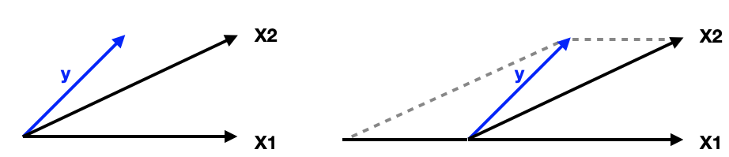

# 2.3. Practical Issues in Linear Regression

Linear regression is a powerful and widely-used method, but applying it to real-world data requires careful attention to several practical issues. This section covers the most important considerations when implementing linear regression, from data preparation to model interpretation and validation.

**Think of practical issues in linear regression as the "real-world challenges" that come up when you try to apply your recipe in different kitchens.** Just as a perfect recipe might not work the same way with different ingredients, equipment, or cooking conditions, linear regression models face real-world complications that require careful handling.

The transition from theoretical understanding to practical application reveals numerous challenges that must be addressed to build reliable and interpretable models. These issues range from computational considerations to statistical assumptions and real-world data complexities.

---

## 2.3.1. Analyzing Data with R/Python

Modern statistical computing provides powerful tools for implementing linear regression. Both R and Python offer comprehensive libraries for data analysis and modeling, each with their own strengths and specialized capabilities.

**Intuitive Understanding**: Choosing between R and Python for linear regression is like choosing between different types of kitchen equipment. R is like a specialized chef's kitchen with tools designed specifically for statistical cooking, while Python is like a versatile home kitchen that can handle many different types of cooking tasks.

### R Ecosystem for Linear Regression

**Base R Functions:**
- **`lm()`**: Core linear regression function with comprehensive output - like the main oven in a professional kitchen
- **`summary()`**: Detailed statistical summary including coefficients, standard errors, t-tests, and F-tests - like a detailed recipe card with all the measurements
- **`predict()`**: Generate predictions with confidence intervals - like predicting how a dish will taste before serving
- **`residuals()`**: Extract model residuals for diagnostics - like tasting the dish to see what went wrong

**Tidyverse Integration:**
- **`ggplot2`**: Advanced visualization capabilities for model diagnostics - like having a professional food photographer to document your cooking
- **`dplyr`**: Data manipulation and preprocessing - like having a well-organized prep station
- **`broom`**: Tidy model outputs for easy analysis - like having a clean, organized kitchen
- **`modelr`**: Model evaluation and cross-validation tools - like having taste testers to evaluate your recipes

**Specialized Packages:**
- **`car`**: Comprehensive diagnostics including VIF, outlier detection - like having a food safety inspector
- **`MASS`**: Robust regression methods (`rlm()`) - like having backup cooking methods for when things go wrong
- **`leaps`**: Model selection and subset selection - like having a recipe book to choose the best approach
- **`glmnet`**: Regularization methods (ridge, lasso, elastic net) - like having cooking techniques that work even with limited ingredients

### Python Ecosystem for Linear Regression

**scikit-learn:**
- **`LinearRegression`**: Fast, efficient implementation - like having a high-speed blender
- **`Ridge`, `Lasso`, `ElasticNet`**: Regularized regression - like having cooking techniques that work with any ingredients
- **`cross_val_score`**: Cross-validation utilities - like having multiple taste testers
- **`StandardScaler`, `MinMaxScaler`**: Data preprocessing - like having measuring tools that work with any units

**statsmodels:**
- **`OLS`**: Ordinary least squares with detailed statistical output - like having a detailed cooking manual
- **`GLM`**: Generalized linear models - like having recipes for different types of dishes
- **Comprehensive diagnostics**: Built-in assumption checking - like having built-in quality control
- **Statistical tests**: Formal hypothesis testing capabilities - like having scientific methods to test your cooking

**Data Manipulation:**
- **pandas**: Data structures and manipulation - like having a well-organized pantry
- **numpy**: Numerical computing foundation - like having precise measuring tools
- **matplotlib/seaborn**: Visualization and plotting - like having a food styling setup

### Comprehensive Example: Linear Regression Workflow

See the complete implementation in [`code/comprehensive_workflow.py`](code/comprehensive_workflow.py) which demonstrates a comprehensive linear regression workflow including data generation, model fitting, evaluation, and visualization.

### Correlation Among Predictors

Understanding the correlation structure among predictors is crucial for diagnosing multicollinearity and interpreting regression coefficients.

**Intuitive Understanding**: Correlation among predictors is like having ingredients that are similar to each other. If you have both "salt" and "sea salt" in your recipe, they're essentially the same thing, and it's hard to tell which one is really contributing to the flavor.



*Figure: Visualizing correlation among predictors in a regression model*

---

## 2.3.2. Interpreting Least Squares Coefficients


*Figure: Geometric interpretation of the least squares solution in linear regression*

Understanding how to interpret regression coefficients is crucial for extracting meaningful insights from your model. The interpretation of coefficients in multiple linear regression is more nuanced than in simple linear regression due to the presence of multiple predictors and their potential interactions.

**Intuitive Understanding**: Interpreting regression coefficients is like understanding how each ingredient contributes to the final taste of a dish. In a simple recipe, you can easily see how much salt affects the taste. But in a complex recipe with many ingredients, the effect of salt might depend on how much of other ingredients you're using.

### Mathematical Foundation of Coefficient Interpretation

In the multiple linear regression model:

$$ Y = \beta_0 + \beta_1 X_1 + \beta_2 X_2 + \cdots + \beta_p X_p + \epsilon $$

The coefficient $`\beta_j`$ represents the **partial derivative** of the response variable $`Y`$ with respect to predictor $`X_j`$:

$$ \beta_j = \frac{\partial Y}{\partial X_j} $$

This means that $`\beta_j`$ represents the expected change in the response variable $`Y`$ for a one-unit increase in predictor $`X_j`$, **holding all other predictors constant**.

**Intuition**: This is like asking "If I add one more teaspoon of salt while keeping everything else exactly the same, how much will the taste change?" The key is that everything else stays constant.

### Key Assumptions for Coefficient Interpretation

**1. Linearity Assumption:**
The relationship between $`X_j`$ and $`Y`$ is linear, conditional on all other predictors.

**Intuition**: This means that adding more of an ingredient has a consistent effect. Adding 2 teaspoons of salt has twice the effect of adding 1 teaspoon.

**2. Additivity Assumption:**
The effect of $`X_j`$ on $`Y`$ is additive and independent of the values of other predictors.

**Intuition**: This means that the effect of salt doesn't depend on how much pepper you're using. The effect of each ingredient is separate and can be added together.

**3. Ceteris Paribus Condition:**
The "holding all other predictors constant" assumption is crucial. This is often violated in practice when predictors are correlated.

**Intuition**: This is like trying to change only one ingredient while keeping everything else exactly the same. In reality, ingredients often change together - if you use more expensive ingredients, you might also use better cooking techniques.

### Understanding the "Holding Other Variables Constant" Assumption

The ceteris paribus condition is fundamental to interpreting multiple regression coefficients. Consider a model with two predictors:

$$ Y = \beta_0 + \beta_1 X_1 + \beta_2 X_2 + \epsilon $$

To understand $`\beta_1`$, we imagine:
1. Taking two observations with identical values of $`X_2`$ - like comparing two dishes with the same amount of pepper
2. The first observation has $`X_1 = x_1`$ - like one dish with 1 teaspoon of salt
3. The second observation has $`X_1 = x_1 + 1`$ - like another dish with 2 teaspoons of salt
4. The expected difference in $`Y`$ between these observations is $`\beta_1`$ - like the difference in taste between the two dishes

**Mathematical Derivation:**

$$ \begin{aligned}
Y_1 &= \beta_0 + \beta_1 x_1 + \beta_2 x_2 + \epsilon_1 \\
Y_2 &= \beta_0 + \beta_1 (x_1 + 1) + \beta_2 x_2 + \epsilon_2 \\
Y_2 - Y_1 &= \beta_1 + (\epsilon_2 - \epsilon_1)
\end{aligned} $$

Taking expectations:
$$ E[Y_2 - Y_1] = \beta_1 $$

**Intuition**: This mathematical derivation shows that when we compare two situations that differ only in the amount of one ingredient, the difference in outcome is exactly the effect of that ingredient.

### Coefficient Interpretation in Practice

**Standardized vs. Unstandardized Coefficients:**

**Unstandardized Coefficients** (raw coefficients):
- Interpreted in the original units of the variables - like measuring salt in teaspoons
- Depend on the scale of measurement - like the effect being different if you measure salt in grams vs. teaspoons
- Example: If $`X_1`$ is measured in dollars and $`\beta_1 = 0.05`$, then a $1 increase in $`X_1`$ is associated with a 0.05 unit increase in $`Y`$

**Intuition**: Unstandardized coefficients are like recipe measurements in their original units. They're easy to understand but hard to compare if the units are very different.

**Standardized Coefficients** (beta coefficients):
- Interpreted in standard deviation units - like measuring everything in "how unusual it is"
- Independent of the original scale - like comparing the effect of "unusual amounts" of different ingredients
- Example: If $`\beta_1^* = 0.3`$ (standardized), then a 1 standard deviation increase in $`X_1`$ is associated with a 0.3 standard deviation increase in $`Y`$

**Intuition**: Standardized coefficients are like measuring everything on the same scale. It's like asking "Which ingredient has the biggest effect when you use an unusual amount of it?"

**Python Example: Standardized Coefficients**

See the complete implementation in [`code/standardized_coefficients.py`](code/standardized_coefficients.py) which demonstrates standardized vs unstandardized coefficients in linear regression.

### Simple vs. Multiple Regression: The Confounding Effect

The coefficient for a predictor in simple linear regression (SLR) may differ significantly from its coefficient in multiple linear regression (MLR) due to correlations among predictors. This phenomenon is known as **confounding** or **omitted variable bias**.

**Intuitive Understanding**: Confounding is like having a cooking assistant who always adds salt whenever you add pepper. If you only look at the relationship between pepper and taste, you might think pepper is very important, when really it's the salt that's doing most of the work.

#### Mathematical Understanding of Confounding

Consider the true model:
$$ Y = \beta_0 + \beta_1 X_1 + \beta_2 X_2 + \epsilon $$

If we regress $`Y`$ on $`X_1`$ alone (simple regression), the estimated coefficient $`\hat{\beta}_1^{SLR}`$ will be biased:

$$ \hat{\beta}_1^{SLR} = \beta_1 + \beta_2 \cdot \frac{\text{Cov}(X_1, X_2)}{\text{Var}(X_1)} $$

The bias term $`\beta_2 \cdot \frac{\text{Cov}(X_1, X_2)}{\text{Var}(X_1)}`$ represents the **omitted variable bias**.

**Intuition**: This formula shows that the bias depends on two things: how much the omitted variable ($`X_2`$) affects the outcome ($`\beta_2`$), and how much the two variables are correlated ($`\frac{\text{Cov}(X_1, X_2)}{\text{Var}(X_1)}`$).

#### Example: Confounding Effect

Consider a scenario where:
- $`X_1`$ and $`X_2`$ are positively correlated ($`\rho_{12} > 0`$) - like salt and pepper being used together
- $`X_2`$ has a strong positive effect on $`Y`$ ($`\beta_2 > 0`$) - like salt having a big effect on taste
- $`X_1`$ has a weak or no direct effect on $`Y`$ ($`\beta_1 \approx 0`$) - like pepper having little effect on taste

In SLR, regressing $`Y`$ on $`X_1`$ alone might show a positive coefficient because $`X_1`$ is correlated with the truly important predictor $`X_2`$. However, in MLR, the coefficient for $`X_1`$ might become negative or zero once $`X_2`$ is included in the model.

**Intuition**: This is like discovering that the "pepper effect" you thought you saw was really just the salt that was always added with the pepper.

#### Comprehensive Python Example: Coefficient Changes

See the complete implementation in [`code/confounding_effect.py`](code/confounding_effect.py) which demonstrates the confounding effect in simple vs multiple regression with comprehensive visualization and analysis.

### Frisch-Waugh-Lovell Theorem: Understanding Partial Effects

The Frisch-Waugh-Lovell (FWL) theorem provides an elegant and intuitive way to understand how coefficients are computed in multiple regression. It decomposes the multiple regression coefficient into a series of simple regressions, making the concept of "partialling out" explicit.

**Intuitive Understanding**: The FWL theorem is like a cooking technique where you isolate the effect of one ingredient by removing the effects of all other ingredients. It's like asking "What would the effect of salt be if I could somehow remove the effects of all other ingredients?"

#### Mathematical Foundation

Consider the multiple regression model:
$$ Y = \beta_0 + \beta_1 X_1 + \beta_2 X_2 + \cdots + \beta_p X_p + \epsilon $$

The FWL theorem states that the coefficient $`\hat{\beta}_k`$ can be obtained through the following three-step process:

**Step 1:** Regress $`Y`$ on all predictors except $`X_k`$ and obtain residuals $`Y^*`$
$$ Y^* = Y - \hat{Y}_{-k} = Y - \hat{\alpha}_0 - \hat{\alpha}_1 X_1 - \cdots - \hat{\alpha}_{k-1} X_{k-1} - \hat{\alpha}_{k+1} X_{k+1} - \cdots - \hat{\alpha}_p X_p $$

**Intuition**: This is like removing the effects of all other ingredients from the outcome. The residuals represent the "unexplained" part of the outcome that the other ingredients couldn't account for.

**Step 2:** Regress $`X_k`$ on all other predictors and obtain residuals $`X_k^*`$
$$ X_k^* = X_k - \hat{X}_k = X_k - \hat{\gamma}_0 - \hat{\gamma}_1 X_1 - \cdots - \hat{\gamma}_{k-1} X_{k-1} - \hat{\gamma}_{k+1} X_{k+1} - \cdots - \hat{\gamma}_p X_p $$

**Intuition**: This is like removing the effects of all other ingredients from the predictor of interest. The residuals represent the "unique" part of the predictor that isn't explained by other ingredients.

**Step 3:** Regress $`Y^*`$ on $`X_k^*`$ - the coefficient equals $`\hat{\beta}_k`$
$$ \hat{\beta}_k = \frac{\text{Cov}(Y^*, X_k^*)}{\text{Var}(X_k^*)} $$

**Intuition**: This final step finds the relationship between the "unexplained" outcome and the "unique" predictor. It's like asking "How much does the unique part of salt affect the unexplained part of taste?"

#### Intuitive Interpretation

The FWL theorem shows that $`\hat{\beta}_k`$ captures the relationship between $`Y`$ and $`X_k`$ after "partialling out" or "controlling for" the effects of all other predictors. This is why multiple regression coefficients are often called **partial regression coefficients**.

**Key Insights:**
1. **Partial Effect:** $`\hat{\beta}_k`$ represents the effect of $`X_k`$ on $`Y`$ that is not explained by other predictors - like the unique contribution of salt to taste
2. **Residual Interpretation:** The residuals $`Y^*`$ and $`X_k^*`$ represent the "unique" variation in $`Y`$ and $`X_k`$ respectively - like the parts that other ingredients can't explain
3. **Orthogonality:** The residuals $`X_k^*`$ are orthogonal to all other predictors by construction - like having ingredients that are completely independent

**Intuition**: The FWL theorem is like a scientific method for isolating the effect of one ingredient. It systematically removes the effects of all other ingredients to see what's left.

#### Comprehensive Python Example: Frisch-Waugh-Lovell Implementation

See the complete implementation in [`code/frisch_waugh_lovell.py`](code/frisch_waugh_lovell.py) which demonstrates the Frisch-Waugh-Lovell theorem implementation with comprehensive visualization and verification of the partialling out process.

---

## 2.3.3. Hypothesis Testing in Linear Regression

Hypothesis testing is essential for determining whether relationships in your data are statistically significant or merely due to chance. In linear regression, we use hypothesis tests to assess the significance of individual coefficients and the overall model fit.

**Intuitive Understanding**: Hypothesis testing in linear regression is like conducting taste tests to see if your recipe really works. You're asking questions like "Is this ingredient really making a difference?" or "Is my recipe better than just guessing?" The tests help you distinguish between real effects and random chance.

### Mathematical Foundation of Hypothesis Testing

#### The F-Test: Testing Model Significance

The F-test is the most fundamental hypothesis test in linear regression. It compares two nested models to determine whether adding predictors significantly improves the model fit.

**Intuition**: The F-test is like comparing two recipes - a simple one and a more complex one - to see if the extra ingredients are worth the effort. It asks "Does the more complicated recipe taste significantly better?"

**F-Test Statistic:**

$$ F = \frac{(\text{RSS}_0 - \text{RSS}_a)/(p_a - p_0)}{\text{RSS}_a/(n-p_a)} = \frac{\text{MSR}}{\text{MSE}} $$

where:
- $`\text{RSS}_0`$ = Residual Sum of Squares for the null model - like how much the simple recipe misses the mark
- $`\text{RSS}_a`$ = Residual Sum of Squares for the alternative model - like how much the complex recipe misses the mark
- $`p_0`$ = Number of parameters in the null model - like the number of ingredients in the simple recipe
- $`p_a`$ = Number of parameters in the alternative model - like the number of ingredients in the complex recipe
- $`n`$ = Number of observations - like the number of taste testers
- $`\text{MSR}`$ = Mean Square Regression = $`(\text{RSS}_0 - \text{RSS}_a)/(p_a - p_0)`$ - like the improvement per extra ingredient
- $`\text{MSE}`$ = Mean Square Error = $`\text{RSS}_a/(n-p_a)`$ - like the average mistake the complex recipe makes

**Intuition**: The F-statistic compares how much the model improves (numerator) to how much error remains (denominator). A large F means the improvement is big compared to the remaining error.

**Distribution Properties:**
- Under the null hypothesis, $`F \sim F(p_a - p_0, n - p_a)`$ - like the F-distribution telling us what values to expect by chance
- The F-distribution has two degrees of freedom: numerator $`(p_a - p_0)`$ and denominator $`(n - p_a)`$ - like having two different ways to measure complexity
- Larger F-values indicate stronger evidence against the null hypothesis - like bigger improvements being less likely to happen by chance
- The p-value gives the probability of observing such an F-statistic under the null hypothesis - like the chance of getting such good results by luck

#### Alternative Formulations of the F-Test

**Using R²:**
$$ F = \frac{R^2_a / (p_a - p_0)}{(1 - R^2_a) / (n - p_a)} $$

**Intuition**: This version asks "How much of the story does the model tell (R²) compared to how much it doesn't tell (1-R²)?"

**Using Explained and Unexplained Variance:**
$$ F = \frac{\text{Explained Variance} / (p_a - p_0)}{\text{Unexplained Variance} / (n - p_a)} $$

**Intuition**: This version asks "How much of the variation does the model explain compared to how much it doesn't explain?"

### Types of F-Tests in Linear Regression

#### 1. Overall F-Test (Model Significance)

Tests whether the model with all predictors is significantly better than a model with only an intercept.

**Null Hypothesis:**
$$ H_0: \beta_1 = \beta_2 = \cdots = \beta_p = 0 $$

**Alternative Hypothesis:**
$$ H_a: \text{At least one } \beta_j \neq 0 $$

**Intuition**: This is like asking "Does my recipe work at all?" versus "Is it just as good as serving plain rice?"

**Test Statistic:**
$$ F = \frac{\text{MSR}}{\text{MSE}} = \frac{\sum_{i=1}^n (\hat{y}_i - \bar{y})^2 / p}{\sum_{i=1}^n (y_i - \hat{y}_i)^2 / (n-p-1)} $$

**Intuition**: This compares how much the model explains (compared to just predicting the average) to how much it doesn't explain.

#### 2. Partial F-Test (Individual Predictor Significance)

Tests whether adding a specific predictor significantly improves the model.

**Null Hypothesis:**
$$ H_0: \beta_j = 0 $$

**Alternative Hypothesis:**
$$ H_a: \beta_j \neq 0 $$

**Intuition**: This is like asking "Does this specific ingredient really make a difference?"

**Test Statistic:**
$$ F = \frac{(\text{RSS}_{\text{reduced}} - \text{RSS}_{\text{full}}) / 1}{\text{RSS}_{\text{full}} / (n-p-1)} $$

where the reduced model excludes predictor $`X_j`$ and the full model includes all predictors.

**Intuition**: This compares how much worse the model gets when you remove one ingredient to how much error remains in the full model.

#### 3. General Linear Hypothesis Test

Tests whether a set of linear constraints on the coefficients holds.

**Null Hypothesis:**
$$ H_0: \mathbf{L}\boldsymbol{\beta} = \mathbf{c} $$

where $`\mathbf{L}`$ is a matrix of constraints and $`\mathbf{c}`$ is a vector of constants.

**Intuition**: This is like testing more complex hypotheses, such as "Do two ingredients have the same effect?" or "Does the sum of three ingredients equal a specific amount?"

**Test Statistic:**
$$ F = \frac{(\mathbf{L}\hat{\boldsymbol{\beta}} - \mathbf{c})^T [\mathbf{L}(\mathbf{X}^T\mathbf{X})^{-1}\mathbf{L}^T]^{-1} (\mathbf{L}\hat{\boldsymbol{\beta}} - \mathbf{c}) / q}{\text{MSE}} $$

where $`q`$ is the number of constraints.

### Types of F-Tests

**1. Overall F-Test (Model Significance):**
Tests whether the model with all predictors is significantly better than a model with only an intercept.

$$ \begin{aligned}
H_0 &: Y = \beta_0 + \epsilon \\
H_a &: Y = \beta_0 + \beta_1 X_1 + \cdots + \beta_p X_p + \epsilon
\end{aligned} $$

**Intuition**: This is like comparing a complex recipe to just serving the basic ingredient.

**2. Partial F-Test (Individual Predictor Significance):**
Tests whether adding a specific predictor significantly improves the model.

$$ \begin{aligned}
H_0 &: Y = \beta_0 + \beta_1 X_1 + \cdots + \beta_{j-1} X_{j-1} + \beta_{j+1} X_{j+1} + \cdots + \beta_p X_p + \epsilon \\
H_a &: Y = \beta_0 + \beta_1 X_1 + \cdots + \beta_p X_p + \epsilon
\end{aligned} $$

**Intuition**: This is like testing whether adding one specific ingredient improves the recipe.

### t-Test: Testing Individual Coefficients

The t-test for individual coefficients is a special case of the F-test when testing a single coefficient. For the $`j`$-th coefficient:

$$ t_j = \frac{\hat{\beta}_j}{\text{SE}(\hat{\beta}_j)} $$

where $`\text{SE}(\hat{\beta}_j)`$ is the standard error of the coefficient estimate.

**Intuition**: The t-test is like asking "How big is the effect of this ingredient compared to how uncertain we are about that effect?"

#### Mathematical Derivation of Standard Errors

The standard error of $`\hat{\beta}_j`$ is derived from the variance-covariance matrix of the coefficient estimates:

$$ \text{Var}(\hat{\boldsymbol{\beta}}) = \sigma^2 (\mathbf{X}^T\mathbf{X})^{-1} $$

The standard error of $`\hat{\beta}_j`$ is:
$$ \text{SE}(\hat{\beta}_j) = \sqrt{\text{Var}(\hat{\beta}_j)} = \sqrt{\sigma^2 [(\mathbf{X}^T\mathbf{X})^{-1}]_{jj}} $$

where $`[(\mathbf{X}^T\mathbf{X})^{-1}]_{jj}`$ is the $`j`$-th diagonal element of $`(\mathbf{X}^T\mathbf{X})^{-1}`$.

**Intuition**: The standard error measures how uncertain we are about the coefficient estimate. It depends on how much noise there is in the data ($`\sigma^2`$) and how well we can estimate the coefficient given the data structure.

Since $`\sigma^2`$ is unknown, we estimate it using the mean squared error:
$$ \hat{\sigma}^2 = \text{MSE} = \frac{\text{RSS}}{n-p-1} $$

**Intuition**: We estimate the noise level by looking at how much the model misses the mark, on average.

#### Distribution Properties

Under the null hypothesis $`H_0: \beta_j = 0`$:
$$ t_j = \frac{\hat{\beta}_j}{\text{SE}(\hat{\beta}_j)} \sim t(n-p-1) $$

The t-statistic follows a t-distribution with $`n-p-1`$ degrees of freedom.

**Intuition**: The t-distribution tells us what values of the t-statistic we would expect to see by chance if the ingredient really had no effect.

#### Relationship Between t-Test and F-Test

For testing a single coefficient, the t-test and F-test are equivalent:
$$ F = t^2 $$

This is because the F-distribution with 1 numerator degree of freedom is the square of the t-distribution.

**Intuition**: When testing one ingredient, the t-test and F-test are asking the same question in slightly different ways.

#### Comprehensive Python Example: Hypothesis Testing

See the complete implementation in [`code/hypothesis_testing.py`](code/hypothesis_testing.py) which demonstrates comprehensive hypothesis testing including F-tests, t-tests, confidence intervals, and the distinction between statistical and practical significance.

### Understanding Low R² and Significant F-Test: Statistical vs. Practical Significance

It's crucial to distinguish between **statistical significance** and **practical significance** when interpreting regression results. This distinction becomes particularly important with large sample sizes.

**Intuitive Understanding**: Statistical significance is like having a very sensitive taste test that can detect tiny differences, while practical significance is about whether those differences matter in the real world. A recipe might be statistically better than plain rice, but if the improvement is tiny, it might not be worth the extra effort.

#### Key Concepts

**Statistical Significance (F-test):**
- Tests whether the relationship exists in the population - like asking "Is there really a difference?"
- Measures whether the observed relationship is unlikely to occur by chance - like asking "Could this happen by luck?"
- Depends on sample size, effect size, and variability - like the sensitivity of your taste test

**Practical Significance (R²):**
- Measures the strength of the relationship - like asking "How big is the difference?"
- Indicates how much of the variance in the response is explained by the predictors - like asking "How much of the story does this tell?"
- Independent of sample size (though precision increases with sample size) - like the actual size of the improvement

#### Mathematical Relationship

The F-statistic and R² are mathematically related:

$$ F = \frac{R^2 / p}{(1 - R^2) / (n - p - 1)} $$

This shows that:
- For a given R², F increases with sample size $`n`$ - like having more taste testers making it easier to detect small differences
- For a given sample size, F increases with R² - like bigger effects being easier to detect
- With large samples, even small R² values can lead to large F-statistics - like very sensitive tests detecting tiny effects

**Intuition**: This formula shows why large sample sizes can make tiny effects statistically significant even when they're not practically important.

#### The Large Sample Size Effect

With large sample sizes, even weak relationships can be statistically significant. A model might have:
- Low R² (e.g., 0.05) indicating weak predictive power - like a recipe that's only slightly better than plain rice
- Highly significant F-test (p < 0.001) indicating the relationship is not due to chance - like being very confident that there's a real difference

**Example: Large Sample Size Effect**

The sample size effect demonstration is included in [`code/hypothesis_testing.py`](code/hypothesis_testing.py) as part of the comprehensive hypothesis testing analysis, showing how large sample sizes can detect tiny effects that may not be practically meaningful.

#### Guidelines for Interpretation

**1. Consider Both Statistical and Practical Significance:**
- A significant F-test doesn't guarantee a meaningful relationship - like detecting a tiny improvement that's not worth the effort
- A high R² doesn't guarantee statistical significance (especially with small samples) - like having a big effect but not enough data to be sure

**2. Effect Size Guidelines:**
- R² < 0.01: Negligible effect - like a difference so small you can't taste it
- 0.01 ≤ R² < 0.09: Small effect - like a subtle improvement
- 0.09 ≤ R² < 0.25: Medium effect - like a noticeable improvement
- R² ≥ 0.25: Large effect - like a major improvement

**3. Sample Size Considerations:**
- With large samples (>1000), focus more on effect size than p-values - like caring more about how big the improvement is than whether it's statistically detectable
- With small samples (<50), be cautious about interpreting non-significant results - like not being sure about the effect when you have few taste testers
- Consider power analysis when designing studies - like planning how many taste testers you need to detect a meaningful difference

**4. Domain-Specific Interpretation:**
- What constitutes a "meaningful" effect varies by field - like different standards for what counts as "good cooking"
- Consider the cost and feasibility of interventions - like whether the extra ingredients are worth the cost
- Consult with subject matter experts - like asking experienced chefs for advice

---

## 2.3.4. Handling Categorical Variables

Categorical variables require special treatment in linear regression because the model expects numerical inputs. The most common approach is one-hot encoding (dummy coding), but there are several encoding strategies available depending on the nature of the categorical variable and the research question.

**Intuitive Understanding**: Categorical variables are like different types of ingredients that can't be measured on a continuous scale. You can't say "add 2.5 cups of salt" - you either add salt or you don't. Similarly, you can't say "this house is 2.5 bedrooms" - it's either 2 or 3 bedrooms. We need special ways to handle these discrete categories in our mathematical model.

### Mathematical Foundation

#### One-Hot Encoding (Dummy Coding)

One-hot encoding converts categorical variables into binary indicators. For a categorical variable with $`k`$ levels, we create $`k-1`$ dummy variables to avoid perfect multicollinearity.

**Intuition**: One-hot encoding is like creating separate "yes/no" questions for each category. Instead of asking "What type of house is this?" we ask "Is this a 2-bedroom house?" "Is this a 3-bedroom house?" etc.

**Mathematical Representation:**

Consider a categorical variable $`C`$ with $`k`$ levels: $`\{c_1, c_2, \ldots, c_k\}`$

We create $`k-1`$ dummy variables:
$$ D_j = \begin{cases}
1 & \text{if } C = c_{j+1} \\
0 & \text{otherwise}
\end{cases}, \quad j = 1, 2, \ldots, k-1 $$

The regression model becomes:
$$ Y = \beta_0 + \beta_1 D_1 + \beta_2 D_2 + \cdots + \beta_{k-1} D_{k-1} + \epsilon $$

**Interpretation:**
- $`\beta_0`$ = Expected response for the reference category $`c_1`$ - like the baseline taste when using the default ingredient
- $`\beta_j`$ = Expected difference in response between category $`c_{j+1}`$ and the reference category $`c_1`$ - like how much the taste changes when you use a different ingredient

#### Example: Size Variable with Three Levels

Consider a categorical variable `Size` with three levels: Small (S), Medium (M), Large (L).

**Original Data:**
$$ \mathbf{C} = \begin{pmatrix}
S \\
S \\
M \\
M \\
L \\
L
\end{pmatrix} $$

**One-Hot Encoded Design Matrix:**
$$ \mathbf{D} = \begin{pmatrix}
1 & 0 & 0 \\
1 & 0 & 0 \\
1 & 1 & 0 \\
1 & 1 & 0 \\
1 & 0 & 1 \\
1 & 0 & 1
\end{pmatrix} $$

Here:
- Column 1: Intercept (all ones) - like the baseline for all dishes
- Column 2: Medium dummy (1 if Medium, 0 otherwise) - like "Is this a medium-sized dish?"
- Column 3: Large dummy (1 if Large, 0 otherwise) - like "Is this a large-sized dish?"
- Small is the reference category (all zeros in dummy columns) - like the default size

**Model Interpretation:**
- $`\beta_0`$ = Expected response for Small - like the baseline taste for small dishes
- $`\beta_1`$ = Expected difference in response between Medium and Small - like how much better medium dishes taste compared to small ones
- $`\beta_2`$ = Expected difference in response between Large and Small - like how much better large dishes taste compared to small ones

**Predicted Values:**
- Small: $`\hat{Y} = \beta_0`$ - like the baseline prediction
- Medium: $`\hat{Y} = \beta_0 + \beta_1`$ - like the baseline plus the medium effect
- Large: $`\hat{Y} = \beta_0 + \beta_2`$ - like the baseline plus the large effect

#### Comprehensive Python Example: Categorical Variables

See the complete implementation in [`code/categorical_variables.py`](code/categorical_variables.py) which demonstrates comprehensive categorical variable handling including one-hot encoding, interaction terms, model comparison, and significance testing.

### Interaction Terms with Categorical Variables

When categorical variables interact with continuous variables, the effect of the continuous variable can differ by category.

**Intuition**: Interactions are like having different cooking techniques for different types of ingredients. The effect of cooking time might be different for chicken versus fish, or the effect of temperature might be different for different types of dough.

**Design Matrix with Interactions:**

For a categorical variable `Size` and continuous variable `x`:

$$ \begin{pmatrix}
1 & 0 & 0 & x_1 & 0 & 0 \\
1 & 0 & 0 & x_2 & 0 & 0 \\
1 & 1 & 0 & x_3 & x_3 & 0 \\
1 & 1 & 0 & x_4 & x_4 & 0 \\
1 & 0 & 1 & x_5 & 0 & x_5 \\
1 & 0 & 1 & x_6 & 0 & x_6
\end{pmatrix} $$

This matrix includes:
- Intercept column (all ones) - like the baseline for all dishes
- Dummy variables for Medium and Large - like the size effects
- Continuous variable `x` - like cooking time
- Interaction terms: `x` × Medium and `x` × Large - like how cooking time affects different sizes differently

**Model Interpretation:**
- For Small: $`Y = \beta_0 + \beta_3 x`$ - like the baseline plus the effect of cooking time for small dishes
- For Medium: $`Y = \beta_0 + \beta_1 + \beta_3 x + \beta_4 x = (\beta_0 + \beta_1) + (\beta_3 + \beta_4) x`$ - like the medium baseline plus the medium-specific cooking time effect
- For Large: $`Y = \beta_0 + \beta_2 + \beta_3 x + \beta_5 x = (\beta_0 + \beta_2) + (\beta_3 + \beta_5) x`$ - like the large baseline plus the large-specific cooking time effect

**Intuition**: This allows the effect of cooking time to be different for different dish sizes, just like you might cook a small chicken breast differently than a large one.

**Python Example: Categorical Variables**

A simple categorical variables example is included in [`code/categorical_variables.py`](code/categorical_variables.py) which demonstrates basic one-hot encoding and model fitting.

### Alternative Encoding Methods

**1. Ordinal Encoding:**
For ordered categories, assign numerical values based on order.
```python
# Example: Education level
education_map = {'High School': 1, 'Bachelor': 2, 'Master': 3, 'PhD': 4}
```

**Intuition**: This is like ranking ingredients by quality - you assume that higher numbers mean better quality.

**2. Frequency Encoding:**
Replace categories with their frequency in the dataset.
```python
freq_encoding = df['category'].value_counts(normalize=True)
```

**Intuition**: This is like using how common an ingredient is as a measure - rare ingredients might be more valuable.

**3. Target Encoding:**
Replace categories with the mean target value for that category (use with caution to avoid data leakage).

**Intuition**: This is like using the average outcome for each category - but be careful not to use information from the future!

---

## 2.3.5. Collinearity (Multicollinearity)

Collinearity occurs when predictors are highly correlated, making it difficult to determine the individual contribution of each predictor to the response.

**Intuitive Understanding**: Collinearity is like having ingredients that are very similar to each other. If you have both "salt" and "sea salt" in your recipe, it's hard to tell which one is really contributing to the flavor. The model can't easily separate their individual effects.

### Detecting Collinearity

**1. Correlation Matrix:**
Examine pairwise correlations between predictors.

**Intuition**: This is like checking how similar your ingredients are to each other. High correlations suggest ingredients that might be redundant.

Correlation matrix analysis is included in [`code/collinearity_analysis.py`](code/collinearity_analysis.py) which demonstrates correlation heatmaps and VIF calculation.

**2. Variance Inflation Factor (VIF):**
VIF measures how much the variance of a coefficient is inflated due to collinearity.

$$ \text{VIF}_j = \frac{1}{1 - R_j^2} $$

where $`R_j^2`$ is the R² from regressing predictor $`X_j`$ on all other predictors.

**Intuition**: VIF measures how much one ingredient can be predicted from the other ingredients. A high VIF means the ingredient is redundant - you could almost guess how much of it to use based on the other ingredients.

**Python Example: VIF Calculation**

VIF calculation and analysis is included in [`code/collinearity_analysis.py`](code/collinearity_analysis.py) which provides comprehensive VIF calculation and interpretation.

### Consequences of Collinearity

**1. Unstable Coefficients:**
- Small changes in data can lead to large changes in coefficient estimates - like the recipe being very sensitive to small changes
- Coefficients may have opposite signs from what theory suggests - like getting negative effects when you expect positive ones

**Intuition**: This is like having a recipe that's very finicky - small changes in ingredients cause big changes in the result, and sometimes the effects don't make sense.

**2. Inflated Standard Errors:**
- Standard errors become large, making it difficult to reject null hypotheses - like being very uncertain about the effects
- Confidence intervals become wide - like having a wide range of possible effects

**Intuition**: This is like being very uncertain about which ingredient is really important because they're so similar.

**3. Reduced Statistical Power:**
- Individual predictors may appear insignificant even when they are important - like not being able to detect the effect of an important ingredient

**Intuition**: This is like having a taste test that can't tell the difference between similar ingredients, even when one is clearly better.

**Example: Collinearity Effects**

Collinearity effects demonstration is included in [`code/collinearity_analysis.py`](code/collinearity_analysis.py) which shows how collinearity affects coefficient estimates and model stability.

### Addressing Collinearity

**1. Remove Redundant Predictors:**
- Use domain knowledge to identify and remove redundant variables - like choosing the best version of similar ingredients
- Use stepwise selection methods - like systematically testing which ingredients to keep

**Intuition**: This is like cleaning up your recipe by removing duplicate or very similar ingredients.

**2. Combine Predictors:**
- Create composite variables (e.g., average of related measures) - like creating a "spice blend" from individual spices
- Use principal components analysis (PCA) - like creating new "super ingredients" from combinations of old ones

**Intuition**: This is like creating new ingredients that capture the important aspects of several similar ingredients.

**3. Regularization:**
- Ridge regression (L2 penalty) - like adding constraints that prevent any ingredient from being used in extreme amounts
- Lasso regression (L1 penalty) - like forcing some ingredients to be used in zero amounts
- Elastic net - like combining both approaches

**Intuition**: This is like using cooking techniques that work even when you have similar ingredients.

**4. Collect More Data:**
- More observations can help reduce the impact of collinearity - like having more taste tests to distinguish between similar ingredients

**Intuition**: This is like having more opportunities to see the subtle differences between similar ingredients.

---

## 2.3.6. Model Assumptions and Outliers

Linear regression relies on several assumptions. While violations don't necessarily invalidate the model, understanding them helps in proper interpretation and potential remedies.

**Intuitive Understanding**: Model assumptions are like the rules that make a recipe work. If you follow the rules, the recipe turns out well. If you violate them, the result might still be edible, but it won't be what you expected. Understanding the assumptions helps you know when your model might not work as expected.

### The LINE Assumptions

**L - Linearity:**
The relationship between predictors and response is linear.

$$ Y = \beta_0 + \beta_1 X_1 + \cdots + \beta_p X_p + \epsilon $$

**Intuition**: This means that adding more of an ingredient has a consistent effect. Adding 2 teaspoons of salt has twice the effect of adding 1 teaspoon.

**I - Independence:**
Observations are independent of each other.

**Intuition**: This means that each dish you cook doesn't affect how the next dish turns out. Each observation is like cooking a separate dish.

**N - Normality:**
Errors are normally distributed: $`\epsilon \sim N(0, \sigma^2)`$

**Intuition**: This means that the random variations in your cooking follow a bell curve - most dishes turn out close to what you expect, with fewer dishes being very different.

**E - Equal Variance (Homoscedasticity):**
Errors have constant variance across all values of predictors.

**Intuition**: This means that the amount of random variation is the same whether you're cooking a small dish or a large dish.

### Checking Assumptions

**1. Linearity:**
- Plot residuals vs. fitted values - like checking if the mistakes follow a pattern
- Plot residuals vs. individual predictors - like checking if the mistakes depend on specific ingredients
- Look for systematic patterns - like seeing if there's a method to the madness

**Python Example: Linearity Check**

Linearity assumption checking is included in [`code/model_assumptions_diagnostics.py`](code/model_assumptions_diagnostics.py) which provides comprehensive diagnostic plots and tests for all model assumptions.

**2. Normality:**
- Q-Q plot of residuals - like checking if the mistakes follow the expected pattern
- Histogram of residuals - like seeing the distribution of mistakes
- Shapiro-Wilk test - like a formal test for normality

**Python Example: Normality Check**

Normality assumption checking is included in [`code/model_assumptions_diagnostics.py`](code/model_assumptions_diagnostics.py) which provides Q-Q plots, histograms, and statistical tests for normality.

**3. Homoscedasticity:**
- Plot residuals vs. fitted values - like checking if the size of mistakes varies
- Look for funnel-shaped patterns - like seeing if mistakes get bigger or smaller with different predictions

**4. Independence:**
- Check for time series patterns if data is time-ordered - like seeing if today's cooking affects tomorrow's
- Look for clustering in residual plots - like seeing if mistakes happen in groups

### Outlier Detection and Handling

**Types of Outliers:**

1. **Leverage Points:** Unusual values in predictors - like using an extremely unusual ingredient
2. **Influential Points:** Points that significantly affect coefficient estimates - like one dish that changes your entire recipe
3. **Outliers:** Points with large residuals - like dishes that turn out very differently than expected

**Detection Methods:**

**1. Leverage (Hat Values):**
$$ H = X(X^T X)^{-1} X^T $$

The diagonal elements $`h_{ii}`$ measure leverage. Points with $`h_{ii} > 2(p+1)/n`$ are considered high leverage.

**Intuition**: Leverage measures how much influence each observation has on its own prediction. It's like measuring how much each dish affects your recipe.

**2. Cook's Distance:**
Measures the influence of each observation on the entire regression.

$$ D_i = \frac{(\hat{\beta} - \hat{\beta}_{(i)})^T (X^T X) (\hat{\beta} - \hat{\beta}_{(i)})}{(p+1) \hat{\sigma}^2} $$

**Intuition**: Cook's distance measures how much the entire recipe changes when you remove one dish. It's like seeing how much your cooking style changes when you ignore one experience.

**Python Example: Outlier Detection**

Outlier detection and analysis is included in [`code/model_assumptions_diagnostics.py`](code/model_assumptions_diagnostics.py) which provides comprehensive outlier detection using leverage, Cook's distance, and standardized residuals.

### Practical Recommendations

**1. Data Inspection:**
- Always examine your data for missing values, extreme values, and data quality issues - like checking your ingredients before cooking
- Use summary statistics and visualizations - like tasting and smelling your ingredients

**2. Transformations:**
- Log transformation for right-skewed variables - like adjusting for ingredients that have very wide ranges
- Square root transformation for count data - like adjusting for ingredients you count rather than measure
- Box-Cox transformation for general skewness - like a general method for adjusting ingredient distributions

**3. Robust Methods:**
- Use robust regression methods when assumptions are violated - like using cooking techniques that work even when things go wrong
- Consider weighted least squares for heteroscedasticity - like giving more weight to dishes that are more reliable

**4. Model Validation:**
- Use cross-validation to assess model performance - like testing your recipe on different occasions
- Check for overfitting, especially with many predictors - like making sure your recipe isn't too complicated

**5. Domain Knowledge:**
- Always consider the context and meaning of your variables - like understanding what your ingredients really are
- Consult with subject matter experts when possible - like asking experienced chefs for advice

---

**Key Takeaways:**

1. **Coefficient interpretation** requires understanding the context and potential confounding effects - like understanding that the effect of salt might depend on what else is in the dish
2. **Hypothesis testing** helps distinguish between statistical and practical significance - like knowing when a difference is real versus when it matters
3. **Categorical variables** need proper encoding to be included in regression models - like converting "types of ingredients" into numbers the model can use
4. **Collinearity** can mask important relationships and should be addressed - like dealing with ingredients that are too similar to each other
5. **Model assumptions** should be checked, but minor violations may not be critical - like following recipe rules but knowing when you can bend them
6. **Outliers** should be investigated but not automatically removed without justification - like understanding why a dish turned out differently before deciding to ignore it

Understanding these practical issues is essential for building reliable and interpretable linear regression models. The key is to combine statistical rigor with practical judgment and domain knowledge.

**Intuition**: Practical issues in linear regression are like the real-world challenges that come up when you try to apply a perfect recipe in different kitchens. You need to understand the theory (the recipe), but you also need to know how to handle the practical complications (different ingredients, equipment, conditions) that arise in real-world applications.

---

**Navigation:**
- **Next Topic:** *This is the last topic in the linear regression section*
- **Previous Topic:** [Geometric Interpretation](02_geometric_interpretation.md) - Visual and mathematical foundation of linear regression through vector spaces and projection

## Code Files Summary

This chapter includes several Python code files that demonstrate the practical implementation of linear regression concepts:

- **`code/frisch_waugh_lovell.py`**: Demonstrates the Frisch-Waugh-Lovell theorem implementation with comprehensive visualization and verification of the partialling out process.

- **`code/hypothesis_testing.py`**: Provides comprehensive hypothesis testing including F-tests, t-tests, confidence intervals, and the distinction between statistical and practical significance.

- **`code/categorical_variables.py`**: Demonstrates comprehensive categorical variable handling including one-hot encoding, interaction terms, model comparison, and significance testing.

- **`code/collinearity_analysis.py`**: Provides comprehensive collinearity detection and analysis including VIF calculation, correlation analysis, and remedies for collinearity.

- **`code/model_assumptions_diagnostics.py`**: Offers comprehensive diagnostic tools for checking linear regression assumptions including linearity, normality, homoscedasticity, and outlier detection.

Each code file is self-contained and includes detailed documentation, examples, and visualizations to help understand the practical implementation of these concepts.
