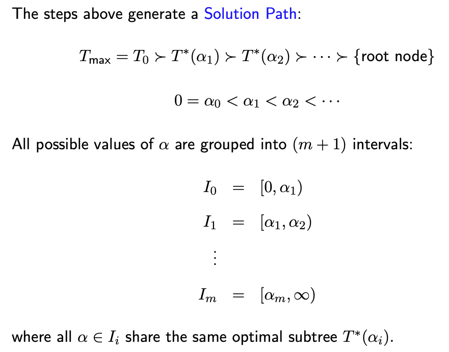
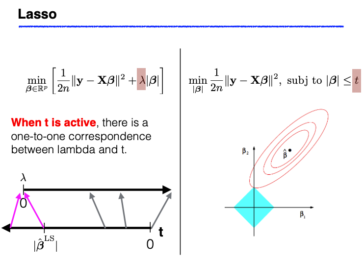

# 3.2. Regularization

## Introduction

Regularization is a fundamental concept in statistical learning that addresses the bias-variance tradeoff by introducing penalty terms to the objective function. In this comprehensive lecture, we'll explore the theoretical foundations, mathematical formulations, and practical implementations of regularization methods.



*Figure: Solution paths for ridge and lasso regression. Shows how coefficients change as the regularization parameter varies.*

## 3.2.1 The Regularization Framework

### Motivation and Problem Setup

Regularization emerges from the fundamental challenge in statistical learning: balancing model complexity with generalization performance. When we have many predictors relative to the sample size, or when predictors are highly correlated, the standard least squares estimator can suffer from:

1. **High variance**: Small changes in data lead to large changes in coefficient estimates
2. **Overfitting**: The model captures noise rather than true signal
3. **Poor generalization**: Good in-sample performance but poor out-of-sample prediction

### Mathematical Foundation

Consider the standard linear regression model:

```math
\mathbf{y} = \mathbf{X}\boldsymbol{\beta} + \boldsymbol{\varepsilon}
```

where:
- $\mathbf{y} \in \mathbb{R}^n$ is the response vector
- $\mathbf{X} \in \mathbb{R}^{n \times p}$ is the design matrix
- $\boldsymbol{\beta} \in \mathbb{R}^p$ is the coefficient vector
- $\boldsymbol{\varepsilon} \sim N(0, \sigma^2\mathbf{I})$ is the error vector

The ordinary least squares (OLS) estimator minimizes:

```math
\min_{\boldsymbol{\beta}} \|\mathbf{y} - \mathbf{X}\boldsymbol{\beta}\|^2_2
```

### The Regularization Objective Function

Regularization introduces a penalty term to control model complexity:

```math
\min_{\boldsymbol{\beta}} \|\mathbf{y} - \mathbf{X}\boldsymbol{\beta}\|^2_2 + \lambda \cdot P(\boldsymbol{\beta})
```

where:
- $\lambda \geq 0$ is the regularization parameter (controls penalty strength)
- $P(\boldsymbol{\beta})$ is the penalty function that encodes our prior beliefs about the coefficient structure

## 3.2.2 L0 Regularization: Subset Selection Revisited

### Mathematical Formulation

The L0 penalty counts the number of non-zero coefficients:

```math
P(\boldsymbol{\beta}) = \|\boldsymbol{\beta}\|_0 = \sum_{j=1}^p \mathbf{1}_{\{\beta_j \neq 0\}}
```

This leads to the objective function:

```math
\min_{\boldsymbol{\beta}} \|\mathbf{y} - \mathbf{X}\boldsymbol{\beta}\|^2_2 + \lambda \|\boldsymbol{\beta}\|_0
```

### Connection to Information Criteria

The L0 penalty is closely related to information criteria like AIC and BIC:

**AIC (Akaike Information Criterion):**
```math
\text{AIC} = n\log(\text{RSS}/n) + 2p
```

**BIC (Bayesian Information Criterion):**
```math
\text{BIC} = n\log(\text{RSS}/n) + \log(n)p
```

where RSS is the residual sum of squares.

### Computational Challenges

The L0 penalty creates a non-convex optimization problem that is NP-hard. The solution requires exploring all $2^p$ possible subsets, which becomes computationally infeasible for large $p$.

## 3.2.3 L2 Regularization: Ridge Regression

### Mathematical Formulation

Ridge regression uses the L2 penalty:

```math
P(\boldsymbol{\beta}) = \|\boldsymbol{\beta}\|^2_2 = \sum_{j=1}^p \beta_j^2
```

The objective function becomes:

```math
\min_{\boldsymbol{\beta}} \|\mathbf{y} - \mathbf{X}\boldsymbol{\beta}\|^2_2 + \lambda \|\boldsymbol{\beta}\|^2_2
```

### Closed-Form Solution

The ridge estimator has a closed-form solution:

```math
\hat{\boldsymbol{\beta}}_{\text{ridge}} = (\mathbf{X}^T\mathbf{X} + \lambda\mathbf{I})^{-1}\mathbf{X}^T\mathbf{y}
```

### Geometric Interpretation

Ridge regression can be interpreted as:
1. **Bayesian prior**: Assuming $\boldsymbol{\beta} \sim N(0, \tau^2\mathbf{I})$ where $\lambda = \sigma^2/\tau^2$
2. **Constrained optimization**: Minimizing RSS subject to $\|\boldsymbol{\beta}\|^2_2 \leq t$
3. **Shrinkage**: Pulling coefficients toward zero

### Bias-Variance Tradeoff

The ridge estimator introduces bias but reduces variance:

```math
\text{Bias}(\hat{\boldsymbol{\beta}}_{\text{ridge}}) = -\lambda(\mathbf{X}^T\mathbf{X} + \lambda\mathbf{I})^{-1}\boldsymbol{\beta}
```

```math
\text{Var}(\hat{\boldsymbol{\beta}}_{\text{ridge}}) = \sigma^2(\mathbf{X}^T\mathbf{X} + \lambda\mathbf{I})^{-1}\mathbf{X}^T\mathbf{X}(\mathbf{X}^T\mathbf{X} + \lambda\mathbf{I})^{-1}
```

## 3.2.4 L1 Regularization: Lasso Regression

### Mathematical Formulation

Lasso regression uses the L1 penalty:

```math
P(\boldsymbol{\beta}) = \|\boldsymbol{\beta}\|_1 = \sum_{j=1}^p |\beta_j|
```

The objective function becomes:

```math
\min_{\boldsymbol{\beta}} \|\mathbf{y} - \mathbf{X}\boldsymbol{\beta}\|^2_2 + \lambda \|\boldsymbol{\beta}\|_1
```

### Key Properties

1. **Sparsity**: Lasso can produce exactly zero coefficients, performing automatic variable selection
2. **Convexity**: The L1 penalty is convex, making optimization tractable
3. **Non-differentiability**: The L1 penalty is not differentiable at zero

### Geometric Interpretation

Lasso can be viewed as constrained optimization:

```math
\min_{\boldsymbol{\beta}} \|\mathbf{y} - \mathbf{X}\boldsymbol{\beta}\|^2_2 \quad \text{subject to} \quad \|\boldsymbol{\beta}\|_1 \leq t
```

The L1 constraint creates a diamond-shaped feasible region that can intersect the contours of the RSS at corners, leading to sparse solutions.



*Figure: Geometric interpretation of the lasso constraint and solution. The diamond-shaped constraint region leads to sparse solutions.*

### Soft Thresholding

For orthogonal design matrices, the lasso solution has a simple form:

```math
\hat{\beta}_j = S(\hat{\beta}_j^{\text{OLS}}, \lambda) = \text{sign}(\hat{\beta}_j^{\text{OLS}}) \cdot \max(|\hat{\beta}_j^{\text{OLS}}| - \lambda, 0)
```

where $S$ is the soft thresholding operator.

## 3.2.5 Data Preprocessing and Standardization

### The Scaling Problem

Regularization methods are sensitive to the scale of predictors. Consider two scenarios:

1. **Price in dollars vs thousands of dollars**: $X_1 = 1000X_1'$
2. **Location shifts**: $X_1 = X_1' + c$

These transformations can dramatically affect coefficient estimates and model performance.

### Standardization Solution

To ensure consistent results, we standardize the data:

**For predictors:**
```math
\tilde{X}_{ij} = \frac{X_{ij} - \bar{X}_j}{s_j}
```

where:
- $\bar{X}_j = \frac{1}{n}\sum_{i=1}^n X_{ij}$ is the sample mean
- $s_j = \sqrt{\frac{1}{n-1}\sum_{i=1}^n (X_{ij} - \bar{X}_j)^2}$ is the sample standard deviation

**For response:**
```math
\tilde{y}_i = \frac{y_i - \bar{y}}{s_y}
```

### Coefficient Transformation

After fitting the model on standardized data, we transform coefficients back to the original scale:

```math
\hat{\beta}_j^{\text{original}} = \hat{\beta}_j^{\text{standardized}} \cdot \frac{s_y}{s_j}
```

```math
\hat{\beta}_0^{\text{original}} = \bar{y} - \sum_{j=1}^p \hat{\beta}_j^{\text{original}} \bar{X}_j
```

## 3.2.6 Practical Implementation

### Python Implementation

See the complete implementation in [`code/regularization_comparison.py`](code/regularization_comparison.py) which demonstrates ridge vs lasso regularization comparison with comprehensive analysis and visualization.

### R Implementation

See the complete R implementation in [`code/regularization_comparison.R`](code/regularization_comparison.R) which demonstrates ridge vs lasso regularization comparison using the glmnet package with comprehensive analysis and visualization.

## 3.2.7 Theoretical Properties

### Ridge Regression Properties

1. **Bias**: Ridge introduces bias but reduces variance
2. **Multicollinearity**: Ridge handles multicollinearity effectively
3. **Stability**: Ridge estimates are more stable than OLS
4. **No sparsity**: Ridge rarely produces exactly zero coefficients

### Lasso Properties

1. **Sparsity**: Lasso can produce exactly zero coefficients
2. **Variable selection**: Automatic feature selection
3. **Interpretability**: Sparse models are often more interpretable
4. **Group selection**: Lasso may not handle grouped variables well

### Comparison of Penalties

| Property | L0 | L1 (Lasso) | L2 (Ridge) |
|----------|----|------------|------------|
| Sparsity | Yes | Yes | No |
| Convexity | No | Yes | Yes |
| Computational cost | NP-hard | Polynomial | Polynomial |
| Variable selection | Yes | Yes | No |
| Group selection | Yes | No | No |

## 3.2.8 Advanced Topics

### Elastic Net

Elastic net combines L1 and L2 penalties:

```math
\min_{\boldsymbol{\beta}} \|\mathbf{y} - \mathbf{X}\boldsymbol{\beta}\|^2_2 + \lambda_1 \|\boldsymbol{\beta}\|_1 + \lambda_2 \|\boldsymbol{\beta}\|^2_2
```

This provides a compromise between ridge and lasso, offering both shrinkage and variable selection.

### Group Lasso

For grouped variables, group lasso uses:

```math
P(\boldsymbol{\beta}) = \sum_{g=1}^G \|\boldsymbol{\beta}_g\|_2
```

where $\boldsymbol{\beta}_g$ represents coefficients for group $g$.

### Adaptive Lasso

Adaptive lasso uses weighted L1 penalty:

```math
P(\boldsymbol{\beta}) = \sum_{j=1}^p w_j |\beta_j|
```

where weights $w_j$ are typically based on initial OLS estimates.

## 3.2.9 Model Selection and Validation

### Cross-Validation

Use cross-validation to select the optimal regularization parameter. See the complete implementation in [`code/cross_validation_selection.py`](code/cross_validation_selection.py) which demonstrates cross-validation for regularization parameter selection with comprehensive analysis and visualization.

### Information Criteria

For model comparison, consider:

1. **AIC**: $\text{AIC} = n\log(\text{RSS}/n) + 2p$
2. **BIC**: $\text{BIC} = n\log(\text{RSS}/n) + \log(n)p$
3. **Adjusted R²**: $R^2_{adj} = 1 - \frac{\text{RSS}/(n-p-1)}{\text{TSS}/(n-1)}$

## 3.2.10 Practical Guidelines

### When to Use Ridge vs Lasso

**Use Ridge when:**
- Predictors are highly correlated
- You want to keep all variables
- Primary goal is prediction accuracy
- Sample size is small relative to number of predictors

**Use Lasso when:**
- You want automatic variable selection
- Interpretability is important
- You suspect many coefficients are exactly zero
- You want a sparse model

### Best Practices

1. **Always standardize predictors** before applying regularization
2. **Use cross-validation** to select the regularization parameter
3. **Consider the bias-variance tradeoff** when choosing λ
4. **Validate on a holdout set** to assess generalization performance
5. **Interpret coefficients carefully** in the context of standardization

### Common Pitfalls

1. **Not standardizing data**: Can lead to inconsistent results
2. **Over-regularization**: Choosing λ too large can introduce excessive bias
3. **Under-regularization**: Choosing λ too small may not address overfitting
4. **Ignoring multicollinearity**: Can affect coefficient interpretation
5. **Not validating assumptions**: Regularization doesn't eliminate the need for model diagnostics

## Summary

Regularization provides a powerful framework for addressing the bias-variance tradeoff in statistical learning. Ridge regression offers stability and handles multicollinearity, while lasso provides automatic variable selection and sparsity. The choice between methods depends on the specific problem context, goals, and data characteristics. Proper implementation requires careful attention to data preprocessing, parameter selection, and model validation.
