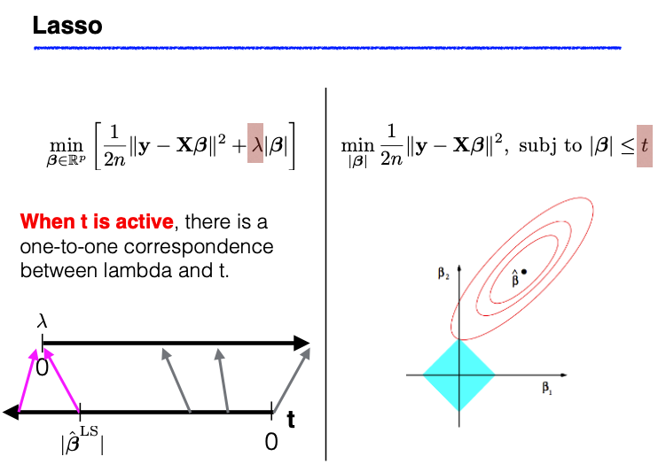
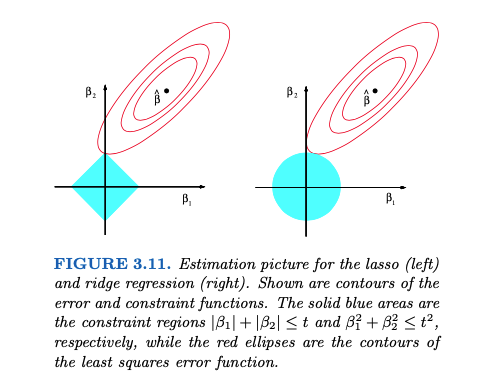

# 3.4. Lasso Regression

## 3.4.1. Introduction to Lasso

The Lasso objective function consists of two terms:

- The residual sum of squares (RSS)
- The L1 norm of the coefficient vector $\beta$

$$
\min_{\boldsymbol{\beta}} \| \mathbf{y} - \mathbf{X}  \boldsymbol{\beta}\|^2 + \lambda \| \boldsymbol{\beta} \|_1
$$

When $X$ is orthogonal, we can express the RSS term using the ordinary least squares (OLS) estimator $\hat{\boldsymbol{\beta}}^{\text{LS}}$.

Suppose $\mathbf{X}_{n \times p}$ is orthogonal, i.e., $\mathbf{X}^T \mathbf{X} = I_p$. Then

$$
\|\mathbf{y} - \mathbf{X}\boldsymbol{\beta}\|^2 = \|\mathbf{y} - \mathbf{X}\hat{\boldsymbol{\beta}}^{\mathrm{LS}} + \mathbf{X}\hat{\boldsymbol{\beta}}^{\mathrm{LS}} - \mathbf{X}\boldsymbol{\beta}\|^2 = \|\mathbf{y} - \mathbf{X}\hat{\boldsymbol{\beta}}^{\mathrm{LS}}\|^2 + \|\mathbf{X}\hat{\boldsymbol{\beta}}^{\mathrm{LS}} - \mathbf{X}\boldsymbol{\beta}\|^2
$$

where the cross-product term,

$$
2(\mathbf{y} - \mathbf{X}\hat{\boldsymbol{\beta}}^{\mathrm{LS}})^T (\mathbf{X}\hat{\boldsymbol{\beta}}^{\mathrm{LS}} - \mathbf{X}\boldsymbol{\beta}) = 2\mathbf{r}^T (\mathbf{X}\hat{\boldsymbol{\beta}}^{\mathrm{LS}} - \mathbf{X}\boldsymbol{\beta}) = 0,
$$

because the residual vector $\mathbf{r}$ is orthogonal to the column space of $\mathbf{X}$.

Since the $n$-dimensional vector in red (which is a linear combination of columns of $X$, no matter what value $\beta$ takes) is in $C(X)$, therefore orthogonal to the residual vector $r$.

Next we show that the objective function can be decomposed into component-wise terms. Each component only involves a single $\beta_j$, making it possible to solve for the optimal $\beta_j$ individually.

$$
\begin{align*}
\hat{\boldsymbol{\beta}}_{\text{lasso}} &= \arg\min_{\boldsymbol{\beta} \in \mathbb{R}^p} \left( \|\mathbf{y} - \mathbf{X}\boldsymbol{\beta}\|^2 + \lambda |\boldsymbol{\beta}| \right) \\
&= \arg\min_{\boldsymbol{\beta} \in \mathbb{R}^p} \left( \|\mathbf{X}\hat{\boldsymbol{\beta}}^{\mathrm{LS}} - \mathbf{X}\boldsymbol{\beta}\|^2 + \lambda |\boldsymbol{\beta}| \right) \\
&= \arg\min_{\boldsymbol{\beta} \in \mathbb{R}^p} \left[ (\hat{\boldsymbol{\beta}}^{\mathrm{LS}} - \boldsymbol{\beta})^T \mathbf{X}^T \mathbf{X} (\hat{\boldsymbol{\beta}}^{\mathrm{LS}} - \boldsymbol{\beta}) + \lambda |\boldsymbol{\beta}| \right] \\
&= \arg\min_{\boldsymbol{\beta} \in \mathbb{R}^p} \left[ (\hat{\boldsymbol{\beta}}^{\mathrm{LS}} - \boldsymbol{\beta})^T (\hat{\boldsymbol{\beta}}^{\mathrm{LS}} - \boldsymbol{\beta}) + \lambda |\boldsymbol{\beta}| \right] \\
&= \arg\min_{\beta_1,\ldots,\beta_p} \sum_{j=1}^p \left[ (\beta_j - \hat{\beta}_j^{\mathrm{LS}})^2 + \lambda |\beta_j| \right].
\end{align*}
$$

## 3.4.2. One-dimensional Lasso

Solving for each $\beta_j$ (when $X$ is orthogonal) can be formulated as the following one-dimensional optimization problem:

$$
f(x) = (x-a)^2 + \lambda |x|,
$$

where $a$ is a given constant and $\lambda$ is a positive regularization parameter.

Normally, when dealing with a differentiable function, you’d find the minimum by setting its derivative equal to zero. However, in our optimization problem, the term $|x|$ makes the function not entirely differentiable. Fortunately, the procedure is nearly the same here; we simply use subgradients instead of gradients to find the minimum.

The minimizer $x^*$ must satisfy the following equation:

$$
0 = \frac{\partial}{\partial x} (x^*-a)^2 + \lambda \frac{\partial}{\partial x} |x^*|  = 2 (x^*-a) + \lambda z^*
$$

where $z^*$ is the **sub-gradient** of the absolute value function evaluated at $x^*$, which equals to the sign of $x^*$ unless $x^* =  0$. In that case, $z^*$ lies between $-1$ and $1$.
on](../_images/w3_lasso_one-dim_solution.png)

So the minimizer of $f(x) = (x-a)^2 + \lambda|x|$ is given by

$$
x^* = S_{\lambda/2}(a) = \operatorname{sign}(a)(|a| - \lambda/2)_+ =
\begin{cases}
  a - \lambda/2, & \text{if } a > \lambda/2; \\
  0, & \text{if } |a| \leq \lambda/2; \\
  a + \lambda/2, & \text{if } a < -\lambda/2;
\end{cases}
$$

$S_{\lambda/2}(\cdot)$ is often referred to as the [soft-thresholding operator](https://en.wikipedia.org/wiki/Soft_thresholding).

So, in an orthogonal design matrix, the Lasso solution can be computed using the soft-thresholding operator. It performs both variable selection and coefficient shrinkage. This is one of the reasons why Lasso is a preferred method because it can both select important features and shrink the coefficients towards zero, making it particularly useful in practice.

$$
\hat{\beta}^{\text{lasso}}_j = \left \{ \begin{array}{ll}
\text{sign}(\hat{\beta}_j^{\text{LS}}) (|\hat{\beta}_j^{\text{LS}}| - \lambda/2) & \text{ if } |\hat{\beta}_j^{\text{LS}}| > \lambda/2 \\
0 & \text{ if } |\hat{\beta}_j^{\text{LS}}| \le  \lambda/2.
\end{array} \right.
$$

## 3.4.3. Lasso vs. Ridge

Lasso and Ridge regression can be understood through two seemingly different but fundamentally connected perspectives: optimization and constrained minimization.

> - **Lasso**: The optimization task involves minimizing the residual sum of squares (RSS) coupled with a penalty term on the  L1 norm of the coefficients. This is mathematically equivalent to a constrained minimization of RSS, where the coefficients ($\beta$) are restricted to lie within an L1 ball (a diamond-shaped constraint).
> - **Ridge**: Similarly, Ridge regression can either be framed as an optimization problem that minimizes RSS plus a penalty term on the L2 norm of $\beta$ or as a constrained minimization problem where $\beta$ is confined to an L2 ball (a spherical constraint).
>
> In simpler terms, this means that the Lasso/Ridge optimization can also be viewed as finding the set of coefficients that best fit the data while being constrained to lie within a certain L1/L2 budget.

### Implications of Duality

The duality between optimization and constrained minimization has the following implications:

- **Ridge**: When we increase $\lambda$,  the RSS increases, and  the L2 norm of $\beta$ decreases.
- **Lasso**: Similarly, when $\lambda$ increases, the RSS increases, and the L1 norm of $\beta$ decreases.

Here ‘RSS’ refers to the residual sum of squares on the training data; ‘increases’ means either increases or stays the same; ‘decreases’ means either decreases or stays the same.

It’s important to note that these statements are definitive only for the norms on which Ridge and Lasso are based. For example, while Lasso often produces sparser models as $\lambda$ increases, this isn’t a guaranteed outcome.

### Geometric Perspective

The underlying geometry of Ridge and Lasso can be visualized as ellipsoids intersecting with spheres or diamonds, respectively. While these geometric interpretations are insightful in 2D or 3D settings, they become complex in higher-dimensional spaces. For example, the sign of Ridge or Lasso estimates can change relative to the OLS (Ordinary Least Squares) estimates when $\lambda$ varies, illustrating the limitations of low-dimensional intuitions.

### Thresholding Mechanisms

- **Ridge**: Performs linear shrinkage. As $\lambda$ increases, coefficients are shrunken towards zero without usually becoming exactly zero.
- **Lasso**: Implements “soft-thresholding.” Increasing $\lambda$ not only shrinks the coefficients but can also set some to zero, effectively performing variable selection.
- **Subset Selection**: Operates as a “hard-thresholding” mechanism, where coefficients either remain at their original value or are set to zero.

## 3.4.4. Coordinate Descent

For general design matrices, Lasso does not have a closed-form solution; that is, one cannot employ analytical methods to directly find the optimal coefficients. A popular technique for solving the Lasso problem is the Coordinate Descent algorithm. In this algorithm, each coefficient is updated individually while all other coefficients remain fixed. Students will be asked to implement this Coordinate Descent algorithm in an upcoming coding assignment.

## 3.4.5. Uniqueness of Lasso

When the design matrix $X$ is of full rank, the Lasso solution is unique because it minimizes a strictly convex function summed with another convex function. In this case, the uniqueness of the minimizer is guaranteed. However, the situation changes when either the number of predictors $p$ exceeds the number of observations $n$, or when $X$ is not of full rank.

When $p>n$, $X$ is likely not full rank. Under these circumstances, the sum of squares, which is the first term in the Lasso objective function, is no longer strictly convex (as a function of $\beta$). As a result, the Lasso solution may not be unique and could have multiple equivalent values.

Interestingly, even if the original $X$ matrix is not of full rank, the Lasso solution can still be unique under certain conditions. Let’s define $S$ as the subset of predictors where the coefficients are non-zero in the Lasso solution. The corresponding submatrix $X_S$ consists only of columns related to these predictors. If $X_S$ has full rank, then the Lasso solution will be unique.

It’s also worth noting that, similar to the Ordinary Least Squares (OLS) method, even when the Lasso solution is not unique, the fitted values will still be unique. Additionally, the L1 norm of the different Lasso estimates for $\beta$ will also be unique.

For a more in-depth discussion on the uniqueness of Lasso solutions, you can follow this [link](https://projecteuclid.org/euclid.ejs/1369148600) to find relevant references.

## 3.4.6. R/Python Code for Lasso & Ridge

- R code: [Rcode_W3_VarSel_RidgeLasso](./Rcode_W3_VarSel_RidgeLasso.R)
- Python: [Python_W3_VarSel_RidgeLasso](./Python_W3_VarSel_RidgeLasso.py)
