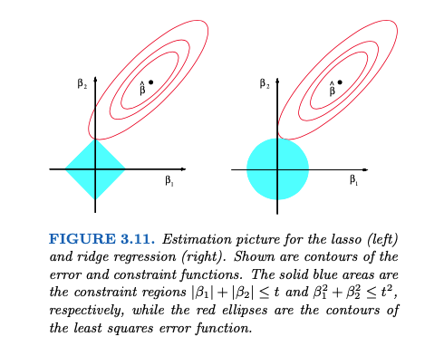

# 3.5. Discussion: Comparing Variable Selection and Regularization Methods

## Introduction

Having explored various techniques for variable selection and regularization—including subset selection, ridge regression, lasso regression, and principal components regression—we now address the critical question: **Which method is most appropriate for a given situation?** This discussion provides a comprehensive framework for understanding the strengths, limitations, and optimal use cases for each method.

**Intuitive Understanding**: Choosing the right variable selection and regularization method is like choosing the right cooking technique for different situations. Just as you wouldn't use a delicate sous-vide technique for a quick weeknight meal, or a simple grilling method for a complex gourmet dish, different statistical problems require different approaches. This discussion helps you become a "master chef" who knows exactly which technique to use for each situation.

## 3.5.1 Theoretical Framework for Method Comparison

### The Bias-Variance Tradeoff Revisited

*Figure: The relationship between model complexity, training error, and test error. Illustrates the bias-variance trade-off central to variable selection and regularization.*

**Intuition**: This graph shows the fundamental challenge of cooking: finding the right level of complexity. Too simple a recipe (low complexity) might miss important flavors (high bias), while too complex a recipe (high complexity) might be too sensitive to small changes in ingredients (high variance). The sweet spot is where we get the best balance of accuracy and reliability.

All variable selection and regularization methods can be understood through the bias-variance decomposition of prediction error:

$$ \text{MSE}(\hat{f}) = \text{Bias}^2(\hat{f}) + \text{Var}(\hat{f}) + \sigma^2 $$

where:
- $`\text{Bias}^2(\hat{f})`$ is the squared bias of the estimator - like systematic errors in your cooking technique
- $`\text{Var}(\hat{f})`$ is the variance of the estimator - like how much your recipe results vary from one attempt to another
- $`\sigma^2`$ is the irreducible error - like the inherent unpredictability of taste preferences

**Intuition**: This formula breaks down prediction error into three components: systematic mistakes (bias), random variation (variance), and unavoidable noise (irreducible error). Different cooking techniques (methods) achieve different balances of these components.

Different methods achieve different points on the bias-variance tradeoff curve:

1. **Subset Selection**: Low bias, high variance - like a master chef who uses only the most important ingredients but whose results vary greatly
2. **Ridge Regression**: Moderate bias, low variance - like a reliable home cook who uses all ingredients moderately and gets consistent results
3. **Lasso Regression**: Moderate bias, low variance, with sparsity - like a selective chef who uses only essential ingredients and gets consistent results
4. **Principal Components Regression**: High bias, very low variance - like a cook who uses only the most basic cooking techniques and gets very predictable results

### Mathematical Characterization of Methods

Let's characterize each method mathematically:

**Subset Selection:**
$$ \hat{\boldsymbol{\beta}}_{\text{subset}} = \arg\min_{\boldsymbol{\beta}} \|\mathbf{y} - \mathbf{X}\boldsymbol{\beta}\|^2_2 + \lambda \|\boldsymbol{\beta}\|_0 $$

**Intuition**: The L0 penalty $`\|\boldsymbol{\beta}\|_0`$ counts the number of non-zero coefficients, like counting how many ingredients you actually use. This is like a chef who either uses an ingredient (full amount) or doesn't use it at all (zero amount).

**Ridge Regression:**
$$ \hat{\boldsymbol{\beta}}_{\text{ridge}} = \arg\min_{\boldsymbol{\beta}} \|\mathbf{y} - \mathbf{X}\boldsymbol{\beta}\|^2_2 + \lambda \|\boldsymbol{\beta}\|^2_2 $$

**Intuition**: The L2 penalty $`\|\boldsymbol{\beta}\|^2_2`$ penalizes the sum of squared coefficients, like discouraging the use of extreme amounts of any ingredient. This is like a moderate chef who prefers balanced recipes.

**Lasso Regression:**
$$ \hat{\boldsymbol{\beta}}_{\text{lasso}} = \arg\min_{\boldsymbol{\beta}} \|\mathbf{y} - \mathbf{X}\boldsymbol{\beta}\|^2_2 + \lambda \|\boldsymbol{\beta}\|_1 $$

**Intuition**: The L1 penalty $`\|\boldsymbol{\beta}\|_1`$ penalizes the sum of absolute values of coefficients, like discouraging the total "importance" of all ingredients. This is like a selective chef who can completely eliminate ingredients while reducing others.

**Principal Components Regression:**
$$ \hat{\boldsymbol{\beta}}_{\text{PCR}} = \mathbf{V}_k(\mathbf{V}_k^T\mathbf{X}^T\mathbf{X}\mathbf{V}_k)^{-1}\mathbf{V}_k^T\mathbf{X}^T\mathbf{y} $$

where $`\mathbf{V}_k`$ contains the first $`k`$ principal component directions.

**Intuition**: PCR transforms ingredients into "principal taste directions" (combinations of ingredients that work together) and uses only the most important ones. This is like a chef who works with "flavor profiles" rather than individual ingredients.

## 3.5.2 Simulation Study Framework

### Design Matrix Specifications

We examine three distinct scenarios that represent common real-world situations:

#### Scenario 1: Curated Feature Set (X1)
- **Structure**: Small set of carefully selected features - like a carefully curated spice rack
- **Characteristics**: Low dimensionality, high signal-to-noise ratio - like having few but high-quality ingredients
- **Expected Performance**: Full model often sufficient - like a simple recipe that works well

**Intuition**: This is like cooking with a small, carefully selected set of high-quality ingredients. You don't need complex techniques because the ingredients are already excellent and well-chosen.

#### Scenario 2: Extended Feature Set with Correlations (X2)
- **Structure**: Original features plus quadratic and interaction terms - like having basic ingredients plus complex flavor combinations
- **Characteristics**: Moderate dimensionality, correlated features - like having similar ingredients that can substitute for each other
- **Expected Performance**: Shrinkage methods beneficial - like needing techniques to handle ingredient redundancy

**Intuition**: This is like having a well-stocked kitchen with many ingredients, some of which are similar or can be combined in different ways. You need techniques to handle the complexity and avoid using too much of similar ingredients.

#### Scenario 3: High-Dimensional with Noise (X3)
- **Structure**: Extended features plus 500 noise features - like having essential ingredients plus a huge pantry of random items
- **Characteristics**: High dimensionality, low signal-to-noise ratio - like having many ingredients but only a few that really matter
- **Expected Performance**: Variable selection crucial - like needing to identify and use only the essential ingredients

**Intuition**: This is like having a massive kitchen with hundreds of ingredients, but only a few are actually important for your dish. You need techniques to identify the essential ingredients and ignore the rest.

### Performance Metrics

We evaluate methods using multiple criteria:

1. **Prediction Accuracy**: Mean squared error on test set - like how well the recipe works in different kitchens
2. **Model Complexity**: Number of non-zero coefficients - like how many ingredients the recipe actually uses
3. **Variable Selection Accuracy**: Precision and recall for true variables - like how well the method identifies truly important ingredients
4. **Computational Efficiency**: Training time - like how long it takes to develop the recipe
5. **Stability**: Consistency across different random seeds - like how consistent the recipe is across different attempts

**Intuition**: These metrics help us evaluate cooking techniques from multiple perspectives: taste (accuracy), simplicity (complexity), ingredient selection (variable selection), practicality (efficiency), and reliability (stability).

## 3.5.3 Comprehensive Implementation

### Python Implementation

See the complete Python implementation in [`code/variable_selection_comparison.py`](code/variable_selection_comparison.py) which demonstrates comprehensive comparison of variable selection and regularization methods across different scenarios with detailed analysis and visualization.

### R Implementation

See the complete R implementation in [`code/variable_selection_comparison.R`](code/variable_selection_comparison.R) which demonstrates comprehensive comparison of variable selection and regularization methods using glmnet, pls, and leaps packages with detailed analysis and visualization.

## 3.5.4 Key Insights and Recommendations

### Scenario-Specific Recommendations

#### Scenario 1: Curated Features (X1)
**Characteristics:**
- Low dimensionality (5 features) - like having just 5 carefully chosen ingredients
- High signal-to-noise ratio - like having high-quality ingredients with clear flavors
- Expert-selected features - like ingredients chosen by a master chef

**Best Methods:**
1. **Ordinary Least Squares**: Often sufficient due to low dimensionality - like a simple recipe that works well
2. **Ridge Regression**: Provides slight regularization benefit - like adding a touch of moderation
3. **Subset Selection**: May help identify most important features - like identifying the most essential ingredients

**Why These Work:**
- Low-dimensional problems rarely require aggressive regularization - like not needing complex techniques for simple dishes
- Expert knowledge reduces the need for automatic variable selection - like a skilled chef knowing which ingredients matter
- Simple methods avoid overfitting - like not overcomplicating a simple recipe

**Intuition**: When you have a small, well-curated set of ingredients, you don't need fancy techniques. Simple methods work well because the ingredients are already well-chosen and there aren't too many of them.

#### Scenario 2: Extended Features with Correlations (X2)
**Characteristics:**
- Moderate dimensionality (15-20 features) - like having a well-stocked kitchen
- Correlated features (quadratic and interaction terms) - like having similar ingredients that can substitute for each other
- Mixed signal strength - like having some strong flavors and some subtle ones

**Best Methods:**
1. **Ridge Regression**: Handles multicollinearity effectively - like techniques that work well with similar ingredients
2. **Elastic Net**: Combines benefits of ridge and lasso - like a balanced approach that moderates and selects
3. **Principal Components Regression**: Reduces dimensionality while preserving variance - like working with flavor profiles instead of individual ingredients

**Why These Work:**
- Ridge regression stabilizes coefficient estimates under multicollinearity - like techniques that handle ingredient redundancy well
- Elastic net provides both shrinkage and variable selection - like techniques that both moderate and select ingredients
- PCR reduces dimensionality while maintaining predictive power - like techniques that simplify without losing flavor

**Intuition**: When you have many ingredients, some of which are similar, you need techniques that can handle the complexity. Ridge regression is like a chef who knows how to work with similar ingredients, while elastic net is like a chef who can both moderate and select ingredients as needed.

#### Scenario 3: High-Dimensional with Noise (X3)
**Characteristics:**
- High dimensionality (500+ features) - like having a massive pantry with hundreds of ingredients
- Low signal-to-noise ratio - like having many ingredients but only a few that really matter
- Many irrelevant features - like having lots of ingredients that don't contribute to the dish

**Best Methods:**
1. **Lasso Regression**: Automatic variable selection crucial - like techniques that can identify essential ingredients
2. **Elastic Net**: Handles correlated features while selecting variables - like techniques that work with similar ingredients while selecting the best ones
3. **Subset Selection**: Can identify truly important features - like techniques that can find the truly essential ingredients

**Why These Work:**
- Lasso's sparsity is essential for high-dimensional problems - like techniques that can eliminate irrelevant ingredients
- Variable selection removes noise features - like techniques that ignore ingredients that don't matter
- Regularization prevents overfitting - like techniques that prevent the recipe from being too complex

**Intuition**: When you have hundreds of ingredients but only a few matter, you need techniques that can identify and use only the essential ones. Lasso regression is like a chef who can look at a massive pantry and pick out only the ingredients that will make the dish great.

### Method Selection Decision Tree

See the decision tree function in [`code/variable_selection_comparison.py`](code/variable_selection_comparison.py) which provides a systematic approach for selecting the most appropriate variable selection and regularization method based on problem characteristics.

**Intuition**: This decision tree is like a cooking guide that helps you choose the right technique based on your situation. It asks questions like "How many ingredients do you have?" and "Are they similar to each other?" to guide you to the best method.

### Performance Trade-offs

| Method | Prediction Accuracy | Interpretability | Computational Cost | Variable Selection |
|--------|-------------------|------------------|-------------------|-------------------|
| OLS | High (low-dim) | High | Low | None |
| Ridge | High | Medium | Low | None |
| Lasso | High | High | Medium | Automatic |
| Elastic Net | High | High | Medium | Automatic |
| PCR | Medium | Low | Medium | Manual |
| Subset Selection | High | High | High | Manual |

**Intuition**: This table shows the trade-offs between different cooking techniques:
- **OLS**: Like a simple recipe that's easy to understand and make, but only works well with few ingredients
- **Ridge**: Like a reliable recipe that works consistently but is harder to interpret
- **Lasso**: Like a selective recipe that's easy to understand and automatically chooses ingredients
- **Elastic Net**: Like a balanced recipe that combines the best of ridge and lasso
- **PCR**: Like a sophisticated recipe that's hard to understand but efficient to make
- **Subset Selection**: Like a master chef's recipe that's easy to understand but takes time to develop

## 3.5.5 Practical Guidelines

### When to Use Each Method

**Use Ordinary Least Squares when:**
- Number of predictors is small (< 10) - like having fewer than 10 ingredients
- Predictors are uncorrelated - like having ingredients that don't interfere with each other
- Sample size is large relative to number of predictors - like having lots of cooking experience with these ingredients
- Primary goal is interpretation - like wanting to understand exactly how each ingredient affects the dish

**Intuition**: OLS is like a simple, straightforward cooking technique that works well when you have few, independent ingredients and want to understand exactly what each one does.

**Use Ridge Regression when:**
- Predictors are highly correlated - like having similar ingredients that can substitute for each other
- You want to keep all variables - like wanting to use all available ingredients
- Primary goal is prediction accuracy - like focusing on taste over understanding
- Sample size is small relative to number of predictors - like having limited experience with many ingredients

**Intuition**: Ridge regression is like a moderate cooking technique that works well when you have similar ingredients and want to use them all in balanced amounts.

**Use Lasso Regression when:**
- You want automatic variable selection - like wanting the recipe to automatically choose which ingredients to use
- The true model is sparse - like knowing that only a few ingredients really matter
- Interpretability is important - like wanting to understand which ingredients are essential
- You have many irrelevant predictors - like having many ingredients that don't contribute to the dish

**Intuition**: Lasso regression is like a selective cooking technique that can identify and use only the essential ingredients, making the recipe both simple and effective.

**Use Elastic Net when:**
- Predictors are correlated but you want variable selection - like having similar ingredients but wanting to choose the best ones
- You want a compromise between ridge and lasso - like wanting both moderation and selection
- The true model has grouped variables - like having ingredient categories that should be treated together

**Intuition**: Elastic net is like a balanced cooking technique that combines the moderation of ridge regression with the selection of lasso regression.

**Use Principal Components Regression when:**
- Predictors are highly correlated - like having many similar ingredients
- You want to reduce dimensionality - like wanting to work with fewer, more fundamental flavors
- The first few principal components capture most variance - like the first few flavor profiles containing most of the taste
- Prediction is more important than interpretation - like focusing on taste over understanding individual ingredients

**Intuition**: PCR is like a sophisticated cooking technique that works with fundamental flavor profiles rather than individual ingredients.

**Use Subset Selection when:**
- You want explicit control over variable selection - like wanting to manually choose which ingredients to use
- Computational cost is not a concern - like having time to experiment with different ingredient combinations
- You have domain knowledge about variable importance - like knowing from experience which ingredients matter
- You want to understand the selection process - like wanting to understand why certain ingredients were chosen

**Intuition**: Subset selection is like a master chef's approach where you manually and carefully choose which ingredients to use based on experience and understanding.

### Best Practices

1. **Always standardize predictors** before applying regularization methods - like measuring all ingredients on the same scale
2. **Use cross-validation** to select tuning parameters - like testing the recipe in different kitchens
3. **Validate on a holdout set** to assess generalization performance - like testing the recipe on completely new taste tests
4. **Consider the problem context** when choosing methods - like considering the type of dish you're making
5. **Check for multicollinearity** and choose methods accordingly - like checking if ingredients are similar
6. **Assess variable selection stability** for high-dimensional problems - like ensuring the same ingredients are selected consistently
7. **Consider computational constraints** for large datasets - like considering how long you have to develop the recipe

**Intuition**: These practices ensure that your variable selection and regularization approach is robust and reliable, just like following proven cooking techniques.

### Common Pitfalls

1. **Not standardizing data**: Can lead to inconsistent results - like having unfair rules for different ingredients
2. **Ignoring multicollinearity**: Can affect method performance - like not accounting for similar ingredients
3. **Over-regularization**: Can remove important variables - like being too strict and eliminating essential ingredients
4. **Under-regularization**: May not address overfitting - like not being strict enough
5. **Not validating assumptions**: Can lead to poor performance - like not checking if your cooking technique is appropriate
6. **Ignoring computational cost**: May not be practical for large datasets - like choosing a technique that takes too long

**Intuition**: These pitfalls are like common cooking mistakes that can ruin an otherwise good recipe. Being aware of them helps you avoid them.

## Summary

The choice of variable selection and regularization method depends critically on the problem characteristics:

1. **Dimensionality**: Low-dimensional problems favor simpler methods - like simple recipes for few ingredients
2. **Correlation structure**: Correlated predictors benefit from ridge or elastic net - like techniques that handle similar ingredients
3. **Sparsity**: Sparse signals benefit from lasso or subset selection - like techniques that work with few essential ingredients
4. **Computational constraints**: Large datasets may require efficient methods - like practical techniques for large kitchens
5. **Interpretability requirements**: Some methods provide better interpretability - like techniques that are easier to understand

The simulation study framework provides a systematic way to compare methods across different scenarios, helping practitioners make informed decisions based on their specific problem characteristics and constraints.

**Intuition**: Choosing the right variable selection and regularization method is like choosing the right cooking technique for your situation. Just as a master chef knows when to use simple grilling versus complex sous-vide, a skilled data scientist knows when to use OLS versus lasso versus ridge regression. The key is understanding your ingredients (data characteristics) and your goals (prediction vs interpretation) to choose the most appropriate technique.

---

**Navigation:**
- **Next Topic:** *This is the last topic in the variable selection and regularization section*
- **Previous Topic:** [Lasso Regression](04_lasso_regression.md) - L1 regularization and automatic variable selection
