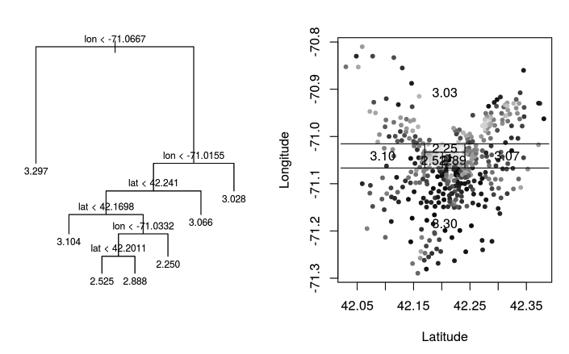

# 4.1. Regression Trees

## 4.1.1. Introduction to Regression Trees

Regression trees represent a fundamental approach to non-parametric regression that partitions the feature space into rectangular regions and fits a simple model (typically a constant) in each region. This week, we'll delve into tree-based models for regression, starting with single regression trees before progressing to ensemble methods like Random Forests (based on bagging) and Gradient Boosting Machines (GBM, based on boosting techniques).

### Mathematical Framework

Consider a regression problem with:
- **Input features**: $`X = (X_1, X_2, \ldots, X_p) \in \mathbb{R}^p`$
- **Response variable**: $`Y \in \mathbb{R}`$
- **Training data**: $`\{(x_i, y_i)\}_{i=1}^n`$ where $`x_i = (x_{i1}, x_{i2}, \ldots, x_{ip})`$

A regression tree model can be expressed as:

```math
f(x) = \sum_{m=1}^M c_m \cdot I(x \in R_m)
```

where:
- $`R_m`$ represents the $`m`$-th rectangular region (leaf node)
- $`c_m`$ is the constant prediction for region $`R_m`$
- $`I(\cdot)`$ is the indicator function
- $`M`$ is the number of leaf nodes

### Tree Structure and Terminology

Regression trees are constructed by recursively partitioning the feature space $`\mathbb{R}^p`$ into two sub-regions, beginning with the entire space. Each partition is defined by a **split rule** of the form:

```math
\text{Split Rule: } X_j \leq s
```

where:
- $`X_j`$ is the $`j`$-th feature variable
- $`s`$ is the split threshold

**Tree Components:**
- **Root Node**: The entire feature space
- **Internal Nodes**: Nodes with children (split points)
- **Leaf Nodes**: Terminal nodes (rectangular regions)
- **Branches**: Connections between nodes

### Boston Housing Example

Consider the Boston Housing dataset with two features: longitude and latitude. The regression tree partitions the 2D space into rectangular regions, where each region corresponds to a leaf node with a constant prediction.

**Visualization Description:**
- **Right plot**: Scatter plot of houses by longitude and latitude, with grayscale indicating price (darker = more expensive)
- **Left plot**: Tree structure showing recursive splits on longitude and latitude features

**Example Tree Structure:**
```
Root: All houses
├── Longitude ≤ -71.1
│   ├── Latitude ≤ 42.3 → Price = 3.1 (log scale)
│   └── Latitude > 42.3 → Price = 3.5 (log scale)
└── Longitude > -71.1
    ├── Latitude ≤ 42.2 → Price = 3.8 (log scale)
    └── Latitude > 42.2 → Price = 4.2 (log scale)
```



*Figure: Partitioning of the Boston Housing data by longitude and latitude. Each region corresponds to a leaf node in the regression tree.*

### Advantages of Tree-Based Models

1. **Interpretability**: Tree structure is easily explainable to non-technical audiences
2. **Automatic Variable Selection**: Only relevant features are used for splitting
3. **Interaction Detection**: Natural handling of feature interactions at different tree levels
4. **Invariance to Monotonic Transformations**: Tree structure remains unchanged under monotonic transformations of features
5. **Handling Mixed Data Types**: Naturally handles both numerical and categorical variables
6. **Robustness to Outliers**: Less sensitive to outliers compared to linear models

**Mathematical Invariance Property:**
If $`g(\cdot)`$ is a strictly monotonic function, then splitting on $`X_j \leq s`$ is equivalent to splitting on $`g(X_j) \leq g(s)`$.

## 4.1.2. Tree Construction Algorithm

### Mathematical Foundation

The goal is to find the optimal tree structure that minimizes the prediction error. For regression trees, we typically minimize the **Residual Sum of Squares (RSS)**:

```math
\text{RSS} = \sum_{i=1}^n (y_i - f(x_i))^2
```

### Three Core Questions

1. **Where to Split**: Which feature and threshold to use for partitioning
2. **When to Stop**: When to stop growing the tree
3. **How to Predict**: What constant value to assign to each leaf node

### Assigning Predictions to Leaf Nodes

For a leaf node $`R_m`$ containing observations $`\{i: x_i \in R_m\}`$, the optimal constant prediction is the mean of the response values:

```math
c_m = \frac{1}{|R_m|} \sum_{i: x_i \in R_m} y_i
```

This minimizes the RSS within the leaf node.

### Split Criterion: RSS Reduction

For each potential split $(j, s)$, we calculate the reduction in RSS:

```math
\Delta \text{RSS}(j, s) = \text{RSS}_{\text{before}} - \text{RSS}_{\text{after}}
```

where:
- $`\text{RSS}_{\text{before}} = \sum_{i=1}^n (y_i - \bar{y})^2`$ (using overall mean)
- $`\text{RSS}_{\text{after}} = \text{RSS}_{\text{left}} + \text{RSS}_{\text{right}}`$

The left and right RSS are calculated as:

```math
\text{RSS}_{\text{left}} = \sum_{i: x_{ij} \leq s} (y_i - \bar{y}_{\text{left}})^2
```

```math
\text{RSS}_{\text{right}} = \sum_{i: x_{ij} > s} (y_i - \bar{y}_{\text{right}})^2
```

where $`\bar{y}_{\text{left}}`$ and $`\bar{y}_{\text{right}}`$ are the means of the left and right child nodes.

### Greedy Tree Building Algorithm

```python
def build_regression_tree(X, y, max_depth=None, min_samples_split=2):
    """
    Build a regression tree using greedy algorithm
    
    Parameters:
    X: feature matrix (n_samples, n_features)
    y: target vector (n_samples,)
    max_depth: maximum tree depth
    min_samples_split: minimum samples required to split
    
    Returns:
    tree: dictionary representing the tree structure
    """
    def find_best_split(X, y):
        best_split = None
        best_score = float('inf')
        
        for j in range(X.shape[1]):  # For each feature
            unique_values = np.unique(X[:, j])
            for s in unique_values[:-1]:  # For each potential split
                left_mask = X[:, j] <= s
                right_mask = ~left_mask
                
                if np.sum(left_mask) < min_samples_split or np.sum(right_mask) < min_samples_split:
                    continue
                
                # Calculate RSS reduction
                y_left = y[left_mask]
                y_right = y[right_mask]
                
                rss_left = np.sum((y_left - np.mean(y_left))**2)
                rss_right = np.sum((y_right - np.mean(y_right))**2)
                rss_total = rss_left + rss_right
                
                if rss_total < best_score:
                    best_score = rss_total
                    best_split = (j, s)
        
        return best_split
    
    def build_node(X, y, depth):
        # Stopping criteria
        if (max_depth is not None and depth >= max_depth) or len(y) < min_samples_split:
            return {'type': 'leaf', 'prediction': np.mean(y)}
        
        # Find best split
        split = find_best_split(X, y)
        if split is None:
            return {'type': 'leaf', 'prediction': np.mean(y)}
        
        j, s = split
        left_mask = X[:, j] <= s
        right_mask = ~left_mask
        
        # Create internal node
        node = {
            'type': 'internal',
            'feature': j,
            'threshold': s,
            'left': build_node(X[left_mask], y[left_mask], depth + 1),
            'right': build_node(X[right_mask], y[right_mask], depth + 1)
        }
        
        return node
    
    return build_node(X, y, 0)
```

### Handling Categorical Variables

For categorical variables with $`m`$ levels, the optimal split can be found efficiently by:

1. **Sorting levels by response mean**: Calculate $`\bar{y}_k`$ for each level $`k`$
2. **Considering only adjacent splits**: Only $`m-1`$ splits need to be evaluated

**Mathematical Justification:**
The optimal split minimizes within-group variance. By sorting levels by their response means, adjacent levels have similar means, making them natural candidates for grouping.

**Example:**
```python
def find_categorical_split(X_cat, y):
    """
    Find optimal split for categorical variable
    """
    # Calculate mean response for each level
    levels = np.unique(X_cat)
    level_means = {}
    for level in levels:
        mask = X_cat == level
        level_means[level] = np.mean(y[mask])
    
    # Sort levels by mean response
    sorted_levels = sorted(levels, key=lambda x: level_means[x])
    
    # Try splits between adjacent levels
    best_split = None
    best_score = float('inf')
    
    for i in range(len(sorted_levels) - 1):
        left_levels = set(sorted_levels[:i+1])
        left_mask = np.isin(X_cat, list(left_levels))
        right_mask = ~left_mask
        
        if np.sum(left_mask) < 2 or np.sum(right_mask) < 2:
            continue
        
        y_left = y[left_mask]
        y_right = y[right_mask]
        
        rss_left = np.sum((y_left - np.mean(y_left))**2)
        rss_right = np.sum((y_right - np.mean(y_right))**2)
        rss_total = rss_left + rss_right
        
        if rss_total < best_score:
            best_score = rss_total
            best_split = left_levels
    
    return best_split
```

### Handling Missing Values

Tree-based methods offer several strategies for handling missing values:

1. **Surrogate Splits**: Use correlated variables as backup splits
2. **Missing as Separate Category**: Treat missing values as a distinct category
3. **Majority Rule**: Assign missing values to the larger child node
4. **Imputation**: Fill missing values before tree construction

**Surrogate Split Implementation:**
```python
def find_surrogate_splits(X, y, primary_split, missing_mask):
    """
    Find surrogate splits for missing values
    """
    j, s = primary_split
    surrogate_splits = []
    
    for k in range(X.shape[1]):
        if k == j:
            continue
        
        # Calculate correlation with primary split
        primary_values = (X[:, j] <= s).astype(int)
        k_values = X[:, k]
        
        # Find best split on feature k that mimics primary split
        unique_values = np.unique(k_values)
        best_correlation = 0
        best_threshold = None
        
        for threshold in unique_values[:-1]:
            k_split = (k_values <= threshold).astype(int)
            correlation = np.corrcoef(primary_values, k_split)[0, 1]
            
            if abs(correlation) > abs(best_correlation):
                best_correlation = correlation
                best_threshold = threshold
        
        if abs(best_correlation) > 0.5:  # Minimum correlation threshold
            surrogate_splits.append((k, best_threshold, best_correlation))
    
    # Sort by correlation strength
    surrogate_splits.sort(key=lambda x: abs(x[2]), reverse=True)
    return surrogate_splits
```

### Stopping Criteria

Common stopping criteria include:

1. **Minimum samples per leaf**: $`|R_m| \geq \text{min\_samples\_leaf}`$
2. **Maximum tree depth**: $`\text{depth} \leq \text{max\_depth}`$
3. **Minimum RSS reduction**: $`\Delta \text{RSS} \geq \text{min\_improvement}`$
4. **Maximum leaf nodes**: $`M \leq \text{max\_leaves}`$

## 4.1.3. Tree Pruning: Complexity Cost

### Overfitting Problem

Large trees can overfit the training data, leading to poor generalization. Pruning addresses this by removing unnecessary splits while maintaining predictive performance.

### Cost-Complexity Pruning

The cost-complexity measure balances fit and complexity:

```math
R_\alpha(T) = \text{RSS}(T) + \alpha |T|
```

where:
- $`\text{RSS}(T) = \sum_{m=1}^{|T|} \sum_{i: x_i \in R_m} (y_i - \bar{y}_m)^2`$
- $`|T|`$ is the number of leaf nodes
- $`\alpha \geq 0`$ is the complexity parameter

**Interpretation:**
- $`\alpha = 0`$: No penalty for complexity (full tree)
- $`\alpha \to \infty`$: Infinite penalty (single node tree)
- Larger $`\alpha`$ produces simpler trees

### Mathematical Properties

For a given $`\alpha`$, the optimal subtree $`T_\alpha`$ minimizes $`R_\alpha(T)`$:

```math
T_\alpha = \arg\min_{T \subseteq T_0} R_\alpha(T)
```

where $`T_0`$ is the full tree.

**Uniqueness Property:**
If multiple subtrees achieve the same minimum cost, there exists a unique smallest optimal subtree (the intersection of all optimal subtrees).

## 4.1.4. Weakest Link Pruning Algorithm

### Alpha Calculation

For each internal node $`t`$, we calculate the threshold $`\alpha_t`$ at which the split becomes unprofitable:

```math
\alpha_t = \frac{\text{RSS}(t) - \text{RSS}(T_t)}{|T_t| - 1}
```

where:
- $`\text{RSS}(t)`$ is the RSS when node $`t`$ is a leaf
- $`\text{RSS}(T_t)`$ is the RSS of the subtree rooted at $`t`$
- $`|T_t|`$ is the number of leaf nodes in the subtree

**Interpretation:**
$`\alpha_t`$ represents the "price" we pay per additional leaf node for the improvement in RSS.

### Algorithm Steps

1. **Initialize**: Start with full tree $`T_0`$, set $`\alpha = 0`$
2. **Calculate alphas**: For each internal node $`t`$, compute $`\alpha_t`$
3. **Find weakest link**: Identify node $`t^*`$ with smallest $`\alpha_t`$
4. **Prune**: Remove the subtree rooted at $`t^*`$, making $`t^*`$ a leaf
5. **Update**: Recalculate $`\alpha_t`$ for affected nodes
6. **Repeat**: Continue until only root remains

**Implementation:**
```python
def weakest_link_pruning(tree, X, y):
    """
    Perform weakest link pruning
    """
    def calculate_alpha(node, X_node, y_node):
        """Calculate alpha for a node"""
        if node['type'] == 'leaf':
            return float('inf')
        
        # RSS if this node were a leaf
        rss_leaf = np.sum((y_node - np.mean(y_node))**2)
        
        # RSS of subtree
        left_mask = X_node[:, node['feature']] <= node['threshold']
        right_mask = ~left_mask
        
        y_left = y_node[left_mask]
        y_right = y_node[right_mask]
        
        rss_left = np.sum((y_left - np.mean(y_left))**2)
        rss_right = np.sum((y_right - np.mean(y_right))**2)
        rss_subtree = rss_left + rss_right
        
        # Count leaves in subtree
        n_leaves = count_leaves(node)
        
        alpha = (rss_leaf - rss_subtree) / (n_leaves - 1)
        return alpha
    
    def count_leaves(node):
        """Count number of leaves in subtree"""
        if node['type'] == 'leaf':
            return 1
        return count_leaves(node['left']) + count_leaves(node['right'])
    
    def find_weakest_link(node, X_node, y_node):
        """Find node with smallest alpha"""
        if node['type'] == 'leaf':
            return None, float('inf')
        
        alpha = calculate_alpha(node, X_node, y_node)
        weakest_node = node
        weakest_alpha = alpha
        
        # Check children
        left_mask = X_node[:, node['feature']] <= node['threshold']
        right_mask = ~left_mask
        
        left_weakest, left_alpha = find_weakest_link(
            node['left'], X_node[left_mask], y_node[left_mask]
        )
        right_weakest, right_alpha = find_weakest_link(
            node['right'], X_node[right_mask], y_node[right_mask]
        )
        
        if left_alpha < weakest_alpha:
            weakest_node = left_weakest
            weakest_alpha = left_alpha
        if right_alpha < weakest_alpha:
            weakest_node = right_weakest
            weakest_alpha = right_alpha
        
        return weakest_node, weakest_alpha
    
    def prune_node(node, target_node, X_node, y_node):
        """Prune the target node from the tree"""
        if node['type'] == 'leaf':
            return node
        
        if node is target_node:
            return {'type': 'leaf', 'prediction': np.mean(y_node)}
        
        left_mask = X_node[:, node['feature']] <= node['threshold']
        right_mask = ~left_mask
        
        node['left'] = prune_node(
            node['left'], target_node, X_node[left_mask], y_node[left_mask]
        )
        node['right'] = prune_node(
            node['right'], target_node, X_node[right_mask], y_node[right_mask]
        )
        
        return node
    
    # Generate sequence of pruned trees
    trees = [tree]
    alphas = [0.0]
    
    current_tree = tree.copy()
    
    while True:
        weakest_node, alpha = find_weakest_link(current_tree, X, y)
        
        if weakest_node is None:
            break
        
        current_tree = prune_node(current_tree, weakest_node, X, y)
        trees.append(current_tree.copy())
        alphas.append(alpha)
    
    return trees, alphas
```

### Solution Path

The algorithm generates a sequence of trees $`T_0, T_1, \ldots, T_k`$ corresponding to increasing $`\alpha`$ values:

```math
0 = \alpha_0 < \alpha_1 < \alpha_2 < \cdots < \alpha_k
```

Each tree $`T_i`$ is optimal for $`\alpha \in [\alpha_i, \alpha_{i+1})`$.

## 4.1.5. Cross-Validation for Alpha Selection

### Problem Statement

Given the sequence of pruned trees, we need to select the optimal $`\alpha`$ value that minimizes prediction error.

### Cross-Validation Procedure

1. **Generate beta values**: For each interval $`[\alpha_i, \alpha_{i+1})`$, compute $`\beta_i = \sqrt{\alpha_i \cdot \alpha_{i+1}}`$

2. **K-fold cross-validation**: For each fold $`k = 1, 2, \ldots, K`$:
   - Train tree on $`K-1`$ folds
   - Generate pruned tree sequence
   - Evaluate each tree on the held-out fold

3. **Select optimal alpha**: Choose $`\alpha`$ that minimizes cross-validation error

**Implementation:**
```python
def cross_validate_alpha(X, y, cv_folds=5):
    """
    Cross-validation for alpha selection
    """
    from sklearn.model_selection import KFold
    
    kf = KFold(n_splits=cv_folds, shuffle=True, random_state=42)
    
    # Generate all possible alpha values
    all_alphas = []
    for train_idx, val_idx in kf.split(X):
        X_train, X_val = X[train_idx], X[val_idx]
        y_train, y_val = y[train_idx], y[val_idx]
        
        # Build and prune tree
        tree = build_regression_tree(X_train, y_train)
        trees, alphas = weakest_link_pruning(tree, X_train, y_train)
        all_alphas.extend(alphas)
    
    # Unique alpha values, sorted
    unique_alphas = sorted(set(all_alphas))
    
    # Cross-validation errors
    cv_errors = []
    
    for alpha in unique_alphas:
        fold_errors = []
        
        for train_idx, val_idx in kf.split(X):
            X_train, X_val = X[train_idx], X[val_idx]
            y_train, y_val = y[train_idx], y[val_idx]
            
            # Build and prune tree
            tree = build_regression_tree(X_train, y_train)
            trees, alphas = weakest_link_pruning(tree, X_train, y_train)
            
            # Find optimal tree for this alpha
            optimal_tree = None
            for i, a in enumerate(alphas):
                if a <= alpha:
                    optimal_tree = trees[i]
            
            if optimal_tree is None:
                optimal_tree = trees[0]  # Use full tree
            
            # Predict and calculate error
            predictions = predict_tree(optimal_tree, X_val)
            mse = np.mean((y_val - predictions)**2)
            fold_errors.append(mse)
        
        cv_errors.append(np.mean(fold_errors))
    
    # Find optimal alpha
    optimal_idx = np.argmin(cv_errors)
    optimal_alpha = unique_alphas[optimal_idx]
    
    return optimal_alpha, unique_alphas, cv_errors
```

### One Standard Error Rule

Instead of selecting the minimum CV error, we can use the one standard error rule:

```python
def one_se_rule(alphas, cv_errors):
    """
    One standard error rule for alpha selection
    """
    cv_errors = np.array(cv_errors)
    min_error = np.min(cv_errors)
    min_idx = np.argmin(cv_errors)
    
    # Calculate standard error
    se = np.std(cv_errors) / np.sqrt(len(cv_errors))
    threshold = min_error + se
    
    # Find largest alpha within one SE of minimum
    for i in range(min_idx, -1, -1):
        if cv_errors[i] <= threshold:
            return alphas[i]
    
    return alphas[0]
```

## 4.1.6. Complete Implementation Examples

### Python Implementation

```python
import numpy as np
import matplotlib.pyplot as plt
from sklearn.datasets import load_boston
from sklearn.model_selection import train_test_split
from sklearn.metrics import mean_squared_error, r2_score

class RegressionTree:
    def __init__(self, max_depth=None, min_samples_split=2, min_samples_leaf=1):
        self.max_depth = max_depth
        self.min_samples_split = min_samples_split
        self.min_samples_leaf = min_samples_leaf
        self.tree = None
    
    def fit(self, X, y):
        """Build the regression tree"""
        self.tree = self._build_tree(X, y, depth=0)
        return self
    
    def _build_tree(self, X, y, depth):
        """Recursively build tree"""
        n_samples = len(y)
        
        # Stopping criteria
        if (self.max_depth is not None and depth >= self.max_depth) or \
           n_samples < self.min_samples_split:
            return {'type': 'leaf', 'prediction': np.mean(y)}
        
        # Find best split
        best_split = self._find_best_split(X, y)
        if best_split is None:
            return {'type': 'leaf', 'prediction': np.mean(y)}
        
        feature, threshold = best_split
        left_mask = X[:, feature] <= threshold
        right_mask = ~left_mask
        
        # Check minimum samples per leaf
        if np.sum(left_mask) < self.min_samples_leaf or \
           np.sum(right_mask) < self.min_samples_leaf:
            return {'type': 'leaf', 'prediction': np.mean(y)}
        
        # Create internal node
        node = {
            'type': 'internal',
            'feature': feature,
            'threshold': threshold,
            'left': self._build_tree(X[left_mask], y[left_mask], depth + 1),
            'right': self._build_tree(X[right_mask], y[right_mask], depth + 1)
        }
        
        return node
    
    def _find_best_split(self, X, y):
        """Find the best split for current node"""
        best_split = None
        best_score = float('inf')
        
        for feature in range(X.shape[1]):
            unique_values = np.unique(X[:, feature])
            for threshold in unique_values[:-1]:
                left_mask = X[:, feature] <= threshold
                right_mask = ~left_mask
                
                if np.sum(left_mask) < 2 or np.sum(right_mask) < 2:
                    continue
                
                # Calculate RSS
                y_left = y[left_mask]
                y_right = y[right_mask]
                
                rss_left = np.sum((y_left - np.mean(y_left))**2)
                rss_right = np.sum((y_right - np.mean(y_right))**2)
                rss_total = rss_left + rss_right
                
                if rss_total < best_score:
                    best_score = rss_total
                    best_split = (feature, threshold)
        
        return best_split
    
    def predict(self, X):
        """Make predictions"""
        predictions = []
        for x in X:
            predictions.append(self._predict_single(x, self.tree))
        return np.array(predictions)
    
    def _predict_single(self, x, node):
        """Predict for a single sample"""
        if node['type'] == 'leaf':
            return node['prediction']
        
        if x[node['feature']] <= node['threshold']:
            return self._predict_single(x, node['left'])
        else:
            return self._predict_single(x, node['right'])
    
    def prune(self, alpha):
        """Prune tree using cost-complexity pruning"""
        self.tree = self._prune_node(self.tree, alpha)
        return self
    
    def _prune_node(self, node, alpha):
        """Recursively prune node"""
        if node['type'] == 'leaf':
            return node
        
        # Prune children
        node['left'] = self._prune_node(node['left'], alpha)
        node['right'] = self._prune_node(node['right'], alpha)
        
        # Check if we should prune this node
        if node['left']['type'] == 'leaf' and node['right']['type'] == 'leaf':
            # Calculate alpha for this node
            # This is a simplified version - in practice, you'd need the full data
            return {'type': 'leaf', 'prediction': (node['left']['prediction'] + 
                                                 node['right']['prediction']) / 2}
        
        return node

# Example usage
def demonstrate_regression_tree():
    """Demonstrate regression tree on Boston housing data"""
    # Load data
    boston = load_boston()
    X, y = boston.data, boston.target
    
    # Split data
    X_train, X_test, y_train, y_test = train_test_split(
        X, y, test_size=0.2, random_state=42
    )
    
    # Fit tree
    tree = RegressionTree(max_depth=5, min_samples_split=10)
    tree.fit(X_train, y_train)
    
    # Make predictions
    y_pred = tree.predict(X_test)
    
    # Evaluate
    mse = mean_squared_error(y_test, y_pred)
    r2 = r2_score(y_test, y_pred)
    
    print(f"Test MSE: {mse:.4f}")
    print(f"Test R²: {r2:.4f}")
    
    # Visualize predictions vs actual
    plt.figure(figsize=(10, 5))
    
    plt.subplot(1, 2, 1)
    plt.scatter(y_test, y_pred, alpha=0.6)
    plt.plot([y_test.min(), y_test.max()], [y_test.min(), y_test.max()], 'r--', lw=2)
    plt.xlabel('Actual Values')
    plt.ylabel('Predicted Values')
    plt.title('Regression Tree Predictions')
    
    plt.subplot(1, 2, 2)
    plt.scatter(y_test, y_test - y_pred, alpha=0.6)
    plt.axhline(y=0, color='r', linestyle='--')
    plt.xlabel('Actual Values')
    plt.ylabel('Residuals')
    plt.title('Residual Plot')
    
    plt.tight_layout()
    plt.show()
    
    return tree

# Run demonstration
if __name__ == "__main__":
    tree = demonstrate_regression_tree()
```

### R Implementation

```r
# Regression Tree Implementation in R
library(rpart)
library(rpart.plot)
library(ggplot2)

# Function to build regression tree
build_regression_tree <- function(X, y, max_depth = NULL, min_samples_split = 2) {
  # Create data frame
  data <- data.frame(X, y = y)
  
  # Control parameters
  control <- rpart.control(
    maxdepth = max_depth,
    minsplit = min_samples_split,
    cp = 0  # No pruning during building
  )
  
  # Build tree
  tree <- rpart(y ~ ., data = data, control = control)
  
  return(tree)
}

# Function to find optimal alpha using cross-validation
find_optimal_alpha <- function(tree, X, y, cv_folds = 5) {
  # Get complexity parameter sequence
  cp_table <- tree$cptable
  
  # Cross-validation
  cv_errors <- numeric(nrow(cp_table))
  
  for (i in 1:nrow(cp_table)) {
    cp_val <- cp_table[i, "CP"]
    
    # Prune tree
    pruned_tree <- prune(tree, cp = cp_val)
    
    # Cross-validation error (simplified)
    cv_error <- 0
    for (fold in 1:cv_folds) {
      # Split data (simplified - in practice use proper CV)
      n <- nrow(X)
      test_indices <- sample(1:n, size = n %/% cv_folds)
      train_indices <- setdiff(1:n, test_indices)
      
      # Train on subset
      train_data <- data.frame(X[train_indices, ], y = y[train_indices])
      test_data <- data.frame(X[test_indices, ], y = y[test_indices])
      
      # Fit tree
      fold_tree <- rpart(y ~ ., data = train_data, control = rpart.control(cp = cp_val))
      
      # Predict and calculate error
      predictions <- predict(fold_tree, test_data)
      cv_error <- cv_error + mean((test_data$y - predictions)^2)
    }
    
    cv_errors[i] <- cv_error / cv_folds
  }
  
  # Find optimal CP
  optimal_idx <- which.min(cv_errors)
  optimal_cp <- cp_table[optimal_idx, "CP"]
  
  return(list(cp = optimal_cp, cv_errors = cv_errors, cp_table = cp_table))
}

# Example with Boston housing data
demonstrate_regression_tree_r <- function() {
  # Load data
  data(Boston, package = "MASS")
  
  # Prepare data
  X <- Boston[, -ncol(Boston)]
  y <- Boston$medv
  
  # Split data
  set.seed(42)
  train_indices <- sample(1:nrow(Boston), size = 0.8 * nrow(Boston))
  X_train <- X[train_indices, ]
  y_train <- y[train_indices]
  X_test <- X[-train_indices, ]
  y_test <- y[-train_indices]
  
  # Build full tree
  full_tree <- build_regression_tree(X_train, y_train, max_depth = 10)
  
  # Find optimal alpha
  optimal_result <- find_optimal_alpha(full_tree, X_train, y_train)
  
  # Prune tree
  optimal_tree <- prune(full_tree, cp = optimal_result$cp)
  
  # Make predictions
  predictions <- predict(optimal_tree, X_test)
  
  # Calculate metrics
  mse <- mean((y_test - predictions)^2)
  r2 <- 1 - sum((y_test - predictions)^2) / sum((y_test - mean(y_test))^2)
  
  cat("Test MSE:", round(mse, 4), "\n")
  cat("Test R²:", round(r2, 4), "\n")
  cat("Optimal CP:", round(optimal_result$cp, 6), "\n")
  
  # Visualize tree
  par(mfrow = c(1, 2))
  
  # Plot tree structure
  rpart.plot(optimal_tree, main = "Regression Tree Structure")
  
  # Plot predictions vs actual
  plot(y_test, predictions, pch = 19, col = "blue", alpha = 0.6,
       xlab = "Actual Values", ylab = "Predicted Values",
       main = "Regression Tree Predictions")
  abline(0, 1, col = "red", lty = 2)
  
  # Plot cross-validation error
  plot(optimal_result$cp_table[, "CP"], optimal_result$cv_errors,
       type = "b", log = "x", xlab = "Complexity Parameter (CP)",
       ylab = "Cross-Validation Error",
       main = "Cross-Validation Error vs CP")
  abline(v = optimal_result$cp, col = "red", lty = 2)
  
  return(optimal_tree)
}

# Run demonstration
tree_r <- demonstrate_regression_tree_r()
```

### Visualization and Analysis

```python
def visualize_tree_structure(tree, feature_names=None):
    """Visualize tree structure"""
    def count_nodes(node):
        if node['type'] == 'leaf':
            return 1
        return 1 + count_nodes(node['left']) + count_nodes(node['right'])
    
    def get_depth(node, current_depth=0):
        if node['type'] == 'leaf':
            return current_depth
        return max(get_depth(node['left'], current_depth + 1),
                  get_depth(node['right'], current_depth + 1))
    
    n_nodes = count_nodes(tree)
    max_depth = get_depth(tree)
    
    print(f"Tree Statistics:")
    print(f"  Number of nodes: {n_nodes}")
    print(f"  Maximum depth: {max_depth}")
    print(f"  Number of leaves: {n_nodes // 2 + 1}")
    
    # Feature importance (simplified)
    feature_usage = {}
    
    def count_feature_usage(node):
        if node['type'] == 'internal':
            feature = node['feature']
            feature_usage[feature] = feature_usage.get(feature, 0) + 1
            count_feature_usage(node['left'])
            count_feature_usage(node['right'])
    
    count_feature_usage(tree)
    
    if feature_names:
        print("\nFeature Importance:")
        for feature, count in sorted(feature_usage.items(), key=lambda x: x[1], reverse=True):
            print(f"  {feature_names[feature]}: {count} splits")
    
    return feature_usage

def analyze_tree_performance(X, y, tree):
    """Analyze tree performance"""
    predictions = tree.predict(X)
    residuals = y - predictions
    
    # Performance metrics
    mse = np.mean(residuals**2)
    rmse = np.sqrt(mse)
    mae = np.mean(np.abs(residuals))
    r2 = 1 - np.sum(residuals**2) / np.sum((y - np.mean(y))**2)
    
    print(f"Performance Metrics:")
    print(f"  MSE: {mse:.4f}")
    print(f"  RMSE: {rmse:.4f}")
    print(f"  MAE: {mae:.4f}")
    print(f"  R²: {r2:.4f}")
    
    # Residual analysis
    plt.figure(figsize=(15, 5))
    
    plt.subplot(1, 3, 1)
    plt.scatter(predictions, residuals, alpha=0.6)
    plt.axhline(y=0, color='r', linestyle='--')
    plt.xlabel('Predicted Values')
    plt.ylabel('Residuals')
    plt.title('Residuals vs Predicted')
    
    plt.subplot(1, 3, 2)
    plt.hist(residuals, bins=30, alpha=0.7, edgecolor='black')
    plt.xlabel('Residuals')
    plt.ylabel('Frequency')
    plt.title('Residual Distribution')
    
    plt.subplot(1, 3, 3)
    from scipy import stats
    stats.probplot(residuals, dist="norm", plot=plt)
    plt.title('Q-Q Plot of Residuals')
    
    plt.tight_layout()
    plt.show()
    
    return {'mse': mse, 'rmse': rmse, 'mae': mae, 'r2': r2}
```

## Summary

Regression trees provide a powerful, interpretable approach to non-parametric regression. Key concepts include:

1. **Tree Structure**: Recursive binary partitioning of feature space
2. **Split Criterion**: RSS reduction for optimal splits
3. **Pruning**: Cost-complexity pruning to prevent overfitting
4. **Cross-Validation**: Selection of optimal complexity parameter
5. **Handling Special Cases**: Categorical variables, missing values

The mathematical foundations ensure optimality, while the greedy algorithm provides computational efficiency. The pruning process balances model complexity with predictive performance, making regression trees a versatile tool for both exploration and prediction.

## References

- Breiman, L., Friedman, J., Stone, C. J., & Olshen, R. A. (1984). Classification and regression trees. CRC press.
- Hastie, T., Tibshirani, R., & Friedman, J. (2009). The elements of statistical learning: data mining, inference, and prediction. Springer Science & Business Media.
