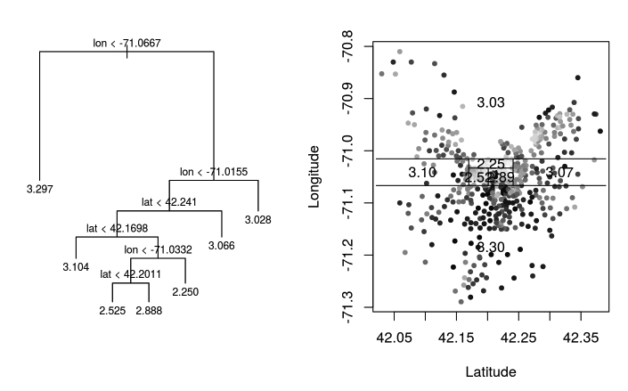

# 4.1. Regression Trees

## 4.1.1. Introduction to Regression Trees

Regression trees represent a fundamental approach to non-parametric regression that partitions the feature space into rectangular regions and fits a simple model (typically a constant) in each region. This week, we'll delve into tree-based models for regression, starting with single regression trees before progressing to ensemble methods like Random Forests (based on bagging) and Gradient Boosting Machines (GBM, based on boosting techniques).

**Intuitive Understanding**: Regression trees are like creating a decision-making system that asks a series of yes/no questions to arrive at a prediction. Think of it as a smart questionnaire that guides you through a series of choices to determine the final answer. For example, if you're trying to predict house prices, the tree might ask: "Is the house in the city center?" If yes, it asks: "Is it a new building?" If no, it asks: "Does it have a garden?" Each answer leads to the next question until you reach a final prediction. This creates a natural, interpretable way to make predictions that anyone can understand and follow.

### Mathematical Framework

Consider a regression problem with:
- **Input features**: $`X = (X_1, X_2, \ldots, X_p) \in \mathbb{R}^p`$ - like the characteristics of a house (size, location, age, etc.)
- **Response variable**: $`Y \in \mathbb{R}`$ - like the house price we want to predict
- **Training data**: $`\{(x_i, y_i)\}_{i=1}^n`$ where $`x_i = (x_{i1}, x_{i2}, \ldots, x_{ip})`$ - like a collection of houses with their known prices

A regression tree model can be expressed as:

$$ f(x) = \sum_{m=1}^M c_m \cdot I(x \in R_m) $$

where:
- $`R_m`$ represents the $`m`$-th rectangular region (leaf node) - like a specific category of houses
- $`c_m`$ is the constant prediction for region $`R_m`$ - like the average price for that category
- $`I(\cdot)`$ is the indicator function - like checking if a house belongs to that category
- $`M`$ is the number of leaf nodes - like the number of final categories

**Intuition**: This formula says that the prediction for any house is the average price of houses in the same category. It's like saying "houses like this one typically cost this much."

### Tree Structure and Terminology

Regression trees are constructed by recursively partitioning the feature space $`\mathbb{R}^p`$ into two sub-regions, beginning with the entire space. Each partition is defined by a **split rule** of the form:

$$ \text{Split Rule: } X_j \leq s $$

where:
- $`X_j`$ is the $`j`$-th feature variable - like "house size" or "distance to city center"
- $`s`$ is the split threshold - like "1500 square feet" or "5 miles"

**Intuition**: Each split is like asking a yes/no question: "Is the house size less than 1500 square feet?" This divides all houses into two groups: small houses and large houses.

**Tree Components:**
- **Root Node**: The entire feature space - like "all houses in the dataset"
- **Internal Nodes**: Nodes with children (split points) - like "houses with size ≤ 1500 sq ft"
- **Leaf Nodes**: Terminal nodes (rectangular regions) - like "small houses in the suburbs with gardens"
- **Branches**: Connections between nodes - like the path from "all houses" to "small suburban houses with gardens"

**Intuition**: The tree structure is like a flowchart that guides you from the general (all houses) to the specific (houses with very similar characteristics). Each step narrows down the group until you reach a final category.

### Boston Housing Example

Consider the Boston Housing dataset with two features: longitude and latitude. The regression tree partitions the 2D space into rectangular regions, where each region corresponds to a leaf node with a constant prediction.

**Intuition**: This is like dividing a city map into neighborhoods, where each neighborhood has a typical house price. Houses in the same neighborhood are predicted to have similar prices.



*Figure: Partitioning of the Boston Housing data by longitude and latitude. Each region corresponds to a leaf node in the regression tree.*

**Visualization Description:**
- **Right plot**: Scatter plot of houses by longitude and latitude, with grayscale indicating price (darker = more expensive) - like a heat map of house prices across the city
- **Left plot**: Tree structure showing recursive splits on longitude and latitude features - like the decision process that creates the neighborhoods

**Example Tree Structure:**
```
Root: All houses
├── Longitude ≤ -71.1 (West of the city)
│   ├── Latitude ≤ 42.3 → Price = 3.1 (log scale) (Southwest suburbs)
│   └── Latitude > 42.3 → Price = 3.5 (log scale) (Northwest suburbs)
└── Longitude > -71.1 (East of the city)
    ├── Latitude ≤ 42.2 → Price = 3.8 (log scale) (Southeast city)
    └── Latitude > 42.2 → Price = 4.2 (log scale) (Northeast city)
```

**Intuition**: This tree is like a real estate agent who first asks "Is the house in the western or eastern part of the city?" Then, depending on the answer, asks about the north-south location. Each combination of answers leads to a typical price for that area.

### Advantages of Tree-Based Models

1. **Interpretability**: Tree structure is easily explainable to non-technical audiences - like being able to explain your reasoning step by step
2. **Automatic Variable Selection**: Only relevant features are used for splitting - like only asking questions that actually matter
3. **Interaction Detection**: Natural handling of feature interactions at different tree levels - like understanding that "location matters more for large houses"
4. **Invariance to Monotonic Transformations**: Tree structure remains unchanged under monotonic transformations of features - like using square feet or square meters doesn't change the decisions
5. **Handling Mixed Data Types**: Naturally handles both numerical and categorical variables - like asking both "How big is the house?" and "What type of neighborhood is it?"
6. **Robustness to Outliers**: Less sensitive to outliers compared to linear models - like not being thrown off by a few extremely expensive houses

**Mathematical Invariance Property:**
If $`g(\cdot)`$ is a strictly monotonic function, then splitting on $`X_j \leq s`$ is equivalent to splitting on $`g(X_j) \leq g(s)`$.

**Intuition**: This means that whether you measure house size in square feet or square meters, the tree will make the same decisions. It's like saying "whether you use Fahrenheit or Celsius, you'll still know when it's hot or cold."

## 4.1.2. Tree Construction Algorithm

### Mathematical Foundation

The goal is to find the optimal tree structure that minimizes the prediction error. For regression trees, we typically minimize the **Residual Sum of Squares (RSS)**:

$$ \text{RSS} = \sum_{i=1}^n (y_i - f(x_i))^2 $$

**Intuition**: RSS measures how far off our predictions are from the actual values. It's like measuring how much our estimated house prices differ from the actual selling prices. We want to minimize this difference.

### Three Core Questions

1. **Where to Split**: Which feature and threshold to use for partitioning - like "which question should I ask first?"
2. **When to Stop**: When to stop growing the tree - like "when have I asked enough questions?"
3. **How to Predict**: What constant value to assign to each leaf node - like "what should I predict for houses in this category?"

**Intuition**: These are the three fundamental decisions in building a tree: what to ask, when to stop asking, and what to predict based on the answers.

### Assigning Predictions to Leaf Nodes

For a leaf node $`R_m`$ containing observations $`\{i: x_i \in R_m\}`$, the optimal constant prediction is the mean of the response values:

$$ c_m = \frac{1}{|R_m|} \sum_{i: x_i \in R_m} y_i $$

This minimizes the RSS within the leaf node.

**Intuition**: This is like saying "for houses in this category, predict the average price of similar houses we've seen before." It's the most reasonable prediction if we assume houses in the same category should have similar prices.

### Split Criterion: RSS Reduction

For each potential split $(j, s)$, we calculate the reduction in RSS:

$$ \Delta \text{RSS}(j, s) = \text{RSS}_{\text{before}} - \text{RSS}_{\text{after}} $$

where:
- $`\text{RSS}_{\text{before}} = \sum_{i=1}^n (y_i - \bar{y})^2`$ (using overall mean) - like the prediction error if we predict the same price for all houses
- $`\text{RSS}_{\text{after}} = \text{RSS}_{\text{left}} + \text{RSS}_{\text{right}}`$ - like the prediction error after we split houses into two groups

The left and right RSS are calculated as:

$$ \text{RSS}_{\text{left}} = \sum_{i: x_{ij} \leq s} (y_i - \bar{y}_{\text{left}})^2 $$

$$ \text{RSS}_{\text{right}} = \sum_{i: x_{ij} > s} (y_i - \bar{y}_{\text{right}})^2 $$

where $`\bar{y}_{\text{left}}`$ and $`\bar{y}_{\text{right}}`$ are the means of the left and right child nodes.

**Intuition**: We want to find the split that reduces prediction error the most. It's like finding the question that best separates expensive houses from cheap houses. The split that creates the biggest difference between the two groups is the most useful.

### Greedy Tree Building Algorithm

The greedy tree building algorithm recursively partitions the feature space by finding the optimal split at each node. The implementation includes functions for finding the best split, building nodes recursively, and handling stopping criteria.

**Intuition**: The algorithm is "greedy" because it makes the best decision at each step without looking ahead. It's like a real estate agent who asks the most useful question at each point, even if a different sequence of questions might be slightly better overall.

**Python Implementation:** [tree_building.py](code/tree_building.py)

The algorithm includes:
- `build_regression_tree()`: Main function to build the complete tree - like the master plan for building the decision system
- `find_best_split()`: Find optimal feature and threshold for splitting - like finding the best question to ask
- `build_node()`: Recursively build tree nodes - like building the decision system piece by piece
- Utility functions for prediction and tree analysis - like tools to use and understand the decision system

### Handling Categorical Variables

For categorical variables with $`m`$ levels, the optimal split can be found efficiently by:

1. **Sorting levels by response mean**: Calculate $`\bar{y}_k`$ for each level $`k`$ - like finding the average price for each neighborhood type
2. **Considering only adjacent splits**: Only $`m-1`$ splits need to be evaluated - like only considering splits between similar neighborhood types

**Mathematical Justification:**
The optimal split minimizes within-group variance. By sorting levels by their response means, adjacent levels have similar means, making them natural candidates for grouping.

**Intuition**: This is like grouping neighborhoods by their typical house prices. You don't need to consider every possible combination of neighborhoods - just group the similar ones together.

**Python Implementation:** [tree_building.py](code/tree_building.py) - `find_categorical_split()` function

The implementation efficiently handles categorical variables by:
- Calculating mean response for each level - like finding the average price for each neighborhood type
- Sorting levels by response means - like ordering neighborhoods from cheapest to most expensive
- Evaluating only adjacent splits to find the optimal partition - like finding the best place to divide the list of neighborhoods

### Handling Missing Values

Tree-based methods offer several strategies for handling missing values:

1. **Surrogate Splits**: Use correlated variables as backup splits - like if we don't know the house size, we can ask about the number of bedrooms instead
2. **Missing as Separate Category**: Treat missing values as a distinct category - like having a special category for "unknown neighborhood type"
3. **Majority Rule**: Assign missing values to the larger child node - like assuming the house belongs to the more common category
4. **Imputation**: Fill missing values before tree construction - like estimating the missing house size based on other features

**Intuition**: Missing values are like incomplete information on a house listing. We need strategies to handle these gaps so we can still make reasonable predictions.

**Python Implementation:** [tree_building.py](code/tree_building.py) - `find_surrogate_splits()` function

The surrogate split implementation:
- Finds correlated variables that can substitute for the primary split - like finding that number of bedrooms is related to house size
- Calculates correlation between primary split and potential surrogate splits - like measuring how well bedroom count predicts house size
- Returns sorted list of surrogate splits by correlation strength - like ranking backup questions by how useful they are
- Uses a minimum correlation threshold (0.5) to ensure quality substitutes - like only using backup questions that are reasonably reliable

### Stopping Criteria

Common stopping criteria include:

1. **Minimum samples per leaf**: $`|R_m| \geq \text{min\_samples\_leaf}`$ - like ensuring each category has enough houses to make a reliable prediction
2. **Maximum tree depth**: $`\text{depth} \leq \text{max\_depth}`$ - like limiting the number of questions we ask to avoid overcomplicating things
3. **Minimum RSS reduction**: $`\Delta \text{RSS} \geq \text{min\_improvement}`$ - like only asking questions that provide meaningful improvements
4. **Maximum leaf nodes**: $`M \leq \text{max\_leaves}`$ - like limiting the number of final categories

**Intuition**: These criteria prevent the tree from becoming too complex. It's like knowing when to stop asking questions - too few questions might miss important details, but too many questions might lead to unreliable predictions.

## 4.1.3. Tree Pruning: Complexity Cost

### Overfitting Problem

Large trees can overfit the training data, leading to poor generalization. Pruning addresses this by removing unnecessary splits while maintaining predictive performance.

**Intuition**: Overfitting is like memorizing the answers to a test instead of learning the underlying patterns. A tree that's too complex might work perfectly on the houses it was trained on, but fail miserably on new houses. Pruning is like simplifying your decision process to focus on the most important patterns.

### Cost-Complexity Pruning

The cost-complexity measure balances fit and complexity:

$$ R_\alpha(T) = \text{RSS}(T) + \alpha |T| $$

where:
- $`\text{RSS}(T) = \sum_{m=1}^{|T|} \sum_{i: x_i \in R_m} (y_i - \bar{y}_m)^2`$ - like how well the tree fits the training data
- $`|T|`$ is the number of leaf nodes - like how complex the tree is
- $`\alpha \geq 0`$ is the complexity parameter - like how much we penalize complexity

**Interpretation:**
- $`\alpha = 0`$: No penalty for complexity (full tree) - like not caring how many questions we ask
- $`\alpha \to \infty`$: Infinite penalty (single node tree) - like wanting the simplest possible model
- Larger $`\alpha`$ produces simpler trees - like being more willing to sacrifice accuracy for simplicity

**Intuition**: This formula balances two competing goals: making accurate predictions (low RSS) and keeping the model simple (few leaf nodes). The parameter α controls this trade-off.

### Mathematical Properties

For a given $`\alpha`$, the optimal subtree $`T_\alpha`$ minimizes $`R_\alpha(T)`$:

$$ T_\alpha = \arg\min_{T \subseteq T_0} R_\alpha(T) $$

where $`T_0`$ is the full tree.

**Uniqueness Property:**
If multiple subtrees achieve the same minimum cost, there exists a unique smallest optimal subtree (the intersection of all optimal subtrees).

**Intuition**: This means that for any given complexity penalty, there's a unique "best" tree that balances accuracy and simplicity. If there are multiple trees with the same performance, we choose the simplest one.

## 4.1.4. Weakest Link Pruning Algorithm

### Alpha Calculation

For each internal node $`t`$, we calculate the threshold $`\alpha_t`$ at which the split becomes unprofitable:

$$ \alpha_t = \frac{\text{RSS}(t) - \text{RSS}(T_t)}{|T_t| - 1} $$

where:
- $`\text{RSS}(t)`$ is the RSS when node $`t`$ is a leaf - like the prediction error if we stop asking questions at this point
- $`\text{RSS}(T_t)`$ is the RSS of the subtree rooted at $`t`$ - like the prediction error if we continue asking questions
- $`|T_t|`$ is the number of leaf nodes in the subtree - like how many additional categories we create by continuing

**Interpretation:**
$`\alpha_t`$ represents the "price" we pay per additional leaf node for the improvement in RSS.

**Intuition**: This is like calculating the "cost-effectiveness" of each split. If a split creates a big improvement in accuracy with only a small increase in complexity, it has a low α value and is worth keeping. If it creates only a small improvement with a big increase in complexity, it has a high α value and might be worth removing.

### Algorithm Steps

1. **Initialize**: Start with full tree $`T_0`$, set $`\alpha = 0`$ - like starting with the most complex tree possible
2. **Calculate alphas**: For each internal node $`t`$, compute $`\alpha_t`$ - like calculating the cost-effectiveness of each split
3. **Find weakest link**: Identify node $`t^*`$ with smallest $`\alpha_t``$ - like finding the least cost-effective split
4. **Prune**: Remove the subtree rooted at $`t^*`$, making $`t^*`$ a leaf - like removing the least useful questions
5. **Update**: Recalculate $`\alpha_t`$ for affected nodes - like recalculating cost-effectiveness after the change
6. **Repeat**: Continue until only root remains - like gradually simplifying the tree

**Intuition**: This algorithm is like editing a questionnaire by removing the least useful questions first. It starts with a complex questionnaire and gradually simplifies it, always removing the question that provides the least benefit relative to its complexity.

**Python Implementation:** [tree_pruning.py](code/tree_pruning.py) - `weakest_link_pruning()` function

The weakest link pruning algorithm includes:
- `calculate_alpha()`: Calculate the alpha threshold for each node - like calculating the cost-effectiveness of each split
- `find_weakest_link()`: Find the node with the smallest alpha value - like finding the least useful question
- `prune_node()`: Recursively prune the target node from the tree - like removing a question and all its follow-ups
- Main loop that generates a sequence of pruned trees with increasing alpha values - like creating a series of increasingly simple questionnaires

### Solution Path

The algorithm generates a sequence of trees $`T_0, T_1, \ldots, T_k`$ corresponding to increasing $`\alpha`$ values:

$$ 0 = \alpha_0 < \alpha_1 < \alpha_2 < \cdots < \alpha_k $$

Each tree $`T_i`$ is optimal for $`\alpha \in [\alpha_i, \alpha_{i+1})`$.

**Intuition**: This creates a "menu" of trees with different levels of complexity. You can choose the tree that best balances accuracy and simplicity for your needs. It's like having a series of questionnaires ranging from very detailed to very simple.

## 4.1.5. Cross-Validation for Alpha Selection

### Problem Statement

Given the sequence of pruned trees, we need to select the optimal $`\alpha`$ value that minimizes prediction error.

**Intuition**: We have a menu of trees with different complexity levels, but we need to choose the one that will work best on new data. Cross-validation helps us test each tree on data it hasn't seen before.

### Cross-Validation Procedure

1. **Generate beta values**: For each interval $`[\alpha_i, \alpha_{i+1})`$, compute $`\beta_i = \sqrt{\alpha_i \cdot \alpha_{i+1}}`$ - like choosing a representative complexity level for each interval

2. **K-fold cross-validation**: For each fold $`k = 1, 2, \ldots, K`$:
   - Train tree on $`K-1`$ folds - like building the tree using most of the data
   - Generate pruned tree sequence - like creating the menu of trees
   - Evaluate each tree on the held-out fold - like testing each tree on the remaining data

3. **Select optimal alpha**: Choose $`\alpha`$ that minimizes cross-validation error - like choosing the tree that performs best on unseen data

**Intuition**: This is like testing each questionnaire on a different group of people to see which one works best. We want the questionnaire that gives the most accurate predictions when used on new people.

**Python Implementation:** [tree_pruning.py](code/tree_pruning.py) - `cross_validate_alpha()` function

The cross-validation implementation:
- Uses K-fold cross-validation to evaluate different alpha values - like testing each tree on multiple groups
- Generates all possible alpha values from the pruning sequence - like creating the full menu of trees
- Evaluates each alpha value across all folds - like testing each tree multiple times
- Returns the optimal alpha that minimizes cross-validation error - like choosing the best-performing tree

### One Standard Error Rule

Instead of selecting the minimum CV error, we can use the one standard error rule:

**Python Implementation:** [tree_pruning.py](code/tree_pruning.py) - `one_se_rule()` function

The one standard error rule:
- Calculates the standard error of cross-validation errors - like measuring how much the performance varies across different tests
- Selects the largest alpha within one standard error of the minimum - like choosing the simplest tree that performs almost as well as the best one
- Provides a more conservative choice that balances complexity and performance - like preferring a simpler questionnaire that's almost as good

**Intuition**: This rule is like choosing a simpler questionnaire that's almost as good as the best one, rather than always choosing the most complex questionnaire that might be overfitting. It's a more conservative approach that often leads to better generalization.

## 4.1.6. Complete Implementation Examples

### Python Implementation

**Complete Implementation:** [complete_implementation.py](code/complete_implementation.py)

The complete Python implementation includes:

- **RegressionTree Class**: A comprehensive class with methods for building, predicting, and pruning trees - like a complete toolkit for creating decision systems
- **Tree Building**: Recursive tree construction with configurable stopping criteria - like flexible rules for when to stop asking questions
- **Prediction**: Efficient prediction for both single samples and arrays - like tools to use the decision system
- **Pruning**: Cost-complexity pruning implementation - like tools to simplify the decision system
- **Demonstration**: Complete example using Boston housing dataset - like a worked example showing how everything fits together
- **Visualization**: Tree structure analysis and performance evaluation - like tools to understand and evaluate the decision system
- **Model Comparison**: Comparison with linear regression models - like comparing the tree approach with simpler methods

Key features:
- Configurable parameters (max_depth, min_samples_split, min_samples_leaf) - like adjustable settings for the decision system
- Comprehensive error handling and validation - like safety checks to ensure the system works correctly
- Built-in visualization and analysis tools - like tools to understand what the system is doing
- Integration with scikit-learn for data loading and evaluation - like compatibility with standard tools

### R Implementation

**Complete R Implementation:** [r_implementation.R](code/r_implementation.R)

The R implementation provides:

- **Tree Building**: Functions for building regression trees using the `rpart` package - like tools for creating decision systems in R
- **Cross-Validation**: Implementation of cross-validation for optimal complexity parameter selection - like tools for choosing the best decision system
- **Pruning**: Automatic pruning using the complexity parameter (CP) - like automatic simplification of the decision system
- **Visualization**: Tree structure plotting and performance analysis - like tools to visualize and understand the decision system
- **Demonstrations**: Multiple examples including Boston housing data and synthetic data - like worked examples showing different applications
- **Performance Analysis**: Comprehensive evaluation metrics and residual analysis - like tools to evaluate how well the decision system works
- **Model Comparison**: Comparison with linear regression models - like comparing different approaches

Key features:
- Uses `rpart` package for efficient tree construction - like using a proven tool for building decision systems
- Built-in cross-validation and pruning capabilities - like integrated tools for optimization
- Comprehensive visualization tools with `rpart.plot` - like tools to see what the decision system looks like
- Integration with `MASS` package for dataset access - like easy access to example data
- Modular function design for easy customization - like flexible tools that can be adapted to different needs

### Visualization and Analysis

**Python Implementation:** [complete_implementation.py](code/complete_implementation.py) - Visualization functions

The visualization and analysis tools include:

- **Tree Structure Analysis**: Functions to analyze tree depth, node count, and feature importance - like tools to understand the structure of the decision system
- **Performance Metrics**: Comprehensive evaluation including MSE, RMSE, MAE, and R² - like tools to measure how well the system performs
- **Residual Analysis**: Diagnostic plots for model validation - like tools to check if the system is working correctly
- **Feature Importance**: Analysis of which features are most frequently used for splitting - like understanding which questions are most important
- **Model Comparison**: Tools to compare tree performance with other models - like comparing the decision system with other approaches

Key visualization features:
- Tree statistics and structure analysis - like understanding the complexity and structure of the decision system
- Residual plots and distribution analysis - like checking if predictions are reasonable
- Q-Q plots for normality assessment - like checking if the model assumptions are met
- Performance comparison visualizations - like comparing different approaches side by side

## Summary

Regression trees provide a powerful, interpretable approach to non-parametric regression. Key concepts include:

1. **Tree Structure**: Recursive binary partitioning of feature space - like creating a series of yes/no questions that divide houses into meaningful groups
2. **Split Criterion**: RSS reduction for optimal splits - like choosing questions that best separate expensive houses from cheap houses
3. **Pruning**: Cost-complexity pruning to prevent overfitting - like simplifying the questionnaire to avoid memorizing instead of learning
4. **Cross-Validation**: Selection of optimal complexity parameter - like testing the questionnaire on new people to ensure it works well
5. **Handling Special Cases**: Categorical variables, missing values - like handling different types of information and incomplete data

The mathematical foundations ensure optimality, while the greedy algorithm provides computational efficiency. The pruning process balances model complexity with predictive performance, making regression trees a versatile tool for both exploration and prediction.

**Intuition**: Regression trees are like creating a smart questionnaire that can predict house prices (or any other continuous outcome) by asking a series of yes/no questions. The key insight is that by carefully choosing which questions to ask and when to stop asking, we can create a system that's both accurate and easy to understand. The mathematical framework ensures that we're making the best possible decisions at each step, while the pruning process helps us avoid overcomplicating things.

## Code Files Summary

The following code files provide complete implementations of the concepts discussed in this chapter:

### Python Implementation
- **[tree_building.py](code/tree_building.py)**: Greedy tree building algorithm, categorical variable handling, and surrogate splits - like the core tools for building decision systems
- **[tree_pruning.py](code/tree_pruning.py)**: Weakest link pruning algorithm, cross-validation for alpha selection, and one standard error rule - like tools for optimizing and simplifying decision systems
- **[complete_implementation.py](code/complete_implementation.py)**: Complete RegressionTree class with building, prediction, pruning, visualization, and analysis tools - like a complete toolkit for working with decision systems

### R Implementation
- **[r_implementation.R](code/r_implementation.R)**: Complete R implementation using rpart package with tree building, pruning, cross-validation, and visualization - like a complete toolkit for R users

Each file includes comprehensive examples, demonstrations, and analysis tools to help understand and apply regression tree concepts in practice.

## References

- Breiman, L., Friedman, J., Stone, C. J., & Olshen, R. A. (1984). Classification and regression trees. CRC press.
- Hastie, T., Tibshirani, R., & Friedman, J. (2009). The elements of statistical learning: data mining, inference, and prediction. Springer Science & Business Media.

---

**Navigation:**
- **Next Topic:** [Random Forest](02_random_forest.md) - Ensemble methods and bootstrap aggregation
- **Previous Topic:** [Regression Trees Overview](README.md) - Overview of tree-based regression methods
