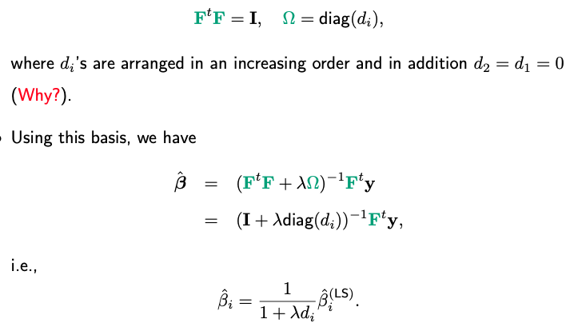

# 5.1. Polynomial Regression

## 5.1.1. Introduction to Polynomial Regression

Polynomial regression is a form of nonlinear regression that models the relationship between a dependent variable and one or more independent variables as an $`n`$-th degree polynomial. While the relationship between variables is nonlinear, the model remains linear in the parameters, making it a special case of multiple linear regression.

### Mathematical Framework

Consider a polynomial regression model of degree $`d`$ with a single predictor variable:

```math
y_i = \beta_0 + \beta_1 x_i + \beta_2 x_i^2 + \cdots + \beta_d x_i^d + \epsilon_i
```

where:
- $`y_i`$ is the response variable for observation $`i`$
- $`x_i`$ is the predictor variable
- $`\beta_0, \beta_1, \ldots, \beta_d`$ are the polynomial coefficients
- $`\epsilon_i`$ is the error term, typically assumed to be $`\epsilon_i \sim N(0, \sigma^2)`$

### Matrix Formulation

The polynomial regression model can be expressed in matrix form as:

```math
\mathbf{y} = \mathbf{X}\boldsymbol{\beta} + \boldsymbol{\epsilon}
```

where:

```math
\mathbf{y} = \begin{pmatrix} y_1 \\ y_2 \\ \vdots \\ y_n \end{pmatrix}, \quad
\mathbf{X} = \begin{pmatrix} 
1 & x_1 & x_1^2 & \cdots & x_1^d \\
1 & x_2 & x_2^2 & \cdots & x_2^d \\
\vdots & \vdots & \vdots & \ddots & \vdots \\
1 & x_n & x_n^2 & \cdots & x_n^d
\end{pmatrix}, \quad
\boldsymbol{\beta} = \begin{pmatrix} \beta_0 \\ \beta_1 \\ \vdots \\ \beta_d \end{pmatrix}, \quad
\boldsymbol{\epsilon} = \begin{pmatrix} \epsilon_1 \\ \epsilon_2 \\ \vdots \\ \epsilon_n \end{pmatrix}
```

### Parameter Estimation

The least squares estimator for the polynomial coefficients is:

```math
\hat{\boldsymbol{\beta}} = (\mathbf{X}^T\mathbf{X})^{-1}\mathbf{X}^T\mathbf{y}
```

The fitted values are:

```math
\hat{\mathbf{y}} = \mathbf{X}\hat{\boldsymbol{\beta}} = \mathbf{H}\mathbf{y}
```

where $`\mathbf{H} = \mathbf{X}(\mathbf{X}^T\mathbf{X})^{-1}\mathbf{X}^T`$ is the hat matrix.

### Degrees of Freedom

For a polynomial of degree $`d`$, the model has $`d + 1`$ parameters (including the intercept). The residual degrees of freedom are:

```math
\text{df}_{\text{residual}} = n - (d + 1)
```



*Figure: Illustration of how degrees of freedom affect the flexibility of a polynomial regression model.*

## 5.1.2. Basis Functions and Orthogonal Polynomials

### Standard Polynomial Basis

The standard polynomial basis functions are:

```math
\phi_0(x) = 1, \quad \phi_1(x) = x, \quad \phi_2(x) = x^2, \quad \ldots, \quad \phi_d(x) = x^d
```

### Orthogonal Polynomials

To avoid multicollinearity issues, orthogonal polynomials are often used. The Gram-Schmidt orthogonalization process creates orthogonal basis functions:

```math
p_0(x) = 1
```

```math
p_1(x) = x - \frac{\sum_{i=1}^n x_i}{n}
```

```math
p_j(x) = (x - \alpha_j)p_{j-1}(x) - \beta_j p_{j-2}(x)
```

where $`\alpha_j`$ and $`\beta_j`$ are chosen to ensure orthogonality.

### Implementation of Orthogonal Polynomials

**Python Implementation:** [polynomial_utilities.py](code/polynomial_utilities.py) - `create_orthogonal_polynomials()` and `create_standard_polynomials()` functions

The orthogonal polynomials implementation includes:

- **Legendre Polynomials**: Uses scipy's Legendre polynomials for numerical stability
- **Normalization**: Scales input to [-1, 1] interval for optimal orthogonality
- **Standard Polynomials**: Alternative implementation using sklearn's PolynomialFeatures
- **Feature Creation**: Efficient creation of polynomial basis functions

Key features:
- Numerical stability through proper normalization
- Support for both orthogonal and standard polynomial bases
- Integration with scipy and sklearn libraries

## 5.1.3. Model Selection and Degree Selection

### Information Criteria

#### Akaike Information Criterion (AIC)

```math
\text{AIC} = 2k - 2\ln(L)
```

where $`k = d + 1`$ is the number of parameters and $`L`$ is the likelihood.

For normal errors, AIC becomes:

```math
\text{AIC} = n\ln(\text{RSS}/n) + 2(d + 1)
```

#### Bayesian Information Criterion (BIC)

```math
\text{BIC} = \ln(n)k - 2\ln(L)
```

For normal errors:

```math
\text{BIC} = n\ln(\text{RSS}/n) + (d + 1)\ln(n)
```

### Cross-Validation

The $`k`$-fold cross-validation score is:

```math
\text{CV}(d) = \frac{1}{k}\sum_{i=1}^k \frac{1}{n_i}\sum_{j \in \text{fold}_i} (y_j - \hat{y}_j^{(-i)})^2
```

where $`\hat{y}_j^{(-i)}`$ is the prediction for observation $`j`$ using the model trained on all folds except fold $`i`$.

### Forward and Backward Selection

#### Forward and Backward Selection Algorithms

**Python Implementation:** [polynomial_utilities.py](code/polynomial_utilities.py) - `forward_polynomial_selection()` and `backward_polynomial_selection()` functions

The model selection algorithms include:

- **Forward Selection**: Incrementally adds polynomial terms from degree 1 to max_degree
- **Backward Selection**: Starts with max_degree and removes terms sequentially
- **Multiple Criteria**: Support for AIC, BIC, and cross-validation based selection
- **Comprehensive Evaluation**: Calculates all relevant metrics for each degree

Key features:
- Systematic exploration of polynomial degrees
- Multiple information criteria for model selection
- Cross-validation integration for robust evaluation
- Visualization of selection results

## 5.1.4. Complete Polynomial Regression Implementation

### Python Implementation

**Complete Implementation:** [polynomial_regression.py](code/polynomial_regression.py)

The Python implementation includes:

- **PolynomialRegression Class**: Complete implementation with training, prediction, and evaluation
- **Orthogonal Polynomials**: Support for both standard and orthogonal polynomial bases
- **Comprehensive Metrics**: MSE, RMSE, R², Adjusted R², AIC, and BIC calculations
- **Model Demonstration**: Complete example with synthetic data and visualization
- **Equation Generation**: Automatic generation of polynomial equations

Key features:
- Configurable polynomial degree and basis type
- Built-in performance metrics calculation
- Comprehensive visualization tools
- Integration with sklearn for robust implementation

### R Implementation

**Complete R Implementation:** [r_polynomial_regression.R](code/r_polynomial_regression.R)

The R implementation provides:

- **Polynomial Feature Creation**: Efficient creation of polynomial basis functions
- **Model Fitting**: Complete polynomial regression implementation using lm()
- **Comprehensive Metrics**: MSE, RMSE, R², Adjusted R², AIC, and BIC calculations
- **Visualization**: Advanced plotting using ggplot2 for model comparison
- **Cross-Validation**: Built-in cross-validation for degree selection
- **Residual Analysis**: Complete diagnostic tools for model validation

Key features:
- Uses base R lm() function for robust fitting
- Integration with ggplot2 for publication-quality plots
- Comprehensive model evaluation and comparison
- Modular function design for easy customization

## 5.1.5. Model Diagnostics and Validation

### Residual Analysis

**Python Implementation:** [polynomial_regression.py](code/polynomial_regression.py) - `analyze_polynomial_residuals()` function

The residual analysis implementation includes:

- **Diagnostic Plots**: Comprehensive 2x2 grid of residual plots
- **Normality Tests**: Shapiro-Wilk and Jarque-Bera tests for residual normality
- **Visualization**: Residuals vs fitted, Q-Q plots, residuals vs predictor, and histogram
- **Statistical Validation**: Formal hypothesis tests for model assumptions

Key features:
- Complete diagnostic suite for polynomial regression
- Integration with scipy for statistical testing
- Publication-quality visualization
- Comprehensive model validation tools

### Cross-Validation for Model Selection

**Python Implementation:** [polynomial_regression.py](code/polynomial_regression.py) - `cross_validate_polynomial_degree()` function

The cross-validation implementation includes:

- **K-Fold Cross-Validation**: Systematic evaluation of polynomial degrees
- **Optimal Degree Selection**: Automatic identification of best polynomial degree
- **Visualization**: Plot of CV scores vs polynomial degree
- **Robust Evaluation**: Multiple fold evaluation for reliable model selection

Key features:
- Integration with sklearn's KFold for robust validation
- Automatic optimal degree identification
- Comprehensive visualization of selection process
- Reliable model selection methodology

## 5.1.6. Limitations and Alternatives

### Limitations of Polynomial Regression

1. **Overfitting**: High-degree polynomials can fit noise in the data
2. **Extrapolation Issues**: Polynomials behave poorly outside the training range
3. **Global Nature**: Assumes the same relationship holds across the entire domain
4. **Interpretability**: High-degree terms are difficult to interpret

### Mathematical Analysis of Limitations

#### Extrapolation Problem

For a polynomial $`f(x) = \sum_{i=0}^d \beta_i x^i`$, the behavior as $`x \to \infty`$ is dominated by the highest degree term:

```math
\lim_{x \to \infty} f(x) = \lim_{x \to \infty} \beta_d x^d
```

This leads to explosive growth or decay outside the training range.

#### Runge's Phenomenon

For equally spaced interpolation points, high-degree polynomials can exhibit oscillatory behavior:

```math
f(x) = \frac{1}{1 + 25x^2}
```

The interpolating polynomial of degree $`n`$ at $`n+1`$ equally spaced points can have maximum error growing exponentially with $`n`$.

### Alternatives to Polynomial Regression

1. **Spline Regression**: Piecewise polynomials with continuity constraints
2. **Local Polynomial Regression**: Fitting polynomials in local neighborhoods
3. **Kernel Regression**: Non-parametric smoothing methods
4. **Basis Expansion**: Using other basis functions (Fourier, wavelet, etc.)

## Summary

Polynomial regression provides a flexible approach to modeling nonlinear relationships while maintaining linearity in parameters. Key concepts include:

1. **Mathematical Foundation**: Linear in parameters, nonlinear in predictors
2. **Model Selection**: AIC, BIC, and cross-validation for degree selection
3. **Orthogonal Polynomials**: Avoiding multicollinearity issues
4. **Diagnostics**: Residual analysis and model validation
5. **Limitations**: Overfitting, extrapolation issues, and global assumptions

The method serves as a foundation for more advanced nonlinear regression techniques like splines and local polynomial methods.

## Code Files Summary

The following code files provide complete implementations of the concepts discussed in this chapter:

### Python Implementation
- **[polynomial_utilities.py](code/polynomial_utilities.py)**: Utility functions for orthogonal polynomials, feature creation, and model selection algorithms (forward/backward selection)
- **[polynomial_regression.py](code/polynomial_regression.py)**: Complete polynomial regression implementation including the PolynomialRegression class, demonstration functions, residual analysis, and cross-validation

### R Implementation
- **[r_polynomial_regression.R](code/r_polynomial_regression.R)**: Complete R implementation using base R functions with comprehensive model fitting, evaluation, visualization, and diagnostic tools

Each file includes comprehensive examples, demonstrations, and analysis tools to help understand and apply polynomial regression concepts in practice.

## References

- Hastie, T., Tibshirani, R., & Friedman, J. (2009). The elements of statistical learning: data mining, inference, and prediction. Springer Science & Business Media.
- James, G., Witten, D., Hastie, T., & Tibshirani, R. (2013). An introduction to statistical learning. Springer.
- Montgomery, D. C., Peck, E. A., & Vining, G. G. (2012). Introduction to linear regression analysis. John Wiley & Sons.

Polynomial regression provides a natural extension of linear regression for modeling nonlinear relationships, but requires careful consideration of degree selection, overfitting, and interpretability.

---

**Navigation:**
- **Next Topic:** [Cubic Splines](02_cubic_splines.md) - Piecewise polynomial functions with continuity constraints
- **Previous Topic:** [Nonlinear Regression Overview](README.md) - Overview of nonlinear regression methods and applications
