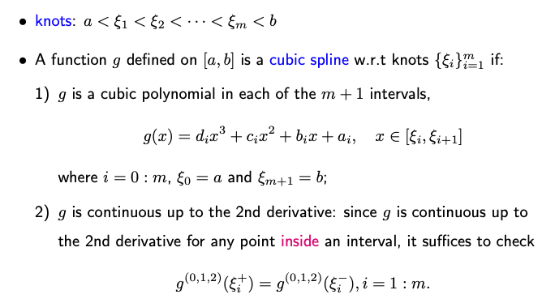

# 5.2. Cubic Splines

## 5.2.1. Introduction to Splines

Cubic splines represent a powerful approach to nonlinear regression that addresses many limitations of polynomial regression. Unlike global polynomials, splines use piecewise polynomial functions that provide local flexibility while maintaining smoothness across the entire domain.

**Intuitive Understanding**: Cubic splines are like using different curves for different regions of your data, but making sure they connect smoothly. Imagine you're trying to draw a smooth curve through a complex set of points. Instead of using one complex curve everywhere (like a high-degree polynomial), you divide your data into sections and use simple cubic curves in each section. The magic is that these curves connect so smoothly that you can't tell where one ends and another begins - it looks like one continuous, smooth curve. This approach gives you the flexibility to capture local patterns while avoiding the wild behavior that high-degree polynomials can have.

*Figure: Definition and structure of a cubic spline, showing piecewise polynomial segments and continuity at knots.*

### Mathematical Framework

Consider a one-dimensional predictor variable $`x`$ and response variable $`y`$. A spline function $`f(x)`$ is defined as a piecewise polynomial function over a partition of the domain into intervals.

**Definition**: A cubic spline is a function $`f(x)`$ that satisfies:
1. $`f(x)`$ is a cubic polynomial on each interval $`[x_i, x_{i+1}]`$ - like using a simple cubic curve in each section
2. $`f(x)`$ is continuous at each knot $`x_i`$ - like making sure the curves connect without gaps
3. $`f'(x)`$ is continuous at each knot $`x_i`$ - like making sure the curves connect smoothly (no sharp corners)
4. $`f''(x)`$ is continuous at each knot $`x_i`$ - like making sure the curves connect very smoothly (no sudden changes in curvature)

**Intuition**: These four conditions ensure that our piecewise curve looks and behaves like one smooth, continuous curve. The first condition gives us local flexibility (different curves for different regions), while the last three conditions ensure global smoothness (seamless connections between regions). It's like having different road segments that connect so smoothly that drivers can't tell they're on different segments.

### Piecewise Polynomial Structure

Given knots $`\xi_1 < \xi_2 < \cdots < \xi_m`$, the cubic spline can be expressed as:

$$ f(x) = \begin{cases}
p_1(x) & \text{if } x \in [\xi_0, \xi_1] \\
p_2(x) & \text{if } x \in [\xi_1, \xi_2] \\
\vdots & \vdots \\
p_{m+1}(x) & \text{if } x \in [\xi_m, \xi_{m+1}]
\end{cases} $$

where each $`p_i(x)`$ is a cubic polynomial:

$$ p_i(x) = a_i + b_i x + c_i x^2 + d_i x^3 $$

**Intuition**: This formula shows that we're using different cubic curves in different regions. The knots (ξ₁, ξ₂, ..., ξₘ) are like the boundaries between regions. In each region, we use a simple cubic curve (a + bx + cx² + dx³) that can capture local patterns without being too complex. The beauty is that these simple curves connect so smoothly that the result looks like one sophisticated curve.

### Continuity Conditions

At each knot $`\xi_i`$, the following continuity conditions must be satisfied:

$$ p_i(\xi_i) = p_{i+1}(\xi_i) \quad \text{(function continuity)} $$

$$ p_i'(\xi_i) = p_{i+1}'(\xi_i) \quad \text{(first derivative continuity)} $$

$$ p_i''(\xi_i) = p_{i+1}''(\xi_i) \quad \text{(second derivative continuity)} $$

**Intuition**: These continuity conditions ensure smooth connections between curve segments. Function continuity means no gaps - the curves actually meet at the boundary. First derivative continuity means no sharp corners - the curves connect smoothly. Second derivative continuity means no sudden changes in curvature - the curves connect very smoothly. It's like having road segments that connect so seamlessly that drivers experience a perfectly smooth ride.

## 5.2.2. Mathematical Construction of Cubic Splines

### Basis Function Representation

Cubic splines can be represented using a set of basis functions. The most common representation uses the truncated power basis:

$$ f(x) = \beta_0 + \beta_1 x + \beta_2 x^2 + \beta_3 x^3 + \sum_{i=1}^m \beta_{i+3}(x - \xi_i)_+^3 $$

where $`(x - \xi_i)_+^3`$ is the truncated power function:

$$ (x - \xi_i)_+^3 = \begin{cases}
0 & \text{if } x < \xi_i \\
(x - \xi_i)^3 & \text{if } x \geq \xi_i
\end{cases} $$

**Intuition**: This basis function representation is like building our spline from simple building blocks. The first four terms (β₀ + β₁x + β₂x² + β₃x³) give us a basic cubic curve. The additional terms (the truncated power functions) allow us to add "bumps" or "kinks" at specific points (the knots) to capture local patterns. Each truncated power function is zero before its knot and then starts growing as a cubic function after the knot, allowing us to modify the curve locally without affecting other regions.

### Degrees of Freedom Calculation

For a cubic spline with $`m`$ knots:

- **Total parameters**: $`4(m+1)`$ (4 coefficients for each of $`m+1`$ intervals) - like having 4 parameters for each curve segment
- **Continuity constraints**: $`3m`$ (3 constraints at each of $`m`$ knots) - like having 3 smoothness conditions at each boundary
- **Effective degrees of freedom**: $`4(m+1) - 3m = m + 4`$ - like the actual flexibility after accounting for smoothness requirements

**Intuition**: This calculation shows how the smoothness constraints reduce our flexibility. We start with 4 parameters per segment (like having full control over each curve piece), but the continuity requirements at each knot reduce our freedom. The result is that we have m+4 effective parameters - enough to capture local patterns while maintaining global smoothness.

### Matrix Formulation

The cubic spline can be expressed in matrix form as:

$$ \mathbf{y} = \mathbf{B}\boldsymbol{\beta} + \boldsymbol{\epsilon} $$

where $`\mathbf{B}`$ is the basis matrix with columns corresponding to the basis functions:

$$ \mathbf{B} = \begin{pmatrix}
1 & x_1 & x_1^2 & x_1^3 & (x_1 - \xi_1)_+^3 & \cdots & (x_1 - \xi_m)_+^3 \\
1 & x_2 & x_2^2 & x_2^3 & (x_2 - \xi_1)_+^3 & \cdots & (x_2 - \xi_m)_+^3 \\
\vdots & \vdots & \vdots & \vdots & \vdots & \ddots & \vdots \\
1 & x_n & x_n^2 & x_n^3 & (x_n - \xi_1)_+^3 & \cdots & (x_n - \xi_m)_+^3
\end{pmatrix} $$

**Intuition**: This matrix formulation shows that cubic splines are really just linear regression in disguise! Instead of using simple features (like x, x², x³), we're using a special set of features that automatically ensure smoothness. The basis matrix B contains all our transformed features, and we solve the same linear regression problem we learned earlier. This means we can use all our existing linear regression tools and theory.

## 5.2.3. Natural Cubic Splines

### Definition and Properties

A natural cubic spline is a cubic spline with additional constraints at the boundary knots:

$$ f''(\xi_1) = f''(\xi_m) = 0 $$

This constraint forces the spline to be linear in the extreme intervals, reducing the degrees of freedom from $`m + 4`$ to $`m`$.

**Intuition**: Natural cubic splines are like adding "guardrails" at the boundaries. By forcing the second derivative to be zero at the endpoints, we ensure that the spline behaves linearly (straight line) in the extreme regions. This prevents the wild behavior that can occur at the boundaries and makes the spline more stable and interpretable. It's like having a smooth curve that gradually straightens out at the edges instead of shooting off to infinity.

### Mathematical Justification

The natural cubic spline minimizes the integrated squared second derivative:

$$ \int_{\xi_1}^{\xi_m} [f''(x)]^2 dx $$

subject to the interpolation constraints $`f(x_i) = y_i`$ for all data points.

**Intuition**: This mathematical result shows that natural cubic splines are optimal in a very specific sense - they minimize the "wiggliness" of the curve while still fitting the data points. The integral of the squared second derivative measures how much the curve bends and twists. By minimizing this, we get the smoothest possible curve that still passes through our data points. It's like finding the most elegant, graceful curve that fits our data.

### Basis Functions for Natural Cubic Splines

The basis functions for natural cubic splines are more complex and typically use B-splines or the natural spline basis:

$$ N_1(x) = 1, \quad N_2(x) = x, \quad N_{i+2}(x) = d_i(x) - d_{m-1}(x) $$

where $`d_i(x)`$ are the cubic spline basis functions.

**Intuition**: The natural spline basis functions are designed to automatically satisfy the boundary constraints. The first two functions (1 and x) give us the linear behavior at the boundaries, while the remaining functions allow us to add local flexibility in the interior regions. This ensures that our spline naturally behaves well at the boundaries without requiring explicit constraints.

## 5.2.4. Complete Cubic Spline Implementation

### Python Implementation

**Complete Implementation:** [cubic_spline_regression.py](code/cubic_spline_regression.py)

The Python implementation includes:

- **CubicSplineRegression Class**: Complete implementation with support for both regular and natural cubic splines - like a complete toolkit for building piecewise smooth curves
- **Basis Functions**: Truncated power basis and natural spline basis creation - like having different sets of building blocks for different needs
- **Model Fitting**: Linear regression on basis functions with automatic knot selection - like automatically finding the best places to put curve boundaries
- **Comprehensive Visualization**: 6-panel demonstration including spline fits, basis functions, derivatives, residuals, and knot placement effects - like having multiple views to understand how our curves work
- **Comparison with Scipy**: Integration with scipy's CubicSpline for validation - like checking our work against proven tools

Key features:
- Configurable knot positions and spline type (regular vs natural) - like adjustable settings for curve behavior
- Automatic knot selection using quantiles - like automatically choosing good boundary locations
- Comprehensive diagnostic plots and model comparison - like complete tools for evaluating curve quality
- Integration with scipy for robust implementation - like using proven, reliable tools

### R Implementation

**Complete R Implementation:** [r_cubic_splines.R](code/r_cubic_splines.R)

The R implementation provides:

- **Truncated Power Basis**: Complete implementation of truncated power basis functions - like building the foundation for piecewise curves
- **Multiple Spline Types**: Regular cubic splines (B-splines), natural cubic splines, and smoothing splines - like having different curve types for different situations
- **Advanced Features**: Cross-validation for knot selection, spline diagnostics, and model comparison - like sophisticated tools for optimizing curve performance
- **Comprehensive Visualization**: Publication-quality plots using ggplot2 - like professional-looking graphs to understand curve behavior
- **Model Evaluation**: MSE and R² calculations for model comparison - like quantitative measures of curve quality

Key features:
- Uses base R splines package for robust implementation - like using R's battle-tested spline tools
- Integration with ggplot2 for advanced visualization - like professional-quality curve plots
- Support for multiple spline types and knot selection methods - like flexible tools for different curve needs
- Comprehensive diagnostic tools and model validation - like complete health checks for our curves

## 5.2.5. Advanced Topics

### B-Spline Basis

**Python Implementation:** [advanced_spline_utilities.py](code/advanced_spline_utilities.py) - `create_bspline_basis()` function

B-splines provide a more numerically stable basis for cubic splines:

- **Numerical Stability**: B-splines are more numerically stable than truncated power basis - like having more reliable building blocks
- **Local Support**: Each B-spline basis function has compact support - like having building blocks that only affect small regions
- **Automatic Knot Extension**: Handles boundary conditions automatically - like having smart building blocks that know how to behave at edges
- **Degree Flexibility**: Supports arbitrary polynomial degrees - like having building blocks that can create curves of different complexity

Key features:
- Integration with scipy's BSpline for robust implementation - like using proven B-spline tools
- Automatic knot extension for boundary conditions - like automatic handling of edge behavior
- Support for arbitrary polynomial degrees - like flexible curve complexity
- Comparison with truncated power basis functions - like understanding different building block approaches

**Intuition**: B-splines are like having a more sophisticated set of building blocks. Each B-spline basis function is designed to be numerically stable and to have local influence, meaning it only affects a small region of the curve. This makes B-splines more robust and easier to work with than the truncated power basis, especially for complex curves with many knots.

### Smoothing Splines

Smoothing splines minimize the penalized objective function:

$$ \sum_{i=1}^n (y_i - f(x_i))^2 + \lambda \int [f''(x)]^2 dx $$

where $`\lambda`$ controls the trade-off between fit and smoothness.

**Intuition**: Smoothing splines are like having a "smoothness dial" that you can adjust. The first term (the sum of squared errors) measures how well the curve fits the data points. The second term (the integral of squared second derivative) measures how smooth the curve is. The parameter λ controls the balance between these two goals. A large λ means we prefer smoothness over perfect fit, while a small λ means we prefer perfect fit over smoothness. It's like choosing between a curve that follows every data point exactly (but might be wiggly) versus a curve that's very smooth (but might miss some points).

**Python Implementation:** [advanced_spline_utilities.py](code/advanced_spline_utilities.py) - `fit_smoothing_spline()` function

- **Penalized Least Squares**: Balances fit quality with smoothness - like finding the optimal balance between accuracy and elegance
- **Smoothing Parameter**: λ controls the trade-off between bias and variance - like adjusting the smoothness dial
- **Natural Boundary Conditions**: Linear behavior at boundaries - like ensuring graceful behavior at edges
- **Optimal Smoothing**: Automatic selection of smoothing parameter - like having an expert choose the right smoothness level

Key features:
- Conceptual implementation of smoothing splines - like understanding the smoothing approach
- Integration with scipy's CubicSpline for natural boundary conditions - like using proven tools for boundary behavior
- Framework for penalized least squares optimization - like mathematical foundation for smoothing
- Demonstration of smoothing parameter effects - like seeing how the smoothness dial works

### Knot Selection

Optimal knot placement is crucial for spline performance:

**Python Implementation:** [advanced_spline_utilities.py](code/advanced_spline_utilities.py) - `select_optimal_knots()` function

- **Quantile Method**: Uses percentiles of the predictor variable - like placing boundaries at natural data divisions
- **Uniform Method**: Places knots at uniform intervals - like placing boundaries at regular intervals
- **Cross-Validation Method**: Uses CV to select optimal number and positions - like testing different boundary placements
- **Multiple Criteria**: Support for different selection strategies - like having multiple approaches for choosing boundaries

Key features:
- Multiple knot selection strategies - like different methods for choosing curve boundaries
- Cross-validation for optimal knot selection - like testing boundary placements on held-out data
- Integration with sklearn for robust validation - like using proven validation tools
- Comprehensive comparison of selection methods - like understanding which approach works best

**Intuition**: Knot selection is like choosing where to put the boundaries between curve segments. Good knot placement can make the difference between a curve that captures the data well and one that misses important patterns. The quantile method places knots where the data naturally clusters, the uniform method places them at regular intervals, and cross-validation tests different placements to find the best one. It's like choosing the best locations for road segments to ensure smooth travel.

## 5.2.6. Model Diagnostics and Validation

### Spline Diagnostics

**Python Implementation:** [advanced_spline_utilities.py](code/advanced_spline_utilities.py) - `analyze_spline_diagnostics()` function

The spline diagnostics implementation includes:

- **Diagnostic Plots**: Comprehensive 2x2 grid of residual plots - like a complete health check for our piecewise curves
- **Normality Tests**: Q-Q plots and statistical tests for residual normality - like checking if our curve errors follow expected patterns
- **Visualization**: Residuals vs fitted, residuals vs predictor, and histogram - like multiple views of curve performance
- **Statistical Validation**: Formal hypothesis tests for model assumptions - like rigorous testing of curve appropriateness

Key features:
- Complete diagnostic suite for spline regression - like comprehensive health check for piecewise curves
- Integration with scipy for statistical testing - like using proven statistical tools
- Publication-quality visualization - like professional-looking diagnostic plots
- Comprehensive model validation tools - like thorough testing of curve assumptions

**Intuition**: Spline diagnostics are like checking the quality of our piecewise curve fit. We look at the differences between our predictions and the actual data points to see if our curve is working well. Good residuals should be random (no patterns), normally distributed, and have constant variance. If we see patterns in the residuals, it might mean our curve isn't complex enough in some regions or we need to adjust our knot placement.

## Summary

Cubic splines provide a flexible and powerful approach to nonlinear regression through:

1. **Piecewise Structure**: Local polynomial fits with global smoothness - like using different curves for different regions while maintaining smooth connections
2. **Continuity Constraints**: Smooth transitions at knot points - like ensuring seamless connections between curve segments
3. **Basis Representations**: Multiple basis function options (truncated power, B-splines) - like having different sets of building blocks for different needs
4. **Natural Splines**: Linear behavior at boundaries - like graceful behavior at the edges of our data
5. **Knot Selection**: Critical for model performance - like choosing the right places to put curve boundaries

The mathematical foundations ensure optimal smoothness, while the algorithmic design provides both computational efficiency and interpretability. Cubic splines address many limitations of polynomial regression while maintaining local flexibility.

**Intuition**: Cubic splines are like having the best of both worlds - the flexibility to capture local patterns and the smoothness to avoid the wild behavior of high-degree polynomials. By using simple cubic curves in different regions and ensuring they connect smoothly, we get a sophisticated curve that can adapt to local patterns while maintaining global smoothness. This makes cubic splines particularly powerful for modeling complex relationships that vary across the domain.

The key insight is that we don't need one complex curve everywhere. Instead, we can use simple curves in different regions and let the smoothness constraints ensure they work together as one elegant curve. This approach is both mathematically sound and practically effective, making cubic splines a cornerstone of modern nonlinear regression.

Cubic splines provide a flexible framework for modeling complex nonlinear relationships while maintaining smoothness and avoiding the overfitting issues of high-degree polynomials.

---

**Navigation:**
- **Next Topic:** [Regression Splines](03_regression_splines.md) - Basis function approach to spline modeling
- **Previous Topic:** [Polynomial Regression](01_polynomial_regression.md) - Extending linear models with polynomial terms

## Code Files Summary

The following code files provide complete implementations of the concepts discussed in this chapter:

### Python Implementation
- **[cubic_spline_regression.py](code/cubic_spline_regression.py)**: Complete cubic spline regression implementation including the CubicSplineRegression class, basis functions, model fitting, and comprehensive demonstrations - like a complete toolkit for building piecewise smooth curves
- **[advanced_spline_utilities.py](code/advanced_spline_utilities.py)**: Advanced utilities including B-spline basis functions, smoothing splines, knot selection algorithms, and diagnostic tools - like sophisticated tools for advanced spline modeling

### R Implementation
- **[r_cubic_splines.R](code/r_cubic_splines.R)**: Complete R implementation using the splines package with support for regular cubic splines, natural cubic splines, smoothing splines, and comprehensive visualization - like a complete R toolkit for spline modeling

Each file includes comprehensive examples, demonstrations, and analysis tools to help understand and apply cubic spline concepts in practice.

## References

- Hastie, T., Tibshirani, R., & Friedman, J. (2009). The elements of statistical learning: data mining, inference, and prediction. Springer Science & Business Media.
- de Boor, C. (2001). A practical guide to splines. Springer Science & Business Media.
- Wahba, G. (1990). Spline models for observational data. SIAM.
