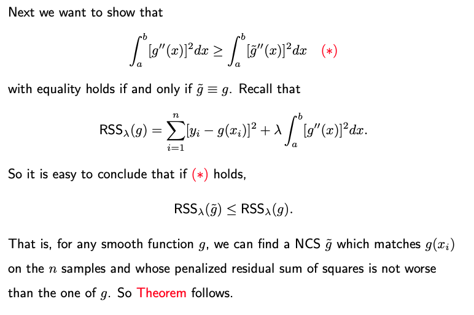
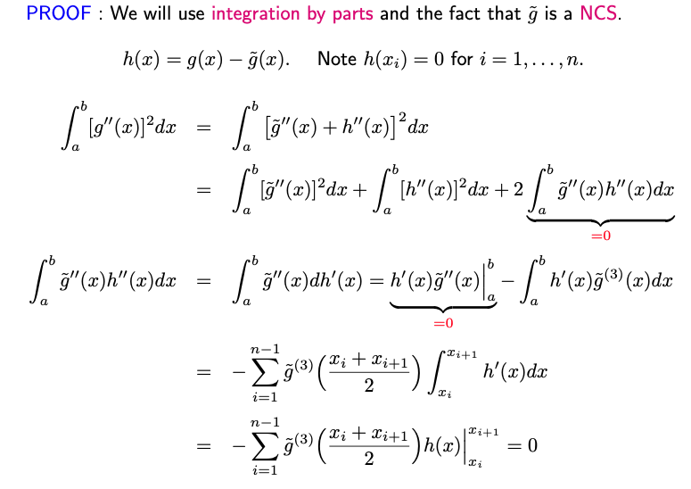
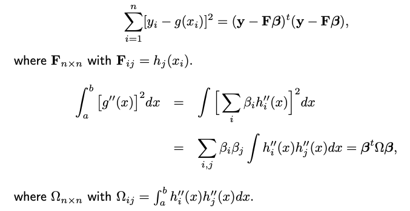
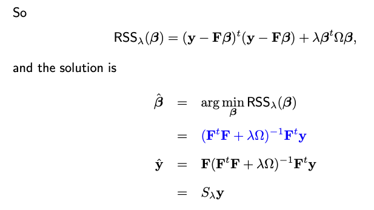
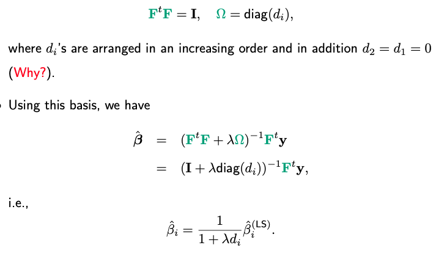
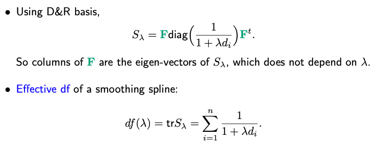
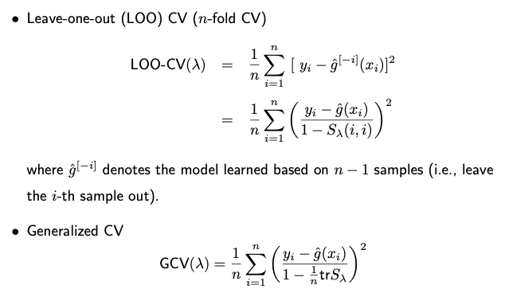
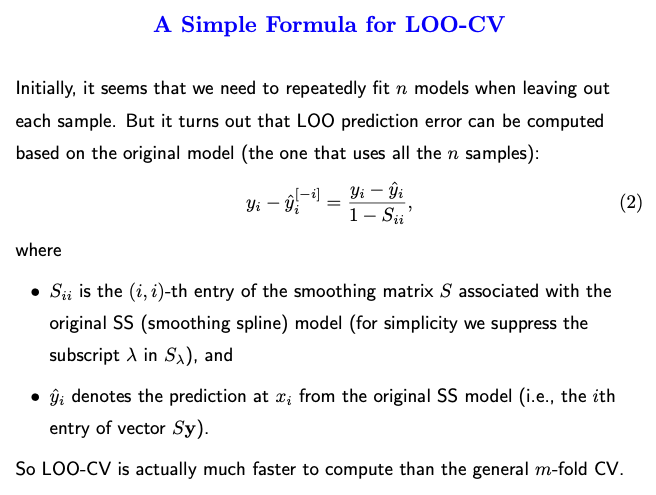
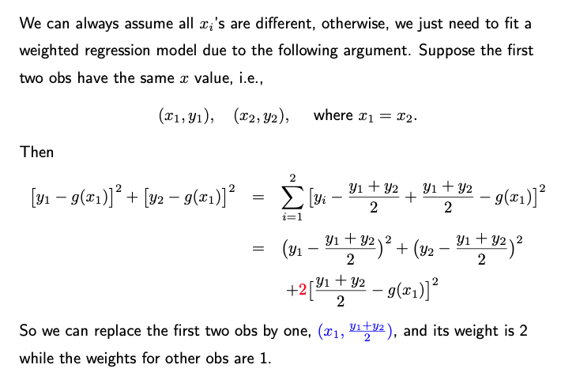
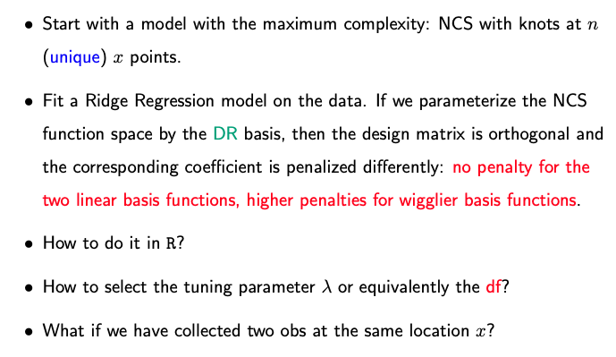

# 5.4. Smoothing Splines

## 5.4.1. Introduction

In regression splines, we have to decide on the number of knots and their locations. This choice often has significant implications for the resulting fit.

As a solution to the arbitrariness of knot placement in regression splines, **smoothing splines** take a naive approach. Knots are placed at every data point, simplifying the decision-making process. For a natural cubic spline, when knots are placed at n data points, our design matrix becomes of size n-by-n.

$$\mathbf{y}_{n \times 1} = \mathbf{F}_{n \times n} \boldsymbol{\beta}_{n \times 1}.$$

Running ordinary least squares (OLS) regression with this matrix would yield a perfect fit to the data. To avoid overfitting, one can employ techniques like Lasso. Smoothing splines employ an approach similar to ridge regression.

$$\min_{\boldsymbol{\beta}} \Big[ \| \mathbf{y} - \mathbf{F} \boldsymbol{\beta} \|^2 + \textcolor{red}{\lambda} \boldsymbol{\beta}^t \Omega \boldsymbol{\beta} \Big].$$

The objective function has two components:

* Residual Sum of Squares (RSS), which captures the fit of the model.
* A quadratic penalty on beta, which discourages large coefficient values and thus reduces overfitting.

Specifically, the penalty is quadratic, resembling the penalty in ridge regression. In typical ridge regression, $\Omega$ is an identity matrix, meaning each parameter is penalized equally. However, in the context of smoothing splines, $\Omega$ might not be the identity, and the nature of this matrix will be defined later.

The tuning parameter $\lambda$, often chosen by CV, decides the balance between the fit and the penalty. A larger $\lambda$ places more emphasis on regularization and can lead to smoother curves, while a smaller $\lambda$ allows for more flexibility in fitting the data.

Next, we're going to see that how this objective function for smoothing splines can be derived from a different aspect.

## 5.4.2. The Roughness Penalty Approach

Assume the function we aim to estimate has a bounded support [a, b]. Let $S[a,b]$ denote all smooth functions defined on [a,b]. Instead of merely trying to fit the data as closely as possible, let's look for the minimizer in $S[a,b]$ of the following penalized residual sum of squares

$$\text{RSS}_\lambda(g) = \sum_{i=1}^n [y_i - g(x_i)]^2 + \lambda \int_a^b [g''(x)]^2 dx,$$

The first term ensures that $g$ fits the given data well.

The second term is a roughness penalty on function $g$. The second derivative is a measure of the curvature or "wiggliness" of a function. By squaring it and integrating over the entire range, we obtain a measure of how much the function fluctuates. For instance, if $g$ linear, its second derivative is zero throughout the range, resulting in no penalty. Functions with a lot of wiggles or changes in curvature will have a large penalty due to high values of the second derivative.

The parameter $\lambda$ controls the trade-off. A larger $\lambda$ means we prefer smoother functions, even if they fit the data a bit worse. A small $\lambda$ allows for more wigglly functions if they fit the data better.

The amazing part is that even though this optimization problem presented in an infinite-dimensional function space $S[a,b]$, it can be solved using finite-dimensional linear algebra, which brings us back to the ridge regression problem you presented earlier.

### A Fundamental Result

The best smooth function $g$ that minimizes the penalized residual sum of squares over the entire infinite-dimensional function space $S[a,b]$ happens to be a natural cubic spline (NCS) with knots at the data points x_1, …, x_n, where we assume the n data points are unique. We'll discuss how to handle the non-unique data points later.

**Theorem**. (WLOG) Assume n>1 and the data points are unique and arranged in an increasing order: x_1 < x_2 < … < x_n. The following holds true:

$$\min_{g \in S[a,b]} \text{RSS}_\lambda(g) = \min_{\tilde{g} \in \text{NCS}_n} \text{RSS}_\lambda(\tilde{g})$$

where $\text{NCS}_n$ refers to the family of natural cubic splines with knots at the n data points x_1, …, x_n.

How to prove it? Let's consider any $g \in S[a,b]$. Then there exists an NCS $\tilde{g}$ with knots at x_1, …, x_n satifying

$$g(x_i) = \tilde{g}(x_i), \quad i=1, \dots, n.$$

Note that such a function $\tilde{g}$ must indeed exist. This is due to the fact that a Natural Cubic Spline (NCS) with n knots possesses n degrees of freedom. Consequently, we can aptly choose the n coefficients to ensure the n predictions $\tilde{g}(x_i)$ match any predetermined values.

## 5.4.3. Fit a Smoothing Spline Model

This result drastically simplifies the problem. Instead of looking over $S[a,b]$, an infinite space of functions, we can restrict our search to a much smaller, finite-dimensional space $\text{NCS}_n$

Given that $g$ is a natural cubic spline with n degrees of freedom, it can be represented as a linear combination of n basis functions:

$$g(x) = \sum_{i=1}^n \beta_i h_i(x)$$

where $h_i(x)$ are basis functions for NBS with knots at x_1, …, x_n. With the parameterization in place, our original infinite-dimensional optimization problem is now reduced to a finite-dimensional one. Specifically, we're now tasked with finding the best values of the coefficients $\beta_1, \dots, \beta_n$.

When you plug the expression for $g(x)$ into the penalized objective function $\text{RSS}_\lambda(g)$, you end up with a quadratic function in the beta's. This can be minimized using standard linear algebra techniques.

Moreover, when this is represented in matrix form, it mirrors the ridge regression problem we discussed earlier. The design matrix $\mathbf{F}$ contains the evaluations of the spline basis functions at the data points, and the penalty matrix $\Omega$ captures the roughness of the spline, coming from the integral of the squared second derivatives.

If we were to employ a different set of basis functions, say $\tilde{h}_1(x), \dots, \tilde{h}_n(x)$, how might that affect our calculations?

Given a different set of basis functions, let'd note the associated design matrix by $\tilde{\mathbf{F}}$ and the coefficients $\boldsymbol{\alpha}$. Though $\boldsymbol{\alpha}$ and $\boldsymbol{\beta}$ may differ due to the change in the design matrix, the resulting prediction $\hat{\mathbf{y}}$ should be the same.

This stems from the fact that if $h_i(x)$ and $\tilde{h}_i(x)$ represent distinct sets basis functions for an identical functional space, they can be interchanged through a full rank n-by-n matrix $A$. Then we have

$$\tilde{\mathbf{F}} = \mathbf{F} A, \quad \tilde{\Omega} = A^t \Omega A$$

When we substitute this expression into the experssion for the smoother matrix $\tilde{\mathbf{F}} (\tilde{\mathbf{F}}^t\tilde{\mathbf{F}} + \lambda \tilde{\Omega})^{-1} \tilde{\mathbf{F}}^t$, terms with matrix A cancel out. This implies that our smoother matrix remains unchanged irrespective of whether we use $\mathbf{F}$ or $\tilde{\mathbf{F}}$. In essence, the choice of basis functions doesn't alter the S matrix, and, as a result, has no impact on $\hat{\mathbf{y}}$.

### The DR Basis

A particular set of basis functions, termed the "DR basis" (Demmler & Reinsch, 1975), boasts a unique double orthogonality property. Here, the basis functions are orthogonal to each other, and so are their second derivatives. Consequently,

To understand why the rank of $\Omega$ is less than n-2 (or put another way, why $\Omega$ has two zero eigenvalues), it's useful to refer back to our earlier discussion about changing basis functions.

Even though the actual expression for $\Omega$ may vary as we switch between different sets of basis functions, its rank remains invariant. This consistency stems from the fact that moving from one basis function set to another invariably entails the use of a full-rank transformation matrix $A$. Consequently, the rank persists.

Now, let's examine a specific choice of basis function. Here, we define $h_1(x) = 1$ and $h_2(x) = x$. These functions, being global linear functions, naturally fall under the category of natural cubic splines. For the purpose of our current discussion, we only need to focus on these two functions, without concerning ourselves with additional functions. With this basis set in consideration and given that the second derivatives of $h_1$ and $h_2$ are null, the first two rows and columns of $\Omega$ are entirely zero. Consequently, the rank of $\Omega$ is always less than or equal to n-2.

Employing this basis, the smooth spline coefficients can be expressed in a distinct manner. A notable "shrinkage" effect becomes evident. Each element of the smooth spline coefficient represents a shrunk estimate of the original least square estimate. Notably, the first two coefficients see no shrinkage since $d_1$ and $d_2$ are both zero. This underscores a key facet of the smoothing spline: linear terms are not subjected to penalization.

### The Effective Degrees of Freedom

The effective degree of freedom (DF) of a smoothing spline is similar to what's defined for ridge regression. It's the trace of the smoother matrix $\mathbf{S}_{\lambda}$.

Even if $\lambda$ tends to infinity, the first two terms in this ratio are 1 (since $d_1 = d_2 = 0$. This means linear terms aren't penalized. Thus, the range for the DF for a smooth spline is between 2 and n. Similar to ridge, the DF doesn't have to be an integer; it can be any real number, like 3.5.

When using software like R, rather than specifying $\lambda$ value directly, one can indicate the desired degree of freedom. The software then determines the associated $\lambda$.

## 5.4.4. Smoothing Splines in R/Python

- **Rcode**: [Rcode_W5_SmoothingSpline](./Rcode_W5_SmoothingSpline.html)
- **Python**: [Python_W5_SmoothingSpline](./Python_W5_SmoothingSpline.html)

## 5.4.5. Choice of Lambda

Various methods exist to select lambda, such as cross-validation or using a separate test set for assessing prediction error. Many R packages have integrated functions to select lambda, often leveraging leave-one-out cross-validation (LOOCV) and generalized cross-validation (GCV).

Leave-one-out cross-validation is defined as the average difference between $y_i$ and $\hat{g}(x_i)^{[-i]}$, the predicted value for $x_i$ when the data pair $(x_i, y_i)$ is excluded from the model. Initially, this seems to necessitate n model fits, each excluding one observation. However, it's more efficient in practice: we can compute the LOOCV prediction error based on the original model – the one fit using all data points. This formula isn't exclusive to smoothing splines; it also applies to models like linear regression, polynomial regression, and ridge regression.

In some cases, GCV is used to lessen computational demands. Instead of using varying $S_{ii}$ values (which are different for each i), we take their average, which serves as an approximation.

## 5.4.6. Weighted Spline Models

## 5.4.7. Summary

