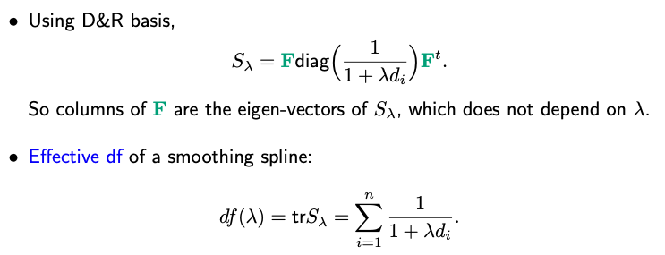

# 5.4. Smoothing Splines

## 5.4.1. Introduction to Smoothing Splines

Smoothing splines represent an elegant solution to the knot selection problem in regression splines. Instead of manually choosing knot locations, smoothing splines place knots at every unique data point and use regularization to control the smoothness of the fit. This approach eliminates the arbitrariness of knot placement while providing a principled way to balance fit and smoothness.

### The Knot Selection Problem

In regression splines, we face the challenge of selecting:
1. **Number of knots**: Too few knots may underfit, too many may overfit
2. **Knot locations**: Poor placement can lead to suboptimal fits
3. **Model complexity**: Balancing flexibility with generalization

Smoothing splines address these issues by:
- Placing knots at every unique data point
- Using a roughness penalty to control smoothness
- Automatically selecting the optimal level of smoothing

### Mathematical Framework

Given data points $`(x_i, y_i)_{i=1}^n`$ where $`x_1 < x_2 < \cdots < x_n`$ are unique, we seek to estimate a smooth function $`f(x)`$ that minimizes the penalized residual sum of squares:

```math
\text{RSS}_\lambda(f) = \sum_{i=1}^n [y_i - f(x_i)]^2 + \lambda \int_{x_1}^{x_n} [f''(x)]^2 dx
```

The objective function has two components:
1. **Data fidelity term**: $`\sum_{i=1}^n [y_i - f(x_i)]^2`$ ensures the function fits the data well
2. **Roughness penalty**: $`\lambda \int_{x_1}^{x_n} [f''(x)]^2 dx`$ penalizes "wiggliness" in the function

### The Smoothing Parameter λ

The parameter $`\lambda`$ controls the trade-off between fit and smoothness:
- **Large λ**: Emphasizes smoothness, may underfit the data
- **Small λ**: Emphasizes fit, may overfit the data
- **Optimal λ**: Balances fit and smoothness, typically chosen by cross-validation

## 5.4.2. Theoretical Foundation: The Roughness Penalty Approach

### The Infinite-Dimensional Optimization Problem

Consider the space $`S[a,b]`$ of all smooth functions defined on $`[a,b]`$. The smoothing spline problem is to find:

```math
\hat{f} = \arg\min_{f \in S[a,b]} \text{RSS}_\lambda(f)
```

This is an infinite-dimensional optimization problem, but it has a remarkable finite-dimensional solution.

### The Fundamental Theorem

**Theorem**: The minimizer of the penalized residual sum of squares over the infinite-dimensional function space $`S[a,b]`$ is a natural cubic spline with knots at the unique data points $`x_1, x_2, \ldots, x_n`$.

```math
\min_{f \in S[a,b]} \text{RSS}_\lambda(f) = \min_{g \in \text{NCS}_n} \text{RSS}_\lambda(g)
```

where $`\text{NCS}_n`$ denotes the family of natural cubic splines with knots at $`x_1, x_2, \ldots, x_n`$.

### Proof Sketch

The proof relies on two key insights:

1. **Interpolation Property**: For any function $`f \in S[a,b]`$, there exists a natural cubic spline $`g`$ with knots at $`x_1, x_2, \ldots, x_n`$ such that:
```math
f(x_i) = g(x_i), \quad i = 1, 2, \ldots, n
```

2. **Minimum Curvature Property**: Among all functions that interpolate the data points, the natural cubic spline minimizes the integrated squared second derivative:
```math
\int_{x_1}^{x_n} [g''(x)]^2 dx \leq \int_{x_1}^{x_n} [f''(x)]^2 dx
```

This result reduces the infinite-dimensional optimization problem to a finite-dimensional one.

## 5.4.3. Finite-Dimensional Formulation

### Basis Function Representation

Since the optimal function is a natural cubic spline with $`n`$ knots, it can be represented as:

```math
f(x) = \sum_{i=1}^n \beta_i h_i(x)
```

where $`\{h_i(x)\}_{i=1}^n`$ are the natural cubic spline basis functions with knots at $`x_1, x_2, \ldots, x_n`$.

### Matrix Formulation

The penalized objective function becomes:

```math
\text{RSS}_\lambda(\boldsymbol{\beta}) = \|\mathbf{y} - \mathbf{H}\boldsymbol{\beta}\|^2 + \lambda \boldsymbol{\beta}^T \boldsymbol{\Omega} \boldsymbol{\beta}
```

where:
- $`\mathbf{y} = (y_1, y_2, \ldots, y_n)^T`$ is the response vector
- $`\mathbf{H}`$ is the $`n \times n`$ design matrix with $`H_{ij} = h_j(x_i)`$
- $`\boldsymbol{\beta} = (\beta_1, \beta_2, \ldots, \beta_n)^T`$ is the coefficient vector
- $`\boldsymbol{\Omega}`$ is the penalty matrix with $`\Omega_{ij} = \int_{x_1}^{x_n} h_i''(x) h_j''(x) dx`$

### Solution

The solution is given by:

```math
\hat{\boldsymbol{\beta}} = (\mathbf{H}^T\mathbf{H} + \lambda \boldsymbol{\Omega})^{-1} \mathbf{H}^T\mathbf{y}
```

This is equivalent to ridge regression with a non-identity penalty matrix.

### The Smoother Matrix

The fitted values can be expressed as:

```math
\hat{\mathbf{y}} = \mathbf{S}_\lambda \mathbf{y}
```

where $`\mathbf{S}_\lambda = \mathbf{H}(\mathbf{H}^T\mathbf{H} + \lambda \boldsymbol{\Omega})^{-1} \mathbf{H}^T`$ is the smoother matrix.

## 5.4.4. The Demmler-Reinsch Basis

### Double Orthogonality

A particularly useful basis is the Demmler-Reinsch (DR) basis, which has the property that both the basis functions and their second derivatives are orthogonal:

```math
\int_{x_1}^{x_n} h_i(x) h_j(x) dx = \delta_{ij}
```

```math
\int_{x_1}^{x_n} h_i''(x) h_j''(x) dx = d_i \delta_{ij}
```

where $`d_i`$ are the eigenvalues of the penalty matrix $`\boldsymbol{\Omega}`$.

### Eigenvalue Structure

The eigenvalues $`d_i`$ have a specific structure:
- $`d_1 = d_2 = 0`$ (corresponding to linear functions)
- $`d_3 \leq d_4 \leq \cdots \leq d_n`$ (increasing eigenvalues)

This structure reflects that linear functions are not penalized, while higher-order variations are increasingly penalized.

### Shrinkage Representation

In the DR basis, the solution can be written as:

```math
\hat{\beta}_i = \frac{1}{1 + \lambda d_i} \tilde{\beta}_i
```

where $`\tilde{\beta}_i`$ are the ordinary least squares coefficients. This shows that:
- Linear terms ($`i = 1, 2`$) are not shrunk ($`d_1 = d_2 = 0`$)
- Higher-order terms are increasingly shrunk as $`d_i`$ increases

## 5.4.5. Effective Degrees of Freedom

### Definition

The effective degrees of freedom (EDF) of a smoothing spline is defined as:

```math
\text{EDF}(\lambda) = \text{tr}(\mathbf{S}_\lambda) = \sum_{i=1}^n \frac{1}{1 + \lambda d_i}
```

### Properties

1. **Range**: $`2 \leq \text{EDF}(\lambda) \leq n`$
   - $`\text{EDF}(0) = n`$ (no smoothing, interpolating spline)
   - $`\text{EDF}(\infty) = 2`$ (linear fit)

2. **Interpretation**: EDF measures the effective number of parameters in the model

3. **Non-integer values**: Unlike traditional degrees of freedom, EDF can be fractional

### Relationship to λ

The relationship between $`\lambda`$ and EDF is monotonic but nonlinear. In practice, it's often more intuitive to specify the desired EDF rather than $`\lambda`$.



*Figure: Relationship between the smoothing parameter lambda and the effective degrees of freedom (EDF) in smoothing splines.*

## 5.4.6. Complete Smoothing Spline Implementation

### Python Implementation

**Complete Implementation:** [smoothing_spline_regression.py](code/smoothing_spline_regression.py)

The Python implementation includes:

- **SmoothingSpline Class**: Complete implementation with automatic lambda selection, cross-validation, and effective degrees of freedom calculation
- **Basis Functions**: Natural cubic spline basis matrix creation using scipy
- **Penalty Matrix**: Integrated squared second derivative penalty for roughness control
- **Cross-Validation**: Leave-one-out cross-validation for optimal lambda selection
- **Comprehensive Visualization**: 6-panel demonstration including lambda effects, degrees of freedom, cross-validation, residuals, and smoother matrix
- **Noise Analysis**: Analysis of smoothing splines on data with different noise levels

Key features:
- Automatic lambda selection via cross-validation or degrees of freedom specification
- Binary search algorithm for finding lambda given target degrees of freedom
- Efficient matrix operations for basis and penalty matrices
- Comprehensive diagnostic tools and model comparison
- Integration with scipy for robust spline implementation

### R Implementation

**Complete Implementation:** [r_smoothing_splines.R](code/r_smoothing_splines.R)

The R implementation includes:

- **fit_smoothing_spline()**: Flexible function supporting lambda specification, degrees of freedom, and cross-validation
- **demonstrate_smoothing_splines_r()**: Comprehensive demonstration with ggplot2 visualizations
- **analyze_noisy_data_r()**: Analysis of smoothing splines on data with varying noise levels
- **demonstrate_advanced_features_r()**: Advanced features including confidence intervals and diagnostics
- **compare_smoothing_methods_r()**: Comparison with other smoothing methods (natural cubic splines, loess)

Key features:
- Integration with R's built-in `smooth.spline()` function for robust implementation
- ggplot2-based visualizations for publication-quality plots
- Cross-validation for automatic lambda selection
- Model comparison and diagnostics
- Support for both lambda and degrees of freedom specification
- Comprehensive demonstration functions with synthetic data generation

## 5.4.7. Advanced Topics

### Advanced Utilities

**Complete Implementation:** [advanced_smoothing_utilities.py](code/advanced_smoothing_utilities.py)

The advanced utilities include:

- **Cross-Validation Functions**: 
  - `compute_loocv_score()`: Leave-one-out cross-validation using smoother matrix
  - `compute_gcv_score()`: Generalized cross-validation for computational efficiency
- **Confidence Intervals**: `compute_confidence_intervals()` for prediction uncertainty quantification
- **Weighted Smoothing Splines**: `fit_weighted_smoothing_spline()` for heteroscedastic data
- **Comprehensive Diagnostics**: `smoothing_spline_diagnostics()` with 6-panel diagnostic plots
- **Advanced Demonstrations**: `demonstrate_advanced_features()` showing confidence intervals, weighted splines, and model comparison

Key features:
- Efficient LOOCV computation using leverage adjustments
- GCV approximation for computational efficiency
- Confidence interval calculation with proper standard error estimation
- Weighted spline fitting for heteroscedastic error structures
- Comprehensive diagnostic suite including residuals, leverage, and smoother matrix analysis

## 5.4.8. Model Diagnostics and Validation

### Comprehensive Diagnostics

**Implementation:** [advanced_smoothing_utilities.py](code/advanced_smoothing_utilities.py) - `smoothing_spline_diagnostics()`

The comprehensive diagnostics function provides:

- **Residuals vs Fitted**: Assessment of model fit and homoscedasticity
- **Q-Q Plot**: Normality assessment of residuals
- **Residuals vs Predictor**: Detection of systematic patterns
- **Leverage Plot**: Identification of influential observations
- **Scale-Location Plot**: Assessment of variance homogeneity
- **Smoother Matrix Visualization**: Understanding of the smoothing operator structure

The diagnostics help assess model assumptions, identify influential observations, and understand the smoothing behavior across the data range.

## Summary

Smoothing splines provide an elegant solution to the knot selection problem through:

1. **Automatic Knot Placement**: Knots at every unique data point
2. **Roughness Penalty**: Controls smoothness via integrated squared second derivative
3. **Finite-Dimensional Solution**: Infinite-dimensional problem reduces to ridge regression
4. **Effective Degrees of Freedom**: Measures model complexity
5. **Cross-Validation**: Automatic selection of smoothing parameter
6. **Theoretical Foundation**: Optimal solution is a natural cubic spline

The mathematical framework ensures optimal estimation, while the computational implementation provides both efficiency and interpretability. Smoothing splines eliminate the arbitrariness of knot selection while maintaining flexibility and smoothness.

## Code Files Summary

The following code files contain the complete implementations for smoothing splines:

### Python Files
- **[smoothing_spline_regression.py](code/smoothing_spline_regression.py)**: Main implementation with SmoothingSpline class, cross-validation, and comprehensive demonstrations
- **[advanced_smoothing_utilities.py](code/advanced_smoothing_utilities.py)**: Advanced utilities including LOOCV, GCV, confidence intervals, weighted splines, and diagnostics

### R Files
- **[r_smoothing_splines.R](code/r_smoothing_splines.R)**: Complete R implementation with ggplot2 visualizations, cross-validation, and model comparison

### Key Features Implemented
- **SmoothingSpline Class**: Complete smoothing spline implementation with automatic lambda selection
- **Cross-Validation**: LOOCV and GCV for optimal smoothing parameter selection
- **Effective Degrees of Freedom**: Calculation and interpretation of model complexity
- **Confidence Intervals**: Prediction uncertainty quantification
- **Weighted Splines**: Support for heteroscedastic data
- **Comprehensive Diagnostics**: 6-panel diagnostic suite
- **Model Comparison**: Comparison with other smoothing methods
- **Visualization**: Publication-quality plots and demonstrations

## References

- Hastie, T., Tibshirani, R., & Friedman, J. (2009). The elements of statistical learning: data mining, inference, and prediction. Springer Science & Business Media.
- Wahba, G. (1990). Spline models for observational data. SIAM.
- Green, P. J., & Silverman, B. W. (1994). Nonparametric regression and generalized linear models: a roughness penalty approach. CRC Press.
