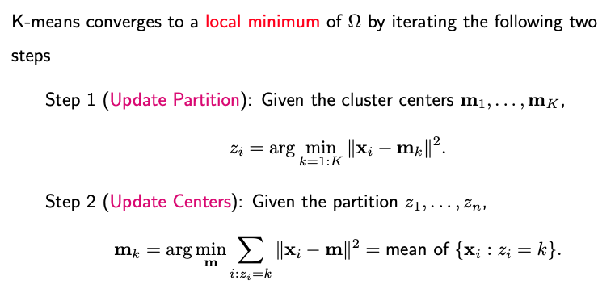
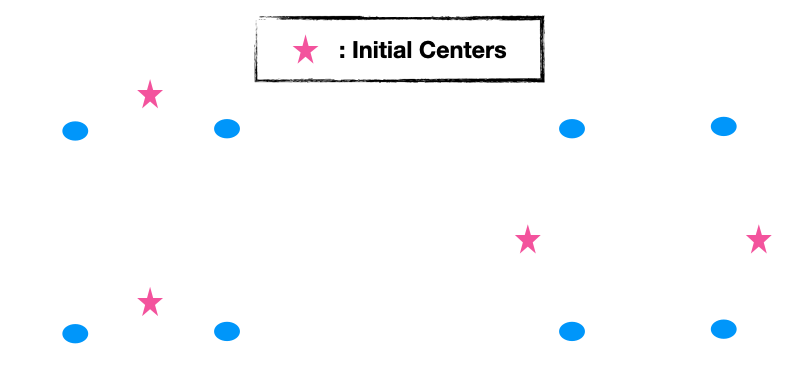
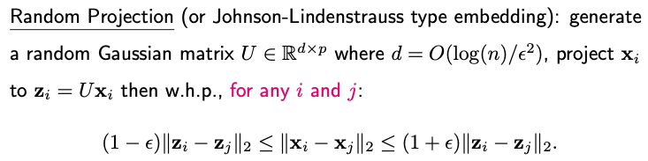

# 6.2. K-means and K-medoids

## 6.2.1. The K-means Algorithm

K-means is arguably the most widely-used clustering algorithm. It necessitates two primary inputs:

- **X**: A data matrix of size n-by-p;
- **K**: the number of desired clusters.

### Algorithm Procedure

- **Step 0 (Initialization)**: Make an initial estimate of the K cluster centers.
- **Step 1 (Partition)**: For each data point, identify the nearest cluster center and assign the data point to that specific cluster.
- **Step 2 (Update)**: Once all data points have been assigned to their respective clusters, update each cluster center by calculating the mean of the data points within that cluster.

Repeat Steps 1 and 2 until convergence is achieved.

### Objective Function

The primary goal of the K-means algorithm is to optimize a specific objective function, often termed the 'within-cluster dissimilarity measure'. By default, this measure is the squared Euclidean distance. The function is formulated as:

$$\Omega (z_{1:n}, m_{1:K}) = \sum_{i=1}^n  \| x_i - m_{z_i} \|^2$$

where $z_1, \dots, z_n \in \{1, 2, \dots, K\}$ are the class labels for the n data points and $m_1, \dots, m_K$ are the p-dimensional centers for the K clusters.

The within-cluster sum of squares can also be represented with a double summation over clusters and observations.

$$\Omega (z_{1:n}, m_{1:K}) = \sum_{k=1}^K \sum_{i: z_i=k} \| x_i - m_k \|^2$$

K-means aims to find a local minimum of this objective function by iterating the aforementioned steps. For a given set of cluster centers, the optimal label for a data point is the one corresponding to the nearest center. Once a partition is decided, the cluster centers are updated by computing the mean of the data points in each cluster.

### A Note on Convergence

It's essential to understand that K-means may converge to a local minimum, meaning it might not always find the optimal clustering. The algorithm's effectiveness can be sensitive to the initial placement of cluster centers. To address this, run the algorithm with multiple starting values or initializations, and then choose the clustering solution with the lowest within-cluster sum of squares.

For instance, in a two-dimensional case with four points, choosing the initial cluster centers in specific locations can lead to a local minimum that isn't the optimal clustering for the data.

## 6.2.2. Dimension Reduction

The computational cost of K-means is determined by four factors:

- **I**: Number of iterations
- **n**: Number of data points
- **p**: Number of features
- **K**: Number of clusters

Each iteration's computational cost is n×p×K, as distances for all n points to all K centers across p dimensions must be assessed.

To alleviate the computational demand, especially when p (dimensionality) is significant, dimension reduction methods can be employed.

- **Principal Component Analysis (PCA)**: PCA can reduce the original dimensionality p to a smaller dimension d by using the top d principal component directions. These directions best approximate the pairwise distances on average. However, this is an average guarantee, and for some specific pairs, the approximation may not be optimal.

- **Random Projection**: This method involves projecting data to a lower-dimensional space using a random matrix. Based on the Johnson-Lindenstrauss lemma, which suggests that high-dimensional data can be projected into a much lower-dimensional space in such a way that distances between the data points are approximately preserved.

An advantage is that the projection matrix is data-agnostic, constructed without using any data insights. It's also less sensitive to the original dimension p. However, it might not capture data-specific patterns like PCA does.

Both PCA and Random Projection are popular methods for dimensionality reduction, and they can significantly reduce the computational burden of K-means, especially when dealing with high-dimensional data.

## 6.2.3. Other Distance Measures

When venturing beyond the standard K-means approach, it's natural to wonder if we can use alternative distance measures. The answer is yes, but the implementation needs modification, particularly in the step updating the centers.

If you replace the squared Euclidean distance in K-means with a more generic distance measure, the objective function's definition changes. The arguments remain the same: the cluster labels for n observations, $z_1$ to $z_n$, and the K centers, $m_1$ to $m_K$.

$$\Omega (z_{1:n}, m_{1:K}) =  \sum_{k=1}^K \sum_{i: z_i=k} d(x_i,  m_k)$$

To minimize this new objective function, two iterative steps follow post-initialization:

1. **Assignment of Observations to Clusters**: Given the cluster centers, each observation is associated with the nearest cluster. This decision is based on the chosen distance measure, which should be explicitly defined.

2. **Updating Cluster Centers**: Here, each cluster's center is recalculated to minimize the within-cluster dissimilarity. With squared Euclidean distance, this step is straightforward: each new center is the mean of all observations in its cluster. With a generic distance measure, however, this optimization is less direct and can vary depending on the specific measure in use.

Consider an illustrative example with two features: $x = (x_1, x_2)$ where $x_1$ is a numerical attribute, and $x_2$ is a categorical attribute with values A, B, or C. If our distance measure combines the L1 distance for the numerical feature and the Hamming distance for the categorical feature, the center update process varies for each feature. For $x_1$, the optimal center is the median of the observations. For $x_2$, the center is the mode, or most frequent category, of the observations.

$$d(x, y) = (0.4) \cdot |x_1 - y_1| + (0.6) \cdot \mathbf{I}(x_2 \ne  y_2).$$

When the features are more complex, like if $x_2$ is a string and we use the edit distance, the optimization becomes challenging. For many non-Euclidean distance measures, optimization requires assessing all potential center values—a computationally intensive process.

One way to mitigate computational demands is to restrict cluster centers to existing data points. This not only simplifies the calculation but also eliminates the need for the original data, as only the pairwise distance matrix remains relevant. This approach leads us to an extended version of K-means known as K-medoids.

## 6.2.4. The K-medoids Algorithm

K-medoids operates on principles akin to k-means but with a crucial distinction in its input requirements. Rather than using the original data matrix, X, K-medoids needs only a d-by-d distance matrix and the desired number of clusters, K.

Given that only the pairwise distances among data points are known, without access to the actual distance function, it becomes impossible to compute distances for newly generated points. In K-means, while we start with n data points, we also generate new data points - the K centers. K-medoids, however, cannot follow this approach due to its input constraints.

This limitation leads us to a defining characteristic of K-medoids: the cluster centers must belong to the set of actual data points. Specifically, for any given partition, the cluster center (or "medoid") is identified as the data point whose cumulative distance to all other points within the same cluster is minimized.

The prevalent algorithm to implement K-medoids is called **PAM** (Partitioning Around Medoids). The objective function for PAM mirrors what was earlier described, with distances directly sourced from the pairwise distance matrix. This is because both the sample data and the centers are drawn from the original n data points.

The main steps of the PAM algorithm are:

1. **Initialization**: Randomly select K data points as the initial cluster centers.

2. **Cluster Assignment**: Given the current cluster centers, or medoids, data points are assigned to their nearest cluster.

3. **Medoid Update**: For each medoid m and non-medoid data point x:
   - Swap m and x, and compute the total cost of the configuration (i.e., the sum of the distances of points to their nearest medoids).
   - If the total cost of the new configuration is lower than the current one, update it to have x as the new medoid.
   - Repeat this process until there's no change in medoids.

The algorithm stops when there's no change in medoids after a full iteration.

Like K-means, the final result can depend on the initial choice of medoids, so multiple runs with different initializations may be necessary.