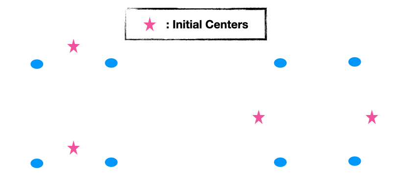

# 6.2. K-means and K-medoids

## 6.2.1. Introduction to K-means Clustering

K-means is one of the most popular and widely-used clustering algorithms in machine learning and data science. It belongs to the family of **partitioning clustering algorithms** that divide a dataset into K non-overlapping clusters, where each data point belongs to exactly one cluster.

### Problem Formulation

Given a dataset $`X = \{x_1, x_2, \ldots, x_n\}`$ where each $`x_i \in \mathbb{R}^p`$ is a p-dimensional vector, the goal is to partition the data into K clusters $`C_1, C_2, \ldots, C_K`$ such that:

1. $`C_i \cap C_j = \emptyset`$ for $`i \neq j`$ (clusters are disjoint)
2. $`\bigcup_{i=1}^K C_i = X`$ (all points are assigned to clusters)
3. Points within the same cluster are similar to each other
4. Points in different clusters are dissimilar

### Mathematical Foundation

The K-means algorithm aims to minimize the **within-cluster sum of squares (WCSS)** or **inertia**:

```math
\Omega(z_{1:n}, m_{1:K}) = \sum_{i=1}^n \|x_i - m_{z_i}\|^2
```

where:
- $`z_i \in \{1, 2, \ldots, K\}`$ is the cluster assignment for data point $`x_i`$
- $`m_k \in \mathbb{R}^p`$ is the centroid (center) of cluster $`k`$
- $`\| \cdot \|`$ denotes the Euclidean norm

This can be rewritten as a double summation over clusters and observations:

```math
\Omega(z_{1:n}, m_{1:K}) = \sum_{k=1}^K \sum_{i: z_i=k} \|x_i - m_k\|^2
```

### Geometric Interpretation

The objective function measures the total squared Euclidean distance from each data point to its assigned cluster centroid. Minimizing this function is equivalent to finding the optimal partition that minimizes the total "spread" within clusters.

## 6.2.2. The K-means Algorithm

### Algorithm Overview

K-means is an **iterative optimization algorithm** that alternates between two steps:

1. **Assignment Step**: Assign each data point to the nearest centroid
2. **Update Step**: Recompute centroids as the mean of all points in each cluster

### Detailed Algorithm Steps

#### Step 0: Initialization
Choose K initial cluster centroids $`m_1^{(0)}, m_2^{(0)}, \ldots, m_K^{(0)}`$. Common initialization strategies include:

- **Random initialization**: Randomly select K data points as initial centroids
- **K-means++**: Probabilistic initialization that spreads initial centroids
- **Forgy method**: Randomly assign points to clusters and compute centroids

#### Step 1: Assignment (E-step)
For each data point $`x_i`$, assign it to the cluster with the nearest centroid:

```math
z_i^{(t+1)} = \arg\min_{k \in \{1,\ldots,K\}} \|x_i - m_k^{(t)}\|^2
```

This step minimizes the objective function with respect to cluster assignments while keeping centroids fixed.

#### Step 2: Update (M-step)
For each cluster $`k`$, update the centroid as the mean of all points assigned to that cluster:

```math
m_k^{(t+1)} = \frac{1}{|C_k^{(t+1)}|} \sum_{i: z_i^{(t+1)} = k} x_i
```

where $`C_k^{(t+1)} = \{x_i : z_i^{(t+1)} = k\}`$ is the set of points assigned to cluster $`k`$ at iteration $`t+1`$.

#### Convergence
Repeat Steps 1 and 2 until convergence, which occurs when:
- No data points change cluster assignments, OR
- Centroids stop moving significantly, OR
- Maximum number of iterations is reached

### Convergence Properties

**Theorem**: The K-means algorithm converges to a local minimum of the objective function.

**Proof Sketch**:
1. The assignment step can only decrease or maintain the objective function value
2. The update step (computing means) minimizes the objective function for fixed assignments
3. Since the objective function is bounded below by 0, the algorithm must converge

**Important Note**: K-means converges to a **local minimum**, not necessarily the global minimum. The final clustering depends heavily on the initial centroid positions.

### Computational Complexity

- **Time Complexity**: $`O(I \cdot n \cdot K \cdot p)`$ where:
  - $`I`$ = number of iterations
  - $`n`$ = number of data points
  - $`K`$ = number of clusters
  - $`p`$ = number of features
- **Space Complexity**: $`O(n \cdot p + K \cdot p)`$

## 6.2.3. Initialization Strategies

### Random Initialization

**Implementation:** See `random_init()` function in [kmeans_implementation.py](code/kmeans_implementation.py)

Random initialization selects K data points uniformly at random as initial centroids. While simple, this method can lead to poor initializations and suboptimal convergence.

### K-means++ Initialization

**Implementation:** See `kmeans_plus_plus_init()` function in [kmeans_implementation.py](code/kmeans_implementation.py)

K-means++ improves upon random initialization by spreading initial centroids:

1. Choose first centroid uniformly at random
2. For each subsequent centroid:
   - Compute distances from each point to nearest existing centroid
   - Choose next centroid with probability proportional to squared distance

This method significantly reduces the probability of poor initialization and improves convergence to better local minima.

## 6.2.4. Local Minima and Multiple Initializations

### The Local Minimum Problem

K-means can converge to suboptimal solutions due to poor initialization. Consider this example:

**Scenario**: 4 points in 2D space forming a rectangle
- Points: (0,0), (0,1), (2,0), (2,1)
- Desired: 2 clusters with points (0,0), (0,1) and (2,0), (2,1)
- Poor initialization: centroids at (0,0) and (0,1) → suboptimal clustering



*Figure: Example of k-means converging to a local minimum, demonstrating the importance of initialization.*

### Solution: Multiple Initializations

**Implementation:** See `kmeans_multiple_runs()` function in [kmeans_implementation.py](code/kmeans_implementation.py)

Run K-means multiple times with different initializations and choose the best result. This approach significantly improves the chances of finding a good local minimum by exploring multiple starting points.

## 6.2.5. Dimension Reduction for K-means

### Computational Challenges

The computational cost of K-means scales with the number of features $`p`$. For high-dimensional data, this can be prohibitive. Dimension reduction techniques can help:

### Principal Component Analysis (PCA)

PCA reduces dimensionality while preserving variance:

```math
X_{\text{reduced}} = X \cdot W
```

where $`W \in \mathbb{R}^{p \times d}`$ contains the top $`d`$ principal components.

**Properties**:
- Preserves pairwise distances on average
- Captures data-specific patterns
- Computationally efficient

### Random Projection

Based on the Johnson-Lindenstrauss lemma, random projection preserves distances approximately:

```math
X_{\text{reduced}} = X \cdot R
```

where $`R \in \mathbb{R}^{p \times d}`$ is a random matrix with entries from $`N(0, 1/d)`$.

**Properties**:
- Data-agnostic projection matrix
- Less sensitive to original dimension
- May not capture data-specific patterns as well as PCA

### Implementation

```python
def kmeans_with_dimension_reduction(X, K, method='pca', d=None):
    """K-means with dimension reduction preprocessing."""
    if d is None:
        d = min(K + 1, X.shape[1])  # Rule of thumb
    
    if method == 'pca':
        from sklearn.decomposition import PCA
        reducer = PCA(n_components=d)
    elif method == 'random':
        from sklearn.random_projection import GaussianRandomProjection
        reducer = GaussianRandomProjection(n_components=d)
    else:
        raise ValueError(f"Unknown method: {method}")
    
    # Reduce dimensions
    X_reduced = reducer.fit_transform(X)
    
    # Run K-means on reduced data
    labels, centroids_reduced, inertia = kmeans_multiple_runs(X_reduced, K)
    
    # Transform centroids back to original space
    centroids = reducer.inverse_transform(centroids_reduced)
    
    return labels, centroids, inertia, reducer
```

## 6.2.6. Alternative Distance Measures

### Beyond Euclidean Distance

K-means can be generalized to use other distance measures, but this requires modifications to the update step.

### Generalized Objective Function

```math
\Omega(z_{1:n}, m_{1:K}) = \sum_{k=1}^K \sum_{i: z_i=k} d(x_i, m_k)
```

where $`d(\cdot, \cdot)`$ is a general distance measure.

### Challenges with Non-Euclidean Distances

1. **Assignment Step**: Still straightforward - assign to nearest centroid
2. **Update Step**: Computing the "mean" becomes non-trivial

### Examples of Alternative Distance Measures

#### Manhattan Distance (L1)
For Manhattan distance, the optimal centroid is the **median** of cluster points:

```python
def manhattan_centroid(X_cluster):
    """Compute centroid for Manhattan distance (median)."""
    return np.median(X_cluster, axis=0)
```

#### Cosine Distance
For cosine distance, the optimal centroid is the **normalized mean**:

```python
def cosine_centroid(X_cluster):
    """Compute centroid for cosine distance."""
    mean_vec = np.mean(X_cluster, axis=0)
    norm = np.linalg.norm(mean_vec)
    return mean_vec / norm if norm > 0 else mean_vec
```

#### Mixed Distance Measures
For data with mixed types (numerical + categorical):

```python
def mixed_distance(x, y, weights=[0.4, 0.6]):
    """Mixed distance: L1 for numerical, Hamming for categorical."""
    numerical_dist = np.sum(np.abs(x[:2] - y[:2]))  # First 2 features
    categorical_dist = np.sum(x[2:] != y[2:])       # Remaining features
    return weights[0] * numerical_dist + weights[1] * categorical_dist

def mixed_centroid(X_cluster):
    """Compute centroid for mixed distance measure."""
    # Numerical features: median
    numerical_centroid = np.median(X_cluster[:, :2], axis=0)
    
    # Categorical features: mode
    categorical_centroid = []
    for j in range(2, X_cluster.shape[1]):
        values, counts = np.unique(X_cluster[:, j], return_counts=True)
        mode_idx = np.argmax(counts)
        categorical_centroid.append(values[mode_idx])
    
    return np.concatenate([numerical_centroid, categorical_centroid])
```

## 6.2.7. The K-medoids Algorithm

### Motivation

When using non-Euclidean distances, computing centroids can be computationally expensive or even impossible. K-medoids addresses this by restricting cluster centers to actual data points.

### Problem Formulation

Given a distance matrix $`D \in \mathbb{R}^{n \times n}`$ and number of clusters $`K`$, find:
- Cluster assignments $`z_1, z_2, \ldots, z_n`$
- Medoids (cluster centers) $`m_1, m_2, \ldots, m_K`$ where each $`m_k`$ is a data point

### Objective Function

```math
\Omega(z_{1:n}, m_{1:K}) = \sum_{k=1}^K \sum_{i: z_i=k} D_{i, m_k}
```

where $`D_{i, m_k}`$ is the distance between data point $`i`$ and medoid $`m_k`$.

### PAM (Partitioning Around Medoids) Algorithm

#### Step 1: Initialization
Randomly select K data points as initial medoids.

#### Step 2: Assignment
Assign each data point to the nearest medoid:

```math
z_i = \arg\min_{k \in \{1,\ldots,K\}} D_{i, m_k}
```

#### Step 3: Update (Swap Phase)
For each medoid $`m_k`$ and non-medoid point $`x_i`$:
1. Temporarily swap $`m_k`$ and $`x_i``
2. Compute total cost of new configuration
3. If cost decreases, make the swap permanent

```python
def pam_swap_phase(D, labels, medoids):
    """PAM swap phase: try swapping medoids with non-medoids."""
    n, K = D.shape[0], len(medoids)
    improved = True
    
    while improved:
        improved = False
        
        for k in range(K):
            current_medoid = medoids[k]
            
            # Try swapping with each non-medoid point
            for i in range(n):
                if i in medoids:
                    continue
                
                # Temporarily swap
                temp_medoids = medoids.copy()
                temp_medoids[k] = i
                
                # Compute new assignments and cost
                temp_labels = np.argmin(D[:, temp_medoids], axis=1)
                temp_cost = sum(D[j, temp_medoids[temp_labels[j]]] 
                               for j in range(n))
                
                # Current cost
                current_cost = sum(D[j, medoids[labels[j]]] 
                                  for j in range(n))
                
                # If improvement, make swap permanent
                if temp_cost < current_cost:
                    medoids = temp_medoids
                    labels = temp_labels
                    improved = True
                    break
    
    return labels, medoids
```

### Computational Complexity

- **Time Complexity**: $`O(I \cdot K \cdot (n-K) \cdot n)`$ where $`I`$ is number of iterations
- **Space Complexity**: $`O(n^2)`$ for storing distance matrix

### Advantages and Disadvantages

**Advantages**:
- Works with any distance measure
- More robust to outliers than K-means
- Medoids are actual data points (interpretable)

**Disadvantages**:
- Computationally more expensive than K-means
- Requires precomputed distance matrix
- May not scale well to large datasets

## 6.2.8. Python Implementation

**Complete Implementation:** [kmeans_implementation.py](code/kmeans_implementation.py)

The Python implementation includes:

- **KMeansClustering Class**: Comprehensive implementation with K-means++ initialization, multiple runs, and evaluation metrics
- **KMedoidsClustering Class**: Complete PAM algorithm implementation for K-medoids clustering
- **Initialization Strategies**: Random initialization and K-means++ initialization with probabilistic centroid selection
- **Multiple Runs**: Automatic multiple initialization runs to find the best clustering solution
- **Evaluation Metrics**: Inertia, silhouette score, iteration count, and cluster size analysis
- **Visualization Tools**: Cluster plotting with centroids/medoids and color-coded assignments
- **Dimension Reduction**: Integration with PCA and random projection for high-dimensional data
- **Alternative Distance Measures**: Support for Manhattan, cosine, and mixed distance measures
- **Comprehensive Demonstrations**: Examples with synthetic data, initialization comparison, and dimension reduction analysis

Key features:
- K-means++ initialization for better convergence
- Multiple initialization runs to avoid local minima
- Complete PAM algorithm for K-medoids
- Integration with sklearn for validation
- Comprehensive evaluation and visualization tools
- Support for various distance measures and dimension reduction techniques
- Robust error handling and convergence checking

## 6.2.9. R Implementation

**Complete Implementation:** [r_kmeans_implementation.R](code/r_kmeans_implementation.R)

The R implementation includes:

- **KMeansClustering Class**: Comprehensive implementation using R's reference class system with K-means++ initialization and multiple runs
- **KMedoidsClustering Class**: Complete PAM algorithm implementation for K-medoids clustering
- **Initialization Strategies**: Random initialization and K-means++ initialization with probabilistic centroid selection
- **Multiple Runs**: Automatic multiple initialization runs to find the best clustering solution
- **Evaluation Metrics**: Inertia, silhouette score, iteration count, and cluster size analysis
- **ggplot2 Visualizations**: Publication-quality cluster plotting with centroids/medoids and color-coded assignments
- **Dimension Reduction**: Integration with PCA and random projection for high-dimensional data
- **Alternative Distance Measures**: Support for Manhattan, cosine, and mixed distance measures
- **Built-in Function Comparison**: Validation against R's native kmeans function
- **Comprehensive Demonstrations**: Examples with synthetic data, initialization comparison, and dimension reduction analysis

Key features:
- K-means++ initialization for better convergence
- Multiple initialization runs to avoid local minima
- Complete PAM algorithm for K-medoids
- Integration with R's built-in functions for validation
- ggplot2-based visualizations for publication-quality plots
- Support for various distance measures and dimension reduction techniques
- Robust error handling and convergence checking
- Comprehensive utility functions for initialization and evaluation

## 6.2.10. Summary and Best Practices

### Key Takeaways

1. **K-means is a local optimization algorithm** that converges to local minima
2. **Initialization matters** - use K-means++ for better results
3. **Multiple runs are essential** to find good solutions
4. **K-medoids is more robust** but computationally expensive
5. **Dimension reduction** can significantly improve performance

### Algorithm Selection Guidelines

**Use K-means when:**
- Data is numerical and Euclidean distance is appropriate
- Computational efficiency is important
- Data is well-separated and roughly spherical

**Use K-medoids when:**
- Working with non-Euclidean distances
- Robustness to outliers is important
- Interpretable cluster centers are needed

### Common Pitfalls

1. **Poor initialization**: Can lead to suboptimal local minima
2. **Wrong number of clusters**: Use elbow method or silhouette analysis
3. **Non-spherical clusters**: K-means assumes spherical clusters
4. **Scale sensitivity**: Standardize features before clustering
5. **Outliers**: Can significantly affect centroid positions

### Advanced Topics

- **Kernel K-means**: Extend to non-linear cluster boundaries
- **Fuzzy K-means**: Allow soft cluster assignments
- **Hierarchical K-means**: Combine with hierarchical clustering
- **Online K-means**: Process data in streaming fashion
- **Spectral clustering**: Use eigenvectors for clustering