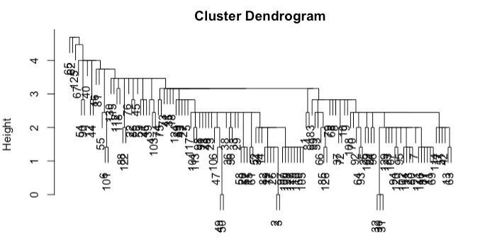
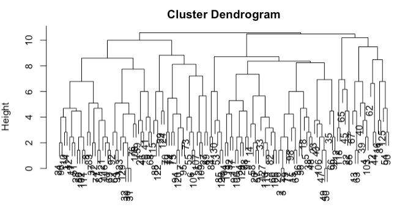

# 6.4. Hierarchical Clustering

## 6.4.1. Introduction to Hierarchical Clustering

Hierarchical clustering is a fundamental clustering approach that builds a **hierarchy of clusters** without requiring the user to specify the number of clusters $`K`$ in advance. Unlike K-means, which produces a flat partition of the data, hierarchical clustering creates a **tree-like structure** (dendrogram) that shows the relationships between clusters at different levels of granularity.

### Problem Formulation

Given a dataset $`X = \{x_1, x_2, \ldots, x_n\}`$ where each $`x_i \in \mathbb{R}^p`$, and a distance matrix $`D \in \mathbb{R}^{n \times n}`$ where $`D_{ij} = d(x_i, x_j)`$, hierarchical clustering aims to:

1. Build a hierarchy of nested clusters
2. Provide a dendrogram visualization
3. Allow cluster extraction at any desired level

### Key Advantages

- **No predefined K**: Unlike K-means, no need to specify number of clusters upfront
- **Hierarchical structure**: Natural representation of data relationships
- **Flexible distance measures**: Can use any distance metric
- **Visual interpretation**: Dendrogram provides intuitive cluster visualization
- **Nested clusters**: Clusters at level $`K`$ are always refinements of clusters at level $`K-1`$

## 6.4.2. Types of Hierarchical Clustering

### Agglomerative (Bottom-Up) Clustering

**Most common approach**: Start with each observation as its own cluster and iteratively merge the closest pairs.

**Algorithm**:
1. Initialize: $`n`$ clusters, each containing one observation
2. Iterate: Merge the two closest clusters
3. Terminate: When all observations are in one cluster

### Divisive (Top-Down) Clustering

**Less common**: Start with all observations in one cluster and recursively split.

**Algorithm**:
1. Initialize: One cluster containing all observations
2. Iterate: Split the cluster that maximizes some criterion
3. Terminate: When each observation is its own cluster

## 6.4.3. Linkage Criteria

The choice of **linkage criterion** determines how to measure distance between clusters and significantly affects the resulting cluster structure.

### Single Linkage (Nearest Neighbor)

Distance between clusters $`A`$ and $`B`$ is the minimum distance between any point in $`A`$ and any point in $`B`$:

```math
d_{\text{single}}(A, B) = \min_{x \in A, y \in B} d(x, y)
```

**Properties**:
- Tends to produce "chaining" - long, stringy clusters
- Sensitive to noise and outliers
- Can handle non-elliptical cluster shapes
- Computationally efficient

**Example**: If cluster A contains points (1,1) and (1,2), and cluster B contains (5,1), then $`d_{\text{single}}(A, B) = \min\{d((1,1), (5,1)), d((1,2), (5,1))\} = \min\{4, \sqrt{17}\} = 4`$



*Figure: Example of single linkage clustering, which tends to produce long, chain-like clusters.*

### Complete Linkage (Farthest Neighbor)

Distance is the maximum distance between any point in $`A`$ and any point in $`B`$:

```math
d_{\text{complete}}(A, B) = \max_{x \in A, y \in B} d(x, y)
```

**Properties**:
- Tends to produce compact, spherical clusters
- More robust to noise than single linkage
- Can break large clusters
- Computationally efficient

**Example**: Using the same clusters as above, $`d_{\text{complete}}(A, B) = \max\{4, \sqrt{17}\} = \sqrt{17}`$



*Figure: Example of complete linkage clustering, which tends to produce compact, spherical clusters.*

### Average Linkage (UPGMA - Unweighted Pair Group Method with Arithmetic Mean)

Distance is the average of all pairwise distances:

```math
d_{\text{average}}(A, B) = \frac{1}{|A||B|} \sum_{x \in A} \sum_{y \in B} d(x, y)
```

**Properties**:
- Balances single and complete linkage
- Less sensitive to outliers than single linkage
- More flexible cluster shapes than complete linkage
- Computationally efficient

### Ward's Linkage

Minimizes the increase in total within-cluster variance. The distance between clusters $`A`$ and $`B`$ is:

```math
d_{\text{ward}}(A, B) = \frac{|A||B|}{|A| + |B|} \|m_A - m_B\|^2
```

where $`m_A`$ and $`m_B`$ are the centroids of clusters $`A`$ and $`B`$.

**Properties**:
- Tends to produce clusters of similar sizes
- Minimizes within-cluster variance
- Sensitive to outliers
- Computationally efficient

### Weighted Average Linkage (WPGMA)

Similar to average linkage but gives equal weight to each cluster regardless of size:

```math
d_{\text{weighted}}(A, B) = \frac{1}{2} \left( \frac{1}{|A|} \sum_{x \in A} d(x, m_B) + \frac{1}{|B|} \sum_{y \in B} d(y, m_A) \right)
```

## 6.4.4. The Agglomerative Algorithm in Detail

### Algorithm Steps

**Input**: Distance matrix $`D \in \mathbb{R}^{n \times n}`$, linkage method

**Output**: Linkage matrix $`Z \in \mathbb{R}^{(n-1) \times 4}`$

**Algorithm**:

1. **Initialization**:
   - Set $`C_i = \{x_i\}`$ for $`i = 1, 2, \ldots, n`$ (each point is its own cluster)
   - Set $`\mathcal{C} = \{C_1, C_2, \ldots, C_n\}`$ (set of all clusters)

2. **Iterative Merging**:
   For $`t = 1, 2, \ldots, n-1`$:
   - Find clusters $`C_i, C_j \in \mathcal{C}`$ that minimize $`d(C_i, C_j)`$ according to the chosen linkage method
   - Merge $`C_i`$ and $`C_j`$ into new cluster $`C_{n+t} = C_i \cup C_j`$
   - Update $`\mathcal{C} = \mathcal{C} \setminus \{C_i, C_j\} \cup \{C_{n+t}\}`$
   - Store merge information in $`Z[t, :] = [i, j, d(C_i, C_j), |C_{n+t}|]`$

3. **Termination**: When $`|\mathcal{C}| = 1`$

### Linkage Matrix Structure

The linkage matrix $`Z`$ has $`n-1`$ rows and 4 columns:
- $`Z[i, 0]`$: Index of first cluster merged at step $`i`$
- $`Z[i, 1]`$: Index of second cluster merged at step $`i`$
- $`Z[i, 2]`$: Distance between the merged clusters
- $`Z[i, 3]`$: Number of observations in the new cluster

## 6.4.5. Dendrograms and Visualization

### Dendrogram Structure

A **dendrogram** is a tree diagram that visualizes the hierarchical clustering process:

- **Leaves**: Individual observations (bottom of tree)
- **Internal nodes**: Merges of clusters
- **Height**: Distance at which clusters are merged
- **Branches**: Connections between clusters

### Mathematical Properties

**Monotonicity**: The height (distance) at which clusters are merged never decreases as you move up the dendrogram:

```math
Z[i, 2] \leq Z[i+1, 2] \quad \text{for all } i
```

**Nestedness**: The set of clusters at each level is a refinement of the set at the previous level.

### Cluster Extraction

To extract $`K`$ clusters from the dendrogram:

1. **Height-based cutting**: Cut at a specific height $`h`$
2. **Number-based cutting**: Cut to get exactly $`K`$ clusters

**Mathematical formulation**: For height-based cutting, cluster $`C`$ contains all observations $`x_i`$ such that the path from $`x_i`$ to the root has maximum height $`\leq h`$.

## 6.4.6. Computational Complexity

### Time Complexity

- **Single/Complete/Average linkage**: $`O(n^2 \log n)`$ with efficient implementations
- **Ward's linkage**: $`O(n^2 \log n)`$
- **Naive implementation**: $`O(n^3)`$

### Space Complexity

- **Distance matrix**: $`O(n^2)`$
- **Linkage matrix**: $`O(n)`$
- **Total**: $`O(n^2)`$

### Optimizations

1. **Nearest neighbor chains**: Reduces time complexity for single linkage
2. **Sparse distance matrices**: For high-dimensional data
3. **Approximate methods**: For very large datasets

## 6.4.7. Comparison of Linkage Methods

### Visual Comparison

**Single Linkage**: Produces "chaining" - long, stringy clusters that can connect distant points through intermediate points.

**Complete Linkage**: Produces compact, spherical clusters that are more robust to noise.

**Average Linkage**: Balances the extremes, producing clusters of moderate compactness.

**Ward's Linkage**: Produces clusters of similar sizes, minimizing within-cluster variance.

### Mathematical Comparison

For clusters $`A`$ and $`B`$ with centroids $`m_A`$ and $`m_B`$:

```math
d_{\text{single}}(A, B) \leq d_{\text{average}}(A, B) \leq d_{\text{complete}}(A, B)
```

Ward's linkage is not directly comparable as it uses a different distance measure.

## 6.4.8. Python Implementation

**Implementation:** See `HierarchicalClustering` class and demonstration functions in [hierarchical_clustering_implementation.py](code/hierarchical_clustering_implementation.py)

The implementation includes:
- **HierarchicalClustering class**: Complete hierarchical clustering implementation with various linkage methods
- **Dendrogram visualization**: Publication-quality dendrogram plots with customizable parameters
- **Cluster extraction**: Methods to extract clusters by number or height
- **Linkage comparison**: Comprehensive comparison of different linkage methods with cophenetic correlation and silhouette analysis
- **Demonstration functions**: Complete examples with synthetic data and real-world application scenarios

## 6.4.9. R Implementation

**Implementation:** See `HierarchicalClustering` reference class and demonstration functions in [r_hierarchical_clustering_implementation.R](code/r_hierarchical_clustering_implementation.R)

The implementation includes:
- **HierarchicalClustering reference class**: Complete hierarchical clustering implementation with various linkage methods using R's object-oriented programming
- **Dendrogram visualization**: Publication-quality dendrogram plots with customizable parameters
- **Cluster extraction**: Methods to extract clusters by number or height using R's native functions
- **Linkage comparison**: Comprehensive comparison of different linkage methods with cophenetic correlation and silhouette analysis
- **Demonstration functions**: Complete examples with synthetic data and real-world application scenarios using ggplot2 for visualization

## 6.4.10. Summary and Best Practices

### Key Takeaways

1. **Hierarchical clustering builds a tree structure** without requiring predefined K
2. **Linkage method choice is crucial** - affects cluster shape and quality
3. **Dendrograms provide visual insight** into data structure
4. **Computational cost scales quadratically** with dataset size
5. **Nested structure** allows flexible cluster extraction

### Linkage Method Selection

**Use Single Linkage when:**
- Clusters have irregular shapes
- You want to detect chaining patterns
- Computational efficiency is important

**Use Complete Linkage when:**
- You want compact, spherical clusters
- Data is noisy or has outliers
- You prefer more balanced cluster sizes

**Use Average Linkage when:**
- You want a balanced approach
- Clusters have moderate compactness
- You're unsure about cluster shapes

**Use Ward's Linkage when:**
- You want clusters of similar sizes
- Minimizing within-cluster variance is important
- Data is relatively clean

### Common Pitfalls

1. **Chaining in single linkage**: Can connect distant points through intermediate points
2. **Computational complexity**: May not scale to very large datasets
3. **Sensitivity to noise**: Outliers can affect cluster structure
4. **Irreversible merges**: Once clusters are merged, they cannot be split

### Advanced Topics

- **Dynamic time warping**: For time series data
- **Fast hierarchical clustering**: Approximate methods for large datasets
- **Consensus clustering**: Combining multiple hierarchical clusterings
- **Bootstrap hierarchical clustering**: Assessing cluster stability

## Code Files Summary

The following code files contain the complete implementations for hierarchical clustering:

### Python Files
- **[hierarchical_clustering_implementation.py](code/hierarchical_clustering_implementation.py)**: Main implementation with HierarchicalClustering class, dendrogram visualization, and comprehensive analysis tools

### R Files
- **[r_hierarchical_clustering_implementation.R](code/r_hierarchical_clustering_implementation.R)**: Complete R implementation with HierarchicalClustering reference class and ggplot2 visualizations

### Key Features Implemented
- **HierarchicalClustering Class**: Complete implementation with various linkage methods (single, complete, average, ward)
- **Dendrogram Visualization**: Publication-quality dendrogram plots with customizable parameters and cut lines
- **Cluster Extraction**: Methods to extract clusters by number or height with comprehensive statistics
- **Linkage Comparison**: Systematic comparison of different linkage methods with cophenetic correlation and silhouette analysis
- **Cophenetic Correlation**: Assessment of clustering quality and dendrogram distortion
- **Silhouette Analysis**: Evaluation of cluster cohesion and separation for different K values
- **Visualization Tools**: Multi-panel plots for data, dendrograms, and cluster assignments using matplotlib/seaborn and ggplot2
- **Method Analysis**: Comprehensive analysis of linkage methods on different data types (well-separated, overlapping, chain-like)
- **Cluster Extraction Demonstration**: Multiple approaches to extracting clusters from hierarchical structures
- **Robust Implementation**: Error handling, reproducibility controls, and comprehensive documentation
- **Demonstration Functions**: Complete examples with synthetic data and real-world application scenarios
