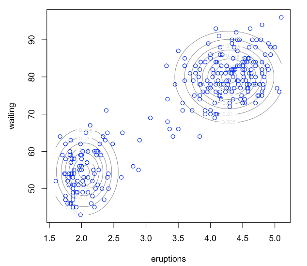
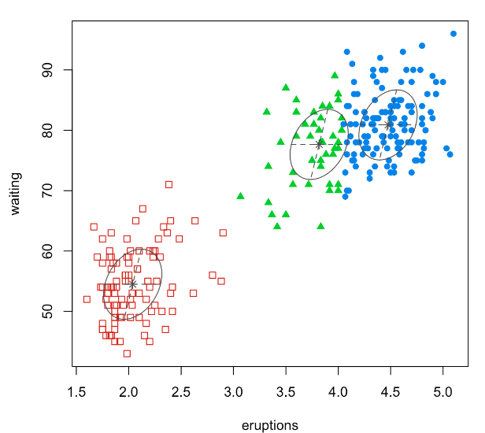

# 7.1. Model-based Clustering

## 7.1.1. Introduction to Model-based Clustering

Model-based clustering is a principled approach to clustering that frames the problem as **mixture model estimation**. Unlike distance-based methods (K-means, hierarchical clustering), model-based clustering assumes that the data is generated from a mixture of probability distributions, where each cluster corresponds to a component of the mixture.

**Intuitive Understanding**: Model-based clustering is like being a detective who discovers that a restaurant's menu is actually a mix of recipes from different chefs. Instead of just grouping dishes by how similar they look on the plate, you try to understand the underlying "cooking styles" that generated the dishes. Each chef has their own signature style (like using certain spices, cooking techniques, or ingredient preferences), and the restaurant's menu is a mixture of these different styles. By understanding each chef's style, you can not only group the dishes but also understand why they belong together and predict what new dishes from each chef might look like.

### Problem Formulation

Given a dataset $`X = \{x_1, x_2, \ldots, x_n\}`$ where each $`x_i \in \mathbb{R}^p`$, we assume the data is generated from a **finite mixture model**:

$$ f(x) = \sum_{k=1}^K \pi_k f_k(x; \theta_k) $$

where:
- $`K`$ is the number of mixture components (clusters) - like the number of different chefs
- $`\pi_k`$ is the mixing weight for component $`k`$ ($`\pi_k \geq 0`$ and $`\sum_{k=1}^K \pi_k = 1`$) - like the proportion of dishes from each chef
- $`f_k(x; \theta_k)`$ is the probability density function of component $`k`$ with parameters $`\theta_k`$ - like the "signature style" of each chef
- $`\theta = \{\pi_1, \ldots, \pi_K, \theta_1, \ldots, \theta_K\}`$ are the model parameters - like all the information about each chef's style and how often they contribute to the menu

**Intuition**: This formulation is like saying "the restaurant's menu is a mix of K different cooking styles, where each style has its own characteristics and appears with a certain frequency." The mixing weights tell us how common each chef's dishes are, and the component distributions tell us what each chef's signature style looks like.

### Key Advantages

- **Probabilistic framework**: Provides uncertainty quantification - like being able to say "this dish is 80% likely to be from Chef A, 15% from Chef B, and 5% from Chef C"
- **Model selection**: Can use information criteria (AIC, BIC) to select K - like having objective ways to decide how many chefs are actually contributing to the menu
- **Flexible distributions**: Can model different cluster shapes - like being able to capture different cooking styles (some chefs make round dishes, others make long dishes, etc.)
- **Soft assignments**: Provides posterior probabilities of cluster membership - like being able to say how confident we are about which chef made each dish
- **Theoretical foundation**: Based on well-established statistical theory - like having a solid scientific basis for our detective work

**Intuition**: These advantages make model-based clustering like having a sophisticated detective toolkit. Instead of just saying "these dishes look similar," we can quantify how confident we are, understand the underlying patterns, and make predictions about new dishes.

## 7.1.2. Gaussian Mixture Models (GMM)

The most common choice for model-based clustering is the **Gaussian Mixture Model (GMM)**, where each component follows a multivariate normal distribution:

$$ f_k(x; \mu_k, \Sigma_k) = \frac{1}{(2\pi)^{p/2} |\Sigma_k|^{1/2}} \exp\left(-\frac{1}{2}(x - \mu_k)^T \Sigma_k^{-1} (x - \mu_k)\right) $$

The complete GMM is:

$$ f(x) = \sum_{k=1}^K \pi_k \mathcal{N}(x; \mu_k, \Sigma_k) $$

**Intuition**: Gaussian Mixture Models are like assuming that each chef's cooking style follows a "bell curve" pattern. Each chef has their own typical dish (the mean) and their own way of varying from that typical dish (the covariance). Some chefs are very consistent (small variance), while others are more experimental (large variance). The overall menu is a mix of these different bell curve patterns.

### Parameter Interpretation

- $`\mu_k \in \mathbb{R}^p`$: Mean vector of component $`k`$ (cluster center) - like the "signature dish" that best represents Chef k's style
- $`\Sigma_k \in \mathbb{R}^{p \times p}`$: Covariance matrix of component $`k`$ (cluster shape and orientation) - like how Chef k varies from their signature dish (some chefs are very consistent, others are more experimental)
- $`\pi_k`$: Mixing weight (prior probability of belonging to cluster $`k`$) - like how often Chef k's dishes appear on the menu

**Intuition**: These parameters give us a complete picture of each chef's style. The mean tells us what their typical dish looks like, the covariance tells us how much they vary from that typical dish, and the mixing weight tells us how common their dishes are on the menu.

### Cluster Assignment

Given the fitted model, we can assign observations to clusters using:

1. **Hard assignment**: $`z_i = \arg\max_k P(z_i = k | x_i)`$ - like saying "this dish was definitely made by Chef A"
2. **Soft assignment**: $`P(z_i = k | x_i) = \frac{\pi_k f_k(x_i; \theta_k)}{\sum_{l=1}^K \pi_l f_l(x_i; \theta_l)}`$ - like saying "this dish is 70% likely to be from Chef A, 25% from Chef B, and 5% from Chef C"

**Intuition**: Hard assignment is like being confident about which chef made a dish, while soft assignment is like being uncertain and giving probabilities for each chef. Soft assignment is often more realistic because some dishes might be ambiguous or could have been influenced by multiple chefs.

## 7.1.3. Maximum Likelihood Estimation

### Likelihood Function

The log-likelihood function for the mixture model is:

$$ \ell(\theta) = \sum_{i=1}^n \log \sum_{k=1}^K \pi_k f_k(x_i; \theta_k) $$

**Intuition**: The likelihood function is like asking "how well does our current understanding of the chefs explain the dishes we see?" For each dish, we calculate how likely it is under our current model of the chefs' styles, and we want to find the chef descriptions that make all the dishes as likely as possible.

### Challenges in MLE

1. **Non-convex optimization**: The likelihood function has multiple local maxima - like having multiple possible explanations for the menu that all seem reasonable
2. **Singularities**: When $`\sigma_k \to 0`$, the likelihood becomes unbounded - like a chef who makes exactly the same dish every time (perfect consistency but unrealistic)
3. **Label switching**: The likelihood is invariant to component relabeling - like being able to swap the names of the chefs without changing how well the model fits
4. **Computational complexity**: Direct optimization is computationally expensive - like having to try every possible combination of chef descriptions

**Intuition**: These challenges are like the difficulties a detective faces. There might be multiple plausible explanations for the evidence, some explanations might be too perfect to be realistic, the names of the suspects don't matter as much as their characteristics, and checking every possible explanation would take forever.

### Solution: Expectation-Maximization (EM) Algorithm

The EM algorithm provides an efficient way to find the MLE for mixture models.

**Intuition**: The EM algorithm is like an intelligent detective who makes educated guesses and then refines them. Instead of trying every possible explanation, the detective makes a reasonable guess about which chef made each dish, then uses that information to better understand each chef's style, then uses the improved understanding to make better guesses about which chef made each dish, and so on.

## 7.1.4. The EM Algorithm for GMM

### Algorithm Overview

The EM algorithm alternates between two steps:

1. **E-step (Expectation)**: Compute posterior probabilities - like making educated guesses about which chef made each dish
2. **M-step (Maximization)**: Update model parameters - like refining our understanding of each chef's style based on the dishes we think they made

**Intuition**: The EM algorithm is like an iterative detective process. In the E-step, we look at each dish and say "given what we currently know about the chefs, which chef most likely made this dish?" In the M-step, we say "given our current guesses about which chef made which dish, what does that tell us about each chef's style?"

### E-step: Computing Posterior Probabilities

For each observation $`x_i`` and component $`k`$, compute the posterior probability:

$$ \gamma_{ik} = P(z_i = k | x_i, \theta^{(t)}) = \frac{\pi_k^{(t)} \mathcal{N}(x_i; \mu_k^{(t)}, \Sigma_k^{(t)})}{\sum_{l=1}^K \pi_l^{(t)} \mathcal{N}(x_i; \mu_l^{(t)}, \Sigma_l^{(t)})} $$

**Intuition**: The E-step is like looking at each dish and calculating how likely it is that each chef made it. We consider each chef's current style (mean and variance) and how common their dishes are (mixing weight), then calculate the probability that this particular dish came from each chef. The dish gets assigned probabilities that sum to 1 across all chefs.

### M-step: Updating Parameters

Given the posterior probabilities, update the parameters:

**Mixing weights**:
$$ \pi_k^{(t+1)} = \frac{1}{n} \sum_{i=1}^n \gamma_{ik} $$

**Intuition**: The new mixing weight for each chef is the average of all the probabilities that dishes were made by that chef. If many dishes are likely to be from Chef A, then Chef A's mixing weight increases.

**Mean vectors**:
$$ \mu_k^{(t+1)} = \frac{\sum_{i=1}^n \gamma_{ik} x_i}{\sum_{i=1}^n \gamma_{ik}} $$

**Intuition**: The new mean for each chef is a weighted average of all dishes, where the weight is how likely that dish was made by that chef. Dishes that are more likely to be from Chef A have more influence on Chef A's signature dish.

**Covariance matrices**:
$$ \Sigma_k^{(t+1)} = \frac{\sum_{i=1}^n \gamma_{ik} (x_i - \mu_k^{(t+1)})(x_i - \mu_k^{(t+1)})^T}{\sum_{i=1}^n \gamma_{ik}} $$

**Intuition**: The new covariance for each chef measures how much the dishes we think they made vary from their signature dish. If the dishes assigned to Chef A are all very similar, Chef A's covariance will be small (consistent style). If they vary a lot, Chef A's covariance will be large (experimental style).

### Convergence

The algorithm converges when the log-likelihood improvement falls below a threshold:

$$ |\ell(\theta^{(t+1)}) - \ell(\theta^{(t)})| < \epsilon $$

**Intuition**: The algorithm stops when our understanding of the chefs stops improving significantly. It's like the detective saying "I've learned as much as I can from this evidence - any further refinement would be too small to matter."

## 7.1.5. Model Selection

### Information Criteria

To select the optimal number of components $`K``, we can use:

**Akaike Information Criterion (AIC)**:
$$ \text{AIC}(K) = 2\ell(\hat{\theta}_K) - 2p_K $$

**Bayesian Information Criterion (BIC)**:
$$ \text{BIC}(K) = 2\ell(\hat{\theta}_K) - p_K \log n $$

where $`p_K`$ is the number of parameters in a $`K`$-component model.

**Intuition**: Information criteria are like having objective ways to decide how many chefs are actually contributing to the menu. AIC is like a critic who wants to balance how well the model explains the dishes with how simple the explanation is. BIC is like a more conservative critic who penalizes complexity more heavily, especially when there are many dishes to explain.

### Parameter Count

For a $`K`$-component GMM in $`p`$ dimensions:
- $`K-1`$ mixing weights (one is constrained by $`\sum \pi_k = 1`$) - like having K-1 independent chef frequencies
- $`Kp`$ mean parameters - like having p characteristics for each chef's signature dish
- $`K \cdot \frac{p(p+1)}{2}`$ covariance parameters (symmetric matrices) - like having p(p+1)/2 ways each chef can vary from their signature dish
- Total: $`p_K = K-1 + Kp + K \cdot \frac{p(p+1)}{2}`$

**Intuition**: The parameter count tells us how complex our model is. More chefs mean more parameters, and more dish characteristics mean more parameters per chef. We want enough parameters to capture the true structure but not so many that we're overfitting to random variations in the data.

## 7.1.6. Covariance Structure Constraints

Different covariance structures can be imposed to control model complexity:

### Spherical (Equal Volume)
$$ \Sigma_k = \sigma_k^2 I $$

**Intuition**: Spherical covariance is like assuming each chef varies equally in all directions from their signature dish. It's like saying "Chef A's dishes are all within a certain distance of their typical dish, regardless of which characteristic you look at." This is the simplest assumption but might not capture reality well.

### Diagonal (Equal Shape)
$$ \Sigma_k = \text{diag}(\sigma_{k1}^2, \ldots, \sigma_{kp}^2) $$

**Intuition**: Diagonal covariance is like allowing each chef to vary differently in different characteristics. Maybe Chef A is very consistent with spice levels but experimental with cooking time. This is more flexible than spherical but still assumes that the characteristics don't interact.

### Tied (Equal Orientation)
$$ \Sigma_k = \lambda_k D $$

**Intuition**: Tied covariance is like assuming all chefs have the same pattern of variation (same orientation) but different amounts of variation. It's like saying "all chefs vary in the same way - maybe they're all more consistent with spice than with cooking time - but some chefs vary more than others."

### Full (Unconstrained)
$$ \Sigma_k \text{ is any positive definite matrix} $$

**Intuition**: Full covariance is like allowing each chef to have their own unique pattern of variation. Chef A might be very consistent with spice but experimental with cooking time, while Chef B might be the opposite. This is the most flexible but requires the most parameters.

## 7.1.7. Old Faithful Geyser Data Example

The Old Faithful Geyser data contains measurements of eruption duration and waiting time between eruptions. This data naturally forms clusters due to the geyser's bimodal behavior.

*Figure: Scatter plot of Old Faithful Geyser data showing two natural clusters.*

### Data Description
- **Duration**: Length of eruption in minutes - like how long each cooking session lasts
- **Waiting**: Time between eruptions in minutes - like how long the kitchen rests between sessions
- **Natural clusters**: Short eruptions with short waits vs. long eruptions with long waits - like two different cooking patterns

**Intuition**: The Old Faithful data is like observing a restaurant with two different cooking patterns. Sometimes the kitchen has short, quick cooking sessions with short breaks, and sometimes it has long, elaborate cooking sessions with long breaks. These patterns naturally form two clusters.

### Model Fitting Results

**2-Component GMM**: Captures the main bimodal structure
- Component 1: Short eruptions, short waits - like a quick-service cooking style
- Component 2: Long eruptions, long waits - like a fine-dining cooking style

**3-Component GMM**: Captures additional structure
- Component 1: Short eruptions, short waits - like a quick-service cooking style
- Component 2: Long eruptions, long waits - like a fine-dining cooking style
- Component 3: Intermediate eruptions, variable waits - like a casual dining style

**Intuition**: The 2-component model captures the main distinction between quick and elaborate cooking styles. The 3-component model adds a middle ground - a casual dining style that's neither as quick as fast food nor as elaborate as fine dining.

*Figure: Clustering results on Old Faithful Geyser data using GMM.*

## 7.1.8. Python Implementation

**Implementation:** See `ModelBasedClustering` class and demonstration functions in [model_based_clustering_implementation.py](code/model_based_clustering_implementation.py)

The implementation includes:
- **ModelBasedClustering class**: Complete model-based clustering implementation using Gaussian Mixture Models - like a complete detective toolkit for understanding cooking styles
- **Model selection**: Comprehensive model selection using BIC and AIC criteria with visualization - like objective ways to decide how many chefs are contributing
- **Cluster visualization**: Hard assignments and uncertainty visualization with publication-quality plots - like clear pictures showing which chef made which dishes and how confident we are
- **Density contours**: GMM density contour plots showing component structure and data distribution - like maps showing each chef's "territory" in the dish space
- **Component analysis**: Detailed analysis of component parameters, sizes, and uncertainty - like detailed profiles of each chef's style
- **Covariance comparison**: Systematic comparison of different covariance structures - like comparing different assumptions about how chefs vary from their signature dishes
- **Uncertainty analysis**: Comprehensive uncertainty quantification and visualization - like measuring how confident we are about our detective work
- **Demonstration functions**: Complete examples with Old Faithful data and real-world application scenarios - like worked examples showing how to be a data detective

## 7.1.9. R Implementation

**Implementation:** See `ModelBasedClustering` reference class and demonstration functions in [r_model_based_clustering_implementation.R](code/r_model_based_clustering_implementation.R)

The implementation includes:
- **ModelBasedClustering reference class**: Complete model-based clustering implementation using R's mclust package - like a complete R detective toolkit for understanding cooking styles
- **Model selection**: Comprehensive model selection using BIC and AIC criteria with ggplot2 visualization - like objective ways to decide how many chefs are contributing
- **Cluster visualization**: Hard assignments and uncertainty visualization with publication-quality plots - like clear pictures showing which chef made which dishes and how confident we are
- **Density contours**: GMM density contour plots showing component structure and data distribution - like maps showing each chef's "territory" in the dish space
- **Component analysis**: Detailed analysis of component parameters, sizes, and uncertainty - like detailed profiles of each chef's style
- **Covariance comparison**: Systematic comparison of different covariance structures (VVV, VVI, VII, EEE) - like comparing different assumptions about how chefs vary from their signature dishes
- **Uncertainty analysis**: Comprehensive uncertainty quantification and visualization using ggplot2 - like measuring how confident we are about our detective work
- **Demonstration functions**: Complete examples with Old Faithful data and real-world application scenarios - like worked examples showing how to be a data detective

## 7.1.10. Summary and Best Practices

### Key Takeaways

1. **Model-based clustering provides a probabilistic framework** for clustering - like having a scientific approach to detective work
2. **Gaussian Mixture Models are the most common choice** for continuous data - like assuming each chef's style follows a bell curve pattern
3. **EM algorithm efficiently finds MLE** for mixture model parameters - like having an intelligent detective process
4. **Information criteria (BIC, AIC) help select optimal K** - like having objective ways to decide how many chefs are contributing
5. **Soft assignments provide uncertainty quantification** - like being able to say how confident we are about our detective work

### Model Selection Guidelines

**Use BIC when:**
- You want to penalize model complexity more heavily - like being a conservative detective who prefers simple explanations
- Sample size is large - like having lots of evidence to work with
- You prefer simpler models - like preferring explanations with fewer chefs

**Use AIC when:**
- You want to balance fit and complexity - like being a balanced detective who wants to explain the evidence well without overcomplicating
- Sample size is small - like having limited evidence to work with
- You prefer more complex models - like being willing to consider more chefs if it explains the evidence better

### Common Pitfalls

1. **Local optima**: EM can converge to suboptimal solutions - like the detective getting stuck on a plausible but wrong explanation
2. **Singularities**: Components can collapse to single points - like a chef who makes exactly the same dish every time (too perfect to be realistic)
3. **Label switching**: Component labels may not be consistent across runs - like the detective using different names for the same suspects in different investigations
4. **Overfitting**: Too many components can lead to overfitting - like the detective inventing extra chefs to explain random variations in the dishes

**Intuition**: These pitfalls are like common mistakes detectives make. Local optima are like getting stuck on a plausible but wrong theory. Singularities are like assuming suspects are too perfect. Label switching is like using inconsistent names for the same people. Overfitting is like inventing extra suspects to explain random evidence.

### Advanced Topics

- **Non-Gaussian mixtures**: For non-normal data (Poisson, etc.) - like dealing with chefs who don't follow bell curve patterns
- **Regularization**: To prevent singularities - like adding constraints to prevent unrealistic chef descriptions
- **Bayesian mixtures**: For uncertainty in K - like being uncertain about how many chefs are actually contributing
- **Semi-supervised learning**: Incorporating labeled data - like having some dishes where we know which chef made them

**Intuition**: Advanced topics are like sophisticated detective techniques. Non-Gaussian mixtures are like dealing with chefs who have unusual cooking patterns. Regularization is like adding common sense constraints to prevent unrealistic explanations. Bayesian mixtures are like being uncertain about the number of suspects. Semi-supervised learning is like having some eyewitness testimony to help with the investigation.

## Code Files Summary

The following code files contain the complete implementations for model-based clustering:

### Python Files
- **[model_based_clustering_implementation.py](code/model_based_clustering_implementation.py)**: Main implementation with ModelBasedClustering class, model selection, and comprehensive analysis tools - like a complete detective toolkit for understanding data patterns

### R Files
- **[r_model_based_clustering_implementation.R](code/r_model_based_clustering_implementation.R)**: Complete R implementation with ModelBasedClustering reference class and ggplot2 visualizations - like a complete R detective toolkit for understanding data patterns

### Key Features Implemented
- **ModelBasedClustering Class**: Complete implementation using Gaussian Mixture Models with various covariance structures - like flexible tools for understanding different types of cooking styles
- **Model Selection**: Comprehensive model selection using BIC and AIC criteria with automated optimal K detection - like objective ways to decide how many chefs are contributing
- **Cluster Visualization**: Hard assignments and uncertainty visualization with publication-quality plots using matplotlib/seaborn and ggplot2 - like clear pictures showing which chef made which dishes and how confident we are
- **Density Contours**: GMM density contour plots showing component structure and data distribution - like maps showing each chef's "territory" in the dish space
- **Component Analysis**: Detailed analysis of component parameters, sizes, mixing weights, and assignment uncertainty - like detailed profiles of each chef's style and how often they contribute
- **Covariance Comparison**: Systematic comparison of different covariance structures (full, tied, diagonal, spherical in Python; VVV, VVI, VII, EEE in R) - like comparing different assumptions about how chefs vary from their signature dishes
- **Uncertainty Analysis**: Comprehensive uncertainty quantification and visualization with uncertainty distributions and spatial mapping - like measuring how confident we are about our detective work
- **Information Criteria**: Automated BIC and AIC computation for model comparison and selection - like objective ways to evaluate different detective theories
- **EM Algorithm**: Efficient Expectation-Maximization implementation for parameter estimation - like intelligent detective process for understanding patterns
- **Robust Implementation**: Error handling, reproducibility controls, and comprehensive documentation - like reliable detective tools that work consistently
- **Demonstration Functions**: Complete examples with Old Faithful data and real-world application scenarios - like worked examples showing how to be a data detective
- **Data Generation**: Synthetic data generation for demonstration and testing purposes - like creating test cases to practice detective skills

Both implementations provide comprehensive coverage of model-based clustering concepts with practical examples and demonstrate the relationship between theoretical foundations and practical applications in unsupervised learning.

---

**Navigation:**
- **Next Topic:** [Mixture Models](02_mixture_models.md) - Mathematical foundation and data generation process
- **Previous Topic:** [Latent Structure Models Overview](README.md) - Overview of unsupervised learning techniques
