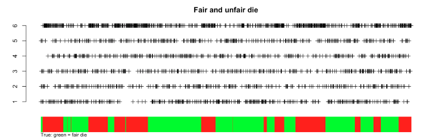

# 7.2. Mixture Models

## 7.2.1. Introduction

Mixture models are powerful probabilistic models that represent complex distributions as combinations of simpler component distributions. They are widely used in clustering, density estimation, and modeling heterogeneous data.

### Mathematical Foundation

A mixture model with $`K`$ components describes a distribution whose probability density function (pdf) is formulated as:

```math
f(x) = \sum_{k=1}^K \pi_k f_k(x \mid \theta_k)
```

where:
- $`\pi_k`$ are the **mixing weights** (or mixing proportions) that satisfy $`0 \leq \pi_k \leq 1`$ and $`\sum_{k=1}^K \pi_k = 1`$
- $`f_k(\cdot \mid \theta_k)`$ are the **component densities** parameterized by $`\theta_k`$
- $`K`$ is the number of components in the mixture

### Interpretation and Intuition

The mixture model can be interpreted as:
1. **Weighted Combination**: A weighted sum of $`K`$ different probability distributions
2. **Latent Structure**: Each observation comes from one of $`K`$ underlying subpopulations
3. **Flexible Modeling**: Can approximate complex, multi-modal distributions using simple components

### Data Generation Process

The data generation process for a mixture model involves two steps:

1. **Component Selection**: Generate a latent variable $`Z`$ from a categorical distribution:
```math
Z \sim \text{Categorical}(\pi_1, \pi_2, \ldots, \pi_K)
```
   where $`P(Z=k) = \pi_k`$ for $`k = 1, 2, \ldots, K`$

2. **Observation Generation**: Given $`Z=k`$, generate the observation $`X`$ from the $`k`$-th component:
```math
X \mid Z=k \sim f_k(\cdot \mid \theta_k)
```

This two-stage process is crucial for understanding mixture models and implementing the EM algorithm.

### Example: Visualizing Mixture Models

Let's create a simple example to illustrate mixture models:

```python
import numpy as np
import matplotlib.pyplot as plt
from scipy.stats import norm
import seaborn as sns

# Set random seed for reproducibility
np.random.seed(42)

# Parameters for a two-component Gaussian mixture
mu1, sigma1 = 0, 1
mu2, sigma2 = 4, 1.5
pi1 = 0.6
pi2 = 1 - pi1

# Generate data
n_samples = 1000
z = np.random.choice([0, 1], size=n_samples, p=[pi1, pi2])
x = np.zeros(n_samples)

x[z == 0] = np.random.normal(mu1, sigma1, size=np.sum(z == 0))
x[z == 1] = np.random.normal(mu2, sigma2, size=np.sum(z == 1))

# Plot the mixture
fig, (ax1, ax2) = plt.subplots(1, 2, figsize=(15, 5))

# Histogram of data
ax1.hist(x, bins=50, density=True, alpha=0.7, color='skyblue', edgecolor='black')
ax1.set_title('Histogram of Mixture Data')
ax1.set_xlabel('x')
ax1.set_ylabel('Density')

# True mixture density
x_range = np.linspace(-3, 8, 1000)
true_density = pi1 * norm.pdf(x_range, mu1, sigma1) + pi2 * norm.pdf(x_range, mu2, sigma2)
ax1.plot(x_range, true_density, 'r-', linewidth=2, label='True Mixture Density')
ax1.legend()

# Individual components
ax2.plot(x_range, pi1 * norm.pdf(x_range, mu1, sigma1), 'b--', 
         label=f'Component 1 (π={pi1:.1f})')
ax2.plot(x_range, pi2 * norm.pdf(x_range, mu2, sigma2), 'g--', 
         label=f'Component 2 (π={pi2:.1f})')
ax2.plot(x_range, true_density, 'r-', linewidth=2, label='Mixture')
ax2.set_title('Mixture Components')
ax2.set_xlabel('x')
ax2.set_ylabel('Density')
ax2.legend()

plt.tight_layout()
plt.show()

print(f"Generated {n_samples} samples from mixture model")
print(f"Component 1: μ={mu1}, σ={sigma1}, π={pi1}")
print(f"Component 2: μ={mu2}, σ={sigma2}, π={pi2}")
```

```r
# R implementation
set.seed(42)

# Parameters for a two-component Gaussian mixture
mu1 <- 0; sigma1 <- 1
mu2 <- 4; sigma2 <- 1.5
pi1 <- 0.6; pi2 <- 1 - pi1

# Generate data
n_samples <- 1000
z <- sample(c(0, 1), size=n_samples, replace=TRUE, prob=c(pi1, pi2))
x <- numeric(n_samples)

x[z == 0] <- rnorm(sum(z == 0), mu1, sigma1)
x[z == 1] <- rnorm(sum(z == 1), mu2, sigma2)

# Plot the mixture
par(mfrow=c(1, 2))

# Histogram of data
hist(x, breaks=50, freq=FALSE, col="skyblue", border="black",
     main="Histogram of Mixture Data", xlab="x", ylab="Density")

# True mixture density
x_range <- seq(-3, 8, length.out=1000)
true_density <- pi1 * dnorm(x_range, mu1, sigma1) + pi2 * dnorm(x_range, mu2, sigma2)
lines(x_range, true_density, col="red", lwd=2)

# Individual components
plot(x_range, pi1 * dnorm(x_range, mu1, sigma1), type="l", lty=2, col="blue",
     main="Mixture Components", xlab="x", ylab="Density",
     ylim=c(0, max(true_density)))
lines(x_range, pi2 * dnorm(x_range, mu2, sigma2), lty=2, col="green")
lines(x_range, true_density, col="red", lwd=2)
legend("topright", legend=c(paste("Component 1 (π=", pi1, ")"), 
                           paste("Component 2 (π=", pi2, ")"), "Mixture"),
       col=c("blue", "green", "red"), lty=c(2, 2, 1), lwd=c(1, 1, 2))

cat("Generated", n_samples, "samples from mixture model\n")
cat("Component 1: μ=", mu1, ", σ=", sigma1, ", π=", pi1, "\n")
cat("Component 2: μ=", mu2, ", σ=", sigma2, ", π=", pi2, "\n")
```

## 7.2.2. Two-Component Gaussian Mixture

### Model Specification

Consider a simple Gaussian mixture model with two components in a one-dimensional space. The probability density function (pdf) is:

```math
p(x \mid \theta) = \pi \phi_{\mu_1, \sigma_1^2}(x) + (1-\pi) \phi_{\mu_2, \sigma_2^2}(x)
```

where $`\phi_{\mu, \sigma^2}(x)`$ represents the normal distribution with mean $`\mu`$ and variance $`\sigma^2`$:

```math
\phi_{\mu, \sigma^2}(x) = \frac{1}{\sqrt{2\pi\sigma^2}} \exp\left\{-\frac{(x-\mu)^2}{2\sigma^2}\right\}
```

### Parameter Vector

The unknown parameters are collectively represented by:
```math
\theta = (\mu_1, \mu_2, \sigma_1^2, \sigma_2^2, \pi)
```

This includes:
- $`\mu_1, \mu_2`$: means of the two Gaussian components
- $`\sigma_1^2, \sigma_2^2`$: variances of the two Gaussian components  
- $`\pi`$: mixing weight for the first component (second component has weight $`1-\pi`$)

### Maximum Likelihood Estimation

Given $`n`$ independent observations $`x_1, x_2, \ldots, x_n`$, the log-likelihood function is:

```math
\begin{split}
\log p(x_{1:n} \mid \theta) &= \sum_{i=1}^n \log\left[\pi \phi_{\mu_1, \sigma_1^2}(x_i) + (1-\pi) \phi_{\mu_2, \sigma_2^2}(x_i)\right] \\
\hat{\theta}_{\text{MLE}} &= \arg\max_{\theta} \log p(x_{1:n} \mid \theta)
\end{split}
```

### The Latent Variable Perspective



*Figure: Dice metaphor for latent variable selection in mixture models. Each observation is generated by first rolling a 'latent' die to select a component, then sampling from that component's distribution.*

The key insight is to introduce latent variables $`Z_i`$ that indicate which component generated each observation. The complete data likelihood becomes:

```math
\begin{split}
Z_i &\sim \text{Bernoulli}(\pi) \\
X_i \mid Z_i = k &\sim \text{Normal}(\mu_k, \sigma_k^2)
\end{split}
```

The complete data likelihood (when we know $`Z_i`$) is:

```math
\prod_{i=1}^n \left[\pi \phi_{\mu_1, \sigma_1^2}(x_i)\right]^{\mathbf{1}_{\{z_i=1\}}} \left[(1-\pi) \phi_{\mu_2, \sigma_2^2}(x_i)\right]^{\mathbf{1}_{\{z_i=2\}}}
```

And the complete data log-likelihood is:

```math
\begin{split}
&\sum_{i} \mathbf{1}_{\{z_i=1\}} \left[\log \phi_{\mu_1, \sigma_1^2}(x_i) + \log \pi\right] + \mathbf{1}_{\{z_i=2\}} \left[\log \phi_{\mu_2, \sigma_2^2}(x_i) + \log(1-\pi)\right] \\
&= \sum_{i: z_i=1} \left[\log \phi_{\mu_1, \sigma_1^2}(x_i) + \log \pi\right] + \sum_{i: z_i=2} \left[\log \phi_{\mu_2, \sigma_2^2}(x_i) + \log(1-\pi)\right]
\end{split}
```

### Closed-Form MLE Solutions

When the latent variables $`Z_i`$ are known, the MLE solutions are straightforward:

1. **Component Means**:
   ```math
   \hat{\mu}_1 = \frac{1}{n_1} \sum_{i: z_i=1} x_i, \quad \hat{\mu}_2 = \frac{1}{n_2} \sum_{i: z_i=2} x_i
   ```

2. **Component Variances**:
   ```math
   \hat{\sigma}_1^2 = \frac{1}{n_1} \sum_{i: z_i=1} (x_i - \hat{\mu}_1)^2, \quad \hat{\sigma}_2^2 = \frac{1}{n_2} \sum_{i: z_i=2} (x_i - \hat{\mu}_2)^2
   ```

3. **Mixing Weight**:
   ```math
   \hat{\pi} = \frac{n_1}{n}
   ```

where $`n_1 = \sum_{i=1}^n \mathbf{1}_{\{z_i=1\}}`$ and $`n_2 = n - n_1`$.

### Implementation: Two-Component Gaussian Mixture

```python
import numpy as np
import matplotlib.pyplot as plt
from scipy.stats import norm
from sklearn.mixture import GaussianMixture

class TwoComponentGaussianMixture:
    def __init__(self, mu1=0, mu2=4, sigma1=1, sigma2=1.5, pi=0.6):
        self.mu1 = mu1
        self.mu2 = mu2
        self.sigma1 = sigma1
        self.sigma2 = sigma2
        self.pi = pi
        
    def generate_data(self, n_samples=1000):
        """Generate data from the mixture model"""
        z = np.random.choice([0, 1], size=n_samples, p=[self.pi, 1-self.pi])
        x = np.zeros(n_samples)
        
        x[z == 0] = np.random.normal(self.mu1, self.sigma1, size=np.sum(z == 0))
        x[z == 1] = np.random.normal(self.mu2, self.sigma2, size=np.sum(z == 1))
        
        return x, z
    
    def pdf(self, x):
        """Compute the probability density function"""
        return (self.pi * norm.pdf(x, self.mu1, self.sigma1) + 
                (1-self.pi) * norm.pdf(x, self.mu2, self.sigma2))
    
    def plot_mixture(self, x, z=None):
        """Plot the mixture model and data"""
        fig, (ax1, ax2) = plt.subplots(1, 2, figsize=(15, 5))
        
        # Histogram
        ax1.hist(x, bins=50, density=True, alpha=0.7, color='skyblue', edgecolor='black')
        x_range = np.linspace(x.min()-1, x.max()+1, 1000)
        ax1.plot(x_range, self.pdf(x_range), 'r-', linewidth=2, label='True Mixture')
        ax1.set_title('Data and True Mixture Density')
        ax1.set_xlabel('x')
        ax1.set_ylabel('Density')
        ax1.legend()
        
        # Components
        ax2.plot(x_range, self.pi * norm.pdf(x_range, self.mu1, self.sigma1), 
                'b--', label=f'Component 1 (π={self.pi:.1f})')
        ax2.plot(x_range, (1-self.pi) * norm.pdf(x_range, self.mu2, self.sigma2), 
                'g--', label=f'Component 2 (π={1-self.pi:.1f})')
        ax2.plot(x_range, self.pdf(x_range), 'r-', linewidth=2, label='Mixture')
        ax2.set_title('Mixture Components')
        ax2.set_xlabel('x')
        ax2.set_ylabel('Density')
        ax2.legend()
        
        plt.tight_layout()
        plt.show()

# Example usage
np.random.seed(42)
gmm = TwoComponentGaussianMixture()
x, z = gmm.generate_data(1000)
gmm.plot_mixture(x, z)

# Fit using sklearn for comparison
sklearn_gmm = GaussianMixture(n_components=2, random_state=42)
sklearn_gmm.fit(x.reshape(-1, 1))

print("True parameters:")
print(f"μ1={gmm.mu1}, μ2={gmm.mu2}, σ1={gmm.sigma1}, σ2={gmm.sigma2}, π={gmm.pi}")
print("\nSklearn estimated parameters:")
print(f"μ1={sklearn_gmm.means_[0,0]:.3f}, μ2={sklearn_gmm.means_[1,0]:.3f}")
print(f"σ1={np.sqrt(sklearn_gmm.covariances_[0,0,0]):.3f}, σ2={np.sqrt(sklearn_gmm.covariances_[1,0,0]):.3f}")
print(f"π1={sklearn_gmm.weights_[0]:.3f}, π2={sklearn_gmm.weights_[1]:.3f}")
```

```r
# R implementation
library(mixtools)
library(ggplot2)

TwoComponentGaussianMixture <- function(mu1=0, mu2=4, sigma1=1, sigma2=1.5, pi=0.6) {
  list(mu1=mu1, mu2=mu2, sigma1=sigma1, sigma2=sigma2, pi=pi)
}

generate_data <- function(gmm, n_samples=1000) {
  z <- sample(c(0, 1), size=n_samples, replace=TRUE, prob=c(gmm$pi, 1-gmm$pi))
  x <- numeric(n_samples)
  
  x[z == 0] <- rnorm(sum(z == 0), gmm$mu1, gmm$sigma1)
  x[z == 1] <- rnorm(sum(z == 1), gmm$mu2, gmm$sigma2)
  
  list(x=x, z=z)
}

pdf_mixture <- function(x, gmm) {
  gmm$pi * dnorm(x, gmm$mu1, gmm$sigma1) + (1-gmm$pi) * dnorm(x, gmm$mu2, gmm$sigma2)
}

plot_mixture <- function(x, gmm, z=NULL) {
  # Create data frame for plotting
  df <- data.frame(x=x)
  x_range <- seq(min(x)-1, max(x)+1, length.out=1000)
  df_density <- data.frame(
    x=x_range,
    component1=gmm$pi * dnorm(x_range, gmm$mu1, gmm$sigma1),
    component2=(1-gmm$pi) * dnorm(x_range, gmm$mu2, gmm$sigma2),
    mixture=pdf_mixture(x_range, gmm)
  )
  
  # Plot 1: Histogram with true density
  p1 <- ggplot(df, aes(x=x)) +
    geom_histogram(aes(y=..density..), bins=50, fill="skyblue", alpha=0.7) +
    geom_line(data=df_density, aes(x=x, y=mixture), color="red", size=1) +
    labs(title="Data and True Mixture Density", x="x", y="Density") +
    theme_minimal()
  
  # Plot 2: Components
  p2 <- ggplot(df_density, aes(x=x)) +
    geom_line(aes(y=component1), color="blue", linetype="dashed") +
    geom_line(aes(y=component2), color="green", linetype="dashed") +
    geom_line(aes(y=mixture), color="red", size=1) +
    labs(title="Mixture Components", x="x", y="Density") +
    theme_minimal()
  
  gridExtra::grid.arrange(p1, p2, ncol=2)
}

# Example usage
set.seed(42)
gmm <- TwoComponentGaussianMixture()
data <- generate_data(gmm, 1000)
plot_mixture(data$x, gmm, data$z)

# Fit using mixtools
fit <- normalmixEM(data$x, k=2)
print("True parameters:")
cat("μ1=", gmm$mu1, ", μ2=", gmm$mu2, ", σ1=", gmm$sigma1, ", σ2=", gmm$sigma2, ", π=", gmm$pi, "\n")
print("Estimated parameters:")
cat("μ1=", round(fit$mu[1], 3), ", μ2=", round(fit$mu[2], 3), "\n")
cat("σ1=", round(fit$sigma[1], 3), ", σ2=", round(fit$sigma[2], 3), "\n")
cat("π1=", round(fit$lambda[1], 3), ", π2=", round(fit$lambda[2], 3), "\n")
```

## 7.2.3. Kullback-Leibler Divergence

### Definition and Intuition

The Kullback-Leibler (KL) divergence measures the difference between two probability distributions. For distributions $`p(x)`$ and $`q(x)`$ defined over the same domain, the KL divergence is:

```math
KL(p \| q) = \mathbb{E}_{X \sim p} \log\left[\frac{p(X)}{q(X)}\right]
```

### Mathematical Properties

1. **Non-negativity**: $`KL(p \| q) \geq 0`$ for all $`p`$ and $`q`$
2. **Asymmetry**: $`KL(p \| q) \neq KL(q \| p)`$ in general
3. **Identity**: $`KL(p \| q) = 0`$ if and only if $`p = q`$ almost everywhere

### Proof of Non-negativity

Using Jensen's inequality for the convex function $`-\log(x)`$:

```math
\begin{split}
KL(p \| q) &= \mathbb{E}_{X \sim p} \left[-\log\frac{q(X)}{p(X)}\right] \\
&\geq -\log\left[\mathbb{E}_{X \sim p} \frac{q(X)}{p(X)}\right] = 0
\end{split}
```

since $`\mathbb{E}_{X \sim p} \frac{q(X)}{p(X)} = \int p(x) \cdot \frac{q(x)}{p(x)} dx = \int q(x) dx = 1`$.

### Discrete vs Continuous Cases

**Discrete distributions**:
```math
KL(p \| q) = \sum_{i} p_i \log\frac{p_i}{q_i}
```

**Continuous distributions**:
```math
KL(p \| q) = \int p(x) \log\frac{p(x)}{q(x)} dx
```

### Implementation: KL Divergence

```python
import numpy as np
from scipy.stats import norm, entropy
from scipy.integrate import quad

def kl_divergence_discrete(p, q):
    """Compute KL divergence for discrete distributions"""
    # Ensure probabilities sum to 1
    p = np.array(p) / np.sum(p)
    q = np.array(q) / np.sum(q)
    
    # Add small epsilon to avoid log(0)
    epsilon = 1e-10
    p = p + epsilon
    q = q + epsilon
    
    return np.sum(p * np.log(p / q))

def kl_divergence_continuous(p_func, q_func, x_range):
    """Compute KL divergence for continuous distributions using numerical integration"""
    def integrand(x):
        p_val = p_func(x)
        q_val = q_func(x)
        # Avoid log(0)
        if p_val > 0 and q_val > 0:
            return p_val * np.log(p_val / q_val)
        return 0
    
    result, _ = quad(integrand, x_range[0], x_range[-1])
    return result

def kl_divergence_gaussian(mu1, sigma1, mu2, sigma2):
    """Compute KL divergence between two Gaussian distributions"""
    return (np.log(sigma2/sigma1) + 
            (sigma1**2 + (mu1 - mu2)**2) / (2 * sigma2**2) - 0.5)

# Example: KL divergence between Gaussians
mu1, sigma1 = 0, 1
mu2, sigma2 = 1, 1.5

# Analytical solution
kl_analytical = kl_divergence_gaussian(mu1, sigma1, mu2, sigma2)

# Numerical solution
def gaussian_pdf(x, mu, sigma):
    return norm.pdf(x, mu, sigma)

kl_numerical = kl_divergence_continuous(
    lambda x: gaussian_pdf(x, mu1, sigma1),
    lambda x: gaussian_pdf(x, mu2, sigma2),
    [-5, 5]
)

print(f"KL divergence between N({mu1},{sigma1}) and N({mu2},{sigma2})")
print(f"Analytical: {kl_analytical:.6f}")
print(f"Numerical:  {kl_numerical:.6f}")

# Visualize the distributions
import matplotlib.pyplot as plt

x = np.linspace(-4, 6, 1000)
p1 = gaussian_pdf(x, mu1, sigma1)
p2 = gaussian_pdf(x, mu2, sigma2)

plt.figure(figsize=(10, 6))
plt.plot(x, p1, 'b-', label=f'N({mu1},{sigma1})')
plt.plot(x, p2, 'r-', label=f'N({mu2},{sigma2})')
plt.fill_between(x, p1, p2, alpha=0.3, color='gray')
plt.title(f'Gaussian Distributions (KL divergence: {kl_analytical:.4f})')
plt.xlabel('x')
plt.ylabel('Density')
plt.legend()
plt.grid(True, alpha=0.3)
plt.show()
```

```r
# R implementation
library(ggplot2)

kl_divergence_discrete <- function(p, q) {
  # Normalize probabilities
  p <- p / sum(p)
  q <- q / sum(q)
  
  # Add small epsilon to avoid log(0)
  epsilon <- 1e-10
  p <- p + epsilon
  q <- q + epsilon
  
  sum(p * log(p / q))
}

kl_divergence_gaussian <- function(mu1, sigma1, mu2, sigma2) {
  log(sigma2/sigma1) + (sigma1^2 + (mu1 - mu2)^2) / (2 * sigma2^2) - 0.5
}

# Example
mu1 <- 0; sigma1 <- 1
mu2 <- 1; sigma2 <- 1.5

kl_analytical <- kl_divergence_gaussian(mu1, sigma1, mu2, sigma2)

cat("KL divergence between N(", mu1, ",", sigma1, ") and N(", mu2, ",", sigma2, ")\n")
cat("Analytical:", round(kl_analytical, 6), "\n")

# Visualize
x <- seq(-4, 6, length.out=1000)
p1 <- dnorm(x, mu1, sigma1)
p2 <- dnorm(x, mu2, sigma2)

df <- data.frame(x=x, p1=p1, p2=p2)
ggplot(df, aes(x=x)) +
  geom_line(aes(y=p1), color="blue", size=1) +
  geom_line(aes(y=p2), color="red", size=1) +
  geom_ribbon(aes(ymin=pmin(p1, p2), ymax=pmax(p1, p2)), alpha=0.3, fill="gray") +
  labs(title=paste("Gaussian Distributions (KL divergence:", round(kl_analytical, 4), ")"),
       x="x", y="Density") +
  theme_minimal()
```

## 7.2.4. The Expectation-Maximization Algorithm

### Problem Statement

The challenge in fitting mixture models is that the latent variables $`Z_i`$ are unobserved. The EM algorithm provides an elegant solution to this problem.

### Algorithm Overview

The EM algorithm iterates between two steps:

1. **E-step (Expectation)**: Compute the expected value of the latent variables given the current parameter estimates
2. **M-step (Maximization)**: Update the parameters by maximizing the expected complete log-likelihood

### E-step: Computing Responsibilities

For a two-component Gaussian mixture, we compute the **responsibility** $`\gamma_i`$ of component 1 for observation $`x_i`$:

```math
\gamma_i = P(Z_i = 1 \mid x_i, \theta^{(t)}) = \frac{\pi^{(t)} \phi_{\mu_1^{(t)}, \sigma_1^{2(t)}}(x_i)}{\pi^{(t)} \phi_{\mu_1^{(t)}, \sigma_1^{2(t)}}(x_i) + (1-\pi^{(t)}) \phi_{\mu_2^{(t)}, \sigma_2^{2(t)}}(x_i)}
```

### M-step: Parameter Updates

Using the responsibilities, we update the parameters:

```math
\begin{split}
\pi^{(t+1)} &= \frac{1}{n} \sum_{i=1}^n \gamma_i \\
\mu_1^{(t+1)} &= \frac{\sum_{i=1}^n \gamma_i x_i}{\sum_{i=1}^n \gamma_i} \\
\mu_2^{(t+1)} &= \frac{\sum_{i=1}^n (1-\gamma_i) x_i}{\sum_{i=1}^n (1-\gamma_i)} \\
\sigma_1^{2(t+1)} &= \frac{\sum_{i=1}^n \gamma_i (x_i - \mu_1^{(t+1)})^2}{\sum_{i=1}^n \gamma_i} \\
\sigma_2^{2(t+1)} &= \frac{\sum_{i=1}^n (1-\gamma_i) (x_i - \mu_2^{(t+1)})^2}{\sum_{i=1}^n (1-\gamma_i)}
\end{split}
```

### Implementation: EM Algorithm

```python
import numpy as np
import matplotlib.pyplot as plt
from scipy.stats import norm

class EMGaussianMixture:
    def __init__(self, n_components=2, max_iter=100, tol=1e-6):
        self.n_components = n_components
        self.max_iter = max_iter
        self.tol = tol
        self.means_ = None
        self.covariances_ = None
        self.weights_ = None
        self.responsibilities_ = None
        
    def fit(self, X):
        """Fit the Gaussian mixture model using EM algorithm"""
        n_samples = len(X)
        
        # Initialize parameters randomly
        self._initialize_parameters(X)
        
        log_likelihoods = []
        
        for iteration in range(self.max_iter):
            # E-step: Compute responsibilities
            self.responsibilities_ = self._e_step(X)
            
            # M-step: Update parameters
            self._m_step(X)
            
            # Compute log-likelihood
            log_likelihood = self._compute_log_likelihood(X)
            log_likelihoods.append(log_likelihood)
            
            # Check convergence
            if len(log_likelihoods) > 1:
                if abs(log_likelihoods[-1] - log_likelihoods[-2]) < self.tol:
                    print(f"Converged after {iteration + 1} iterations")
                    break
        
        return self
    
    def _initialize_parameters(self, X):
        """Initialize parameters randomly"""
        n_samples = len(X)
        
        # Random means
        self.means_ = np.random.choice(X, size=self.n_components, replace=False)
        
        # Random covariances
        self.covariances_ = np.array([np.var(X)] * self.n_components)
        
        # Random weights
        self.weights_ = np.random.dirichlet(np.ones(self.n_components))
    
    def _e_step(self, X):
        """E-step: Compute responsibilities"""
        n_samples = len(X)
        responsibilities = np.zeros((n_samples, self.n_components))
        
        for k in range(self.n_components):
            responsibilities[:, k] = (self.weights_[k] * 
                                   norm.pdf(X, self.means_[k], np.sqrt(self.covariances_[k])))
        
        # Normalize
        row_sums = responsibilities.sum(axis=1)
        responsibilities = responsibilities / row_sums[:, np.newaxis]
        
        return responsibilities
    
    def _m_step(self, X):
        """M-step: Update parameters"""
        n_samples = len(X)
        
        for k in range(self.n_components):
            # Update weights
            self.weights_[k] = np.mean(self.responsibilities_[:, k])
            
            # Update means
            self.means_[k] = (np.sum(self.responsibilities_[:, k] * X) / 
                             np.sum(self.responsibilities_[:, k]))
            
            # Update covariances
            self.covariances_[k] = (np.sum(self.responsibilities_[:, k] * 
                                          (X - self.means_[k])**2) / 
                                   np.sum(self.responsibilities_[:, k]))
    
    def _compute_log_likelihood(self, X):
        """Compute log-likelihood"""
        likelihood = np.zeros(len(X))
        
        for k in range(self.n_components):
            likelihood += (self.weights_[k] * 
                         norm.pdf(X, self.means_[k], np.sqrt(self.covariances_[k])))
        
        return np.sum(np.log(likelihood + 1e-10))
    
    def predict_proba(self, X):
        """Predict component probabilities"""
        return self._e_step(X)
    
    def predict(self, X):
        """Predict component assignments"""
        return np.argmax(self.predict_proba(X), axis=1)

# Example usage
np.random.seed(42)

# Generate data from true mixture
true_gmm = TwoComponentGaussianMixture()
X, true_z = true_gmm.generate_data(1000)

# Fit using EM
em_gmm = EMGaussianMixture(n_components=2)
em_gmm.fit(X)

# Compare results
print("True parameters:")
print(f"μ1={true_gmm.mu1}, μ2={true_gmm.mu2}")
print(f"σ1={true_gmm.sigma1}, σ2={true_gmm.sigma2}")
print(f"π={true_gmm.pi}")

print("\nEM estimated parameters:")
print(f"μ1={em_gmm.means_[0]:.3f}, μ2={em_gmm.means_[1]:.3f}")
print(f"σ1={np.sqrt(em_gmm.covariances_[0]):.3f}, σ2={np.sqrt(em_gmm.covariances_[1]):.3f}")
print(f"π1={em_gmm.weights_[0]:.3f}, π2={em_gmm.weights_[1]:.3f}")

# Visualize results
fig, (ax1, ax2) = plt.subplots(1, 2, figsize=(15, 5))

# Data and fitted mixture
ax1.hist(X, bins=50, density=True, alpha=0.7, color='skyblue', edgecolor='black')
x_range = np.linspace(X.min()-1, X.max()+1, 1000)

# True mixture
true_density = true_gmm.pdf(x_range)
ax1.plot(x_range, true_density, 'r-', linewidth=2, label='True Mixture')

# Fitted mixture
fitted_density = (em_gmm.weights_[0] * norm.pdf(x_range, em_gmm.means_[0], np.sqrt(em_gmm.covariances_[0])) +
                 em_gmm.weights_[1] * norm.pdf(x_range, em_gmm.means_[1], np.sqrt(em_gmm.covariances_[1])))
ax1.plot(x_range, fitted_density, 'g--', linewidth=2, label='Fitted Mixture')

ax1.set_title('Data and Mixture Densities')
ax1.set_xlabel('x')
ax1.set_ylabel('Density')
ax1.legend()

# Responsibilities
predicted_z = em_gmm.predict(X)
ax2.scatter(X, em_gmm.responsibilities_[:, 0], alpha=0.6, s=20)
ax2.set_title('Responsibilities (Component 1)')
ax2.set_xlabel('x')
ax2.set_ylabel('P(Z=1|x)')

plt.tight_layout()
plt.show()
```

```r
# R implementation
library(mixtools)

# Generate data
set.seed(42)
gmm <- TwoComponentGaussianMixture()
data <- generate_data(gmm, 1000)

# Fit using mixtools EM
fit <- normalmixEM(data$x, k=2, maxit=100, epsilon=1e-6)

# Compare results
cat("True parameters:\n")
cat("μ1=", gmm$mu1, ", μ2=", gmm$mu2, "\n")
cat("σ1=", gmm$sigma1, ", σ2=", gmm$sigma2, "\n")
cat("π=", gmm$pi, "\n")

cat("\nEM estimated parameters:\n")
cat("μ1=", round(fit$mu[1], 3), ", μ2=", round(fit$mu[2], 3), "\n")
cat("σ1=", round(fit$sigma[1], 3), ", σ2=", round(fit$sigma[2], 3), "\n")
cat("π1=", round(fit$lambda[1], 3), ", π2=", round(fit$lambda[2], 3), "\n")

# Visualize results
par(mfrow=c(1, 2))

# Data and fitted mixture
hist(data$x, breaks=50, freq=FALSE, col="skyblue", border="black",
     main="Data and Mixture Densities", xlab="x", ylab="Density")

x_range <- seq(min(data$x)-1, max(data$x)+1, length.out=1000)
true_density <- pdf_mixture(x_range, gmm)
lines(x_range, true_density, col="red", lwd=2)

fitted_density <- fit$lambda[1] * dnorm(x_range, fit$mu[1], fit$sigma[1]) +
                 fit$lambda[2] * dnorm(x_range, fit$mu[2], fit$sigma[2])
lines(x_range, fitted_density, col="green", lty=2, lwd=2)

legend("topright", legend=c("True Mixture", "Fitted Mixture"),
       col=c("red", "green"), lty=c(1, 2), lwd=2)

# Responsibilities
plot(data$x, fit$posterior[,1], pch=16, cex=0.5, col="blue",
     main="Responsibilities (Component 1)", xlab="x", ylab="P(Z=1|x)")
```

### Convergence and Initialization

The EM algorithm has several important properties:

1. **Monotonicity**: The log-likelihood never decreases at each iteration
2. **Convergence**: The algorithm converges to a local maximum of the likelihood
3. **Initialization Sensitivity**: Different initializations can lead to different local maxima

### Multiple Initializations

```python
def fit_multiple_initializations(X, n_components=2, n_init=10):
    """Fit GMM with multiple initializations and return the best result"""
    best_log_likelihood = -np.inf
    best_gmm = None
    
    for i in range(n_init):
        gmm = EMGaussianMixture(n_components=n_components)
        gmm.fit(X)
        
        log_likelihood = gmm._compute_log_likelihood(X)
        
        if log_likelihood > best_log_likelihood:
            best_log_likelihood = log_likelihood
            best_gmm = gmm
    
    return best_gmm, best_log_likelihood

# Example with multiple initializations
best_gmm, best_ll = fit_multiple_initializations(X, n_components=2, n_init=10)
print(f"Best log-likelihood: {best_ll:.3f}")
```

This comprehensive expansion provides detailed mathematical foundations, practical implementations, and visualizations for understanding mixture models and the EM algorithm. The code examples demonstrate both the theoretical concepts and their practical application.
