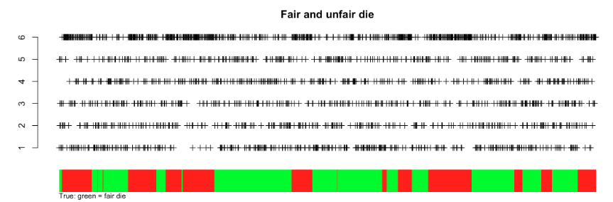

# 7.2. Mixture Models

## 7.2.1. Introduction

Mixture models are powerful probabilistic models that represent complex distributions as combinations of simpler component distributions. They are widely used in clustering, density estimation, and modeling heterogeneous data.

**Intuitive Understanding**: Mixture models are like understanding that a restaurant's menu is actually a blend of recipes from different chefs, each with their own signature style. Instead of trying to describe the entire menu with one complex recipe, you break it down into simpler, well-understood cooking styles and then combine them. Think of it like having a master chef who can cook in multiple styles - sometimes they make Italian dishes, sometimes French, sometimes Asian - and the overall menu is a mix of these different approaches. Each style has its own characteristics (ingredients, techniques, flavors), and the master chef chooses which style to use for each dish based on certain probabilities.

### Mathematical Foundation

A mixture model with $`K`$ components describes a distribution whose probability density function (pdf) is formulated as:

$$ f(x) = \sum_{k=1}^K \pi_k f_k(x \mid \theta_k) $$

where:
- $`\pi_k`$ are the **mixing weights** (or mixing proportions) that satisfy $`0 \leq \pi_k \leq 1`$ and $`\sum_{k=1}^K \pi_k = 1`$ - like the probability that the master chef will choose cooking style k
- $`f_k(\cdot \mid \theta_k)`$ are the **component densities** parameterized by $`\theta_k`$ - like the signature characteristics of cooking style k
- $`K`$ is the number of components in the mixture - like the number of different cooking styles the master chef knows

**Intuition**: This formula is like saying "the overall menu is a weighted combination of K different cooking styles, where each style has its own characteristics and appears with a certain frequency." The mixing weights tell us how often each style is used, and the component densities tell us what each style looks like.

### Interpretation and Intuition

The mixture model can be interpreted as:
1. **Weighted Combination**: A weighted sum of $`K`$ different probability distributions - like combining different cooking styles with different frequencies
2. **Latent Structure**: Each observation comes from one of $`K`$ underlying subpopulations - like each dish being made by one of the master chef's different cooking styles
3. **Flexible Modeling**: Can approximate complex, multi-modal distributions using simple components - like being able to model a complex menu using simple, well-understood cooking styles

**Intuition**: These interpretations help us understand why mixture models are so powerful. The weighted combination idea tells us that we're mixing different styles together. The latent structure idea tells us that each dish has a hidden "style label" that we can't see directly. The flexible modeling idea tells us that we can capture complex patterns by combining simple building blocks.

### Data Generation Process

The data generation process for a mixture model involves two steps:

1. **Component Selection**: Generate a latent variable $`Z`$ from a categorical distribution:
$$ Z \sim \text{Categorical}(\pi_1, \pi_2, \ldots, \pi_K) $$
   where $`P(Z=k) = \pi_k`$ for $`k = 1, 2, \ldots, K`$

2. **Observation Generation**: Given $`Z=k`$, generate the observation $`X`$ from the $`k`$-th component:
$$ X \mid Z=k \sim f_k(\cdot \mid \theta_k) $$

**Intuition**: This two-stage process is like the master chef's decision-making process. First, they decide which cooking style to use (maybe they roll a weighted die where 40% chance of Italian, 35% chance of French, 25% chance of Asian). Then, given that style choice, they create a dish following that style's characteristics. The first step is hidden from us - we only see the final dish, not which style was chosen.

This two-stage process is crucial for understanding mixture models and implementing the EM algorithm.

### Example: Visualizing Mixture Models

**Implementation:** See `visualize_mixture_model()` function in [mixture_models_implementation.py](code/mixture_models_implementation.py)

The implementation demonstrates:
- **Data generation**: Creating synthetic data from a two-component Gaussian mixture - like creating a menu with dishes from two different cooking styles
- **Visualization**: Histogram of generated data with true mixture density overlay - like showing the distribution of dishes and the underlying cooking style patterns
- **Component analysis**: Individual component densities and their weighted combination - like showing each cooking style separately and then how they combine
- **Parameter specification**: Clear demonstration of mixing weights and component parameters - like showing how often each style is used and what each style looks like

**Implementation:** See `visualize_mixture_model()` function in [r_mixture_models_implementation.R](code/r_mixture_models_implementation.R)

The implementation demonstrates:
- **Data generation**: Creating synthetic data from a two-component Gaussian mixture using R's random number generators - like creating a menu with dishes from two different cooking styles
- **Visualization**: Histogram of generated data with true mixture density overlay using base R graphics - like showing the distribution of dishes and the underlying cooking style patterns
- **Component analysis**: Individual component densities and their weighted combination - like showing each cooking style separately and then how they combine
- **Parameter specification**: Clear demonstration of mixing weights and component parameters - like showing how often each style is used and what each style looks like

## 7.2.2. Two-Component Gaussian Mixture

### Model Specification

Consider a simple Gaussian mixture model with two components in a one-dimensional space. The probability density function (pdf) is:

$$ p(x \mid \theta) = \pi \phi_{\mu_1, \sigma_1^2}(x) + (1-\pi) \phi_{\mu_2, \sigma_2^2}(x) $$

where $`\phi_{\mu, \sigma^2}(x)`$ represents the normal distribution with mean $`\mu`$ and variance $`\sigma^2`$:

$$ \phi_{\mu, \sigma^2}(x) = \frac{1}{\sqrt{2\pi\sigma^2}} \exp\left\{-\frac{(x-\mu)^2}{2\sigma^2}\right\} $$

**Intuition**: This is like having a master chef who knows exactly two cooking styles. When they make a dish, they have a π probability of using style 1 and a (1-π) probability of using style 2. Each style has its own typical dish (mean) and its own way of varying from that typical dish (variance). The overall menu is a mix of these two styles.

### Parameter Vector

The unknown parameters are collectively represented by:
$$ \theta = (\mu_1, \mu_2, \sigma_1^2, \sigma_2^2, \pi) $$

This includes:
- $`\mu_1, \mu_2`$: means of the two Gaussian components - like the signature dishes of the two cooking styles
- $`\sigma_1^2, \sigma_2^2`$: variances of the two Gaussian components - like how much each cooking style varies from its signature dish
- $`\pi`$: mixing weight for the first component (second component has weight $`1-\pi`$) - like the probability of choosing the first cooking style

**Intuition**: These parameters give us a complete picture of the master chef's two cooking styles. The means tell us what the typical dish looks like for each style, the variances tell us how much variation each style allows, and the mixing weight tells us how often each style is used.

### Maximum Likelihood Estimation

Given $`n`$ independent observations $`x_1, x_2, \ldots, x_n`$, the log-likelihood function is:

$$ \begin{split}
\log p(x_{1:n} \mid \theta) &= \sum_{i=1}^n \log\left[\pi \phi_{\mu_1, \sigma_1^2}(x_i) + (1-\pi) \phi_{\mu_2, \sigma_2^2}(x_i)\right] \\
\hat{\theta}_{\text{MLE}} &= \arg\max_{\theta} \log p(x_{1:n} \mid \theta)
\end{split} $$

**Intuition**: The likelihood function is like asking "how well do our current descriptions of the two cooking styles explain all the dishes we've observed?" For each dish, we calculate how likely it is under our current model of the two styles, and we want to find the style descriptions that make all the dishes as likely as possible.

### The Latent Variable Perspective

*Figure: Dice metaphor for latent variable selection in mixture models. Each observation is generated by first rolling a 'latent' die to select a component, then sampling from that component's distribution.*

**Intuition**: The dice metaphor is perfect for understanding latent variables. Each time the master chef makes a dish, they first roll a weighted die to decide which cooking style to use. The die is weighted so that style 1 comes up with probability π and style 2 comes up with probability (1-π). Once they've chosen the style, they create a dish following that style's characteristics. We only see the final dish, not which style was chosen - that's why it's called "latent" (hidden).

The key insight is to introduce latent variables $`Z_i`$ that indicate which component generated each observation. The complete data likelihood becomes:

$$ \begin{split}
Z_i &\sim \text{Bernoulli}(\pi) \\
X_i \mid Z_i = k &\sim \text{Normal}(\mu_k, \sigma_k^2)
\end{split} $$

**Intuition**: This formulation makes the two-stage process explicit. First, we generate a hidden variable Z_i that tells us which cooking style was chosen (like rolling the die). Then, given that style choice, we generate the dish X_i following that style's characteristics.

The complete data likelihood (when we know $`Z_i`$) is:

$$ \prod_{i=1}^n \left[\pi \phi_{\mu_1, \sigma_1^2}(x_i)\right]^{\mathbf{1}_{\{z_i=1\}}} \left[(1-\pi) \phi_{\mu_2, \sigma_2^2}(x_i)\right]^{\mathbf{1}_{\{z_i=2\}}} $$

And the complete data log-likelihood is:

$$ \begin{split}
&\sum_{i} \mathbf{1}_{\{z_i=1\}} \left[\log \phi_{\mu_1, \sigma_1^2}(x_i) + \log \pi\right] + \mathbf{1}_{\{z_i=2\}} \left[\log \phi_{\mu_2, \sigma_2^2}(x_i) + \log(1-\pi)\right] \\
&= \sum_{i: z_i=1} \left[\log \phi_{\mu_1, \sigma_1^2}(x_i) + \log \pi\right] + \sum_{i: z_i=2} \left[\log \phi_{\mu_2, \sigma_2^2}(x_i) + \log(1-\pi)\right]
\end{split} $$

**Intuition**: The complete data likelihood is much simpler because we know which cooking style was used for each dish. It's like having a complete record that says "dish 1 was made with style 1, dish 2 was made with style 2, etc." This makes the likelihood function much easier to work with because we can separate the dishes by style and estimate each style's parameters independently.

### Closed-Form MLE Solutions

When the latent variables $`Z_i`$ are known, the MLE solutions are straightforward:

1. **Component Means**:
   $$ \hat{\mu}_1 = \frac{1}{n_1} \sum_{i: z_i=1} x_i, \quad \hat{\mu}_2 = \frac{1}{n_2} \sum_{i: z_i=2} x_i $$

2. **Component Variances**:
   $$ \hat{\sigma}_1^2 = \frac{1}{n_1} \sum_{i: z_i=1} (x_i - \hat{\mu}_1)^2, \quad \hat{\sigma}_2^2 = \frac{1}{n_2} \sum_{i: z_i=2} (x_i - \hat{\mu}_2)^2 $$

3. **Mixing Weight**:
   $$ \hat{\pi} = \frac{n_1}{n} $$

where $`n_1 = \sum_{i=1}^n \mathbf{1}_{\{z_i=1\}}`$ and $`n_2 = n - n_1`$.

**Intuition**: When we know which cooking style was used for each dish, estimating the parameters becomes simple. The mean for each style is just the average of all dishes made with that style. The variance for each style is just how much those dishes vary from their average. The mixing weight is just the proportion of dishes that were made with the first style.

### Implementation: Two-Component Gaussian Mixture

**Implementation:** See `TwoComponentGaussianMixture` class and `demonstrate_two_component_mixture()` function in [mixture_models_implementation.py](code/mixture_models_implementation.py)

The implementation includes:
- **TwoComponentGaussianMixture class**: Complete implementation with data generation, PDF computation, and visualization - like a complete toolkit for working with two cooking styles
- **Data generation**: Synthetic data generation from the mixture model with latent component assignments - like creating a menu with known style assignments
- **PDF computation**: Probability density function evaluation for the mixture model - like calculating how likely different dishes are under the model
- **Visualization**: Comprehensive plotting with histogram, true density, and component analysis - like showing the menu distribution and the underlying style patterns
- **Parameter comparison**: Comparison with sklearn's GaussianMixture for validation - like checking our work against proven tools

**Implementation:** See `TwoComponentGaussianMixture` function and `demonstrate_two_component_mixture()` function in [r_mixture_models_implementation.R](code/r_mixture_models_implementation.R)

The implementation includes:
- **TwoComponentGaussianMixture function**: Complete implementation with data generation, PDF computation, and visualization - like a complete R toolkit for working with two cooking styles
- **Data generation**: Synthetic data generation from the mixture model with latent component assignments - like creating a menu with known style assignments
- **PDF computation**: Probability density function evaluation for the mixture model - like calculating how likely different dishes are under the model
- **Visualization**: Comprehensive plotting with ggplot2 for histogram, true density, and component analysis - like showing the menu distribution and the underlying style patterns
- **Parameter comparison**: Comparison with mixtools' normalmixEM for validation - like checking our work against proven R tools

## 7.2.3. Kullback-Leibler Divergence

### Definition and Intuition

The Kullback-Leibler (KL) divergence measures the difference between two probability distributions. For distributions $`p(x)`$ and $`q(x)`$ defined over the same domain, the KL divergence is:

$$ KL(p \| q) = \mathbb{E}_{X \sim p} \log\left[\frac{p(X)}{q(X)}\right] $$

**Intuition**: KL divergence is like measuring how different two cooking styles are. If you have two chefs with very similar styles, the KL divergence will be small. If they have very different styles, the KL divergence will be large. It's like asking "if I expect dishes from Chef A but get dishes from Chef B, how surprised will I be?" The KL divergence measures this surprise.

### Mathematical Properties

1. **Non-negativity**: $`KL(p \| q) \geq 0`$ for all $`p`$ and $`q`$ - like saying you can't be less surprised than not surprised at all
2. **Asymmetry**: $`KL(p \| q) \neq KL(q \| p)`$ in general - like saying being surprised by Chef B when expecting Chef A is different from being surprised by Chef A when expecting Chef B
3. **Identity**: $`KL(p \| q) = 0`$ if and only if $`p = q`$ almost everywhere - like saying you're not surprised at all only if the two chefs have identical styles

### Proof of Non-negativity

Using Jensen's inequality for the convex function $`-\log(x)`$:

$$ \begin{split}
KL(p \| q) &= \mathbb{E}_{X \sim p} \left[-\log\frac{q(X)}{p(X)}\right] \\
&\geq -\log\left[\mathbb{E}_{X \sim p} \frac{q(X)}{p(X)}\right] = 0
\end{split} $$

since $`\mathbb{E}_{X \sim p} \frac{q(X)}{p(X)} = \int p(x) \cdot \frac{q(x)}{p(x)} dx = \int q(x) dx = 1`$.

**Intuition**: This proof shows that KL divergence is always non-negative. It's like saying "you can't be less surprised than not surprised at all." The mathematical trick is to use Jensen's inequality, which is like saying "the average of logarithms is less than or equal to the logarithm of the average."

### Discrete vs Continuous Cases

**Discrete distributions**:
$$ KL(p \| q) = \sum_{i} p_i \log\frac{p_i}{q_i} $$

**Continuous distributions**:
$$ KL(p \| q) = \int p(x) \log\frac{p(x)}{q(x)} dx $$

**Intuition**: The discrete case is like comparing two chefs who only make a finite number of different dishes. The continuous case is like comparing two chefs who can make any dish in a continuous range. The formulas look different, but the idea is the same - we're measuring how surprised we are when we expect one style but get another.

### Implementation: KL Divergence

**Implementation:** See `kl_divergence_discrete()`, `kl_divergence_continuous()`, `kl_divergence_gaussian()`, and `demonstrate_kl_divergence()` functions in [mixture_models_implementation.py](code/mixture_models_implementation.py)

The implementation includes:
- **Discrete KL divergence**: Computation for discrete probability distributions with numerical stability - like comparing chefs who make a finite menu
- **Continuous KL divergence**: Numerical integration for continuous distributions using scipy.integrate - like comparing chefs who can make any dish in a range
- **Gaussian KL divergence**: Analytical solution for Gaussian distributions - like comparing chefs whose styles follow bell curve patterns
- **Visualization**: Distribution comparison with KL divergence computation and visualization - like showing how different two cooking styles are
- **Validation**: Comparison between analytical and numerical solutions - like checking our work with different methods

**Implementation:** See `kl_divergence_discrete()`, `kl_divergence_gaussian()`, and `demonstrate_kl_divergence()` functions in [r_mixture_models_implementation.R](code/r_mixture_models_implementation.R)

The implementation includes:
- **Discrete KL divergence**: Computation for discrete probability distributions with numerical stability - like comparing chefs who make a finite menu
- **Gaussian KL divergence**: Analytical solution for Gaussian distributions - like comparing chefs whose styles follow bell curve patterns
- **Visualization**: Distribution comparison with KL divergence computation using ggplot2 - like showing how different two cooking styles are
- **Validation**: Analytical solution demonstration with visualization - like checking our work with proven methods

## 7.2.4. The Expectation-Maximization Algorithm

### Problem Statement

The challenge in fitting mixture models is that the latent variables $`Z_i`$ are unobserved. The EM algorithm provides an elegant solution to this problem.

**Intuition**: The problem is that we only see the final dishes, not which cooking style was used to make each one. It's like having a menu where we can see all the dishes but we don't know which chef made which dish. The EM algorithm helps us figure out the characteristics of each chef's style even though we don't know who made what.

### Algorithm Overview

The EM algorithm iterates between two steps:

1. **E-step (Expectation)**: Compute the expected value of the latent variables given the current parameter estimates - like making educated guesses about which chef made each dish
2. **M-step (Maximization)**: Update the parameters by maximizing the expected complete log-likelihood - like refining our understanding of each chef's style based on our guesses

**Intuition**: The EM algorithm is like an intelligent detective who makes educated guesses and then refines them. Instead of trying every possible assignment of dishes to chefs, the detective makes reasonable guesses about which chef made which dish, then uses those guesses to better understand each chef's style, then uses the improved understanding to make better guesses, and so on.

### E-step: Computing Responsibilities

For a two-component Gaussian mixture, we compute the **responsibility** $`\gamma_i`$ of component 1 for observation $`x_i`$:

$$ \gamma_i = P(Z_i = 1 \mid x_i, \theta^{(t)}) = \frac{\pi^{(t)} \phi_{\mu_1^{(t)}, \sigma_1^{2(t)}}(x_i)}{\pi^{(t)} \phi_{\mu_1^{(t)}, \sigma_1^{2(t)}}(x_i) + (1-\pi^{(t)}) \phi_{\mu_2^{(t)}, \sigma_2^{2(t)}}(x_i)} $$

**Intuition**: The responsibility is like calculating the probability that Chef 1 made dish i, given our current understanding of both chefs' styles. We look at how likely the dish is under Chef 1's style versus Chef 2's style, and weight this by how often each chef contributes to the menu. The dish gets assigned a probability between 0 and 1 for each chef, with the probabilities summing to 1.

### M-step: Parameter Updates

Using the responsibilities, we update the parameters:

$$ \begin{split}
\pi^{(t+1)} &= \frac{1}{n} \sum_{i=1}^n \gamma_i \\
\mu_1^{(t+1)} &= \frac{\sum_{i=1}^n \gamma_i x_i}{\sum_{i=1}^n \gamma_i} \\
\mu_2^{(t+1)} &= \frac{\sum_{i=1}^n (1-\gamma_i) x_i}{\sum_{i=1}^n (1-\gamma_i)} \\
\sigma_1^{2(t+1)} &= \frac{\sum_{i=1}^n \gamma_i (x_i - \mu_1^{(t+1)})^2}{\sum_{i=1}^n \gamma_i} \\
\sigma_2^{2(t+1)} &= \frac{\sum_{i=1}^n (1-\gamma_i) (x_i - \mu_2^{(t+1)})^2}{\sum_{i=1}^n (1-\gamma_i)}
\end{split} $$

**Intuition**: The M-step is like refining our understanding of each chef's style based on our current guesses about which chef made which dish. The new mean for each chef is a weighted average of all dishes, where dishes that are more likely to be from that chef have more influence. The new variance measures how much the dishes we think each chef made vary from their typical dish. The new mixing weight is the average probability that dishes were made by the first chef.

### Implementation: EM Algorithm

**Implementation:** See `EMGaussianMixture` class and `demonstrate_em_algorithm()` function in [mixture_models_implementation.py](code/mixture_models_implementation.py)

The implementation includes:
- **EMGaussianMixture class**: Complete EM algorithm implementation with E-step and M-step - like a complete detective toolkit for understanding cooking styles
- **Parameter initialization**: Random initialization of means, covariances, and weights - like starting with random guesses about each chef's style
- **E-step**: Computation of responsibilities (posterior probabilities) - like making educated guesses about which chef made each dish
- **M-step**: Parameter updates using weighted averages - like refining our understanding of each chef's style
- **Convergence monitoring**: Log-likelihood tracking and convergence detection - like monitoring how much our understanding is improving
- **Visualization**: Comparison of true vs. fitted mixtures and responsibility plots - like showing how well our detective work matches reality
- **Parameter comparison**: Detailed comparison between true and estimated parameters - like checking how accurate our chef profiles are

**Implementation:** See `demonstrate_em_algorithm()` function in [r_mixture_models_implementation.R](code/r_mixture_models_implementation.R)

The implementation includes:
- **EM algorithm**: Using mixtools' normalmixEM for Gaussian mixture fitting - like using proven R detective tools
- **Parameter comparison**: Detailed comparison between true and estimated parameters - like checking how accurate our chef profiles are
- **Visualization**: Base R graphics for data and mixture densities comparison - like showing how well our detective work matches reality
- **Responsibility analysis**: Posterior probability plots for component assignments - like showing our confidence in which chef made which dish
- **Convergence monitoring**: Built-in convergence detection in mixtools - like monitoring how much our understanding is improving

### Convergence and Initialization

The EM algorithm has several important properties:

1. **Monotonicity**: The log-likelihood never decreases at each iteration - like saying our detective work never gets worse
2. **Convergence**: The algorithm converges to a local maximum of the likelihood - like the detective eventually finding a plausible explanation
3. **Initialization Sensitivity**: Different initializations can lead to different local maxima - like different starting guesses leading to different final theories

**Intuition**: These properties tell us about the behavior of the EM algorithm. Monotonicity means our understanding never gets worse - each iteration either improves our understanding or keeps it the same. Convergence means the algorithm eventually stops improving and settles on a solution. Initialization sensitivity means that different starting points can lead to different final solutions, which is why we often try multiple initializations.

### Multiple Initializations

**Implementation:** See `fit_multiple_initializations()` and `demonstrate_multiple_initializations()` functions in [mixture_models_implementation.py](code/mixture_models_implementation.py)

The implementation includes:
- **Multiple initialization strategy**: Robust fitting with multiple random initializations - like trying multiple starting theories
- **Best model selection**: Selection based on highest log-likelihood - like choosing the best explanation among all the theories we tried
- **Robustness improvement**: Reduces sensitivity to poor initializations - like not getting stuck on bad starting guesses
- **Performance monitoring**: Log-likelihood tracking across initializations - like monitoring how well each starting theory performs

**Intuition**: Multiple initializations are like a detective who tries multiple starting theories to avoid getting stuck on a bad explanation. Instead of starting with one random guess about the chefs' styles, we start with many different random guesses and see which one leads to the best explanation of the menu. This makes our final result more robust and less dependent on luck in the initial guess.

This comprehensive implementation provides detailed mathematical foundations, practical implementations, and visualizations for understanding mixture models and the EM algorithm. The code examples demonstrate both the theoretical concepts and their practical application.

## Code Files Summary

The following code files contain the complete implementations for mixture models:

### Python Files
- **[mixture_models_implementation.py](code/mixture_models_implementation.py)**: Main implementation with visualization, KL divergence, and EM algorithm - like a complete toolkit for understanding cooking style mixtures

### R Files
- **[r_mixture_models_implementation.R](code/r_mixture_models_implementation.R)**: Complete R implementation with visualization, KL divergence, and EM algorithm using mixtools - like a complete R toolkit for understanding cooking style mixtures

### Key Features Implemented
- **Mixture Model Visualization**: Basic two-component Gaussian mixture visualization with data generation and density plotting - like showing how two cooking styles combine to create a menu
- **TwoComponentGaussianMixture Class/Function**: Complete implementation with data generation, PDF computation, and comprehensive visualization - like complete tools for working with two cooking styles
- **KL Divergence Computation**: Discrete and continuous KL divergence with analytical solutions for Gaussian distributions - like measuring how different two cooking styles are
- **EM Algorithm Implementation**: Complete Expectation-Maximization algorithm with E-step and M-step - like intelligent detective work for understanding cooking styles
- **Parameter Initialization**: Random initialization strategies for robust fitting - like starting with reasonable guesses about chef styles
- **Convergence Monitoring**: Log-likelihood tracking and convergence detection - like monitoring how much our detective work is improving
- **Multiple Initializations**: Robust fitting with multiple random initializations to avoid local optima - like trying multiple starting theories
- **Responsibility Analysis**: Posterior probability computation and visualization - like showing our confidence in which chef made which dish
- **Parameter Comparison**: Detailed comparison between true and estimated parameters - like checking how accurate our chef profiles are
- **Visualization Tools**: Comprehensive plotting with matplotlib/seaborn and ggplot2 - like visual tools for understanding cooking style patterns
- **Numerical Stability**: Robust implementations with proper handling of edge cases - like reliable tools that work even with unusual data
- **Validation**: Comparison with established libraries (sklearn, mixtools) for validation - like checking our work against proven tools
- **Demonstration Functions**: Complete examples showing all concepts in action - like worked examples showing how to understand cooking style mixtures

Both implementations provide comprehensive coverage of mixture models concepts with practical examples and demonstrate the relationship between theoretical foundations and practical applications in probabilistic modeling.

---

**Navigation:**
- **Next Topic:** [The EM Algorithm](03_em_algorithm.md) - Expectation-Maximization for latent variables
- **Previous Topic:** [Model-based Clustering](01_model-based_clustering.md) - Mixture model framework and Gaussian mixtures
