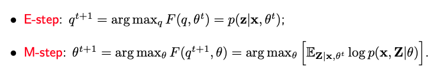

# 7.3. The EM Algorithm

## 7.3.1. The EM Algorithm

The Expectation-Maximization (EM) algorithm is an iterative technique designed to compute the Maximum Likelihood Estimation (MLE) by augmenting the sample data with unobserved latent variables. For instance, in the context of a two-component Gaussian distribution, while we observe $x_i$, the algorithm suggests an iterative method incorporating a latent variable $Z_i$ that denotes which component $x_i$ originates from. It's essential to note that $Z_i$ itself isn't observed; we exclusively observe $x_i$.

Let's denote our data as $\mathbf{x}=(x_1, ... x_n)$ with a corresponding log-likelihood expressed by a function of unknown parameters $\theta$. Utilizing the latent variables $\mathbf{Z} = (Z_1, ..., Z_n)$, the log-likelihood can be expressed as the logarithm of a summation. Specifically, in the case of the two-component Gaussian distribution, this sum iterates over all $z_i$ either taking the value one or two. A direct maximization of this function proves challenging due to the presence of the sum within the logarithm.

$$\log p(\mathbf{x} | \theta) = \log \sum_{\mathbf{z}} p(\mathbf{x}, \mathbf{z}| \theta) = \log \sum_{\mathbf{z}} p(\mathbf{z} | \theta) p(\mathbf{x} | \mathbf{z} , \theta).$$

The EM algorithm circumvents this difficulty, by operating under the assumption that if $\mathbf{Z}$ were known and subsequently working with the log of the joint likelihood:

$$\log p(\mathbf{x}, \mathbf{Z} | \theta) = \log p(\mathbf{Z} | \theta) + \log p(\mathbf{x} | \mathbf{Z}, \theta).$$

Throughout the derivations, I consistently utilize uppercase Z to emphasize that it is a random variable, given that it's not directly observed.

The EM algorithm consists of two iterative steps.

The first, known as the E-step, involves taking an expectation. While our aim is to work with the log of the joint likelihood, the absence of observed Z values compels us to begin with an initial parameter value, $\theta_0$, and compute the expectation of Z given both the data and the initial $\theta_0$. In scenarios like the two-component Gaussian distribution, the conditional distribution of $\mathbf{Z}$ given $\mathbf{x}$ and $\theta_0$ can be factored and computed independently for each $Z_i$. The expectation can be computed as a sum or integral, resulting in a function g.

Our next task is to find a $\theta_1$ value that maximizes g, subsequently replacing $\theta_0$ with $\theta_1$. This iterative process, alternating between the E and M steps, continues until convergence is achieved.

The heuristic iterative approach we've proposed for the two-component normal essentially mirrors the EM (Expectation-Maximization) algorithm.

## 7.3.2. Why It Works

One essential proof remains: After each iteration, the EM algorithm improves the marginal likelihood of X. This means that for every iteration, the new parameter value $\theta_1$ should yield a larger marginal likelihood than the previous value $\theta_0$.

To establish this, start by recalling the definition of $g(\theta)$, which is the expected value of the logarithm of the joint likelihood of $(\mathbf{x}, \mathbf{Z})$, where expectation is calculated with respect to $\mathbf{Z}$, conditional upon data $\mathbf{x}$ and $\theta_0$. Note that regardless of the $\theta$ value in $g(\theta)$, expectations are consistently taken with respect to $\mathbf{Z}$ given $\mathbf{x}$ and $\theta_0$.

$$g(\theta) = \mathbb{E}_{\mathbf{Z} | \mathbf{x}, \theta_0} \log p(\mathbf{x}, \mathbf{Z} | \theta)$$

Now consider $g(\theta_1) - g(\theta_0).$ Since the expectation remains consistent, this difference can be expressed as the logarithm of a ratio with $\theta_1$ in the numerator and $\theta_0$ in the denominator. Next, factor the joint likelihood of $(\mathbf{x}, \mathbf{Z})$ into the marginal likelihood of the marginal likelihood of $\mathbf{x}$ and the conditional likelihood of $\mathbf{Z}$ given $\mathbf{x}$ and whatever $\theta$ value.

$$\begin{split}
g(\theta_1) - g(\theta_0) &= \mathbb{E}_ {\mathbf{Z} | \mathbf{x}, \theta_0} \log \frac{p(\mathbf{x}, \mathbf{Z} | \theta_1)}{p(\mathbf{x}, \mathbf{Z} | \theta_0)}  = \mathbb{E}_ {\mathbf{Z} | \mathbf{x}, \theta_0} \log \frac{p(\mathbf{x} | \theta_1) p (\mathbf{Z} | \mathbf{x}, \theta_1)}{p(\mathbf{x} | \theta_0) p(\mathbf{Z} | \mathbf{x}, \theta_0)}  \\
&= \log \frac{p(\mathbf{x} | \theta_1)}{p(\mathbf{x} | \theta_0)} - \mathbb{E}_ {\mathbf{Z} | \mathbf{x}, \theta_0} \log \frac{p(\mathbf{Z} | \mathbf{x}, \theta_0)}{p( \mathbf{Z} | \mathbf{x}, \theta_1)}
\end{split}$$

We arrive at the final result by decomposing the terms inside the logarithm into two separate ratios. The ratio to the left, independent of Z, can be pulled outside of the expectation, while the ratio to the right is inverted and negated.

Rearranging these terms, we reach a specific expression:

$$\log \frac{p(\mathbf{x}| \theta_1)}{p(\mathbf{x} | \theta_0)}  = \underbrace{g(\theta_1) - g(\theta_0)}_{\ge 0} +  \underbrace{\mathbb{E}_ {\mathbf{Z} | \mathbf{x}, \theta_0} \log \frac{p(\mathbf{Z} | \mathbf{x}, \theta_0)}{p( \mathbf{Z} | \mathbf{x}, \theta_1)}}_{\ge 0}.$$

We can infer that the left-hand side is non-negative, since 1) the non-negativity of the KL-divergence between the two distributions over Z; and 2) our algorithm ensures that the difference $g(\theta_1) - g(\theta_0)$ remains non-negative. Hence, we confirm that the iterative process indeed improves the marginal likelihood with each step.

## 7.3.3. Connection with K-means

The EM algorithm for Gaussian mixtures bears a resemblance to the K-means algorithm. Let's dive deeper into their similarities and differences.

- **In the EM algorithm**: The $\gamma_i$'s are probabilities that lie between zero and one.
- **In the K-means algorithm**: The $\gamma_i$'s take on only two values: one or zero. This means each observation is assigned to the single cluster it is closest to.

A natural question that arises is: under what circumstances would the EM algorithm mimic the k-means algorithm? In other words, when would our $\gamma_i$'s be close to either one or zero?

To explore this, let's consider the ratio $\gamma_i/(1- \gamma_i)$. For the sake of simplicity, let's make an assumption that the variance of two normals are identical. Under this assumption, our ratio can be expressed as:

$$\frac{\pi}{1-\pi} \times \exp \Big ( -\frac{1}{\sigma^2}\big [ (x_i - \mu_1)^2 - (x_i - \mu_2)^2 \big ] \Big ).$$

Now, let's think of a scenario where $\sigma^2$ is very small, close to one. This implies that $\frac{1}{\sigma^2}$ is very large. If $x_i$ is just marginally closer to $\mu_1$, the resulting product inside the exponential function is a large negative number, making the ratio $\gamma_i/(1- \gamma_i)$ very large. Consequently, $\gamma_i$ approaches one. By the same logic, if $x_i$ is slightly closer to $\mu_2$, $\gamma_i$ nears zero.

In summary, the K-means algorithm can be perceived as a special case of the EM algorithm for Gaussian mixtures, where the error variance approaches zero.

## 7.3.4. An Alternative View of EM

Let's explore an alternative perspective on the EM algorithm, drawing from a paper by Neal and Hinton in 1998.

Envision the following objective function where the numerator represents the joint likelihood of $\mathbf{x}$ and $\mathbf{Z}$ given $\theta$ and the denominator is a distribution on $\mathbf{Z}$ – a pdf for continuous values or a probability mass function for discrete ones. On the right-hand side, we have our known data $\mathbf{x}$, with $\mathbf{Z}$ being integrated over (since we're taking the external expectation with respect to q). Both $\theta$ and the distribution q are unknown, making this a function of these two variables.

$$F(q, \theta) = \mathbb{E}_{q(\mathbf{Z})} \log \frac{p(\mathbf{x}, \mathbf{Z} | \theta)}{q(\mathbf{Z})}.$$

To manipulate this objective function, we'll employ a familiar technique. We'll factorize the numerator as a combination of the marginal of x and the conditional of Z given x. Since the marginal of x is independent of Z, we can extract this term from the expectation.

$$\begin{split}
F(q, \theta) &= \mathbb{E}_{q(\mathbf{Z})} \log \frac{p(\mathbf{x} | \theta) p(\mathbf{Z}| \mathbf{x}, \theta)}{q(\mathbf{Z})} \\
&=  \log p(\mathbf{x} | \theta) - \mathbb{E}_{q(\mathbf{Z})} \log \frac{q(\mathbf{Z})}{p(\mathbf{Z} | \mathbf{x}, \theta)}
\end{split}$$

This process divides our function into two segments: The first is the logarithm of the marginal of x, and the second, a negative KL divergence between two distributions over Z. To optimize F, we should maximize each segment individually. For the first term, we can attain its peak value by setting $\theta$ to its Maximum Likelihood Estimate (MLE), thereby maximizing $\log p(\mathbf{x} | \theta)$. For the second term, the goal is to minimize the KL divergence, ideally to zero, achieved by setting $q(\mathbf{z}) = p(\mathbf{z} | \mathbf{x}, \hat{\theta}_{\text{mle}})$. Essentially, we can deduce the MLE of $\theta$ by optimizing this function, F.

Now, how do we go about optimizing F? It becomes evident that the EM algorithm operates like a coordinate ascent on F. At each t-th iteration, given the current value of $\theta^t$, we determine the optimal q. As discussed, the ideal q minimizes the KL divergence, leading to $q(\mathbf{z}) = p(\mathbf{z} | \mathbf{x}, \theta^t)$. Subsequently, using the optimal q, we update $\theta$.

From this perspective, the EM algorithm's E-step and M-step are indistinguishable. They're both essentially M-steps, iteratively optimizing function F. This viewpoint offers a rationale for certain EM algorithm variants that may only partially implement the E or M steps, provided the ensuing q or $\theta$ values improve the function F.

Furthermore, in some applications, constraints are imposed on the q function, as highlighted in [Ganchev et al. (2007)](https://papers.nips.cc/paper_files/paper/2007/hash/73e5080f0f3804cb9cf470a8ce895dac-Abstract.html). Given the E-step can be seen as an M-step in this alternative view, integrating these constraints becomes more straightforward.

A significant advantage of this approach is its seamless transition to the variational version of the EM algorithm.

## 7.3.5. Variational EM

In the conventional EM algorithm, given a parameter $\theta$, the goal is to determine q that maximizes F by setting $q(\mathbf{z})$ to exactly match $p(\mathbf{z} | \mathbf{x}, \theta^t)$. However, this function might be computationally challenging to evaluate.

To make computations more manageable, we introduce an approximation to this function. For instance, $q(\mathbf{z})$ might be represented in a factorized manner, decomposing it into n different q functions, each corresponding to an individual latent variable $Z_i$. Using this form of q, our objective function now depends on $\theta$ and a series of q's ranging from $q_1$ to $q_n$:

$$F(\theta, q_1, \cdots, q_n) = \mathbb{E}_{q_1, \dots, q_n} \log \frac{p(\mathbf{x} | \theta) p(\mathbf{Z} | \mathbf{x}, \theta)}{q_1(Z_1) \cdots q_n(Z_n)}.$$

Employing coordinate descent, we iteratively optimize $\theta$ and each q. In many machine learning and statistical contexts, the updates in each iteration of the coordinate descent/ascent are straightforward, often possessing closed-form solutions. This ensures rapid algorithm convergence.

In the following section, I will introduce a more intricate mixture model than previously discussed. Due to its complexity, its parameters necessitate estimation through the variational EM, rather than the standard EM.
