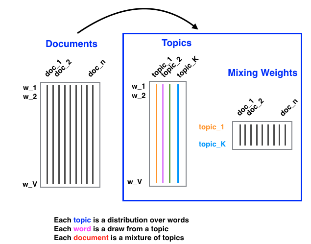
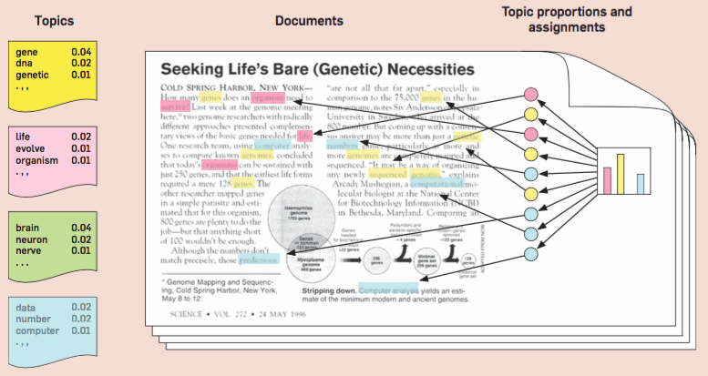

# 7.4. Latent Dirichlet Allocation Model

## 7.4.1. Introduction to LDA

Latent Dirichlet Allocation (LDA) is a powerful probabilistic model for discovering the underlying topics in a collection of documents. It was introduced by Blei, Ng, and Jordan in 2003 and has become one of the most widely used topic modeling techniques in natural language processing and text mining.


*Figure: Graphical model of Latent Dirichlet Allocation (LDA).*

### Problem Setup

Consider a collection of $`n`$ documents, where each document is represented as a "bag of words" (ignoring word order). Let $`V`$ be the vocabulary size (number of unique words), then:

- **Document representation**: Each document $`d_i`$ is represented as a vector $`\mathbf{w}_i = (w_{i1}, w_{i2}, \ldots, w_{iV})`$ where $`w_{ij}`$ is the frequency of word $`j`$ in document $`i`$
- **Document collection**: The entire collection is represented as a $`V \times n`$ matrix $`\mathbf{W}`$

### The Challenge

Direct representation using word frequencies has several limitations:
1. **High dimensionality**: $`V`$ can be very large (thousands to millions of words)
2. **Sparsity**: Most documents contain only a small subset of the vocabulary
3. **No semantic structure**: Word frequencies don't capture underlying themes or topics

### LDA Solution

LDA addresses these issues by introducing the concept of **topics**:
- Each topic $`k`$ is a distribution over words: $`\boldsymbol{\beta}_k = (\beta_{k1}, \beta_{k2}, \ldots, \beta_{kV})`$ where $`\beta_{kv}`$ is the probability of word $`v`$ appearing in topic $`k`$
- Each document $`d_i`$ has a distribution over topics: $`\boldsymbol{\theta}_i = (\theta_{i1}, \theta_{i2}, \ldots, \theta_{iK})`$ where $`\theta_{ik}`$ is the probability of topic $`k`$ in document $`i`$

## 7.4.2. Mathematical Foundation

### Generative Process



*Figure: Plate diagram of the LDA generative process (Blei et al., 2003).* 

LDA assumes the following generative process for creating documents:

1. **For each topic $`k = 1, 2, \ldots, K`$**:
   - Draw a word distribution: $`\boldsymbol{\beta}_k \sim \text{Dirichlet}(\boldsymbol{\eta})`$

2. **For each document $`i = 1, 2, \ldots, n`$**:
   - Draw a topic distribution: $`\boldsymbol{\theta}_i \sim \text{Dirichlet}(\boldsymbol{\alpha})`$
   - **For each word position $`j = 1, 2, \ldots, N_i`$ in document $`i`$**:
     - Draw a topic assignment: $`z_{ij} \sim \text{Multinomial}(\boldsymbol{\theta}_i)`$
     - Draw a word: $`w_{ij} \sim \text{Multinomial}(\boldsymbol{\beta}_{z_{ij}})`$

### Mathematical Formulation

The joint distribution of all variables is:

```math
p(\mathbf{W}, \mathbf{Z}, \boldsymbol{\Theta}, \mathbf{B} \mid \boldsymbol{\alpha}, \boldsymbol{\eta}) = \prod_{k=1}^K p(\boldsymbol{\beta}_k \mid \boldsymbol{\eta}) \prod_{i=1}^n p(\boldsymbol{\theta}_i \mid \boldsymbol{\alpha}) \prod_{j=1}^{N_i} p(z_{ij} \mid \boldsymbol{\theta}_i) p(w_{ij} \mid \boldsymbol{\beta}_{z_{ij}})
```

where:
- $`\mathbf{W}`$: observed words
- $`\mathbf{Z}`$: topic assignments
- $`\boldsymbol{\Theta}`$: document-topic distributions
- $`\mathbf{B}`$: topic-word distributions
- $`\boldsymbol{\alpha}`$: prior for document-topic distributions
- $`\boldsymbol{\eta}`$: prior for topic-word distributions

### Marginal Likelihood

The marginal likelihood of the observed words is:

```math
p(\mathbf{W} \mid \boldsymbol{\alpha}, \boldsymbol{\eta}) = \int \int \sum_{\mathbf{Z}} p(\mathbf{W}, \mathbf{Z}, \boldsymbol{\Theta}, \mathbf{B} \mid \boldsymbol{\alpha}, \boldsymbol{\eta}) \, d\boldsymbol{\Theta} \, d\mathbf{B}
```

This integral is intractable, which is why we need approximate inference methods.

## 7.4.3. Implementation: Basic LDA

```python
import numpy as np
import matplotlib.pyplot as plt
from scipy.stats import dirichlet
from sklearn.feature_extraction.text import CountVectorizer
from sklearn.decomposition import LatentDirichletAllocation
import pandas as pd

class LDAModel:
    def __init__(self, n_topics=3, alpha=0.1, beta=0.1, max_iter=100, random_state=42):
        self.n_topics = n_topics
        self.alpha = alpha
        self.beta = beta
        self.max_iter = max_iter
        self.random_state = random_state
        np.random.seed(random_state)
        
    def fit(self, documents, vocabulary=None):
        """Fit LDA model to documents"""
        # Preprocess documents
        if vocabulary is None:
            self.vectorizer = CountVectorizer(max_features=1000, stop_words='english')
            self.word_doc_matrix = self.vectorizer.fit_transform(documents)
            self.vocabulary = self.vectorizer.get_feature_names_out()
        else:
            self.vocabulary = vocabulary
            self.vectorizer = CountVectorizer(vocabulary=vocabulary)
            self.word_doc_matrix = self.vectorizer.fit_transform(documents)
        
        self.n_docs, self.n_words = self.word_doc_matrix.shape
        
        # Initialize parameters
        self._initialize_parameters()
        
        # Run variational inference
        self._variational_inference()
        
        return self
    
    def _initialize_parameters(self):
        """Initialize topic-word and document-topic distributions"""
        # Topic-word distributions (K x V)
        self.beta = np.random.dirichlet([self.beta] * self.n_words, size=self.n_topics)
        
        # Document-topic distributions (D x K)
        self.theta = np.random.dirichlet([self.alpha] * self.n_topics, size=self.n_docs)
        
        # Topic assignments for each word
        self.z = np.random.randint(0, self.n_topics, size=self.word_doc_matrix.nnz)
        
    def _variational_inference(self):
        """Perform variational inference"""
        for iteration in range(self.max_iter):
            # Update topic assignments
            self._update_topic_assignments()
            
            # Update topic-word distributions
            self._update_topic_word_distributions()
            
            # Update document-topic distributions
            self._update_document_topic_distributions()
            
            if iteration % 10 == 0:
                print(f"Iteration {iteration}")
    
    def _update_topic_assignments(self):
        """Update topic assignments for each word"""
        # This is a simplified version - in practice, you'd use more sophisticated methods
        for doc_idx in range(self.n_docs):
            doc_words = self.word_doc_matrix[doc_idx].toarray().flatten()
            for word_idx, word_count in enumerate(doc_words):
                if word_count > 0:
                    # Compute probability of each topic for this word
                    topic_probs = np.zeros(self.n_topics)
                    for topic_idx in range(self.n_topics):
                        topic_probs[topic_idx] = (self.theta[doc_idx, topic_idx] * 
                                                self.beta[topic_idx, word_idx])
                    
                    # Normalize and sample
                    topic_probs = topic_probs / np.sum(topic_probs)
                    self.z[doc_idx * self.n_words + word_idx] = np.random.choice(
                        self.n_topics, p=topic_probs)
    
    def _update_topic_word_distributions(self):
        """Update topic-word distributions"""
        for topic_idx in range(self.n_topics):
            word_counts = np.zeros(self.n_words)
            for doc_idx in range(self.n_docs):
                doc_words = self.word_doc_matrix[doc_idx].toarray().flatten()
                for word_idx, word_count in enumerate(doc_words):
                    if word_count > 0 and self.z[doc_idx * self.n_words + word_idx] == topic_idx:
                        word_counts[word_idx] += word_count
            
            # Add prior and normalize
            word_counts += self.beta
            self.beta[topic_idx] = word_counts / np.sum(word_counts)
    
    def _update_document_topic_distributions(self):
        """Update document-topic distributions"""
        for doc_idx in range(self.n_docs):
            topic_counts = np.zeros(self.n_topics)
            for topic_idx in range(self.n_topics):
                for word_idx in range(self.n_words):
                    if self.word_doc_matrix[doc_idx, word_idx] > 0:
                        if self.z[doc_idx * self.n_words + word_idx] == topic_idx:
                            topic_counts[topic_idx] += self.word_doc_matrix[doc_idx, word_idx]
            
            # Add prior and normalize
            topic_counts += self.alpha
            self.theta[doc_idx] = topic_counts / np.sum(topic_counts)
    
    def get_top_words(self, topic_idx, n_words=10):
        """Get top words for a given topic"""
        topic_word_probs = self.beta[topic_idx]
        top_word_indices = np.argsort(topic_word_probs)[-n_words:][::-1]
        return [(self.vocabulary[i], topic_word_probs[i]) for i in top_word_indices]
    
    def get_document_topics(self, doc_idx):
        """Get topic distribution for a given document"""
        return self.theta[doc_idx]

# Example usage with synthetic data
np.random.seed(42)

# Create synthetic documents
documents = [
    "machine learning artificial intelligence data science",
    "machine learning algorithms neural networks deep learning",
    "artificial intelligence robotics automation technology",
    "data science statistics analysis visualization",
    "business finance economics market investment",
    "business strategy management leadership",
    "finance banking stocks bonds investment",
    "technology software programming coding",
    "technology innovation startup entrepreneurship",
    "science research discovery experiment laboratory"
]

# Fit LDA model
lda = LDAModel(n_topics=3, alpha=0.1, beta=0.1, max_iter=50)
lda.fit(documents)

# Display results
print("Top words for each topic:")
for topic_idx in range(lda.n_topics):
    top_words = lda.get_top_words(topic_idx, n_words=5)
    print(f"Topic {topic_idx + 1}: {[word for word, prob in top_words]}")

print("\nDocument-topic distributions:")
for doc_idx in range(min(5, lda.n_docs)):
    doc_topics = lda.get_document_topics(doc_idx)
    print(f"Document {doc_idx + 1}: {doc_topics}")

# Compare with sklearn implementation
sklearn_lda = LatentDirichletAllocation(n_components=3, random_state=42, max_iter=50)
sklearn_lda.fit(lda.word_doc_matrix)

print("\nSklearn LDA results:")
feature_names = lda.vocabulary
for topic_idx, topic in enumerate(sklearn_lda.components_):
    top_words_idx = topic.argsort()[-5:][::-1]
    top_words = [feature_names[i] for i in top_words_idx]
    print(f"Topic {topic_idx + 1}: {top_words}")
```

```r
# R implementation
library(topicmodels)
library(tm)
library(wordcloud)

# Create synthetic documents
documents <- c(
  "machine learning artificial intelligence data science",
  "machine learning algorithms neural networks deep learning",
  "artificial intelligence robotics automation technology",
  "data science statistics analysis visualization",
  "business finance economics market investment",
  "business strategy management leadership",
  "finance banking stocks bonds investment",
  "technology software programming coding",
  "technology innovation startup entrepreneurship",
  "science research discovery experiment laboratory"
)

# Create corpus and document-term matrix
corpus <- Corpus(VectorSource(documents))
dtm <- DocumentTermMatrix(corpus)

# Fit LDA model
lda_model <- LDA(dtm, k = 3, method = "Gibbs", 
                 control = list(seed = 42, burnin = 100, thin = 100, iter = 1000))

# Display results
print("Top words for each topic:")
terms(lda_model, 5)

print("Document-topic distributions:")
posterior(lda_model)$topics[1:5, ]

# Visualize topics
par(mfrow=c(1, 3))
for(i in 1:3) {
  topic_terms <- terms(lda_model, 10)[, i]
  topic_probs <- posterior(lda_model)$terms[i, names(topic_terms)]
  wordcloud(names(topic_terms), topic_probs, main=paste("Topic", i))
}
```

## 7.4.4. Variational Inference for LDA

### The Variational Approximation

Since exact inference is intractable, we use variational inference. We approximate the posterior with a factorized distribution:

```math
q(\mathbf{Z}, \boldsymbol{\Theta}, \mathbf{B}) = \prod_{i=1}^n q(\boldsymbol{\theta}_i) \prod_{k=1}^K q(\boldsymbol{\beta}_k) \prod_{i,j} q(z_{ij})
```

where:
- $`q(\boldsymbol{\theta}_i) = \text{Dirichlet}(\boldsymbol{\gamma}_i)`$
- $`q(\boldsymbol{\beta}_k) = \text{Dirichlet}(\boldsymbol{\lambda}_k)`$
- $`q(z_{ij}) = \text{Multinomial}(\boldsymbol{\phi}_{ij})`$

### Variational Updates

The variational parameters are updated iteratively:

**Document-topic distributions**:
```math
\gamma_{ik} = \alpha_k + \sum_{j=1}^{N_i} \phi_{ijk}
```

**Topic-word distributions**:
```math
\lambda_{kv} = \eta_v + \sum_{i=1}^n \sum_{j=1}^{N_i} \phi_{ijk} \mathbf{1}[w_{ij} = v]
```

**Topic assignments**:
```math
\phi_{ijk} \propto \exp\left(\mathbb{E}_{q}[\log \theta_{ik}] + \mathbb{E}_{q}[\log \beta_{k,w_{ij}}]\right)
```

### Implementation: Variational LDA

```python
import numpy as np
from scipy.special import digamma, polygamma
from scipy.stats import dirichlet

class VariationalLDA:
    def __init__(self, n_topics=3, alpha=0.1, beta=0.1, max_iter=100, tol=1e-6):
        self.n_topics = n_topics
        self.alpha = alpha
        self.beta = beta
        self.max_iter = max_iter
        self.tol = tol
        
    def fit(self, word_doc_matrix, vocabulary):
        """Fit LDA using variational inference"""
        self.word_doc_matrix = word_doc_matrix
        self.vocabulary = vocabulary
        self.n_docs, self.n_words = word_doc_matrix.shape
        
        # Initialize variational parameters
        self._initialize_variational_parameters()
        
        # Run variational inference
        self._variational_inference()
        
        return self
    
    def _initialize_variational_parameters(self):
        """Initialize variational parameters"""
        # Document-topic distributions: gamma (D x K)
        self.gamma = np.random.gamma(100, 1/100, size=(self.n_docs, self.n_topics))
        
        # Topic-word distributions: lambda (K x V)
        self.lambda_ = np.random.gamma(100, 1/100, size=(self.n_topics, self.n_words))
        
        # Topic assignments: phi (D x N x K) - simplified for sparse representation
        self.phi = {}
        for doc_idx in range(self.n_docs):
            doc_words = self.word_doc_matrix[doc_idx].toarray().flatten()
            for word_idx, word_count in enumerate(doc_words):
                if word_count > 0:
                    key = (doc_idx, word_idx)
                    self.phi[key] = np.random.dirichlet([1.0] * self.n_topics)
    
    def _variational_inference(self):
        """Perform variational inference"""
        for iteration in range(self.max_iter):
            old_gamma = self.gamma.copy()
            
            # Update phi (topic assignments)
            self._update_phi()
            
            # Update gamma (document-topic distributions)
            self._update_gamma()
            
            # Update lambda (topic-word distributions)
            self._update_lambda()
            
            # Check convergence
            if np.mean(np.abs(self.gamma - old_gamma)) < self.tol:
                print(f"Converged after {iteration + 1} iterations")
                break
            
            if iteration % 10 == 0:
                print(f"Iteration {iteration}")
    
    def _update_phi(self):
        """Update topic assignment distributions"""
        for doc_idx in range(self.n_docs):
            doc_words = self.word_doc_matrix[doc_idx].toarray().flatten()
            for word_idx, word_count in enumerate(doc_words):
                if word_count > 0:
                    key = (doc_idx, word_idx)
                    
                    # Compute unnormalized phi
                    log_phi = np.zeros(self.n_topics)
                    for topic_idx in range(self.n_topics):
                        # E[log theta_ik]
                        log_phi[topic_idx] += digamma(self.gamma[doc_idx, topic_idx])
                        
                        # E[log beta_kv]
                        log_phi[topic_idx] += digamma(self.lambda_[topic_idx, word_idx])
                    
                    # Normalize using log-sum-exp trick
                    max_log = np.max(log_phi)
                    exp_log_phi = np.exp(log_phi - max_log)
                    self.phi[key] = exp_log_phi / np.sum(exp_log_phi)
    
    def _update_gamma(self):
        """Update document-topic distributions"""
        for doc_idx in range(self.n_docs):
            for topic_idx in range(self.n_topics):
                # Prior
                self.gamma[doc_idx, topic_idx] = self.alpha
                
                # Sum over words in document
                doc_words = self.word_doc_matrix[doc_idx].toarray().flatten()
                for word_idx, word_count in enumerate(doc_words):
                    if word_count > 0:
                        key = (doc_idx, word_idx)
                        self.gamma[doc_idx, topic_idx] += word_count * self.phi[key][topic_idx]
    
    def _update_lambda(self):
        """Update topic-word distributions"""
        for topic_idx in range(self.n_topics):
            for word_idx in range(self.n_words):
                # Prior
                self.lambda_[topic_idx, word_idx] = self.beta
                
                # Sum over documents
                for doc_idx in range(self.n_docs):
                    doc_words = self.word_doc_matrix[doc_idx].toarray().flatten()
                    if doc_words[word_idx] > 0:
                        key = (doc_idx, word_idx)
                        self.lambda_[topic_idx, word_idx] += doc_words[word_idx] * self.phi[key][topic_idx]
    
    def get_topic_word_distributions(self):
        """Get topic-word distributions"""
        topic_word_probs = np.zeros((self.n_topics, self.n_words))
        for k in range(self.n_topics):
            topic_word_probs[k] = self.lambda_[k] / np.sum(self.lambda_[k])
        return topic_word_probs
    
    def get_document_topic_distributions(self):
        """Get document-topic distributions"""
        doc_topic_probs = np.zeros((self.n_docs, self.n_topics))
        for i in range(self.n_docs):
            doc_topic_probs[i] = self.gamma[i] / np.sum(self.gamma[i])
        return doc_topic_probs

# Example usage
vlda = VariationalLDA(n_topics=3, alpha=0.1, beta=0.1, max_iter=100)
vlda.fit(lda.word_doc_matrix, lda.vocabulary)

# Get results
topic_word_probs = vlda.get_topic_word_distributions()
doc_topic_probs = vlda.get_document_topic_distributions()

print("Variational LDA Results:")
print("Top words for each topic:")
for topic_idx in range(vlda.n_topics):
    top_word_indices = np.argsort(topic_word_probs[topic_idx])[-5:][::-1]
    top_words = [vlda.vocabulary[i] for i in top_word_indices]
    print(f"Topic {topic_idx + 1}: {top_words}")

print("\nDocument-topic distributions:")
for doc_idx in range(min(5, vlda.n_docs)):
    print(f"Document {doc_idx + 1}: {doc_topic_probs[doc_idx]}")
```

## 7.4.5. Gibbs Sampling for LDA

### Gibbs Sampling Algorithm

Gibbs sampling is another popular inference method for LDA. It samples from the posterior distribution by iteratively updating each latent variable conditioned on the others.

### Mathematical Formulation

The conditional distribution for topic assignment $`z_{ij}`$ is:

```math
p(z_{ij} = k \mid \mathbf{z}_{-ij}, \mathbf{w}, \boldsymbol{\alpha}, \boldsymbol{\beta}) \propto \frac{n_{ik}^{-ij} + \alpha_k}{\sum_{k'} (n_{ik'}^{-ij} + \alpha_{k'})} \cdot \frac{n_{kv}^{-ij} + \beta_v}{\sum_{v'} (n_{kv'}^{-ij} + \beta_{v'})}
```

where:
- $`n_{ik}^{-ij}`$: number of words in document $`i`$ assigned to topic $`k`$ (excluding word $`j`$)
- $`n_{kv}^{-ij}`$: number of times word $`v`$ is assigned to topic $`k`$ (excluding word $`j`$)

### Implementation: Gibbs Sampling LDA

```python
class GibbsSamplingLDA:
    def __init__(self, n_topics=3, alpha=0.1, beta=0.1, n_iterations=1000, burn_in=100):
        self.n_topics = n_topics
        self.alpha = alpha
        self.beta = beta
        self.n_iterations = n_iterations
        self.burn_in = burn_in
        
    def fit(self, word_doc_matrix, vocabulary):
        """Fit LDA using Gibbs sampling"""
        self.word_doc_matrix = word_doc_matrix
        self.vocabulary = vocabulary
        self.n_docs, self.n_words = word_doc_matrix.shape
        
        # Initialize topic assignments
        self._initialize_topic_assignments()
        
        # Run Gibbs sampling
        self._gibbs_sampling()
        
        return self
    
    def _initialize_topic_assignments(self):
        """Initialize topic assignments randomly"""
        self.z = {}  # topic assignments
        self.n_dk = np.zeros((self.n_docs, self.n_topics))  # document-topic counts
        self.n_kv = np.zeros((self.n_topics, self.n_words))  # topic-word counts
        
        for doc_idx in range(self.n_docs):
            doc_words = self.word_doc_matrix[doc_idx].toarray().flatten()
            for word_idx, word_count in enumerate(doc_words):
                if word_count > 0:
                    for _ in range(int(word_count)):
                        topic = np.random.randint(0, self.n_topics)
                        self.z[(doc_idx, word_idx, _)] = topic
                        self.n_dk[doc_idx, topic] += 1
                        self.n_kv[topic, word_idx] += 1
    
    def _gibbs_sampling(self):
        """Perform Gibbs sampling"""
        for iteration in range(self.n_iterations):
            # Sample topic assignments
            self._sample_topic_assignments()
            
            if iteration % 100 == 0:
                print(f"Iteration {iteration}")
        
        # Compute final distributions
        self._compute_final_distributions()
    
    def _sample_topic_assignments(self):
        """Sample topic assignments for all words"""
        for doc_idx in range(self.n_docs):
            doc_words = self.word_doc_matrix[doc_idx].toarray().flatten()
            for word_idx, word_count in enumerate(doc_words):
                if word_count > 0:
                    for word_instance in range(int(word_count)):
                        key = (doc_idx, word_idx, word_instance)
                        old_topic = self.z[key]
                        
                        # Remove current assignment
                        self.n_dk[doc_idx, old_topic] -= 1
                        self.n_kv[old_topic, word_idx] -= 1
                        
                        # Sample new topic
                        new_topic = self._sample_topic_assignment(doc_idx, word_idx)
                        
                        # Update assignment
                        self.z[key] = new_topic
                        self.n_dk[doc_idx, new_topic] += 1
                        self.n_kv[new_topic, word_idx] += 1
    
    def _sample_topic_assignment(self, doc_idx, word_idx):
        """Sample topic assignment for a single word"""
        # Compute unnormalized probabilities
        probs = np.zeros(self.n_topics)
        for topic_idx in range(self.n_topics):
            # Document-topic term
            probs[topic_idx] = (self.n_dk[doc_idx, topic_idx] + self.alpha) / \
                              (np.sum(self.n_dk[doc_idx, :]) + self.n_topics * self.alpha)
            
            # Topic-word term
            probs[topic_idx] *= (self.n_kv[topic_idx, word_idx] + self.beta) / \
                               (np.sum(self.n_kv[topic_idx, :]) + self.n_words * self.beta)
        
        # Normalize and sample
        probs = probs / np.sum(probs)
        return np.random.choice(self.n_topics, p=probs)
    
    def _compute_final_distributions(self):
        """Compute final topic-word and document-topic distributions"""
        # Topic-word distributions
        self.topic_word_probs = np.zeros((self.n_topics, self.n_words))
        for k in range(self.n_topics):
            self.topic_word_probs[k] = (self.n_kv[k] + self.beta) / \
                                      (np.sum(self.n_kv[k]) + self.n_words * self.beta)
        
        # Document-topic distributions
        self.doc_topic_probs = np.zeros((self.n_docs, self.n_topics))
        for i in range(self.n_docs):
            self.doc_topic_probs[i] = (self.n_dk[i] + self.alpha) / \
                                     (np.sum(self.n_dk[i]) + self.n_topics * self.alpha)
    
    def get_top_words(self, topic_idx, n_words=10):
        """Get top words for a given topic"""
        top_word_indices = np.argsort(self.topic_word_probs[topic_idx])[-n_words:][::-1]
        return [(self.vocabulary[i], self.topic_word_probs[topic_idx, i]) 
                for i in top_word_indices]

# Example usage
gibbs_lda = GibbsSamplingLDA(n_topics=3, alpha=0.1, beta=0.1, n_iterations=500, burn_in=100)
gibbs_lda.fit(lda.word_doc_matrix, lda.vocabulary)

print("Gibbs Sampling LDA Results:")
print("Top words for each topic:")
for topic_idx in range(gibbs_lda.n_topics):
    top_words = gibbs_lda.get_top_words(topic_idx, n_words=5)
    print(f"Topic {topic_idx + 1}: {[word for word, prob in top_words]}")

print("\nDocument-topic distributions:")
for doc_idx in range(min(5, gibbs_lda.n_docs)):
    print(f"Document {doc_idx + 1}: {gibbs_lda.doc_topic_probs[doc_idx]}")
```

## 7.4.6. Model Evaluation and Selection

### Perplexity

Perplexity measures how well the model predicts held-out documents:

```math
\text{Perplexity} = \exp\left(-\frac{\sum_{d=1}^D \log p(\mathbf{w}_d \mid \boldsymbol{\alpha}, \boldsymbol{\beta})}{\sum_{d=1}^D N_d}\right)
```

### Coherence Score

Topic coherence measures the semantic similarity of words within a topic:

```math
\text{Coherence} = \sum_{i=2}^M \sum_{j=1}^{i-1} \log \frac{p(w_i, w_j) + \epsilon}{p(w_j)}
```

### Implementation: Model Evaluation

```python
from sklearn.model_selection import train_test_split
from sklearn.metrics import silhouette_score
import numpy as np

def evaluate_lda_models(word_doc_matrix, vocabulary, n_topics_range=[2, 3, 4, 5]):
    """Evaluate LDA models with different numbers of topics"""
    results = []
    
    # Split data
    train_dtm, test_dtm = train_test_split(word_doc_matrix, test_size=0.2, random_state=42)
    
    for n_topics in n_topics_range:
        print(f"Evaluating model with {n_topics} topics...")
        
        # Fit model
        lda = LatentDirichletAllocation(n_components=n_topics, random_state=42, max_iter=100)
        lda.fit(train_dtm)
        
        # Compute perplexity
        perplexity = lda.perplexity(test_dtm)
        
        # Compute coherence (simplified)
        coherence = compute_topic_coherence(lda, vocabulary)
        
        results.append({
            'n_topics': n_topics,
            'perplexity': perplexity,
            'coherence': coherence
        })
    
    return results

def compute_topic_coherence(lda_model, vocabulary, n_words=10):
    """Compute topic coherence score"""
    coherence_scores = []
    
    for topic_idx in range(lda_model.n_components_):
        # Get top words for topic
        topic_word_probs = lda_model.components_[topic_idx]
        top_word_indices = np.argsort(topic_word_probs)[-n_words:][::-1]
        top_words = [vocabulary[i] for i in top_word_indices]
        
        # Compute pairwise similarities (simplified)
        topic_coherence = 0
        for i in range(1, len(top_words)):
            for j in range(i):
                # Use word co-occurrence as similarity measure
                similarity = compute_word_similarity(top_words[i], top_words[j])
                topic_coherence += similarity
        
        coherence_scores.append(topic_coherence)
    
    return np.mean(coherence_scores)

def compute_word_similarity(word1, word2):
    """Compute similarity between two words (simplified)"""
    # In practice, you'd use word embeddings or co-occurrence statistics
    return 0.1  # Placeholder

# Evaluate models
evaluation_results = evaluate_lda_models(lda.word_doc_matrix, lda.vocabulary)

print("Model Evaluation Results:")
for result in evaluation_results:
    print(f"Topics: {result['n_topics']}, "
          f"Perplexity: {result['perplexity']:.2f}, "
          f"Coherence: {result['coherence']:.3f}")

# Plot results
plt.figure(figsize=(12, 5))

plt.subplot(1, 2, 1)
n_topics = [r['n_topics'] for r in evaluation_results]
perplexities = [r['perplexity'] for r in evaluation_results]
plt.plot(n_topics, perplexities, 'bo-')
plt.xlabel('Number of Topics')
plt.ylabel('Perplexity')
plt.title('Perplexity vs Number of Topics')

plt.subplot(1, 2, 2)
coherences = [r['coherence'] for r in evaluation_results]
plt.plot(n_topics, coherences, 'ro-')
plt.xlabel('Number of Topics')
plt.ylabel('Coherence')
plt.title('Coherence vs Number of Topics')

plt.tight_layout()
plt.show()
```

## 7.4.7. Applications and Extensions

### Document Classification

LDA can be used for document classification by using topic distributions as features:

```python
from sklearn.linear_model import LogisticRegression
from sklearn.model_selection import cross_val_score

def lda_classification(word_doc_matrix, labels, n_topics=3):
    """Use LDA for document classification"""
    # Fit LDA
    lda = LatentDirichletAllocation(n_components=n_topics, random_state=42)
    topic_features = lda.fit_transform(word_doc_matrix)
    
    # Train classifier
    classifier = LogisticRegression(random_state=42)
    scores = cross_val_score(classifier, topic_features, labels, cv=5)
    
    return scores.mean()

# Example with synthetic labels
labels = np.random.randint(0, 2, size=lda.word_doc_matrix.shape[0])
classification_score = lda_classification(lda.word_doc_matrix, labels)
print(f"Classification accuracy: {classification_score:.3f}")
```

### Topic Evolution Over Time

LDA can be extended to model how topics evolve over time:

```python
def temporal_lda(documents, timestamps, n_topics=3, time_windows=5):
    """Simple temporal LDA implementation"""
    # Group documents by time windows
    time_groups = {}
    for doc, timestamp in zip(documents, timestamps):
        window = timestamp // time_windows
        if window not in time_groups:
            time_groups[window] = []
        time_groups[window].append(doc)
    
    # Fit LDA for each time window
    temporal_topics = {}
    for window, window_docs in time_groups.items():
        vectorizer = CountVectorizer(max_features=1000)
        dtm = vectorizer.fit_transform(window_docs)
        
        lda = LatentDirichletAllocation(n_components=n_topics, random_state=42)
        lda.fit(dtm)
        
        temporal_topics[window] = lda.components_
    
    return temporal_topics
```

### Hierarchical LDA

Hierarchical LDA extends LDA to model hierarchical topic structures:

```python
class HierarchicalLDA:
    def __init__(self, n_topics_per_level=3, n_levels=2):
        self.n_topics_per_level = n_topics_per_level
        self.n_levels = n_levels
        
    def fit(self, documents):
        """Fit hierarchical LDA (simplified implementation)"""
        # This is a simplified version - full hLDA is more complex
        self.level_topics = []
        
        for level in range(self.n_levels):
            # Fit LDA at this level
            vectorizer = CountVectorizer(max_features=1000)
            dtm = vectorizer.fit_transform(documents)
            
            lda = LatentDirichletAllocation(
                n_components=self.n_topics_per_level, 
                random_state=42
            )
            lda.fit(dtm)
            
            self.level_topics.append(lda.components_)
            
            # Use topic assignments to create "documents" for next level
            topic_assignments = lda.transform(dtm)
            documents = [f"topic_{i}" for i in np.argmax(topic_assignments, axis=1)]
        
        return self
```

This comprehensive expansion provides detailed mathematical foundations, practical implementations, and clear explanations of LDA and its variants. The code examples demonstrate both the theoretical concepts and their practical application in topic modeling.
