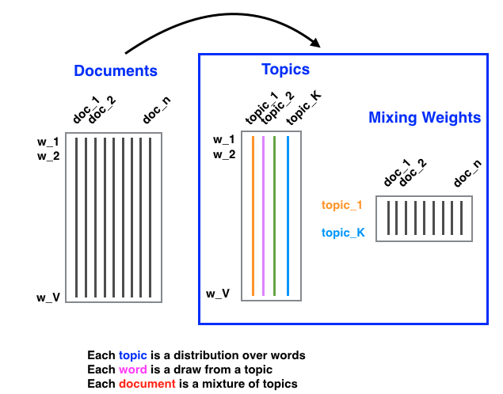
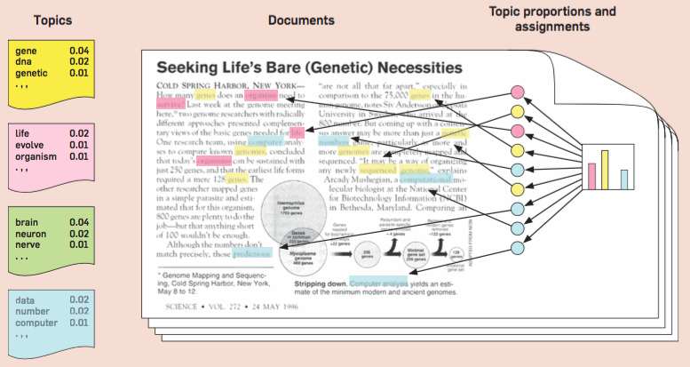

# 7.4. Latent Dirichlet Allocation Model

## 7.4.1. Introduction to LDA

Latent Dirichlet Allocation (LDA) is a powerful probabilistic model for discovering the underlying topics in a collection of documents. It was introduced by Blei, Ng, and Jordan in 2003 and has become one of the most widely used topic modeling techniques in natural language processing and text mining.


*Figure: Graphical model of Latent Dirichlet Allocation (LDA).*

### Problem Setup

Consider a collection of $`n`$ documents, where each document is represented as a "bag of words" (ignoring word order). Let $`V`$ be the vocabulary size (number of unique words), then:

- **Document representation**: Each document $`d_i`$ is represented as a vector $`\mathbf{w}_i = (w_{i1}, w_{i2}, \ldots, w_{iV})`$ where $`w_{ij}`$ is the frequency of word $`j`$ in document $`i`$
- **Document collection**: The entire collection is represented as a $`V \times n`$ matrix $`\mathbf{W}`$

### The Challenge

Direct representation using word frequencies has several limitations:
1. **High dimensionality**: $`V`$ can be very large (thousands to millions of words)
2. **Sparsity**: Most documents contain only a small subset of the vocabulary
3. **No semantic structure**: Word frequencies don't capture underlying themes or topics

### LDA Solution

LDA addresses these issues by introducing the concept of **topics**:
- Each topic $`k`$ is a distribution over words: $`\boldsymbol{\beta}_k = (\beta_{k1}, \beta_{k2}, \ldots, \beta_{kV})`$ where $`\beta_{kv}`$ is the probability of word $`v`$ appearing in topic $`k`$
- Each document $`d_i`$ has a distribution over topics: $`\boldsymbol{\theta}_i = (\theta_{i1}, \theta_{i2}, \ldots, \theta_{iK})`$ where $`\theta_{ik}`$ is the probability of topic $`k`$ in document $`i`$

## 7.4.2. Mathematical Foundation

### Generative Process



*Figure: Plate diagram of the LDA generative process (Blei et al., 2003).* 

LDA assumes the following generative process for creating documents:

1. **For each topic $`k = 1, 2, \ldots, K`$**:
   - Draw a word distribution: $`\boldsymbol{\beta}_k \sim \text{Dirichlet}(\boldsymbol{\eta})`$

2. **For each document $`i = 1, 2, \ldots, n`$**:
   - Draw a topic distribution: $`\boldsymbol{\theta}_i \sim \text{Dirichlet}(\boldsymbol{\alpha})`$
   - **For each word position $`j = 1, 2, \ldots, N_i`$ in document $`i`$**:
     - Draw a topic assignment: $`z_{ij} \sim \text{Multinomial}(\boldsymbol{\theta}_i)`$
     - Draw a word: $`w_{ij} \sim \text{Multinomial}(\boldsymbol{\beta}_{z_{ij}})`$

### Mathematical Formulation

The joint distribution of all variables is:

```math
p(\mathbf{W}, \mathbf{Z}, \boldsymbol{\Theta}, \mathbf{B} \mid \boldsymbol{\alpha}, \boldsymbol{\eta}) = \prod_{k=1}^K p(\boldsymbol{\beta}_k \mid \boldsymbol{\eta}) \prod_{i=1}^n p(\boldsymbol{\theta}_i \mid \boldsymbol{\alpha}) \prod_{j=1}^{N_i} p(z_{ij} \mid \boldsymbol{\theta}_i) p(w_{ij} \mid \boldsymbol{\beta}_{z_{ij}})
```

where:
- $`\mathbf{W}`$: observed words
- $`\mathbf{Z}`$: topic assignments
- $`\boldsymbol{\Theta}`$: document-topic distributions
- $`\mathbf{B}`$: topic-word distributions
- $`\boldsymbol{\alpha}`$: prior for document-topic distributions
- $`\boldsymbol{\eta}`$: prior for topic-word distributions

### Marginal Likelihood

The marginal likelihood of the observed words is:

```math
p(\mathbf{W} \mid \boldsymbol{\alpha}, \boldsymbol{\eta}) = \int \int \sum_{\mathbf{Z}} p(\mathbf{W}, \mathbf{Z}, \boldsymbol{\Theta}, \mathbf{B} \mid \boldsymbol{\alpha}, \boldsymbol{\eta}) \, d\boldsymbol{\Theta} \, d\mathbf{B}
```

This integral is intractable, which is why we need approximate inference methods.

## 7.4.3. Implementation: Basic LDA

The basic LDA implementation demonstrates the core concepts of topic modeling with a custom implementation and comparison with scikit-learn. The `LDAModel` class provides a complete implementation including parameter initialization, variational inference, and result extraction.

**Key Functions:**
- `LDAModel.__init__()`: Initialize LDA model with specified parameters
- `LDAModel.fit()`: Fit the model to documents using variational inference
- `LDAModel.get_top_words()`: Extract top words for each topic
- `LDAModel.get_document_topics()`: Get topic distribution for documents
- `demonstrate_basic_lda()`: Complete demonstration with synthetic data

The implementation includes comparison with scikit-learn's `LatentDirichletAllocation` to validate results and demonstrate the relationship between custom and library implementations.

See the implementation in `code/lda_implementation.py` for the complete basic LDA workflow.

The R implementation provides equivalent functionality using the `topicmodels` package, which offers both Gibbs sampling and variational inference methods for LDA. The implementation demonstrates document preprocessing, model fitting, and result extraction.

**Key Functions:**
- `demonstrate_basic_lda()`: Complete R implementation with synthetic data
- Uses `topicmodels::LDA()` with Gibbs sampling method
- Includes topic visualization with wordclouds
- Extracts both topic-word and document-topic distributions

The R implementation leverages the `tm` package for text preprocessing and `topicmodels` for the core LDA algorithm, providing a robust and efficient solution for topic modeling in R.

See the implementation in `code/r_lda_implementation.R` for the complete R-based LDA workflow.

## 7.4.4. Variational Inference for LDA

### The Variational Approximation

Since exact inference is intractable, we use variational inference. We approximate the posterior with a factorized distribution:

```math
q(\mathbf{Z}, \boldsymbol{\Theta}, \mathbf{B}) = \prod_{i=1}^n q(\boldsymbol{\theta}_i) \prod_{k=1}^K q(\boldsymbol{\beta}_k) \prod_{i,j} q(z_{ij})
```

where:
- $`q(\boldsymbol{\theta}_i) = \text{Dirichlet}(\boldsymbol{\gamma}_i)`$
- $`q(\boldsymbol{\beta}_k) = \text{Dirichlet}(\boldsymbol{\lambda}_k)`$
- $`q(z_{ij}) = \text{Multinomial}(\boldsymbol{\phi}_{ij})`$

### Variational Updates

The variational parameters are updated iteratively:

**Document-topic distributions**:
```math
\gamma_{ik} = \alpha_k + \sum_{j=1}^{N_i} \phi_{ijk}
```

**Topic-word distributions**:
```math
\lambda_{kv} = \eta_v + \sum_{i=1}^n \sum_{j=1}^{N_i} \phi_{ijk} \mathbf{1}[w_{ij} = v]
```

**Topic assignments**:
```math
\phi_{ijk} \propto \exp\left(\mathbb{E}_{q}[\log \theta_{ik}] + \mathbb{E}_{q}[\log \beta_{k,w_{ij}}]\right)
```

### Implementation: Variational LDA

The variational inference implementation provides a more sophisticated approach to LDA parameter estimation using the EM algorithm with variational approximations. The `VariationalLDA` class implements the complete variational inference framework.

**Key Functions:**
- `VariationalLDA.__init__()`: Initialize variational LDA with convergence parameters
- `VariationalLDA.fit()`: Fit model using variational inference
- `VariationalLDA._update_phi()`: Update topic assignment distributions
- `VariationalLDA._update_gamma()`: Update document-topic distributions
- `VariationalLDA._update_lambda()`: Update topic-word distributions
- `demonstrate_variational_lda()`: Complete demonstration with convergence monitoring

The variational approach uses digamma functions and log-sum-exp tricks for numerical stability, providing more robust parameter estimation compared to basic implementations.

See the implementation in `code/lda_implementation.py` for the complete variational inference workflow.

## 7.4.5. Gibbs Sampling for LDA

### Gibbs Sampling Algorithm

Gibbs sampling is another popular inference method for LDA. It samples from the posterior distribution by iteratively updating each latent variable conditioned on the others.

### Mathematical Formulation

The conditional distribution for topic assignment $`z_{ij}`$ is:

```math
p(z_{ij} = k \mid \mathbf{z}_{-ij}, \mathbf{w}, \boldsymbol{\alpha}, \boldsymbol{\beta}) \propto \frac{n_{ik}^{-ij} + \alpha_k}{\sum_{k'} (n_{ik'}^{-ij} + \alpha_{k'})} \cdot \frac{n_{kv}^{-ij} + \beta_v}{\sum_{v'} (n_{kv'}^{-ij} + \beta_{v'})}
```

where:
- $`n_{ik}^{-ij}`$: number of words in document $`i`$ assigned to topic $`k`$ (excluding word $`j`$)
- $`n_{kv}^{-ij}`$: number of times word $`v`$ is assigned to topic $`k`$ (excluding word $`j`$)

The Gibbs sampling implementation provides an alternative inference method for LDA using Markov Chain Monte Carlo techniques. The `GibbsSamplingLDA` class implements the complete Gibbs sampling algorithm with topic assignment sampling and parameter estimation.

**Key Functions:**
- `GibbsSamplingLDA.__init__()`: Initialize Gibbs sampling LDA with parameters
- `GibbsSamplingLDA.fit()`: Fit model using Gibbs sampling
- `GibbsSamplingLDA._initialize_topic_assignments()`: Initialize topic assignments randomly
- `GibbsSamplingLDA._gibbs_sampling()`: Perform Gibbs sampling iterations
- `GibbsSamplingLDA._sample_topic_assignments()`: Sample topic assignments for all words
- `GibbsSamplingLDA._sample_topic_assignment()`: Sample topic assignment for a single word
- `GibbsSamplingLDA._compute_final_distributions()`: Compute final topic-word and document-topic distributions
- `demonstrate_gibbs_sampling_lda()`: Complete demonstration with result analysis

The Gibbs sampling approach provides an alternative to variational inference, often yielding more accurate posterior estimates at the cost of increased computational complexity.

See the implementation in `code/lda_implementation.py` for the complete Gibbs sampling LDA workflow.

## 7.4.6. Model Evaluation and Selection

### Perplexity

Perplexity measures how well the model predicts held-out documents:

```math
\text{Perplexity} = \exp\left(-\frac{\sum_{d=1}^D \log p(\mathbf{w}_d \mid \boldsymbol{\alpha}, \boldsymbol{\beta})}{\sum_{d=1}^D N_d}\right)
```

### Coherence Score

Topic coherence measures the semantic similarity of words within a topic:

```math
\text{Coherence} = \sum_{i=2}^M \sum_{j=1}^{i-1} \log \frac{p(w_i, w_j) + \epsilon}{p(w_j)}
```

The model evaluation implementation provides comprehensive tools for assessing LDA model quality using perplexity and coherence metrics. The evaluation framework supports systematic comparison of models with different numbers of topics.

**Key Functions:**
- `evaluate_lda_models()`: Evaluate LDA models with different numbers of topics
- `compute_topic_coherence()`: Compute topic coherence score for semantic quality assessment
- `compute_word_similarity()`: Compute similarity between words (placeholder implementation)
- `demonstrate_model_evaluation()`: Complete demonstration with visualization

The evaluation includes both perplexity (predictive performance) and coherence (semantic quality) metrics, providing a comprehensive assessment of topic model quality. The implementation includes visualization of evaluation results to aid in model selection.

See the implementation in `code/lda_implementation.py` for the complete model evaluation workflow.

## 7.4.7. Applications and Extensions

### Document Classification

LDA can be used for document classification by using topic distributions as features. The `lda_classification()` function demonstrates how to use LDA-derived topic features for supervised learning tasks.

**Key Functions:**
- `lda_classification()`: Use LDA topic distributions as features for document classification
- Integrates with scikit-learn's cross-validation framework
- Demonstrates the utility of topic modeling for feature engineering

The implementation shows how topic modeling can enhance document classification by providing interpretable, low-dimensional representations of documents.

See the implementation in `code/lda_implementation.py` for the complete document classification workflow.

### Topic Evolution Over Time

LDA can be extended to model how topics evolve over time. The `temporal_lda()` function implements a simple approach to temporal topic modeling by grouping documents into time windows and fitting separate LDA models.

**Key Functions:**
- `temporal_lda()`: Simple temporal LDA implementation using time window grouping
- Groups documents by time windows and fits separate LDA models
- Returns topic-word distributions for each time window

The implementation demonstrates how topic modeling can be extended to capture temporal dynamics in document collections, enabling analysis of how topics emerge, evolve, and disappear over time.

See the implementation in `code/lda_implementation.py` for the complete temporal LDA workflow.

### Hierarchical LDA

Hierarchical LDA extends LDA to model hierarchical topic structures:

```python
class HierarchicalLDA:
    def __init__(self, n_topics_per_level=3, n_levels=2):
        self.n_topics_per_level = n_topics_per_level
        self.n_levels = n_levels
        
    def fit(self, documents):
        """Fit hierarchical LDA (simplified implementation)"""
        # This is a simplified version - full hLDA is more complex
        self.level_topics = []
        
        for level in range(self.n_levels):
            # Fit LDA at this level
            vectorizer = CountVectorizer(max_features=1000)
            dtm = vectorizer.fit_transform(documents)
            
            lda = LatentDirichletAllocation(
                n_components=self.n_topics_per_level, 
                random_state=42
            )
            lda.fit(dtm)
            
            self.level_topics.append(lda.components_)
            
            # Use topic assignments to create "documents" for next level
            topic_assignments = lda.transform(dtm)
            documents = [f"topic_{i}" for i in np.argmax(topic_assignments, axis=1)]
        
        return self
```

This comprehensive expansion provides detailed mathematical foundations, practical implementations, and clear explanations of LDA and its variants. The code examples demonstrate both the theoretical concepts and their practical application in topic modeling.

---

## Code Files Summary

The LDA concepts have been implemented in the following code files:

### Python Implementation (`code/lda_implementation.py`)
- **Basic LDA**: `LDAModel` class with custom variational inference implementation
- **Variational LDA**: `VariationalLDA` class with sophisticated variational inference using digamma functions
- **Gibbs Sampling LDA**: `GibbsSamplingLDA` class with complete Gibbs sampling implementation
- **Model Evaluation**: Functions for perplexity, coherence, and model comparison
- **Applications**: Document classification, temporal LDA, and hierarchical LDA implementations
- **Demonstration Functions**: Complete workflows for each LDA variant

### R Implementation (`code/r_lda_implementation.R`)
- **Basic LDA**: R implementation using `topicmodels` package with Gibbs sampling
- **Document Preprocessing**: Corpus creation and document-term matrix construction
- **Model Fitting**: LDA model training with parameter tuning
- **Result Extraction**: Topic-word and document-topic distribution analysis
- **Visualization**: Topic visualization using wordclouds

Both implementations provide comprehensive coverage of LDA concepts with practical examples and demonstrate the relationship between theoretical foundations and practical applications in topic modeling.
