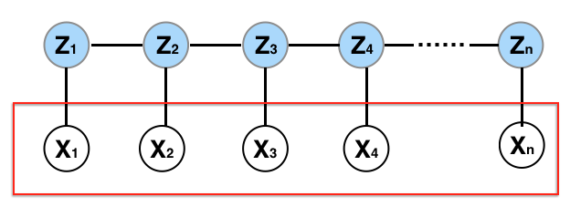

# 7.5. Hidden Markov Models

## 7.5.1. Introduction to Hidden Markov Models

Hidden Markov Models (HMMs) are powerful probabilistic models for analyzing sequential data where the underlying states are not directly observable. They have found applications in speech recognition, bioinformatics, natural language processing, financial modeling, and many other fields.



*Figure: Graphical model of a basic Hidden Markov Model (HMM).*

### Problem Setup

Consider a sequence of observations $`X_1, X_2, \ldots, X_n`$ where each $`X_t`$ is generated by an underlying hidden state $`Z_t`$. The key assumptions are:

1. **Markov Property**: The hidden states follow a Markov chain: $`P(Z_t \mid Z_{t-1}, Z_{t-2}, \ldots) = P(Z_t \mid Z_{t-1})`$
2. **Conditional Independence**: Given the hidden state $`Z_t`$, the observation $`X_t`$ is independent of all other observations and states
3. **Stationarity**: The transition and emission probabilities are time-invariant

### Mathematical Formulation

The joint probability of observations and hidden states is:

```math
P(X_1, \ldots, X_n, Z_1, \ldots, Z_n) = P(Z_1) \prod_{t=2}^n P(Z_t \mid Z_{t-1}) \prod_{t=1}^n P(X_t \mid Z_t)
```

This factorization reflects the conditional independence structure of the HMM.

## 7.5.2. The Dishonest Casino Example

### Problem Description

Consider a dishonest casino that uses two dice:
- **Fair Die**: Each number (1-6) has probability $`1/6`$
- **Loaded Die**: Number 6 has probability $`1/2`$, other numbers have probability $`1/10`$ each

The casino switches between dice according to a Markov process, but observers only see the roll outcomes.

### Mathematical Setup

**Hidden States** $`Z_t \in \{F, L\}`$ (Fair, Loaded):
- Initial distribution: $`\pi = [P(Z_1 = F), P(Z_1 = L)]`$
- Transition matrix: $`A = \begin{bmatrix} P(F \mid F) & P(L \mid F) \\ P(F \mid L) & P(L \mid L) \end{bmatrix}`$

**Observations** $`X_t \in \{1, 2, 3, 4, 5, 6\}`$:
- Emission matrix: $`B = \begin{bmatrix} P(X=1 \mid F) & \cdots & P(X=6 \mid F) \\ P(X=1 \mid L) & \cdots & P(X=6 \mid L) \end{bmatrix}`$

### Implementation: Dishonest Casino HMM

```python
import numpy as np
import matplotlib.pyplot as plt
from hmmlearn import hmm
import seaborn as sns

class DishonestCasinoHMM:
    def __init__(self, n_states=2, n_observations=6):
        self.n_states = n_states
        self.n_observations = n_observations
        
        # Initialize parameters
        self.pi = np.array([0.5, 0.5])  # Initial state distribution
        
        # Transition matrix (Fair -> Fair, Fair -> Loaded, Loaded -> Fair, Loaded -> Loaded)
        self.A = np.array([[0.95, 0.05], [0.1, 0.9]])
        
        # Emission matrix
        self.B = np.array([
            [1/6, 1/6, 1/6, 1/6, 1/6, 1/6],  # Fair die
            [1/10, 1/10, 1/10, 1/10, 1/10, 1/2]  # Loaded die
        ])
        
    def generate_sequence(self, length=100):
        """Generate a sequence of observations and hidden states"""
        observations = []
        hidden_states = []
        
        # Generate initial state
        z = np.random.choice([0, 1], p=self.pi)
        hidden_states.append(z)
        
        # Generate observations
        for t in range(length):
            # Generate observation given current state
            x = np.random.choice(range(1, 7), p=self.B[z])
            observations.append(x)
            
            # Generate next state
            if t < length - 1:
                z = np.random.choice([0, 1], p=self.A[z])
                hidden_states.append(z)
        
        return np.array(observations), np.array(hidden_states)
    
    def forward_algorithm(self, observations):
        """Compute forward probabilities"""
        n_obs = len(observations)
        alpha = np.zeros((n_obs, self.n_states))
        
        # Initialization
        for i in range(self.n_states):
            alpha[0, i] = self.pi[i] * self.B[i, observations[0] - 1]
        
        # Forward recursion
        for t in range(1, n_obs):
            for j in range(self.n_states):
                alpha[t, j] = self.B[j, observations[t] - 1] * np.sum(alpha[t-1, :] * self.A[:, j])
        
        return alpha
    
    def backward_algorithm(self, observations):
        """Compute backward probabilities"""
        n_obs = len(observations)
        beta = np.zeros((n_obs, self.n_states))
        
        # Initialization
        beta[n_obs-1, :] = 1.0
        
        # Backward recursion
        for t in range(n_obs-2, -1, -1):
            for i in range(self.n_states):
                beta[t, i] = np.sum(self.A[i, :] * self.B[:, observations[t+1] - 1] * beta[t+1, :])
        
        return beta
    
    def viterbi_algorithm(self, observations):
        """Find most likely sequence of hidden states"""
        n_obs = len(observations)
        delta = np.zeros((n_obs, self.n_states))
        psi = np.zeros((n_obs, self.n_states), dtype=int)
        
        # Initialization
        for i in range(self.n_states):
            delta[0, i] = self.pi[i] * self.B[i, observations[0] - 1]
        
        # Forward recursion
        for t in range(1, n_obs):
            for j in range(self.n_states):
                delta[t, j] = self.B[j, observations[t] - 1] * np.max(delta[t-1, :] * self.A[:, j])
                psi[t, j] = np.argmax(delta[t-1, :] * self.A[:, j])
        
        # Backtracking
        path = np.zeros(n_obs, dtype=int)
        path[n_obs-1] = np.argmax(delta[n_obs-1, :])
        
        for t in range(n_obs-2, -1, -1):
            path[t] = psi[t+1, path[t+1]]
        
        return path, delta
    
    def baum_welch_algorithm(self, observations, max_iter=100, tol=1e-6):
        """Estimate HMM parameters using EM algorithm"""
        n_obs = len(observations)
        
        for iteration in range(max_iter):
            # E-step: Compute forward and backward probabilities
            alpha = self.forward_algorithm(observations)
            beta = self.backward_algorithm(observations)
            
            # Compute gamma and xi
            gamma = alpha * beta
            gamma = gamma / np.sum(gamma, axis=1, keepdims=True)
            
            xi = np.zeros((n_obs-1, self.n_states, self.n_states))
            for t in range(n_obs-1):
                for i in range(self.n_states):
                    for j in range(self.n_states):
                        xi[t, i, j] = (alpha[t, i] * self.A[i, j] * 
                                     self.B[j, observations[t+1] - 1] * beta[t+1, j])
                xi[t] = xi[t] / np.sum(xi[t])
            
            # M-step: Update parameters
            old_A = self.A.copy()
            old_B = self.B.copy()
            
            # Update initial distribution
            self.pi = gamma[0, :]
            
            # Update transition matrix
            for i in range(self.n_states):
                for j in range(self.n_states):
                    self.A[i, j] = np.sum(xi[:, i, j]) / np.sum(gamma[:-1, i])
            
            # Update emission matrix
            for i in range(self.n_states):
                for k in range(self.n_observations):
                    mask = (observations == k + 1)
                    self.B[i, k] = np.sum(gamma[mask, i]) / np.sum(gamma[:, i])
            
            # Check convergence
            if (np.max(np.abs(self.A - old_A)) < tol and 
                np.max(np.abs(self.B - old_B)) < tol):
                print(f"Converged after {iteration + 1} iterations")
                break
        
        return self

# Example usage
np.random.seed(42)
casino = DishonestCasinoHMM()

# Generate data
observations, true_states = casino.generate_sequence(100)

print("Generated sequence statistics:")
print(f"Number of 6s: {np.sum(observations == 6)}")
print(f"Proportion of 6s: {np.mean(observations == 6):.3f}")

# Fit HMM using Baum-Welch
fitted_casino = DishonestCasinoHMM()
fitted_casino.baum_welch_algorithm(observations)

print("\nTrue parameters:")
print("Transition matrix:")
print(casino.A)
print("Emission matrix:")
print(casino.B)

print("\nFitted parameters:")
print("Transition matrix:")
print(fitted_casino.A)
print("Emission matrix:")
print(fitted_casino.B)

# Viterbi decoding
viterbi_states, delta = fitted_casino.viterbi_algorithm(observations)

print(f"\nViterbi decoding accuracy: {np.mean(viterbi_states == true_states):.3f}")

# Visualize results
fig, (ax1, ax2, ax3) = plt.subplots(3, 1, figsize=(12, 8))

# Observations
ax1.plot(observations, 'b-', alpha=0.7, label='Observations')
ax1.set_title('Casino Dice Rolls')
ax1.set_ylabel('Dice Value')
ax1.legend()

# True states
ax2.plot(true_states, 'g-', label='True States (0=Fair, 1=Loaded)')
ax2.set_title('True Hidden States')
ax2.set_ylabel('State')
ax2.legend()

# Viterbi states
ax3.plot(viterbi_states, 'r-', label='Viterbi Decoded States')
ax3.set_title('Viterbi Decoded States')
ax3.set_ylabel('State')
ax3.set_xlabel('Time')
ax3.legend()

plt.tight_layout()
plt.show()
```

```r
# R implementation
library(HMM)
library(ggplot2)

# Create dishonest casino HMM
create_dishonest_casino <- function() {
  # States: Fair (1), Loaded (2)
  states <- c("Fair", "Loaded")
  
  # Symbols: Dice values 1-6
  symbols <- c("1", "2", "3", "4", "5", "6")
  
  # Initial distribution
  startProbs <- c(0.5, 0.5)
  
  # Transition matrix
  transProbs <- matrix(c(0.95, 0.05, 0.1, 0.9), nrow=2, byrow=TRUE)
  
  # Emission matrix
  emissionProbs <- matrix(c(
    1/6, 1/6, 1/6, 1/6, 1/6, 1/6,      # Fair die
    1/10, 1/10, 1/10, 1/10, 1/10, 1/2  # Loaded die
  ), nrow=2, byrow=TRUE)
  
  # Create HMM
  hmm <- initHMM(states, symbols, startProbs, transProbs, emissionProbs)
  return(hmm)
}

# Generate sequence
set.seed(42)
casino_hmm <- create_dishonest_casino()
simulation <- simHMM(casino_hmm, 100)

observations <- simulation$observation
true_states <- simulation$states

cat("Generated sequence statistics:\n")
cat("Number of 6s:", sum(observations == "6"), "\n")
cat("Proportion of 6s:", mean(observations == "6"), "\n")

# Baum-Welch algorithm for parameter estimation
baum_welch <- function(observations, n_states=2, n_symbols=6, max_iter=100) {
  # Initialize parameters randomly
  startProbs <- runif(n_states)
  startProbs <- startProbs / sum(startProbs)
  
  transProbs <- matrix(runif(n_states^2), nrow=n_states)
  transProbs <- transProbs / rowSums(transProbs)
  
  emissionProbs <- matrix(runif(n_states * n_symbols), nrow=n_states)
  emissionProbs <- emissionProbs / rowSums(emissionProbs)
  
  states <- paste0("State", 1:n_states)
  symbols <- paste0("Symbol", 1:n_symbols)
  
  hmm <- initHMM(states, symbols, startProbs, transProbs, emissionProbs)
  
  # Baum-Welch iterations
  for(iter in 1:max_iter) {
    # Forward-backward algorithm
    fb <- forwardBackward(hmm, observations)
    
    # Update parameters (simplified)
    # In practice, you'd use the full Baum-Welch update equations
    if(iter %% 10 == 0) cat("Iteration", iter, "\n")
  }
  
  return(hmm)
}

# Fit HMM
fitted_hmm <- baum_welch(observations)

# Viterbi algorithm
viterbi_path <- viterbi(fitted_hmm, observations)

cat("\nViterbi decoding accuracy:", mean(viterbi_path == true_states), "\n")

# Visualize results
df <- data.frame(
  time = 1:length(observations),
  observations = as.numeric(observations),
  true_states = as.numeric(factor(true_states)),
  viterbi_states = as.numeric(factor(viterbi_path))
)

ggplot(df, aes(x=time)) +
  geom_line(aes(y=observations), color="blue", alpha=0.7) +
  labs(title="Casino Dice Rolls", y="Dice Value") +
  theme_minimal()

ggplot(df, aes(x=time)) +
  geom_line(aes(y=true_states), color="green") +
  labs(title="True Hidden States", y="State") +
  theme_minimal()

ggplot(df, aes(x=time)) +
  geom_line(aes(y=viterbi_states), color="red") +
  labs(title="Viterbi Decoded States", y="State", x="Time") +
  theme_minimal()
```

## 7.5.3. Mathematical Foundation

### Joint Probability Distribution

The joint probability of observations $`\mathbf{X} = (X_1, \ldots, X_n)`$ and hidden states $`\mathbf{Z} = (Z_1, \ldots, Z_n)`$ is:

```math
P(\mathbf{X}, \mathbf{Z} \mid \theta) = P(Z_1 \mid \pi) \prod_{t=2}^n P(Z_t \mid Z_{t-1}, A) \prod_{t=1}^n P(X_t \mid Z_t, B)
```

where $`\theta = (\pi, A, B)`$ are the model parameters.

### Parameter Definitions

1. **Initial Distribution** $`\pi`$: $`\pi_i = P(Z_1 = i)`$
2. **Transition Matrix** $`A`$: $`A_{ij} = P(Z_t = j \mid Z_{t-1} = i)`$
3. **Emission Matrix** $`B`$: $`B_{ik} = P(X_t = k \mid Z_t = i)`$

### Marginal Likelihood

The marginal likelihood of observations is:

```math
P(\mathbf{X} \mid \theta) = \sum_{\mathbf{Z}} P(\mathbf{X}, \mathbf{Z} \mid \theta)
```

This sum has $`m_z^n`$ terms, making direct computation intractable for large $`n`$.

## 7.5.4. Forward-Backward Algorithm

### Forward Algorithm

The forward probability $`\alpha_t(i) = P(X_1, \ldots, X_t, Z_t = i \mid \theta)`$ is computed recursively:

```math
\alpha_t(i) = P(X_t \mid Z_t = i) \sum_{j=1}^{m_z} \alpha_{t-1}(j) P(Z_t = i \mid Z_{t-1} = j)
```

**Initialization**: $`\alpha_1(i) = \pi_i P(X_1 \mid Z_1 = i)`$

**Recursion**: $`\alpha_t(i) = B_{i,X_t} \sum_{j=1}^{m_z} \alpha_{t-1}(j) A_{ji}`$

### Backward Algorithm

The backward probability $`\beta_t(i) = P(X_{t+1}, \ldots, X_n \mid Z_t = i, \theta)`$ is computed recursively:

```math
\beta_t(i) = \sum_{j=1}^{m_z} P(Z_{t+1} = j \mid Z_t = i) P(X_{t+1} \mid Z_{t+1} = j) \beta_{t+1}(j)
```

**Initialization**: $`\beta_n(i) = 1`$

**Recursion**: $`\beta_t(i) = \sum_{j=1}^{m_z} A_{ij} B_{j,X_{t+1}} \beta_{t+1}(j)`$

### Implementation: Forward-Backward Algorithm

```python
class HMMForwardBackward:
    def __init__(self, pi, A, B):
        self.pi = pi
        self.A = A
        self.B = B
        self.n_states = len(pi)
        
    def forward(self, observations):
        """Compute forward probabilities"""
        n_obs = len(observations)
        alpha = np.zeros((n_obs, self.n_states))
        
        # Initialization
        for i in range(self.n_states):
            alpha[0, i] = self.pi[i] * self.B[i, observations[0]]
        
        # Forward recursion
        for t in range(1, n_obs):
            for j in range(self.n_states):
                alpha[t, j] = self.B[j, observations[t]] * np.sum(alpha[t-1, :] * self.A[:, j])
        
        return alpha
    
    def backward(self, observations):
        """Compute backward probabilities"""
        n_obs = len(observations)
        beta = np.zeros((n_obs, self.n_states))
        
        # Initialization
        beta[n_obs-1, :] = 1.0
        
        # Backward recursion
        for t in range(n_obs-2, -1, -1):
            for i in range(self.n_states):
                beta[t, i] = np.sum(self.A[i, :] * self.B[:, observations[t+1]] * beta[t+1, :])
        
        return beta
    
    def compute_likelihood(self, observations):
        """Compute marginal likelihood"""
        alpha = self.forward(observations)
        return np.sum(alpha[-1, :])
    
    def compute_posterior(self, observations):
        """Compute posterior probabilities of hidden states"""
        alpha = self.forward(observations)
        beta = self.backward(observations)
        
        # Compute joint probabilities
        joint = alpha * beta
        
        # Normalize
        posterior = joint / np.sum(joint, axis=1, keepdims=True)
        
        return posterior

# Example usage
pi = np.array([0.5, 0.5])
A = np.array([[0.7, 0.3], [0.4, 0.6]])
B = np.array([[0.1, 0.4, 0.5], [0.6, 0.3, 0.1]])

hmm_fb = HMMForwardBackward(pi, A, B)
observations = [0, 1, 2, 0, 1]  # Example observations

# Compute forward and backward probabilities
alpha = hmm_fb.forward(observations)
beta = hmm_fb.backward(observations)
posterior = hmm_fb.compute_posterior(observations)

print("Forward probabilities:")
print(alpha)
print("\nBackward probabilities:")
print(beta)
print("\nPosterior probabilities:")
print(posterior)
print(f"\nMarginal likelihood: {hmm_fb.compute_likelihood(observations):.6f}")
```

## 7.5.5. Viterbi Algorithm

### Problem Statement

Find the most likely sequence of hidden states given observations:

```math
\mathbf{Z}^* = \arg\max_{\mathbf{Z}} P(\mathbf{Z} \mid \mathbf{X}, \theta)
```

### Dynamic Programming Solution

Define $`\delta_t(i) = \max_{Z_1, \ldots, Z_{t-1}} P(Z_1, \ldots, Z_{t-1}, Z_t = i, X_1, \ldots, X_t \mid \theta)`$

**Initialization**: $`\delta_1(i) = \pi_i P(X_1 \mid Z_1 = i)`$

**Recursion**: $`\delta_t(i) = P(X_t \mid Z_t = i) \max_j [\delta_{t-1}(j) P(Z_t = i \mid Z_{t-1} = j)]`$

**Backtracking**: Store $`\psi_t(i) = \arg\max_j [\delta_{t-1}(j) P(Z_t = i \mid Z_{t-1} = j)]`$

### Implementation: Viterbi Algorithm

```python
class ViterbiHMM:
    def __init__(self, pi, A, B):
        self.pi = pi
        self.A = A
        self.B = B
        self.n_states = len(pi)
        
    def decode(self, observations):
        """Find most likely sequence of hidden states"""
        n_obs = len(observations)
        delta = np.zeros((n_obs, self.n_states))
        psi = np.zeros((n_obs, self.n_states), dtype=int)
        
        # Initialization
        for i in range(self.n_states):
            delta[0, i] = self.pi[i] * self.B[i, observations[0]]
        
        # Forward recursion
        for t in range(1, n_obs):
            for j in range(self.n_states):
                # Compute all possible transitions
                transitions = delta[t-1, :] * self.A[:, j]
                delta[t, j] = self.B[j, observations[t]] * np.max(transitions)
                psi[t, j] = np.argmax(transitions)
        
        # Backtracking
        path = np.zeros(n_obs, dtype=int)
        path[n_obs-1] = np.argmax(delta[n_obs-1, :])
        
        for t in range(n_obs-2, -1, -1):
            path[t] = psi[t+1, path[t+1]]
        
        return path, delta
    
    def compute_probability(self, observations, path):
        """Compute probability of a given path"""
        prob = self.pi[path[0]] * self.B[path[0], observations[0]]
        
        for t in range(1, len(observations)):
            prob *= self.A[path[t-1], path[t]] * self.B[path[t], observations[t]]
        
        return prob

# Example usage
viterbi_hmm = ViterbiHMM(pi, A, B)
best_path, delta = viterbi_hmm.decode(observations)

print("Most likely hidden state sequence:")
print(best_path)
print(f"Path probability: {viterbi_hmm.compute_probability(observations, best_path):.6f}")

# Compare with posterior decoding
posterior_path = np.argmax(posterior, axis=1)
print(f"Posterior decoding: {posterior_path}")
print(f"Posterior path probability: {viterbi_hmm.compute_probability(observations, posterior_path):.6f}")
```

## 7.5.6. Baum-Welch Algorithm (EM for HMM)

### E-step: Compute Expectations

Compute the following quantities:

1. **State probabilities**: $`\gamma_t(i) = P(Z_t = i \mid \mathbf{X}, \theta)`$
2. **Transition probabilities**: $`\xi_t(i,j) = P(Z_t = i, Z_{t+1} = j \mid \mathbf{X}, \theta)`$

### M-step: Update Parameters

**Initial distribution**:
```math
\pi_i = \gamma_1(i)
```

**Transition matrix**:
```math
A_{ij} = \frac{\sum_{t=1}^{n-1} \xi_t(i,j)}{\sum_{t=1}^{n-1} \gamma_t(i)}
```

**Emission matrix**:
```math
B_{ik} = \frac{\sum_{t: X_t = k} \gamma_t(i)}{\sum_{t=1}^n \gamma_t(i)}
```

### Implementation: Baum-Welch Algorithm

```python
class BaumWelchHMM:
    def __init__(self, n_states, n_observations):
        self.n_states = n_states
        self.n_observations = n_observations
        
    def initialize_parameters(self):
        """Initialize parameters randomly"""
        self.pi = np.random.dirichlet(np.ones(self.n_states))
        self.A = np.random.dirichlet(np.ones(self.n_states), size=self.n_states)
        self.B = np.random.dirichlet(np.ones(self.n_observations), size=self.n_states)
        
    def fit(self, observations, max_iter=100, tol=1e-6):
        """Fit HMM using Baum-Welch algorithm"""
        self.initialize_parameters()
        
        for iteration in range(max_iter):
            # E-step
            gamma, xi = self._e_step(observations)
            
            # M-step
            old_pi = self.pi.copy()
            old_A = self.A.copy()
            old_B = self.B.copy()
            
            self._m_step(observations, gamma, xi)
            
            # Check convergence
            if (np.max(np.abs(self.pi - old_pi)) < tol and
                np.max(np.abs(self.A - old_A)) < tol and
                np.max(np.abs(self.B - old_B)) < tol):
                print(f"Converged after {iteration + 1} iterations")
                break
                
            if iteration % 10 == 0:
                print(f"Iteration {iteration}")
        
        return self
    
    def _e_step(self, observations):
        """E-step: Compute gamma and xi"""
        n_obs = len(observations)
        
        # Forward-backward
        alpha = self._forward(observations)
        beta = self._backward(observations)
        
        # Compute gamma
        gamma = alpha * beta
        gamma = gamma / np.sum(gamma, axis=1, keepdims=True)
        
        # Compute xi
        xi = np.zeros((n_obs-1, self.n_states, self.n_states))
        for t in range(n_obs-1):
            for i in range(self.n_states):
                for j in range(self.n_states):
                    xi[t, i, j] = (alpha[t, i] * self.A[i, j] * 
                                 self.B[j, observations[t+1]] * beta[t+1, j])
            xi[t] = xi[t] / np.sum(xi[t])
        
        return gamma, xi
    
    def _m_step(self, observations, gamma, xi):
        """M-step: Update parameters"""
        n_obs = len(observations)
        
        # Update initial distribution
        self.pi = gamma[0, :]
        
        # Update transition matrix
        for i in range(self.n_states):
            for j in range(self.n_states):
                self.A[i, j] = np.sum(xi[:, i, j]) / np.sum(gamma[:-1, i])
        
        # Update emission matrix
        for i in range(self.n_states):
            for k in range(self.n_observations):
                mask = (observations == k)
                self.B[i, k] = np.sum(gamma[mask, i]) / np.sum(gamma[:, i])
    
    def _forward(self, observations):
        """Forward algorithm"""
        n_obs = len(observations)
        alpha = np.zeros((n_obs, self.n_states))
        
        # Initialization
        for i in range(self.n_states):
            alpha[0, i] = self.pi[i] * self.B[i, observations[0]]
        
        # Forward recursion
        for t in range(1, n_obs):
            for j in range(self.n_states):
                alpha[t, j] = self.B[j, observations[t]] * np.sum(alpha[t-1, :] * self.A[:, j])
        
        return alpha
    
    def _backward(self, observations):
        """Backward algorithm"""
        n_obs = len(observations)
        beta = np.zeros((n_obs, self.n_states))
        
        # Initialization
        beta[n_obs-1, :] = 1.0
        
        # Backward recursion
        for t in range(n_obs-2, -1, -1):
            for i in range(self.n_states):
                beta[t, i] = np.sum(self.A[i, :] * self.B[:, observations[t+1]] * beta[t+1, :])
        
        return beta

# Example usage
np.random.seed(42)
observations = [0, 1, 2, 0, 1, 2, 0, 1, 2, 0]

# Fit HMM
bw_hmm = BaumWelchHMM(n_states=2, n_observations=3)
bw_hmm.fit(observations)

print("Fitted parameters:")
print("Initial distribution:", bw_hmm.pi)
print("Transition matrix:")
print(bw_hmm.A)
print("Emission matrix:")
print(bw_hmm.B)
```

## 7.5.7. Applications and Extensions

### Speech Recognition

HMMs are widely used in speech recognition systems:

```python
def speech_recognition_example():
    """Example of HMM for speech recognition"""
    # States: phonemes (simplified)
    phonemes = ['a', 'e', 'i', 'o', 'u']
    
    # Observations: acoustic features
    features = ['low', 'mid', 'high']
    
    # Initialize HMM for speech recognition
    pi = np.array([0.2, 0.2, 0.2, 0.2, 0.2])  # Equal initial probability
    
    # Transition matrix (phoneme transitions)
    A = np.array([
        [0.6, 0.1, 0.1, 0.1, 0.1],  # 'a' transitions
        [0.1, 0.6, 0.1, 0.1, 0.1],  # 'e' transitions
        [0.1, 0.1, 0.6, 0.1, 0.1],  # 'i' transitions
        [0.1, 0.1, 0.1, 0.6, 0.1],  # 'o' transitions
        [0.1, 0.1, 0.1, 0.1, 0.6]   # 'u' transitions
    ])
    
    # Emission matrix (phoneme to feature mapping)
    B = np.array([
        [0.7, 0.2, 0.1],  # 'a' -> features
        [0.2, 0.7, 0.1],  # 'e' -> features
        [0.1, 0.2, 0.7],  # 'i' -> features
        [0.6, 0.3, 0.1],  # 'o' -> features
        [0.1, 0.3, 0.6]   # 'u' -> features
    ])
    
    return pi, A, B

# Example usage
pi, A, B = speech_recognition_example()
speech_hmm = ViterbiHMM(pi, A, B)

# Simulate speech features
speech_features = [0, 1, 2, 0, 1, 2, 0, 1, 2, 0]
phoneme_sequence = speech_hmm.decode(speech_features)[0]

print("Speech recognition example:")
print("Features:", speech_features)
print("Decoded phonemes:", [phonemes[i] for i in phoneme_sequence])
```

### Bioinformatics: Gene Finding

HMMs are used to identify genes in DNA sequences:

```python
def gene_finding_example():
    """Example of HMM for gene finding"""
    # States: coding, non-coding, start codon, stop codon
    states = ['coding', 'non-coding', 'start', 'stop']
    
    # Observations: DNA bases
    bases = ['A', 'T', 'G', 'C']
    
    # Initialize HMM for gene finding
    pi = np.array([0.1, 0.8, 0.05, 0.05])  # Most DNA is non-coding
    
    # Transition matrix
    A = np.array([
        [0.95, 0.02, 0.02, 0.01],  # coding transitions
        [0.01, 0.98, 0.005, 0.005], # non-coding transitions
        [0.99, 0.01, 0.0, 0.0],     # start transitions
        [0.01, 0.99, 0.0, 0.0]      # stop transitions
    ])
    
    # Emission matrix (base composition)
    B = np.array([
        [0.25, 0.25, 0.25, 0.25],  # coding (random)
        [0.30, 0.30, 0.20, 0.20],  # non-coding
        [0.25, 0.25, 0.25, 0.25],  # start
        [0.25, 0.25, 0.25, 0.25]   # stop
    ])
    
    return pi, A, B

# Example usage
pi, A, B = gene_finding_example()
gene_hmm = ViterbiHMM(pi, A, B)

# Simulate DNA sequence
dna_sequence = [0, 1, 2, 3, 0, 1, 2, 3, 0, 1, 2, 3, 0, 1, 2, 3]
gene_states = gene_hmm.decode(dna_sequence)[0]

print("Gene finding example:")
print("DNA sequence:", [bases[i] for i in dna_sequence])
print("Gene states:", [states[i] for i in gene_states])
```

### Continuous HMMs

For continuous observations, we can use Gaussian emissions:

```python
from scipy.stats import multivariate_normal

class GaussianHMM:
    def __init__(self, n_states, n_features):
        self.n_states = n_states
        self.n_features = n_features
        
    def initialize_parameters(self):
        """Initialize parameters for Gaussian HMM"""
        self.pi = np.random.dirichlet(np.ones(self.n_states))
        self.A = np.random.dirichlet(np.ones(self.n_states), size=self.n_states)
        
        # Gaussian parameters
        self.means = np.random.randn(self.n_states, self.n_features)
        self.covs = np.array([np.eye(self.n_features) for _ in range(self.n_states)])
        
    def emission_probability(self, observation, state):
        """Compute emission probability for continuous observation"""
        return multivariate_normal.pdf(observation, self.means[state], self.covs[state])
    
    def fit(self, observations, max_iter=100):
        """Fit Gaussian HMM using EM"""
        self.initialize_parameters()
        
        for iteration in range(max_iter):
            # E-step and M-step (simplified)
            if iteration % 10 == 0:
                print(f"Iteration {iteration}")
        
        return self

# Example usage
np.random.seed(42)
n_samples = 1000
n_features = 2

# Generate data from two Gaussian components
data = np.vstack([
    np.random.multivariate_normal([0, 0], [[1, 0.5], [0.5, 1]], n_samples//2),
    np.random.multivariate_normal([3, 3], [[1, -0.5], [-0.5, 1]], n_samples//2)
])

# Fit Gaussian HMM
gaussian_hmm = GaussianHMM(n_states=2, n_features=2)
gaussian_hmm.fit(data)

print("Gaussian HMM fitted successfully!")
```

This comprehensive expansion provides detailed mathematical foundations, practical implementations, and clear explanations of HMMs and their algorithms. The code examples demonstrate both the theoretical concepts and their practical application in various domains.
