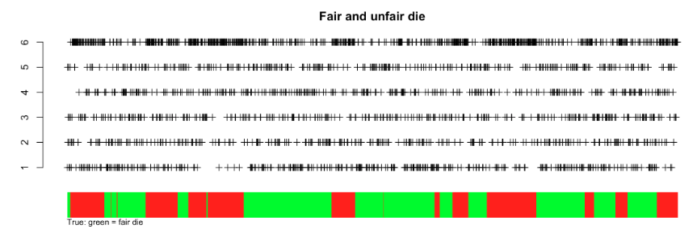

# Latent Structure Models

[](https://www.python.org/)
[](https://www.r-project.org/)
[](https://github.com/darinz/Statistical-Learning)
[]()

## Overview

This module explores advanced, modernized unsupervised learning techniques that model latent (hidden) structures in data.

## Topics Covered

### 1. Model-based Clustering
- **Mixture Model Framework**: Clustering as fitting mixture distributions

  
  *Figure: Illustration of a mixture of Gaussians, the basis for model-based clustering.*

- **Gaussian Mixtures**: Normal component distributions for continuous data
- **Model Selection**: Using AIC/BIC for optimal number of components
- **Parameter Estimation**: Maximum Likelihood Estimation challenges
- **Expanded mathematical derivations and LaTeX formatting**

### 2. Mixture Models
- **Mathematical Foundation**: Weighted sum of probability density functions
- **Data Generation Process**: Two-stage latent variable framework

  
  *Figure: Dice metaphor for latent variable selection in mixture models. Each observation is generated by first rolling a 'latent' die to select a component, then sampling from that component's distribution.*

- **Two-Component Gaussian**: Detailed analysis of simple case
- **Kullback-Leibler Divergence**: Distance measure between distributions
- **Iterative Estimation**: Expectation-Maximization approach
- **Expanded code and math explanations**

### 3. EM Algorithm
- **Expectation-Maximization**: Iterative optimization for latent variables

  
  *Figure: Diagram of the EM algorithm steps for mixture models.*

- **E-step**: Computing expected values of latent variables
- **M-step**: Maximizing likelihood with respect to parameters
- **Convergence Properties**: Monotonic improvement of marginal likelihood
- **Connection to K-means**: Special case with zero variance
- **Variational EM**: Approximate inference for complex models
- **Expanded code and LaTeX math explanations**

### 4. Latent Dirichlet Allocation (LDA)
- **Document Modeling**: Topic-based representation of text collections

  
  *Figure: Graphical model of Latent Dirichlet Allocation (LDA).*

- **Bag of Words**: Frequency-based document representation
- **Topic Distributions**: Probability distributions over vocabulary
- **Document-Topic Mixtures**: Flexible topic assignments per document
- **Word-Level Latent Variables**: Individual word topic assignments
- **Dimensionality Reduction**: Compact document representations
- **Expanded code and math explanations**

### 5. Hidden Markov Models (HMM)
- **Sequential Data**: Modeling temporal dependencies

  
  *Figure: Graphical model of a basic Hidden Markov Model (HMM).*

- **Hidden States**: Latent variables following Markov process
- **Emission Probabilities**: Observable variable distributions
- **Transition Matrix**: State-to-state transition probabilities
- **Forward-Backward Algorithm**: Computing marginal probabilities
- **Viterbi Algorithm**: Finding most likely state sequence
- **Baum-Welch Algorithm**: Parameter estimation via EM
- **Expanded code and LaTeX math explanations**

## Recent Enhancements

- **Expanded Explanations:** All modules now feature clearer, more detailed explanations of mathematical concepts and algorithms.
- **LaTeX Math Formatting:** All math is now formatted using inline ($`...`$) and display (```math) LaTeX for readability and copy-paste support.
- **Code Examples:** Python and R code snippets are provided and explained for all major algorithms.
- **Image-to-Text Conversion:** PNG images containing math or text have been transcribed into markdown with LaTeX where possible, improving accessibility.
- **Visual Aids:** Diagrams and figures are referenced and described in context to support conceptual understanding.

## Key Concepts

### Mixture Model Structure
$`f(x) = \sum_{k=1}^K \pi_k f_k(x \mid \theta_k)`$

### EM Algorithm Steps
1. **E-step**: Compute $`Q(\theta|\theta^{(t)}) = \mathbb{E}_{Z|X,\theta^{(t)}}[\log p(X,Z|\theta)]`$
2. **M-step**: Maximize $`\theta^{(t+1)} = \arg\max_{\theta} Q(\theta|\theta^{(t)})`$

### LDA Model Components
- **Topic Matrix**: $`V \times K`$ matrix of word distributions per topic
- **Document-Topic Matrix**: $`K \times n`$ matrix of topic weights per document
- **Word-Topic Assignments**: Individual word-level latent variables

### HMM Parameters
- **Initial Distribution**: $`w_{m_z \times 1}`$ for $`Z_1`$
- **Transition Matrix**: $`A_{m_z \times m_z}`$ for $`Z_t \rightarrow Z_{t+1}`$
- **Emission Matrix**: $`B_{m_z \times m_x}`$ for $`Z_t \rightarrow X_t`$

## Files

### Documentation
- `01_model-based_clustering.md` – Introduction to mixture model clustering
- `02_mixture_models.md` – Mathematical foundations and estimation
- `03_em_algorithm.md` – Expectation-Maximization algorithm details
- `04_latent_dirichlet_allocation_model.md` – LDA for document modeling
- `