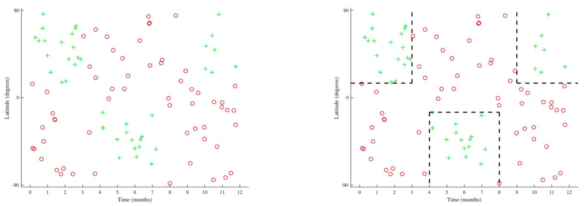
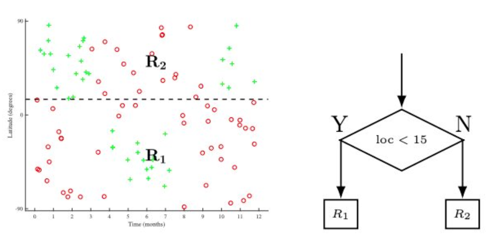
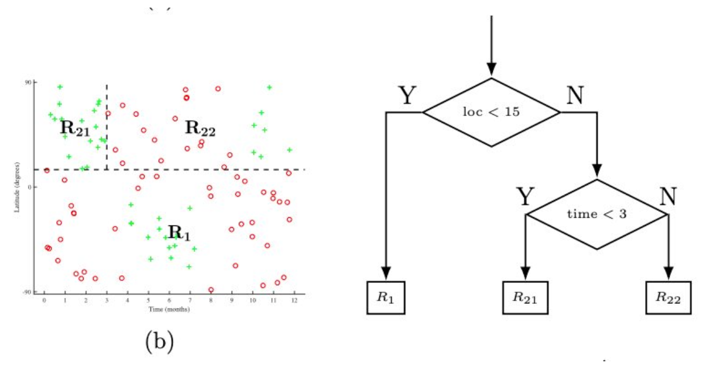
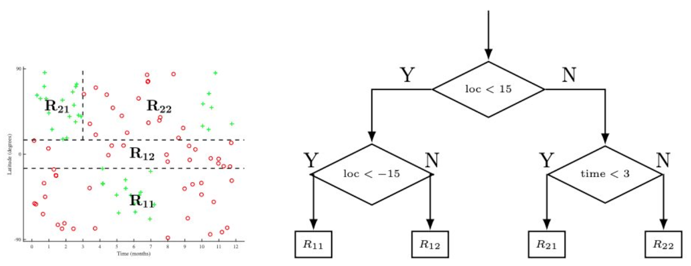
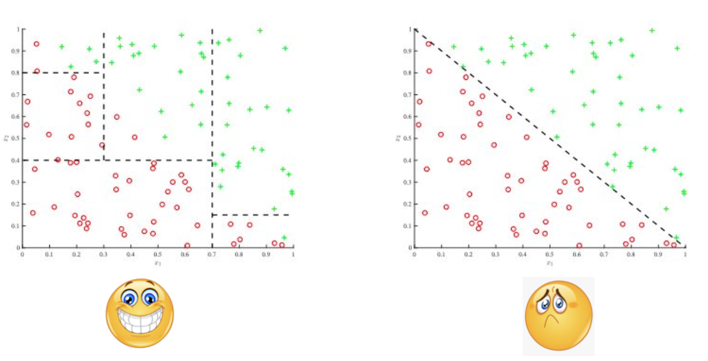

# Decision Trees Introduction

## Decision Trees: nonlinear classifier

Decision trees are powerful machine learning models that can capture complex, non-linear relationships in data. Unlike linear models that can only create straight-line boundaries, decision trees create piecewise constant predictions by dividing the input space into rectangular regions. This makes them particularly effective for problems where the relationship between features and the target variable is highly non-linear or involves complex interactions.

## Decision Trees: canonical situation

- No linear separation line
- Want to divide input space into "regions"
- Can do this by dividing input space into disjoint regions $R_i$

$$\mathcal{X} = \bigcup_{i=0}^{n} R_i$$

s.t.

$$R_i \cap R_j = \emptyset \text{ for } i \neq j$$

The fundamental idea behind decision trees is to partition the entire input space $\mathcal{X}$ into a collection of non-overlapping regions. Each region $R_i$ represents a specific combination of feature conditions, and all data points within a region receive the same prediction. This partitioning approach allows decision trees to capture complex decision boundaries that would be impossible for linear models to represent.

The mathematical formulation ensures that:
1. Every point in the input space belongs to exactly one region (complete coverage)
2. No two regions overlap (mutual exclusivity)
3. The union of all regions covers the entire input space

## Recursively splitting regions

- Parent region $R_p$
- "Children" regions $R_1$ and $R_2$
- Split on feature $X_j$

$$R_1 = \{X \mid X_j < t, X \in R_p\}$$

$$R_2 = \{X \mid X_j \geq t, X \in R_p\}$$

The recursive splitting process is the heart of how decision trees grow. Starting with the entire dataset as the root region, the algorithm repeatedly finds the best way to split each region into two smaller regions. This process continues until a stopping criterion is met.

Each split is defined by:
- **Feature selection**: Which feature $X_j$ to split on
- **Threshold selection**: What threshold value $t$ to use for the split
- **Region creation**: Two child regions based on the condition $X_j < t$ vs $X_j \geq t$

This binary splitting approach creates a hierarchical structure where each internal node represents a decision rule, and each leaf node represents a final prediction region.

### Split Example

Split 1:

Split 2:

Split 3:

## How 'good' is a split?

- Need to define a loss function L on a region
- Loss of the parent region $L(R_p)$ must be higher than that of child regions $R_1$ and $R_2$
- When deciding which attribute to split on, pick the one which maximizes the 'gain' in the loss

### **Greedy splitting**

$$L(R_p) - \frac{|R_1|L(R_1) + |R_2|L(R_2)}{|R_1| + |R_2|}$$

The quality of a split is measured by how much it improves our predictions. The key insight is that a good split should reduce the overall loss by creating more homogeneous regions. The information gain formula quantifies this improvement by comparing the loss of the parent region to the weighted average loss of the child regions.

The weighted average accounts for the fact that regions with more data points should have more influence on the overall performance. This ensures that the algorithm prioritizes splits that improve predictions for the majority of the data.

## Why greedy splitting?

- Checking every possible way of splitting every single feature in every possible order is computationally intractable!
- Greedy splitting is much easier: just compute the loss for each feature you want to consider splitting on

The greedy approach is a practical necessity. While finding the globally optimal tree structure would require evaluating all possible combinations of splits across all features and all possible thresholds, this would be computationally infeasible even for moderately sized datasets.

The greedy strategy makes the problem tractable by making locally optimal decisions at each step. Although this doesn't guarantee global optimality, it typically produces trees that perform well in practice while being computationally efficient.

## Entropy loss

### Definition

- Looks like the cross-entropy loss that you have seen before
- $\hat{p}_c$ is the prevalence of class c in region R
- $L_{\text{cross}}(R) = 0$ if all the data in region R belongs to a single class

$$L_{\text{cross}}(R) = - \sum_c \hat{p}_c \log_2 \hat{p}_c$$

Entropy loss measures the impurity or uncertainty in a region. It's based on information theory concepts where entropy quantifies the amount of information needed to describe the class distribution in a region.

The intuition behind entropy loss is:
- **Pure regions** (all points belong to the same class) have zero entropy - we're completely certain about the class
- **Mixed regions** (points belong to multiple classes) have higher entropy - we're uncertain about the class
- The goal is to create splits that reduce entropy, making regions more pure and predictions more certain

The $\log_2$ base gives us entropy in bits, which has a nice interpretation in terms of information content.

### Properties

- Note that the entropy loss is convex
- Can be shown that, under reasonable conditions, weighted average of children's loss is always less than parent's loss

$$L(R_p) - \frac{|R_1|L(R_1) + |R_2|L(R_2)}{|R_1| + |R_2|}$$

The convexity of entropy loss is crucial because it guarantees that any split will reduce the overall loss (or at least not increase it). This property ensures that the greedy splitting strategy will always make progress toward creating more homogeneous regions.

The mathematical relationship shows that the information gain is always non-negative, which provides theoretical justification for the greedy approach.

## Common alternative: Gini impurity

- Closely related to entropy loss
- Default splitting loss for many ML libraries like scikit-learn

$$I_G(\hat{p}) = \sum_{i=1}^{c} \hat{p}_i \left( \sum_{k \neq c} \hat{p}_k \right) = \sum_{i=1}^{c} \hat{p}_i (1 - \hat{p}_i)$$

Gini impurity is another measure of region impurity that's computationally simpler than entropy. It measures the probability of incorrect classification if we randomly assign labels according to the class distribution in the region.

The intuition is:
- **Pure regions**: Gini impurity = 0 (no chance of misclassification)
- **Mixed regions**: Higher Gini impurity (higher chance of misclassification)
- The goal remains the same: create splits that reduce Gini impurity

Gini impurity is often preferred in practice because it's faster to compute and doesn't require logarithms, while still providing good splitting decisions.

## What about regression?

- Same growth process, but final prediction is now the mean of all datapoints in region:

$$\hat{y} = \frac{\sum_{i \in R} y_i}{|R|}$$

- Use least-squares loss to split:

$$L_{\text{squared}}(R) = \frac{\sum_{i \in R} (y_i - \hat{y})^2}{|R|}$$

For regression problems, the tree structure remains the same, but the prediction mechanism and loss function change. Instead of predicting class probabilities, we predict the mean target value within each region.

The intuition is that points in the same region should have similar target values. The mean provides the best prediction in the sense that it minimizes the squared error within the region.

The least-squares loss measures the average squared deviation from the predicted mean, providing a natural way to evaluate how well a region captures the target variable's behavior.

## Regularization

- Decision trees are highly prone to overfitting! High variance, low bias

Decision trees have a natural tendency to overfit because they can grow very deep and create regions with very few data points. This leads to high variance - small changes in the training data can result in very different trees.

### Minimum leaf size
- Do not split R if its cardinality falls below a fixed threshold

This prevents the creation of regions with too few data points, ensuring that predictions are based on sufficient evidence. It's like requiring a minimum sample size for statistical significance.

### Maximum depth
- Do not split R if more than a fixed threshold of splits were already taken to reach R

Limiting tree depth prevents the model from becoming too complex and capturing noise in the training data. It's a direct way to control model complexity.

### Maximum number of nodes
- Stop if a tree has more than a fixed threshold of leaf nodes

This provides another way to limit model complexity by controlling the total number of regions the tree can create.

## Runtime Complexity

- **n examples, f features and a tree of depth d**
- **Test time complexity: O(d)**
  - If balanced tree, O(d)=O(log n)
- **Train time complexity: O(nfd)**
  - Relatively fast since data matrix size is O(nf)

The computational efficiency of decision trees is one of their key advantages. At test time, we only need to traverse from root to leaf, making predictions very fast. For balanced trees, this traversal takes logarithmic time in the number of training examples.

Training time scales linearly with the number of examples, features, and tree depth, making it feasible to train trees on large datasets. The greedy nature of the algorithm contributes to this efficiency.

## Decision trees lack "additive" structure

- Decision trees create axis-aligned boundaries (step-like, rectangular regions)
- They struggle with diagonal or non-axis-aligned decision boundaries
- This limitation is illustrated by the difference between:
  - **Good case**: Axis-aligned boundaries that decision trees can easily capture 😊
  - **Bad case**: Diagonal boundaries that decision trees struggle with 😟

This fundamental limitation arises because each split can only consider one feature at a time and creates boundaries parallel to the feature axes. While this makes the model interpretable and computationally efficient, it means that decision trees cannot directly capture relationships that require considering multiple features simultaneously.

To capture diagonal boundaries, decision trees need to approximate them using a series of axis-aligned splits, which can require many splits and result in complex, potentially overfitted trees.

## Random Forests

- **Decision trees are prone to overfitting, so use a randomized ensemble of decision trees**
  - Typically works a lot better than a single tree
- **Each tree can use feature and sample bagging**
  - Randomly select a subset of the data to grow tree
  - Randomly select a set of features
  - Decreases the correlation between different trees in the forest

Random forests address the overfitting problem by combining multiple decision trees, each trained on different subsets of the data and features. This ensemble approach reduces variance while maintaining the interpretability and computational efficiency of individual trees.

The randomization serves two purposes:
1. **Diversity**: Different trees see different data and features, leading to diverse predictions
2. **Robustness**: The ensemble is less sensitive to noise and outliers in the training data

The final prediction is typically the average (for regression) or majority vote (for classification) of all trees, providing a more stable and accurate prediction than any single tree.

## A few words about boosting...

- **Iteratively add simple "weak" classifiers to improve classification performance**
- **After adding weak classifier, evaluate performance and reweight training samples**
- **Weak classifier can be decision tree of depth 1 (decision stump)**
- **Theoretically, can achieve zero training loss!**
- **Python libraries: LightGBM, XGBoost**

Boosting takes a fundamentally different approach from random forests. Instead of training independent trees, it builds an ensemble sequentially, where each new tree focuses on the mistakes made by the previous trees.

The key insight is that by reweighting training samples based on their difficulty (how often they've been misclassified), the algorithm can focus on the most challenging cases. This adaptive approach often leads to better generalization than random forests, especially on complex datasets.

The theoretical result about achieving zero training loss demonstrates the power of boosting, though in practice we typically stop early to prevent overfitting. Modern implementations like XGBoost and LightGBM add sophisticated regularization techniques to prevent overfitting while maintaining the benefits of boosting.

## Additional Resources

For a more comprehensive treatment of decision trees, including detailed mathematical derivations and advanced concepts, we recommend reviewing the Decision Trees Notes available in the reference materials: [Decision Trees Notes](./reference/N-01-2_CS229_Decision-Trees-Notes.pdf). These notes provide deeper insights into the theoretical foundations and practical implementation details of decision tree algorithms.