# Decision Trees - Predicting Potential Loan Defaults

## What Makes a Loan Risky?

When applying for a loan to buy a new house, several key factors determine the risk assessment. The loan application process evaluates multiple aspects of the borrower's financial situation and personal circumstances.

**Credit History** is one of the most critical factors. Lenders examine whether the borrower has paid previous loans on time, looking for patterns of responsible financial behavior. Credit history is typically categorized as excellent, good, or fair based on past payment records and credit utilization.

**Income** represents the borrower's earning capacity and ability to make regular loan payments. Lenders assess the stability and amount of income, such as an annual salary of $80,000, to determine if the borrower can comfortably afford the loan payments.

**Loan Terms** specify the repayment timeline and conditions. This includes how soon the loan needs to be paid back, with common terms being 3 years, 5 years, or longer periods depending on the loan type and amount.

**Personal Information** encompasses various demographic and situational factors including age, the reason for the loan, marital status, and other relevant details. For example, a home loan application for a married couple would be evaluated differently than a loan for a single individual.

## Classifier Review

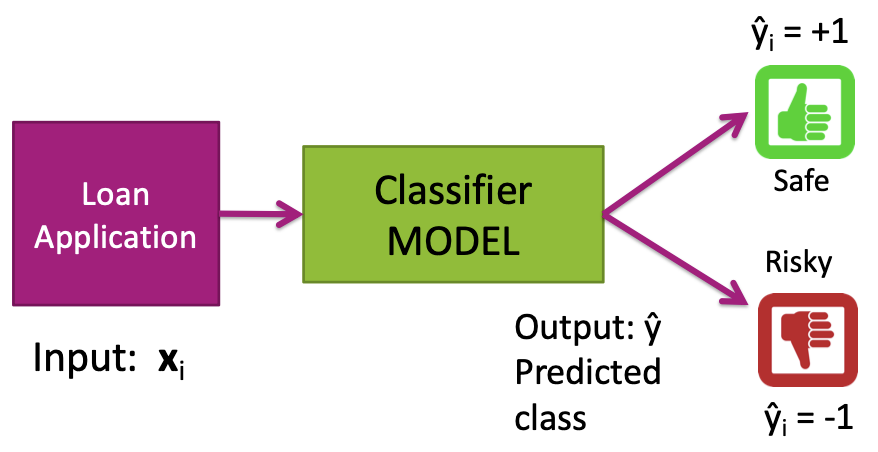

In the context of loan applications, a classifier model takes loan application data as input and produces a predicted class as output. The process can be summarized as:

- **Input:** $x_i$ (Loan Application data)
- **Model:** Classifier MODEL
- **Output:** $\hat{y}_i$ (Predicted class)

The classifier produces two possible outcomes:
- **Safe** ($\hat{y}_i = +1$): Loan is approved
- **Risky** ($\hat{y}_i = -1$): Loan is denied

## Decision Tree for Loan Applications

A decision tree provides an intuitive way to classify loan applications based on multiple criteria. Here's an example decision tree structure:

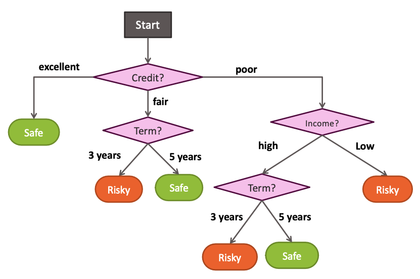

### Decision Tree Structure

The decision tree evaluates loan applications through a series of questions:

1. **Credit?** (First decision point)
   - **excellent** → **Safe** (immediate approval)
   - **fair** → Continue to Term evaluation
   - **poor** → Continue to Income evaluation

2. **Term?** (for fair credit)
   - **3 years** → **Risky**
   - **5 years** → **Safe**

3. **Income?** (for poor credit)
   - **high** → Continue to Term evaluation
   - **low** → **Risky**

4. **Term?** (for poor credit, high income)
   - **3 years** → **Risky**
   - **5 years** → **Safe**

### Example: Scoring a Loan Application

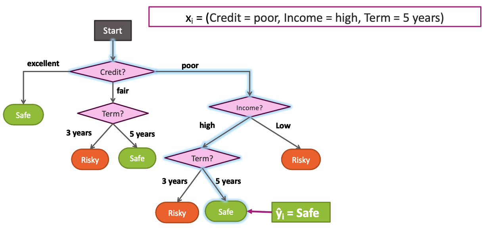

Consider a loan application with the following characteristics:
- **Credit:** poor
- **Income:** high  
- **Term:** 5 years

**Decision Path:**
1. Start → Credit = poor → Income evaluation
2. Income = high → Term evaluation
3. Term = 5 years → **Safe**

**Result:** $\hat{y}_i = \text{Safe}$ (Loan approved)

This decision tree demonstrates how multiple factors are considered in sequence to arrive at a final classification decision, with the path through the tree determined by the specific values of the input features.

## Decision Tree Learning Task

### The Learning Problem

The decision tree learning problem involves constructing an optimal decision tree from training data. Given a dataset of $N$ observations $(x_i, y_i)$, where each $x_i$ represents the features of a loan application and $y_i$ is the corresponding classification (safe or risky), the goal is to learn a decision tree function $T(X)$ that accurately predicts the loan risk.

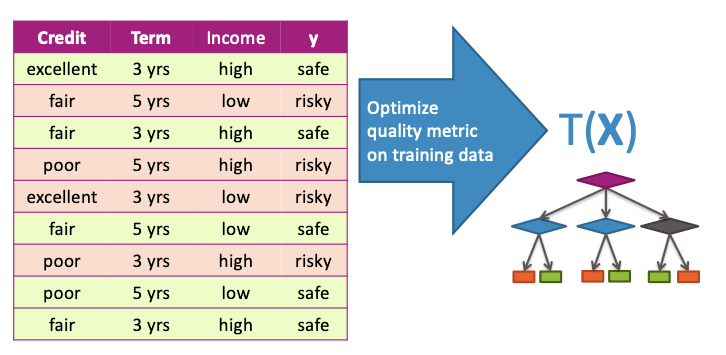

**Training Data Structure:**
The training dataset contains examples with the following features:
- **Credit:** excellent, fair, poor
- **Term:** 3 yrs, 5 yrs  
- **Income:** high, low
- **Target (y):** safe, risky

The learning process optimizes a quality metric on the training data to find the best decision tree structure.

### Quality Metric: Classification Error

To evaluate the performance of a decision tree, we use classification error as the primary quality metric.

**Definition:** Error measures the fraction of mistakes made by the classifier.

**Formula:**

$$\text{Error} = \frac{\text{num incorrect predictions}}{\text{num examples}}$$

**Value Range:**
- **Best possible value:** 0.0 (perfect classification)
- **Worst possible value:** 1.0 (all predictions incorrect)

The classification error provides a straightforward measure of how well the decision tree performs on the training data, with lower values indicating better performance.

### The Challenge of Finding the Best Tree

Decision tree learning presents a significant computational challenge due to the exponentially large number of possible tree configurations.

**Complexity Problem:**
The space of possible decision trees grows exponentially with the number of features and their possible values. For any given dataset, there are numerous valid tree structures that could be constructed, each with different branching patterns and decision rules.

**NP-Hard Problem:**
Learning the smallest (most parsimonious) decision tree that achieves optimal performance is an NP-hard problem, as proven by Hyafil & Rivest in 1976. This means that finding the globally optimal decision tree is computationally intractable for realistic problem sizes.

**Multiple Valid Solutions:**

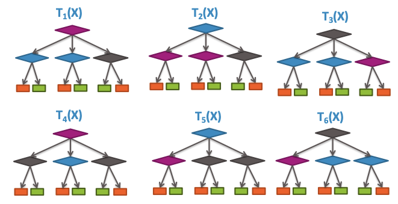

Given the same training data, multiple different tree structures (denoted as $T_1(X)$ through $T_6(X)$ in the illustration) can achieve similar or identical performance on the training set. Each tree may have different:

- Root node choices
- Branching patterns
- Decision thresholds
- Overall complexity

This inherent complexity necessitates the use of heuristic algorithms and greedy approaches to construct decision trees efficiently, trading optimality for computational feasibility.

## Greedy Decision Tree Learning - Training Data and Initial Representation

### Our Training Data Table

To illustrate the decision tree learning process, we use a training dataset with $N = 40$ examples and 3 features. The dataset contains loan application information with the following structure:

**Dataset Specifications:**
- **Size:** $N = 40$ observations
- **Features:** 3 (Credit, Term, Income)
- **Target:** Binary classification (safe/risky)

**Example Training Data:**
| Credit    | Term   | Income | y      |
|-----------|--------|--------|--------|
| excellent | 3 yrs  | high   | safe   |
| fair      | 5 yrs  | low    | risky  |
| fair      | 3 yrs  | high   | safe   |
| poor      | 5 yrs  | high   | risky  |
| excellent | 3 yrs  | low    | risky  |
| fair      | 5 yrs  | low    | safe   |
| poor      | 3 yrs  | high   | risky  |
| poor      | 5 yrs  | low    | safe   |
| fair      | 3 yrs  | high   | safe   |
| ...       | ...    | ...    | ...    |

The dataset contains a mix of loan applications with varying credit histories, loan terms, and income levels, each labeled as either safe or risky based on historical outcomes.

### Start with All the Data

When beginning the decision tree construction process, we start with the complete dataset and examine the overall distribution of loan outcomes.

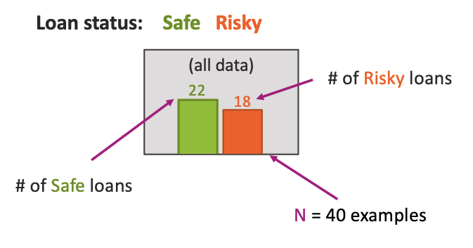

**Initial Data Distribution:**
- **Safe loans:** 22 examples
- **Risky loans:** 18 examples
- **Total examples:** $N = 40$

This initial state represents the root node of our decision tree, where all training examples are grouped together without any feature-based splitting.

### Compact Visual Notation: Root Node

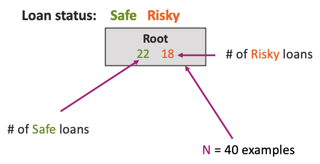

The root node can be represented using a compact visual notation that summarizes the class distribution:

**Root Node Representation:**
```
[22, 18]
```

Where:
- **22** (green) represents the number of safe loans
- **18** (red) represents the number of risky loans

This notation provides a concise way to represent the current state of the data at any node in the decision tree, making it easy to track how the data distribution changes as we apply different splitting criteria.

The root node serves as the starting point for the greedy decision tree learning algorithm, from which we will iteratively apply feature-based splits to create a hierarchical classification structure.

### Decision Stump: Single Level Tree

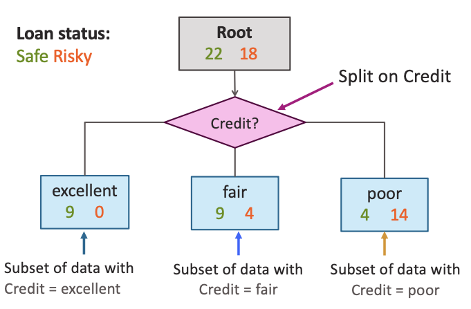

A decision stump represents the simplest form of a decision tree - a single-level tree with one split. Starting from the root node containing all data `[22, 18]`, we apply a single feature-based split to create a decision stump.

**Decision Stump Structure:**
The decision stump begins with the root node and applies a single split based on the Credit feature:

- **Root Node:** `[22, 18]` (all data)
- **Split Feature:** Credit
- **Split Outcomes:**
  - **excellent:** `[9, 0]` - Subset of data with Credit = excellent
  - **fair:** `[9, 4]` - Subset of data with Credit = fair  
  - **poor:** `[4, 14]` - Subset of data with Credit = poor

This single split partitions the original dataset into three distinct subsets based on credit history, with each subset containing a different distribution of safe and risky loans.

### Visual Notation: Intermediate Nodes

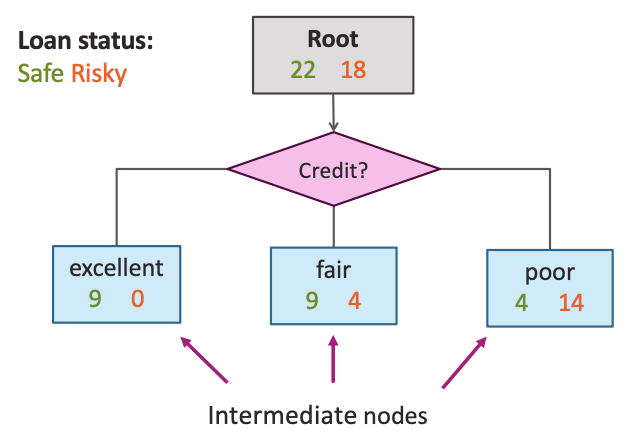

The nodes created by the split are called intermediate nodes, as they represent subsets of data that could potentially be split further in a more complex tree structure.

**Intermediate Node Representation:**

Each intermediate node shows the class distribution for its corresponding data subset:

- **excellent credit node:** `[9, 0]` - All excellent credit applications are safe
- **fair credit node:** `[9, 4]` - Fair credit applications are mostly safe
- **poor credit node:** `[4, 14]` - Poor credit applications are mostly risky

These intermediate nodes serve as the foundation for building more complex decision trees, where each node could potentially be split further based on additional features.

### Making Predictions with a Decision Stump

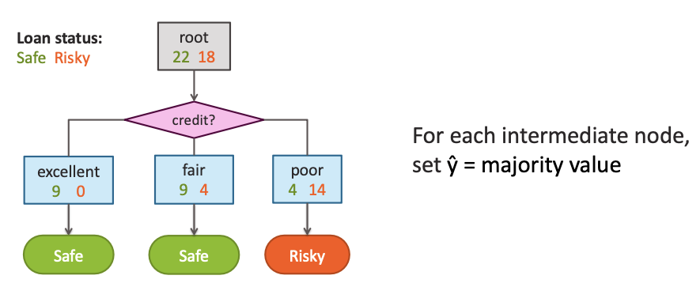

To make predictions using a decision stump, we apply a simple majority rule at each intermediate node.

**Prediction Rule:**
For each intermediate node, set $\hat{y}$ = majority value

**Predictions by Credit Category:**
- **excellent credit:** `[9, 0]` → **Safe** (majority: 9 safe vs 0 risky)
- **fair credit:** `[9, 4]` → **Safe** (majority: 9 safe vs 4 risky)
- **poor credit:** `[4, 14]` → **Risky** (majority: 4 safe vs 14 risky)

**Decision Stump Classification:**
The decision stump creates a simple classification rule:
- If Credit = excellent → Predict Safe
- If Credit = fair → Predict Safe  
- If Credit = poor → Predict Risky

This demonstrates how even a simple single-level decision tree can capture meaningful patterns in the data, with credit history serving as a strong predictor of loan risk. The decision stump provides a baseline model that can be extended to more complex tree structures by adding additional splits at the intermediate nodes.

## Selecting Best Feature to Split on

### How do we learn a decision stump?


Learning a decision stump involves identifying the single "best" feature to split the data on. This process aims to create the most effective initial separation of data points based on their features.

Consider our root node, which contains all 40 loan applications: `[22 Safe, 18 Risky]`. We need to find a feature that, when used as a split, best separates the safe from the risky loans.

**Example: Splitting on Credit**

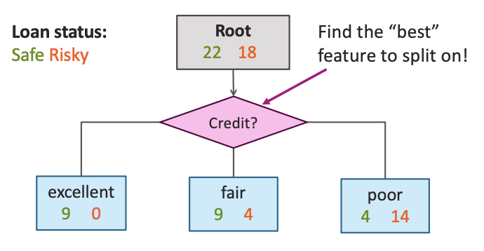

If we choose to split on the `Credit` feature, the data is partitioned into three branches based on credit history:

- **Root Node:** `[22 Safe, 18 Risky]`
  - **Credit = excellent:** This branch contains `[9 Safe, 0 Risky]` loans. All loans with excellent credit are safe.
  - **Credit = fair:** This branch contains `[9 Safe, 4 Risky]` loans.
  - **Credit = poor:** This branch contains `[4 Safe, 14 Risky]` loans.

This single split forms a decision stump, where each leaf node (excellent, fair, poor) represents a prediction based on the majority class within that group.

### How do we select the best feature?

To select the best feature for a split, we compare the effectiveness of different potential features. We evaluate each possible decision stump and choose the one that performs best according to a defined metric.

Let's compare two potential splits for our loan application data:

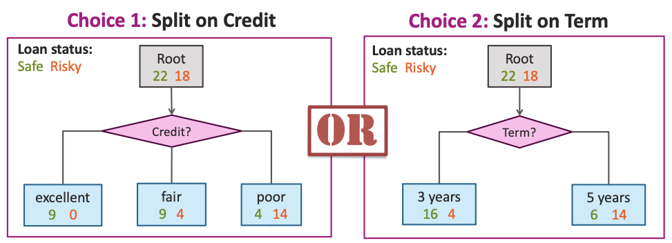

**Choice 1: Split on Credit**

This split results in the following distribution:

- **Root Node:** `[22 Safe, 18 Risky]`
  - **Credit = excellent:** `[9 Safe, 0 Risky]`
  - **Credit = fair:** `[9 Safe, 4 Risky]`
  - **Credit = poor:** `[4 Safe, 14 Risky]`

**Choice 2: Split on Term**

Alternatively, if we split on the `Term` feature, the data is partitioned as follows:

- **Root Node:** `[22 Safe, 18 Risky]`
  - **Term = 3 years:** This branch contains `[16 Safe, 4 Risky]` loans.
  - **Term = 5 years:** This branch contains `[6 Safe, 14 Risky]` loans.

To determine which of these splits is "better," we need a quantitative measure of effectiveness.

### How do we measure effectiveness of a split?

The effectiveness of a split, and thus a decision stump, is typically measured by its **classification error**. The classification error quantifies the proportion of mistakes made by the stump when classifying the training data.

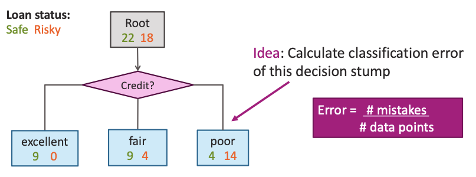

The formula for classification error is:

$$\text{Error} = \frac{\text{num mistakes}}{\text{num data points}}$$

## Calculating Classification Error: Root Node vs Splits

### Calculating Classification Error for Root Node

Before evaluating any splits, we first calculate the classification error for the root node containing all data. This serves as our baseline for comparison.

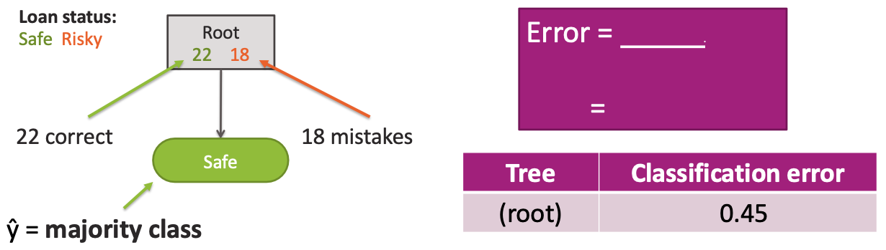

**Step 1: Determine majority class**
For the root node `[22 Safe, 18 Risky]`, the majority class is **Safe** (22 > 18).

**Step 2: Calculate classification error**
If we predict "Safe" for all instances:
- **Correct predictions:** 22 (the actual Safe loans)
- **Mistakes:** 18 (the Risky loans incorrectly predicted as Safe)
- **Total instances:** 40

**Root Node Classification Error:**
$$\text{Error}_{\text{root}} = \frac{18}{40} = 0.45$$

This means that without any splitting, our model would have a 45% error rate by predicting "Safe" for all loan applications.

### Choice 1: Split on Credit - Classification Error

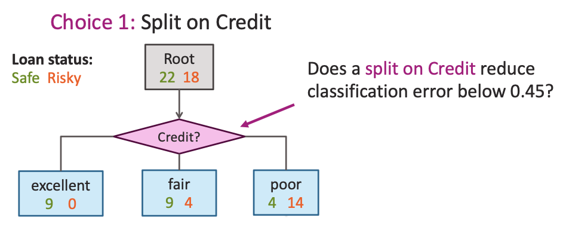

When we split on the Credit feature, we create three branches with their own predictions:

**Credit = excellent:** `[9 Safe, 0 Risky]`
- Majority class: Safe
- Mistakes: 0 (all are correctly classified)
- Error: $0/9 = 0.0$

**Credit = fair:** `[9 Safe, 4 Risky]`
- Majority class: Safe
- Mistakes: 4 (Risky loans misclassified as Safe)
- Error: $4/13 \approx 0.308$

**Credit = poor:** `[4 Safe, 14 Risky]`
- Majority class: Risky
- Mistakes: 4 (Safe loans misclassified as Risky)
- Error: $4/18 \approx 0.222$

**Overall Credit Split Error:**

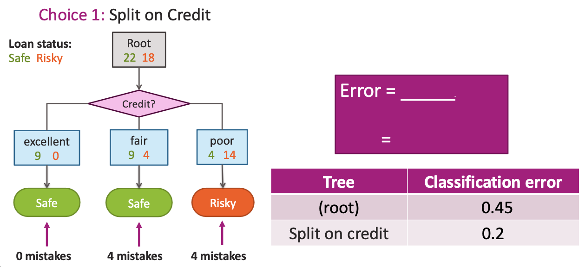

$$\text{Error}_{\text{Credit}} = \frac{0 + 4 + 4}{40} = \frac{8}{40} = 0.20$$

### Choice 2: Split on Term - Classification Error

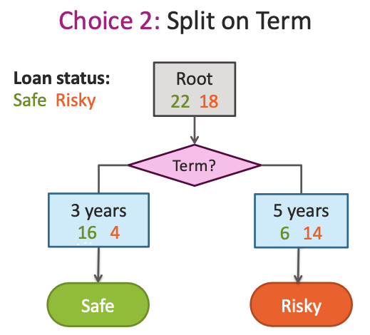

When we split on the Term feature, we create two branches:

**Term = 3 years:** `[16 Safe, 4 Risky]`
- Majority class: Safe
- Mistakes: 4 (Risky loans misclassified as Safe)
- Error: $4/20 = 0.20$

**Term = 5 years:** `[6 Safe, 14 Risky]`
- Majority class: Risky
- Mistakes: 6 (Safe loans misclassified as Risky)
- Error: $6/20 = 0.30$

**Overall Term Split Error:**
$$\text{Error}_{\text{Term}} = \frac{4 + 6}{40} = \frac{10}{40} = 0.25$$

### Comparing Split Effectiveness

**Classification Error Comparison:**
| Split Type | Classification Error | Improvement |
|------------|---------------------|-------------|
| Root (no split) | 0.45 | Baseline |
| Split on Credit | 0.20 | **Best** |
| Split on Term | 0.25 | Good |

The **Credit split** achieves the lowest classification error (0.20), making it the optimal choice for our decision stump. This represents a significant improvement over the baseline error of 0.45.

## Feature Split Selection Algorithm

The process of selecting the best feature to split on follows a systematic algorithm that evaluates all possible features and chooses the one that minimizes classification error.

### Algorithm Steps

**Given a subset of data $M$ (a node in a tree):**

1. **For each feature $h_i(x)$:**
   - **Step 1:** Split data of $M$ according to feature $h_i(x)$
   - **Step 2:** Compute classification error of split

2. **Choose feature $h^*(x)$ with lowest classification error**

### Algorithm Application to Our Example

In our loan application dataset, we applied this algorithm to the root node containing all 40 examples:

**Feature 1: Credit**
- Split data into 3 groups: excellent, fair, poor
- Classification error: 0.20

**Feature 2: Term**
- Split data into 2 groups: 3 years, 5 years
- Classification error: 0.25

**Feature 3: Income**
- Split data into 2 groups: high, low
- Classification error: [calculated similarly]

**Result:** Credit feature ($h^*(x) = \text{Credit}$) is selected as it achieves the lowest classification error of 0.20.

This greedy approach ensures that at each step, we make the locally optimal choice that maximizes the immediate improvement in classification performance.

## Recursion & Stopping conditions

### We've Learned a Decision Stump, What Next?

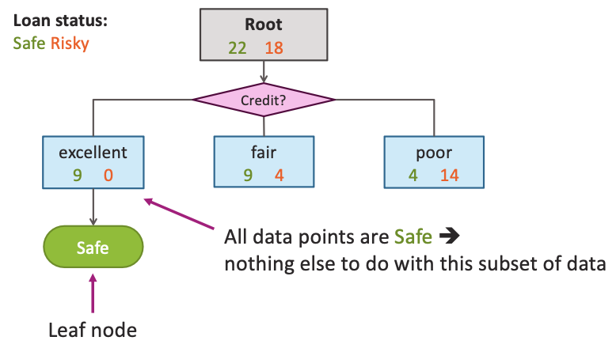

After creating our initial decision stump based on the Credit feature, we have a tree with three branches:

- **excellent credit:** `[9 Safe, 0 Risky]` → **Safe** (Leaf node)
- **fair credit:** `[9 Safe, 4 Risky]` → **Safe** 
- **poor credit:** `[4 Safe, 14 Risky]` → **Risky**

The excellent credit branch is already a **leaf node** because all data points in this subset are Safe - there's nothing else to do with this subset of data. However, the fair and poor credit branches still contain mixed classes and could potentially be split further.

### Tree Learning = Recursive Stump Learning

Decision tree construction is fundamentally a recursive process. After creating the initial decision stump, we apply the same stump learning algorithm to the impure subsets of data.

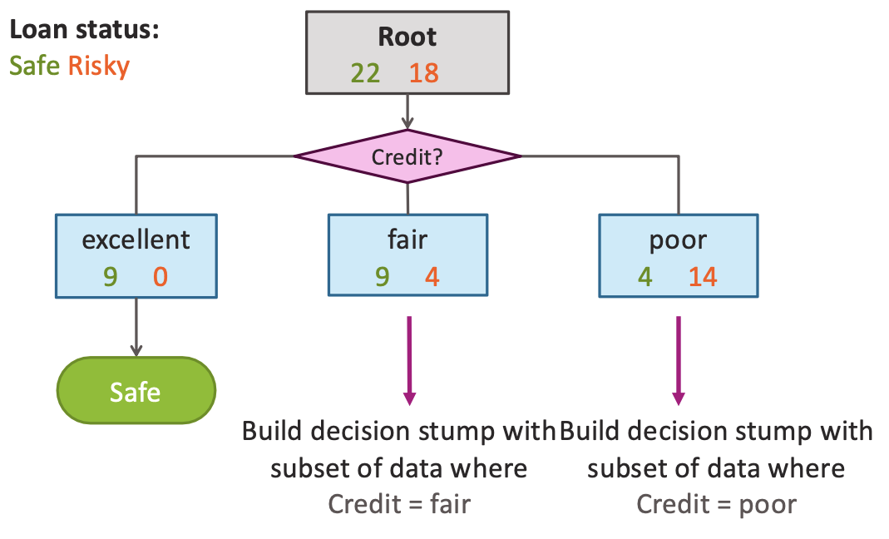

**Recursive Process:**
- **For fair credit subset:** Build decision stump with subset of data where Credit = fair
- **For poor credit subset:** Build decision stump with subset of data where Credit = poor

This recursive approach allows us to build deeper trees by treating each impure node as a new root for a sub-tree.

### Second Level: Recursive Splitting

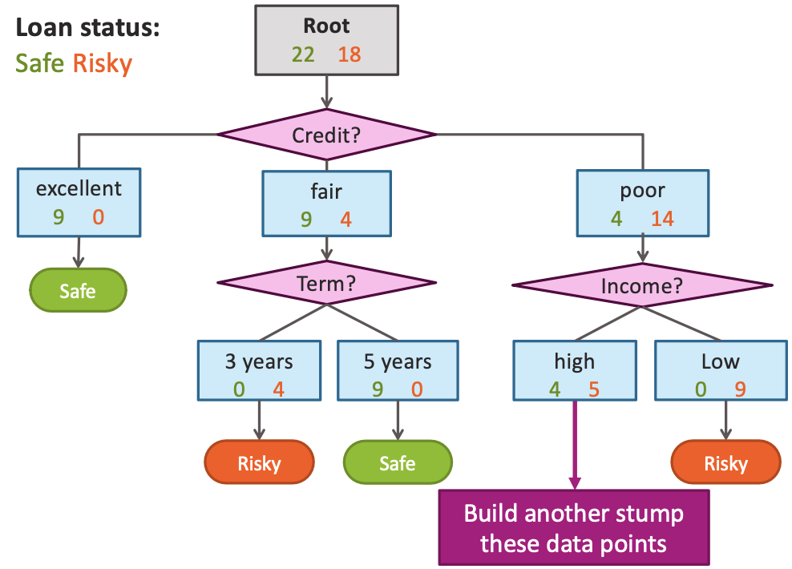

When we apply recursive stump learning to the impure nodes, we create a second level of the decision tree:

**Fair Credit Branch (`[9 Safe, 4 Risky]`):**
- **Split on Term:**
  - **3 years:** `[0 Safe, 4 Risky]` → **Risky** (Leaf node)
  - **5 years:** `[9 Safe, 0 Risky]` → **Safe** (Leaf node)

**Poor Credit Branch (`[4 Safe, 14 Risky]`):**
- **Split on Income:**
  - **high:** `[4 Safe, 5 Risky]` → Continue splitting (still impure)
  - **low:** `[0 Safe, 9 Risky]` → **Risky** (Leaf node)

The high income branch under poor credit is still impure (`[4 Safe, 5 Risky]`), so we can build another stump for these data points.


## Stopping Conditions

To prevent infinite recursion and control tree complexity, we need stopping conditions that determine when to stop splitting a node.

### Stopping Condition 1: All Data Agrees on Y

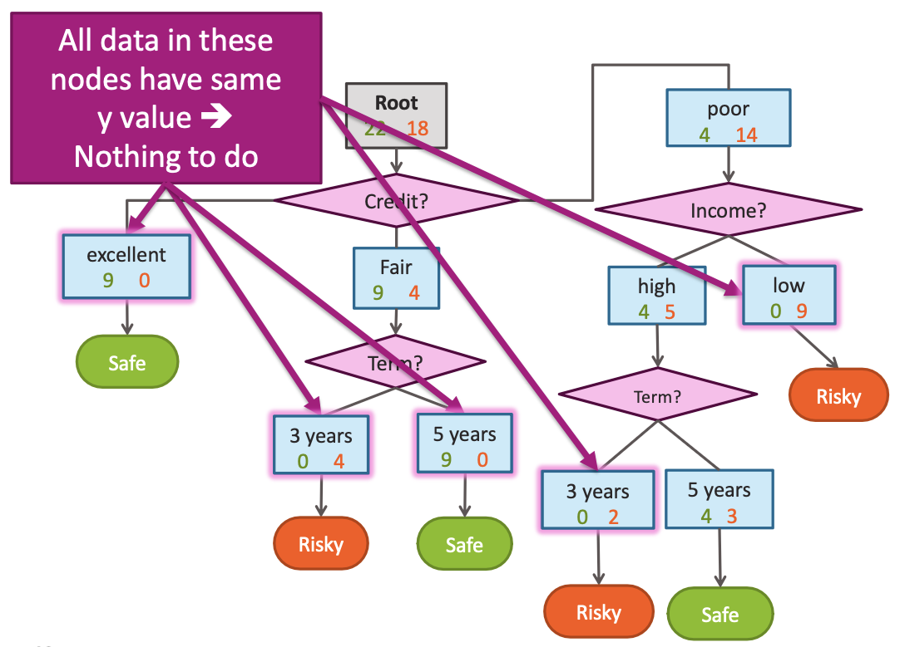

When all data points in a node have the same target value, the node is considered "pure" and becomes a leaf node.

**Examples from our tree:**
- **excellent credit:** `[9 Safe, 0 Risky]` → All data agrees on Safe
- **fair credit, 3 years:** `[0 Safe, 4 Risky]` → All data agrees on Risky
- **fair credit, 5 years:** `[9 Safe, 0 Risky]` → All data agrees on Safe
- **poor credit, low income:** `[0 Safe, 9 Risky]` → All data agrees on Risky

### Stopping Condition 2: Already Split on All Features

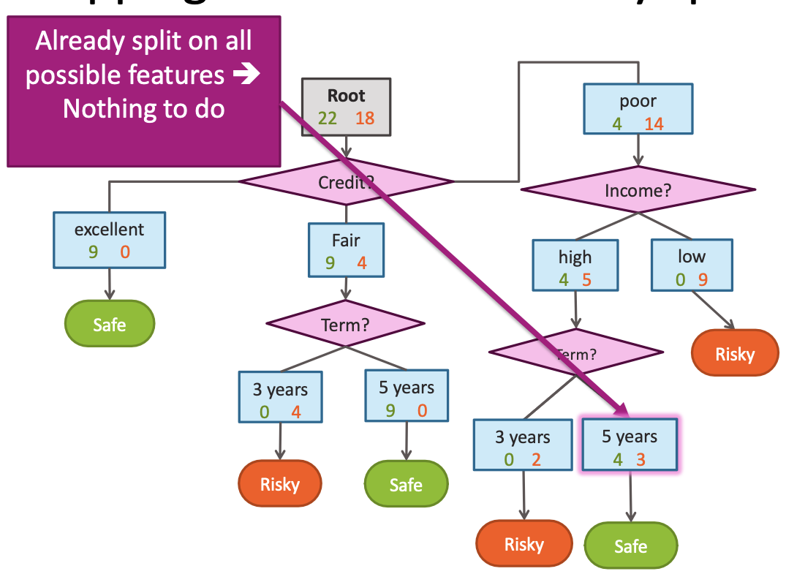

When all available features have been used in the path from root to current node, no further splitting is possible.

**Example:** If we've already used Credit, Term, and Income features in the path to reach a node, and these are all the features available, then we cannot split further.

### Stopping Condition 3: No Split Reduces Classification Error

**Warning:** This stopping condition is generally not recommended!

Consider the XOR function example where individual feature splits don't reduce classification error, but the combination of features is necessary for correct classification.

**XOR Function:** $y = x_1 \text{ xor } x_2$

| $x_1$ | $x_2$ | $y$ |
|-------|-------|-----|
| False | False | False |
| False | True  | True  |
| True  | False | True  |
| True  | True  | False |

**With Stopping Condition 3:**
- Root node: `[2 True, 2 False]` → Predict majority (True)
- Classification error: 0.5 (misclassifies 2 out of 4 samples)

**Without Stopping Condition 3:**
- Full tree with both features achieves perfect classification
- Classification error: 0.0
- **But:** This leads to overfitting and poor generalization

## Final Decision Tree

After applying recursive stump learning with appropriate stopping conditions, we arrive at the complete decision tree for loan classification.

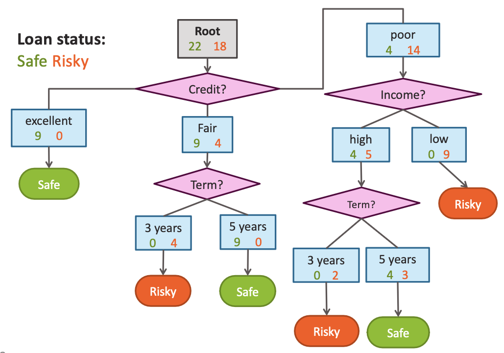

**Tree Structure:**

```
Root [22 Safe, 18 Risky]
├── Credit = excellent → Safe [9, 0]
├── Credit = fair
│   ├── Term = 3 years → Risky [0, 4]
│   └── Term = 5 years → Safe [9, 0]
└── Credit = poor
    ├── Income = high
    │   ├── Term = 3 years → Risky [0, 2]
    │   └── Term = 5 years → Safe [4, 3]
    └── Income = low → Risky [0, 9]
```

**Classification Rules:**
1. **Credit = excellent:** → **Safe**
2. **Credit = fair, Term = 3 years:** → **Risky**
3. **Credit = fair, Term = 5 years:** → **Safe**
4. **Credit = poor, Income = high, Term = 3 years:** → **Risky**
5. **Credit = poor, Income = high, Term = 5 years:** → **Safe**
6. **Credit = poor, Income = low:** → **Risky**

This final tree provides a clear, interpretable set of rules for classifying loan applications based on their credit history, income level, and loan terms.

## Decision Tree Learning: Real Valued Features

### How do we use real values inputs?

When working with real-valued features like `Income`, we need to handle numerical data differently from categorical features. Consider a dataset where `Income` contains actual dollar amounts rather than discrete categories.

**Example Dataset with Real-Valued Income:**
| Income | Credit | Term | y |
|--------|--------|------|---|
| $105K | excellent | 3 yrs | Safe |
| $112K | good | 5 yrs | Safe |
| $73K | fair | 3 yrs | Risky |
| $69K | poor | 5 yrs | Safe |
| $217K | excellent | 3 yrs | Safe |
| $120K | good | 5 yrs | Safe |
| $64K | fair | 3 yrs | Risky |
| $340K | excellent | 3 yrs | Safe |
| $60K | poor | 5 yrs | Risky |

The `Income` feature now contains continuous numerical values ranging from $60K to $340K, requiring a different approach for splitting than categorical features.

### Threshold Split

For real-valued features, we use **threshold splits** instead of categorical splits. A threshold split divides the data into two groups based on whether the feature value is above or below a specific threshold.

**Example: Split on Income with threshold $60K**

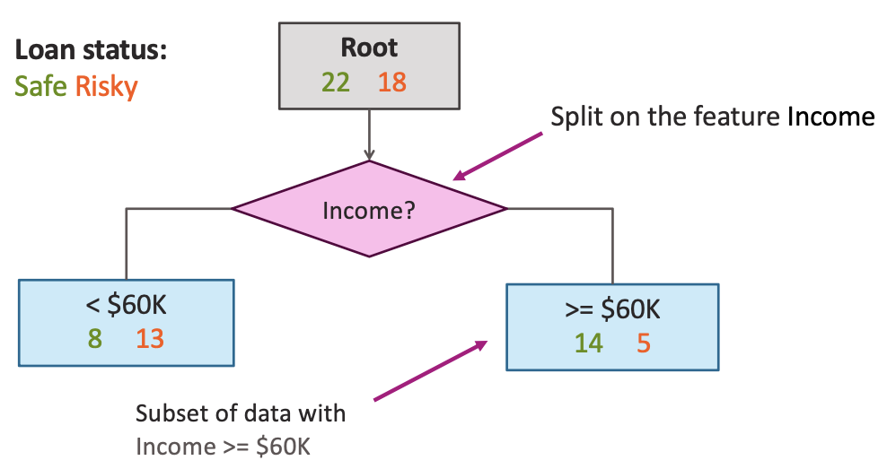

Starting from the root node `[22 Safe, 18 Risky]`, we can split on the `Income` feature using a threshold of $60K:

- **Root Node:** `[22 Safe, 18 Risky]`
- **Split Feature:** Income
- **Split Condition:** Income < $60K vs Income ≥ $60K
- **Split Outcomes:**
  - **Income < $60K:** `[8 Safe, 13 Risky]` - Lower income loans
  - **Income ≥ $60K:** `[14 Safe, 5 Risky]` - Higher income loans

This threshold split creates a binary decision based on income level, with the threshold $60K serving as the dividing point between the two groups.

### Finding the best threshold split

The challenge with real-valued features is determining the optimal threshold value. Unlike categorical features with a finite number of possible values, real-valued features have infinitely many possible threshold values.

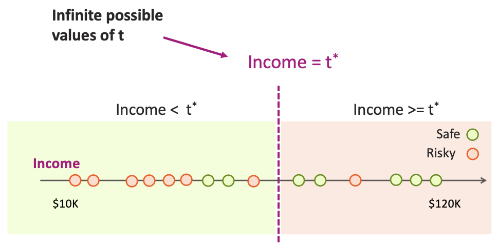

**The Problem:**
For a feature like `Income` ranging from $10K to $120K, there are infinitely many possible threshold values $t^{\ast}$ that could be used for splitting.

**The Solution:**
We only need to consider a finite number of potential thresholds. Specifically, we consider the mid-points between adjacent sorted unique values of the feature.

**Algorithm for Finding the Best Threshold:**

1. **Sort the unique values** of the real-valued feature in ascending order
2. **Consider mid-points** between adjacent values as potential thresholds
3. **Evaluate each threshold** by computing the classification error
4. **Select the threshold** that minimizes classification error

**Example with Income values:**
If we have sorted unique income values: [$60K, $64K, $69K, $73K, $105K, $112K, $120K, $217K, $340K]

We consider these potential thresholds:
- $62K (mid-point between $60K and $64K)
- $66.5K (mid-point between $64K and $69K)
- $71K (mid-point between $69K and $73K)
- $89K (mid-point between $73K and $105K)
- $108.5K (mid-point between $105K and $112K)
- $116K (mid-point between $112K and $120K)
- $168.5K (mid-point between $120K and $217K)
- $278.5K (mid-point between $217K and $340K)

For each threshold, we compute the classification error and select the one that performs best.

## Visualizing Threshold Splits

### Visualizing the threshold split

To better understand how threshold splits work, we can visualize the data in a 2D space where one axis represents the real-valued feature (e.g., Age) and another represents a different feature (e.g., Income).

**Initial Data Distribution:**
Consider a dataset with 20 data points:
- **10 Safe loans** (blue plus signs)
- **10 Risky loans** (orange minus signs)

The data points are scattered across a 2D space with Age on the x-axis (0-60 years) and Income on the y-axis ($0K-$80K+).

**Applying a Threshold Split:**
When we apply a threshold split at `Age = 38`, a vertical line divides the space into two regions:

- **Left region (Age < 38):** Contains 7 Risky and 3 Safe points
- **Right region (Age ≥ 38):** Contains 7 Safe and 3 Risky points

This visual representation shows how a single threshold can effectively separate the classes in the feature space.

### Split on Age >= 38

The first split creates a decision stump based on age:

**Region 1: Age < 38**
- **Data points:** 7 Risky, 3 Safe
- **Majority class:** Risky
- **Prediction:** Risky

**Region 2: Age ≥ 38**
- **Data points:** 7 Safe, 3 Risky
- **Majority class:** Safe
- **Prediction:** Safe

This single split achieves a reasonable separation of the classes, with most younger applicants being classified as risky and most older applicants being classified as safe.

### Depth 2: Split on Income >= $60K

To create a deeper tree, we can apply a second split within one of the regions created by the first split.

**Second Split within Age ≥ 38 region:**
We apply a horizontal threshold split at `Income = $60K` within the Age ≥ 38 region:

**Region A: Age < 38**
- **Data points:** 7 Risky, 3 Safe
- **Prediction:** Risky

**Region B: Age ≥ 38 AND Income < $60K**
- **Data points:** 3 Risky, 1 Safe
- **Prediction:** Risky

**Region C: Age ≥ 38 AND Income ≥ $60K**
- **Data points:** 0 Risky, 6 Safe
- **Prediction:** Safe

This second split further refines the classification, creating a more accurate decision boundary that considers both age and income simultaneously.

The resulting decision tree now has depth 2 and provides more nuanced classification rules that can better capture the complex relationships between multiple features.

## Decision Tree Partitions in 2D Space

### Each split partitions the 2-D space

Decision trees create rectangular partitions in the feature space by making sequential splits on different features. Each split divides the space into distinct regions, and subsequent splits further subdivide these regions.

**Visual Representation:**
In a 2D space with Age on the x-axis (0-40+ years) and Income on the y-axis ($0K-$80K+), our decision tree creates three distinct rectangular regions through two sequential splits.

### First Split: Age >= 38

The initial split creates a vertical boundary at Age = 38, dividing the 2D space into two main regions:

**Left Region (Age < 38):**
- **Boundary:** Vertical line at Age = 38
- **Color:** Light pink region
- **Data Distribution:** 
  - 3 Safe loans (blue plus signs): one near (10, $10K), two clustered around (20-25, $40K)
  - 6 Risky loans (orange minus signs): distributed across the region
- **Classification:** Predicts Risky (majority class)

**Right Region (Age >= 38):**
- **Boundary:** Vertical line at Age = 38
- **Color:** Initially undivided, later split further
- **Data Distribution:** Mixed classes requiring further splitting

### Second Split: Income >= $60K within Age >= 38

The second split applies a horizontal boundary at Income = $60K within the Age >= 38 region, creating two sub-regions:

**Top-Right Region (Age >= 38 AND Income >= $60K):**
- **Boundaries:** Age >= 38 (vertical) AND Income >= $60K (horizontal)
- **Color:** Light green region
- **Data Distribution:** 
  - 4 Safe loans (blue plus signs): clustered in upper right quadrant around (45, $70K), (50, $80K), (55, $70K), (60, $80K)
  - 0 Risky loans
- **Classification:** Predicts Safe (pure region)

**Bottom-Right Region (Age >= 38 AND Income < $60K):**
- **Boundaries:** Age >= 38 (vertical) AND Income < $60K (horizontal)
- **Color:** Light pink region
- **Data Distribution:** 
  - 0 Safe loans
  - 4 Risky loans (orange minus signs): clustered in lower right quadrant around (45, $40K), (50, $30K), (55, $40K), (60, $30K)
- **Classification:** Predicts Risky (pure region)

### Final Partition Structure

The complete decision tree creates three rectangular regions in the 2D feature space:

1. **Region 1:** Age < 38 (entire left side)
   - **Prediction:** Risky
   - **Shape:** Rectangular region extending from Age = 0 to Age = 38, covering all income levels

2. **Region 2:** Age >= 38 AND Income >= $60K (upper right)
   - **Prediction:** Safe
   - **Shape:** Rectangular region in upper right quadrant

3. **Region 3:** Age >= 38 AND Income < $60K (lower right)
   - **Prediction:** Risky
   - **Shape:** Rectangular region in lower right quadrant

### Key Characteristics of Decision Tree Partitions

**Rectangular Boundaries:**
- Each split creates axis-aligned boundaries (vertical or horizontal lines)
- The resulting regions are always rectangular in shape
- This is a fundamental limitation of decision trees compared to more flexible models

**Sequential Refinement:**
- Each split further refines the classification by creating smaller, more specific regions
- The tree can create increasingly complex decision boundaries through multiple splits

**Interpretability:**
- The rectangular regions make the decision boundaries easy to understand and visualize
- Each region corresponds to a specific path through the decision tree
- The boundaries can be expressed as simple if-then rules

This partitioning approach demonstrates how decision trees create interpretable, rectangular decision boundaries that can effectively separate classes in the feature space, even when the underlying data has complex relationships between features.

## Decision trees vs logistic regression: Example

### Logistic Regression

Logistic regression creates a linear decision boundary by learning a set of weights that define a hyperplane in the feature space.

**Learned Weights:**
- $h_0(x)$ (intercept): 0.22
- $h_1(x)$ (feature $x[1]$): 1.12
- $h_2(x)$ (feature $x[2]$): -1.07

**Decision Boundary:**
The logistic regression model creates a diagonal linear boundary that separates the two classes. The boundary is defined by the equation:
$$0.22 + 1.12 \cdot x[1] - 1.07 \cdot x[2] = 0$$

**Visualization:**
- **Raw Data:** Shows intermingled data points from both classes (magenta horizontal lines and black plus signs)
- **Classified Data:** Background is colored with purple and green regions separated by a straight diagonal line
- Most magenta points fall in the purple region, and most black plus signs fall in the green region

### Depth 1: Split on x[1]

A decision tree with depth 1 creates a single split on the $x[1]$ feature.

**Decision Tree Structure:**
- **Root Node:** `[18, 13]` (18 magenta, 13 black points)
- **Split Feature:** $x[1]$
- **Split Threshold:** $x[1] = -0.07$
- **Left Branch:** $x[1] < -0.07$ → `[13, 3]` (mostly magenta)
- **Right Branch:** $x[1] \geq -0.07$ → `[4, 11]` (mostly black)

**Visualization:**
- **Raw Data:** Same intermingled data points
- **First Split:** Background divided into two vertical regions by a vertical line at $x[1] = -0.07$
- **Left Region (Purple):** Contains mostly magenta points
- **Right Region (Green):** Contains mostly black plus signs

### Depth 2

A decision tree with depth 2 applies additional splits to create more complex rectangular regions.

**Decision Tree Structure:**
- **Root:** `[18, 13]`
- **First Split:** $x[1] < -0.07$ vs $x[1] \geq -0.07$
- **Second Level Splits:**
  - **Left branch ($x[1] < -0.07$):** Further split on $x[1] < -1.66$ vs $x[1] \geq -1.66$
    - $x[1] < -1.66$: `[7, 0]` (pure magenta node)
    - $x[1] \geq -1.66$: `[6, 3]`
  - **Right branch ($x[1] \geq -0.07$):** Split on $x[2] < 1.55$ vs $x[2] \geq 1.55$
    - $x[2] < 1.55$: `[1, 11]`
    - $x[2] \geq 1.55$: `[3, 0]` (pure black node)

**Visualization:**
- **Multiple Splits:** Background shows rectangular regions created by vertical and horizontal boundaries
- **Three Regions:** Purple (leftmost), green (middle), and purple (rightmost)
- **Axis-aligned Boundaries:** All decision boundaries are parallel to the coordinate axes

## Threshold Split Caveat

### Same Feature Can Be Used Multiple Times

An important characteristic of decision trees is that the same feature can be used multiple times in different parts of the tree.

**Example from Depth 2 Tree:**
- **First Split:** $x[1] < -0.07$ (at root level)
- **Second Split:** $x[1] < -1.66$ (within the left branch)

This demonstrates that a feature can be reused with different threshold values to create more refined partitions of the feature space.

**Why This Matters:**
- Allows the tree to capture non-linear relationships within a single feature
- Enables more complex decision boundaries while maintaining interpretability
- Provides flexibility in modeling feature interactions

## Decision Boundaries

### Evolution with Tree Depth

The complexity of decision boundaries increases significantly with the depth of the decision tree.

**Depth 1:**
- Single vertical split on $x[1]$
- Creates two rectangular regions
- Simple, interpretable boundary

**Depth 2:**
- Multiple splits on both $x[1]$ and $x[2]$
- Creates three rectangular regions
- More complex but still axis-aligned boundaries

**Depth 10:**
- Many splits creating highly fragmented regions
- Closely follows the training data distribution
- Risk of overfitting to training data
- Complex, axis-aligned rectangular boundaries

### Comparing Decision Boundaries

**Decision Trees vs Logistic Regression:**

**Decision Trees:**
- **Depth 1:** Single vertical split, axis-aligned boundary
- **Depth 3:** Multiple rectangular regions, still axis-aligned
- **Depth 10:** Highly fragmented, complex rectangular regions

**Logistic Regression:**
- **Degree 1 features:** Linear decision boundary (straight diagonal line)
- **Degree 2 features:** Curved decision boundary, smooth but non-linear
- **Degree 6 features:** Highly curved, irregular boundary, smooth but complex

**Key Differences:**
- **Decision Trees:** Always create axis-aligned, rectangular boundaries
- **Logistic Regression:** Can create smooth, curved boundaries of any orientation
- **Flexibility:** Logistic regression with polynomial features can approximate complex curves
- **Interpretability:** Decision trees provide more interpretable, rule-based boundaries

## Summary of Decision Trees

### What You Can Do Now

After studying decision trees, you should be able to:

**Core Concepts:**
- **Define a decision tree classifier** and understand its structure
- **Interpret the output of decision trees** and explain their predictions

**Learning Process:**
- **Learn a decision tree classifier using greedy algorithm** with recursive stump learning
- **Apply feature selection algorithms** for both categorical and continuous features
- **Handle stopping conditions** to prevent overfitting

**Prediction and Traversal:**
- **Traverse a decision tree to make predictions** by following decision paths
- **Use majority class predictions** at leaf nodes
- **Understand the decision-making process** from root to leaf

**Feature Handling:**
- **Tackle continuous and discrete features** using appropriate splitting strategies
- **Apply threshold splits** for real-valued features
- **Handle categorical splits** for discrete features
- **Reuse features** at different levels of the tree

**Advanced Concepts:**
- **Compare decision boundaries** with other classification methods
- **Understand the trade-offs** between model complexity and interpretability
- **Recognize overfitting risks** and apply appropriate stopping conditions

This comprehensive understanding of decision trees provides a solid foundation for applying them to real-world classification problems and comparing their performance with other machine learning algorithms.

