# Decision Trees: Overfitting

## Overfitting in decision trees

### What happens when we increase depth?

As decision tree depth increases, the training error consistently decreases, but this improvement comes at a cost of increased model complexity and potential overfitting.

**Training Error Reduction with Depth:**

| Tree Depth | Training Error | Decision Boundary Complexity |
|------------|----------------|------------------------------|
| depth = 1  | 0.22           | Simple single split           |
| depth = 2  | 0.13           | Two splits, three regions     |
| depth = 3  | 0.10           | Multiple splits, more regions |
| depth = 5  | 0.03           | Complex fitting               |
| depth = 10 | 0.00           | Perfect training fit          |

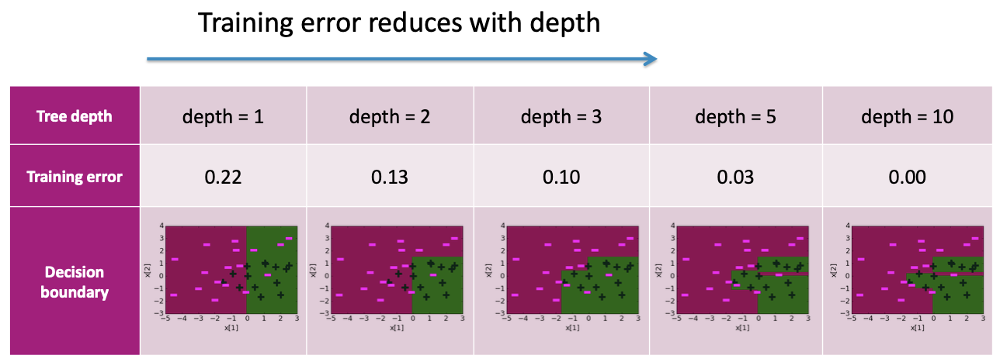

**Visual Progression:**
- **Depth 1:** Simple decision boundary with a single split (e.g., vertical line)
- **Depth 2:** Slightly more complex boundary with two splits creating three rectangular regions
- **Depth 3:** Even more complex boundary with multiple splits and more regions
- **Depth 5:** Highly complex boundary that fits the data points very closely
- **Depth 10:** Extremely complex boundary that perfectly separates all training data points, resulting in zero training error

The progression from depth 1 to depth 10 shows how decision boundaries become increasingly irregular and tailored to individual training points, indicating severe overfitting at higher depths.

## Two approaches to picking simpler trees

To control decision tree complexity and prevent overfitting, we can use two main approaches:

1. **Early Stopping:** Stop the learning algorithm **before** the tree becomes too complex
2. **Pruning:** Simplify the tree **after** the learning algorithm terminates

These approaches complement each other and can be used together to achieve optimal tree complexity.

## Technique 1: Early stopping

### General Stopping Conditions (Recap)

The basic stopping conditions we discussed earlier:

1. **All examples have the same target value** (i.e., a pure node)
2. **No more features to split on**

### Early Stopping Conditions

Additional criteria to prevent the tree from growing too complex:

1. **Limit tree depth:** Choose `max_depth` using a validation set
2. **Minimum error reduction:** Do not consider splits that do not cause a sufficient decrease in classification error
3. **Minimum node size:** Do not split an intermediate node which contains too few data points

### Challenge with early stopping condition 1

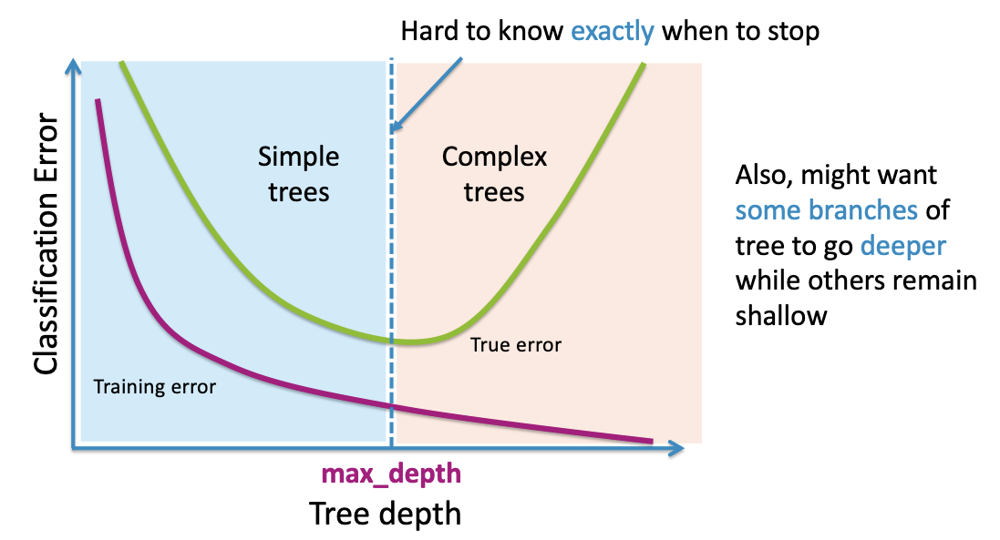

Setting the optimal `max_depth` is challenging because it's difficult to know exactly when to stop.

**The Problem:**
- **Training error** decreases monotonically as tree depth increases
- **True error** follows a U-shaped curve: initially decreases, reaches a minimum, then increases due to overfitting
- The optimal depth lies at the minimum of the true error curve, but this is unknown during training

**Additional Challenge:**
We might want some branches of the tree to go deeper while others remain shallow, but a global `max_depth` constraint applies uniformly to all branches.

### Early stopping condition 2: Pros and Cons

**Pros:**
- A reasonable heuristic for early stopping to avoid useless splits
- Prevents the tree from making splits that don't significantly improve performance

**Cons:**
- **Too short-sighted:** We may miss out on 'good' splits that occur right after 'useless' splits
- **XOR example:** As we saw earlier, individual splits might not reduce classification error, but combinations of splits are necessary for correct classification

## Technique 2: Pruning

### Pruning: Intuition

**Train a complex tree, simplify later**

The pruning approach involves:
1. **Build a complex tree** first (allowing it to grow fully)
2. **Simplify the tree** by removing unnecessary branches

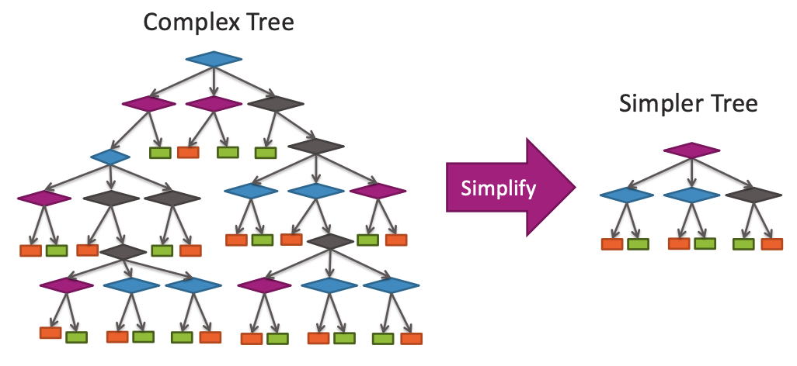

**Visual Process:**
- **Complex Tree:** Deep, multi-level decision tree with many internal nodes and leaf nodes
- **Simplification:** Large arrow pointing from complex tree to simpler tree
- **Simpler Tree:** Much shallower version with fewer levels, internal nodes, and leaf nodes

### Pruning motivation

Pruning addresses the bias-variance trade-off by finding the optimal tree complexity.

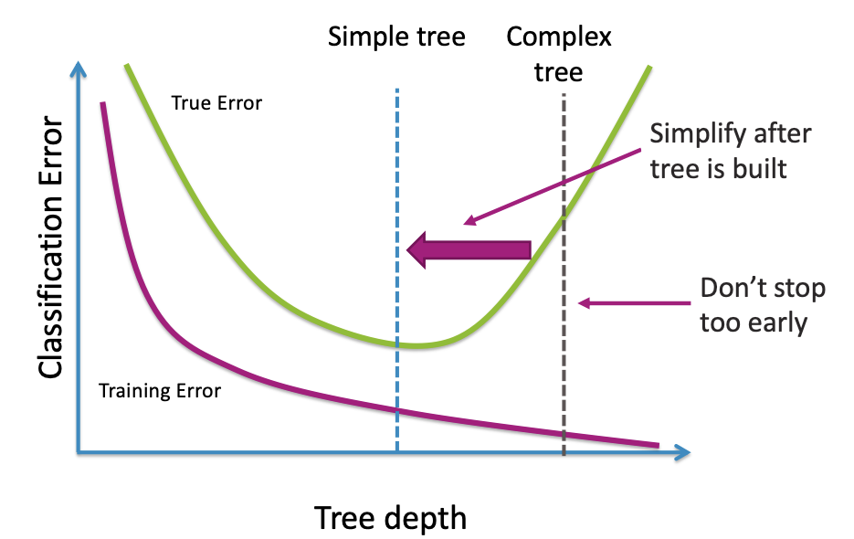

**The Trade-off:**
- **Training Error (purple line):** Monotonically decreases as tree depth increases
- **True Error (green line):** U-shaped curve with a minimum at optimal depth

**Pruning Strategy:**
- **"Simplify after tree is built":** Build complex tree first, then simplify to optimal complexity
- **"Don't stop too early":** Avoid stopping tree growth prematurely, which might result in suboptimal models

The goal is to find the tree depth that minimizes true error, which lies between very simple and very complex trees.

### Scoring trees: Desired total quality format

To evaluate tree quality, we want to balance two competing objectives:

**Want to balance:**
1. **How well tree fits data** (measure of fit)
2. **Complexity of tree** (measure of complexity)

**Total Cost Formula:**
$$\text{Total cost} = \text{measure of fit} + \text{measure of complexity}$$

This formulation allows us to explicitly trade off between model accuracy and simplicity.

## Simple measure of complexity of tree

### Tree Complexity Metric

A simple and effective measure of tree complexity is the number of leaf nodes:

$$L(T) = \text{num of leaf nodes}$$

**Example Decision Tree:**

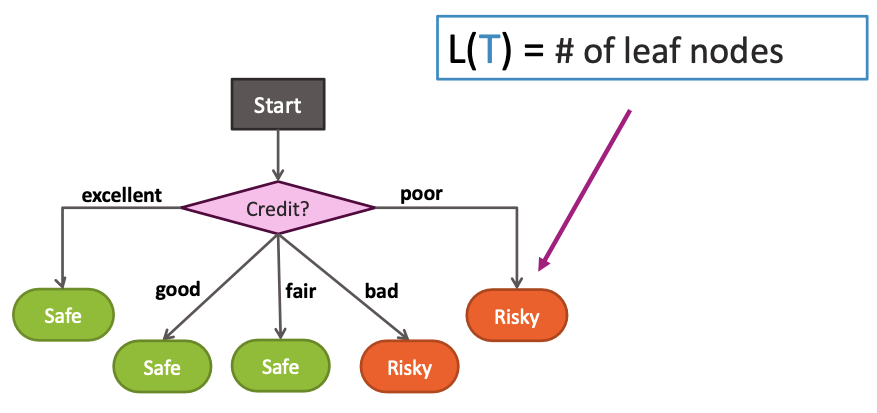

Consider a loan application tree with:
- Root node: "Credit?"
- Five branches: excellent, good, fair, bad, poor
- Leaf nodes: Safe (excellent), Safe (good), Safe (fair), Risky (bad), Risky (poor)

This tree has $L(T) = 5$ leaf nodes, representing its complexity.

### Balance simplicity & predictive power

The challenge is finding the right balance between model complexity and predictive accuracy.

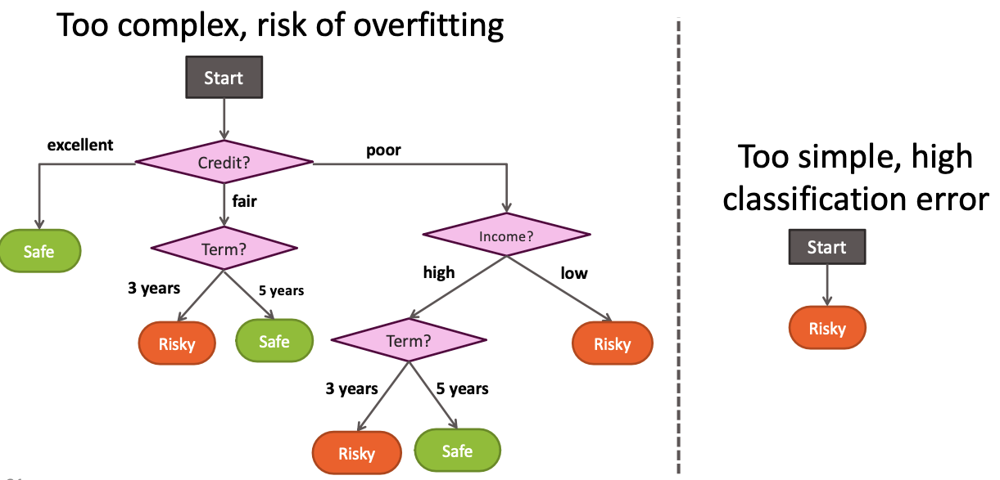

**Too Complex (Risk of Overfitting):**
- Deep tree with many splits and leaf nodes
- Example: Tree with multiple levels including Credit → Term → Income → additional splits
- Fits training data very well but may generalize poorly

**Too Simple (High Classification Error):**
- Very basic tree making single prediction for all cases
- Example: Tree that simply predicts "Risky" for all loan applications
- Low complexity but high error rate

### Balancing fit and complexity

We can formalize this balance using a cost function that combines both objectives:

**Cost Function:**
$$C(T) = \text{Error}(T) + \lambda L(T)$$

Where:
- $C(T)$ is the total cost of tree $T$
- $\text{Error}(T)$ is the classification error of the tree
- $L(T)$ is the number of leaf nodes (complexity measure)
- $\lambda$ is a tuning parameter that controls the trade-off

**Implications of $\lambda$:**
- **If $\lambda = 0$:** No penalty for complexity, leading to more complex trees
- **If $\lambda = \infty$:** Very high penalty for complexity, leading to very simple trees
- **If $\lambda$ in between:** Balance between error and complexity

The regularization parameter $\lambda$ allows us to control the bias-variance trade-off and find the optimal tree complexity for our specific problem.

## Tree pruning algorithm

### Prune if total cost is lower: C(T_smaller) ≤ C(T)

The pruning algorithm uses a cost-complexity approach to determine whether a sub-tree should be pruned. The decision to prune is based on comparing the total cost of the original tree with the total cost of a smaller, pruned version.

**Pruning Condition:**
We prune a sub-tree if the total cost of the smaller tree is less than or equal to the total cost of the original tree:
$$C(T_{\text{smaller}}) \leq C(T)$$

### Step-by-Step Pruning Process

**Step 1: Identify a Candidate Split for Pruning**

Start with a fully grown decision tree $T$ and identify a sub-tree that is a candidate for removal. In our loan application example, we consider the `Term?` split under the `poor` credit and `high` income path.

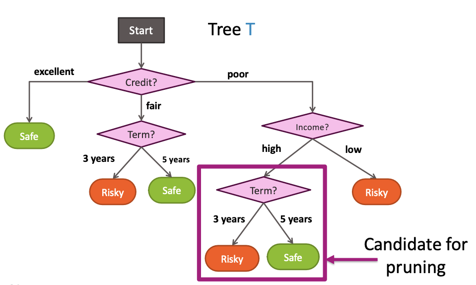

**Original Decision Tree ($T$) Structure:**
- **Start Node**
  - Splits on **Credit?**
    - If `excellent`: Predict **Safe** (leaf node)
    - If `fair`: Splits on **Term?**
      - If `3 years`: Predict **Risky** (leaf node)
      - If `5 years`: Predict **Safe** (leaf node)
    - If `poor`: Splits on **Income?**
      - If `high`: Splits on **Term?** (Candidate for pruning)
        - If `3 years`: Predict **Risky** (leaf node)
        - If `5 years`: Predict **Safe** (leaf node)
      - If `low`: Predict **Risky** (leaf node)

**Step 2: Compute Total Cost of the Original Tree ($T$)**

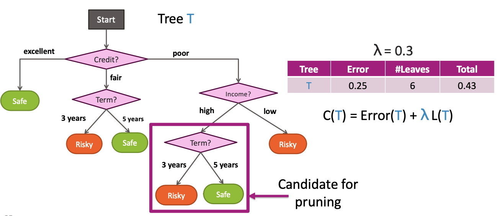

Calculate the total cost using the cost-complexity formula:
$$C(T) = \text{Error}(T) + \lambda L(T)$$

With $\lambda = 0.3$:

| Tree | Error | #Leaves | Total Cost $C(T)$ |
|------|-------|---------|-------------------|
| $T$  | 0.25  | 6       | 0.43              |

**Step 3: "Undo" the Splits (Prune) and Compute Cost of the Smaller Tree ($T_{\text{smaller}}$)**

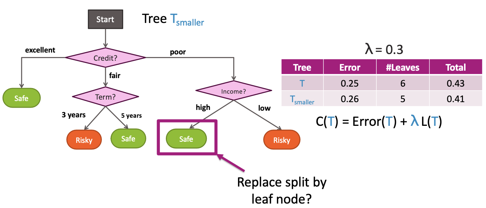

Replace the candidate sub-tree with a single leaf node. The class of this new leaf node is determined by the majority class of the data points that would have passed through the pruned sub-tree.

**Pruned Decision Tree ($T_{\text{smaller}}$) Structure:**
- **Start Node**
  - Splits on **Credit?**
    - If `excellent`: Predict **Safe** (leaf node)
    - If `fair`: Splits on **Term?**
      - If `3 years`: Predict **Risky** (leaf node)
      - If `5 years`: Predict **Safe** (leaf node)
    - If `poor`: Splits on **Income?**
      - If `high`: Predict **Safe** (new leaf node, replacing the `Term?` split)
      - If `low`: Predict **Risky** (leaf node)

**Cost Comparison:**

| Tree         | Error | #Leaves | Total Cost $C(T)$ |
|--------------|-------|---------|-------------------|
| $T$          | 0.25  | 6       | 0.43              |
| $T_{\text{smaller}}$ | 0.26  | 5       | 0.41              |

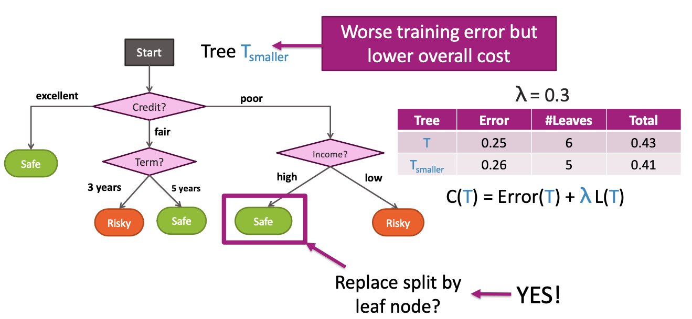

**Decision:**
Since $C(T_{\text{smaller}}) = 0.41 < C(T) = 0.43$, we choose to prune this split. The pruned tree has:
- **Worse training error** (0.26 vs 0.25) but **lower overall cost** (0.41 vs 0.43)
- **Reduced complexity** (5 leaves vs 6 leaves)
- **Better generalization** potential

### Step 4: Repeat Steps 1-4 for Every Split

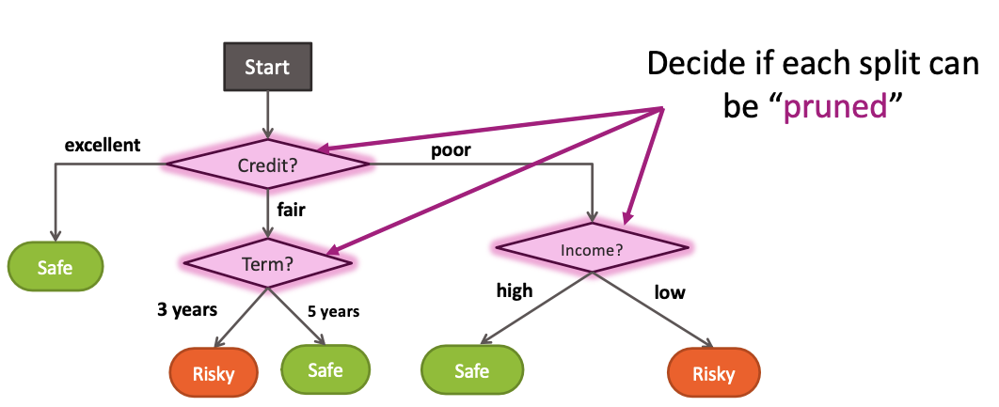

The pruning process is iterative and systematic:

**Iterative Evaluation:**
- Evaluate **every split** in the tree for potential pruning
- Consider each internal node (Credit?, Term?, Income?) as a candidate
- Apply the cost-complexity comparison to each candidate
- Prune splits that satisfy the condition $C(T_{\text{smaller}}) \leq C(T)$

**Systematic Approach:**
- Start from the bottom of the tree (leaf nodes) and work upwards
- Consider each sub-tree rooted at an internal node
- Replace each candidate sub-tree with a leaf node
- Compare costs and decide whether to prune

This iterative process continues until no further pruning improves the total cost, resulting in an optimally pruned tree that balances accuracy and complexity.

## Summary of Overfitting in Decision Trees

### What You Can Do Now

After studying overfitting in decision trees, you should be able to:

**Identify Overfitting:**
- **Recognize when decision trees are overfitting** by observing perfect training accuracy with complex, irregular decision boundaries
- **Understand the relationship between tree depth and training error** (monotonic decrease) vs. true error (U-shaped curve)
- **Identify signs of overfitting** such as highly fragmented decision boundaries and poor generalization

**Prevent Overfitting with Early Stopping:**
- **Limit tree depth** using validation sets to find optimal `max_depth`
- **Avoid splits that don't reduce classification error** significantly
- **Prevent splitting of intermediate nodes** with too few data points
- **Apply minimum error reduction thresholds** to avoid useless splits

**Prevent Overfitting by Pruning Complex Trees:**
- **Use cost-complexity pruning** with the total cost formula: $C(T) = \text{Error}(T) + \lambda L(T)$
- **Balance classification error and tree complexity** using the regularization parameter $\lambda$
- **Iteratively evaluate and prune sub-trees** based on cost comparisons
- **Merge complex trees into simpler ones** while maintaining good generalization

**Advanced Techniques:**
- **Choose appropriate $\lambda$ values** to control the bias-variance trade-off
- **Compare early stopping vs. pruning approaches** and understand their complementary nature
- **Apply cross-validation** to find optimal pruning parameters
- **Monitor validation performance** to ensure pruning improves generalization

This comprehensive understanding of overfitting prevention techniques enables you to build decision trees that generalize well to unseen data while maintaining interpretability and avoiding the pitfalls of overfitting.

