# Boosting

## Simple (weak) classifiers are good!

Weak classifiers, despite their simplicity, offer several advantages that make them valuable building blocks for more sophisticated learning algorithms.

### Examples of Weak Classifiers

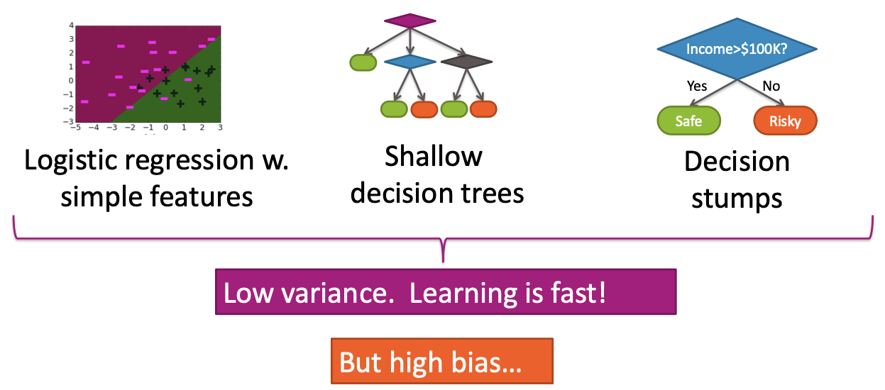

**Logistic Regression with Simple Features:**
A linear classifier that creates a diagonal decision boundary to separate classes. In a 2D scatter plot with purple and black data points, logistic regression with simple features creates a diagonal green line that provides a basic but effective separation.\
**Shallow Decision Trees:**
Small tree structures with limited depth, typically containing:
- A root node
- Two intermediate nodes
- Four leaf nodes (colored purple, blue, gray, and green/orange)

These shallow trees make simple, interpretable decisions without the complexity of deep trees.

**Decision Stumps:**
The simplest form of decision trees - single-level trees with one split. For example:
- **Split Question:** "Income > $100K?"
- **Outcomes:** 
  - **Yes:** Predict Safe (green oval)
  - **No:** Predict Risky (orange oval)

Decision stumps represent the most basic form of decision-making in tree-based models.

### Characteristics of Weak Classifiers

**Advantages:**
- **Low variance:** Predictions are stable and consistent
- **Learning is fast:** Training time is minimal due to simplicity
- **Interpretable:** Easy to understand and explain
- **Robust:** Less prone to overfitting on small datasets

**Disadvantages:**
- **High bias:** May underfit complex patterns in the data
- **Limited expressiveness:** Cannot capture complex non-linear relationships
- **Poor performance on complex datasets:** May achieve only slightly better than random performance

## Finding a classifier that's just right

The challenge in machine learning is finding the optimal balance between model complexity and performance, navigating the bias-variance trade-off.

### The Bias-Variance Trade-off

**Model Complexity vs. Classification Error:**

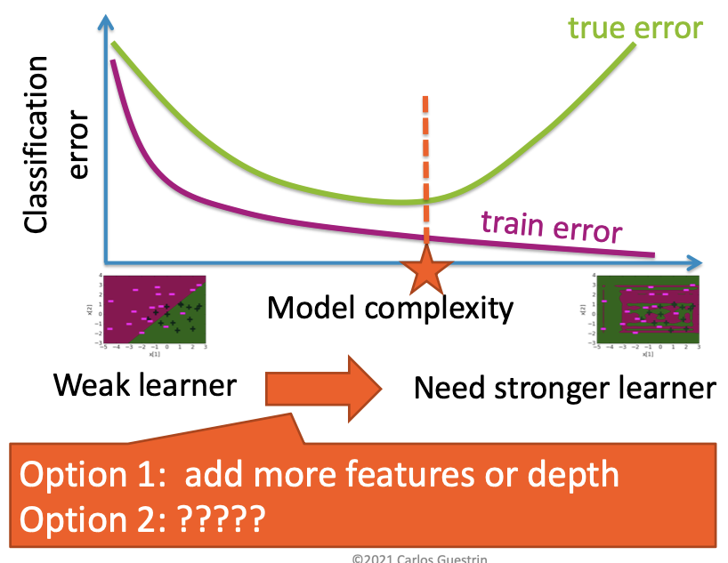

As model complexity increases, we observe different behaviors in training and true error:

**Training Error (Purple Curve):**
- Starts high for simple models
- Rapidly decreases as complexity increases
- Eventually flattens out at a low error value
- Continues to decrease with additional complexity

**True Error (Green Curve):**
- Starts high for simple models (high bias)
- Decreases initially as complexity increases
- Reaches a minimum point (marked by orange star)
- Then increases again due to overfitting (high variance)
- Forms a U-shaped curve

**Optimal Complexity:**
The sweet spot lies at the minimum of the true error curve, where we achieve the best generalization performance.

### Options for Improvement

When faced with the challenge of improving classifier performance, we have two main approaches:

**Option 1: Add more features or depth**
- Increase model complexity by adding more features
- Use deeper decision trees
- Employ more sophisticated algorithms
- **Risk:** May lead to overfitting and increased variance

**Option 2: ?????**
- What are other options and alternative approach available?
- There might be a different strategy beyond simply increasing complexity

## Boosting question

The fundamental question that led to the development of boosting algorithms was whether multiple weak learners could be combined to create a stronger, more effective classifier.

### The Research Question

**Can a set of weak learners be combined to create a stronger learner?**

This question was first formally posed by Kearns and Valiant in 1988, setting the foundation for theoretical work in ensemble learning.

### The Answer

**Yes!** Schapire (1990) provided the theoretical foundation and practical algorithm that demonstrated how weak learners could indeed be combined to create a stronger learner.

### The Concept: Boosting

**Boosting** is an ensemble learning technique that combines multiple weak classifiers to create a strong classifier. The key insight is that by carefully weighting and combining the predictions of multiple simple models, we can achieve better performance than any individual weak learner.

### Amazing Impact

Boosting has had a transformative impact on machine learning and data science:

**Simple Approach:**
- Conceptually straightforward to understand
- Easy to implement and apply
- Based on intuitive principles of learning from mistakes

**Widely Used in Industry:**
- Applied across numerous domains and applications
- Standard tool in many machine learning pipelines
- Proven track record in production systems

**Wins Most Kaggle Competitions:**
- Dominates competitive machine learning
- Consistently achieves top performance
- Preferred choice for structured data problems

**Great Systems:**
- **XGBoost:** Extreme Gradient Boosting, one of the most popular implementations
- **LightGBM:** Microsoft's gradient boosting framework
- **CatBoost:** Yandex's gradient boosting library
- **AdaBoost:** The original boosting algorithm

The success of boosting demonstrates that sometimes the best approach isn't to make individual models more complex, but rather to intelligently combine multiple simple models. This insight has fundamentally changed how we think about machine learning and has led to some of the most powerful and widely-used algorithms in the field.

## Ensemble Classifier

### Single Classifier: The Building Block

A single classifier, often referred to as a "weak learner" in the context of ensemble methods, takes an input and produces a prediction. It serves as the fundamental unit that ensemble methods combine to form a more robust model.

**Input and Output Flow:**
The process of a single classifier can be visualized as a simple decision flow:

1. **Input:** An input vector $x$ (e.g., loan application data)
2. **Decision Node:** A single decision rule is applied (e.g., `Income > $100K?`)
3. **Output:** Based on the decision, a classification $\hat{y} = f(x)$ is produced. This output is typically binary, such as:
   - `+1` (e.g., "Safe" loan)
   - `-1` (e.g., "Risky" loan)

**Example: Loan Application Classifier**
Consider a simple classifier for loan applications:

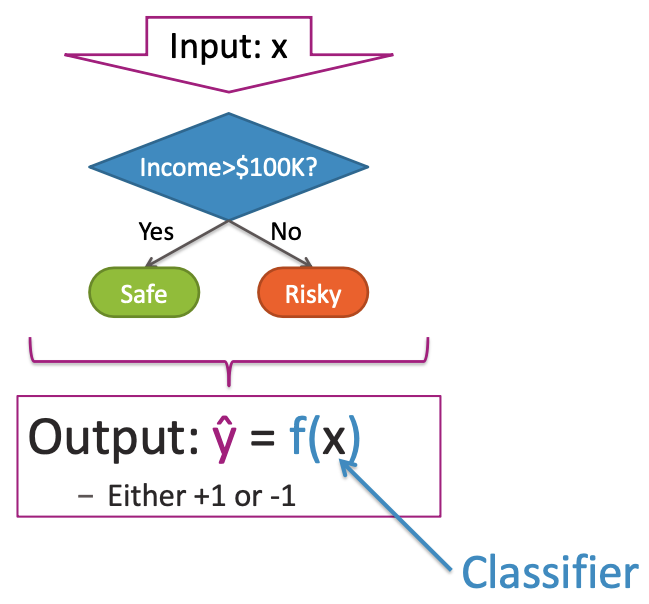

- **Input:** A loan application $x$
- **Decision:** Is the applicant's `Income > $100K`?
  - If `Yes`, the loan is classified as **Safe**
  - If `No`, the loan is classified as **Risky**

This simple classifier, represented by a single decision node, provides a basic prediction for the input $x$.

### Ensemble Methods: Combining Weak Classifiers

Ensemble methods combine the predictions of multiple individual classifiers (often weak learners) to produce a more accurate and robust final prediction. Each individual classifier "votes" on the prediction, and these votes are aggregated.

**Example: Multiple Classifiers Voting on a Loan Application**
Let's consider a specific loan application $x = (\text{Income}=\$120K, \text{Credit}=\text{Bad}, \text{Savings}=\$50K, \text{Market}=\text{Good})$. We use four different weak classifiers, each focusing on a different feature:

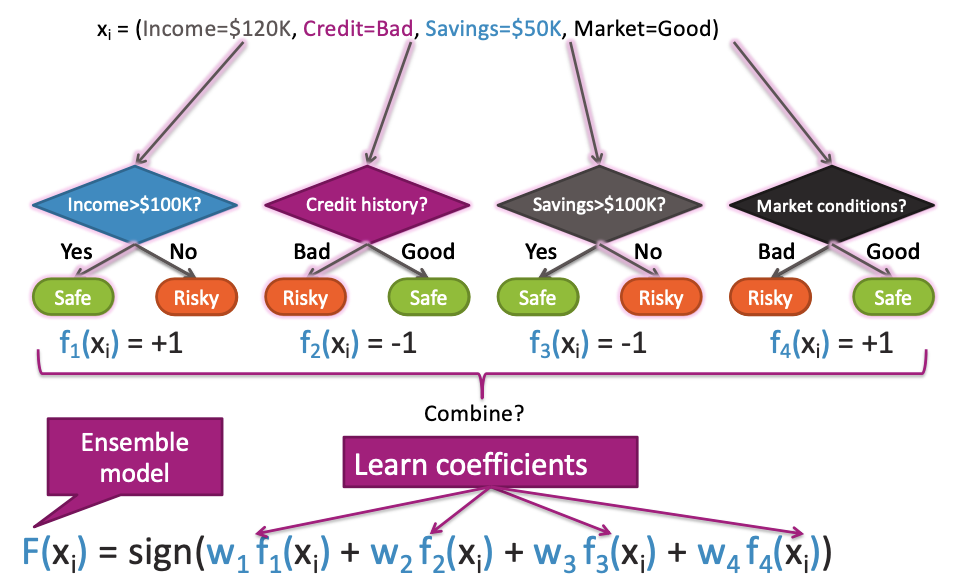

1. **Classifier 1 ($f_1(x)$): Income > $100K?**
   - Input: $x$ (Income=$120K$)
   - Decision: Yes
   - Output: Safe ($f_1(x) = +1$)

2. **Classifier 2 ($f_2(x)$): Credit history?**
   - Input: $x$ (Credit=Bad)
   - Decision: Bad
   - Output: Risky ($f_2(x) = -1$)

3. **Classifier 3 ($f_3(x)$): Savings > $100K?**
   - Input: $x$ (Savings=$50K$)
   - Decision: No
   - Output: Risky ($f_3(x) = -1$)

4. **Classifier 4 ($f_4(x)$): Market conditions?**
   - Input: $x$ (Market=Good)
   - Decision: Good
   - Output: Safe ($f_4(x) = +1$)

**Combining Predictions: The Ensemble Model**
To combine these individual predictions, an ensemble model learns coefficients (weights) for each classifier. The final prediction is a weighted sum of the individual classifier outputs, passed through a sign function for binary classification:

$$F(x_i) = \text{sign}(w_1 f_1(x_i) + w_2 f_2(x_i) + w_3 f_3(x_i) + w_4 f_4(x_i))$$

Here, $w_j$ represents the learned coefficient (weight) for classifier $f_j(x_i)$. The `sign` function converts the weighted sum into a binary output (+1 or -1).

### Ensemble Classifier in General

An ensemble classifier aims to leverage the collective intelligence of multiple individual classifiers to achieve superior performance compared to any single classifier.

**Goal:**
- **Predict output $y$:** The target variable, typically binary (`+1` or `-1`)
- **From input $x$:** The feature vector representing the data point

**Learn Ensemble Model:**
The learning process for an ensemble model involves two key components:

1. **Classifiers:** A set of $T$ individual classifiers, denoted as $f_1(x), f_2(x), \dots, f_T(x)$. These are often weak learners.
2. **Coefficients:** A set of learned weights (or coefficients) for each classifier, denoted as $\hat{w}_1, \hat{w}_2, \dots, \hat{w}_T$. These coefficients determine the influence of each classifier on the final prediction.

**Prediction:**
The final prediction $\hat{y}$ from an ensemble classifier is given by the weighted sum of the individual classifier predictions, passed through a sign function:

$$\hat{y} = \text{sign} \left( \sum_{t=1}^{T} \hat{w}_t f_t(x) \right)$$

This formula represents the core mechanism of many boosting algorithms, where weak classifiers are iteratively trained and combined with learned weights to form a strong ensemble model.

## Boosting

### Training a classifier

The fundamental workflow of supervised learning involves training a classifier from data and using it to make predictions.

**Basic Training Process:**
1. **Training Data:** Start with a dataset containing input-output pairs
2. **Learn Classifier:** Apply a learning algorithm to the training data to find a function $f(x)$
3. **Predict:** Use the learned classifier to make predictions: $\hat{y} = \text{sign}(f(x))$

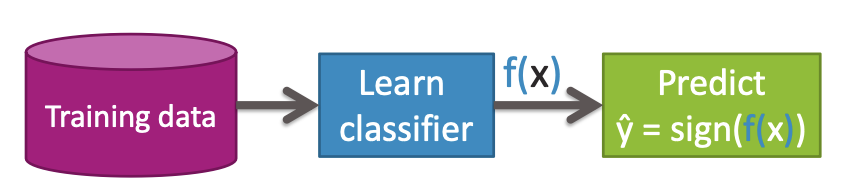

**Flow:**
Training Data → Learn Classifier → $f(x)$ → Predict $\hat{y} = \text{sign}(f(x))$

This represents the standard supervised learning paradigm where we learn a mapping from inputs to outputs.

### Learning decision stump

A decision stump is the simplest form of a decision tree - a single-level tree with one split. Let's see how to learn a decision stump from data.

**Example Dataset:**
Consider a loan application dataset with the following structure:

| Credit | Income | y     |
|--------|--------|-------|
| A      | $130K  | Safe  |
| B      | $80K   | Risky |
| C      | $110K  | Risky |
| A      | $110K  | Safe  |
| A      | $90K   | Safe  |
| B      | $120K  | Safe  |
| C      | $30K   | Risky |
| C      | $60K   | Risky |
| B      | $95K   | Safe  |
| A      | $60K   | Safe  |
| A      | $98K   | Safe  |

**Learning a Decision Stump on Income:**

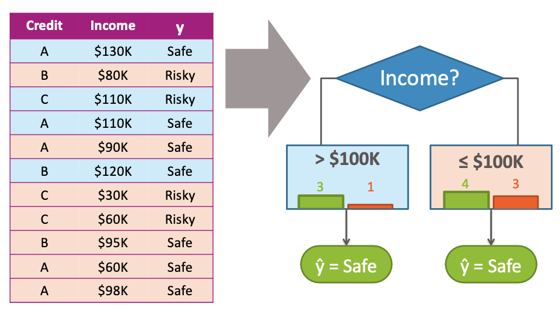

**Split Question:** Is `Income` > $100K?

**Branch 1: Income > $100K**
- **Safe Count:** 3 instances (A-$130K, A-$110K, B-$120K)
- **Risky Count:** 1 instance (C-$110K)
- **Prediction:** $\hat{y} = \text{Safe}$ (majority: 3 Safe vs 1 Risky)

**Branch 2: Income ≤ $100K**
- **Safe Count:** 4 instances (A-$90K, B-$95K, A-$60K, A-$98K)
- **Risky Count:** 3 instances (B-$80K, C-$30K, C-$60K)
- **Prediction:** $\hat{y} = \text{Safe}$ (majority: 4 Safe vs 3 Risky)

The decision stump creates a simple rule: if income is above $100K, predict Safe; if income is $100K or below, also predict Safe (based on majority voting).

### Boosting = Focus learning on "hard" points

Boosting is an iterative ensemble learning technique that focuses on the most challenging data points by giving them more attention in subsequent learning rounds.

**Core Concept:**
Boosting focuses the next classifier on places where the current classifier performs poorly, effectively learning from mistakes.

**Boosting Workflow:**

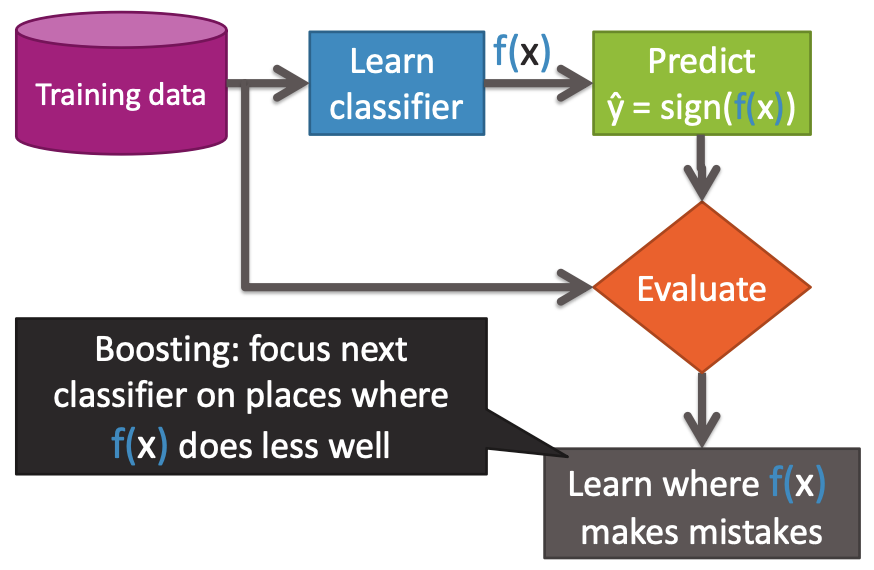

1. **Start with Training Data:** Begin with the original dataset

2. **Learn Classifier:** Train a weak classifier (e.g., decision stump) on the current data

3. **Predict:** Use the classifier to make predictions: $\hat{y} = \text{sign}(f(x))$

4. **Evaluate:** Assess the performance of the current classifier

5. **Learn where f(x) makes mistakes:** Identify data points that were misclassified

6. **Focus Next Classifier:** Adjust the learning process to pay more attention to the "hard" points (misclassified examples)

**Key Insight:**
"Boosting: focus next classifier on places where f(x) does less well"

This iterative process allows the algorithm to build a strong ensemble by sequentially addressing the weaknesses of previous classifiers. Each new classifier is trained to correct the mistakes of its predecessors, leading to progressively better overall performance.

The beauty of boosting is that it transforms a collection of weak learners into a powerful ensemble by intelligently focusing on the most challenging aspects of the data.

### Learning on Weighted Data

In boosting algorithms, we work with weighted data where each data point has an associated weight that reflects its importance in the learning process.

**More Weight on "Hard" or More Important Points:**
- Each data point $(x_i, y_i)$ is assigned a weight $\alpha_i$
- Points that are harder to classify or were misclassified get higher weights
- This forces the learning algorithm to pay more attention to challenging examples

**Weighted Learning Process:**
- A data point with weight $\alpha_i = 2$ effectively counts as 2 data points
- The learning algorithm treats weighted data as if certain examples appeared multiple times
- This mechanism is crucial for boosting's iterative improvement strategy

### Learning a Decision Stump on Weighted Data

When learning decision stumps on weighted data, we need to consider the weights when computing majority votes and making predictions.

**Increase Weight $\alpha$ of Harder/Misclassified Points:**
The key insight is to increase the weights of points that are harder to classify or were misclassified by previous learners.

**Example Weighted Dataset:**

| Credit | Income | y (Target) | Weight $\alpha$ |
|--------|--------|------------|-----------------|
| A      | $130K  | Safe       | 0.5             |
| B      | $80K   | Risky      | 1.5             |
| C      | $110K  | Risky      | 1.2             |
| A      | $110K  | Safe       | 0.8             |
| A      | $90K   | Safe       | 0.6             |
| B      | $120K  | Safe       | 0.7             |
| C      | $30K   | Risky      | 3               |
| C      | $60K   | Risky      | 2               |
| B      | $95K   | Safe       | 0.8             |
| A      | $60K   | Safe       | 0.7             |
| A      | $98K   | Safe       | 0.9             |

**Decision Stump based on Income:**

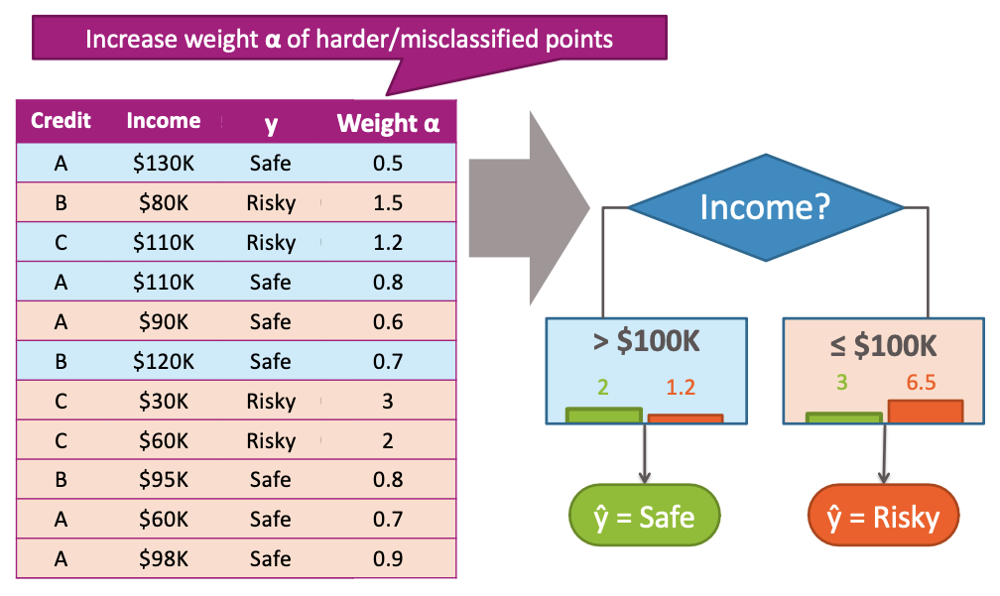

Consider a split at Income = $100K:

**If Income > $100K:**
- Safe points: (0.5 from $130K) + (0.8 from $110K) + (0.7 from $120K) = 2.0
- Risky points: (1.2 from $110K) = 1.2
- **Prediction:** $\hat{y} = \text{Safe}$ (since 2.0 > 1.2)

**If Income ≤ $100K:**
- Safe points: (0.6 from $90K) + (0.8 from $95K) + (0.7 from $60K) + (0.9 from $98K) = 3.0
- Risky points: (1.5 from $80K) + (3 from $30K) + (2 from $60K) = 6.5
- **Prediction:** $\hat{y} = \text{Risky}$ (since 6.5 > 3.0)

This demonstrates how weights influence the majority class decision in each branch of the decision stump.

## AdaBoost Algorithm

### Boosting: Greedy Learning Ensembles from Data

AdaBoost is a specific implementation of boosting that uses a greedy approach to build an ensemble of weak learners.

**Boosting Algorithm Flowchart:**

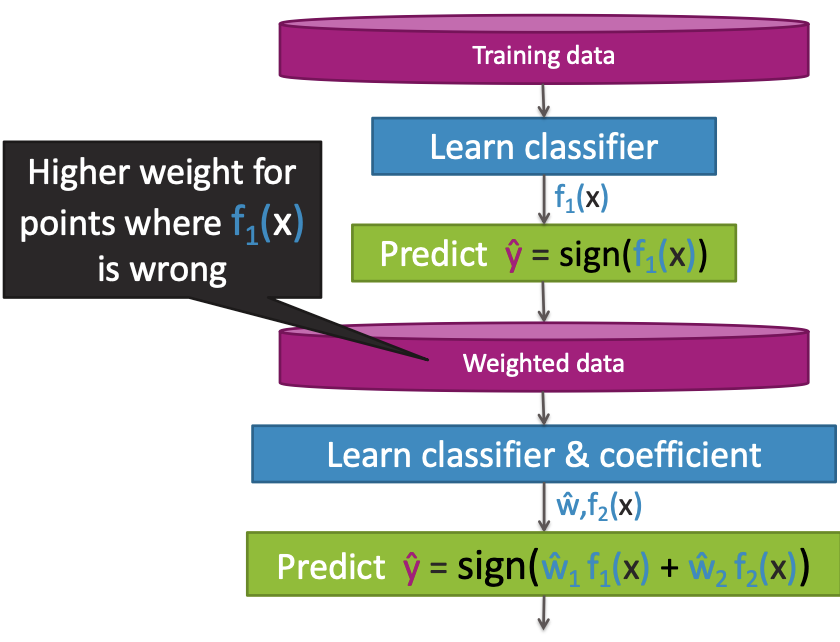

The AdaBoost algorithm follows this iterative process:

1. **Initial Training Data:** Start with the original training dataset with uniform weights

2. **Learn Classifier $f_1(x)$:** Train a weak classifier (e.g., decision stump) on the current weighted data

3. **Predict $\hat{y} = \text{sign}(f_1(x))$:** Use the learned classifier to make predictions

4. **Adjust Weights:** Identify misclassified points and increase their weights, decrease weights of correctly classified points

5. **Weighted Data:** Create new dataset with adjusted weights

6. **Learn Classifier $f_2(x)$ & Coefficient $\hat{w}_2$:** Train a second weak classifier on the weighted data and learn its coefficient

7. **Combine Predictions:** Form ensemble prediction: $\hat{y} = \text{sign}(\hat{w}_1 f_1(x) + \hat{w}_2 f_2(x))$

8. **Iterate:** Continue this process, adding new classifiers to the ensemble

**Key Features:**
- **Greedy Approach:** Each iteration focuses on correcting the mistakes of the current ensemble
- **Weight Updates:** Misclassified points get higher weights in subsequent iterations
- **Coefficient Learning:** Each weak learner gets a weight coefficient based on its performance
- **Ensemble Combination:** Final prediction is a weighted vote of all weak learners

This iterative process allows AdaBoost to build a strong classifier by combining multiple weak learners, each focusing on the most challenging aspects of the data identified by previous learners.

## AdaBoost Algorithm Details

### AdaBoost: Learning Ensemble

The AdaBoost algorithm, introduced by Freund & Schapire (1999), is a specific implementation of boosting that iteratively builds an ensemble of weak classifiers.

**Initialization:**
Start with the same weight for all data points: $\alpha_i = 1/N$ for all $i = 1, \dots, N$.

**Iterative Learning Loop (for $t = 1, \dots, T$):**

1. **Learn $f_t(x)$ with data weights $\alpha_i$:** Train a weak classifier using the current weighted data
2. **Compute coefficient $\hat{W}_t$:** Calculate the importance weight for the current classifier
3. **Recompute weights $\alpha_i$:** Update data point weights based on classification performance

**Final Model Prediction:**
$$\hat{y} = \text{sign} \left( \sum_{t=1}^{T} \hat{W}_t f_t(x) \right)$$

### Computing Coefficient $\hat{W}_t$

The coefficient $\hat{W}_t$ determines how much influence the weak classifier $f_t(x)$ has in the final ensemble.

**Conceptual Decision:**
- **Is $f_t(x)$ good?**
  - **Yes:** $\hat{W}_t$ large (high positive value)
  - **No:** $\hat{W}_t$ small (low or negative value)

**Definition of "Good" Classifier:**
$f_t(x)$ is good $\rightarrow f_t$ has low training error

**Measuring Error in Weighted Data:**
- Just weighted # of misclassified points
- Sum the weights of all data points that $f_t(x)$ misclassifies

### AdaBoost: Formula for Computing Coefficient $\hat{W}_t$

The coefficient $\hat{W}_t$ is calculated using the following formula:

$$\hat{W}_t = \frac{1}{2} \ln \left( \frac{1 - \text{weighted\_error}(f_t)}{\text{weighted\_error}(f_t)} \right)$$

**Interpretation:**
- **Low weighted error:** Results in large positive $\hat{W}_t$ (strong classifier)
- **High weighted error:** Results in small or negative $\hat{W}_t$ (weak classifier)
- **Error = 0.5:** Results in $\hat{W}_t = 0$ (random classifier)

### AdaBoost: Updating Weights $\alpha_i$

After each weak classifier is trained, the weights of data points are updated based on whether they were correctly classified.

**Conceptual Weight Update:**
- **Question:** Did $f_t$ get $x_i$ right?
  - **Yes (Correct):** Decrease weight $\alpha_i$
  - **No (Wrong):** Increase weight $\alpha_i$

**Mathematical Weight Update Formula:**

If $f_t(x_i) = y_i$ (correct classification):
$$\alpha_i \leftarrow \alpha_i e^{-\hat{W}_t}$$

If $f_t(x_i) \neq y_i$ (misclassification):
$$\alpha_i \leftarrow \alpha_i e^{\hat{W}_t}$$

### AdaBoost: Normalizing Weights $\alpha_i$

**Problem:** Without normalization, weights can become numerically unstable after many iterations.

**Solution:** Normalize weights to add up to 1 after every iteration:

$$\alpha_i \leftarrow \frac{\alpha_i}{\sum_{j=1}^N \alpha_j}$$

This ensures that:
- Weights always sum to 1
- Prevents numerical overflow/underflow
- Maintains valid probability distribution

### Complete AdaBoost Learning Ensemble Algorithm

**Step-by-Step Process:**

1. **Initialize:** $\alpha_i = 1/N$ for all $i = 1, \dots, N$

2. **For $t = 1, \dots, T$:**
   
   a. **Learn $f_t(x)$ with data weights $\alpha_i$:**
      - Train weak classifier on weighted data
      - Focus on minimizing weighted classification error
   
   b. **Compute coefficient $\hat{w}_t$:**
      - Calculate weighted error of $f_t(x)$
      - Apply formula: $\hat{w}_t = \frac{1}{2} \ln \left( \frac{1 - \text{weighted\_error}(f_t)}{\text{weighted\_error}(f_t)} \right)$
   
   c. **Recompute weights $\alpha_i$:**
      - For correct classifications: $\alpha_i \leftarrow \alpha_i e^{-\hat{w}_t}$
      - For misclassifications: $\alpha_i \leftarrow \alpha_i e^{\hat{w}_t}$
   
   d. **Normalize weights $\alpha_i$:**
      - $\alpha_i \leftarrow \frac{\alpha_i}{\sum_{j=1}^N \alpha_j}$

3. **Final Model Prediction:**
   $$\hat{y} = \text{sign} \left( \sum_{t=1}^T \hat{w}_t f_t(x) \right)$$

**Key Features:**
- **Iterative Focus:** Each new classifier focuses on previously misclassified points
- **Weighted Voting:** Final prediction is a weighted combination of all weak classifiers
- **Automatic Coefficient Learning:** Each classifier's importance is automatically determined
- **Numerical Stability:** Weight normalization prevents computational issues

This complete algorithm demonstrates how AdaBoost transforms a collection of simple weak learners into a powerful ensemble classifier through intelligent weight management and iterative learning.

## AdaBoost Example: A Visualization

### t=1: Learn a Classifier on Original Data

In the first iteration, we train a weak classifier (decision stump) on the original dataset where all data points have equal weights.

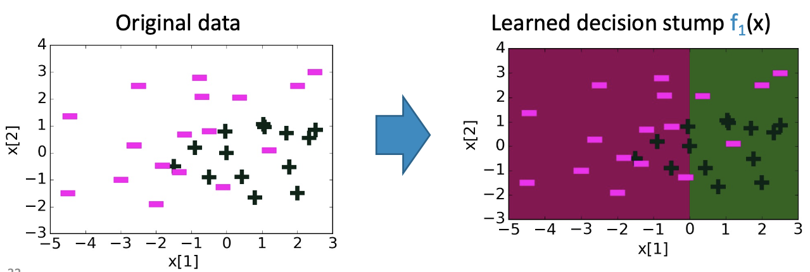

**Original Data:**
We start with a 2D scatter plot showing two classes of data points: purple dashes (negative class) and black crosses (positive class). The x-axis is $x[1]$ (ranging from -5 to 3) and the y-axis is $x[2]$ (ranging from -3 to 4). The data points are distributed across this space with some overlap between the classes.

**Learned Decision Stump $f_1(x)$:**
After training, the first decision stump $f_1(x)$ creates a vertical decision boundary at approximately $x[1] = -0.5$. The region to the left of this boundary is classified as purple, and the region to the right is classified as green.

**Classification Results:**
- **Correctly Classified:** Many purple dashes are correctly classified in the left region, and many black crosses are correctly classified in the right region
- **Misclassified Purple Dashes:** Several purple dashes are located in the green (right) region
- **Misclassified Black Crosses:** Several black crosses are located in the purple (left) region

### Updating Weights $\alpha_i$

After learning the first classifier, we update the weights of data points to focus the next classifier on the misclassified examples.

**Learned Decision Stump $f_1(x)$ (revisited):**
This plot shows the same decision boundary and misclassified points from the previous step.

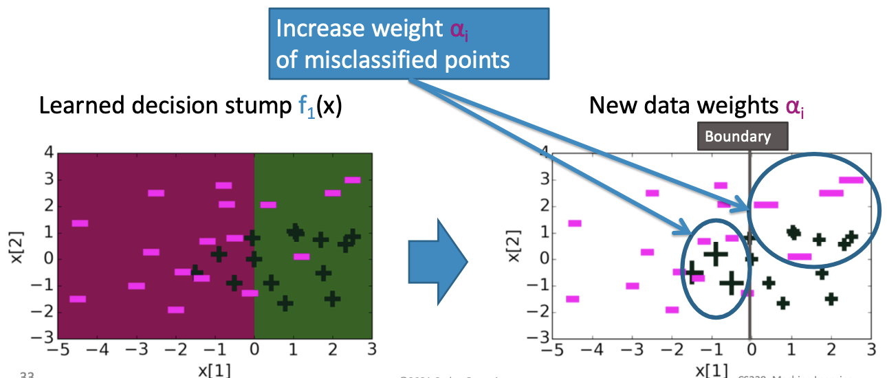

**New Data Weights $\alpha_i$:**
This plot shows the original data points with their updated weights. Misclassified points from the previous step are now visually emphasized with larger markers (larger circles around them), indicating that their weights $\alpha_i$ have been increased. This highlights the points that the next classifier should focus on.

### t=2: Learn Classifier on Weighted Data

In the second iteration, we train a new weak classifier on the data with updated weights, attempting to correct the mistakes made by the first classifier.

**Weighted Data using $\alpha_i$ chosen in previous iteration:**
This plot displays the data points with their new weights. The misclassified points from the previous iteration (purple dashes in the right region, black crosses in the left region) appear larger, reflecting their increased importance.

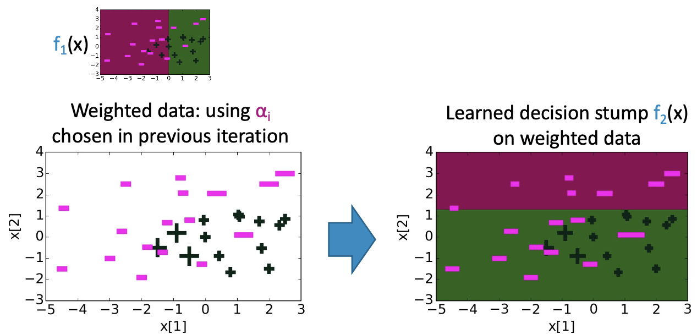

**Learned Decision Stump $f_2(x)$ on Weighted Data:**
Based on the weighted data, a new decision stump $f_2(x)$ creates a horizontal decision boundary at approximately $x[2] = 0.5$. The region above this boundary is classified as purple, and the region below is classified as green. This new boundary effectively separates many of the points that were misclassified by $f_1(x)$.

## AdaBoost: Ensemble becomes weighted sum of learned classifiers

The core idea of AdaBoost is to combine multiple weak classifiers, each trained on a re-weighted version of the data, into a strong ensemble classifier.

**Combining Weak Classifiers:**
Consider two weak classifiers, $f_1(x)$ and $f_2(x)$, each represented by a simple decision stump. These classifiers are combined with learned coefficients (weights) $\hat{W}_1$ and $\hat{W}_2$ to form the ensemble:

$$\text{Ensemble}(x) = \hat{W}_1 f_1(x) + \hat{W}_2 f_2(x)$$

**Example Visualization:**

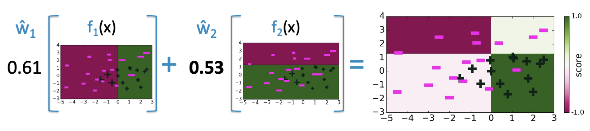

**First Weak Classifier ($f_1(x)$) with weight $\hat{W}_1 = 0.61$:**
- This classifier is a decision stump that splits the 2D feature space based on the $x[1]$ feature
- The decision boundary is a vertical line at approximately $x[1] = -1$
- Regions to the left of the boundary are classified as negative (purple), and regions to the right are classified as positive (green)
- The plot shows a scatter of data points, with magenta dashes representing negative examples and black crosses representing positive examples

**Second Weak Classifier ($f_2(x)$) with weight $\hat{W}_2 = 0.53$:**
- This classifier is another decision stump that splits the 2D feature space based on the $x[2]$ feature
- The decision boundary is a horizontal line at approximately $x[2] = 0$
- Regions below the boundary are classified as positive (green), and regions above are classified as negative (purple)
- The plot also shows the same scatter of data points

**Combined Ensemble Classifier:**
- The final ensemble combines the predictions of $f_1(x)$ and $f_2(x)$ weighted by their respective coefficients
- The resulting decision boundary is more complex than either individual stump, showing a combination of the vertical and horizontal splits
- The output is a score ranging from -1.0 (dark purple) to 1.0 (light green), indicating the confidence of the classification

## Decision boundary of ensemble classifier after 30 iterations

As AdaBoost iteratively trains weak classifiers and combines them, the ensemble's decision boundary becomes increasingly complex and refined. After a sufficient number of iterations (e.g., 30 iterations), the ensemble can achieve a highly accurate separation of classes, even for non-linearly separable data.

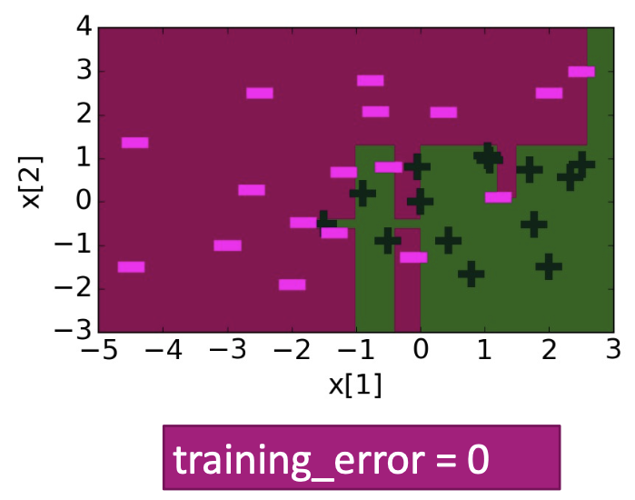

**Final Decision Boundary:**
- The plot displays a 2D feature space with $x[1]$ on the x-axis and $x[2]$ on the y-axis
- The decision boundary is highly non-linear, forming intricate regions of dark purple (negative class) and dark green (positive class)
- All magenta dashes (negative examples) are perfectly enclosed within the purple regions, and all black crosses (positive examples) are perfectly enclosed within the green regions
- This perfect separation indicates that the ensemble classifier has achieved a 

**training_error = 0**, meaning it correctly classifies all training data points

This demonstrates the power of boosting: by combining many simple, weak classifiers, AdaBoost can construct a highly complex and accurate strong classifier capable of learning intricate decision boundaries that would be impossible for any single weak learner to achieve.

## Boosting Convergence & Overfitting

### Boosting Question Revisited

The fundamental question that led to the development of boosting algorithms was whether multiple weak learners could be combined to create a stronger, more effective classifier.

**Historical Context:**
- **Kearns and Valiant (1988):** First formally posed the question: "Can a set of weak learners be combined to create a stronger learner?"
- **Schapire (1990):** Provided the theoretical foundation and practical algorithm that demonstrated how weak learners could indeed be combined to create a stronger learner

This theoretical breakthrough led to the development of boosting algorithms that have revolutionized machine learning.

### Training Error of Boosting

Boosting algorithms are highly effective at reducing training error, often driving it to zero after a sufficient number of iterations.

**Training Error Reduction:**
A line graph shows the training error (y-axis, ranging from 0.00 to 0.25) as a function of boosting iterations (x-axis, ranging from 0 to 50).

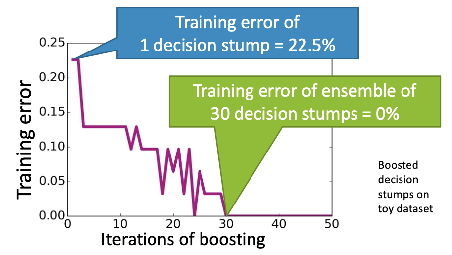

- **Initial State (1 decision stump):** Training error starts at 22.5%
- **Iterative Decrease:** As the number of boosting iterations increases, the training error (purple line) generally decreases with some fluctuations
- **Zero Error (30 decision stumps):** After approximately 30 iterations, the training error drops to 0%
- **Context:** This behavior is observed in practical applications with boosted decision stumps on toy datasets

### AdaBoost Theorem

The AdaBoost algorithm provides theoretical guarantees regarding its ability to reduce training error.

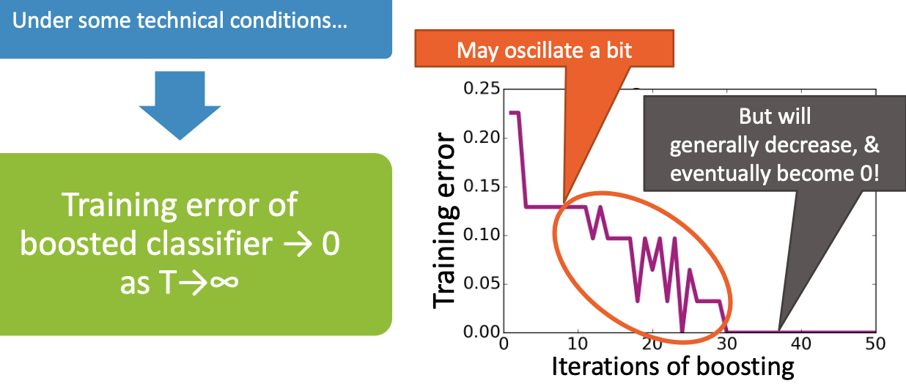

**Theorem Statement:**
Under some technical conditions, the training error of a boosted classifier approaches 0 as the number of iterations ($T$) approaches infinity:
$$\text{Training error of boosted classifier} \to 0 \quad \text{as} \quad T \to \infty$$

**Behavior of Training Error:**
A line graph shows the training error (y-axis, 0.00 to 0.25) against iterations of boosting (x-axis, 0 to 50).

- **Oscillation:** The training error (purple line) may "oscillate a bit" in the initial iterations
- **General Decrease and Zero Error:** Despite oscillations, the training error "will generally decrease, & eventually become 0!"

### Condition of AdaBoost Theorem

The AdaBoost theorem requires a specific condition to hold for the theoretical guarantees to apply.

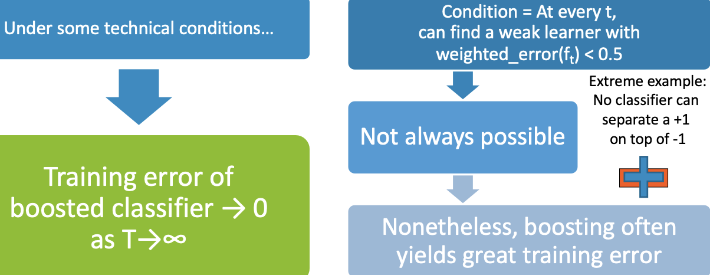

**Core Condition:**
At every iteration $t$, we must be able to find a weak learner with weighted error less than 0.5:
$$\text{weighted\_error}(f_t) < 0.5$$

**When the Condition Fails:**
This condition is not always possible to satisfy. An extreme example is when no classifier can separate the data, such as having a +1 point directly on top of a -1 point.

**Practical Reality:**
Even when the strict condition isn't always met, boosting often yields great training error reduction in practice.

### Decision Trees vs Boosted Decision Stumps on Loan Data

Comparing the performance of standard decision trees with boosted decision stumps reveals important differences in overfitting behavior.

**Decision Trees on Loan Data:**
A line graph plots classification error (y-axis, 0.05 to 0.40) against tree depth (x-axis, 0 to 18).

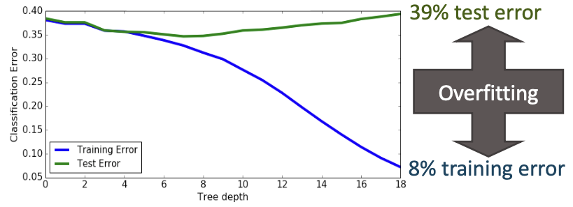

- **Training Error (blue line):** Starts high (~0.35) and steadily decreases to very low values (~0.08) as tree depth increases
- **Test Error (green line):** Starts high (~0.35), decreases slightly initially, then steadily increases to high values (~0.39) as tree depth increases
- **Overfitting:** The gap between 39% test error and 8% training error clearly demonstrates overfitting

**Boosted Decision Stumps on Loan Data:**
A line graph plots classification error (y-axis, 0.28 to 0.36) against number of iterations (x-axis, 0 to 18).

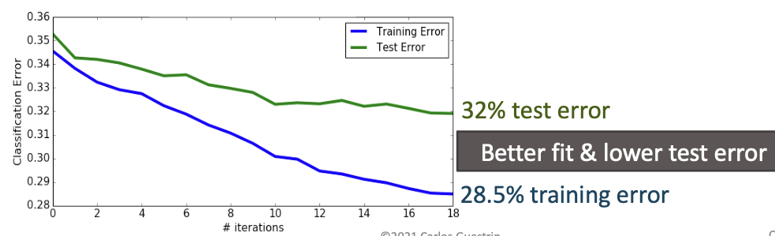

- **Training Error (blue line):** Starts high (~0.35) and steadily decreases to moderate values (~0.285) as iterations increase
- **Test Error (green line):** Starts high (~0.35) and steadily decreases to moderate values (~0.32) as iterations increase
- **Better Fit:** Achieving 32% test error and 28.5% training error shows better generalization with smaller gap between training and test error

### Boosting Tends to be Robust to Overfitting

Boosting demonstrates remarkable robustness to overfitting compared to other ensemble methods.

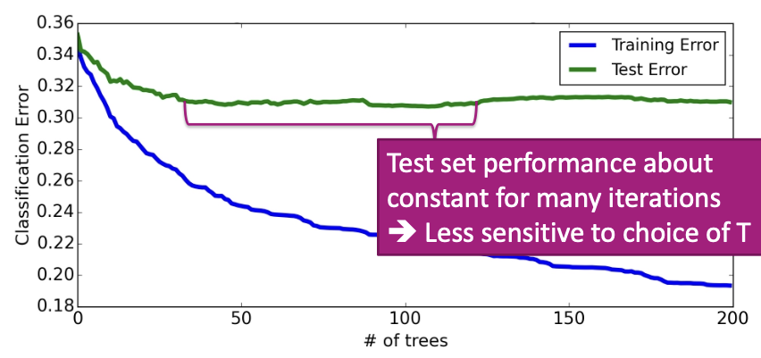

**Classification Error vs Number of Trees:**
A line graph plots classification error (y-axis, 0.18 to 0.36) against number of trees (x-axis, 0 to 200).

- **Training Error (blue line):** Starts high (~0.35) and continuously decreases as the number of trees increases, reaching ~0.20 at 200 trees
- **Test Error (green line):** Starts high (~0.35), decreases significantly to a minimum (~0.28) at approximately 50 trees, then remains relatively flat, fluctuating slightly between 0.28 and 0.29 even as the number of trees increases to 200
- **Robustness:** Test set performance remains about constant for many iterations, making boosting less sensitive to the choice of T

### But Boosting Will Eventually Overfit

While boosting is robust to overfitting, it will eventually overfit if too many weak learners are used.

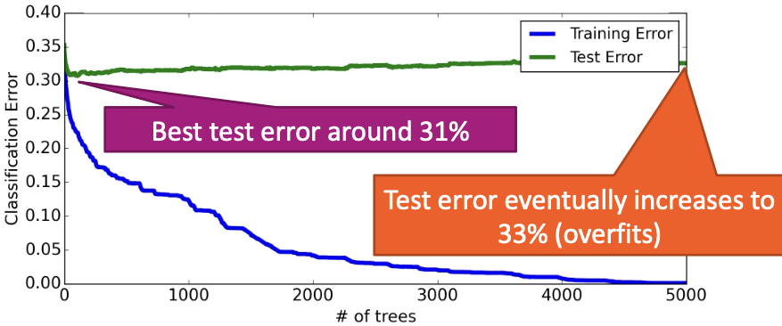

**Classification Error vs Number of Trees:**
A line graph plots classification error (y-axis, 0.00 to 0.40) against number of trees (x-axis, 0 to 5000).

- **Training Error (blue line):** Starts around 0.30-0.35 and steadily decreases as the number of trees increases, approaching 0.00
- **Test Error (green line):** Starts around 0.30-0.32, initially decreases, reaches a minimum, then starts to increase
- **Best Performance:** Best test error around 31% occurs at approximately 1000-1500 trees
- **Overfitting:** Test error eventually increases to 33% as the number of trees grows to 4000-5000

**Key Insight:** Must choose maximum number of components T carefully to prevent overfitting.

## Variants of Boosting and Related Algorithms

There are hundreds of variants of boosting, with some of the most important being:

### Gradient Boosting
- **Like AdaBoost:** But useful beyond basic classification
- **Great implementations available:** e.g., XGBoost, LightGBM, CatBoost
- **More general:** Can handle regression, ranking, and other tasks

### Many Other Approaches to Learn Ensembles

**Random Forests (Bagging):**
- **Bagging:** Pick random subsets of the data
  - Learn a tree in each subset
  - Average predictions
- **Simpler than boosting:** Easier to parallelize
- **Typically higher error:** Than boosting for same number of trees/iterations

## Impact of Boosting

Boosting has had a **HUGE IMPACT** on machine learning, becoming one of the most powerful and widely used techniques.

### Amongst Most Useful ML Methods Ever Created
- **Extremely useful in computer vision:** Standard approach for face detection
- **Used by most winners of ML competitions:** Kaggle, KDD Cup, etc.
  - Applications include malware classification, credit fraud detection, ads click-through rate estimation, sales forecasting, ranking webpages for search, Higgs boson detection, and many more
- **Most deployed ML systems use model ensembles:** Coefficients often chosen manually, with boosting, bagging, or other methods

### What You Can Do Now

After studying boosting, you should be able to:

**Core Concepts:**
- **Identify ensemble classifiers** and understand their structure
- **Formalize ensembles** as weighted combinations of simpler classifiers

**Boosting Framework:**
- **Outline the boosting framework** – sequentially learn classifiers on weighted data
- **Describe the AdaBoost algorithm** including:
  - Learning each classifier on weighted data
  - Computing the coefficient of each classifier
  - Recomputing data weights
  - Normalizing weights

**Implementation:**
- **Implement AdaBoost** to create an ensemble of decision stumps
- **Apply boosting** to real-world classification problems

This comprehensive understanding of boosting provides a solid foundation for applying ensemble methods to various machine learning problems and understanding their theoretical and practical implications.