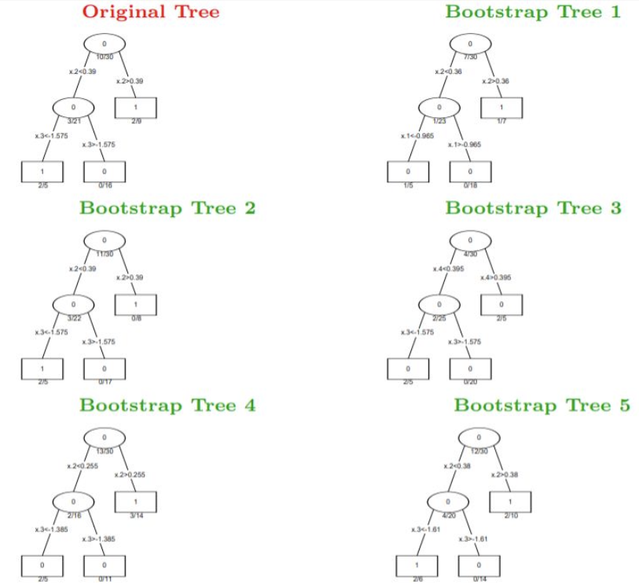
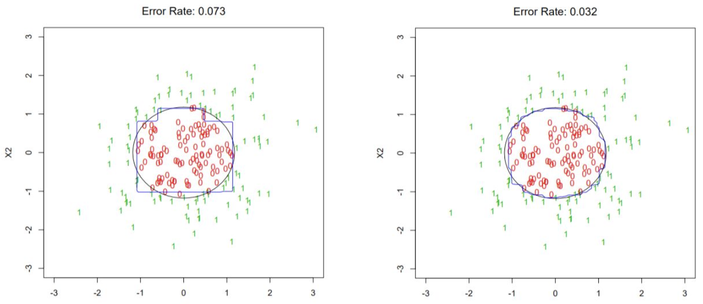

# Ensemble Methods

## Outline

This section covers the following topics in ensemble methods:
- **Decision Trees Recap** (current focus)
- Ensemble Methods: Intro
- Model Averaging
- Bagging
- Random Forests
- Boosting
- Gradient Boosting

## Decision Trees Recap

Before diving into ensemble methods, let's review the key characteristics of decision trees.

### Pros of Decision Trees

Decision trees offer several advantages that make them valuable building blocks for ensemble methods:

- **Can handle large datasets:** Efficiently process datasets with many observations
- **Can handle mixed predictors:** Work with continuous, discrete, and qualitative variables
- **Can ignore redundant variables:** Automatically select relevant features during training
- **Can easily handle missing data:** Robust to missing values in the dataset
- **Easy to interpret if small:** Simple trees provide clear, understandable decision rules

### Cons of Decision Trees

However, single decision trees have significant limitations:

- **Prediction performance is poor:** Often achieve only moderate accuracy
- **Does not generalize well:** Prone to overfitting on training data
- **Large trees are hard to interpret:** Complex trees become difficult to understand

## Ensemble Methods: Introduction

### What are Ensemble Methods?

Ensemble methods are techniques designed to improve the performance of weak learners by combining multiple models.

**Key Concepts:**
- **Methods to improve the performance of weak learners**
- **Weak learners (e.g., classification trees) don't perform that well** individually
- **What do we do??** We leverage the "Wisdom of the crowds!"

### The "Wisdom of the Crowds" Principle

The core idea behind ensemble methods is to shift responsibility from a single weak learner to an ensemble of such weak learners.

**Core Approach:**
- **Shift responsibility:** From 1 weak learner to an 'ensemble' of such weak learners
- **Combine weak learners:** A set of weak learners are combined to form a strong learner with better performance than any of them individually

### Why Ensemble Methods for Decision Trees?

Single decision trees have specific characteristics that make them ideal candidates for ensemble methods:

**Limitations of Single Decision Trees:**
- **A single decision tree often produces noisy / weak classifiers**
- **They DON'T generalize well** to unseen data

**Advantages of Single Decision Trees:**
- **But they are super fast, adaptive and robust!** These qualities make them excellent base learners

**Solution:** Let's learn multiple trees!

**Challenge:** How to ensure they don't all just learn the same thing??

**Hint:** (TRIVIAL Solution) - though it's not as trivial as it sounds!

## Bagging (Bootstrap Aggregating)

### Introduction to Bagging

Bagging, short for **Bootstrap Aggregating**, is an ensemble method introduced by Breiman in 1996. Its primary goal is to reduce the variance of a prediction model, leading to more stable and reliable predictions.

### Key Steps of Bagging

The process of Bagging involves several key steps:

- **Bootstrap sampling:** This is the foundational step where multiple subsets of the training data are created
- **Collect B (≈ 100) subsets by sampling with replacement from training data:** From the original training dataset, B new datasets are generated by randomly sampling data points with replacement
- **Construct B trees (one classifier for one subset):** For each of the B bootstrap subsets, an independent base classifier (often a decision tree) is trained
- **Aggregate them using aggregator of your choice:** Once all B classifiers are trained, their predictions are combined through voting (classification) or averaging (regression)
- **Parallelizable:** A significant advantage of Bagging is that the training of each individual classifier can be done independently and in parallel

### Visualizing Bootstrap Trees

The core idea of Bagging is to train multiple diverse models. Below, we illustrate an "Original Tree" trained on the full dataset and several "Bootstrap Trees" trained on different bootstrap samples.

**Original Tree:**
A decision tree trained on the original dataset with specific splits and leaf node predictions.

**Bootstrap Trees:**
When we apply bootstrap sampling, we create multiple variations of the training data. Each of these variations is then used to train a new decision tree. These "Bootstrap Trees" will naturally differ from the original tree and from each other due to the randomness in the sampling process.

Notice how the split points and the class distributions in the leaf nodes vary across these trees. This diversity is crucial for Bagging's effectiveness.

### Improved Performance with Bagging

One of the primary benefits of Bagging is its ability to reduce the variance of a model, leading to improved generalization and lower error rates on unseen data.

**Single Classifier Performance:**
- **Error Rate: 0.073**
- **Visualization:** A 2D scatter plot shows data points belonging to two classes with a blue rectangular decision boundary
- **Characteristics:** The boundary is sharp and axis-aligned, typical of a single decision tree, with noticeable misclassifications

**Bagging Ensemble Performance:**
- **Error Rate: 0.032**
- **Visualization:** The same 2D scatter plot but with a smooth, blue elliptical decision boundary
- **Characteristics:** This smoother boundary more effectively separates the classes, with significantly fewer misclassified points

The significantly lower error rate (0.032 compared to 0.073) demonstrates the power of Bagging in improving model accuracy and generalization by reducing variance.

### Cross-Validation and Out-of-Bag Samples

**What about cross-validation?**

Each bootstrap sample set uses only a subset of the data, leaving some samples unused.

**Unused samples: out-of-bag samples (OOB)**

One can calculate the overall error rate on out-of-bag samples for all bootstraps. This provides an internal validation set, often eliminating the need for separate cross-validation.

### Advantages and Disadvantages of Bagging

**Advantages:**
- **Reduces overfitting (i.e., variance):** Improves model generalization
- **Can work with any type of classifier:** Versatile beyond just decision trees
- **Easy to parallelize:** Individual models can be trained independently

**Disadvantage:**
- **But loses on interpretability to single decision tree:** While ensemble methods improve performance, they often come at the cost of reduced model transparency compared to a single, simpler model

This comprehensive introduction to ensemble methods provides the foundation for understanding more advanced techniques like Random Forests and Boosting.

## Random Forests

### Issues with Bagging

While Bagging is an effective ensemble method, it has some theoretical limitations that Random Forests aim to address.

#### Theoretical Properties of Bagging

**Expectation and Bias:**
- The expectation (average prediction) of bagged trees is equal to the expectation of individual trees:
  $$E[f_{agg}(x)] = E[f_b(x)]$$
  where $f_{agg}(x)$ represents the aggregated prediction and $f_b(x)$ represents the prediction of an individual tree.
- The bias of bagged trees is the same as that of individual trees.

**Critical Limitation - Correlation:**
- **Each tree is identically distributed (i.d. not i.i.d). Bagged trees are correlated!**
- This correlation significantly impacts the variance reduction potential of Bagging.

#### Impact of Correlation on Variance Reduction

**Independent and Identically Distributed (i.i.d.) Variables:**
- Averaging $B$ independent and identically distributed (i.i.d.) variables scales their variance $\sigma^2$ down to $\sigma^2/B$.

**Correlated Variables:**
- Averaging $B$ identically distributed (i.d.) variables with pairwise correlations $\rho$ and variance $\sigma^2$ results in:
  $$\rho\sigma^2 + (1 - \rho)\sigma^2/B$$

**Key Insight:**
- Only the second term $(1 - \rho)\sigma^2/B$ reduces with bagging
- The first term $\rho\sigma^2$ remains constant
- This means correlation prevents full variance reduction

### How Random Forests Address the Issues

#### Core Question and Goal

**Main Question:** "How to decorrelate the trees generated for bagging?"

**Goal:** We want to generate $B$ i.i.d. trees such that their bias is the same, but variance reduces.

#### Ideas for Decorrelation

Several strategies can be employed to reduce correlation between trees:

- **Restrict feature usage:** Limit how many times a feature can be used
- **Feature subset selection:** Only allow a certain number of features to be considered at each split
- **Random feature selection:** Choose only a subset of features for each "bag" (bootstrapped sample)

#### The Random Forest Approach

**Key Insight:** Choose only a subset of features for each bootstrapped sample.

**Result:** Decorrelated trees when you randomly select the subset.

### Random Forests: Definition and Implementation

#### Formal Definition

Similar to bagging, Random Forests follow these steps:

1. **Choose $B$ bootstrapped splits (or bags)**
2. **For each split in the $B$ trees, only consider $k$ features from the full feature set $m$**

#### Parameter Comparison

- **If $k = m$:** Same as Bagging
- **If $k < m$:** Random Forests

#### Out-of-Bag (OOB) Error Rate

The OOB error rate can be used to fit Random Forests in one sequence with cross-validation done along the way, providing an efficient internal validation mechanism.

### Practical Considerations

#### Performance and Hyperparameters

**Performance:** Random Forests work great in practice.

**Hyperparameter:** $k$ (the number of features considered at each split) is to be treated as a hyperparameter that needs tuning.

#### Potential Issues

**Challenge with High-Dimensional Data:**
- **Issue:** When you have a large number of features, yet very small number of relevant features
- **Problem:** The probability of selecting the relevant feature in $k$ is very small
- **Impact:** This can make it difficult to identify and utilize the most important features when $k$ is small relative to the total number of features

### Summary of Random Forests

Random Forests address the correlation problem in Bagging by introducing randomness in feature selection at each split. This decorrelation strategy allows for better variance reduction while maintaining the same bias as individual trees. The method is highly practical and provides built-in cross-validation through OOB error estimation, making it a powerful and efficient ensemble technique.

## Boosting

Boosting is another powerful ensemble method that differs significantly from Bagging and Random Forests in its approach to combining weak learners. Instead of parallel training, boosting trains models sequentially, with each new model focusing on the errors of the previous ones.

### Core Principles of Boosting

**Key Characteristics:**
- **No Bootstrap Sampling:** Unlike Bagging, Boosting does not involve bootstrap sampling. Instead, it typically uses the original dataset, but with adjusted weights for observations.
- **Sequential Tree Growth:** Trees (or weak learners) are grown sequentially. Each new tree is built using information derived from the performance of previously grown trees, specifically focusing on instances that were misclassified or had high error.
- **Combining Many Decision Trees:** Similar to Bagging, Boosting involves combining predictions from many decision trees, often referred to as weak learners or base learners, denoted as $f_1, \dots, f_B$. The final prediction is a weighted sum of these individual predictions.

### AdaBoost (Adaptive Boosting)

AdaBoost is one of the earliest and most influential boosting algorithms, demonstrating the core concepts of sequential learning and adaptive weighting.

**Key Features:**
- **Weighted Observations:** AdaBoost operates on weighted observations. Initially, all observations might have equal weights, but these weights are adjusted in subsequent iterations.
- **Focus on Difficult Instances:** The algorithm adaptively puts more weight on instances that are difficult to classify (i.e., those that were misclassified by previous learners) and less weight on those that have already been handled well. This forces subsequent weak learners to concentrate on the challenging patterns.
- **Sequential Addition of Weak Learners:** New weak learners are added sequentially. Each new learner is trained specifically to focus its efforts on the more difficult patterns, as identified by the updated observation weights. This iterative process gradually improves the overall model's performance by correcting the mistakes of its predecessors.

### Mathematical Formulation

The final prediction in AdaBoost is a weighted combination of the weak learners:

$$F(x) = \sum_{b=1}^{B} \alpha_b f_b(x)$$

where:
- $f_b(x)$ is the prediction of the $b$-th weak learner
- $\alpha_b$ is the weight assigned to the $b$-th learner
- $B$ is the total number of weak learners

### Weight Update Mechanism

The key innovation of AdaBoost lies in its weight update mechanism:

1. **Initialization:** All observations start with equal weights
2. **Training:** Train a weak learner on the weighted data
3. **Error Calculation:** Compute the weighted error rate
4. **Weight Update:** Increase weights for misclassified instances, decrease weights for correctly classified instances
5. **Normalization:** Normalize weights to sum to 1
6. **Iteration:** Repeat until desired number of learners is reached

### Advantages of Boosting

**Performance Benefits:**
- **Strong Performance:** Often achieves better accuracy than individual weak learners
- **Adaptive Learning:** Automatically focuses on difficult cases
- **Theoretical Guarantees:** Provides convergence guarantees under certain conditions

**Practical Advantages:**
- **No Overfitting for a While:** Resistant to overfitting in early iterations
- **Feature Selection:** Can work well even with simple base learners
- **Interpretability:** Can provide insights into which instances are most difficult

### Comparison with Other Ensemble Methods

**vs. Bagging:**
- **Sequential vs. Parallel:** Boosting trains sequentially, Bagging trains in parallel
- **Weighting:** Boosting uses adaptive weights, Bagging uses equal weights
- **Focus:** Boosting focuses on difficult cases, Bagging reduces variance through averaging

**vs. Random Forests:**
- **Diversity:** Random Forests create diversity through feature randomization, Boosting creates diversity through sequential error correction
- **Bias vs. Variance:** Random Forests primarily reduce variance, Boosting can reduce both bias and variance

### Summary of Boosting

Boosting represents a fundamentally different approach to ensemble learning compared to Bagging and Random Forests. By training weak learners sequentially and focusing on difficult instances, boosting can achieve remarkable performance improvements. The adaptive nature of the algorithm, particularly in AdaBoost, makes it particularly effective for classification problems where certain instances are inherently more challenging to classify correctly.

## Gradient Boosting

Gradient Boosting is a powerful and widely used ensemble technique that builds upon the principles of boosting by framing the problem as optimizing an arbitrary differentiable loss function.

### Generalization and Three Elements

Gradient Boosting can be seen as a generalization of earlier boosting algorithms like AdaBoost, incorporating concepts of adaptive reweighting and combining. It is characterized by three core elements:

- **A loss function to be optimized:** Unlike AdaBoost which implicitly optimizes an exponential loss, Gradient Boosting allows for the optimization of any differentiable loss function.
- **A weak learner to make predictions:** Typically, decision trees (specifically regression trees) are used as weak learners.
- **An additive model to add weak learners:** Weak learners are added sequentially to the model to minimize the chosen loss function.

### Loss Function

A key feature of Gradient Boosting is its flexibility in choosing a loss function.

- **Any differentiable function:** The algorithm can work with any loss function that is differentiable.
- **Most standard loss functions:** Common choices include:
  - **L2 loss for regression:** Also known as Mean Squared Error (MSE), it measures the average of the squares of the errors.
  - **Log loss for classification:** Also known as cross-entropy loss, it is commonly used for binary and multi-class classification problems.

### Weak Learners

The weak learners in Gradient Boosting are typically decision trees, specifically regression trees, which are learned greedily.

- **Decision trees (regression trees) learnt greedily:** Each tree is built to predict the negative gradient of the loss function with respect to the current model's predictions.
- **Constrain the trees to ensure they remain weak:** To prevent overfitting and ensure that each tree contributes incrementally, the individual trees are typically constrained. These constraints can include:
  - **Number of layers (depth):** Limiting the maximum depth of the tree.
  - **Number of leaves:** Limiting the maximum number of terminal nodes.
  - **Number of nodes:** Limiting the total number of nodes.
  - **Number of splits:** Limiting the number of times a node can be split.

### Additive Model

The core idea behind Gradient Boosting is to build the model in a stage-wise fashion, adding new trees one at a time.

- **Add trees one at a time:** Existing trees are not changed once they are added to the ensemble.
- **Functional gradient descent:** It employs functional gradient descent to minimize the loss function when adding new trees. This process involves:
  - Calculating the loss.
  - Adding a tree to the model that reduces the loss (i.e., following the gradient).
  - Parameterizing the tree, then modifying the parameters of the tree and moving in the right direction by reducing the residual loss.

### Iterative Process

Given the current model, Gradient Boosting proceeds as follows:

- **Fit a decision tree to the residuals:** We fit a decision tree to the **residuals** from the current model.
- **Response variable becomes residuals:** The response variable for this new tree is now the residuals.
- **Add tree to update residuals:** We then add this new decision tree into the fitted function in order to update the residuals.
- **Control learning rate:** The learning rate must be controlled to prevent overfitting and ensure stable convergence.

### Tunable Parameters

Several parameters can be tuned to optimize the performance and prevent overfitting in Gradient Boosting:

- **Number of trees ($B$):** Boosting can overfit, unlike Bagging or Random Forests. It is crucial to use cross-validation to determine the optimal number of trees.
- **Shrinkage parameter ($\lambda$):** This is a small positive number that acts as a learning rate, scaling the contribution of each new tree. A smaller $\lambda$ requires more trees but can lead to better generalization.
- **Number of splits in each tree ($d$):** This parameter controls the complexity of individual weak learners. Usually, just choose $d = 1$, meaning tree stumps (decision trees with a single split) work well as weak learners.

### Variants of Gradient Boosting

Gradient Boosting offers several variants and enhancements that improve its performance, robustness, and flexibility:

- **Varying the tree constraints:** This involves adjusting parameters like maximum depth, minimum samples per leaf, or minimum impurity decrease to control the complexity of individual trees (weak learners).
- **Weighting each tree to the additive sum using a learning rate (shrinkage):** A learning rate (often denoted as $\eta$ or $\nu$) is applied to the contribution of each new tree to the ensemble's final prediction. This "shrinkage" helps prevent overfitting and improves generalization by making the learning process more gradual.
- **Sampling strategies: stochastic gradient boosting:** Instead of using the entire dataset to train each new tree, stochastic gradient boosting uses a random subsample of the training data. This introduces further randomness, which can reduce variance and speed up computation.
- **Regularization: L1 / L2:** Regularization techniques, such as L1 (Lasso) and L2 (Ridge) regularization, can be applied to the tree's leaf weights to prevent overfitting. L1 regularization encourages sparsity (some weights become zero), while L2 regularization penalizes large weights.
- **Successful: XGBoost:** Extreme Gradient Boosting (XGBoost) is a highly optimized and popular implementation of gradient boosting that incorporates many of these variants and additional features for performance and accuracy, making it a state-of-the-art algorithm in many machine learning competitions and applications.

### Summary of Gradient Boosting

Gradient Boosting represents a sophisticated evolution of boosting algorithms that offers greater flexibility through customizable loss functions and more sophisticated optimization techniques. Its ability to handle various types of problems (regression and classification) with different loss functions, combined with its strong empirical performance, has made it one of the most popular and effective ensemble methods in modern machine learning.

