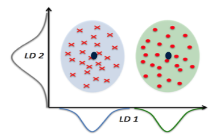
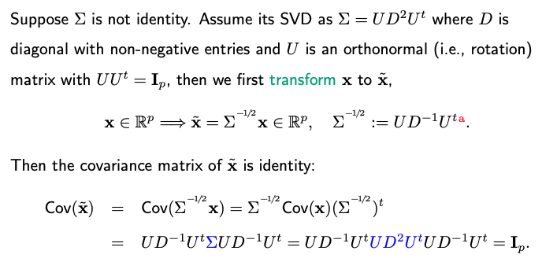
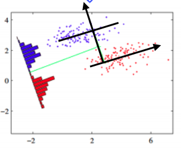

# 9.4. Linear Discriminant Analysis

In our previous discussion on Quadratic Discriminant Analysis (QDA), the discriminant function plays a pivotal role in making classification decisions. If we make the assumption that all groups share the same covariance matrix ($\Sigma_k = \Sigma$), the discriminant function can be expressed as follows:

$$d_k (x) =  (x-\mu_k)^t \Sigma^{-1} (x-\mu_k)  + \textcolor{gray}{\log |\Sigma|} -2  \log \pi_k$$

The first term remains a quadratic function, measuring the Mahalanobis distance between the data point $x$ and the class center $\mu_k$, followed by the determinant of $\Sigma$ and minus two times the logarithm of $\pi_k$. Note that the logarithm of $\Sigma$ is grayed out because it is a common term for all classes and doesn't affect the final decision.

Further simplification reveals that the first term, discounting the gray component, is linear in $x$.

$$\begin{split}
& (x-\mu_k)^t \Sigma^{-1} (x-\mu_k) \\
=&  \textcolor{gray}{x^t \Sigma^{-1} x} - 2 x^t \Sigma^{-1} \mu_k +  \mu_k^T \Sigma^{-1} \mu_k
\end{split}$$

When we assume that all covariance matrices are the same for all classes, we essentially revert to Linear Discriminant Analysis (LDA) since the discriminant function becomes linear. Consequently, the decision boundary for binary classification is determined by a linear function of $x$, leading to the name LDA.

In practice, the estimation of $(\pi_k, \mu_k)$ can be carried out similarly to how it's done in QDA. As for estimating the shared covariance matrix $\Sigma$, a common approach involves pooled sample covariance estimation. Here, 'pooled' refers to the fact that information about covariance is gathered from various classes.

$$\hat{\Sigma}= \frac{1}{n-K} \sum_{k=1}^K \sum_{i: y_i=k} (x_i -  \hat{\mu}_k) (x_i - \hat{\mu}_k)^t$$

In the discriminant function, what matters is $\hat{\Sigma}^{-1}$. A concern arises if $\hat{\Sigma}$ is not invertible. The rank of $\hat{\Sigma}$ is at most n-K. Thus, this situation can arise when the dimensionality 'p' is substantial.

To address non-invertibility, we can employ the same trick used in QDA. By adding a small constant $\epsilon$ times the identity matrix to $\hat{\Sigma}$, we ensure its invertibility.

Alternatively, one can compute the generalized inverse of the matrix. The generalized inverse essentially ignores dimensions where the matrix is singular, allowing us to calculate the inverse only for the dimensions where it is possible.

$$\begin{split}
\hat{\Sigma} = U_{p \times 3} \left ( \begin{array}{ccc} d_1 & 0 & 0 \\ 0 & d_2 & 0 \\ 0 & 0 & 0 \end{array} \right ) U^t, \quad \hat{\Sigma}^{-1} = U  \left ( \begin{array}{ccc} 1/d_1 & 0 & 0 \\ 0 & 1/d_2 & 0 \\ 0 & 0 & 0 \end{array}  \right ) U^t
\end{split}$$

This approach works well for LDA because it involves a shared covariance matrix across all classes. However, it may not apply to QDA, where different covariance matrices might have different null spaces.

## 9.4.1. Reduced Rank LDA

Linear Discriminant Analysis (LDA) offers a way to naturally reduce the dimensionality of a classification problem.

Let's start by assuming that $\Sigma$ is an identity matrix, which simplifies the LDA discriminant function. In this simplified form, the first term in the discriminant function is the Euclidean distance from the point $x$ to the class center, $\mu_k$, due to the identity covariance matrix.

$$d_k (x) =  \| x-\mu_k \|^2  -2  \log \pi_k.$$

Without loss of generality, let's assume the average of the K centers is the origin. This choice stems from the fact that what truly matters is the relative distances between data points, and we have the flexibility to designate the origin's location arbitrarily.

Consequently, the K class centers, $(\mu_1, \dots, \mu_K)$, form a (K-1)-dimensional subspace. This leads us to substitute the first term, $\| x-\mu_k \|^2$, in the original p-dimensional space, with a squared distance calculated within the lower-dimensional (K-1)-dimensional subspace. This transformation naturally induces dimension reduction, effectively reducing the initial dimensionality denoted as p to (K-1).

But why is this feasible? We can denote the subspace defined by the K centers as $\mathcal{A}$. For any p-dimensional vector $x$, we can decompose it as a sum of two orthogonal vectors:

$$x = x_1 + x_2.$$

Here, $x_1$ belongs to the (K-1)-dimensional subspace, $\mathcal{A}$, while $x_2$ resides in the orthogonal complement, which has a dimension of (p-K+1). Consequently, the first term in $d_k(x)$ can be expressed as:

$$\| x-\mu_k \|^2 = \| x_1 + x_2 - \mu_k\|^2 = \| x_1  - \mu_k\|^2 + \|x_2\|^2.$$

Notably, for any $x$, the term $\|x_2\|^2$ remains constant. Given that our primary concern is determining which 'k' yields the largest $d_k$ for any $x$, we can safely disregard $\|x_2\|^2$. As a result, we can perform LDA exclusively within this reduced (K-1)-dimensional space.

For instance, consider a special case where K equals two, representing a binary classification problem with an original dimensionality p of two. Even though the data exists in a two-dimensional space, we can perform classification by projecting all data points onto the x-coordinate and determining their proximity to the respective centers to make decisions. This example illustrates how LDA naturally reduces the dimensionality from the original 'p' to (K-1), which, in the case of binary classification, results in just one dimension.

It's important to note that our derivations thus far assume an identity covariance matrix. However, the conclusions remain consistent even when the covariance matrix deviates from identity. A normalization step is needed to transform the data from the ellipsoid shape to a spherical shape. This transformation involves scaling by the square root of the covariance matrix.

Consider a scenario with a tilted, ellipsoid-shaped contour plot of data clouds. In this case, LDA still leads to the same outcome. Whether in the original two-dimensional space or projected onto a one-dimensional black line, the results will be consistent.

## 9.4.2. Risk of Overfitting

However, it's essential to recognize that each of the (K-1) dimensions learned from LDA is, in fact, a linear combination of all the original p dimensions. This implies that overfitting can occur when p is significantly larger than K. In such cases, while the LDA projection may seem to provide excellent separation in the low-dimensional space during training, it may not generalize well to test data; see our code page.
