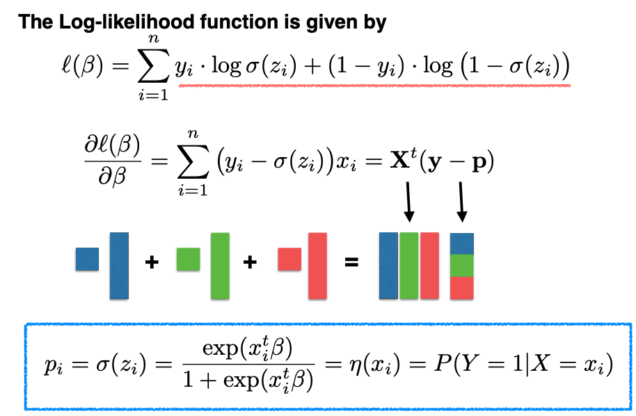
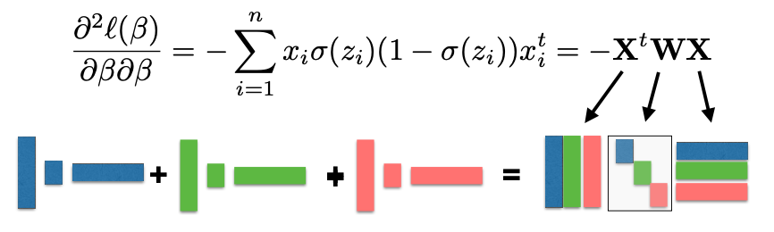
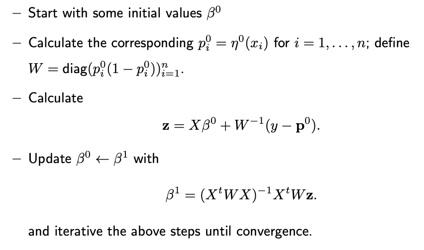

# 10.2. MLE

Let's start with the Logit of $\eta$:

$$\log \frac{\eta(x)}{1-\eta(x)} = x^t \beta$$

Then express $\eta$ and $1 - \eta$ in terms of $\beta$:

$$\begin{split}
P(Y=1|X = x) &= \eta(x) = \frac{\exp(x^t \beta)}{1+\exp(x^t \beta)} \\
P(Y=0 | X=x) &= 1 - \eta(x)  = \frac{1}{1+\exp(x^t \beta)}
\end{split}$$

We unify the expressions above for both Y=1 and Y=0 into a single form, using the sigmoid function, denoted as $\sigma(z) = e^z / (1 + e^z),$ where $z$ is shorthand for $x^t \beta$.

$$\begin{split}
P(Y = y | X = x) &=  \sigma(z)^y (1 - \sigma(z))^{1-y} \\
                \sigma(z) &= \frac{e^z}{1 + e^z}, \quad z = x^t \beta.
\end{split}$$

Next, we need to find the maximum likelihood estimate (MLE) for $\beta.$ We follow the standard approach of setting the gradient of the log-likelihood with respect to $\beta$ to zero and solving for $\beta.$

However, this solution is not in closed form, so we use an iterative algorithm, known as the Newton-Raphson algorithm, to find the root of the derivative.

During this iterative process, we also need to calculate the second derivative of the log-likelihood, which forms a matrix known as the Hessian matrix. The Hessian matrix is negative semi-definite, indicating that the log-likelihood function is concave. This property simplifies optimization, as any local maximum is also the global maximum.

The MLE can be obtained by the following **Reweighted LS Algorithm**:

