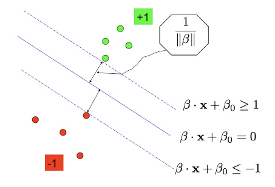
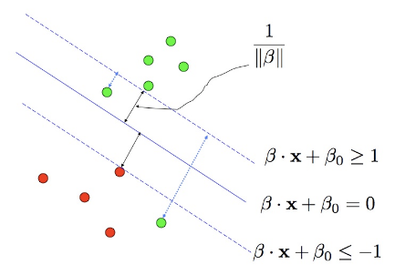
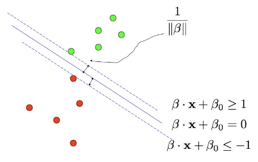
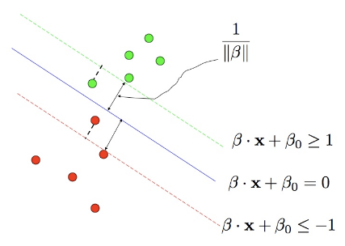
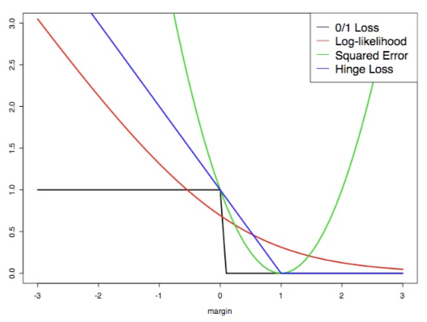

# Linear SVM (separable case)

First consider the scenario where the two classes of points are separable.



In this case, we aim to maximize the width, known as the margin, between the two dashed lines, making the buffer zone between the two classes as large as possible. We can formulate this max-margin problem as follows:

```math
\begin{align*}
&\min_{\boldsymbol{\beta}, \beta_0} \quad \frac{1}{2} \|\boldsymbol{\beta}\|^2 \\
&\text{subject to} \quad y_i (\boldsymbol{\beta} \cdot \mathbf{x}_i + \beta_0) - 1 \geq 0,
\end{align*}
```

where $`\boldsymbol{\beta} \cdot \mathbf{x}_i = \boldsymbol{\beta}^T \mathbf{x}_i`$ represents the Euclidean inner product between two vectors. The constraints ensure that the points are on the correct side of the dashed lines, i.e.,

```math
\begin{align*}
\boldsymbol{\beta} \cdot \mathbf{x}_i + \beta_0 &\geq +1 \quad \text{for } y_i = +1, \\
\boldsymbol{\beta} \cdot \mathbf{x}_i + \beta_0 &\leq -1 \quad \text{for } y_i = -1.
\end{align*}
```

If $`\mathbf{x}_i`$ is on one of the dashed lines, i.e., $`y_i(\boldsymbol{\beta} \cdot \mathbf{x}_i + \beta_0) - 1 = 0`$, we consider the $`i`$-th constraint (or $`i`$-th point) as **active**. If $`y_i(\boldsymbol{\beta} \cdot \mathbf{x}_i + \beta_0) - 1 > 0`$, it is **inactive**. Importantly, there should be at least two points, one from each class, that are active; otherwise, we can improve the margin.

This type of constrained optimization, known as the **convex programming problem**, has been well-studied in the literature. We can solve it efficiently.

## Dual Problem and Support Vectors

The dual problem is formulated as:

```math
\begin{align*}
&\max_{\lambda_1, \ldots, \lambda_n} \quad \sum_i \lambda_i - \frac{1}{2} \sum_{i,j} \lambda_i \lambda_j y_i y_j (\mathbf{x}_i \cdot \mathbf{x}_j) \\
&\text{subject to} \quad \sum_i \lambda_i y_i = 0, \quad \lambda_i \geq 0,
\end{align*}
```

where the variables are $`\lambda_1, \ldots, \lambda_n`$ and $`\lambda_i`$ is associated with the $`i`$th observation.

Here are the connections between these two optimization problems, where $`(\hat{\beta}_0, \hat{\boldsymbol{\beta}})`$ denote the solution for the **primal problem** (1), and $`(\lambda_1, \ldots, \lambda_n)`$ the solution for the **dual problem** (2):

- **Complementarity condition:**

  ```math
  \lambda_i \left\{ y_i (\mathbf{x}_i \cdot \hat{\boldsymbol{\beta}} + \hat{\beta}_0) - 1 \right\} = 0.
  ```

  If a point is inactive (i.e., not on the dashed line), the corresponding $`\lambda_i`$ must equal 0. Points for which $`\lambda_i > 0`$ are called **support vectors**.

- We can estimate the slope $`\hat{\boldsymbol{\beta}}`$ after solving the dual problem based on the following equality:

  ```math
  \hat{\boldsymbol{\beta}} = \sum_{i \in N_s} \lambda_i y_i \mathbf{x}_i,
  ```

  where $`N_s`$ represents the set of support vectors.

- Pick any support vector; due to the complementarity condition, it must satisfy the equality $`y_i (\mathbf{x}_i \cdot \hat{\boldsymbol{\beta}} + \hat{\beta}_0) - 1 = 0`$, so we can solve for $`\hat{\beta}_0`$. It is numerically safer to obtain an estimate of $`\beta_0`$ from each support vector, and then take the mean of all such values.

- For any new observation $`\mathbf{x}_*`$, the prediction is:

  ```math
  \text{sign}\left( \sum_{i \in N_s} \lambda_i y_i (\mathbf{x}_i \cdot \mathbf{x}_*) + \hat{\beta}_0 \right).
  ```

Note that the classifier depends only on the value, $`(y_i, \mathbf{x}_i)`$, of the support vectors, making it a **sparse** solution. Moreover, the classifier is **robust** because if we move an inactive point within the correct region (i.e., without crossing the dashed line), the estimated classifier remains the same since the inactive point has $`\lambda_i = 0`$, and does not affect the classifier.

# Linear SVM (non-separable case)

What if the two classes of points are not separable?



In such cases, we introduce a slack variable $`\xi_i`$ for each sample and formulate the max-margin problem as follows:

```math
\min_{\boldsymbol{\beta}, \beta_0, \xi_{1:n}} \quad \frac{1}{2} \|\boldsymbol{\beta}\|^2 + \gamma \sum_i \xi_i
```
subject to
```math
y_i(\mathbf{x}_i \cdot \boldsymbol{\beta} + \beta_0) - 1 + \xi_i \geq 0,
```
```math
\xi_i \geq 0.
```

It’s important to note that $`\xi_i > 0`$ only for samples that fall on the wrong side of the dashed line, and the optimization automatically sets $`\xi_i`$ to be 0 for samples that lie on the correct side of the dashed line.

The optimization (3) reflects the trade-off between the margin $`2/\|\boldsymbol{\beta}\|^2`$ (your gain) and the sum of the positive slack variables (the cost you need to pay). The parameter $`\gamma`$ is a tuning parameter, often determined through cross-validation in practice.

Similarly to the separable case, we solve the dual problem:

```math
\max_{\lambda_1, \ldots, \lambda_n} \quad \sum_i \lambda_i - \frac{1}{2} \sum_{i,j} \lambda_i \lambda_j y_i y_j (\mathbf{x}_i \cdot \mathbf{x}_j)
```
subject to
```math
\sum_i \lambda_i y_i = 0, \quad 0 \leq \lambda_i \leq \gamma.
```

The connections between the primal and the dual problems remain similar to those in the separable case. In particular, inactive points (i.e., those for which $`\lambda_i = 0`$) do not affect the classifier.

The correct side of the dashed line have their $`\lambda_i = 0`$. Thus, after solving for $`\lambda_i`$ values (where only a handful of them will be non-zero), we can obtain a sparse classifier that depends only on a subset of the data points, referred to as the support vectors.

It’s worth noting that this new optimization (3) is proposed for non-separable cases, but it can also be applied to separable cases depending on the magnitude of $`\gamma`$. In some situations, we might be willing to allow some points to cross the dashed line if it leads to a significant increase in the margin, and the parameter $`\gamma`$ controls this trade-off.



```math
\beta \cdot \mathbf{x} + \beta_0 \geq 1
```
```math
\beta \cdot \mathbf{x} + \beta_0 = 0
```
```math
\beta \cdot \mathbf{x} + \beta_0 \leq -1
```



```math
\beta \cdot \mathbf{x} + \beta_0 \geq 1
```
```math
\beta \cdot \mathbf{x} + \beta_0 = 0
```
```math
\beta \cdot \mathbf{x} + \beta_0 \leq -1
```

# Non-linear SVM

In linear SVMs, the decision boundaries are linear, represented as hyperplanes in the original input space. To create more flexible classifiers with nonlinear decision boundaries, we can follow this approach: first, embed data points into a higher-dimensional feature space,
```math
\Phi : \mathcal{X} \to \mathcal{F}, \quad \Phi(\mathbf{x}) = (\phi_1(\mathbf{x}), \phi_2(\mathbf{x}), \ldots ),
```
and then apply the linear SVM in this feature space $`\mathcal{F}`$. Since a linear function of $`\Phi(\mathbf{x})`$ in $`\mathcal{F}`$ may result in a nonlinear function of the original input $`\mathbf{x}`$, we can achieve nonlinear classifiers.

When using the linear SVM in the feature space, the only quantity we need to compute is the inner product:
```math
K_\Phi(\mathbf{x}_i, \mathbf{x}) = \langle \Phi(\mathbf{x}), \Phi(\mathbf{x}_i) \rangle.
```
Note that I haven’t written the inner product as $`\Phi(\mathbf{x})^t\Phi(\mathbf{x}_i)`$ since the feature space $`\mathcal{F}`$ might be infinite dimensional, not a finite dimensional Euclidean space. For instance, the mapped feature $`\Phi(\mathbf{x})`$ could be a function, and then $`\langle \Phi(\mathbf{x}), \Phi(\mathbf{x}_i) \rangle`$ represents the inner product between two functions from the feature space $`\mathcal{F}`$. (Apparently, we have made an assumption that $`\mathcal{F}`$ is a Hilbert space.)

This approach is often referred to as the **kernel trick**. It allows us to compute the inner product as a function in the original input space $`X`$ without explicitly calculating the mapping $`\Phi(\mathbf{x})`$ into the higher-dimensional feature space.

- Recall the linear SVM solves
  ```math
  \max_{\lambda_i} \sum_i \lambda_i - \frac{1}{2} \sum_{i,j} \lambda_i \lambda_j y_i y_j (\mathbf{x}_i \cdot \mathbf{x}_j)
  ```
  subject to
  ```math
  \sum_i \lambda_i y_i = 0, \quad 0 \leq \lambda_i \leq \gamma.
  ```
  for $`\lambda_1, \ldots, \lambda_n`$, and then the prediction at a new point $`\mathbf{x}^*`$ is given by
  ```math
  \text{sign}(f(\mathbf{x}^*)) \\
  = \text{sign}\left( \sum_{i \in N_s} \lambda_i y_i K_\Phi(\mathbf{x}_i, \mathbf{x}^*) + \hat{\beta}_0 \right)
  ```

- Now the non-linear SVM solves
  ```math
  \max_{\lambda_i} \sum_i \lambda_i - \frac{1}{2} \sum_{i,j} \lambda_i \lambda_j y_i y_j K(\mathbf{x}_i, \mathbf{x}_j)
  ```
  subject to
  ```math
  \sum_i \lambda_i y_i = 0, \quad 0 \leq \lambda_i \leq \gamma.
  ```
  for $`\lambda_1, \ldots, \lambda_n`$, and then the prediction at a new point $`\mathbf{x}^*`$ is given by
  ```math
  \text{sign}(f(\mathbf{x}^*)) \\
  = \text{sign}\left( \sum_{i \in N_s} \lambda_i y_i K(\mathbf{x}_i, \mathbf{x}^*) + \hat{\beta}_0 \right)
  ```

The bivariate function $`K`$ in (5) is often referred to as the **reproducing kernel** (r.k.) function or simply the **kernel function**. It is worth noting that a kernel function $`K(\mathbf{x}, \mathbf{z})`$ must be symmetric and semi-positive definite. We can think of $`K(\mathbf{x}, \mathbf{z})`$ as a similarity measure between $`\mathbf{x}`$ and $`\mathbf{z}`$, extending the concept beyond the ordinary Euclidean inner product between $`\mathbf{x}`$ and $`\mathbf{z}`$. Popular kernels (see p434 of textbook) include

- $`d`$th degree polynomial
  ```math
  K(\mathbf{x}, \mathbf{z}) = (1 + \mathbf{x} \cdot \mathbf{z})^d,
  ```
- Radial basis (the feature space is of infinite-dimension)
  ```math
  K(\mathbf{x}, \mathbf{z}) = \exp(-\|\mathbf{x} - \mathbf{z}\|^2 / c).
  ```

# SVM as a penalization method

Consider a linear SVM (3) with $`f(x) = \mathbf{x} \cdot \boldsymbol{\beta} + \beta_0`$ and $`y_i \in \{-1, 1\}`$. It can be shown that this linear SVM has the same solution as the following optimization problem:
```math
\min_{\boldsymbol{\beta}, \beta_0} \sum_{i=1}^n [1 - y_i f(\mathbf{x}_i)]_+ + \nu \|\boldsymbol{\beta}\|^2,
```
when the tuning parameter $`\nu`$ is properly chosen (which depends on $`\gamma`$ in (3)). Therefore SVM is a special case of the following **Loss + Penalty** framework:
```math
\min_{\boldsymbol{\beta}, \beta_0} \sum_{i=1}^n L(y_i, f(\mathbf{x}_i)) + \nu \|\boldsymbol{\beta}\|^2.
```

The loss used in SVM is called the **hinge loss**,
```math
L(y, f(\mathbf{x})) = [1 - y f(\mathbf{x})]_+.
```

Other popular loss functions for classification problems are:

- (Negative) Log-likelihood loss,
  ```math
  L(y, f(\mathbf{x})) = \log\left(1 + e^{-y f(\mathbf{x})}\right),
  ```
- The squared error loss,
  ```math
  L(y, f(\mathbf{x})) = (y - f(\mathbf{x}))^2 = (1 - y f(\mathbf{x}))^2,
  ```
- The 0/1 loss
  ```math
  L(y, f(\mathbf{x})) = 1\{y f(\mathbf{x}) \geq 0\}.
  ```



A nonlinear SVM, associated with a kernel function $`K`$, solves
```math
\min_f \sum_{i=1}^n [1 - y_i f(\mathbf{x}_i)]_+ + \nu \|f\|^2_{\mathcal{H}_K}.
```
Here $`f`$ (usually nonlinear) belongs to a Hilbert space $`\mathcal{H}_K`$, known as the reproducing kernel Hilbert space (RKHS), determined by the kernel function.

$`K. \|f\|^2_{\mathcal{H}_K}`$ denotes the corresponding norm. Despite the fact that the function space $`\mathcal{H}_K`$ can be very large (possibly infinite dimensional), a beautiful result known as the **representer theorem** shows that the minimizer of (7) is always finite dimensional (with a maximal dimension of $`n`$) and takes the following form:

```math
\underset{f \in \mathcal{H}_K}{\arg\min} \left[ \frac{1}{n} \sum_{i=1}^n L(y_i, f(\mathbf{x}_i)) + \nu \|f\|^2_{\mathcal{H}_K} \right]
= \alpha_1 K(\mathbf{x}, \mathbf{x}_1) + \cdots + \alpha_n K(\mathbf{x}, \mathbf{x}_n).
```

This result holds for any loss function, so you can replace the hinge loss (7) by $`L(y, f(\mathbf{x}))`$ with other loss functions such as squared error loss.

For example, if we use squared error loss, the optimization (7) becomes:

```math
\|\mathbf{y} - \mathbf{K}_{n \times n} \boldsymbol{\alpha}\|^2 + \nu \boldsymbol{\alpha}^\top \mathbf{K}_{n \times n} \boldsymbol{\alpha}.
```

In this equation, $`\mathbf{K}_{n \times n}`$ is an $`n \times n`$ matrix with the $`(i, j)`$th entry equal to $`K(\mathbf{x}_i, \mathbf{x}_j)`$, and we have used the result that

```math
\|\alpha_1 K(\cdot, \mathbf{x}_1) + \cdots + \alpha_n K(\cdot, \mathbf{x}_n)\|^2_{\mathcal{H}_K} = \boldsymbol{\alpha}^\top \mathbf{K} \boldsymbol{\alpha}.
```

In essence, a nonlinear SVM first creates a set of $`n`$ new predictors, each measuring the similarity to the $`i`$-th sample using the kernel function $`K(\cdot, \mathbf{x}_i)`$. Then it solves for a linear function of these $`n`$ predictors in the Loss + Penalty framework, where the penalty is an $`L_2`$-type penalty.

However, you might wonder why the solution from SVM is sparse when it uses an $`L_2`$ penalty, which typically doesn’t lead to sparsity. The answer lies in the hinge loss function used in SVM. While the penalty is $`L_2`$, the hinge loss function resembles $`L_1`$ in its effect, and it is the hinge loss that leads to the sparse solution of $`\boldsymbol{\alpha}`$ in SVM.