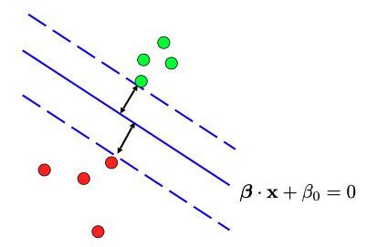
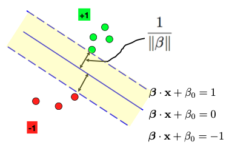
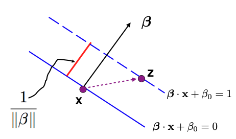
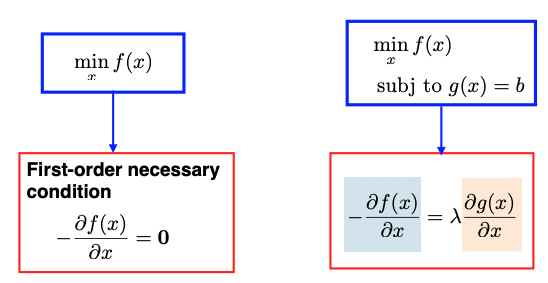
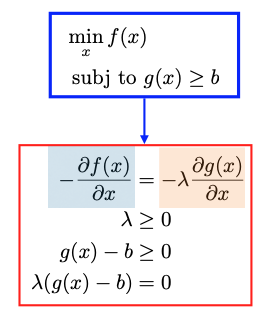
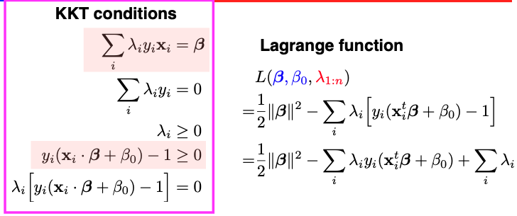
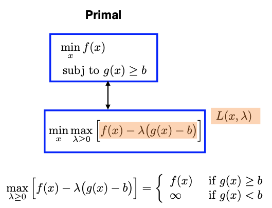
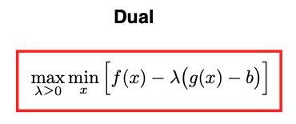
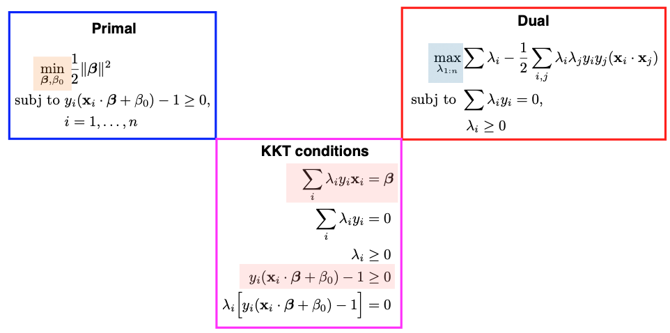

# 11.2. The Separable case

In Support Vector Machine (SVM), we aim to find a linear decision boundary, but unlike Linear Discriminant Analysis (LDA) and logistic regression, our focus isn’t on modeling conditional or joint distributions. Instead, we are directly modeling the decision boundary.

## 11.2.1. The Max-Margin Problem

To illustrate this, let’s consider a scenario where we have two groups of points, and we want to create a linear decision boundary to separate them. Our goal is to maximize the separation, making the margin between the two groups as wide as possible.



To achieve this, we introduce a solid blue line to separate the two groups of points, and we imagine creating parallel dashed lines on either side of it. We extend these dashed lines until they touch the green/red points on either side, creating a “margin” between them. This margin is essentially an “avenue” that separates the two groups, and we aim to maximize its width.

To formulate this problem mathematically, we start by representing the linear decision boundary (represented by the solid blue line) using coefficients, such as the slope $`\beta`$ and the intercept $`\beta_0`$. However, $`\beta`$ and $`\beta_0`$ are not uniquely determined, as we can scale them or flip their signs and still have the same line. To address this, we take the following steps to fix these parameters:

- We set the output labels $`y`$ to be either +1 or -1. Then require $`y_i (\beta \cdot x_i + \beta_0)`$ should always be positive. Here $`\beta \cdot x_i = \beta^t x_i`$ represents the Euclidean inner product between two vectors.
- We also need to fix the scale of $`\beta`$ and $`\beta_0`$. To do this, we parameterize the two dashed lines on either side of the solid blue line as $`\beta \cdot x + \beta_0 = 1`$ and $`\beta \cdot x + \beta_0 = -1`$. This scaling fixes the magnitude of $`\beta`$.



Next, our objective is to measure the margin or the width of the avenue between the two groups of points. Note that the distance between the solid and dashed lines is half the width. Recognize that the slope parameter of the line $`\beta`$ is orthogonal to both the solid and dashed lines.



To calculate the width of the avenue, we can pick a point on a dashed line, denoted as $`z`$, and another point on the solid line, denoted as $`x`$. We then compute the projection of the vector from $`x`$ to $`z`$ onto the direction of $`\beta`$ to find the magnitude of the red bar, representing half of the avenue’s width:

```math
(x - z)^t \frac{\beta}{\| \beta\|} = \frac{x^t \beta - z^t \beta}{\| \beta\|} = \frac{1}{\| \beta\|}.
```

This leads us to the conclusion that half of the avenue’s width is equal to $`1/\|\beta\|`$. Therefore, to maximize the margin, we can equivalently minimize $`\|\beta\|^2/2`$.

So, our goal becomes an optimization problem (known as the **max-margin** problem) subject to certain constraints. These constraints ensure that the data points fall on the correct side of the dashed lines:

```math
\begin{split}
\min_{\beta, \beta_0 } & \frac{1}{2} \|\beta\|^2  \\
\text{subject to } & y_i ( \beta \cdot x_i + \beta_0) - 1 \ge 0,
\end{split}
```

The max-margin problem is a convex optimization problem with a quadratic objective function and linear or affine constraints, making it free from issues related to local optima.

Additionally, the equation above represents the primal problem in SVM. Instead of directly solving the primal problem, we often solve its dual problem. The dual problem yields a set of $`\lambda`$ values, which can be linked to the solutions of the primal problem using the Karush-Kuhn-Tucker (KKT) conditions.

## 11.2.2. The KKT Conditions

The Karush-Kuhn-Tucker (KKT) conditions are a set of necessary conditions that characterize the solutions to constrained optimization problems.

When we want to minimize a function $`f(x)`$, we focus on its derivative. Specifically, we look at the negative derivative at a particular point, $`- \frac{\partial f(x)}{\partial x}`$, which indicates a direction along which we can make further reductions in the value of $`f`$.

### Optimization Without Constraints

First, let’s consider a scenario without constraints. We know that at the minimizer, the derivative of $`f`$ evaluated at that point should be zero. In mathematical terms, this is expressed as $`\frac{\partial f(x)}{\partial x} = 0`$. This condition signifies that there is no direction left to further reduce the value of $`f`$, making it a necessary condition for optimality.

### Optimization With Equality Constraints

Next, let’s extend this to situations where we have an equality constraint:

```math
\min_x  f(x), \quad \text{subject to }  g(x) =  b.
```

Here, our **feasible region** is defined by the set of $`x`$ values that satisfy $`g(x) =  b`$.

Suppose $`x`$ is a solution to this problem. At such a point, the negative derivative of $`f`$, which indicates a direction along which we can further reduce the value of $`f`$, may not necessarily be zero. However, this non-zero direction must be a “forbidden” one in the sense that moving along it would lead us outside the feasible region, violating the equality constraint. Mathematically, we can express this situation as:

$`\frac{\partial f}{\partial x} + \lambda \frac{\partial g}{\partial x} = 0`$, where $`\lambda`$ can take any real number value.



### Optimization With Inequality Constraints

Now, consider scenarios with an inequality constraint:

```math
\min_x  f(x), \quad \text{subject to }  g(x) =  b.
```

Assuming $`g(x)`$ is a concave function and $`f(x)`$ is smooth, there are two cases to explore. Suppose $`x`$ is a solution to this problem.

- **Case 1:** $`x`$ is inside the convex feasible region (interior point): In this case, we can place a small neighborhood around $`x`$ where the entire neighborhood remains within the feasible region. Then, the derivative $`\frac{\partial f(x)}{\partial x}`$ must be zero at this point. This aligns with the idea that there are no directions within the feasible region where $`f`$ can be further reduced.
- **Case 2:** $`x`$ lies on the boundary of the convex region (boundary point): Here, the negative derivative $`-\frac{\partial f(x)}{\partial x}`$ may not necessarily be zero. However, this direction is a “forbidden” one in the sense that moving along it would decrease the value of $`g`$, leading to $`g(x) < b`$ and therefore violating the inequality constraint. Mathematically, we can describe this direction as

```math
- \frac{\partial f(x)}{\partial x} = - \lambda \frac{\partial g}{\partial x}, \quad \lambda \ge 0,
```

where $`\lambda`$ must always be non-negative due to the inequality constraint.

The conditions outlined above can be encapsulated in the KKT conditions for optimization with inequality constraints.



Specifically, we have four conditions:

1. **First Condition:** The derivative of the Lagrangian function should be equal to zero. Here the Lagrangian function is defined as

```math
\begin{split}
L(x, \lambda) & = f(x) - \lambda (g(x) - b) \\
\frac{\partial}{\partial x} L & = 0 \quad \Longrightarrow \quad \frac{\partial f(x)}{\partial x} =  \lambda \frac{\partial g(x)}{\partial x}.
\end{split}
```
2. **Second Condition:** $`\lambda \ge 0`$.
3. **Third Condition:** The inequality constraints $`g(x) \ge b`$ should be satisfied.
4. **Fourth Condition (Complementary Slackness):** This condition ensures that when the constraint is not active, i.e., $`g(x) - b \ne 0`$, then the Lagrange multiplier $`\lambda`$ should be zero (Case 1).

#### KKT Conditions for SVM

The Lagrangian function and the four KKT conditions for the SVM problem are summarized below. The Lagrangian function involves two sets of arguments: the first set is for the primal problem, which includes the slope $`\beta`$ and intercept $`\beta_0`$, and the second set is for the Lagrange multipliers $`\lambda_1`$ to $`\lambda_n`$, as we have $`n`$ inequality constraints.



## 11.2.3. The Duality

Next, let’s discuss the duality between the primal and dual problems in optimization.

We start with the general **primal problem**, where our goal is to minimize a function $`f(x)`$ subject to an inequality constraint of the form $`g(x) \geq b`$. To establish the duality, we introduce the Lagrangian of this problem: $`L(x, \lambda) = f(x) - \lambda (g(x) - b)`$. (There is a typo in the image below: the Lagrangian multiplier $`\lambda \ge 0`$.)



The primal problem can be transformed into a minimax problem, which means minimizing with respect to variable $`x`$ and maximizing with respect to the Lagrange multiplier $`\lambda`$. To understand their equivalence, we analyze what’s inside the max operation with respect to $`\lambda`$. Two cases emerge:

- If $`g(x) \geq b`$, the expression inside the parentheses is positive. Therefore, we set $`\lambda = 0`$, which leads to the maximized value being equivalent to $`f(x)`$.
- If $`g(x) < b`$, the expression inside the parentheses is negative, and the product of a negative value and $`(-\lambda)`$ becomes positive. In this scenario, we aim to maximize $`\lambda`$ as much as possible, driving the value inside the parentheses to infinity. This situation results in the overall maximization value being infinite.

By analyzing these two cases, we conclude that the expression inside the max operation simplifies to $`f(x)`$. Therefore, the primal problem can be reformulated as a minimax problem.

Next, we switch the order of the minimization and maximization, the resulting optimization problem is known as the **dual problem**:



Usually, the dual problem provides a lower bound on the primal problem (known as weak duality):

```math
\max_\lambda \min_x L(x, \lambda) \le \min_x \max_\lambda L(x, \lambda).
```

But for SVM-type convex programming problems, strong duality holds, which means the optimal value of the primal problem is equal to the optimal value of the dual:

```math
\max_\lambda \min_x L(x, \lambda) = \min_x \max_\lambda L(x, \lambda).
```

The primal and dual problems for SVM are summarized below:



For SVM, we can choose to solve either the primal or dual problem to obtain the same optimal solution. In practice, solving the dual problem is often preferred for various reasons:

- The dual is easier to optimize than the primal, especially when it comes to handling constraints.
- The dual solution involves Lagrange multipliers $`\lambda_i`$’s. Many of these $`\lambda_i`$ values will be zero for data points that are not support vectors (data points on the dashed lines). Complementary Slackness in the KKT conditions ensures that only support vectors have non-zero $`\lambda`$ values. This leads to a sparse solution.
- The dual formulation of the SVM is advantageous when using kernel functions. The kernel trick allows SVMs to implicitly map data into higher-dimensional feature spaces without explicitly computing the mapping.

## 11.2.4. Prediction

Solving for the $`\lambda_i`$ values in the dual problem allows us to retrieve the parameters of the primal problem, specifically the slope $`\beta`$ and the intercept $`\beta_0`$ of the optimal linear decision boundary.

We will use the two equations colored in pink in the KKT conditions. The first equality can help us to solve for $`\beta`$:

```math
\beta = \sum \lambda_i y_i x_i = \sum_{i \in N_s} \lambda_i y_i x_i,
```

where $`N_s`$ represents the set of support vectors. Pick any support vector; since it’s on the dashed line, it must satisfy the equality $`y_i ( \beta \cdot x_i + \beta_0) - 1 =0`$. Thus we can solve for the intercept $`\beta_0`$. For computational stability, it is common to compute multiple $`\beta_0`$ values based on different support vectors and then average them. This helps mitigate slight variations that may occur in practice.

When it comes to making predictions for new data points, we simply evaluate the linear equation, involving $`(\beta, \beta_0)`$, and the new feature vector $`x^*`$, and examine the sign of the result. The sign determines whether we predict the new feature to belong to one class (+1) or the other class (-1).

### Computation Cost

SVM computation revolves around the dual problem, focusing on solving for $`\lambda_1`$ to $`\lambda_n`$. Consequently, the computational cost of SVM primarily depends on the sample size ($`n`$), not the original feature dimension ($`p`$). This implies that even a straightforward SVM model with a relatively low dimensional feature space can demand substantial computational resources when working with a large dataset.

### Probabilistic Outputs

Unlike logistic regression or discriminant analysis, SVM directly determines the decision boundary without providing probabilities. However, there is a way to obtain probability outcomes from the distance of a point to the binary decision boundary based on Platt Scaling:

[A Note on Platt’s Probabilistic Outputs for Support Vector Machines (Hsuan-Tien Lin et al., 2007)](https://liangfgithub.github.io/ref/SVM_Platt.pdf)

## 11.2.5. Summary

Let me provide a refined summary of our discussion regarding **linear SVMs for separable cases**.

To recap, we’ve been exploring linear SVMs in scenarios where data points can be cleanly separated by a linear function within the feature space $`X`$. This separability implies that multiple suitable linear functions could exist. Our goal has been to find the optimal linear function, or decision boundary, that **maximizes the margin** between two groups of data points.

Formally, this problem can be framed as a constrained optimization task. The constraints ensure that data points from both groups are correctly positioned on the respective sides of the decision boundary. However, instead of directly solving this constrained optimization problem, we’ve been addressing the **dual problem**, a pivotal concept in SVMs.

In the dual problem, the objective is to find the Lagrange multipliers (lambda values) associated with the original constraints. Importantly, due to a fundamental property called the **Complementary Slackness**, many of these lambda values will be zero. This condition, which is part of the Karush-Kuhn-Tucker (KKT) conditions, dictates that $`\lambda_i`$ and the constraint cannot both be nonzero simultaneously. Therefore, only data points located on the dashed lines exhibit nonzero $`\lambda_i`$ values. These special data points are referred to as **support vectors**.
