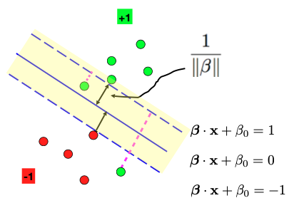
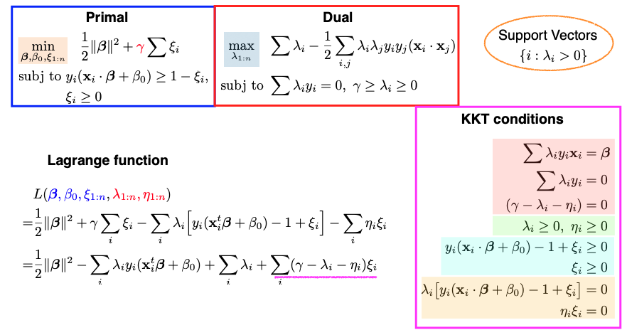
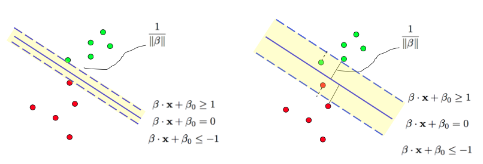

# 11.3. The Non-separable case

## 11.3.1. Non-separable Data

So far, we have covered Linear Support Vector Machines (SVM) for separable data. For example, in the image on the left, we have two groups of data points that can be easily separated by a solid blue line. However, what if the data is not separable, meaning there is no single solid blue line that can perfectly separate the two groups? In such cases, we can extend the hard margin formulation in two ways.


One approach is known as the **soft margin**, where we still aim to create a wide margin between the groups but allow some data points to be on the "wrong" side of the dashed line. This introduces an objective function that balances maximizing the margin and minimizing the errors.

Another extension is to consider nonlinear decision boundaries. While a linear function may not work for some data configurations, we can explore nonlinear functions. This can be achieved by expanding the feature space to a higher dimension, effectively applying a "kernel trick" without the need to explicitly visit the high-dimensional feature space. Nonlinear SVMs are often referred to as "kernel machines."

Though these extensions are primarily designed for handling non-separable data, we can still use them for separable data scenarios.

## 11.3.2. The Soft-Margin Problem

Now, let’s examine a data configuration where it’s impossible to separate the two groups of data points using a linear function. Nevertheless, we’ll still introduce a wide margin, represented by the white space between the two groups of data points. Some data points, specifically two green points, find themselves on the wrong side of the observed dashed line.



For data points on the correct side of the dashed line, we know they satisfy the condition

```math
y_i(\beta \cdot x_i + \beta_0) \geq 1.
```

But for the two green dots on the wrong side, we introduce a **slack variable**, denoted as $`\xi_i \geq 0`$, so they only need to satisfy

```math
y_i(\beta \cdot x_i + \beta_0) \geq 1 - \xi_i.
```

These $`\xi_i`$ values represent the degree of error, and they are non-negative because $`\xi_i`$ can’t be less than zero. Consequently, the objective function becomes a combination of two terms: one related to maximizing the margin and the other related to minimizing errors.

Consequently, the objective function comprises two terms: one focusing on maximizing the margin and another aiming to minimize the errors (measured by $`\xi_i`$). The two terms are weighted by a tuning parameter, $`\gamma > 0`$, which represents the price we are willing to pay for allowing some data points to be on the wrong side of the margin.



This optimization problem is still convex, with $`\beta, \beta_0,`$ and $`\xi_i`$ as the parameters of the primal problem. The number of constraints has doubled to $`2n`$ due to the introduction of slack variables. The nice property of convex optimization is that any local optimum is a global optimum.

## 11.3.3. The KKT Conditions

The KKT conditions play a critical role in solving this problem. There are four groups of these conditions, each color-coded on the slide above. Let’s go through them one by one.

1. The first group deals with taking the derivatives of the Lagrangian function with respect to $`\beta, \beta_0,`$ and $`\xi_i`$ and setting them to zero. These are similar to the hard margin case.
2. The second group enforces that all Lagrange multipliers ($`\lambda_i`$ and $`\eta_i`$) must be non-negative.
3. The third group simply reiterates the primal constraints.
4. The fourth group involves complementary slackness. $`\lambda_i`$ and $`\eta_i,`$ along with the corresponding constraints, cannot be nonzero simultaneously.

Once these KKT conditions are satisfied, we can solve the dual problem. The dual problem minimizes the Lagrangian function with respect to $`\lambda_i`$ and $`\eta_i.`$ Interestingly, only $`\lambda_i`$ is present in the dual problem because $`\eta_i`$ never appears in the expression. This simplification allows us to optimize and solve for $`\lambda_1`$ to $`\lambda_n`$.

### Support Vectors

Support vectors are crucial in SVM, and they are the data points with nonzero $`\lambda_i`$ values. In this soft margin formulation, we can classify data points into three groups:

1. Data points on the correct side of the dashed line, where $`\lambda_i = 0`$, making them non-support vectors.
2. Data points on the dashed line, where $`\lambda_i`$ could be nonzero, indicating potential support vectors.
3. Data points on the wrong side of the dashed line, where $`\eta_i = 0`$, making $`\lambda_i`$ nonzero, and they are support vectors.

In summary, this soft margin formulation leads to a solution that depends only on support vectors, which include data points on the dashed lines and those on the wrong side of the dashed lines. For this particular example, there are four support vectors.

## 11.3.4. The Gamma Parameter

An additional parameter in the soft margin formulation is $`\gamma`$, which represents the cost of having data points on the wrong side of the dashed line.

Gamma’s value is specified by the user or can be chosen through cross-validation. It dictates our preference for a wider margin versus reducing classification errors. The larger the $`\gamma,`$ the narrower the margin. A higher $`\gamma`$ may lead to a more complex model, potentially prone to overfitting.



In the soft margin formulation, $`\gamma`$ is inversely related to the tuning parameter $`\lambda`$ used in the dual problem. If we set $`\gamma`$ to infinity, we essentially revert to the hard margin formulation, where no data points are allowed on the wrong side of the margin. This means that for non-separable data, there might not be a solution.

## 11.3.5. Loss + Penalty

We can also view the primal problem as a special case of the **Loss + Penalty** framework. The hinge loss function, represented by the blue curve in the graph, measures the margin of our classifier $`f(x) = x^t \beta + \beta_0.`$ When $`y_i`$ and $`f(x_i)`$ have the same sign and the margin is large (far from 0), the hinge loss approaches zero. However, if they have opposite signs, the hinge loss increases. This loss function captures our desire for not just correct classification but also a margin of separation between the classes.


In the context of SVM, we employ hinge loss over the $`n`$ observations, where $`f`$ is a linear function defined by parameters $`(\beta_0, \beta).`$ We also introduce a ridge penalty over beta, represented by gamma (or its reciprocal, $`\nu`$), which controls the trade-off between minimizing the hinge loss and the complexity of the model. A larger $`\gamma`$ leads to a smaller penalty $`\nu`$ and a more complex model.
