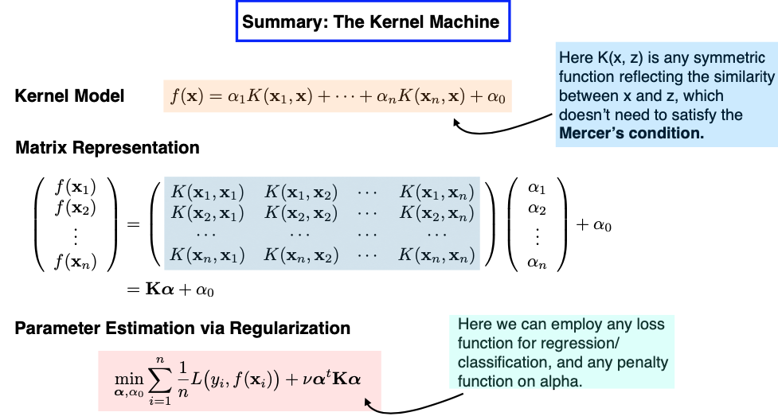

# 11.4. Nonlinear SVMs

## 11.4.1. Linear SVM Recap

Before discussing the extension from a linear SVM to a non-linear SVM, let’s briefly review the linear SVM, which we have covered extensively. In the linear SVM, we start with our primal problem, which involves terms like the slope $`\beta`$, intercept $`\beta_0`$, and the regularization parameter $`\gamma`$. We solve the dual problem with the Lagrangian multipliers $`\lambda_1`$ to $`\lambda_n`$. The original parameters $`\beta`$ and $`\beta_0`$ can be found using the KKT condition, and they depend on a small set of support vectors.


Interestingly, in practice, there’s no need for explicit calculations of $`\beta`$ and $`\beta_0`$. During the prediction phase, as depicted in the slide above, we find that the values of $`\lambda_1`$ to $`\lambda_n`$ suffice for making accurate predictions.

## 11.4.2. Embedding

Now, let’s move on to nonlinear extensions, which can create more flexible classifiers with nonlinear decision boundaries. We’ve done nonlinear extension before when we discussed regression models: to extend to nonlinear functions, all we need to do is add nonlinear terms as new features. This way, we can continue using our linear SVM.

To do this, we first embed data points into a higher-dimensional feature space,

```math
\Phi : \mathcal{X} \rightarrow \mathcal{F}, \quad \Phi(x) = (\phi_1(x), \phi_2(x), \dots ),
```

and then apply the linear SVM in this feature space $`\mathcal{F}`$, since a linear function in this new feature space results in a nonlinear function of the original input $`x`$.

## 11.4.3. The Kernel Function

What’s fascinating is that we don’t even need to compute the mapping from $`\mathcal{X}`$ to $`\mathcal{F}`$ explicitly. Since all calculations are based on inner products, we only need to know how to compute the inner product in the $`\mathcal{F}`$ space. This can be achieved by evaluating the kernel function, denoted as $`K`$.

```math
K_{\Phi}(x_i, x) = \langle \Phi(x), \Phi(x_i) \rangle.
```

Note that I haven’t written the inner product as $`\Phi(x)^t \Phi(x_i)`$ since the feature space $`\mathcal{F}`$ might be infinite dimensional, not a finite dimensional Euclidean space. For instance, the mapped feature $`\Phi(x)`$ could be a function.

This technique is commonly known as the **Kernel Trick**. It allows us to compute the inner product as a function in the original input space $`\mathcal{X}`$ without explicitly calculating the mapping $`\Phi(x)`$ into the higher-dimensional feature space. This technique can also be used in various algorithms that rely solely on inner products, such as kernel Principal Component Analysis (PCA).

The bivariate function $`K`$ represents the similarity between two data points, extending the concept beyond the ordinary Euclidean inner product. Regarding the choice of kernel function, you have several options. Polynomial kernels, Gaussian kernels, and others can be used, as long as they satisfy certain mathematical conditions like the Mercer condition. The Mercer condition ensures that the bivariate kernel function $`K(x, z)`$ is symmetric and semi-positive definite, thus yields an inner product in some feature space.

## 11.4.4. Loss + Penalty

Let’s delve into the details presented on this mathematical slide below.


On the left side, we see both the primal and the dual representations, along with the prediction rule for linear SVM.

Moving to the upper right side, we revisit the primal problem, which we previously discussed as a combination of loss and penalty terms. In this formulation, the loss is represented by the hinge loss, while the penalty is a ridge penalty to the slope parameter $`\beta`$.

Now, the question arises: Given that in practice, we often bypass the need to explicitly calculate the primal and instead solve for the dual, can we establish a loss + penalty framework in terms of the dual parameters $`\lambda_1, \dots, \lambda_n`$?

Indeed, this is achievable, as both the linear function $`f`$ and the $`\beta`$ parameter can be expressed in terms of $`\lambda_1, \dots, \lambda_n`$.

The same principle extends to nonlinear SVMs that involve a kernel function $`K`$. In this case, we discover that the primal function $`f`$ can be expressed as a linear combination of kernel functions. These coefficients, denoted as $`\alpha_i`$ in the slide, are $`\lambda_i`$ multiplied by $`y_i`$.

So, we can reformulate the nonlinear SVM as a loss + penalty framework in terms of the coefficients $`\alpha`$’s. However, there’s a twist: The penalty is not the ordinary L2 ridge penalty. Instead, it’s a generalized ridge penalty that incorporates the $`K`$ matrix in the middle.

## 11.4.5. The Kernel Machine

Now, let’s explore SVM from a different perspective, one that I like to refer to as a “kernel machine.”

Consider this: We’re on a mission to predict whether individuals like the new iPhone. We have features like age, income level, ethnic background, and more. However, we don’t want to use these features directly as inputs. Instead, we’ll establish a similarity measure between any two individuals among the $`n`$ training samples.

Think of this “kernel machine” as an extension of the k-Nearest Neighbors (kNN) approach. Each individual in the training set essentially becomes a feature in this context, a representative sample. In this new perspective, we measure how similar each individual is to one another using a bivariate function $`K`$. This function takes two inputs, with one of them fixed at a specific data point, $`x_i`$. This process results in a fresh set of $`n`$ features.



If we represent everything in matrix form, our design matrix takes the shape of an $`n \times n`$ matrix. The key task at hand is to learn the coefficients $`\alpha`$. We achieve this by estimating the coefficients $`\alpha`$ using a Loss + Penalty framework, with the loss function being the hinge loss and the penalty applied to $`\alpha`$ taking this form of a generalized ridge penalty.

Now, the model I’ve just described aligns precisely with the concept of a nonlinear SVM.

However, there are two subtle conditions that SVM imposes but appear more flexible within this new “kernel machine” model.

- First, the ridge penalty on the coefficients $`\alpha`$. Can we explore alternative penalties, such as Lasso? Wouldn’t this potentially lead to a sparser solution?
- Second, the condition on the bivariate function $`K`$. In traditional SVM, the kernel function is expected to satisfy the Mercer condition, which implies that the $`n \times n`$ design matrix should be semi-positive definite. This requirement seems unique; most other regression or classification models don’t impose such conditions on the design matrix.

Absolutely, from a practical perspective, loosening these conditions is indeed acceptable. It allows us to construct our “kernel machine” with more flexibility, using the similarity function that best suits our problem and experimenting with different penalty functions. While the resulting model may not fit the traditional definition of a Support Vector Machine (SVM), it can still serve as a valuable supervised learning model.

### RKHS

Next, let’s consider the intriguing question: What happens if our selected kernel function satisfies the Mercer condition, and we consistently employ that specific ridge-type penalty during training? How do these choices impact our kernel model, and what do we gain from these two requirements?

Imagine this scenario: Today, we build a model based on a training set with $`n = 200`$ samples. However, tomorrow, we might gather more data, increasing our sample size to $`n = 300`$. This necessitates the creation of a new model, which entails estimating 300 coefficients. This dynamic nature raises questions about the function space we’re exploring, and it becomes contingent on the dataset we’re working with.

What’s particularly fascinating about the Mercer condition is that it leads us to a fixed functional space, independent of the data itself, known as a “reproducing kernel Hilbert space” (RKHS). This space can be extensive, even infinite-dimensional. When we formulate our objective function using the specific ridge-type penalty, regardless of the choice of the loss function, and apply this penalty within the RKHS, the resulting minimizer always takes on the following finite form:

```math
\alpha_1 K(x_1, x) + \cdots + \alpha_n K(x_n, x) + \alpha_0
```

In essence, this implies that although the function space can be infinite-dimensional, the minimizer of our objective function must ultimately adopt a finite representation, involving $`n`$ coefficients. This concept bears resemblance to what we encounter with smoothing splines, offering a connection between these mathematical frameworks.
