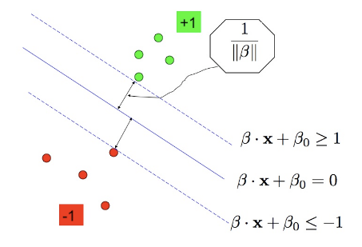
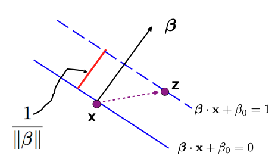
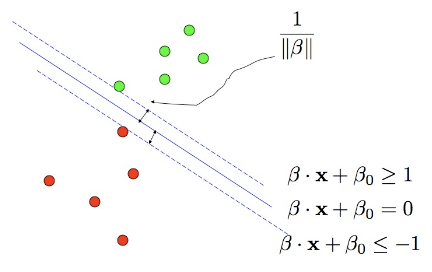
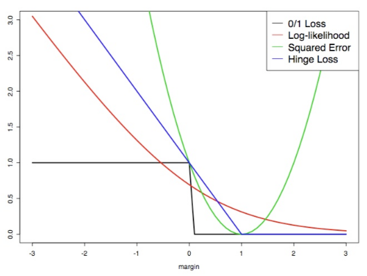

# Support Vector Machine (SVM) Module

[](https://www.python.org/)
[](https://www.r-project.org/)
[](https://github.com/darinz/Statistical-Learning)

## Overview

This module provides a comprehensive, modernized introduction to Support Vector Machines (SVMs), a powerful class of supervised learning algorithms for classification and regression.

  
  *Figure: Linear separable SVM with max-margin.*

## Module Structure

- **01_introduction.md**: SVM motivation, linear separable case, duality, support vectors, and kernel trick
- **02_separable_case.md**: Max-margin problem, KKT conditions, duality, prediction, computational cost, summary

  
  *Figure: SVM margin and support vectors.*

  
  *Figure: KKT conditions for SVM.*

- **03_non-separable_case.md**: Soft margin SVM, slack variables, KKT for non-separable case, gamma parameter, loss+penalty view

  
  *Figure: Soft margin SVM (non-separable case).* 

  
  *Figure: Soft margin SVM illustration.*

  
  *Figure: Overview of non-separable SVM optimization.*

- **04_nonlinear_svms.md**: Nonlinear SVMs, feature space embedding, kernel functions, kernel machines, RKHS

  
  *Figure: Kernel machine and feature space embedding.*

- **05_appendix.md**: Additional notes and references

## Recent Enhancements

- **Expanded Explanations:** All modules now feature clearer, more detailed explanations of mathematical concepts and algorithms.
- **LaTeX Math Formatting:** All math is now formatted using inline ($`...`$) and display (```math) LaTeX for readability and copy-paste support.
- **Code Examples:** Python and R code snippets are provided and explained for all major algorithms.
- **Image-to-Text Conversion:** PNG images containing math or text have been transcribed into markdown with LaTeX where possible, improving accessibility.
- **Visual Aids:** Diagrams and figures are referenced and described in context to support conceptual understanding.

## Prerequisites

- Linear algebra (vectors, inner products, matrix operations)
- Calculus and optimization (gradients, convexity)
- Probability and statistics
- Familiarity with basic machine learning concepts
- Experience with Python or R (for code examples)

## Learning Objectives

By the end of this module, you will be able to:

1. Understand the mathematical foundations of SVMs
2. Formulate and solve the max-margin problem for linear SVMs
3. Apply KKT conditions and duality in SVM optimization
4. Extend SVMs to non-separable and nonlinear cases using slack variables and kernels
5. Interpret the role of support vectors and the sparsity of SVM solutions
6. Understand the kernel trick and the concept of RKHS
7. Implement and tune SVMs for real-world classification problems

## Mathematical Framework

### Linear SVM (Separable Case)
The max-margin problem:
```math
\min_{\beta, \beta_0} \frac{1}{2} \|\beta\|^2 \quad \text{subject to } y_i (\beta \cdot x_i + \beta_0) \geq 1
```
Dual formulation:
```math
\max_{\lambda_i} \sum_i \lambda_i - \frac{1}{2} \sum_{i,j} \lambda_i \lambda_j y_i y_j (x_i \cdot x_j)
```

### Soft Margin SVM (Non-separable Case)
```math
\min_{\beta, \beta_0, \xi} \frac{1}{2} \|\beta\|^2 + \gamma \sum_i \xi_i \quad \text{subject to } y_i (\beta \cdot x_i + \beta_0) \geq 1 - \xi_i, \; \xi_i \geq 0
```

### Nonlinear SVM and Kernel Trick
- Feature mapping: $`\Phi : \mathcal{X} \to \mathcal{F}`$
- Kernel function: $`K(x, z) = \langle \Phi(x), \Phi(z) \rangle`$
- Dual with kernel: $`(x_i \cdot x_j) \to K(x_i, x_j)`$

### Loss + Penalty Framework
- Hinge loss: $`L(y, f(x)) = [1 - y f(x)]_+`$
- SVM objective: $`\min_f \sum_{i=1}^n [1 - y_i f(x_i)]_+ + \nu \|f\|^2_{\mathcal{H}_K}`$

  
  *Figure: Comparison of hinge loss and other loss functions.*

  
  *Figure: SVM loss + penalty framework.*

## Key Algorithms

- Quadratic programming for SVM optimization
- Sequential Minimal Optimization (SMO)
- Kernel methods for nonlinear SVMs
- Cross-validation for hyperparameter tuning (gamma, kernel parameters)

## Practical Considerations

- **Sparsity**: Only support vectors have nonzero dual coefficients
- **Kernel choice**: Polynomial, Gaussian (RBF), and others
- **Regularization**: Trade-off between margin width and misclassification
- **Computational cost**: Depends on sample size, not feature dimension
- **Probabilistic outputs**: Platt scaling for probability estimates

## Applications

- Text classification and spam detection
- Image recognition and computer vision
- Bioinformatics and genomics
- Finance and risk modeling
- General binary and multiclass classification tasks

## References

1. Hastie, T., Tibshirani, R., & Friedman, J. (2009). *The Elements of Statistical Learning*. Springer.
2. Schölkopf, B., & Smola, A. J. (2002). *Learning with Kernels*. MIT Press.
3. Cristianini, N., & Shawe-Taylor, J. (2000). *An Introduction to Support Vector Machines and Other Kernel-based Learning Methods*. Cambridge University Press.
4. James, G., Witten, D., Hastie, T., & Tibshirani, R. (2013). *An Introduction to Statistical Learning*. Springer.

## Related Modules

- **Linear Regression**: Foundation for understanding regression and classification
- **Logistic Regression**: Probabilistic classification and comparison to SVM
- **Discriminant Analysis**: Alternative linear classification methods
- **Kernel Methods**: Broader family of algorithms using kernels

## Acknowledgments

This module is based on classical statistical learning theory and modern machine learning practice. Special thanks to the open-source and academic communities for their contributions to SVM research and software.

---

*For questions or contributions, please refer to the main course documentation or contact the course instructors.* 