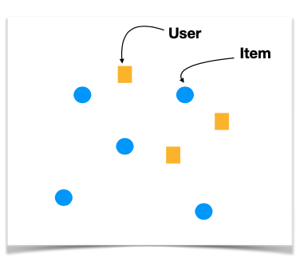

# 13.2. Content-Based Methods

Content-based filtering represents one of the most intuitive and mathematically elegant approaches to recommendation systems. Unlike collaborative filtering methods that rely on user-item interaction patterns, content-based methods leverage the intrinsic properties of items to make personalized recommendations.

## 13.2.1. Introduction to Content-Based Filtering

### Philosophical Foundation

Content-based filtering is grounded in the principle that **"similar items should be recommended to users who have shown preference for those items."** This approach mirrors how humans naturally make recommendations - by understanding the characteristics of items and matching them to user preferences.

### Core Mathematical Principle

The fundamental mathematical principle can be expressed as:

```math
\text{Recommendation}(u, i) = \text{Similarity}(\text{UserProfile}(u), \text{ItemProfile}(i))
```

where:
- $`\text{UserProfile}(u)`$ represents user $`u`$'s preference vector in the feature space
- $`\text{ItemProfile}(i)`$ represents item $`i`$'s feature vector in the same space
- $`\text{Similarity}(\cdot, \cdot)`$ is a similarity function that measures the alignment between user preferences and item characteristics

### Feature Space Representation

In content-based filtering, both users and items are represented in a common **feature space** $`\mathcal{F} \subseteq \mathbb{R}^d`$, where $`d`$ is the dimensionality of the feature space. This allows us to:

1. **Vectorize Items**: Each item $`i`$ is represented as a feature vector $`\mathbf{f}_i \in \mathbb{R}^d`$
2. **Vectorize Users**: Each user $`u`$ is represented as a preference vector $`\mathbf{p}_u \in \mathbb{R}^d`$
3. **Compute Similarity**: Measure the similarity between user preferences and item features

### Mathematical Framework

Let $`\mathcal{U}`$ be the set of users and $`\mathcal{I}`$ be the set of items. The content-based recommendation problem can be formalized as:

**Problem Definition**: Given a user $`u \in \mathcal{U}`$, find items $`i \in \mathcal{I}`$ that maximize the similarity function:

```math
i^* = \arg\max_{i \in \mathcal{I}} \text{Similarity}(\mathbf{p}_u, \mathbf{f}_i)
```

**Objective Function**: The recommendation score for user $`u`$ and item $`i`$ is:

```math
s(u, i) = \text{Similarity}(\mathbf{p}_u, \mathbf{f}_i)
```

### Geometric Interpretation

In the feature space, we can visualize:
- **Items** as points $`\mathbf{f}_i`$ in $`\mathbb{R}^d`$
- **Users** as points $`\mathbf{p}_u`$ in the same space
- **Recommendations** as finding items closest to the user's preference point



This geometric interpretation shows how users and items coexist in the same feature space, enabling direct similarity computations.

### Advantages of Content-Based Approach

1. **Cold Start Resilience**: Can recommend new items immediately if features are available
2. **Interpretability**: Clear feature-based reasoning for recommendations
3. **Independence**: Doesn't require other users' interaction data
4. **Transparency**: Users can understand why items are recommended
5. **Scalability**: Computationally efficient for large user bases

### Limitations and Challenges

1. **Feature Dependency**: Requires rich item metadata
2. **Overspecialization**: May create "filter bubbles"
3. **Feature Engineering**: Requires domain expertise
4. **Limited Discovery**: Focuses on similar items rather than diverse recommendations

## 13.2.2. Item Profiling

Item profiling is the process of representing items as feature vectors in a high-dimensional space. This is the foundation of content-based filtering, as it enables mathematical operations on item characteristics.

### Mathematical Framework for Item Profiling

#### Feature Vector Definition

Each item $`i \in \mathcal{I}`$ is represented as a feature vector:

```math
\mathbf{f}_i = [f_{i1}, f_{i2}, \ldots, f_{id}]^T \in \mathbb{R}^d
```

where:
- $`f_{ij}`$ represents the $`j`$-th feature of item $`i`$
- $`d`$ is the dimensionality of the feature space
- $`\mathbf{f}_i`$ is the feature vector for item $`i`$

#### Feature Space Construction

The complete feature space is constructed as:

```math
\mathcal{F} = \{\mathbf{f}_i : i \in \mathcal{I}\} \subseteq \mathbb{R}^d
```

### Feature Engineering Techniques

#### 1. Categorical Features (One-Hot Encoding)

For discrete categories like genre, director, or actor, we use one-hot encoding:

```math
f_{ij} = \begin{cases}
1 & \text{if item } i \text{ has category } j \\
0 & \text{otherwise}
\end{cases}
```

**Mathematical Properties**:
- Binary representation: $`f_{ij} \in \{0, 1\}`$
- Sparsity: Most features are zero for any given item
- Orthogonality: Categories are mutually exclusive

**Example**: For a movie with genres [Action, Drama, Comedy], if the movie is Action and Drama:
```math
\mathbf{f}_{\text{genre}} = [1, 1, 0]^T
```

#### 2. Numerical Features (Normalization)

For continuous values like release year, rating, or price, we apply normalization:

```math
f_{ij} = \frac{x_{ij} - \mu_j}{\sigma_j}
```

where:
- $`x_{ij}`$ is the raw value of feature $`j`$ for item $`i`$
- $`\mu_j = \frac{1}{|\mathcal{I}|} \sum_{i \in \mathcal{I}} x_{ij}`$ is the mean of feature $`j`$
- $`\sigma_j = \sqrt{\frac{1}{|\mathcal{I}|} \sum_{i \in \mathcal{I}} (x_{ij} - \mu_j)^2}`$ is the standard deviation

**Alternative Normalization Methods**:

**Min-Max Normalization**:
```math
f_{ij} = \frac{x_{ij} - \min_k x_{kj}}{\max_k x_{kj} - \min_k x_{kj}}
```

**Robust Normalization** (using median and MAD):
```math
f_{ij} = \frac{x_{ij} - \text{median}_k(x_{kj})}{\text{MAD}_k(x_{kj})}
```

where MAD is the Median Absolute Deviation.

#### 3. Text Features (TF-IDF)

For textual content like descriptions or reviews, we use TF-IDF:

```math
f_{ij} = \text{TF-IDF}(i, j) = \text{TF}(i, j) \times \text{IDF}(j)
```

where:

**Term Frequency (TF)**:
```math
\text{TF}(i, j) = \frac{n_{ij}}{\sum_k n_{ik}}
```

where $`n_{ij}`$ is the count of term $`j`$ in document $`i`$.

**Inverse Document Frequency (IDF)**:
```math
\text{IDF}(j) = \log\left(\frac{|\mathcal{I}|}{|\{i : j \in i\}|}\right)
```

where $`|\{i : j \in i\}|`$ is the number of documents containing term $`j`$.

### Advanced Feature Engineering

#### 1. Feature Interaction Terms

To capture interactions between features:

```math
f_{ij,k} = f_{ij} \times f_{ik}
```

#### 2. Polynomial Features

To capture non-linear relationships:

```math
f_{ij}^2, f_{ij}^3, \ldots
```

#### 3. Feature Aggregation

For hierarchical features (e.g., genre → subgenre):

```math
f_{i,\text{genre}} = \sum_{s \in \text{subgenres}} w_s \cdot f_{i,s}
```

### Feature Selection and Dimensionality Reduction

#### 1. Information Gain

```math
\text{IG}(F_j) = H(Y) - H(Y|F_j)
```

where:
- $`H(Y)`$ is the entropy of the target variable
- $`H(Y|F_j)`$ is the conditional entropy given feature $`F_j`$

#### 2. Principal Component Analysis (PCA)

```math
\mathbf{f}_i' = \mathbf{W}^T \mathbf{f}_i
```

where $`\mathbf{W}`$ is the projection matrix from PCA.

#### 3. Feature Importance

```math
\text{Importance}(F_j) = \frac{1}{|\mathcal{U}|} \sum_{u \in \mathcal{U}} |p_{uj}|
```

### Example: Comprehensive Movie Profiling

Consider a movie with the following feature vector:

```math
\mathbf{f}_{\text{movie}} = \begin{bmatrix}
\text{Action} & 1 \\
\text{Drama} & 0 \\
\text{Comedy} & 0 \\
\text{Thriller} & 1 \\
\text{Year\_normalized} & 0.8 \\
\text{Budget\_normalized} & 0.6 \\
\text{Director\_Spielberg} & 1 \\
\text{Actor\_Cruise} & 1 \\
\text{Length\_normalized} & 0.7 \\
\text{TF-IDF\_action} & 0.85 \\
\text{TF-IDF\_adventure} & 0.72 \\
\text{TF-IDF\_thriller} & 0.91
\end{bmatrix}
```

### Feature Quality Metrics

#### 1. Feature Variance

```math
\text{Var}(F_j) = \frac{1}{|\mathcal{I}|} \sum_{i \in \mathcal{I}} (f_{ij} - \bar{f}_j)^2
```

#### 2. Feature Correlation

```math
\text{Corr}(F_j, F_k) = \frac{\sum_{i \in \mathcal{I}} (f_{ij} - \bar{f}_j)(f_{ik} - \bar{f}_k)}{\sqrt{\sum_{i \in \mathcal{I}} (f_{ij} - \bar{f}_j)^2} \sqrt{\sum_{i \in \mathcal{I}} (f_{ik} - \bar{f}_k)^2}}
```

#### 3. Feature Sparsity

```math
\text{Sparsity}(F_j) = \frac{|\{i : f_{ij} = 0\}|}{|\mathcal{I}|}
```

## 13.2.3. User Profiling

User profiling is the process of constructing preference vectors that represent user tastes in the same feature space as items. This enables direct comparison between user preferences and item characteristics.

### Mathematical Framework for User Profiling

#### User Profile Definition

Each user $`u \in \mathcal{U}`$ is represented as a preference vector:

```math
\mathbf{p}_u = [p_{u1}, p_{u2}, \ldots, p_{ud}]^T \in \mathbb{R}^d
```

where $`p_{uj}`$ represents user $`u`$'s preference strength for feature $`j`$.

#### Profile Space Construction

The complete user profile space is:

```math
\mathcal{P} = \{\mathbf{p}_u : u \in \mathcal{U}\} \subseteq \mathbb{R}^d
```

### User Profile Construction Methods

#### 1. Explicit Profiling (Direct Preference Elicitation)

Users directly specify their preferences through surveys or preference settings:

```math
\mathbf{p}_u = [p_{u1}, p_{u2}, \ldots, p_{ud}]^T
```

where $`p_{uj} \in [0, 1]`$ represents the user's self-reported preference for feature $`j`$.

**Mathematical Properties**:
- Direct user input: $`p_{uj} \in [0, 1]`$
- Subjective nature: Based on user self-assessment
- Sparse profiles: Users typically specify only a subset of features

#### 2. Implicit Profiling (Behavior-Based Inference)

Preferences are inferred from user interaction history using weighted aggregation:

```math
\mathbf{p}_u = \frac{\sum_{i \in \mathcal{I}_u} w_{ui} \cdot \mathbf{f}_i}{\sum_{i \in \mathcal{I}_u} w_{ui}}
```

where:
- $`\mathcal{I}_u = \{i : \text{user } u \text{ has interacted with item } i\}`$ is the set of items rated by user $`u`$
- $`w_{ui}`$ is the weight of item $`i`$ for user $`u`$
- $`\mathbf{f}_i`$ is the feature vector of item $`i`$

**Weighting Strategies**:

**Rating-Based Weighting**:
```math
w_{ui} = r_{ui} - \bar{r}_u
```

where $`r_{ui}`$ is the rating given by user $`u`$ to item $`i`$, and $`\bar{r}_u`$ is the average rating of user $`u`$.

**Binary Interaction Weighting**:
```math
w_{ui} = \begin{cases}
1 & \text{if user } u \text{ interacted with item } i \\
0 & \text{otherwise}
\end{cases}
```

**Confidence-Based Weighting**:
```math
w_{ui} = \text{confidence}(r_{ui}) \cdot (r_{ui} - \bar{r}_u)
```

where confidence increases with rating extremity.

#### 3. Time-Weighted Profiling (Temporal Dynamics)

Recent interactions are weighted more heavily to capture evolving preferences:

```math
w_{ui} = \exp\left(-\lambda \cdot (t_{\text{current}} - t_{ui})\right)
```

where:
- $`t_{ui}`$ is the timestamp when user $`u`$ interacted with item $`i`$
- $`\lambda > 0`$ is the decay parameter (larger values = faster decay)

**Alternative Time Decay Functions**:

**Linear Decay**:
```math
w_{ui} = \max(0, 1 - \lambda \cdot (t_{\text{current}} - t_{ui}))
```

**Power Law Decay**:
```math
w_{ui} = (t_{\text{current}} - t_{ui} + 1)^{-\lambda}
```

**Logarithmic Decay**:
```math
w_{ui} = \frac{1}{\log(1 + \lambda \cdot (t_{\text{current}} - t_{ui}))}
```

### Advanced User Profiling Techniques

#### 1. Multi-Context Profiling

Different profiles for different contexts (time of day, location, mood):

```math
\mathbf{p}_u^{(c)} = \frac{\sum_{i \in \mathcal{I}_u^{(c)}} w_{ui}^{(c)} \cdot \mathbf{f}_i}{\sum_{i \in \mathcal{I}_u^{(c)}} w_{ui}^{(c)}}
```

where $`c`$ represents the context.

#### 2. Hierarchical Profiling

Profiles at different levels of abstraction:

```math
\mathbf{p}_u^{(l)} = \frac{\sum_{i \in \mathcal{I}_u} w_{ui} \cdot \mathbf{f}_i^{(l)}}{\sum_{i \in \mathcal{I}_u} w_{ui}}
```

where $`l`$ represents the level of abstraction.

#### 3. Collaborative Profiling

Incorporate information from similar users:

```math
\mathbf{p}_u = \alpha \cdot \mathbf{p}_u^{\text{personal}} + (1-\alpha) \cdot \mathbf{p}_u^{\text{collaborative}}
```

where:
```math
\mathbf{p}_u^{\text{collaborative}} = \frac{\sum_{v \in \mathcal{N}_u} \text{sim}(u, v) \cdot \mathbf{p}_v}{\sum_{v \in \mathcal{N}_u} \text{sim}(u, v)}
```

### Profile Quality Metrics

#### 1. Profile Completeness

```math
\text{Completeness}(u) = \frac{|\{j : p_{uj} \neq 0\}|}{d}
```

#### 2. Profile Strength

```math
\text{Strength}(u) = \|\mathbf{p}_u\|_2 = \sqrt{\sum_{j=1}^d p_{uj}^2}
```

#### 3. Profile Diversity

```math
\text{Diversity}(u) = \frac{1}{|\mathcal{I}_u|} \sum_{i,j \in \mathcal{I}_u} (1 - \text{sim}(\mathbf{f}_i, \mathbf{f}_j))
```

#### 4. Profile Stability

```math
\text{Stability}(u) = 1 - \frac{\|\mathbf{p}_u^{(t)} - \mathbf{p}_u^{(t-1)}\|_2}{\|\mathbf{p}_u^{(t-1)}\|_2}
```

### Profile Normalization and Regularization

#### 1. L2 Normalization

```math
\mathbf{p}_u' = \frac{\mathbf{p}_u}{\|\mathbf{p}_u\|_2}
```

#### 2. L1 Normalization

```math
\mathbf{p}_u' = \frac{\mathbf{p}_u}{\|\mathbf{p}_u\|_1}
```

#### 3. Ridge Regularization

```math
\mathbf{p}_u' = \arg\min_{\mathbf{p}} \left\{\|\mathbf{p} - \mathbf{p}_u\|_2^2 + \lambda \|\mathbf{p}\|_2^2\right\}
```

### Example: Comprehensive User Profile Construction

For a user who rated several movies with the following interaction history:

| Movie | Rating | Genre | Year | Director |
|-------|--------|-------|------|----------|
| Movie A | 5 | Action | 2020 | Spielberg |
| Movie B | 3 | Drama | 2018 | Nolan |
| Movie C | 4 | Action | 2021 | Spielberg |
| Movie D | 2 | Comedy | 2019 | Tarantino |

**Step 1: Feature Vector Construction**
```math
\mathbf{f}_A = [1, 0, 0, 0.8, 1, 0, 0]^T \quad \text{(Action, Year_norm, Director_Spielberg)}
```

**Step 2: Weighted Aggregation**
```math
\mathbf{p}_u = \frac{(5-3.5)\mathbf{f}_A + (3-3.5)\mathbf{f}_B + (4-3.5)\mathbf{f}_C + (2-3.5)\mathbf{f}_D}{|5-3.5| + |3-3.5| + |4-3.5| + |2-3.5|}
```

**Step 3: Final User Profile**
```math
\mathbf{p}_u = \begin{bmatrix}
\text{Action} & 0.8 \\
\text{Drama} & -0.2 \\
\text{Comedy} & -0.4 \\
\text{Thriller} & 0.0 \\
\text{Year\_normalized} & 0.6 \\
\text{Director\_Spielberg} & 0.9 \\
\text{Director\_Nolan} & -0.1 \\
\text{Director\_Tarantino} & -0.3
\end{bmatrix}
```

This profile indicates the user strongly prefers action movies, newer films, and movies by Spielberg, while disliking comedies and older films.

## 13.2.4. Similarity Computation

Similarity computation is the core mathematical operation in content-based filtering. It measures the alignment between user preferences and item characteristics in the shared feature space.

### Mathematical Framework for Similarity

#### Similarity Function Definition

A similarity function $`\text{sim}: \mathbb{R}^d \times \mathbb{R}^d \rightarrow [0, 1]`$ maps two vectors to a similarity score, where:
- $`\text{sim}(\mathbf{a}, \mathbf{b}) = 1`$ indicates perfect similarity
- $`\text{sim}(\mathbf{a}, \mathbf{b}) = 0`$ indicates no similarity
- $`\text{sim}(\mathbf{a}, \mathbf{b}) = \text{sim}(\mathbf{b}, \mathbf{a})`$ (symmetry)

#### Geometric Interpretation

In the feature space $`\mathbb{R}^d`$:
- **Similarity** measures how "close" user preferences are to item features
- **Distance** measures how "far apart" they are
- **Angle** measures the directional alignment

### Similarity Metrics

#### 1. Cosine Similarity (Most Common)

Cosine similarity measures the cosine of the angle between two vectors:

```math
\text{sim}_{\text{cos}}(\mathbf{p}_u, \mathbf{f}_i) = \cos(\theta) = \frac{\mathbf{p}_u \cdot \mathbf{f}_i}{\|\mathbf{p}_u\|_2 \cdot \|\mathbf{f}_i\|_2}
```

**Mathematical Properties**:
- Range: $`[-1, 1]`$ (typically normalized to $`[0, 1]`$)
- Invariant to vector magnitude
- Sensitive to vector direction
- Computationally efficient

**Normalized Cosine Similarity**:
```math
\text{sim}_{\text{cos}}(\mathbf{p}_u, \mathbf{f}_i) = \frac{1 + \cos(\theta)}{2} = \frac{1 + \frac{\mathbf{p}_u \cdot \mathbf{f}_i}{\|\mathbf{p}_u\|_2 \cdot \|\mathbf{f}_i\|_2}}{2}
```

#### 2. Euclidean Distance-Based Similarity

Euclidean distance measures the straight-line distance between points:

```math
\text{dist}_{\text{euclidean}}(\mathbf{p}_u, \mathbf{f}_i) = \|\mathbf{p}_u - \mathbf{f}_i\|_2 = \sqrt{\sum_{j=1}^d (p_{uj} - f_{ij})^2}
```

**Converted to Similarity**:
```math
\text{sim}_{\text{euclidean}}(\mathbf{p}_u, \mathbf{f}_i) = \frac{1}{1 + \|\mathbf{p}_u - \mathbf{f}_i\|_2}
```

**Alternative Distance-Based Similarities**:

**Manhattan Distance**:
```math
\text{sim}_{\text{manhattan}}(\mathbf{p}_u, \mathbf{f}_i) = \frac{1}{1 + \|\mathbf{p}_u - \mathbf{f}_i\|_1}
```

**Chebyshev Distance**:
```math
\text{sim}_{\text{chebyshev}}(\mathbf{p}_u, \mathbf{f}_i) = \frac{1}{1 + \max_{j} |p_{uj} - f_{ij}|}
```

#### 3. Pearson Correlation

Pearson correlation measures linear correlation between vectors:

```math
\text{sim}_{\text{pearson}}(\mathbf{p}_u, \mathbf{f}_i) = \frac{\sum_{j=1}^d (p_{uj} - \bar{p}_u)(f_{ij} - \bar{f}_i)}{\sqrt{\sum_{j=1}^d (p_{uj} - \bar{p}_u)^2} \sqrt{\sum_{j=1}^d (f_{ij} - \bar{f}_i)^2}}
```

where:
- $`\bar{p}_u = \frac{1}{d} \sum_{j=1}^d p_{uj}`$ is the mean of user preferences
- $`\bar{f}_i = \frac{1}{d} \sum_{j=1}^d f_{ij}`$ is the mean of item features

**Properties**:
- Range: $`[-1, 1]`$
- Invariant to linear transformations
- Measures linear relationships

#### 4. Jaccard Similarity (Binary Features)

For binary feature vectors, Jaccard similarity measures set overlap:

```math
\text{sim}_{\text{jaccard}}(\mathbf{p}_u, \mathbf{f}_i) = \frac{|\{j : p_{uj} = 1 \land f_{ij} = 1\}|}{|\{j : p_{uj} = 1 \lor f_{ij} = 1\}|}
```

**Generalized Jaccard for Continuous Values**:
```math
\text{sim}_{\text{jaccard}}(\mathbf{p}_u, \mathbf{f}_i) = \frac{\sum_{j=1}^d \min(p_{uj}, f_{ij})}{\sum_{j=1}^d \max(p_{uj}, f_{ij})}
```

### Advanced Similarity Metrics

#### 1. Mahalanobis Distance

Accounts for feature correlations:

```math
\text{sim}_{\text{mahalanobis}}(\mathbf{p}_u, \mathbf{f}_i) = \frac{1}{1 + \sqrt{(\mathbf{p}_u - \mathbf{f}_i)^T \mathbf{S}^{-1} (\mathbf{p}_u - \mathbf{f}_i)}}
```

where $`\mathbf{S}`$ is the covariance matrix of features.

#### 2. Kernel-Based Similarity

Using kernel functions for non-linear similarity:

**Polynomial Kernel**:
```math
\text{sim}_{\text{poly}}(\mathbf{p}_u, \mathbf{f}_i) = (\mathbf{p}_u \cdot \mathbf{f}_i + c)^d
```

**RBF Kernel**:
```math
\text{sim}_{\text{rbf}}(\mathbf{p}_u, \mathbf{f}_i) = \exp\left(-\gamma \|\mathbf{p}_u - \mathbf{f}_i\|_2^2\right)
```

#### 3. Weighted Similarity

Feature-weighted similarity:

```math
\text{sim}_{\text{weighted}}(\mathbf{p}_u, \mathbf{f}_i) = \frac{\sum_{j=1}^d w_j \cdot p_{uj} \cdot f_{ij}}{\sqrt{\sum_{j=1}^d w_j \cdot p_{uj}^2} \sqrt{\sum_{j=1}^d w_j \cdot f_{ij}^2}}
```

where $`w_j`$ is the importance weight of feature $`j`$.

### Similarity Computation Optimization

#### 1. Vectorization

For efficiency with large datasets:

```python
# Vectorized cosine similarity
def cosine_similarity_vectorized(user_profiles, item_profiles):
    # Normalize vectors
    user_norms = np.linalg.norm(user_profiles, axis=1, keepdims=True)
    item_norms = np.linalg.norm(item_profiles, axis=1, keepdims=True)
    
    # Compute similarity matrix
    similarity_matrix = np.dot(user_profiles, item_profiles.T) / (user_norms * item_norms.T)
    return similarity_matrix
```

#### 2. Approximate Similarity

For very large feature spaces:

**Locality-Sensitive Hashing (LSH)**:
```math
h(\mathbf{x}) = \text{sign}(\mathbf{a} \cdot \mathbf{x} + b)
```

where $`\mathbf{a}`$ is a random vector and $`b`$ is a random bias.

### Recommendation Score Computation

The final recommendation score combines multiple factors:

```math
\text{Score}(u, i) = \text{sim}(\mathbf{p}_u, \mathbf{f}_i) \times \text{Popularity}(i) \times \text{Novelty}(i) \times \text{Recency}(i)
```

where:

**Popularity Factor**:
```math
\text{Popularity}(i) = \frac{\text{interaction\_count}(i)}{\max_{j \in \mathcal{I}} \text{interaction\_count}(j)}
```

**Novelty Factor**:
```math
\text{Novelty}(i) = \log_2\left(\frac{|\mathcal{I}|}{|\{u : \text{user } u \text{ has interacted with item } i\}|}\right)
```

**Recency Factor**:
```math
\text{Recency}(i) = \exp\left(-\lambda \cdot (t_{\text{current}} - t_i)\right)
```

where $`t_i`$ is the time when item $`i`$ was created.

### Similarity Thresholds and Filtering

#### 1. Minimum Similarity Threshold

```math
\mathcal{R}_u = \{i \in \mathcal{I} : \text{sim}(\mathbf{p}_u, \mathbf{f}_i) \geq \theta\}
```

where $`\theta`$ is the minimum similarity threshold.

#### 2. Top-K Recommendations

```math
\mathcal{R}_u = \arg\max_{\mathcal{S} \subseteq \mathcal{I}, |\mathcal{S}| = k} \sum_{i \in \mathcal{S}} \text{sim}(\mathbf{p}_u, \mathbf{f}_i)
```

### Similarity Quality Metrics

#### 1. Similarity Distribution

```math
\text{Mean Similarity} = \frac{1}{|\mathcal{U}| \cdot |\mathcal{I}|} \sum_{u \in \mathcal{U}} \sum_{i \in \mathcal{I}} \text{sim}(\mathbf{p}_u, \mathbf{f}_i)
```

#### 2. Similarity Variance

```math
\text{Similarity Variance} = \frac{1}{|\mathcal{U}| \cdot |\mathcal{I}|} \sum_{u \in \mathcal{U}} \sum_{i \in \mathcal{I}} (\text{sim}(\mathbf{p}_u, \mathbf{f}_i) - \bar{\text{sim}})^2
```

#### 3. Similarity Discrimination

```math
\text{Discrimination} = \frac{\text{sim}_{\text{max}} - \text{sim}_{\text{min}}}{\text{sim}_{\text{max}} + \text{sim}_{\text{min}}}
```

### Example: Similarity Computation

Consider a user profile and item feature vector:

```math
\mathbf{p}_u = [0.8, 0.2, 0.0, 0.6]^T \quad \text{(Action, Drama, Comedy, Thriller)}
\mathbf{f}_i = [0.9, 0.1, 0.0, 0.8]^T \quad \text{(Action, Drama, Comedy, Thriller)}
```

**Cosine Similarity**:
```math
\text{sim}_{\text{cos}} = \frac{0.8 \times 0.9 + 0.2 \times 0.1 + 0.0 \times 0.0 + 0.6 \times 0.8}{\sqrt{0.8^2 + 0.2^2 + 0.0^2 + 0.6^2} \sqrt{0.9^2 + 0.1^2 + 0.0^2 + 0.8^2}} = 0.95
```

**Euclidean Distance**:
```math
\text{dist} = \sqrt{(0.8-0.9)^2 + (0.2-0.1)^2 + (0.0-0.0)^2 + (0.6-0.8)^2} = 0.22
\text{sim}_{\text{euclidean}} = \frac{1}{1 + 0.22} = 0.82
```

This high similarity (0.95 cosine, 0.82 euclidean) indicates a strong match between user preferences and item characteristics.

## 13.2.5. Implementation

### Python Implementation: Content-Based Recommender

```python
import numpy as np
import pandas as pd
import matplotlib.pyplot as plt
import seaborn as sns
from sklearn.feature_extraction.text import TfidfVectorizer
from sklearn.metrics.pairwise import cosine_similarity
from sklearn.preprocessing import StandardScaler, LabelEncoder
from sklearn.decomposition import PCA
import warnings
warnings.filterwarnings('ignore')

class ContentBasedRecommender:
    def __init__(self, similarity_metric='cosine'):
        """
        Content-Based Recommender System
        
        Parameters:
        -----------
        similarity_metric : str
            Similarity metric ('cosine', 'euclidean', 'pearson')
        """
        self.similarity_metric = similarity_metric
        self.item_profiles = None
        self.user_profiles = None
        self.feature_names = None
        self.scaler = StandardScaler()
        self.label_encoders = {}
        
    def _compute_similarity(self, profile1, profile2):
        """Compute similarity between two profiles"""
        if self.similarity_metric == 'cosine':
            return cosine_similarity([profile1], [profile2])[0][0]
        elif self.similarity_metric == 'euclidean':
            distance = np.linalg.norm(profile1 - profile2)
            return 1 / (1 + distance)
        elif self.similarity_metric == 'pearson':
            return np.corrcoef(profile1, profile2)[0, 1]
        else:
            raise ValueError(f"Unknown similarity metric: {self.similarity_metric}")
    
    def create_item_profiles(self, items_df, feature_columns, text_columns=None):
        """
        Create item profiles from item features
        
        Parameters:
        -----------
        items_df : pandas.DataFrame
            DataFrame containing item features
        feature_columns : list
            List of feature column names
        text_columns : list, optional
            List of text column names for TF-IDF
        """
        profiles = []
        feature_names = []
        
        # Handle categorical features
        for col in feature_columns:
            if items_df[col].dtype == 'object':
                # Encode categorical features
                le = LabelEncoder()
                encoded_values = le.fit_transform(items_df[col])
                profiles.append(encoded_values)
                feature_names.extend([f"{col}_{val}" for val in le.classes_])
                self.label_encoders[col] = le
            else:
                # Numerical features
                profiles.append(items_df[col].values)
                feature_names.append(col)
        
        # Handle text features
        if text_columns:
            for col in text_columns:
                tfidf = TfidfVectorizer(max_features=50, stop_words='english')
                text_features = tfidf.fit_transform(items_df[col].fillna(''))
                profiles.append(text_features.toarray())
                feature_names.extend([f"{col}_{word}" for word in tfidf.get_feature_names_out()])
        
        # Combine all features
        self.item_profiles = np.hstack(profiles)
        self.feature_names = feature_names
        
        # Normalize features
        self.item_profiles = self.scaler.fit_transform(self.item_profiles)
        
        return self.item_profiles
    
    def create_user_profiles(self, ratings_df, items_df, user_id_col='user_id', 
                           item_id_col='item_id', rating_col='rating'):
        """
        Create user profiles from ratings and item features
        
        Parameters:
        -----------
        ratings_df : pandas.DataFrame
            DataFrame containing user ratings
        items_df : pandas.DataFrame
            DataFrame containing item features
        """
        if self.item_profiles is None:
            raise ValueError("Item profiles must be created first")
        
        user_profiles = {}
        
        for user_id in ratings_df[user_id_col].unique():
            user_ratings = ratings_df[ratings_df[user_id_col] == user_id]
            
            # Get items rated by this user
            rated_items = user_ratings[item_id_col].values
            ratings = user_ratings[rating_col].values
            
            # Find corresponding item profiles
            item_indices = [items_df.index.get_loc(item_id) for item_id in rated_items]
            item_profiles = self.item_profiles[item_indices]
            
            # Compute weighted average (weighted by ratings)
            weights = ratings / ratings.sum()
            user_profile = np.average(item_profiles, weights=weights, axis=0)
            
            user_profiles[user_id] = user_profile
        
        self.user_profiles = user_profiles
        return user_profiles
    
    def recommend(self, user_id, n_recommendations=5, exclude_rated=True):
        """
        Generate recommendations for a user
        
        Parameters:
        -----------
        user_id : int
            User ID to generate recommendations for
        n_recommendations : int
            Number of recommendations to generate
        exclude_rated : bool
            Whether to exclude items the user has already rated
        """
        if user_id not in self.user_profiles:
            return []
        
        user_profile = self.user_profiles[user_id]
        
        # Compute similarities with all items
        similarities = []
        for i, item_profile in enumerate(self.item_profiles):
            similarity = self._compute_similarity(user_profile, item_profile)
            similarities.append((i, similarity))
        
        # Sort by similarity
        similarities.sort(key=lambda x: x[1], reverse=True)
        
        # Return top recommendations
        return similarities[:n_recommendations]
    
    def get_feature_importance(self, user_id, top_features=10):
        """Get most important features for a user"""
        if user_id not in self.user_profiles:
            return []
        
        user_profile = self.user_profiles[user_id]
        
        # Get feature importance (absolute values)
        feature_importance = [(name, abs(value)) for name, value in zip(self.feature_names, user_profile)]
        feature_importance.sort(key=lambda x: x[1], reverse=True)
        
        return feature_importance[:top_features]
    
    def visualize_profiles(self, user_ids=None, n_items=20):
        """Visualize user and item profiles using PCA"""
        if user_ids is None:
            user_ids = list(self.user_profiles.keys())[:5]
        
        # Combine user and item profiles
        all_profiles = []
        profile_labels = []
        profile_types = []
        
        # Add user profiles
        for user_id in user_ids:
            all_profiles.append(self.user_profiles[user_id])
            profile_labels.append(f"User {user_id}")
            profile_types.append("User")
        
        # Add item profiles (sample)
        item_indices = np.random.choice(len(self.item_profiles), n_items, replace=False)
        for idx in item_indices:
            all_profiles.append(self.item_profiles[idx])
            profile_labels.append(f"Item {idx}")
            profile_types.append("Item")
        
        # Apply PCA for visualization
        pca = PCA(n_components=2)
        profiles_2d = pca.fit_transform(all_profiles)
        
        # Create visualization
        plt.figure(figsize=(12, 8))
        
        # Plot users and items
        for i, (profile, label, profile_type) in enumerate(zip(profiles_2d, profile_labels, profile_types)):
            if profile_type == "User":
                plt.scatter(profile[0], profile[1], c='red', s=100, marker='s', label=label if i < len(user_ids) else "")
            else:
                plt.scatter(profile[0], profile[1], c='blue', s=50, alpha=0.6)
        
        plt.xlabel(f'PC1 ({pca.explained_variance_ratio_[0]:.2%} variance)')
        plt.ylabel(f'PC2 ({pca.explained_variance_ratio_[1]:.2%} variance)')
        plt.title('User and Item Profiles in 2D Space')
        plt.legend()
        plt.grid(True, alpha=0.3)
        plt.show()

# Generate synthetic movie data
np.random.seed(42)
n_movies = 100
n_users = 50

# Create movie features
movies_df = pd.DataFrame({
    'movie_id': range(n_movies),
    'title': [f'Movie_{i}' for i in range(n_movies)],
    'genre': np.random.choice(['Action', 'Drama', 'Comedy', 'Thriller', 'Romance'], n_movies),
    'year': np.random.randint(1990, 2024, n_movies),
    'rating': np.random.uniform(1, 10, n_movies),
    'budget': np.random.uniform(1, 100, n_movies),
    'director': np.random.choice(['Spielberg', 'Nolan', 'Tarantino', 'Scorsese', 'Cameron'], n_movies),
    'description': [f'Description for movie {i}' for i in range(n_movies)]
})

# Create synthetic ratings
ratings_data = []
for user_id in range(n_users):
    n_ratings = np.random.randint(5, 20)
    rated_movies = np.random.choice(n_movies, n_ratings, replace=False)
    
    for movie_id in rated_movies:
        # Simulate user preferences based on movie features
        movie = movies_df.iloc[movie_id]
        base_rating = 5
        
        # Genre preferences (simulate user taste)
        if movie['genre'] in ['Action', 'Thriller']:
            base_rating += np.random.normal(1, 1)
        elif movie['genre'] in ['Drama', 'Romance']:
            base_rating += np.random.normal(-1, 1)
        
        # Year preference (prefer newer movies)
        year_factor = (movie['year'] - 1990) / (2024 - 1990)
        base_rating += year_factor * 2
        
        # Add noise
        rating = max(1, min(10, base_rating + np.random.normal(0, 1)))
        ratings_data.append({
            'user_id': user_id,
            'movie_id': movie_id,
            'rating': rating
        })

ratings_df = pd.DataFrame(ratings_data)

print("Synthetic Movie Dataset:")
print(f"Number of movies: {n_movies}")
print(f"Number of users: {n_users}")
print(f"Number of ratings: {len(ratings_df)}")

# Initialize and train content-based recommender
recommender = ContentBasedRecommender(similarity_metric='cosine')

# Create item profiles
feature_columns = ['genre', 'year', 'rating', 'budget', 'director']
text_columns = ['description']
item_profiles = recommender.create_item_profiles(movies_df, feature_columns, text_columns)

print(f"\nItem profiles shape: {item_profiles.shape}")
print(f"Number of features: {len(recommender.feature_names)}")

# Create user profiles
user_profiles = recommender.create_user_profiles(ratings_df, movies_df)

print(f"Number of user profiles: {len(user_profiles)}")

# Generate recommendations for a sample user
test_user = 0
recommendations = recommender.recommend(test_user, n_recommendations=10)

print(f"\nTop 10 recommendations for User {test_user}:")
for i, (item_idx, similarity) in enumerate(recommendations):
    movie = movies_df.iloc[item_idx]
    print(f"{i+1}. {movie['title']} ({movie['genre']}, {movie['year']}) - Similarity: {similarity:.3f}")

# Get feature importance for the user
feature_importance = recommender.get_feature_importance(test_user, top_features=10)

print(f"\nTop 10 most important features for User {test_user}:")
for feature, importance in feature_importance:
    print(f"  {feature}: {importance:.3f}")

# Visualize profiles
recommender.visualize_profiles(user_ids=[0, 1, 2], n_items=30)

# Compare different similarity metrics
similarity_metrics = ['cosine', 'euclidean', 'pearson']
results = {}

for metric in similarity_metrics:
    print(f"\n=== Testing {metric.upper()} Similarity ===")
    
    recommender_metric = ContentBasedRecommender(similarity_metric=metric)
    recommender_metric.create_item_profiles(movies_df, feature_columns, text_columns)
    recommender_metric.create_user_profiles(ratings_df, movies_df)
    
    recommendations = recommender_metric.recommend(test_user, n_recommendations=5)
    results[metric] = recommendations
    
    print(f"Top 5 recommendations:")
    for i, (item_idx, similarity) in enumerate(recommendations):
        movie = movies_df.iloc[item_idx]
        print(f"  {i+1}. {movie['title']} - Similarity: {similarity:.3f}")

# Visualization of similarity distributions
plt.figure(figsize=(15, 5))

for i, (metric, recommendations) in enumerate(results.items()):
    similarities = [sim for _, sim in recommendations]
    
    plt.subplot(1, 3, i+1)
    plt.hist(similarities, bins=10, alpha=0.7, edgecolor='black')
    plt.title(f'{metric.capitalize()} Similarity Distribution')
    plt.xlabel('Similarity Score')
    plt.ylabel('Frequency')
    plt.grid(True, alpha=0.3)

plt.tight_layout()
plt.show()
```

### R Implementation

```r
# Content-Based Recommender System in R
library(tm)
library(proxy)
library(ggplot2)
library(dplyr)
library(tidyr)

content_based_recommender <- function(similarity_metric = "cosine") {
  list(
    similarity_metric = similarity_metric,
    item_profiles = NULL,
    user_profiles = NULL,
    feature_names = NULL
  )
}

compute_similarity <- function(profile1, profile2, metric = "cosine") {
  if (metric == "cosine") {
    return(sum(profile1 * profile2) / (sqrt(sum(profile1^2)) * sqrt(sum(profile2^2))))
  } else if (metric == "euclidean") {
    distance <- sqrt(sum((profile1 - profile2)^2))
    return(1 / (1 + distance))
  } else if (metric == "pearson") {
    return(cor(profile1, profile2, method = "pearson"))
  }
}

create_item_profiles <- function(recommender, items_df, feature_columns, text_columns = NULL) {
  profiles <- list()
  feature_names <- c()
  
  # Handle categorical features
  for (col in feature_columns) {
    if (is.character(items_df[[col]])) {
      # Encode categorical features
      unique_values <- unique(items_df[[col]])
      encoded_matrix <- matrix(0, nrow = nrow(items_df), ncol = length(unique_values))
      
      for (i in 1:length(unique_values)) {
        encoded_matrix[items_df[[col]] == unique_values[i], i] <- 1
      }
      
      profiles[[length(profiles) + 1]] <- encoded_matrix
      feature_names <- c(feature_names, paste0(col, "_", unique_values))
    } else {
      # Numerical features
      profiles[[length(profiles) + 1]] <- matrix(items_df[[col]], ncol = 1)
      feature_names <- c(feature_names, col)
    }
  }
  
  # Handle text features
  if (!is.null(text_columns)) {
    for (col in text_columns) {
      # Create corpus
      corpus <- Corpus(VectorSource(items_df[[col]]))
      
      # Create document-term matrix
      dtm <- DocumentTermMatrix(corpus, control = list(
        removePunctuation = TRUE,
        removeNumbers = TRUE,
        stopwords = TRUE,
        weighting = weightTfIdf
      ))
      
      # Convert to matrix
      text_matrix <- as.matrix(dtm)
      
      # Limit features
      if (ncol(text_matrix) > 50) {
        text_matrix <- text_matrix[, 1:50]
      }
      
      profiles[[length(profiles) + 1]] <- text_matrix
      feature_names <- c(feature_names, paste0(col, "_", colnames(text_matrix)))
    }
  }
  
  # Combine all features
  recommender$item_profiles <- do.call(cbind, profiles)
  recommender$feature_names <- feature_names
  
  # Normalize features
  recommender$item_profiles <- scale(recommender$item_profiles)
  
  return(recommender)
}

create_user_profiles <- function(recommender, ratings_df, items_df) {
  user_profiles <- list()
  
  for (user_id in unique(ratings_df$user_id)) {
    user_ratings <- ratings_df[ratings_df$user_id == user_id, ]
    
    # Get items rated by this user
    rated_items <- user_ratings$item_id
    ratings <- user_ratings$rating
    
    # Find corresponding item profiles
    item_indices <- match(rated_items, items_df$movie_id)
    item_profiles <- recommender$item_profiles[item_indices, ]
    
    # Compute weighted average (weighted by ratings)
    weights <- ratings / sum(ratings)
    user_profile <- colSums(t(item_profiles) * weights)
    
    user_profiles[[as.character(user_id)]] <- user_profile
  }
  
  recommender$user_profiles <- user_profiles
  return(recommender)
}

recommend <- function(recommender, user_id, n_recommendations = 5) {
  if (!(as.character(user_id) %in% names(recommender$user_profiles))) {
    return(list())
  }
  
  user_profile <- recommender$user_profiles[[as.character(user_id)]]
  
  # Compute similarities with all items
  similarities <- sapply(1:nrow(recommender$item_profiles), function(i) {
    compute_similarity(user_profile, recommender$item_profiles[i, ], recommender$similarity_metric)
  })
  
  # Sort by similarity
  sorted_indices <- order(similarities, decreasing = TRUE)
  
  # Return top recommendations
  result <- list()
  for (i in 1:n_recommendations) {
    result[[i]] <- list(
      item_index = sorted_indices[i],
      similarity = similarities[sorted_indices[i]]
    )
  }
  
  return(result)
}

# Generate synthetic data
set.seed(42)
n_movies <- 100
n_users <- 50

# Create movie features
movies_df <- data.frame(
  movie_id = 1:n_movies,
  title = paste0("Movie_", 1:n_movies),
  genre = sample(c("Action", "Drama", "Comedy", "Thriller", "Romance"), n_movies, replace = TRUE),
  year = sample(1990:2023, n_movies, replace = TRUE),
  rating = runif(n_movies, 1, 10),
  budget = runif(n_movies, 1, 100),
  director = sample(c("Spielberg", "Nolan", "Tarantino", "Scorsese", "Cameron"), n_movies, replace = TRUE),
  description = paste0("Description for movie ", 1:n_movies)
)

# Create synthetic ratings
ratings_data <- list()
for (user_id in 1:n_users) {
  n_ratings <- sample(5:20, 1)
  rated_movies <- sample(1:n_movies, n_ratings, replace = FALSE)
  
  for (movie_id in rated_movies) {
    movie <- movies_df[movie_id, ]
    base_rating <- 5
    
    # Genre preferences
    if (movie$genre %in% c("Action", "Thriller")) {
      base_rating <- base_rating + rnorm(1, 1, 1)
    } else if (movie$genre %in% c("Drama", "Romance")) {
      base_rating <- base_rating + rnorm(1, -1, 1)
    }
    
    # Year preference
    year_factor <- (movie$year - 1990) / (2023 - 1990)
    base_rating <- base_rating + year_factor * 2
    
    # Add noise
    rating <- max(1, min(10, base_rating + rnorm(1, 0, 1)))
    
    ratings_data[[length(ratings_data) + 1]] <- list(
      user_id = user_id,
      movie_id = movie_id,
      rating = rating
    )
  }
}

ratings_df <- do.call(rbind, lapply(ratings_data, as.data.frame))

# Initialize and train recommender
recommender <- content_based_recommender("cosine")
feature_columns <- c("genre", "year", "rating", "budget", "director")
text_columns <- c("description")

recommender <- create_item_profiles(recommender, movies_df, feature_columns, text_columns)
recommender <- create_user_profiles(recommender, ratings_df, movies_df)

# Generate recommendations
test_user <- 1
recommendations <- recommend(recommender, test_user, 10)

cat("Top 10 recommendations for User", test_user, ":\n")
for (i in 1:length(recommendations)) {
  item_idx <- recommendations[[i]]$item_index
  similarity <- recommendations[[i]]$similarity
  movie <- movies_df[item_idx, ]
  cat(sprintf("%d. %s (%s, %d) - Similarity: %.3f\n", 
              i, movie$title, movie$genre, movie$year, similarity))
}
```

## 13.2.6. Advanced Content-Based Techniques

### Advanced Feature Engineering

#### 1. Deep Feature Extraction

Using pre-trained neural networks for feature extraction:

```math
\mathbf{f}_i = \text{CNN}(\text{image}_i) \quad \text{or} \quad \mathbf{f}_i = \text{BERT}(\text{text}_i)
```

**Transfer Learning for Features**:
```math
\mathbf{f}_i = \text{ExtractFeatures}(\text{raw\_data}_i, \text{pretrained\_model})
```

#### 2. Multi-Modal Feature Fusion

Combining different types of features:

```math
\mathbf{f}_i = \alpha \cdot \mathbf{f}_i^{\text{text}} + \beta \cdot \mathbf{f}_i^{\text{image}} + \gamma \cdot \mathbf{f}_i^{\text{metadata}}
```

where $`\alpha + \beta + \gamma = 1`$ are fusion weights.

#### 3. Hierarchical Feature Learning

Learning features at multiple levels:

```math
\mathbf{f}_i^{(l)} = \text{MLP}^{(l)}(\mathbf{f}_i^{(l-1)})
```

### Advanced Similarity Learning

#### 1. Metric Learning

Learning optimal similarity functions:

```math
\text{sim}(\mathbf{p}_u, \mathbf{f}_i) = (\mathbf{p}_u - \mathbf{f}_i)^T \mathbf{M} (\mathbf{p}_u - \mathbf{f}_i)
```

where $`\mathbf{M}`$ is a learned metric matrix.

#### 2. Deep Similarity Networks

Using neural networks for similarity computation:

```math
\text{sim}(\mathbf{p}_u, \mathbf{f}_i) = \text{NN}_{\text{sim}}([\mathbf{p}_u; \mathbf{f}_i])
```

#### 3. Attention-Based Similarity

Using attention mechanisms:

```math
\text{sim}(\mathbf{p}_u, \mathbf{f}_i) = \sum_{j=1}^d \alpha_j \cdot p_{uj} \cdot f_{ij}
```

where $`\alpha_j = \text{softmax}(\text{attention}(p_{uj}, f_{ij}))`$.

### Temporal Dynamics

#### 1. Time-Aware User Profiling

```math
\mathbf{p}_u^{(t)} = \alpha \cdot \mathbf{p}_u^{(t-1)} + (1-\alpha) \cdot \mathbf{p}_u^{\text{recent}}
```

#### 2. Seasonal Preferences

```math
\mathbf{p}_u^{(s)} = \mathbf{p}_u^{\text{base}} + \mathbf{p}_u^{\text{seasonal}}(s)
```

where $`s`$ represents the season.

#### 3. Context-Aware Recommendations

```math
\text{Score}(u, i, c) = \text{sim}(\mathbf{p}_u^{(c)}, \mathbf{f}_i) \times \text{context\_weight}(c)
```

where $`c`$ represents the context (time, location, device, etc.).

### Hybrid Approaches

#### 1. Content + Collaborative Fusion

```math
\text{Score}(u, i) = \alpha \cdot \text{sim}_{\text{content}}(\mathbf{p}_u, \mathbf{f}_i) + (1-\alpha) \cdot \text{sim}_{\text{collaborative}}(u, i)
```

#### 2. Content + Popularity

```math
\text{Score}(u, i) = \text{sim}(\mathbf{p}_u, \mathbf{f}_i) \times \text{Popularity}(i)^{\beta} \times \text{Novelty}(i)^{\gamma}
```

#### 3. Ensemble Methods

```math
\text{Score}(u, i) = \sum_{k=1}^K w_k \cdot \text{Score}_k(u, i)
```

where $`w_k`$ are ensemble weights.

### Advanced Optimization Techniques

#### 1. Multi-Objective Optimization

```math
\max_{\mathbf{p}_u} \left\{\text{Accuracy}(\mathbf{p}_u) + \lambda_1 \cdot \text{Diversity}(\mathbf{p}_u) + \lambda_2 \cdot \text{Novelty}(\mathbf{p}_u)\right\}
```

#### 2. Adversarial Training

```math
\min_{\mathbf{p}_u} \max_{\mathbf{f}_i} \text{sim}(\mathbf{p}_u, \mathbf{f}_i) - \lambda \cdot \text{sim}(\mathbf{p}_u, \mathbf{f}_i^{\text{adversarial}})
```

#### 3. Reinforcement Learning

```math
Q(s, a) = r + \gamma \max_{a'} Q(s', a')
```

where states represent user contexts and actions represent recommendation strategies.

### Scalability Solutions

#### 1. Approximate Nearest Neighbor Search

**Locality-Sensitive Hashing (LSH)**:
```math
h(\mathbf{x}) = \text{sign}(\mathbf{a} \cdot \mathbf{x} + b)
```

**Product Quantization**:
```math
\mathbf{f}_i \approx \sum_{k=1}^K \mathbf{c}_k \cdot \text{quantize}_k(\mathbf{f}_i)
```

#### 2. Dimensionality Reduction

**Principal Component Analysis (PCA)**:
```math
\mathbf{f}_i' = \mathbf{W}^T \mathbf{f}_i
```

**Autoencoders**:
```math
\mathbf{f}_i' = \text{Encoder}(\mathbf{f}_i)
```

#### 3. Distributed Computing

```math
\text{sim}(\mathbf{p}_u, \mathbf{f}_i) = \frac{1}{P} \sum_{p=1}^P \text{sim}_p(\mathbf{p}_u^{(p)}, \mathbf{f}_i^{(p)})
```

where $`P`$ is the number of partitions.

### Cold Start Solutions

#### 1. Content-Based Cold Start

For new items:
```math
\text{Score}(u, i_{\text{new}}) = \text{sim}(\mathbf{p}_u, \mathbf{f}_{i_{\text{new}}})
```

For new users:
```math
\mathbf{p}_{u_{\text{new}}} = \frac{1}{|\mathcal{I}_{\text{popular}}|} \sum_{i \in \mathcal{I}_{\text{popular}}} \mathbf{f}_i
```

#### 2. Transfer Learning

```math
\mathbf{p}_u = \text{Transfer}(\mathbf{p}_u^{\text{source}}, \text{domain\_adaptation})
```

#### 3. Active Learning

```math
\text{Query}(u) = \arg\max_{i} \text{InformationGain}(i | \mathbf{p}_u)
```

### Evaluation Metrics for Advanced Techniques

#### 1. Multi-Objective Metrics

```math
\text{MultiObjectiveScore} = \alpha \cdot \text{Precision} + \beta \cdot \text{Diversity} + \gamma \cdot \text{Novelty}
```

#### 2. Temporal Metrics

```math
\text{TemporalAccuracy} = \frac{1}{T} \sum_{t=1}^T \text{Accuracy}^{(t)}
```

#### 3. Context-Aware Metrics

```math
\text{ContextAccuracy} = \frac{1}{|\mathcal{C}|} \sum_{c \in \mathcal{C}} \text{Accuracy}^{(c)}
```

### Real-World Implementation Considerations

#### 1. Feature Engineering Pipeline

```python
class AdvancedFeatureExtractor:
    def __init__(self):
        self.text_extractor = TfidfVectorizer()
        self.image_extractor = ResNet50()
        self.metadata_encoder = LabelEncoder()
    
    def extract_features(self, item):
        text_features = self.text_extractor.transform([item.text])
        image_features = self.image_extractor.predict(item.image)
        metadata_features = self.metadata_encoder.transform(item.metadata)
        
        return self.fusion_layer([text_features, image_features, metadata_features])
```

#### 2. Scalable Similarity Computation

```python
class ScalableSimilarityComputer:
    def __init__(self, method='lsh'):
        self.method = method
        self.lsh_forest = None
    
    def build_index(self, item_profiles):
        if self.method == 'lsh':
            self.lsh_forest = LSHForest()
            self.lsh_forest.fit(item_profiles)
    
    def find_similar(self, user_profile, k=10):
        if self.method == 'lsh':
            return self.lsh_forest.kneighbors([user_profile], k=k)
        else:
            return self.exact_similarity(user_profile, k)
```

#### 3. Real-Time Recommendation System

```python
class RealTimeRecommender:
    def __init__(self):
        self.user_profiles = {}
        self.item_profiles = {}
        self.similarity_cache = {}
    
    def update_user_profile(self, user_id, new_interaction):
        # Incremental profile update
        old_profile = self.user_profiles.get(user_id, np.zeros(d))
        new_profile = self.compute_incremental_profile(old_profile, new_interaction)
        self.user_profiles[user_id] = new_profile
        
        # Invalidate cache
        self.similarity_cache.pop(user_id, None)
    
    def recommend(self, user_id, k=10):
        if user_id not in self.similarity_cache:
            self.similarity_cache[user_id] = self.compute_similarities(user_id)
        
        return self.similarity_cache[user_id][:k]
```

This comprehensive approach to advanced content-based techniques provides the mathematical foundation and practical implementation strategies needed for modern recommendation systems.

## 13.2.7. Evaluation and Metrics

### Content-Based Specific Metrics

#### 1. Feature Coverage
```math
\text{Coverage} = \frac{|\{i: \text{has\_features}(i)\}|}{|\mathcal{I}|}
```

#### 2. Diversity
```math
\text{Diversity} = \frac{1}{|\mathcal{R}|} \sum_{i,j \in \mathcal{R}} (1 - \text{Similarity}(i, j))
```

#### 3. Novelty
```math
\text{Novelty} = \frac{1}{|\mathcal{R}|} \sum_{i \in \mathcal{R}} \log_2(\text{Popularity}(i))
```

### A/B Testing Framework

```python
def evaluate_content_based(recommender, test_users, test_items, ground_truth):
    """Evaluate content-based recommender"""
    precision_scores = []
    recall_scores = []
    
    for user_id in test_users:
        recommendations = recommender.recommend(user_id, n_recommendations=10)
        recommended_items = [item_idx for item_idx, _ in recommendations]
        
        # Get ground truth for this user
        true_items = ground_truth.get(user_id, [])
        
        # Compute precision and recall
        if len(recommended_items) > 0:
            precision = len(set(recommended_items) & set(true_items)) / len(recommended_items)
            precision_scores.append(precision)
        
        if len(true_items) > 0:
            recall = len(set(recommended_items) & set(true_items)) / len(true_items)
            recall_scores.append(recall)
    
    return {
        'precision': np.mean(precision_scores),
        'recall': np.mean(recall_scores),
        'f1_score': 2 * np.mean(precision_scores) * np.mean(recall_scores) / 
                   (np.mean(precision_scores) + np.mean(recall_scores))
    }
```

## 13.2.8. Real-World Applications

### Movie Recommendation System

```python
# Example: MovieLens dataset
from sklearn.datasets import fetch_openml

# Load MovieLens dataset
movies = fetch_openml(name='movielens-100k', as_frame=True)
movies_df = movies.frame

# Feature engineering
movies_df['year'] = movies_df['title'].str.extract(r'\((\d{4})\)').astype(float)
movies_df['title_clean'] = movies_df['title'].str.replace(r'\(\d{4}\)', '').str.strip()

# Create content-based recommender
movie_recommender = ContentBasedRecommender()
feature_columns = ['year', 'rating']
text_columns = ['title_clean']

item_profiles = movie_recommender.create_item_profiles(movies_df, feature_columns, text_columns)
user_profiles = movie_recommender.create_user_profiles(ratings_df, movies_df)

# Generate recommendations
recommendations = movie_recommender.recommend(user_id=1, n_recommendations=10)
```

### Music Recommendation System

```python
# Example: Music features
music_features = {
    'tempo': [120, 140, 90, 160],  # BPM
    'energy': [0.8, 0.6, 0.9, 0.4],  # Energy level
    'valence': [0.7, 0.3, 0.8, 0.2],  # Positivity
    'danceability': [0.9, 0.5, 0.7, 0.3],  # Danceability
    'genre': ['pop', 'rock', 'electronic', 'jazz']
}

# Create music recommender
music_recommender = ContentBasedRecommender()
# ... implementation similar to movie recommender
```

## 13.2.9. Challenges and Solutions

### 1. Feature Engineering Challenges

**Challenge**: Extracting meaningful features from unstructured data
**Solution**: 
- Use pre-trained models for feature extraction
- Apply domain-specific feature engineering
- Leverage transfer learning

### 2. Cold Start Problem

**Challenge**: New items with no interaction history
**Solution**:
- Use item metadata for initial recommendations
- Implement hybrid approaches
- Leverage content similarity

### 3. Scalability Issues

**Challenge**: Computing similarities for large item catalogs
**Solution**:
- Use approximate nearest neighbor search
- Implement locality-sensitive hashing
- Apply dimensionality reduction

### 4. Overspecialization

**Challenge**: Recommendations become too narrow
**Solution**:
- Introduce randomness in recommendations
- Use diversity metrics
- Implement serendipity measures

## 13.2.10. Summary

Content-based filtering is a powerful and intuitive approach to recommendation systems that:

1. **Leverages Item Features**: Uses intrinsic properties of items
2. **Provides Transparency**: Clear reasoning for recommendations
3. **Handles Cold Start**: Works with new items and users
4. **Enables Personalization**: Tailored to individual preferences

### Key Advantages

- **No Cold Start**: Can recommend new items immediately
- **Interpretability**: Clear feature-based explanations
- **Independence**: Doesn't require other users' data
- **Flexibility**: Works with any type of item features

### Key Limitations

- **Feature Dependency**: Requires rich item metadata
- **Overspecialization**: May create filter bubbles
- **Feature Engineering**: Requires domain expertise
- **Limited Discovery**: Focuses on similar items

### Best Practices

1. **Feature Engineering**: Invest in high-quality feature extraction
2. **Similarity Metrics**: Choose appropriate similarity functions
3. **Hybrid Approaches**: Combine with other methods
4. **Evaluation**: Use multiple metrics for comprehensive assessment
5. **Diversity**: Promote variety in recommendations

Content-based filtering remains a fundamental approach in recommendation systems, particularly valuable for domains with rich item metadata and when interpretability is important. When combined with other techniques, it can create powerful hybrid recommendation systems that leverage the strengths of multiple approaches.

---

**Next**: [Collaborative Filtering](03_collaborative_filtering.md) - Discover how user-item interaction patterns drive recommendations through collective intelligence.
