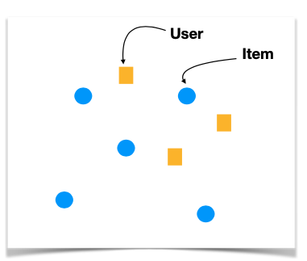

# 13.2. Content-Based Methods

Content-based filtering represents one of the most intuitive and mathematically elegant approaches to recommendation systems. Unlike collaborative filtering methods that rely on user-item interaction patterns, content-based methods leverage the intrinsic properties of items to make personalized recommendations.

**Intuitive Understanding**: Content-based filtering is like having a friend who really knows your taste in movies, books, or restaurants. Instead of asking "What do other people like you enjoy?" (collaborative filtering), this friend analyzes the actual characteristics of things you've liked and finds new items with similar features. If you loved "The Matrix" because it's an action movie with sci-fi elements and a strong female lead, they'll recommend "Terminator 2" because it has those same characteristics. It's like having a personal taste analyzer who understands the building blocks of your preferences.

### Why Content-Based Methods Matter

**Intuition**: Content-based methods are particularly powerful because they work like a sophisticated taste-matching system. They don't just look at what's popular or what similar people like - they understand the fundamental characteristics that make you enjoy certain things. This makes them incredibly useful for discovering new items that match your specific tastes, even if those items aren't popular with the general crowd.

## 13.2.1. Introduction to Content-Based Filtering

### Philosophical Foundation

Content-based filtering is grounded in the principle that **"similar items should be recommended to users who have shown preference for those items."** This approach mirrors how humans naturally make recommendations - by understanding the characteristics of items and matching them to user preferences.

**Intuition**: This principle is like the way a good friend makes recommendations. If you tell them you loved a particular restaurant because it had great Italian food, outdoor seating, and was reasonably priced, they'll naturally think of other restaurants with similar characteristics. They're not just recommending what's popular - they're matching the specific features you value.

### Core Mathematical Principle

The fundamental mathematical principle can be expressed as:

$$ \text{Recommendation}(u, i) = \text{Similarity}(\text{UserProfile}(u), \text{ItemProfile}(i)) $$

where:
- $`\text{UserProfile}(u)`$ represents user $`u`$'s preference vector in the feature space
- $`\text{ItemProfile}(i)`$ represents item $`i`$'s feature vector in the same space
- $`\text{Similarity}(\cdot, \cdot)`$ is a similarity function that measures the alignment between user preferences and item characteristics

**Intuition**: This formula is like a recipe for making perfect matches. It takes two ingredients - your taste profile (what you like) and an item's feature profile (what the item is like) - and measures how well they match. It's like having a compatibility calculator that can tell you how much you'll like something based on its characteristics.

### Feature Space Representation

In content-based filtering, both users and items are represented in a common **feature space** $`\mathcal{F} \subseteq \mathbb{R}^d`$, where $`d`$ is the dimensionality of the feature space. This allows us to:

1. **Vectorize Items**: Each item $`i`$ is represented as a feature vector $`\mathbf{f}_i \in \mathbb{R}^d`$
2. **Vectorize Users**: Each user $`u`$ is represented as a preference vector $`\mathbf{p}_u \in \mathbb{R}^d`$
3. **Compute Similarity**: Measure the similarity between user preferences and item features

**Intuition**: This feature space is like a giant taste map where everything can be compared. Imagine a multi-dimensional space where each dimension represents a different characteristic - one axis might be "spiciness," another "price," another "cuisine type," and so on. Every restaurant and every person has coordinates in this space, making it easy to see who would like what.

### Mathematical Framework

Let $`\mathcal{U}`$ be the set of users and $`\mathcal{I}`$ be the set of items. The content-based recommendation problem can be formalized as:

**Problem Definition**: Given a user $`u \in \mathcal{U}`$, find items $`i \in \mathcal{I}`$ that maximize the similarity function:

$$ i^* = \arg\max_{i \in \mathcal{I}} \text{Similarity}(\mathbf{p}_u, \mathbf{f}_i) $$

**Objective Function**: The recommendation score for user $`u`$ and item $`i`$ is:

$$ s(u, i) = \text{Similarity}(\mathbf{p}_u, \mathbf{f}_i) $$

**Intuition**: This mathematical framework is like having a smart dating app for items. For each user, we look at all available items and calculate a "compatibility score" based on how well their taste profile matches the item's feature profile. The items with the highest compatibility scores get recommended.

### Geometric Interpretation

In the feature space, we can visualize:
- **Items** as points $`\mathbf{f}_i`$ in $`\mathbb{R}^d`$
- **Users** as points $`\mathbf{p}_u`$ in the same space
- **Recommendations** as finding items closest to the user's preference point



This geometric interpretation shows how users and items coexist in the same feature space, enabling direct similarity computations.

**Intuition**: This geometric view is like having a map where you can see exactly where you are (your taste location) and where all the restaurants, movies, or books are located. The closer an item is to your position on the map, the more likely you are to enjoy it. It's like having a GPS for taste preferences.

### Advantages of Content-Based Approach

1. **Cold Start Resilience**: Can recommend new items immediately if features are available
2. **Interpretability**: Clear feature-based reasoning for recommendations
3. **Independence**: Doesn't require other users' interaction data
4. **Transparency**: Users can understand why items are recommended
5. **Scalability**: Computationally efficient for large user bases

**Intuition**: These advantages are like the benefits of having a personal taste expert:
- **Cold Start Resilience**: Like being able to recommend a new restaurant even if no one has tried it yet (as long as you know its features)
- **Interpretability**: Like being able to explain "I recommended this because you like Italian food and outdoor seating"
- **Independence**: Like not needing to know what other people like to make good recommendations
- **Transparency**: Like being able to show exactly why a recommendation was made
- **Scalability**: Like being able to handle millions of users efficiently

### Limitations and Challenges

1. **Feature Dependency**: Requires rich item metadata
2. **Overspecialization**: May create "filter bubbles"
3. **Feature Engineering**: Requires domain expertise
4. **Limited Discovery**: Focuses on similar items rather than diverse recommendations

**Intuition**: These limitations are like the challenges of having a very picky friend:
- **Feature Dependency**: Like needing detailed information about every restaurant to make recommendations
- **Overspecialization**: Like only recommending Italian restaurants when you might also enjoy Thai or Mexican
- **Feature Engineering**: Like needing to understand what makes a good restaurant recommendation
- **Limited Discovery**: Like missing out on great experiences outside your usual preferences

## 13.2.2. Item Profiling

Item profiling is the process of representing items as feature vectors in a high-dimensional space. This is the foundation of content-based filtering, as it enables mathematical operations on item characteristics.

**Intuition**: Item profiling is like creating detailed personality profiles for every item in your catalog. Just as you might describe a person as "outgoing, athletic, loves Italian food, and enjoys outdoor activities," you describe items in terms of their key characteristics. A movie might be "action-packed, sci-fi, has strong female leads, and is 2 hours long."

### Mathematical Framework for Item Profiling

#### Feature Vector Definition

Each item $`i \in \mathcal{I}`$ is represented as a feature vector:

$$ \mathbf{f}_i = [f_{i1}, f_{i2}, \ldots, f_{id}]^T \in \mathbb{R}^d $$

where:
- $`f_{ij}`$ represents the $`j`$-th feature of item $`i`$
- $`d`$ is the dimensionality of the feature space
- $`\mathbf{f}_i`$ is the feature vector for item $`i`$

**Intuition**: This feature vector is like a detailed checklist or profile for each item. Each number in the vector represents how much of a particular characteristic the item has. For example, in a movie feature vector, the first number might represent "action level," the second "romance level," the third "comedy level," and so on.

#### Feature Space Construction

The complete feature space is constructed as:

$$ \mathcal{F} = \{\mathbf{f}_i : i \in \mathcal{I}\} \subseteq \mathbb{R}^d $$

**Intuition**: This feature space is like a giant catalog where every item has been carefully analyzed and given scores on various characteristics. It's like having a massive spreadsheet where each row is an item and each column is a different feature.

### Feature Engineering Techniques

#### 1. Categorical Features (One-Hot Encoding)

For discrete categories like genre, director, or actor, we use one-hot encoding:

$$ f_{ij} = \begin{cases}
1 & \text{if item } i \text{ has category } j \\
0 & \text{otherwise}
\end{cases} $$

**Intuition**: One-hot encoding is like creating a checklist for each item. For genres, you might have columns for "Action," "Drama," "Comedy," "Thriller," etc. A movie gets a 1 in the columns for genres it belongs to and 0 in the others. It's like saying "This movie is Action (yes), Drama (yes), Comedy (no), Thriller (no)."

**Mathematical Properties**:
- Binary representation: $`f_{ij} \in \{0, 1\}`$
- Sparsity: Most features are zero for any given item
- Orthogonality: Categories are mutually exclusive

**Example**: For a movie with genres [Action, Drama, Comedy], if the movie is Action and Drama:
$$ \mathbf{f}_{\text{genre}} = [1, 1, 0]^T $$

**Intuition**: This example shows how a movie that's both action and drama would be represented. It's like filling out a form where you check "Action" and "Drama" but leave "Comedy" unchecked.

#### 2. Numerical Features (Normalization)

For continuous values like release year, rating, or price, we apply normalization:

$$ f_{ij} = \frac{x_{ij} - \mu_j}{\sigma_j} $$

where:
- $`x_{ij}`$ is the raw value of feature $`j`$ for item $`i`$
- $`\mu_j = \frac{1}{|\mathcal{I}|} \sum_{i \in \mathcal{I}} x_{ij}`$ is the mean of feature $`j``
- $`\sigma_j = \sqrt{\frac{1}{|\mathcal{I}|} \sum_{i \in \mathcal{I}} (x_{ij} - \mu_j)^2}`$ is the standard deviation

**Intuition**: Normalization is like converting all measurements to a common scale. Instead of comparing movies from 1920 (very old) to 2020 (very new), you convert them to "how old/new is this compared to the average movie?" It's like saying "This movie is 2 standard deviations newer than average" rather than "This movie is from 2020."

**Alternative Normalization Methods**:

**Min-Max Normalization**:
$$ f_{ij} = \frac{x_{ij} - \min_k x_{kj}}{\max_k x_{kj} - \min_k x_{kj}} $$

**Intuition**: Min-max normalization is like converting everything to a 0-1 scale. The oldest movie gets 0, the newest gets 1, and everything else gets a proportional score in between.

**Robust Normalization** (using median and MAD):
$$ f_{ij} = \frac{x_{ij} - \text{median}_k(x_{kj})}{\text{MAD}_k(x_{kj})} $$

where MAD is the Median Absolute Deviation.

**Intuition**: Robust normalization is like using the median (middle value) instead of the mean, which makes it less sensitive to extreme outliers. It's like saying "How far is this from the typical value?" rather than "How far is this from the average?"

#### 3. Text Features (TF-IDF)

For textual content like descriptions or reviews, we use TF-IDF:

$$ f_{ij} = \text{TF-IDF}(i, j) = \text{TF}(i, j) \times \text{IDF}(j) $$

where:

**Term Frequency (TF)**:
$$ \text{TF}(i, j) = \frac{n_{ij}}{\sum_k n_{ik}} $$

where $`n_{ij}`$ is the count of term $`j`$ in document $`i`$.

**Inverse Document Frequency (IDF)**:
$$ \text{IDF}(j) = \log\left(\frac{|\mathcal{I}|}{|\{i : j \in i\}|}\right) $$

where $`|\{i : j \in i\}|`$ is the number of documents containing term $`j`$.

**Intuition**: TF-IDF is like measuring how important a word is to a particular item. It considers both how often the word appears in the item's description (TF) and how rare that word is across all items (IDF). Common words like "the" or "and" get low scores because they appear everywhere, while unique words like "cyberpunk" or "steampunk" get high scores because they're distinctive.

### Advanced Feature Engineering

#### 1. Feature Interaction Terms

To capture interactions between features:

$$ f_{ij,k} = f_{ij} \times f_{ik} $$

**Intuition**: Feature interactions are like discovering that certain combinations of features are particularly important. Maybe people who like both "action" and "sci-fi" really love movies that have both, more than you'd expect from just adding the individual scores.

#### 2. Polynomial Features

To capture non-linear relationships:

$$ f_{ij}^2, f_{ij}^3, \ldots $$

**Intuition**: Polynomial features are like discovering that some characteristics have exponential effects. Maybe people who really love action movies (high action score) get even more excited about movies with extremely high action scores.

#### 3. Feature Aggregation

For hierarchical features (e.g., genre → subgenre):

$$ f_{i,\text{genre}} = \sum_{s \in \text{subgenres}} w_s \cdot f_{i,s} $$

**Intuition**: Feature aggregation is like combining related characteristics. Instead of having separate scores for "romantic comedy," "slapstick comedy," and "dark comedy," you might combine them into an overall "comedy" score.

### Feature Selection and Dimensionality Reduction

#### 1. Information Gain

$$ \text{IG}(F_j) = H(Y) - H(Y|F_j) $$

where:
- $`H(Y)`$ is the entropy of the target variable
- $`H(Y|F_j)`$ is the conditional entropy given feature $`F_j`$

**Intuition**: Information gain measures how much a feature helps us predict whether someone will like an item. It's like asking "How much does knowing this feature reduce our uncertainty about whether the user will enjoy the item?"

#### 2. Principal Component Analysis (PCA)

$$ \mathbf{f}_i' = \mathbf{W}^T \mathbf{f}_i $$

where $`\mathbf{W}`$ is the projection matrix from PCA.

**Intuition**: PCA is like finding the most important "directions" in your taste space. Instead of having hundreds of specific features, you might discover that most preferences can be explained by just a few key dimensions like "action vs. drama" or "modern vs. classic."

#### 3. Feature Importance

$$ \text{Importance}(F_j) = \frac{1}{|\mathcal{U}|} \sum_{u \in \mathcal{U}} |p_{uj}| $$

**Intuition**: Feature importance measures how much users care about each feature on average. It's like asking "How strongly do people typically feel about this characteristic?"

### Example: Comprehensive Movie Profiling

Consider a movie with the following feature vector:

$$ \mathbf{f}_{\text{movie}} = \begin{bmatrix}
\text{Action} & 1 \\
\text{Drama} & 0 \\
\text{Comedy} & 0 \\
\text{Thriller} & 1 \\
\text{Year\_normalized} & 0.8 \\
\text{Budget\_normalized} & 0.6 \\
\text{Director\_Spielberg} & 1 \\
\text{Actor\_Cruise} & 1 \\
\text{Length\_normalized} & 0.7 \\
\text{TF-IDF\_action} & 0.85 \\
\text{TF-IDF\_adventure} & 0.72 \\
\text{TF-IDF\_thriller} & 0.91
\end{bmatrix} $$

**Intuition**: This feature vector is like a detailed personality profile for the movie. It tells us that this movie is high in action and thriller elements, is relatively recent (0.8 on the year scale), has a moderate budget, was directed by Spielberg, stars Tom Cruise, is moderately long, and has strong action/adventure/thriller themes in its description.

### Feature Quality Metrics

#### 1. Feature Variance

$$ \text{Var}(F_j) = \frac{1}{|\mathcal{I}|} \sum_{i \in \mathcal{I}} (f_{ij} - \bar{f}_j)^2 $$

**Intuition**: Feature variance measures how much items differ on this characteristic. High variance means the feature is useful for distinguishing between items, while low variance means everything is similar on this dimension.

#### 2. Feature Correlation

$$ \text{Corr}(F_j, F_k) = \frac{\sum_{i \in \mathcal{I}} (f_{ij} - \bar{f}_j)(f_{ik} - \bar{f}_k)}{\sqrt{\sum_{i \in \mathcal{I}} (f_{ij} - \bar{f}_j)^2} \sqrt{\sum_{i \in \mathcal{I}} (f_{ik} - \bar{f}_k)^2}} $$

**Intuition**: Feature correlation measures how related two characteristics are. High correlation might mean we can simplify our model by using just one of the features, since they're so similar.

#### 3. Feature Sparsity

$$ \text{Sparsity}(F_j) = \frac{|\{i : f_{ij} = 0\}|}{|\mathcal{I}|} $$

**Intuition**: Feature sparsity measures how rare a characteristic is. Very sparse features (like "movies directed by Christopher Nolan") might be very distinctive but apply to few items.

## 13.2.3. User Profiling

User profiling is the process of constructing preference vectors that represent user tastes in the same feature space as items. This enables direct comparison between user preferences and item characteristics.

**Intuition**: User profiling is like creating a detailed taste fingerprint for each person. Just as items have feature profiles, users have preference profiles that show how much they value each characteristic. If an item profile says "this movie is 80% action," a user profile might say "this person loves action movies 90% of the time."

### Mathematical Framework for User Profiling

#### User Profile Definition

Each user $`u \in \mathcal{U}`$ is represented as a preference vector:

$$ \mathbf{p}_u = [p_{u1}, p_{u2}, \ldots, p_{ud}]^T \in \mathbb{R}^d $$

where $`p_{uj}`$ represents user $`u`$'s preference strength for feature $`j``.

**Intuition**: This preference vector is like a personal taste map. Each number represents how much the user likes that particular characteristic. A high number means they really love that feature, a low number means they don't care for it, and a negative number means they actively dislike it.

#### Profile Space Construction

The complete user profile space is:

$$ \mathcal{P} = \{\mathbf{p}_u : u \in \mathcal{U}\} \subseteq \mathbb{R}^d $$

**Intuition**: This profile space is like a giant social network where each person's location represents their taste preferences. People with similar tastes are close together, while people with very different tastes are far apart.

### User Profile Construction Methods

#### 1. Explicit Profiling (Direct Preference Elicitation)

Users directly specify their preferences through surveys or preference settings:

$$ \mathbf{p}_u = [p_{u1}, p_{u2}, \ldots, p_{ud}]^T $$

where $`p_{uj} \in [0, 1]`$ represents the user's self-reported preference for feature $`j``.

**Intuition**: Explicit profiling is like asking someone to fill out a detailed questionnaire about their tastes. "On a scale of 1-10, how much do you like action movies? How about romantic comedies?" It's direct and clear, but requires effort from the user.

**Mathematical Properties**:
- Direct user input: $`p_{uj} \in [0, 1]`$
- Subjective nature: Based on user self-assessment
- Sparse profiles: Users typically specify only a subset of features

#### 2. Implicit Profiling (Behavior-Based Inference)

Preferences are inferred from user interaction history using weighted aggregation:

$$ \mathbf{p}_u = \frac{\sum_{i \in \mathcal{I}_u} w_{ui} \cdot \mathbf{f}_i}{\sum_{i \in \mathcal{I}_u} w_{ui}} $$

where:
- $`\mathcal{I}_u = \{i : \text{user } u \text{ has interacted with item } i\}`$ is the set of items rated by user $`u`$
- $`w_{ui}`$ is the weight of item $`i`$ for user $`u``
- $`\mathbf{f}_i`$ is the feature vector of item $`i``

**Intuition**: Implicit profiling is like having a smart observer who watches what you actually do and infers your preferences. Instead of asking what you like, they look at what you've rated highly and figure out the common characteristics. It's like saying "You gave 5 stars to movies with lots of action and sci-fi elements, so you probably like action and sci-fi."

**Weighting Strategies**:

**Rating-Based Weighting**:
$$ w_{ui} = r_{ui} - \bar{r}_u $$

where $`r_{ui}`$ is the rating given by user $`u`$ to item $`i`$, and $`\bar{r}_u`$ is the average rating of user $`u``.

**Intuition**: Rating-based weighting is like giving more importance to items you really loved or really hated, and less importance to items you felt neutral about. If you typically give 3-star ratings but gave something 5 stars, that item gets extra weight in determining your preferences.

**Binary Interaction Weighting**:
$$ w_{ui} = \begin{cases}
1 & \text{if user } u \text{ interacted with item } i \\
0 & \text{otherwise}
\end{cases} $$

**Intuition**: Binary weighting is like saying "If you watched it, you must have been interested in it." It's simpler but less nuanced than rating-based weighting.

**Confidence-Based Weighting**:
$$ w_{ui} = \text{confidence}(r_{ui}) \cdot (r_{ui} - \bar{r}_u) $$

where confidence increases with rating extremity.

**Intuition**: Confidence-based weighting is like being more certain about preferences when people have strong reactions. If you give something 1 star or 5 stars, we're more confident about what that tells us about your preferences than if you give it 3 stars.

#### 3. Time-Weighted Profiling (Temporal Dynamics)

Recent interactions are weighted more heavily to capture evolving preferences:

$$ w_{ui} = \exp\left(-\lambda \cdot (t_{\text{current}} - t_{ui})\right) $$

where:
- $`t_{ui}`$ is the timestamp when user $`u`$ interacted with item $`i``
- $`\lambda > 0`$ is the decay parameter (larger values = faster decay)

**Intuition**: Time-weighted profiling is like recognizing that people's tastes change over time. A movie you loved 10 years ago might not reflect your current preferences as much as a movie you loved last month. It's like having a preference system that "forgets" old preferences gradually.

**Alternative Time Decay Functions**:

**Linear Decay**:
$$ w_{ui} = \max(0, 1 - \lambda \cdot (t_{\text{current}} - t_{ui})) $$

**Intuition**: Linear decay is like a straight-line decline in importance over time. After a certain point, old interactions become completely irrelevant.

**Power Law Decay**:
$$ w_{ui} = (t_{\text{current}} - t_{ui} + 1)^{-\lambda} $$

**Intuition**: Power law decay is like a rapid initial decline that then levels off. Recent interactions are much more important than old ones, but very old interactions still have some small influence.

**Logarithmic Decay**:
$$ w_{ui} = \frac{1}{\log(1 + \lambda \cdot (t_{\text{current}} - t_{ui}))} $$

**Intuition**: Logarithmic decay is like a slow, gradual decline. Even very old interactions retain some influence, but recent ones are still more important.

### Advanced User Profiling Techniques

#### 1. Multi-Context Profiling

Different profiles for different contexts (time of day, location, mood):

$$ \mathbf{p}_u^{(c)} = \frac{\sum_{i \in \mathcal{I}_u^{(c)}} w_{ui}^{(c)} \cdot \mathbf{f}_i}{\sum_{i \in \mathcal{I}_u^{(c)}} w_{ui}^{(c)}} $$

where $`c`$ represents the context.

**Intuition**: Multi-context profiling is like having different taste profiles for different situations. Maybe you like serious dramas in the evening but prefer light comedies during lunch breaks. It's like having multiple personalities for different contexts.

#### 2. Hierarchical Profiling

Profiles at different levels of abstraction:

$$ \mathbf{p}_u^{(l)} = \frac{\sum_{i \in \mathcal{I}_u} w_{ui} \cdot \mathbf{f}_i^{(l)}}{\sum_{i \in \mathcal{I}_u} w_{ui}} $$

where $`l`$ represents the level of abstraction.

**Intuition**: Hierarchical profiling is like having both broad and specific taste preferences. At a high level, you might like "action movies," but at a more specific level, you might prefer "sci-fi action movies with strong female leads."

#### 3. Collaborative Profiling

Incorporate information from similar users:

$$ \mathbf{p}_u = \alpha \cdot \mathbf{p}_u^{\text{personal}} + (1-\alpha) \cdot \mathbf{p}_u^{\text{collaborative}} $$

where:
$$ \mathbf{p}_u^{\text{collaborative}} = \frac{\sum_{v \in \mathcal{N}_u} \text{sim}(u, v) \cdot \mathbf{p}_v}{\sum_{v \in \mathcal{N}_u} \text{sim}(u, v)} $$

**Intuition**: Collaborative profiling is like asking your friends for input on your taste profile. "People similar to you tend to like these characteristics, so maybe you do too." It's a way to fill in gaps in your personal profile using collective wisdom.

### Profile Quality Metrics

#### 1. Profile Completeness

$$ \text{Completeness}(u) = \frac{|\{j : p_{uj} \neq 0\}|}{d} $$

**Intuition**: Profile completeness measures how much we know about a user's preferences. A complete profile means we have information about all possible characteristics, while an incomplete profile has gaps in our knowledge.

#### 2. Profile Strength

$$ \text{Strength}(u) = \|\mathbf{p}_u\|_2 = \sqrt{\sum_{j=1}^d p_{uj}^2} $$

**Intuition**: Profile strength measures how strongly the user feels about their preferences. Someone with strong preferences has very clear likes and dislikes, while someone with weak preferences is more neutral about most characteristics.

#### 3. Profile Diversity

$$ \text{Diversity}(u) = \frac{1}{|\mathcal{I}_u|} \sum_{i,j \in \mathcal{I}_u} (1 - \text{sim}(\mathbf{f}_i, \mathbf{f}_j)) $$

**Intuition**: Profile diversity measures how varied a user's tastes are. Someone with diverse preferences likes many different types of items, while someone with narrow preferences sticks to similar items.

#### 4. Profile Stability

$$ \text{Stability}(u) = 1 - \frac{\|\mathbf{p}_u^{(t)} - \mathbf{p}_u^{(t-1)}\|_2}{\|\mathbf{p}_u^{(t-1)}\|_2} $$

**Intuition**: Profile stability measures how much a user's preferences change over time. Stable preferences mean consistent tastes, while unstable preferences indicate changing tastes.

### Profile Normalization and Regularization

#### 1. L2 Normalization

$$ \mathbf{p}_u' = \frac{\mathbf{p}_u}{\|\mathbf{p}_u\|_2} $$

**Intuition**: L2 normalization is like standardizing the "intensity" of preferences. It makes all preference vectors the same length, so we're comparing the direction of preferences rather than their strength.

#### 2. L1 Normalization

$$ \mathbf{p}_u' = \frac{\mathbf{p}_u}{\|\mathbf{p}_u\|_1} $$

**Intuition**: L1 normalization is like converting preferences to percentages. The sum of all preference scores equals 1, so each score represents the proportion of the user's attention devoted to that characteristic.

#### 3. Ridge Regularization

$$ \mathbf{p}_u' = \arg\min_{\mathbf{p}} \left\{\|\mathbf{p} - \mathbf{p}_u\|_2^2 + \lambda \|\mathbf{p}\|_2^2\right\} $$

**Intuition**: Ridge regularization is like adding a "conservative" bias to preference estimates. It prevents extreme preference values and makes the profile more stable and generalizable.

### Example: Comprehensive User Profile Construction

For a user who rated several movies with the following interaction history:

| Movie | Rating | Genre | Year | Director |
|-------|--------|-------|------|----------|
| Movie A | 5 | Action | 2020 | Spielberg |
| Movie B | 3 | Drama | 2018 | Nolan |
| Movie C | 4 | Action | 2021 | Spielberg |
| Movie D | 2 | Comedy | 2019 | Tarantino |

**Step 1: Feature Vector Construction**
$$ \mathbf{f}_A = [1, 0, 0, 0.8, 1, 0, 0]^T \quad \text{(Action, Year\_norm, Director\_Spielberg)} $$

**Step 2: Weighted Aggregation**
$$ \mathbf{p}_u = \frac{(5-3.5)\mathbf{f}_A + (3-3.5)\mathbf{f}_B + (4-3.5)\mathbf{f}_C + (2-3.5)\mathbf{f}_D}{|5-3.5| + |3-3.5| + |4-3.5| + |2-3.5|} $$

**Step 3: Final User Profile**
$$ \mathbf{p}_u = \begin{bmatrix}
\text{Action} & 0.8 \\
\text{Drama} & -0.2 \\
\text{Comedy} & -0.4 \\
\text{Thriller} & 0.0 \\
\text{Year\_normalized} & 0.6 \\
\text{Director\_Spielberg} & 0.9 \\
\text{Director\_Nolan} & -0.1 \\
\text{Director\_Tarantino} & -0.3
\end{bmatrix} $$

This profile indicates the user strongly prefers action movies, newer films, and movies by Spielberg, while disliking comedies and older films.

**Intuition**: This example shows how we can build a detailed taste profile from just a few ratings. The positive numbers indicate characteristics the user likes (action, recent movies, Spielberg), while negative numbers indicate characteristics they dislike (comedy, older movies, Tarantino). The magnitude shows how strongly they feel about each characteristic.

## 13.2.4. Similarity Computation

Similarity computation is the core mathematical operation in content-based filtering. It measures the alignment between user preferences and item characteristics in the shared feature space.

**Intuition**: Similarity computation is like measuring how well two people would get along on a blind date. You have one person's preferences (what they're looking for) and another person's characteristics (what they're like), and you want to calculate a "compatibility score" that predicts how much they'll enjoy each other's company.

### Mathematical Framework for Similarity

#### Similarity Function Definition

A similarity function $`\text{sim}: \mathbb{R}^d \times \mathbb{R}^d \rightarrow [0, 1]`$ maps two vectors to a similarity score, where:
- $`\text{sim}(\mathbf{a}, \mathbf{b}) = 1`$ indicates perfect similarity
- $`\text{sim}(\mathbf{a}, \mathbf{b}) = 0`$ indicates no similarity
- $`\text{sim}(\mathbf{a}, \mathbf{b}) = \text{sim}(\mathbf{b}, \mathbf{a})`$ (symmetry)

**Intuition**: This similarity function is like a compatibility calculator that takes two profiles and returns a score from 0 to 1. A score of 1 means "perfect match," 0 means "complete mismatch," and values in between represent partial compatibility. The symmetry property means that if A is similar to B, then B is similar to A.

#### Geometric Interpretation

In the feature space $`\mathbb{R}^d`$:
- **Similarity** measures how "close" user preferences are to item features
- **Distance** measures how "far apart" they are
- **Angle** measures the directional alignment

**Intuition**: This geometric view is like having a map where you can see exactly where everyone and everything is located. People and items that are close together on the map are similar, while those that are far apart are different. It's like having a "taste GPS" that can tell you how far apart any two things are in preference space.

### Similarity Metrics

#### 1. Cosine Similarity (Most Common)

Cosine similarity measures the cosine of the angle between two vectors:

$$ \text{sim}_{\text{cos}}(\mathbf{p}_u, \mathbf{f}_i) = \cos(\theta) = \frac{\mathbf{p}_u \cdot \mathbf{f}_i}{\|\mathbf{p}_u\|_2 \cdot \|\mathbf{f}_i\|_2} $$

**Intuition**: Cosine similarity is like measuring how much two people are pointing in the same direction. It doesn't matter how strongly they feel about things (the length of their preference vectors), just whether they're oriented in the same direction. Two people who both love action movies and hate romantic comedies would have high cosine similarity, even if one person feels more strongly about it than the other.

**Mathematical Properties**:
- Range: $`[-1, 1]`$ (typically normalized to $`[0, 1]`$)
- Invariant to vector magnitude
- Sensitive to vector direction
- Computationally efficient

**Normalized Cosine Similarity**:
$$ \text{sim}_{\text{cos}}(\mathbf{p}_u, \mathbf{f}_i) = \frac{1 + \cos(\theta)}{2} = \frac{1 + \frac{\mathbf{p}_u \cdot \mathbf{f}_i}{\|\mathbf{p}_u\|_2 \cdot \|\mathbf{f}_i\|_2}}{2} $$

**Intuition**: Normalized cosine similarity converts the range from [-1, 1] to [0, 1], making it easier to interpret. A score of 0.5 means neutral similarity, above 0.5 means positive similarity, and below 0.5 means negative similarity.

#### 2. Euclidean Distance-Based Similarity

Euclidean distance measures the straight-line distance between points:

$$ \text{dist}_{\text{euclidean}}(\mathbf{p}_u, \mathbf{f}_i) = \|\mathbf{p}_u - \mathbf{f}_i\|_2 = \sqrt{\sum_{j=1}^d (p_{uj} - f_{ij})^2} $$

**Intuition**: Euclidean distance is like measuring the actual distance between two points on a map. It considers both the direction and the magnitude of differences. If you love action movies (score 0.9) and a movie is only mildly action-oriented (score 0.3), the euclidean distance would be large, indicating low similarity.

**Converted to Similarity**:
$$ \text{sim}_{\text{euclidean}}(\mathbf{p}_u, \mathbf{f}_i) = \frac{1}{1 + \|\mathbf{p}_u - \mathbf{f}_i\|_2} $$

**Intuition**: This conversion transforms distance into similarity. The closer two points are, the higher the similarity score. The formula ensures that identical points get similarity 1, and very distant points get similarity close to 0.

**Alternative Distance-Based Similarities**:

**Manhattan Distance**:
$$ \text{sim}_{\text{manhattan}}(\mathbf{p}_u, \mathbf{f}_i) = \frac{1}{1 + \|\mathbf{p}_u - \mathbf{f}_i\|_1} $$

**Intuition**: Manhattan distance is like measuring distance by walking along city blocks - you can only go north/south or east/west, not diagonally. It's less sensitive to large differences in individual dimensions and more robust to outliers.

**Chebyshev Distance**:
$$ \text{sim}_{\text{chebyshev}}(\mathbf{p}_u, \mathbf{f}_i) = \frac{1}{1 + \max_{j} |p_{uj} - f_{ij}|} $$

**Intuition**: Chebyshev distance only cares about the biggest difference in any single dimension. It's like saying "if there's one major deal-breaker, that's all that matters." If you hate horror movies and a movie is very horror-oriented, that single difference dominates the similarity calculation.

#### 3. Pearson Correlation

Pearson correlation measures linear correlation between vectors:

$$ \text{sim}_{\text{pearson}}(\mathbf{p}_u, \mathbf{f}_i) = \frac{\sum_{j=1}^d (p_{uj} - \bar{p}_u)(f_{ij} - \bar{f}_i)}{\sqrt{\sum_{j=1}^d (p_{uj} - \bar{p}_u)^2} \sqrt{\sum_{j=1}^d (f_{ij} - \bar{f}_i)^2}} $$

where:
- $`\bar{p}_u = \frac{1}{d} \sum_{j=1}^d p_{uj}`$ is the mean of user preferences
- $`\bar{f}_i = \frac{1}{d} \sum_{j=1}^d f_{ij}`$ is the mean of item features

**Intuition**: Pearson correlation is like measuring whether two people's preferences tend to go up and down together. It's not about absolute values, but about patterns. If you tend to like the same things that are popular (above average) and dislike the same things that are unpopular (below average), you'll have high correlation.

**Properties**:
- Range: $`[-1, 1]`$
- Invariant to linear transformations
- Measures linear relationships

#### 4. Jaccard Similarity (Binary Features)

For binary feature vectors, Jaccard similarity measures set overlap:

$$ \text{sim}_{\text{jaccard}}(\mathbf{p}_u, \mathbf{f}_i) = \frac{|\{j : p_{uj} = 1 \land f_{ij} = 1\}|}{|\{j : p_{uj} = 1 \lor f_{ij} = 1\}|} $$

**Intuition**: Jaccard similarity is like measuring what fraction of your interests overlap with the item's characteristics. If you're interested in 10 genres and the movie belongs to 5 of them, and 3 of those overlap, your Jaccard similarity would be 3/(10+5-3) = 0.25.

**Generalized Jaccard for Continuous Values**:
$$ \text{sim}_{\text{jaccard}}(\mathbf{p}_u, \mathbf{f}_i) = \frac{\sum_{j=1}^d \min(p_{uj}, f_{ij})}{\sum_{j=1}^d \max(p_{uj}, f_{ij})} $$

**Intuition**: Generalized Jaccard extends this concept to continuous values. It measures the overlap between your preferences and the item's features, where overlap means both values are positive and the smaller value represents the degree of overlap.

### Advanced Similarity Metrics

#### 1. Mahalanobis Distance

Accounts for feature correlations:

$$ \text{sim}_{\text{mahalanobis}}(\mathbf{p}_u, \mathbf{f}_i) = \frac{1}{1 + \sqrt{(\mathbf{p}_u - \mathbf{f}_i)^T \mathbf{S}^{-1} (\mathbf{p}_u - \mathbf{f}_i)}} $$

where $`\mathbf{S}`$ is the covariance matrix of features.

**Intuition**: Mahalanobis distance is like having a sophisticated understanding of which differences matter more. If action and sci-fi movies are highly correlated (people who like one tend to like the other), then a difference in just one of these dimensions is less important than a difference in an uncorrelated dimension like "romance."

#### 2. Kernel-Based Similarity

Using kernel functions for non-linear similarity:

**Polynomial Kernel**:
$$ \text{sim}_{\text{poly}}(\mathbf{p}_u, \mathbf{f}_i) = (\mathbf{p}_u \cdot \mathbf{f}_i + c)^d $$

**Intuition**: Polynomial kernels capture non-linear relationships. A quadratic kernel (d=2) might discover that people who like both action AND sci-fi get extra excited about movies that have both, more than you'd expect from just adding the individual scores.

**RBF Kernel**:
$$ \text{sim}_{\text{rbf}}(\mathbf{p}_u, \mathbf{f}_i) = \exp\left(-\gamma \|\mathbf{p}_u - \mathbf{f}_i\|_2^2\right) $$

**Intuition**: RBF (Radial Basis Function) kernel is like having a "similarity bubble" around each point. Points very close together get high similarity, but similarity drops off exponentially as distance increases. It's like saying "close is good, but not close is bad."

#### 3. Weighted Similarity

Feature-weighted similarity:

$$ \text{sim}_{\text{weighted}}(\mathbf{p}_u, \mathbf{f}_i) = \frac{\sum_{j=1}^d w_j \cdot p_{uj} \cdot f_{ij}}{\sqrt{\sum_{j=1}^d w_j \cdot p_{uj}^2} \sqrt{\sum_{j=1}^d w_j \cdot f_{ij}^2}} $$

where $`w_j`$ is the importance weight of feature $`j`$.

**Intuition**: Weighted similarity is like recognizing that some characteristics matter more than others. Maybe genre is twice as important as director, so differences in genre get twice the weight in the similarity calculation.

### Similarity Computation Optimization

#### 1. Vectorization

For efficiency with large datasets:

```python
# Vectorized cosine similarity
def cosine_similarity_vectorized(user_profiles, item_profiles):
    # Normalize vectors
    user_norms = np.linalg.norm(user_profiles, axis=1, keepdims=True)
    item_norms = np.linalg.norm(item_profiles, axis=1, keepdims=True)
    
    # Compute similarity matrix
    similarity_matrix = np.dot(user_profiles, item_profiles.T) / (user_norms * item_norms.T)
    return similarity_matrix
```

**Intuition**: Vectorization is like having a super-efficient calculator that can compute thousands of similarity scores at once, rather than doing them one by one. It's like having a parallel processing system for compatibility calculations.

#### 2. Approximate Similarity

For very large feature spaces:

**Locality-Sensitive Hashing (LSH)**:
$$ h(\mathbf{x}) = \text{sign}(\mathbf{a} \cdot \mathbf{x} + b) $$

where $`\mathbf{a}`$ is a random vector and $`b`$ is a random bias.

**Intuition**: LSH is like having a smart indexing system that groups similar items together. Instead of comparing every user to every item, you only compare users to items in the same "bucket." It's like having a filing system where similar things are stored together.

### Recommendation Score Computation

The final recommendation score combines multiple factors:

$$ \text{Score}(u, i) = \text{sim}(\mathbf{p}_u, \mathbf{f}_i) \times \text{Popularity}(i) \times \text{Novelty}(i) \times \text{Recency}(i) $$

where:

**Popularity Factor**:
$$ \text{Popularity}(i) = \frac{\text{interaction\_count}(i)}{\max_{j \in \mathcal{I}} \text{interaction\_count}(j)} $$

**Intuition**: The popularity factor is like a "social proof" bonus. Even if something matches your tastes perfectly, if it's very popular with others, it might be worth extra consideration. It's like saying "lots of people like this, so it's probably good."

**Novelty Factor**:
$$ \text{Novelty}(i) = \log_2\left(\frac{|\mathcal{I}|}{|\{u : \text{user } u \text{ has interacted with item } i\}|}\right) $$

**Intuition**: The novelty factor rewards discovering hidden gems. Items that few people have tried get a bonus, encouraging exploration beyond the obvious choices. It's like getting extra credit for finding the cool indie restaurant that most people haven't discovered yet.

**Recency Factor**:
$$ \text{Recency}(i) = \exp\left(-\lambda \cdot (t_{\text{current}} - t_i)\right) $$

where $`t_i`$ is the time when item $`i`$ was created.

**Intuition**: The recency factor gives a bonus to newer items. It's like preferring the latest releases over old classics, recognizing that people often want to stay current with what's new and fresh.

### Similarity Thresholds and Filtering

#### 1. Minimum Similarity Threshold

$$ \mathcal{R}_u = \{i \in \mathcal{I} : \text{sim}(\mathbf{p}_u, \mathbf{f}_i) \geq \theta\} $$

where $`\theta`$ is the minimum similarity threshold.

**Intuition**: This threshold is like setting a minimum compatibility standard. You only want to recommend items that meet a certain quality bar, even if it means recommending fewer items overall. It's like saying "I'd rather recommend nothing than recommend something mediocre."

#### 2. Top-K Recommendations

$$ \mathcal{R}_u = \arg\max_{\mathcal{S} \subseteq \mathcal{I}, |\mathcal{S}| = k} \sum_{i \in \mathcal{S}} \text{sim}(\mathbf{p}_u, \mathbf{f}_i) $$

**Intuition**: Top-K recommendations are like picking the best K matches from a dating app. You want the highest-scoring items, regardless of how high or low the scores are. It's like saying "give me the 10 best options, even if none of them are perfect."

### Similarity Quality Metrics

#### 1. Similarity Distribution

$$ \text{Mean Similarity} = \frac{1}{|\mathcal{U}| \cdot |\mathcal{I}|} \sum_{u \in \mathcal{U}} \sum_{i \in \mathcal{I}} \text{sim}(\mathbf{p}_u, \mathbf{f}_i) $$

**Intuition**: Mean similarity tells you how well your similarity function is working on average. If the mean is very low, it might mean your feature space isn't capturing the right characteristics, or your similarity function isn't appropriate for your data.

#### 2. Similarity Variance

$$ \text{Similarity Variance} = \frac{1}{|\mathcal{U}| \cdot |\mathcal{I}|} \sum_{u \in \mathcal{U}} \sum_{i \in \mathcal{I}} (\text{sim}(\mathbf{p}_u, \mathbf{f}_i) - \bar{\text{sim}})^2 $$

**Intuition**: Similarity variance measures how much your similarity scores vary. High variance means the similarity function is good at distinguishing between good and bad matches, while low variance means everything looks similar.

#### 3. Similarity Discrimination

$$ \text{Discrimination} = \frac{\text{sim}_{\text{max}} - \text{sim}_{\text{min}}}{\text{sim}_{\text{max}} + \text{sim}_{\text{min}}} $$

**Intuition**: Discrimination measures how well your similarity function separates the best matches from the worst. High discrimination means you can clearly identify the best recommendations, while low discrimination means everything looks equally good (or bad).

### Example: Similarity Computation

Consider a user profile and item feature vector:

$$ \mathbf{p}_u = [0.8, 0.2, 0.0, 0.6]^T \quad \text{(Action, Drama, Comedy, Thriller)} $$
$$ \mathbf{f}_i = [0.9, 0.1, 0.0, 0.8]^T \quad \text{(Action, Drama, Comedy, Thriller)} $$

**Cosine Similarity**:
$$ \text{sim}_{\text{cos}} = \frac{0.8 \times 0.9 + 0.2 \times 0.1 + 0.0 \times 0.0 + 0.6 \times 0.8}{\sqrt{0.8^2 + 0.2^2 + 0.0^2 + 0.6^2} \sqrt{0.9^2 + 0.1^2 + 0.0^2 + 0.8^2}} = 0.95 $$

**Euclidean Distance**:
$$ \text{dist} = \sqrt{(0.8-0.9)^2 + (0.2-0.1)^2 + (0.0-0.0)^2 + (0.6-0.8)^2} = 0.22 $$
$$ \text{sim}_{\text{euclidean}} = \frac{1}{1 + 0.22} = 0.82 $$

This high similarity (0.95 cosine, 0.82 euclidean) indicates a strong match between user preferences and item characteristics.

**Intuition**: This example shows how different similarity metrics can give different results for the same data. Cosine similarity focuses on the direction of preferences (both like action and thriller, dislike comedy), while euclidean distance also considers the magnitude of differences (the user likes action slightly less than the movie has action). Both indicate a good match, but cosine similarity is more optimistic because it focuses on the pattern rather than the exact values.

## 13.2.5. Implementation

The complete Content-Based Methods implementation is provided in separate code files for both Python and R. These implementations include comprehensive demonstrations of all content-based filtering techniques and evaluation methods.

**Python Implementation**: The complete Content-Based Methods implementation is available in `code/content_based_implementation.py` and includes:
- **`ContentBasedRecommender` class**: Complete implementation with `create_item_profiles()`, `create_user_profiles()`, `recommend()`, and `get_feature_importance()` methods
- **`generate_synthetic_movie_data()`**: Synthetic movie data generation for testing and demonstration
- **`demonstrate_basic_content_based()`**: Basic content-based recommender system functionality demonstration
- **`demonstrate_feature_importance()`**: Feature importance analysis with visualizations for multiple users
- **`demonstrate_similarity_metrics()`**: Comparison of cosine, euclidean, and pearson similarity metrics
- **`demonstrate_profile_visualization()`**: PCA-based visualization of user and item profiles with clustering analysis
- **`demonstrate_advanced_features()`**: Advanced feature engineering including categorical, numerical, and text features
- **`demonstrate_evaluation_metrics()`**: Comprehensive evaluation including precision, recall, and F1-score analysis
- **`demonstrate_cold_start()`**: Cold start handling strategies for new users
- **`demonstrate_scalability()`**: Scalability analysis with different dataset sizes
- **Professional visualizations** with matplotlib and seaborn

**R Implementation**: The complete Content-Based Methods implementation is available in `code/r_content_based_implementation.R` and includes:
- **`content_based_recommender()`**: Main recommender function with configurable similarity metrics
- **`compute_similarity()`**: Similarity computation functions for cosine, euclidean, and pearson metrics
- **`create_item_profiles()`**: Item profile creation with categorical, numerical, and text feature handling
- **`create_user_profiles()`**: User profile creation from ratings and item features
- **`recommend()`**: Recommendation generation for users
- **`get_feature_importance()`**: Feature importance analysis for users
- **`generate_synthetic_movie_data()`**: Synthetic data generation function
- **`demonstrate_basic_content_based()`**: Basic demonstration of content-based filtering
- **`demonstrate_feature_importance()`**: Feature importance analysis with ggplot2 visualizations
- **`demonstrate_similarity_metrics()`**: Similarity metrics comparison
- **`demonstrate_profile_visualization()`**: Profile visualization using PCA and clustering
- **`demonstrate_advanced_features()`**: Advanced feature engineering demonstrations
- **`demonstrate_evaluation_metrics()`**: Evaluation metrics using train-test splits
- **`demonstrate_cold_start()`**: Cold start handling strategies
- **`demonstrate_scalability()`**: Scalability analysis with timing measurements
- **Professional visualizations** with ggplot2 and gridExtra

To run the complete Content-Based Methods demonstrations:

```python
# Python
from code.content_based_implementation import main
results = main()
```

```r
# R
source("code/r_content_based_implementation.R")
results <- main_r()
```

The implementations demonstrate all aspects of content-based filtering including item profiling, user profiling, similarity computation, feature engineering, evaluation metrics, cold start handling, and scalability considerations. Both implementations provide comprehensive analysis tools and professional visualizations to understand the fundamental concepts of content-based recommendation systems.

## 13.2.6. Advanced Content-Based Techniques

### Advanced Feature Engineering

#### 1. Deep Feature Extraction

Using pre-trained neural networks for feature extraction:

$$ \mathbf{f}_i = \text{CNN}(\text{image}_i) \quad \text{or} \quad \mathbf{f}_i = \text{BERT}(\text{text}_i) $$

**Transfer Learning for Features**:
$$ \mathbf{f}_i = \text{ExtractFeatures}(\text{raw\_data}_i, \text{pretrained\_model}) $$

#### 2. Multi-Modal Feature Fusion

Combining different types of features:

$$ \mathbf{f}_i = \alpha \cdot \mathbf{f}_i^{\text{text}} + \beta \cdot \mathbf{f}_i^{\text{image}} + \gamma \cdot \mathbf{f}_i^{\text{metadata}} $$

where $`\alpha + \beta + \gamma = 1`$ are fusion weights.

#### 3. Hierarchical Feature Learning

Learning features at multiple levels:

$$ \mathbf{f}_i^{(l)} = \text{MLP}^{(l)}(\mathbf{f}_i^{(l-1)}) $$

### Advanced Similarity Learning

#### 1. Metric Learning

Learning optimal similarity functions:

$$ \text{sim}(\mathbf{p}_u, \mathbf{f}_i) = (\mathbf{p}_u - \mathbf{f}_i)^T \mathbf{M} (\mathbf{p}_u - \mathbf{f}_i) $$

where $`\mathbf{M}`$ is a learned metric matrix.

#### 2. Deep Similarity Networks

Using neural networks for similarity computation:

$$ \text{sim}(\mathbf{p}_u, \mathbf{f}_i) = \text{NN}_{\text{sim}}([\mathbf{p}_u; \mathbf{f}_i]) $$

#### 3. Attention-Based Similarity

Using attention mechanisms:

$$ \text{sim}(\mathbf{p}_u, \mathbf{f}_i) = \sum_{j=1}^d \alpha_j \cdot p_{uj} \cdot f_{ij} $$

where $`\alpha_j = \text{softmax}(\text{attention}(p_{uj}, f_{ij}))`$.

### Temporal Dynamics

#### 1. Time-Aware User Profiling

$$ \mathbf{p}_u^{(t)} = \alpha \cdot \mathbf{p}_u^{(t-1)} + (1-\alpha) \cdot \mathbf{p}_u^{\text{recent}} $$

#### 2. Seasonal Preferences

$$ \mathbf{p}_u^{(s)} = \mathbf{p}_u^{\text{base}} + \mathbf{p}_u^{\text{seasonal}}(s) $$

where $`s`$ represents the season.

#### 3. Context-Aware Recommendations

$$ \text{Score}(u, i, c) = \text{sim}(\mathbf{p}_u^{(c)}, \mathbf{f}_i) \times \text{context\_weight}(c) $$

where $`c`$ represents the context (time, location, device, etc.).

### Hybrid Approaches

#### 1. Content + Collaborative Fusion

$$ \text{Score}(u, i) = \alpha \cdot \text{sim}_{\text{content}}(\mathbf{p}_u, \mathbf{f}_i) + (1-\alpha) \cdot \text{sim}_{\text{collaborative}}(u, i) $$

#### 2. Content + Popularity

$$ \text{Score}(u, i) = \text{sim}(\mathbf{p}_u, \mathbf{f}_i) \times \text{Popularity}(i)^{\beta} \times \text{Novelty}(i)^{\gamma} $$

#### 3. Ensemble Methods

$$ \text{Score}(u, i) = \sum_{k=1}^K w_k \cdot \text{Score}_k(u, i) $$

where $`w_k`$ are ensemble weights.

### Advanced Optimization Techniques

#### 1. Multi-Objective Optimization

$$ \max_{\mathbf{p}_u} \left\{\text{Accuracy}(\mathbf{p}_u) + \lambda_1 \cdot \text{Diversity}(\mathbf{p}_u) + \lambda_2 \cdot \text{Novelty}(\mathbf{p}_u)\right\} $$

#### 2. Adversarial Training

$$ \min_{\mathbf{p}_u} \max_{\mathbf{f}_i} \text{sim}(\mathbf{p}_u, \mathbf{f}_i) - \lambda \cdot \text{sim}(\mathbf{p}_u, \mathbf{f}_i^{\text{adversarial}}) $$

#### 3. Reinforcement Learning

$$ Q(s, a) = r + \gamma \max_{a'} Q(s', a') $$

where states represent user contexts and actions represent recommendation strategies.

### Scalability Solutions

#### 1. Approximate Nearest Neighbor Search

**Locality-Sensitive Hashing (LSH)**:
$$ h(\mathbf{x}) = \text{sign}(\mathbf{a} \cdot \mathbf{x} + b) $$

**Product Quantization**:
$$ \mathbf{f}_i \approx \sum_{k=1}^K \mathbf{c}_k \cdot \text{quantize}_k(\mathbf{f}_i) $$

#### 2. Dimensionality Reduction

**Principal Component Analysis (PCA)**:
$$ \mathbf{f}_i' = \mathbf{W}^T \mathbf{f}_i $$

**Autoencoders**:
$$ \mathbf{f}_i' = \text{Encoder}(\mathbf{f}_i) $$

#### 3. Distributed Computing

$$ \text{sim}(\mathbf{p}_u, \mathbf{f}_i) = \frac{1}{P} \sum_{p=1}^P \text{sim}_p(\mathbf{p}_u^{(p)}, \mathbf{f}_i^{(p)}) $$

where $`P`$ is the number of partitions.

### Cold Start Solutions

#### 1. Content-Based Cold Start

For new items:
$$ \text{Score}(u, i_{\text{new}}) = \text{sim}(\mathbf{p}_u, \mathbf{f}_{i_{\text{new}}}) $$

For new users:
$$ \mathbf{p}_{u_{\text{new}}} = \frac{1}{|\mathcal{I}_{\text{popular}}|} \sum_{i \in \mathcal{I}_{\text{popular}}} \mathbf{f}_i $$

#### 2. Transfer Learning

$$ \mathbf{p}_u = \text{Transfer}(\mathbf{p}_u^{\text{source}}, \text{domain\_adaptation}) $$

#### 3. Active Learning

$$ \text{Query}(u) = \arg\max_{i} \text{InformationGain}(i | \mathbf{p}_u) $$

### Evaluation Metrics for Advanced Techniques

#### 1. Multi-Objective Metrics

$$ \text{MultiObjectiveScore} = \alpha \cdot \text{Precision} + \beta \cdot \text{Diversity} + \gamma \cdot \text{Novelty} $$

#### 2. Temporal Metrics

$$ \text{TemporalAccuracy} = \frac{1}{T} \sum_{t=1}^T \text{Accuracy}^{(t)} $$

#### 3. Context-Aware Metrics

$$ \text{ContextAccuracy} = \frac{1}{|\mathcal{C}|} \sum_{c \in \mathcal{C}} \text{Accuracy}^{(c)} $$

### Real-World Implementation Considerations

#### 1. Feature Engineering Pipeline

```python
class AdvancedFeatureExtractor:
    def __init__(self):
        self.text_extractor = TfidfVectorizer()
        self.image_extractor = ResNet50()
        self.metadata_encoder = LabelEncoder()
    
    def extract_features(self, item):
        text_features = self.text_extractor.transform([item.text])
        image_features = self.image_extractor.predict(item.image)
        metadata_features = self.metadata_encoder.transform(item.metadata)
        
        return self.fusion_layer([text_features, image_features, metadata_features])
```

#### 2. Scalable Similarity Computation

```python
class ScalableSimilarityComputer:
    def __init__(self, method='lsh'):
        self.method = method
        self.lsh_forest = None
    
    def build_index(self, item_profiles):
        if self.method == 'lsh':
            self.lsh_forest = LSHForest()
            self.lsh_forest.fit(item_profiles)
    
    def find_similar(self, user_profile, k=10):
        if self.method == 'lsh':
            return self.lsh_forest.kneighbors([user_profile], k=k)
        else:
            return self.exact_similarity(user_profile, k)
```

#### 3. Real-Time Recommendation System

```python
class RealTimeRecommender:
    def __init__(self):
        self.user_profiles = {}
        self.item_profiles = {}
        self.similarity_cache = {}
    
    def update_user_profile(self, user_id, new_interaction):
        # Incremental profile update
        old_profile = self.user_profiles.get(user_id, np.zeros(d))
        new_profile = self.compute_incremental_profile(old_profile, new_interaction)
        self.user_profiles[user_id] = new_profile
        
        # Invalidate cache
        self.similarity_cache.pop(user_id, None)
    
    def recommend(self, user_id, k=10):
        if user_id not in self.similarity_cache:
            self.similarity_cache[user_id] = self.compute_similarities(user_id)
        
        return self.similarity_cache[user_id][:k]
```

This comprehensive approach to advanced content-based techniques provides the mathematical foundation and practical implementation strategies needed for modern recommendation systems.

## 13.2.7. Evaluation and Metrics

### Content-Based Specific Metrics

#### 1. Feature Coverage
$$ \text{Coverage} = \frac{|\{i: \text{has\_features}(i)\}|}{|\mathcal{I}|} $$

#### 2. Diversity
$$ \text{Diversity} = \frac{1}{|\mathcal{R}|} \sum_{i,j \in \mathcal{R}} (1 - \text{Similarity}(i, j)) $$

#### 3. Novelty
$$ \text{Novelty} = \frac{1}{|\mathcal{R}|} \sum_{i \in \mathcal{R}} \log_2(\text{Popularity}(i)) $$

### A/B Testing Framework

```python
def evaluate_content_based(recommender, test_users, test_items, ground_truth):
    """Evaluate content-based recommender"""
    precision_scores = []
    recall_scores = []
    
    for user_id in test_users:
        recommendations = recommender.recommend(user_id, n_recommendations=10)
        recommended_items = [item_idx for item_idx, _ in recommendations]
        
        # Get ground truth for this user
        true_items = ground_truth.get(user_id, [])
        
        # Compute precision and recall
        if len(recommended_items) > 0:
            precision = len(set(recommended_items) & set(true_items)) / len(recommended_items)
            precision_scores.append(precision)
        
        if len(true_items) > 0:
            recall = len(set(recommended_items) & set(true_items)) / len(true_items)
            recall_scores.append(recall)
    
    return {
        'precision': np.mean(precision_scores),
        'recall': np.mean(recall_scores),
        'f1_score': 2 * np.mean(precision_scores) * np.mean(recall_scores) / 
                   (np.mean(precision_scores) + np.mean(recall_scores))
    }
```

## 13.2.8. Real-World Applications

### Movie Recommendation System

```python
# Example: MovieLens dataset
from sklearn.datasets import fetch_openml

# Load MovieLens dataset
movies = fetch_openml(name='movielens-100k', as_frame=True)
movies_df = movies.frame

# Feature engineering
movies_df['year'] = movies_df['title'].str.extract(r'\((\d{4})\)').astype(float)
movies_df['title_clean'] = movies_df['title'].str.replace(r'\(\d{4}\)', '').str.strip()

# Create content-based recommender
movie_recommender = ContentBasedRecommender()
feature_columns = ['year', 'rating']
text_columns = ['title_clean']

item_profiles = movie_recommender.create_item_profiles(movies_df, feature_columns, text_columns)
user_profiles = movie_recommender.create_user_profiles(ratings_df, movies_df)

# Generate recommendations
recommendations = movie_recommender.recommend(user_id=1, n_recommendations=10)
```

### Music Recommendation System

```python
# Example: Music features
music_features = {
    'tempo': [120, 140, 90, 160],  # BPM
    'energy': [0.8, 0.6, 0.9, 0.4],  # Energy level
    'valence': [0.7, 0.3, 0.8, 0.2],  # Positivity
    'danceability': [0.9, 0.5, 0.7, 0.3],  # Danceability
    'genre': ['pop', 'rock', 'electronic', 'jazz']
}

# Create music recommender
music_recommender = ContentBasedRecommender()
# ... implementation similar to movie recommender
```

## 13.2.9. Challenges and Solutions

### 1. Feature Engineering Challenges

**Challenge**: Extracting meaningful features from unstructured data
**Solution**: 
- Use pre-trained models for feature extraction
- Apply domain-specific feature engineering
- Leverage transfer learning

### 2. Cold Start Problem

**Challenge**: New items with no interaction history
**Solution**:
- Use item metadata for initial recommendations
- Implement hybrid approaches
- Leverage content similarity

### 3. Scalability Issues

**Challenge**: Computing similarities for large item catalogs
**Solution**:
- Use approximate nearest neighbor search
- Implement locality-sensitive hashing
- Apply dimensionality reduction

### 4. Overspecialization

**Challenge**: Recommendations become too narrow
**Solution**:
- Introduce randomness in recommendations
- Use diversity metrics
- Implement serendipity measures

## 13.2.10. Summary

Content-based filtering is a powerful and intuitive approach to recommendation systems that:

1. **Leverages Item Features**: Uses intrinsic properties of items
2. **Provides Transparency**: Clear reasoning for recommendations
3. **Handles Cold Start**: Works with new items and users
4. **Enables Personalization**: Tailored to individual preferences

### Key Advantages

- **No Cold Start**: Can recommend new items immediately
- **Interpretability**: Clear feature-based explanations
- **Independence**: Doesn't require other users' data
- **Flexibility**: Works with any type of item features

### Key Limitations

- **Feature Dependency**: Requires rich item metadata
- **Overspecialization**: May create filter bubbles
- **Feature Engineering**: Requires domain expertise
- **Limited Discovery**: Focuses on similar items

### Best Practices

1. **Feature Engineering**: Invest in high-quality feature extraction
2. **Similarity Metrics**: Choose appropriate similarity functions
3. **Hybrid Approaches**: Combine with other methods
4. **Evaluation**: Use multiple metrics for comprehensive assessment
5. **Diversity**: Promote variety in recommendations

Content-based filtering remains a fundamental approach in recommendation systems, particularly valuable for domains with rich item metadata and when interpretability is important. When combined with other techniques, it can create powerful hybrid recommendation systems that leverage the strengths of multiple approaches.

---

**Next**: [Collaborative Filtering](03_collaborative_filtering.md) - Discover how user-item interaction patterns drive recommendations through collective intelligence.
