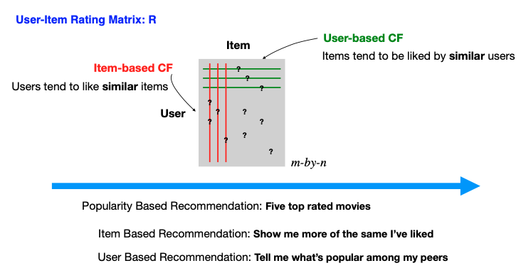

# 13.3. Collaborative Filtering

The collaborative filtering method relies on an interaction matrix between users and items, known as the rating matrix. Imagine this matrix as an m-by-n grid, where rows represent users, columns represent items.

Within this matrix, some entries are known, which could be explicit or implicit feedback. Explicit feedback might be direct ratings, such as a user's rating of a movie on Netflix on a scale from one to five, signaling clear preferences. Implicit feedback could come from user behaviors such as clicking on an item or spending time viewing a particular movie, providing subtle clues about their interests.

Constructing this matrix, however, is far from trivial. Challenges arise in distinguishing between a user's disinterest in an item and mere unawareness of it. Missing entries don't always mean disliking; they could indicate a lack of exposure. This ambiguity is just one of the hurdles in developing effective recommendation systems.

Assuming we have this interaction matrix, denoted by R, with some entries missing (indicated by question marks), the goal of a recommender system is to fill in the blanks, predicting user preferences for items they haven't interacted with. This task is akin to matrix completion, a term you'll often encounter when delving into the mechanics of recommendation systems.



## 13.3.1. Introduction to Collaborative Filtering

Collaborative filtering (CF) is a recommendation approach that leverages the collective behavior of users to make predictions. Unlike content-based methods that focus on item features, CF relies on user-item interaction patterns to discover similarities and make recommendations.

### Core Principle

The fundamental idea is: **"Users who have similar tastes in the past will have similar tastes in the future."** This principle applies to both user-based and item-based approaches.

### Conceptual Foundation

At its heart, collaborative filtering operates on the principle of **collective intelligence** - the idea that the wisdom of the crowd can be harnessed to make better predictions than individual judgments. This approach is based on several key assumptions:

1. **Similarity Assumption**: Users with similar preferences will rate items similarly
2. **Consistency Assumption**: User preferences remain relatively stable over time
3. **Transitivity Assumption**: If user A is similar to user B, and user B is similar to user C, then A and C likely share some similarities

### Mathematical Foundation

The rating matrix $`R`$ is defined as:

```math
R = \begin{bmatrix}
r_{11} & r_{12} & \cdots & r_{1n} \\
r_{21} & r_{22} & \cdots & r_{2n} \\
\vdots & \vdots & \ddots & \vdots \\
r_{m1} & r_{m2} & \cdots & r_{mn}
\end{bmatrix}
```

where:
- $`r_{ui}`$ represents the rating of user $`u`$ for item $`i`$
- Missing entries are denoted by $`?`$ or $`\text{NaN}`$
- $`m`$ is the number of users
- $`n`$ is the number of items

### Mathematical Intuition

The collaborative filtering problem can be viewed as a **matrix completion problem**. Given a partially observed matrix $`R`$, we want to estimate the missing entries $`r_{ui}`$ for user-item pairs where no rating exists.

**Formal Problem Statement**:
Given a rating matrix $`R \in \mathbb{R}^{m \times n}`$ with observed entries $`\Omega = \{(u,i): r_{ui} \text{ is observed}\}`$, predict the missing entries $`r_{ui}`$ for $`(u,i) \notin \Omega`$.

### Types of Feedback

#### 1. Explicit Feedback
Direct user ratings on a predefined scale:

```math
r_{ui} \in \{1, 2, 3, 4, 5\} \quad \text{or} \quad r_{ui} \in [0, 1]
```

**Properties**:
- Clear interpretation of user preferences
- Direct signal of user satisfaction
- Often sparse due to user effort required

#### 2. Implicit Feedback
Indirect signals from user behavior:

```math
r_{ui} = \begin{cases}
1 & \text{if user } u \text{ interacted with item } i \\
0 & \text{otherwise}
\end{cases}
```

**Properties**:
- Abundant data (easier to collect)
- Less clear preference interpretation
- Often binary or count-based

### Types of Feedback

#### 1. Explicit Feedback
Direct user ratings on a predefined scale:

```math
r_{ui} \in \{1, 2, 3, 4, 5\} \quad \text{or} \quad r_{ui} \in [0, 1]
```

#### 2. Implicit Feedback
Indirect signals from user behavior:

```math
r_{ui} = \begin{cases}
1 & \text{if user } u \text{ interacted with item } i \\
0 & \text{otherwise}
\end{cases}
```

## 13.3.2. User-Based Collaborative Filtering

### Core Concept

User-based CF assumes that similar users will have similar preferences. The prediction for user $`u`$ on item $`i`$ is computed as:

```math
\hat{r}_{ui} = \frac{\sum_{v \in N(u)} \text{sim}(u, v) \cdot r_{vi}}{\sum_{v \in N(u)} |\text{sim}(u, v)|}
```

where:
- $`N(u)`$ is the neighborhood of users similar to user $`u`$
- $`\text{sim}(u, v)`$ is the similarity between users $`u`$ and $`v`$
- $`r_{vi}`$ is the rating of user $`v`$ for item $`i`$

### Mathematical Derivation

The user-based prediction formula can be derived from a **weighted average** perspective. Let's break down the intuition:

1. **Similarity as Weight**: The similarity $`\text{sim}(u, v)`$ serves as a weight indicating how much we should trust user $`v`$'s rating for predicting user $`u`$'s preference.

2. **Normalization**: The denominator $`\sum_{v \in N(u)} |\text{sim}(u, v)|`$ ensures the weights sum to 1, making it a proper weighted average.

3. **Neighborhood Selection**: $`N(u)`$ represents the set of users most similar to user $`u`$, typically the top-$`k`$ most similar users.

**Alternative Formulation with Mean Centering**:
```math
\hat{r}_{ui} = \bar{r}_u + \frac{\sum_{v \in N(u)} \text{sim}(u, v) \cdot (r_{vi} - \bar{r}_v)}{\sum_{v \in N(u)} |\text{sim}(u, v)|}
```

This formulation accounts for different rating scales among users by centering around user means.

### Algorithm Steps

1. **Find Similar Users**: Compute similarity between target user and all other users
2. **Select Neighborhood**: Choose top-$`k`$ most similar users
3. **Generate Prediction**: Weighted average of neighbors' ratings

### Computational Complexity Analysis

**Time Complexity**: $`O(n \cdot m + k \cdot \log(n))`$
- $`O(n \cdot m)`$: Computing similarities between all user pairs
- $`O(k \cdot \log(n))`$: Finding top-$`k`$ similar users

**Space Complexity**: $`O(n^2)`$ for storing the user similarity matrix

### Example with Step-by-Step Calculation

Consider users with the following ratings:

```math
R = \begin{bmatrix}
\text{User}_1 & 5 & 3 & 4 & ? & 1 \\
\text{User}_2 & 3 & 1 & 2 & 3 & 3 \\
\text{User}_3 & 4 & 3 & 4 & 3 & 5 \\
\text{User}_4 & 3 & 3 & 1 & 5 & 4 \\
\text{User}_5 & 1 & 5 & 5 & 2 & 1
\end{bmatrix}
```

To predict $`r_{14}`$ (User 1's rating for Item 4):

**Step 1: Compute User Similarities**
Using cosine similarity on the first 3 items (where User 1 has ratings):
- $`\text{sim}(1, 2) = \frac{5 \cdot 3 + 3 \cdot 1 + 4 \cdot 2}{\sqrt{5^2 + 3^2 + 4^2} \cdot \sqrt{3^2 + 1^2 + 2^2}} = \frac{15 + 3 + 8}{\sqrt{50} \cdot \sqrt{14}} \approx 0.85`$
- $`\text{sim}(1, 3) = \frac{5 \cdot 4 + 3 \cdot 3 + 4 \cdot 4}{\sqrt{50} \cdot \sqrt{41}} \approx 0.95`$
- $`\text{sim}(1, 4) = \frac{5 \cdot 3 + 3 \cdot 3 + 4 \cdot 1}{\sqrt{50} \cdot \sqrt{19}} \approx 0.65`$
- $`\text{sim}(1, 5) = \frac{5 \cdot 1 + 3 \cdot 5 + 4 \cdot 5}{\sqrt{50} \cdot \sqrt{51}} \approx 0.45`$

**Step 2: Select Top-2 Similar Users**
- User 3 (similarity: 0.95)
- User 2 (similarity: 0.85)

**Step 3: Predict Rating**
```math
\hat{r}_{14} = \frac{0.95 \cdot 3 + 0.85 \cdot 3}{0.95 + 0.85} = \frac{2.85 + 2.55}{1.8} = 3.0
```

### Advantages and Limitations

**Advantages**:
- Intuitive and interpretable
- No training required
- Can capture complex user preferences

**Limitations**:
- Computationally expensive for large user bases
- Sensitive to user similarity calculation
- Cold start problem for new users

### Example

Consider users with the following ratings:

```math
R = \begin{bmatrix}
\text{User}_1 & 5 & 3 & 4 & ? & 1 \\
\text{User}_2 & 3 & 1 & 2 & 3 & 3 \\
\text{User}_3 & 4 & 3 & 4 & 3 & 5 \\
\text{User}_4 & 3 & 3 & 1 & 5 & 4 \\
\text{User}_5 & 1 & 5 & 5 & 2 & 1
\end{bmatrix}
```

To predict $`r_{14}`$ (User 1's rating for Item 4):

1. Compute similarities between User 1 and others
2. Select most similar users (e.g., User 3 and User 4)
3. Predict: $`\hat{r}_{14} = \frac{\text{sim}(1,3) \cdot 3 + \text{sim}(1,4) \cdot 5}{\text{sim}(1,3) + \text{sim}(1,4)}`$

## 13.3.3. Item-Based Collaborative Filtering

### Core Concept

Item-based CF assumes that users will like items similar to those they have already rated. The prediction is computed as:

```math
\hat{r}_{ui} = \frac{\sum_{j \in N(i)} \text{sim}(i, j) \cdot r_{uj}}{\sum_{j \in N(i)} |\text{sim}(i, j)|}
```

where:
- $`N(i)`$ is the neighborhood of items similar to item $`i`$
- $`\text{sim}(i, j)`$ is the similarity between items $`i`$ and $`j`$
- $`r_{uj}`$ is the rating of user $`u`$ for item $`j`$

### Algorithm Steps

1. **Compute Item Similarities**: Calculate similarity between all item pairs
2. **Select Neighborhood**: Choose top-$`k`$ most similar items for each item
3. **Generate Prediction**: Weighted average of user's ratings for similar items

### Advantages over User-Based CF

- **Stability**: Item similarities change less frequently than user similarities
- **Scalability**: Fewer items than users in most domains
- **Performance**: Pre-computed item similarities can be cached

## 13.3.4. Similarity Metrics

### 1. Jaccard Similarity

Ideal for binary data, comparing sets of interactions:

```math
\text{Jaccard}(A, B) = \frac{|A \cap B|}{|A \cup B|}
```

where $`A`$ and $`B`$ are sets of items (for user similarity) or users (for item similarity).

**Mathematical Properties**:
- Range: $`[0, 1]`$ (0 = no overlap, 1 = identical sets)
- Symmetric: $`\text{Jaccard}(A, B) = \text{Jaccard}(B, A)`$
- Triangle inequality does not hold
- Sensitive to set size differences

**Intuition**: Measures the proportion of shared items relative to all items rated by either user.

### 2. Cosine Similarity

Measures the cosine of the angle between two vectors:

```math
\text{Cosine}(u, v) = \frac{\mathbf{r}_u \cdot \mathbf{r}_v}{\|\mathbf{r}_u\| \cdot \|\mathbf{r}_v\|}
```

where $`\mathbf{r}_u`$ and $`\mathbf{r}_v`$ are rating vectors for users $`u`$ and $`v`$.

**Mathematical Derivation**:
The cosine similarity can be derived from the dot product formula:
```math
\mathbf{a} \cdot \mathbf{b} = \|\mathbf{a}\| \cdot \|\mathbf{b}\| \cdot \cos(\theta)
```

Rearranging:
```math
\cos(\theta) = \frac{\mathbf{a} \cdot \mathbf{b}}{\|\mathbf{a}\| \cdot \|\mathbf{b}\|}
```

**Geometric Interpretation**:
- $`\cos(0°) = 1`$: Vectors point in same direction (perfect similarity)
- $`\cos(90°) = 0`$: Vectors are orthogonal (no similarity)
- $`\cos(180°) = -1`$: Vectors point in opposite directions (perfect dissimilarity)

**Key Issues and Solutions**:
- **Range**: $`[-1, 1]`$ → Convert to $`[0, 1]`$ using $`\frac{1 + \cos}{2}`$
- **Missing values**: Treat as 0 or ignore
- **Vector length variation**: Depends on shared rated items
- **Scale sensitivity**: Affected by rating scale differences

### 3. Centered Cosine Similarity (Pearson Correlation)

Normalizes around user/item means to remove bias:

```math
\text{Pearson}(u, v) = \frac{(\mathbf{r}_u - \bar{\mathbf{r}}_u)^T (\mathbf{r}_v - \bar{\mathbf{r}}_v)}{\|\mathbf{r}_u - \bar{\mathbf{r}}_u\| \cdot \|\mathbf{r}_v - \bar{\mathbf{r}}_v\|}
```

where $`\bar{\mathbf{r}}_u`$ is the mean rating of user $`u`$.

**Mathematical Motivation**:
The Pearson correlation addresses the **rating scale problem** where different users may use different rating scales:
- User A: rates everything 1-3 (mean = 2)
- User B: rates everything 3-5 (mean = 4)

By centering around user means, we focus on **relative preferences** rather than absolute ratings.

**Step-by-Step Calculation**:
1. **Center the data**: $`r'_{ui} = r_{ui} - \bar{r}_u`$
2. **Compute cosine similarity** on centered data
3. **Result**: Measures correlation of rating patterns

**Properties**:
- Range: $`[-1, 1]`$
- Invariant to linear transformations
- Handles different rating scales
- More robust than raw cosine similarity

**Implementation Approaches**:

1. **Pairwise Complete**: Compute centering only on shared items
```math
\bar{r}_u^{(i,j)} = \frac{1}{|\mathcal{I}_{uv}|} \sum_{k \in \mathcal{I}_{uv}} r_{uk}
```
   where $`\mathcal{I}_{uv}`$ is the set of items rated by both users $`u`$ and $`v`$.

2. **Global Centering**: Center each user/item globally, then compute cosine
   ```math
   \bar{r}_u = \frac{1}{|\mathcal{I}_u|} \sum_{i \in \mathcal{I}_u} r_{ui}
   ```

### 4. Adjusted Cosine Similarity

For item-based CF, center by user means:

```math
\text{AdjustedCosine}(i, j) = \frac{\sum_{u \in U_{ij}} (r_{ui} - \bar{r}_u)(r_{uj} - \bar{r}_u)}{\sqrt{\sum_{u \in U_{ij}} (r_{ui} - \bar{r}_u)^2} \sqrt{\sum_{u \in U_{ij}} (r_{uj} - \bar{r}_u)^2}}
```

where $`U_{ij}`$ is the set of users who rated both items $`i`$ and $`j`$.

**Why Center by User Means for Item Similarity?**
- Different users have different rating scales
- User A might rate everything 1-3, User B might rate everything 3-5
- By centering around user means, we focus on **relative item preferences**
- This makes item similarities more meaningful

**Mathematical Intuition**:
The adjusted cosine similarity measures how similarly two items are rated **relative to each user's average rating**, rather than in absolute terms.

### 5. Spearman Rank Correlation

Measures correlation between ranked preferences:

```math
\text{Spearman}(u, v) = 1 - \frac{6 \sum_{i=1}^n d_i^2}{n(n^2-1)}
```

where $`d_i`$ is the difference in ranks for item $`i`$ between users $`u`$ and $`v`$.

**Advantages**:
- Robust to outliers
- Invariant to monotonic transformations
- Focuses on ranking rather than absolute values

### Similarity Metric Selection Guidelines

| Metric | Best For | Pros | Cons |
|--------|----------|------|------|
| **Jaccard** | Binary data, sparse matrices | Simple, interpretable | Ignores rating values |
| **Cosine** | Dense matrices, similar scales | Geometric interpretation | Sensitive to scale differences |
| **Pearson** | Different rating scales | Handles scale differences | Requires sufficient overlap |
| **Adjusted Cosine** | Item similarity | Accounts for user biases | More complex computation |
| **Spearman** | Ordinal data, outliers | Robust to outliers | Loses magnitude information |

### 3. Centered Cosine Similarity (Pearson Correlation)

Normalizes around user/item means to remove bias:

```math
\text{Pearson}(u, v) = \frac{(\mathbf{r}_u - \bar{\mathbf{r}}_u)^T (\mathbf{r}_v - \bar{\mathbf{r}}_v)}{\|\mathbf{r}_u - \bar{\mathbf{r}}_u\| \cdot \|\mathbf{r}_v - \bar{\mathbf{r}}_v\|}
```

where $`\bar{\mathbf{r}}_u`$ is the mean rating of user $`u`$.

**Implementation Approaches**:

1. **Pairwise Complete**: Compute centering only on shared items
2. **Global Centering**: Center each user/item globally, then compute cosine

### 4. Adjusted Cosine Similarity

For item-based CF, center by user means:

```math
\text{AdjustedCosine}(i, j) = \frac{\sum_{u \in U_{ij}} (r_{ui} - \bar{r}_u)(r_{uj} - \bar{r}_u)}{\sqrt{\sum_{u \in U_{ij}} (r_{ui} - \bar{r}_u)^2} \sqrt{\sum_{u \in U_{ij}} (r_{uj} - \bar{r}_u)^2}}
```

where $`U_{ij}`$ is the set of users who rated both items $`i`$ and $`j`$.

## 13.3.5. Implementation

### Python Implementation: Collaborative Filtering

```python
import numpy as np
import pandas as pd
import matplotlib.pyplot as plt
import seaborn as sns
from sklearn.metrics.pairwise import cosine_similarity
from scipy.spatial.distance import pdist, squareform
from scipy.stats import pearsonr
import warnings
warnings.filterwarnings('ignore')

class CollaborativeFiltering:
    def __init__(self, method='user', similarity_metric='cosine', k_neighbors=10):
        """
        Collaborative Filtering Recommender
        
        Parameters:
        -----------
        method : str
            'user' for user-based CF, 'item' for item-based CF
        similarity_metric : str
            'cosine', 'pearson', 'jaccard', 'adjusted_cosine'
        k_neighbors : int
            Number of neighbors to consider
        """
        self.method = method
        self.similarity_metric = similarity_metric
        self.k_neighbors = k_neighbors
        self.rating_matrix = None
        self.user_similarity = None
        self.item_similarity = None
        self.user_means = None
        self.item_means = None
        
    def fit(self, ratings_df, user_col='user_id', item_col='item_id', rating_col='rating'):
        """Fit the collaborative filtering model"""
        # Create rating matrix
        self.rating_matrix = ratings_df.pivot_table(
            index=user_col, 
            columns=item_col, 
            values=rating_col, 
            fill_value=np.nan
        )
        
        # Compute means
        self.user_means = self.rating_matrix.mean(axis=1)
        self.item_means = self.rating_matrix.mean(axis=0)
        
        # Compute similarities
        if self.method == 'user':
            self.user_similarity = self._compute_user_similarity()
        else:
            self.item_similarity = self._compute_item_similarity()
            
        return self
    
    def _compute_user_similarity(self):
        """Compute user similarity matrix"""
        if self.similarity_metric == 'cosine':
            # Fill NaN with 0 for cosine similarity
            matrix_filled = self.rating_matrix.fillna(0)
            return cosine_similarity(matrix_filled)
        
        elif self.similarity_metric == 'pearson':
            # Compute Pearson correlation for each user pair
            n_users = len(self.rating_matrix)
            similarity_matrix = np.zeros((n_users, n_users))
            
            for i in range(n_users):
                for j in range(i+1, n_users):
                    # Get common rated items
                    user_i_ratings = self.rating_matrix.iloc[i]
                    user_j_ratings = self.rating_matrix.iloc[j]
                    
                    common_items = ~(user_i_ratings.isna() | user_j_ratings.isna())
                    
                    if common_items.sum() > 1:
                        corr, _ = pearsonr(
                            user_i_ratings[common_items], 
                            user_j_ratings[common_items]
                        )
                        similarity_matrix[i, j] = corr
                        similarity_matrix[j, i] = corr
                    else:
                        similarity_matrix[i, j] = 0
                        similarity_matrix[j, i] = 0
            
            return similarity_matrix
        
        elif self.similarity_metric == 'jaccard':
            # Convert to binary (rated/not rated)
            binary_matrix = ~self.rating_matrix.isna()
            return cosine_similarity(binary_matrix)
    
    def _compute_item_similarity(self):
        """Compute item similarity matrix"""
        if self.similarity_metric == 'cosine':
            # Fill NaN with 0 for cosine similarity
            matrix_filled = self.rating_matrix.fillna(0)
            return cosine_similarity(matrix_filled.T)
        
        elif self.similarity_metric == 'adjusted_cosine':
            # Center by user means
            centered_matrix = self.rating_matrix.sub(self.user_means, axis=0)
            # Fill NaN with 0
            centered_matrix = centered_matrix.fillna(0)
            return cosine_similarity(centered_matrix.T)
        
        elif self.similarity_metric == 'pearson':
            # Compute Pearson correlation for each item pair
            n_items = len(self.rating_matrix.columns)
            similarity_matrix = np.zeros((n_items, n_items))
            
            for i in range(n_items):
                for j in range(i+1, n_items):
                    # Get common users
                    item_i_ratings = self.rating_matrix.iloc[:, i]
                    item_j_ratings = self.rating_matrix.iloc[:, j]
                    
                    common_users = ~(item_i_ratings.isna() | item_j_ratings.isna())
                    
                    if common_users.sum() > 1:
                        corr, _ = pearsonr(
                            item_i_ratings[common_users], 
                            item_j_ratings[common_users]
                        )
                        similarity_matrix[i, j] = corr
                        similarity_matrix[j, i] = corr
                    else:
                        similarity_matrix[i, j] = 0
                        similarity_matrix[j, i] = 0
            
            return similarity_matrix
    
    def predict(self, user_id, item_id):
        """Predict rating for user-item pair"""
        if self.method == 'user':
            return self._predict_user_based(user_id, item_id)
        else:
            return self._predict_item_based(user_id, item_id)
    
    def _predict_user_based(self, user_id, item_id):
        """User-based prediction"""
        if user_id not in self.rating_matrix.index or item_id not in self.rating_matrix.columns:
            return self.user_means.mean()
        
        user_idx = self.rating_matrix.index.get_loc(user_id)
        item_idx = self.rating_matrix.columns.get_loc(item_id)
        
        # Get user similarities
        user_similarities = self.user_similarity[user_idx]
        
        # Find users who rated this item
        item_ratings = self.rating_matrix.iloc[:, item_idx]
        rated_users = ~item_ratings.isna()
        
        if not rated_users.any():
            return self.user_means.mean()
        
        # Get similarities and ratings for users who rated this item
        similarities = user_similarities[rated_users]
        ratings = item_ratings[rated_users]
        
        # Sort by similarity and take top-k
        sorted_indices = np.argsort(similarities)[::-1][:self.k_neighbors]
        
        if len(sorted_indices) == 0:
            return self.user_means.mean()
        
        top_similarities = similarities.iloc[sorted_indices]
        top_ratings = ratings.iloc[sorted_indices]
        
        # Weighted average
        weighted_sum = np.sum(top_similarities * top_ratings)
        total_similarity = np.sum(np.abs(top_similarities))
        
        if total_similarity == 0:
            return top_ratings.mean()
        
        return weighted_sum / total_similarity
    
    def _predict_item_based(self, user_id, item_id):
        """Item-based prediction"""
        if user_id not in self.rating_matrix.index or item_id not in self.rating_matrix.columns:
            return self.item_means.mean()
        
        user_idx = self.rating_matrix.index.get_loc(user_id)
        item_idx = self.rating_matrix.columns.get_loc(item_id)
        
        # Get item similarities
        item_similarities = self.item_similarity[item_idx]
        
        # Find items rated by this user
        user_ratings = self.rating_matrix.iloc[user_idx]
        rated_items = ~user_ratings.isna()
        
        if not rated_items.any():
            return self.item_means.mean()
        
        # Get similarities and ratings for items rated by this user
        similarities = item_similarities[rated_items]
        ratings = user_ratings[rated_items]
        
        # Sort by similarity and take top-k
        sorted_indices = np.argsort(similarities)[::-1][:self.k_neighbors]
        
        if len(sorted_indices) == 0:
            return self.item_means.mean()
        
        top_similarities = similarities.iloc[sorted_indices]
        top_ratings = ratings.iloc[sorted_indices]
        
        # Weighted average
        weighted_sum = np.sum(top_similarities * top_ratings)
        total_similarity = np.sum(np.abs(top_similarities))
        
        if total_similarity == 0:
            return top_ratings.mean()
        
        return weighted_sum / total_similarity
    
    def recommend(self, user_id, n_recommendations=5):
        """Generate top-n recommendations for a user"""
        if user_id not in self.rating_matrix.index:
            return []
        
        user_ratings = self.rating_matrix.loc[user_id]
        unrated_items = user_ratings.isna()
        
        if not unrated_items.any():
            return []
        
        # Predict ratings for unrated items
        predictions = []
        for item_id in user_ratings[unrated_items].index:
            pred_rating = self.predict(user_id, item_id)
            predictions.append((item_id, pred_rating))
        
        # Sort by predicted rating
        predictions.sort(key=lambda x: x[1], reverse=True)
        return predictions[:n_recommendations]
    
    def get_similar_users(self, user_id, n_similar=5):
        """Get most similar users"""
        if user_id not in self.rating_matrix.index:
            return []
        
        user_idx = self.rating_matrix.index.get_loc(user_id)
        similarities = self.user_similarity[user_idx]
        
        # Sort by similarity
        sorted_indices = np.argsort(similarities)[::-1][1:n_similar+1]  # Exclude self
        similar_users = []
        
        for idx in sorted_indices:
            user_id_similar = self.rating_matrix.index[idx]
            similarity = similarities[idx]
            similar_users.append((user_id_similar, similarity))
        
        return similar_users
    
    def get_similar_items(self, item_id, n_similar=5):
        """Get most similar items"""
        if item_id not in self.rating_matrix.columns:
            return []
        
        item_idx = self.rating_matrix.columns.get_loc(item_id)
        similarities = self.item_similarity[item_idx]
        
        # Sort by similarity
        sorted_indices = np.argsort(similarities)[::-1][1:n_similar+1]  # Exclude self
        similar_items = []
        
        for idx in sorted_indices:
            item_id_similar = self.rating_matrix.columns[idx]
            similarity = similarities[idx]
            similar_items.append((item_id_similar, similarity))
        
        return similar_items

# Generate synthetic data
np.random.seed(42)
n_users = 100
n_items = 50
n_ratings = 1000

# Create synthetic ratings with some structure
ratings_data = []
for user_id in range(n_users):
    n_user_ratings = np.random.randint(5, 20)
    rated_items = np.random.choice(n_items, n_user_ratings, replace=False)
    
    for item_id in rated_items:
        # Simulate user preferences (some users prefer certain item ranges)
        if user_id < 30:  # First group prefers items 0-15
            base_rating = 4 if item_id < 15 else 2
        elif user_id < 60:  # Second group prefers items 15-30
            base_rating = 4 if 15 <= item_id < 30 else 2
        else:  # Third group prefers items 30+
            base_rating = 4 if item_id >= 30 else 2
        
        # Add noise
        rating = max(1, min(5, base_rating + np.random.normal(0, 0.5)))
        ratings_data.append({
            'user_id': user_id,
            'item_id': item_id,
            'rating': rating
        })

ratings_df = pd.DataFrame(ratings_data)

print("Synthetic Ratings Dataset:")
print(f"Number of users: {n_users}")
print(f"Number of items: {n_items}")
print(f"Number of ratings: {len(ratings_df)}")
print(f"Sparsity: {1 - len(ratings_df) / (n_users * n_items):.3f}")

# Test different collaborative filtering approaches
methods = ['user', 'item']
similarity_metrics = ['cosine', 'pearson']
results = {}

for method in methods:
    for metric in similarity_metrics:
        print(f"\n=== Testing {method.upper()}-based CF with {metric.upper()} similarity ===")
        
        # Initialize and fit model
        cf_model = CollaborativeFiltering(method=method, similarity_metric=metric, k_neighbors=10)
        cf_model.fit(ratings_df)
        
        # Test predictions for a sample user
        test_user = 0
        recommendations = cf_model.recommend(test_user, n_recommendations=5)
        
        print(f"Top 5 recommendations for User {test_user}:")
        for i, (item_id, pred_rating) in enumerate(recommendations):
            print(f"  {i+1}. Item {item_id}: Predicted rating = {pred_rating:.3f}")
        
        # Get similar users/items
        if method == 'user':
            similar_entities = cf_model.get_similar_users(test_user, n_similar=3)
            print(f"Most similar users to User {test_user}:")
        else:
            test_item = 0
            similar_entities = cf_model.get_similar_items(test_item, n_similar=3)
            print(f"Most similar items to Item {test_item}:")
        
        for entity_id, similarity in similar_entities:
            print(f"  {entity_id}: Similarity = {similarity:.3f}")
        
        # Store results for comparison
        results[f"{method}_{metric}"] = {
            'recommendations': recommendations,
            'similar_entities': similar_entities
        }

# Visualization
plt.figure(figsize=(15, 10))

# Plot 1: Rating matrix heatmap (sample)
plt.subplot(2, 3, 1)
sample_matrix = ratings_df.pivot_table(
    index='user_id', columns='item_id', values='rating', fill_value=np.nan
).iloc[:20, :20]
sns.heatmap(sample_matrix, cmap='viridis', cbar_kws={'label': 'Rating'})
plt.title('Rating Matrix (Sample)')
plt.xlabel('Item ID')
plt.ylabel('User ID')

# Plot 2: User similarity matrix (sample)
plt.subplot(2, 3, 2)
user_cf = CollaborativeFiltering(method='user', similarity_metric='cosine')
user_cf.fit(ratings_df)
sample_user_sim = user_cf.user_similarity[:20, :20]
sns.heatmap(sample_user_sim, cmap='coolwarm', center=0, cbar_kws={'label': 'Similarity'})
plt.title('User Similarity Matrix (Sample)')
plt.xlabel('User ID')
plt.ylabel('User ID')

# Plot 3: Item similarity matrix (sample)
plt.subplot(2, 3, 3)
item_cf = CollaborativeFiltering(method='item', similarity_metric='cosine')
item_cf.fit(ratings_df)
sample_item_sim = item_cf.item_similarity[:20, :20]
sns.heatmap(sample_item_sim, cmap='coolwarm', center=0, cbar_kws={'label': 'Similarity'})
plt.title('Item Similarity Matrix (Sample)')
plt.xlabel('Item ID')
plt.ylabel('Item ID')

# Plot 4: Rating distribution
plt.subplot(2, 3, 4)
ratings_df['rating'].value_counts().sort_index().plot(kind='bar')
plt.title('Rating Distribution')
plt.xlabel('Rating')
plt.ylabel('Count')

# Plot 5: Method comparison - predicted ratings
plt.subplot(2, 3, 5)
methods_comparison = []
for key, result in results.items():
    method, metric = key.split('_')
    pred_ratings = [rating for _, rating in result['recommendations']]
    methods_comparison.append({
        'method': f"{method.upper()}-{metric.upper()}",
        'ratings': pred_ratings
    })

for i, method_data in enumerate(methods_comparison):
    plt.boxplot(method_data['ratings'], positions=[i], labels=[method_data['method']])

plt.title('Predicted Ratings by Method')
plt.ylabel('Predicted Rating')
plt.xticks(rotation=45)

# Plot 6: Similarity distribution
plt.subplot(2, 3, 6)
similarities = []
for key, result in results.items():
    method, metric = key.split('_')
    entity_similarities = [sim for _, sim in result['similar_entities']]
    similarities.extend(entity_similarities)

plt.hist(similarities, bins=20, alpha=0.7, edgecolor='black')
plt.title('Similarity Distribution')
plt.xlabel('Similarity Score')
plt.ylabel('Frequency')

plt.tight_layout()
plt.show()

# Performance comparison
print("\n=== Performance Comparison ===")
for key, result in results.items():
    method, metric = key.split('_')
    pred_ratings = [rating for _, rating in result['recommendations']]
    print(f"{method.upper()}-{metric.upper()}:")
    print(f"  Mean predicted rating: {np.mean(pred_ratings):.3f}")
    print(f"  Std predicted rating: {np.std(pred_ratings):.3f}")
    print(f"  Max predicted rating: {np.max(pred_ratings):.3f}")
    print(f"  Min predicted rating: {np.min(pred_ratings):.3f}")
    print()
```

### R Implementation

```r
# Collaborative Filtering in R
library(recommenderlab)
library(ggplot2)
library(dplyr)
library(tidyr)

# Generate synthetic data
set.seed(42)
n_users <- 100
n_items <- 50
n_ratings <- 1000

# Create synthetic ratings with structure
ratings_data <- list()
for (user_id in 1:n_users) {
  n_user_ratings <- sample(5:20, 1)
  rated_items <- sample(1:n_items, n_user_ratings, replace = FALSE)
  
  for (item_id in rated_items) {
    # Simulate user preferences
    if (user_id <= 30) {
      base_rating <- ifelse(item_id <= 15, 4, 2)
    } else if (user_id <= 60) {
      base_rating <- ifelse(item_id > 15 && item_id <= 30, 4, 2)
    } else {
      base_rating <- ifelse(item_id > 30, 4, 2)
    }
    
    # Add noise
    rating <- max(1, min(5, base_rating + rnorm(1, 0, 0.5)))
    
    ratings_data[[length(ratings_data) + 1]] <- list(
      user_id = user_id,
      item_id = item_id,
      rating = rating
    )
  }
}

ratings_df <- do.call(rbind, lapply(ratings_data, as.data.frame))

# Create rating matrix
rating_matrix <- ratings_df %>%
  spread(item_id, rating, fill = NA) %>%
  select(-user_id) %>%
  as.matrix()

# Convert to realRatingMatrix
rating_matrix_real <- as(rating_matrix, "realRatingMatrix")

# Test different collaborative filtering methods
methods <- c("UBCF", "IBCF")

results <- list()

for (method in methods) {
  cat("=== Testing", method, "===\n")
  
  # Train model
  model <- Recommender(rating_matrix_real, method = method)
  
  # Generate recommendations
  recommendations <- predict(model, rating_matrix_real[1:5], n = 5)
  
  # Display recommendations
  for (i in 1:5) {
    cat("User", i, "recommendations:", as(recommendations[i], "list")[[1]], "\n")
  }
  
  # Store results
  results[[method]] <- model
}

# Visualization
# Rating distribution
p1 <- ggplot(ratings_df, aes(x = factor(rating))) +
  geom_bar(fill = "steelblue") +
  labs(title = "Rating Distribution",
       x = "Rating", y = "Count") +
  theme_minimal()

# User-item matrix heatmap (sample)
sample_matrix <- rating_matrix[1:20, 1:20]
sample_df <- expand.grid(
  user_id = 1:20,
  item_id = 1:20
)
sample_df$rating <- as.vector(sample_matrix)

p2 <- ggplot(sample_df, aes(x = item_id, y = user_id, fill = rating)) +
  geom_tile() +
  scale_fill_viridis_c() +
  labs(title = "Rating Matrix (Sample)",
       x = "Item ID", y = "User ID") +
  theme_minimal()

# Combine plots
library(gridExtra)
grid.arrange(p1, p2, ncol = 2)
```

## 13.3.6. Advanced Topics

### Memory-Based vs Model-Based CF

#### Memory-Based CF
- **User-Based**: Find similar users, use their ratings
- **Item-Based**: Find similar items, use user's ratings for those items
- **Advantages**: Simple, interpretable, no training required
- **Disadvantages**: Scalability issues, cold start problem

#### Model-Based CF
- **Matrix Factorization**: Decompose rating matrix into user and item factors
- **Neural Networks**: Learn complex patterns in user-item interactions
- **Advantages**: Better scalability, handles sparsity well
- **Disadvantages**: Less interpretable, requires training

### Mathematical Optimization Techniques

#### 1. Neighborhood Selection Optimization

**Problem**: How to select the optimal neighborhood size $`k`$?

**Solution**: Cross-validation approach:
```math
k^* = \arg\min_k \frac{1}{|\mathcal{T}|} \sum_{(u,i) \in \mathcal{T}} (r_{ui} - \hat{r}_{ui}^{(k)})^2
```

where $`\mathcal{T}`$ is the test set and $`\hat{r}_{ui}^{(k)}`$ is the prediction using neighborhood size $`k`$.

#### 2. Similarity Thresholding

Instead of using top-$`k`$ neighbors, use similarity threshold:
```math
N(u) = \{v : \text{sim}(u, v) \geq \theta\}
```

**Advantages**:
- Adaptive neighborhood size
- Quality control
- Interpretable threshold

#### 3. Weighted Neighborhood Selection

Combine multiple similarity metrics:
```math
\text{sim}_{\text{combined}}(u, v) = \alpha \cdot \text{sim}_{\text{cosine}}(u, v) + \beta \cdot \text{sim}_{\text{pearson}}(u, v)
```

where $`\alpha + \beta = 1`$ and $`\alpha, \beta \geq 0`$.

### Advanced Similarity Computations

#### 1. Constrained Similarity

Add constraints to similarity computation:
```math
\text{sim}_{\text{constrained}}(u, v) = \text{sim}(u, v) \cdot \mathbb{I}[|\mathcal{I}_{uv}| \geq \tau]
```

where $`\mathbb{I}[\cdot]`$ is the indicator function and $`\tau`$ is the minimum overlap threshold.

#### 2. Time-Aware Similarity

Account for temporal aspects:
```math
\text{sim}_{\text{time}}(u, v) = \text{sim}(u, v) \cdot \exp(-\lambda \cdot |t_u - t_v|)
```

where $`t_u`$ and $`t_v`$ are the average timestamps of ratings for users $`u`$ and $`v`$.

#### 3. Category-Aware Similarity

Weight similarities by item categories:
```math
\text{sim}_{\text{category}}(u, v) = \sum_{c \in \mathcal{C}} w_c \cdot \text{sim}_c(u, v)
```

where $`\mathcal{C}`$ is the set of categories and $`w_c`$ is the weight for category $`c`$.

### Scalability Optimizations

#### 1. Locality-Sensitive Hashing (LSH)

**Principle**: Similar items are likely to hash to the same bucket.

**Implementation**:
```math
h(\mathbf{x}) = \text{sign}(\mathbf{a} \cdot \mathbf{x} + b)
```

where $`\mathbf{a}`$ is a random vector and $`b`$ is a random bias.

**Properties**:
- Probabilistic guarantee: $`P(h(\mathbf{x}) = h(\mathbf{y})) \propto \text{sim}(\mathbf{x}, \mathbf{y})`$
- Reduces search space from $`O(n)`$ to $`O(\log n)`$

#### 2. Approximate Nearest Neighbors

**KD-Trees**: For low-dimensional spaces
- **Construction**: $`O(n \log n)`$
- **Query**: $`O(\log n)`$ average case

**LSH**: For high-dimensional spaces
- **Construction**: $`O(n \cdot L \cdot k)`$ where $`L`$ is number of hash tables, $`k`$ is hash functions per table
- **Query**: $`O(L \cdot k)`$

#### 3. Sampling Strategies

**Random Sampling**:
```math
\text{Similarity}(u, v) \approx \text{Similarity}(u_s, v_s)
```

where $`u_s`$ and $`v_s`$ are sampled versions of user profiles.

**Stratified Sampling**:
Sample proportionally to item popularity or user activity.

### Cold Start Solutions

#### 1. New User Problem

**Popularity-Based Fallback**:
```math
\hat{r}_{u_{\text{new}}, i} = \frac{1}{|\mathcal{I}_{\text{popular}}|} \sum_{j \in \mathcal{I}_{\text{popular}}} r_j
```

**Content-Based Hybrid**:
```math
\hat{r}_{u_{\text{new}}, i} = \alpha \cdot \text{CF}_{\text{pred}} + (1-\alpha) \cdot \text{CB}_{\text{pred}}
```

where $`\alpha`$ is a mixing parameter.

#### 2. New Item Problem

**Active Learning**:
```math
\text{InfoGain}(i) = \sum_{u \in \mathcal{U}} \text{Uncertainty}(u, i) \cdot \text{Influence}(u)
```

Select items with highest information gain for explicit rating requests.

#### 3. Hybrid Approaches

**Weighted Combination**:
```math
\hat{r}_{ui} = \sum_{k=1}^K w_k \cdot \hat{r}_{ui}^{(k)}
```

where $`\hat{r}_{ui}^{(k)}`$ is the prediction from method $`k`$ and $`w_k`$ is the weight.

### Performance Optimization

#### 1. Caching Strategies

**Similarity Cache**:
- Pre-compute and cache user/item similarities
- Update incrementally when new ratings arrive
- Use LRU (Least Recently Used) eviction policy

**Prediction Cache**:
- Cache frequently requested predictions
- Invalidate when relevant ratings change

#### 2. Parallel Processing

**User-Based CF Parallelization**:
```math
\text{sim}(u, v) = \frac{\sum_{i \in \mathcal{I}_{uv}} r_{ui} \cdot r_{vi}}{\sqrt{\sum_{i \in \mathcal{I}_u} r_{ui}^2} \sqrt{\sum_{i \in \mathcal{I}_v} r_{vi}^2}}
```

Can be computed in parallel across user pairs.

**Item-Based CF Parallelization**:
Similarity matrix can be computed in parallel across item pairs.

#### 3. Incremental Updates

**Online Learning**:
```math
\text{sim}_{\text{new}}(u, v) = \alpha \cdot \text{sim}_{\text{old}}(u, v) + (1-\alpha) \cdot \text{sim}_{\text{update}}(u, v)
```

where $`\alpha`$ controls the learning rate.

### Handling Cold Start

#### New User Problem
```math
\hat{r}_{u_{\text{new}}, i} = \frac{1}{|\mathcal{I}_{\text{popular}}|} \sum_{j \in \mathcal{I}_{\text{popular}}} r_{j}
```

#### New Item Problem
```math
\hat{r}_{u, i_{\text{new}}} = \frac{1}{|\mathcal{U}_{\text{active}}|} \sum_{v \in \mathcal{U}_{\text{active}}} r_{v, i_{\text{new}}}
```

### Scalability Optimizations

#### 1. Locality-Sensitive Hashing (LSH)
```math
h(\mathbf{x}) = \text{sign}(\mathbf{a} \cdot \mathbf{x} + b)
```

#### 2. Approximate Nearest Neighbors
- **KD-Trees**: For low-dimensional spaces
- **LSH**: For high-dimensional spaces
- **Random Projections**: For dimensionality reduction

#### 3. Sampling Strategies
```math
\text{Similarity}(u, v) \approx \text{Similarity}(u_s, v_s)
```

where $`u_s`$ and $`v_s`$ are sampled versions of user profiles.

## 13.3.7. Evaluation Metrics

### Rating Prediction Metrics

#### Mean Absolute Error (MAE)
```math
\text{MAE} = \frac{1}{|\mathcal{T}|} \sum_{(u,i) \in \mathcal{T}} |r_{ui} - \hat{r}_{ui}|
```

**Properties**:
- Range: $`[0, \infty)`$
- Robust to outliers
- Linear penalty for errors
- Interpretable in rating units

**Mathematical Intuition**: MAE measures the average absolute deviation between predicted and actual ratings, treating all errors equally regardless of magnitude.

#### Root Mean Square Error (RMSE)
```math
\text{RMSE} = \sqrt{\frac{1}{|\mathcal{T}|} \sum_{(u,i) \in \mathcal{T}} (r_{ui} - \hat{r}_{ui})^2}
```

**Properties**:
- Range: $`[0, \infty)`$
- Penalizes large errors more heavily (quadratic penalty)
- Differentiable everywhere
- Same units as original ratings

**Mathematical Relationship**:
```math
\text{RMSE}^2 = \text{MAE}^2 + \text{Variance of Errors}
```

**When to Use**:
- **MAE**: When you want equal penalty for all errors
- **RMSE**: When large errors are more problematic than small ones

#### Mean Squared Error (MSE)
```math
\text{MSE} = \frac{1}{|\mathcal{T}|} \sum_{(u,i) \in \mathcal{T}} (r_{ui} - \hat{r}_{ui})^2
```

**Properties**:
- Always positive
- Differentiable
- Used in optimization (easier to minimize than RMSE)

### Ranking Metrics

#### Precision@k
```math
\text{Precision@k} = \frac{|\text{Recommended items} \cap \text{Relevant items}|}{k}
```

**Intuition**: What fraction of recommended items are actually relevant?

**Properties**:
- Range: $`[0, 1]`$
- Higher is better
- Depends on the definition of "relevant"

#### Recall@k
```math
\text{Recall@k} = \frac{|\text{Recommended items} \cap \text{Relevant items}|}{|\text{Relevant items}|}
```

**Intuition**: What fraction of relevant items are found in the top-k recommendations?

**Properties**:
- Range: $`[0, 1]`$
- Higher is better
- Trade-off with precision

#### F1-Score@k
```math
\text{F1@k} = \frac{2 \cdot \text{Precision@k} \cdot \text{Recall@k}}{\text{Precision@k} + \text{Recall@k}}
```

**Intuition**: Harmonic mean of precision and recall, balancing both metrics.

#### Normalized Discounted Cumulative Gain (NDCG)

**Discounted Cumulative Gain (DCG)**:
```math
\text{DCG@k} = \sum_{i=1}^k \frac{2^{rel_i} - 1}{\log_2(i + 1)}
```

where $`rel_i`$ is the relevance score of the item at position $`i`$.

**Ideal DCG (IDCG)**:
```math
\text{IDCG@k} = \sum_{i=1}^k \frac{2^{rel_i^*} - 1}{\log_2(i + 1)}
```

where $`rel_i^*`$ is the relevance score in the ideal ranking.

**NDCG**:
```math
\text{NDCG@k} = \frac{\text{DCG@k}}{\text{IDCG@k}}
```

**Mathematical Intuition**:
- **DCG**: Rewards relevant items more when they appear earlier in the list
- **Discount factor**: $`\frac{1}{\log_2(i + 1)}`$ decreases as position increases
- **Relevance gain**: $`2^{rel_i} - 1`$ gives exponential reward for higher relevance
- **Normalization**: Makes NDCG comparable across different queries/users

**Properties**:
- Range: $`[0, 1]`$ (1 = perfect ranking)
- Position-aware (earlier positions more important)
- Handles graded relevance

### Advanced Ranking Metrics

#### Mean Average Precision (MAP)
```math
\text{AP@k} = \frac{1}{|\text{Relevant items}|} \sum_{i=1}^k \text{Precision@i} \cdot \mathbb{I}[\text{item}_i \text{ is relevant}]
```

```math
\text{MAP@k} = \frac{1}{|\mathcal{U}|} \sum_{u \in \mathcal{U}} \text{AP@k}(u)
```

**Intuition**: Average precision across all users, giving higher weight to relevant items that appear earlier.

#### Mean Reciprocal Rank (MRR)
```math
\text{MRR} = \frac{1}{|\mathcal{U}|} \sum_{u \in \mathcal{U}} \frac{1}{\text{rank}_u}
```

where $`\text{rank}_u`$ is the position of the first relevant item for user $`u`$.

**Properties**:
- Focuses on the first relevant item
- Range: $`[0, 1]`$ (1 = first item is always relevant)
- Useful when users only look at the first few results

#### Diversity Metrics

**Intra-List Diversity**:
```math
\text{Diversity@k} = \frac{1}{k(k-1)} \sum_{i=1}^k \sum_{j=i+1}^k (1 - \text{sim}(i, j))
```

where $`\text{sim}(i, j)`$ is the similarity between items $`i`$ and $`j`$.

**Coverage**:
```math
\text{Coverage} = \frac{|\text{Unique items recommended}|}{|\text{Total items}|}
```

### Statistical Significance Testing

#### Paired t-test for MAE/RMSE
```math
t = \frac{\bar{d}}{\sqrt{\frac{s_d^2}{n}}}
```

where $`d_i = \text{MAE}_i^{(A)} - \text{MAE}_i^{(B)}`$ for methods A and B.

#### Wilcoxon Signed-Rank Test
Non-parametric alternative for comparing ranking metrics.

### Cross-Validation Strategies

#### Leave-One-Out (LOO)
- Remove one rating at a time
- Predict the removed rating
- Average performance across all predictions

#### K-Fold Cross-Validation
- Split users into K folds
- Train on K-1 folds, test on remaining fold
- Average performance across all folds

#### Time-Based Split
- Train on ratings before time $`t`$
- Test on ratings after time $`t`$
- More realistic for real-world scenarios

### Metric Selection Guidelines

| Metric | Best For | Pros | Cons |
|--------|----------|------|------|
| **MAE** | Rating prediction | Robust, interpretable | Equal penalty for all errors |
| **RMSE** | Rating prediction | Penalizes large errors | Sensitive to outliers |
| **Precision@k** | Top-k recommendations | Clear interpretation | Depends on relevance definition |
| **Recall@k** | Coverage assessment | Measures completeness | May not reflect user satisfaction |
| **NDCG** | Graded relevance | Position-aware, handles grades | Complex interpretation |
| **MAP** | Overall ranking quality | Balances precision/recall | Computationally expensive |

## 13.3.8. Challenges and Limitations

### 1. Sparsity Problem

Most user-item matrices are extremely sparse:
```math
\text{Sparsity} = 1 - \frac{|\{(u,i): r_{ui} \text{ exists}\}|}{|\mathcal{U}| \times |\mathcal{I}|}
```

**Solutions**:
- Matrix factorization
- Dimensionality reduction
- Implicit feedback

### 2. Cold Start Problem

**New User**: No interaction history
**New Item**: No ratings
**Solutions**:
- Content-based hybrid
- Popularity-based fallback
- Active learning

### 3. Scalability Issues

**Computational Complexity**:
- User-based CF: $`O(n^2 \cdot m)`$
- Item-based CF: $`O(m^2 \cdot n)`$

**Solutions**:
- Approximate algorithms
- Distributed computing
- Caching strategies

### 4. Bias and Fairness

- **Popularity Bias**: Popular items get recommended more
- **Demographic Bias**: Recommendations may favor certain groups
- **Filter Bubble**: Users see only similar content

## 13.3.9. Summary

Collaborative filtering is a powerful recommendation approach that:

1. **Leverages Collective Intelligence**: Uses patterns from all users
2. **Discovers Hidden Patterns**: Finds similarities not obvious from content
3. **Handles Various Data Types**: Works with explicit and implicit feedback
4. **Provides Serendipitous Recommendations**: Can suggest unexpected items

### Mathematical Framework Summary

**Core Problem**: Matrix completion for rating matrix $`R \in \mathbb{R}^{m \times n}`$

**User-Based CF**:
```math
\hat{r}_{ui} = \frac{\sum_{v \in N(u)} \text{sim}(u, v) \cdot r_{vi}}{\sum_{v \in N(u)} |\text{sim}(u, v)|}
```

**Item-Based CF**:
```math
\hat{r}_{ui} = \frac{\sum_{j \in N(i)} \text{sim}(i, j) \cdot r_{uj}}{\sum_{j \in N(i)} |\text{sim}(i, j)|}
```

**Key Similarity Metrics**:
- **Cosine**: $`\frac{\mathbf{r}_u \cdot \mathbf{r}_v}{\|\mathbf{r}_u\| \cdot \|\mathbf{r}_v\|}`$
- **Pearson**: Centered cosine similarity
- **Adjusted Cosine**: User-mean centered for item similarity
- **Jaccard**: Set-based similarity for binary data

### Algorithmic Complexity

| Approach | Time Complexity | Space Complexity | Best For |
|----------|----------------|------------------|----------|
| **User-Based CF** | $`O(n^2 \cdot m)`$ | $`O(n^2)`$ | Small user base, stable preferences |
| **Item-Based CF** | $`O(m^2 \cdot n)`$ | $`O(m^2)`$ | Large user base, stable items |
| **LSH Optimization** | $`O(n \cdot \log n)`$ | $`O(n \cdot L \cdot k)`$ | Large-scale systems |

### Key Advantages

- **No Content Required**: Works without item metadata
- **Discovers Patterns**: Finds complex user-item relationships
- **Serendipity**: Can recommend unexpected items
- **Collective Intelligence**: Leverages wisdom of the crowd
- **Interpretable**: Similarity-based reasoning is transparent

### Key Limitations

- **Cold Start**: Problems with new users/items
- **Sparsity**: Most user-item matrices are very sparse
- **Scalability**: Computational complexity grows with data size
- **Privacy**: Requires sharing user behavior data
- **Bias**: Can amplify existing popularity biases

### Advanced Techniques Covered

1. **Similarity Optimization**:
   - Constrained similarity with minimum overlap
   - Time-aware similarity with temporal decay
   - Category-aware similarity with weighted combinations

2. **Scalability Solutions**:
   - Locality-Sensitive Hashing (LSH)
   - Approximate nearest neighbors
   - Sampling strategies

3. **Cold Start Handling**:
   - Popularity-based fallbacks
   - Content-based hybrids
   - Active learning approaches

4. **Performance Optimization**:
   - Caching strategies
   - Parallel processing
   - Incremental updates

### Evaluation Framework

**Rating Prediction Metrics**:
- MAE: Robust, interpretable
- RMSE: Penalizes large errors
- MSE: Differentiable, good for optimization

**Ranking Metrics**:
- Precision@k: Fraction of relevant recommendations
- Recall@k: Fraction of relevant items found
- NDCG@k: Position-aware, handles graded relevance
- MAP: Balances precision and recall

**Statistical Validation**:
- Cross-validation strategies
- Statistical significance testing
- Time-based evaluation

### Best Practices

1. **Choose Appropriate Similarity**: Consider data characteristics and sparsity
2. **Handle Missing Values**: Use appropriate imputation or ignore strategies
3. **Optimize for Scale**: Use efficient algorithms for large datasets
4. **Combine Approaches**: Hybrid methods often perform better
5. **Evaluate Comprehensively**: Use multiple metrics and validation strategies
6. **Consider Context**: Account for temporal, categorical, and user-specific factors
7. **Monitor Performance**: Track metrics over time and adapt strategies

### Practical Implementation Guidelines

**For Small Datasets (< 10K users)**:
- Use exact similarity computations
- User-based CF often sufficient
- Focus on interpretability

**For Medium Datasets (10K - 1M users)**:
- Consider item-based CF for better scalability
- Implement caching strategies
- Use approximate similarity methods

**For Large Datasets (> 1M users)**:
- Implement LSH or other approximate methods
- Use distributed computing
- Consider model-based approaches as alternatives

### Future Directions

1. **Deep Learning Integration**: Neural collaborative filtering
2. **Contextual CF**: Incorporating temporal and contextual information
3. **Fairness-Aware CF**: Mitigating bias and ensuring fairness
4. **Privacy-Preserving CF**: Federated learning approaches
5. **Multi-Modal CF**: Combining multiple data sources

Collaborative filtering remains a fundamental approach in recommendation systems, particularly effective when user-item interaction data is available and when discovering serendipitous recommendations is important. When combined with content-based methods, it can create powerful hybrid recommendation systems that leverage the strengths of both approaches.

The mathematical foundations, optimization techniques, and evaluation frameworks presented in this chapter provide a comprehensive toolkit for implementing and improving collaborative filtering systems across various domains and scales.

---

**Next**: [User-Based vs Item-Based Collaborative Filtering](04_ubcf-ibcf.md) - Explore the differences between user-based and item-based approaches and their practical implementations.
