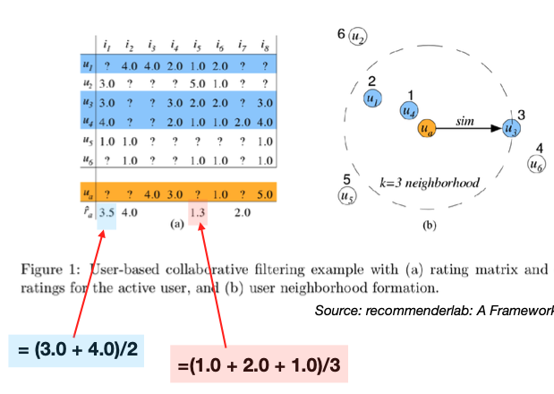
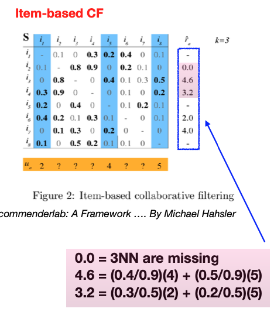

# 13.4. User-Based vs Item-Based Collaborative Filtering

This section provides a comprehensive comparison between User-Based Collaborative Filtering (UBCF) and Item-Based Collaborative Filtering (IBCF), two fundamental approaches in recommendation systems. We'll explore the underlying principles, mathematical foundations, and practical considerations that drive the choice between these methods.

## 13.4.1. Conceptual Foundation and Overview

### The Core Philosophy Behind Collaborative Filtering

Collaborative filtering is based on the principle of **collective intelligence** - the idea that the wisdom of crowds can be harnessed to make predictions about individual preferences. This approach leverages the fact that human preferences often follow patterns that can be discovered through statistical analysis of large datasets.

### User-Based Collaborative Filtering (UBCF): The "People Like You" Approach

UBCF operates on the fundamental principle that **users with similar preferences in the past will have similar preferences in the future**. This is based on the observation that human preferences often cluster into distinct groups or "taste communities."

#### Intuitive Understanding

Think of UBCF as finding your "taste doppelgänger" - someone who has rated many of the same items as you and given them similar ratings. If this person loved a movie you haven't seen, there's a good chance you'll like it too.

#### Mathematical Intuition

The core assumption can be formalized as:
```math
\text{If } \text{sim}(u, v) \text{ is high, then } P(r_{ui} \approx r_{vi}) \text{ is high}
```

where $`\text{sim}(u, v)`$ measures the similarity between users $`u`$ and $`v`$.

#### Real-World Example

Consider a movie recommendation system:
- User A rates "The Matrix" (5/5), "Inception" (4/5), "Interstellar" (3/5)
- User B rates "The Matrix" (5/5), "Inception" (4/5), "Interstellar" (3/5)
- User B also rated "Blade Runner" (5/5) which User A hasn't seen
- UBCF would recommend "Blade Runner" to User A with high confidence



### Item-Based Collaborative Filtering (IBCF): The "Similar Items" Approach

IBCF operates on the principle that **users will like items similar to those they have already rated positively**. This approach focuses on item characteristics and relationships rather than user relationships.

#### Intuitive Understanding

IBCF is like having a smart shopping assistant who says, "You liked this, so you'll probably like that too." It doesn't care about other people's opinions - it focuses purely on the relationships between items.

#### Mathematical Intuition

The core assumption can be formalized as:
```math
\text{If } \text{sim}(i, j) \text{ is high, then } P(r_{ui} \approx r_{uj}) \text{ is high}
```

where $`\text{sim}(i, j)`$ measures the similarity between items $`i`$ and $`j`$.

#### Real-World Example

Consider a book recommendation system:
- User rates "Harry Potter and the Sorcerer's Stone" (5/5)
- System finds that users who liked "Harry Potter" also liked "The Hobbit" (similarity = 0.8)
- System recommends "The Hobbit" to this user



### Key Conceptual Differences

| Aspect | UBCF | IBCF |
|--------|------|------|
| **Focus** | User relationships | Item relationships |
| **Assumption** | Similar users have similar tastes | Users like similar items |
| **Computation** | User-to-user similarity | Item-to-item similarity |
| **Interpretability** | "People like you liked this" | "This is similar to what you liked" |
| **Scalability** | Limited by user count | Limited by item count |

## 13.4.2. Mathematical Formulation and Deep Dive

### Understanding the Prediction Framework

Both UBCF and IBCF follow a **weighted average** approach, but they differ fundamentally in what they average and how they compute weights. Let's break down the mathematical intuition behind each approach.

### UBCF Prediction: The User-Centric Approach

#### Core Mathematical Intuition

UBCF predicts a user's rating for an item by looking at how **similar users** rated that same item. The prediction is essentially a **weighted average** of ratings from similar users, where the weights are the similarities between the target user and each neighbor.

#### Detailed Mathematical Formulation

For user $`u`$ and item $`i`$, the prediction is computed as:

```math
\hat{r}_{ui} = \frac{\sum_{v \in N(u)} \text{sim}(u, v) \cdot r_{vi}}{\sum_{v \in N(u)} |\text{sim}(u, v)|}
```

#### Breaking Down the Components

1. **$`N(u)`$ - The Neighborhood**: This is the set of users most similar to user $`u`$. Typically, we select the top-$`k`$ most similar users:
   ```math
   N(u) = \{v_1, v_2, \ldots, v_k : \text{sim}(u, v_i) \text{ is among the top } k \text{ similarities}\}
   ```

2. **$`\text{sim}(u, v)`$ - User Similarity**: This measures how similar two users are based on their rating patterns. We'll explore various similarity metrics in detail later.

3. **$`r_{vi}`$ - Neighbor's Rating**: The actual rating given by user $`v`$ for item $`i`$.

4. **Normalization Factor**: The denominator ensures the prediction is properly scaled and prevents bias from the magnitude of similarity scores.

#### Mathematical Interpretation

The formula can be interpreted as:
```math
\hat{r}_{ui} = \sum_{v \in N(u)} w_v \cdot r_{vi}
```

where $`w_v = \frac{\text{sim}(u, v)}{\sum_{v' \in N(u)} |\text{sim}(u, v')|}`$ are the normalized weights.

#### Example Calculation

Consider a user Alice (A) who hasn't rated "The Matrix":
- Bob (B) is 80% similar to Alice and rated "The Matrix" 5/5
- Carol (C) is 60% similar to Alice and rated "The Matrix" 4/5
- David (D) is 40% similar to Alice and rated "The Matrix" 3/5

The prediction would be:
```math
\hat{r}_{A,\text{Matrix}} = \frac{0.8 \times 5 + 0.6 \times 4 + 0.4 \times 3}{0.8 + 0.6 + 0.4} = \frac{4 + 2.4 + 1.2}{1.8} = 4.22
```

### IBCF Prediction: The Item-Centric Approach

#### Core Mathematical Intuition

IBCF predicts a user's rating for an item by looking at how that user rated **similar items**. The prediction is a **weighted average** of the user's own ratings, where the weights are the similarities between the target item and items the user has already rated.

#### Detailed Mathematical Formulation

For user $`u`$ and item $`i`$, the prediction is computed as:

```math
\hat{r}_{ui} = \frac{\sum_{j \in N(i)} \text{sim}(i, j) \cdot r_{uj}}{\sum_{j \in N(i)} |\text{sim}(i, j)|}
```

#### Breaking Down the Components

1. **$`N(i)`$ - The Item Neighborhood**: This is the set of items most similar to item $`i`$ that user $`u`$ has rated:
   ```math
   N(i) = \{j_1, j_2, \ldots, j_k : \text{sim}(i, j_l) \text{ is among the top } k \text{ similarities AND } r_{uj_l} \text{ exists}\}
   ```

2. **$`\text{sim}(i, j)`$ - Item Similarity**: This measures how similar two items are based on how users rate them.

3. **$`r_{uj}`$ - User's Rating**: The actual rating given by user $`u`$ for item $`j`$.

#### Mathematical Interpretation

The formula can be interpreted as:
```math
\hat{r}_{ui} = \sum_{j \in N(i)} w_j \cdot r_{uj}
```

where $`w_j = \frac{\text{sim}(i, j)}{\sum_{j' \in N(i)} |\text{sim}(i, j')|}`$ are the normalized weights.

#### Example Calculation

Consider Alice who hasn't rated "The Matrix":
- Alice rated "Inception" 5/5 (similarity to "The Matrix" = 0.9)
- Alice rated "Blade Runner" 4/5 (similarity to "The Matrix" = 0.7)
- Alice rated "Terminator" 3/5 (similarity to "The Matrix" = 0.5)

The prediction would be:
```math
\hat{r}_{A,\text{Matrix}} = \frac{0.9 \times 5 + 0.7 \times 4 + 0.5 \times 3}{0.9 + 0.7 + 0.5} = \frac{4.5 + 2.8 + 1.5}{2.1} = 4.19
```

### Key Mathematical Insights

#### 1. Weighted Average Interpretation

Both methods are essentially performing **locally weighted regression**:
- UBCF: Weighted average across users (user space)
- IBCF: Weighted average across items (item space)

#### 2. Sparsity Handling

The neighborhood selection $`N(u)`$ or $`N(i)`$ must handle sparse data:
```math
N(u) = \{v : \text{sim}(u, v) > \text{threshold} \text{ AND } r_{vi} \text{ exists}\}
```

#### 3. Cold Start Problem

- **UBCF**: $`N(u) = \emptyset`$ for new users
- **IBCF**: $`N(i) = \emptyset`$ for new items

#### 4. Computational Complexity

- **UBCF**: $`O(|N(u)|)`$ per prediction
- **IBCF**: $`O(|N(i)|)`$ per prediction

Where typically $`|N(u)| \ll |\mathcal{U}|`$ and $`|N(i)| \ll |\mathcal{I}|`$ for efficiency.

## 13.4.3. Algorithm Comparison

### UBCF Algorithm Steps

1. **Compute User Similarities**: Calculate similarity between target user and all other users
2. **Select Neighborhood**: Choose top-$`k`$ most similar users
3. **Generate Prediction**: Weighted average of neighbors' ratings for target item

### IBCF Algorithm Steps

1. **Pre-compute Item Similarities**: Calculate similarity between all item pairs
2. **Select Neighborhood**: Choose top-$`k`$ most similar items for target item
3. **Generate Prediction**: Weighted average of user's ratings for similar items

## 13.4.4. Similarity Metrics: The Heart of Collaborative Filtering

The choice of similarity metric is crucial for the performance of collaborative filtering systems. Different metrics capture different aspects of similarity and have varying computational costs and interpretability.

### Understanding Similarity in Recommendation Systems

Similarity metrics in recommendation systems serve to quantify the degree of resemblance between users or items based on their rating patterns. The choice of metric can significantly impact both the accuracy and interpretability of recommendations.

### User Similarity Metrics: Finding Your Taste Doppelgänger

#### 1. Pearson Correlation: The Gold Standard

Pearson correlation measures the linear relationship between two users' rating patterns, accounting for different rating scales and biases.

##### Mathematical Foundation

```math
\text{Pearson}(u, v) = \frac{\sum_{i \in I_{uv}} (r_{ui} - \bar{r}_u)(r_{vi} - \bar{r}_v)}{\sqrt{\sum_{i \in I_{uv}} (r_{ui} - \bar{r}_u)^2} \sqrt{\sum_{i \in I_{uv}} (r_{vi} - \bar{r}_v)^2}}
```

where:
- $`I_{uv}`$ is the set of items rated by both users $`u`$ and $`v`$
- $`\bar{r}_u`$ and $`\bar{r}_v`$ are the mean ratings of users $`u`$ and $`v`$ respectively

##### Intuitive Understanding

Pearson correlation measures how well two users' rating patterns align after accounting for their individual rating biases. A correlation of:
- **+1.0**: Perfect positive correlation (users rate items identically relative to their means)
- **0.0**: No linear relationship
- **-1.0**: Perfect negative correlation (users have opposite preferences)

##### Example Calculation

Consider two users with ratings:
- User A: "Matrix" (5), "Inception" (4), "Interstellar" (3) → Mean = 4
- User B: "Matrix" (4), "Inception" (3), "Interstellar" (2) → Mean = 3

Deviations from mean:
- User A: +1, 0, -1
- User B: +1, 0, -1

Correlation = 1.0 (perfect alignment)

##### Advantages
- Accounts for rating scale differences
- Robust to different rating biases
- Well-understood statistical properties

##### Disadvantages
- Requires sufficient common items
- Sensitive to outliers
- Computationally expensive for large datasets

#### 2. Cosine Similarity: Vector-Based Approach

Cosine similarity measures the angle between two users' rating vectors, treating ratings as vectors in high-dimensional space.

##### Mathematical Foundation

```math
\text{Cosine}(u, v) = \frac{\mathbf{r}_u \cdot \mathbf{r}_v}{\|\mathbf{r}_u\| \cdot \|\mathbf{r}_v\|}
```

where $`\mathbf{r}_u`$ and $`\mathbf{r}_v`$ are the rating vectors of users $`u`$ and $`v`$.

##### Geometric Interpretation

Cosine similarity measures the cosine of the angle between two rating vectors:
- **1.0**: Vectors point in same direction (perfect similarity)
- **0.0**: Vectors are orthogonal (no similarity)
- **-1.0**: Vectors point in opposite directions (perfect dissimilarity)

##### Example Calculation

Consider rating vectors:
- User A: [5, 4, 3, 0, 0] (rated 3 items)
- User B: [4, 3, 2, 0, 0] (rated 3 items)

Dot product: 5×4 + 4×3 + 3×2 = 20 + 12 + 6 = 38
Magnitudes: √(25+16+9) = √50, √(16+9+4) = √29
Cosine similarity = 38 / (√50 × √29) ≈ 0.99

##### Advantages
- Computationally efficient
- Works well with sparse data
- Intuitive geometric interpretation

##### Disadvantages
- Doesn't account for rating scale differences
- Sensitive to rating magnitude
- May not capture nuanced preferences

#### 3. Jaccard Similarity: Set-Based Approach

Jaccard similarity measures the overlap between sets of items rated by two users, ignoring rating values.

##### Mathematical Foundation

```math
\text{Jaccard}(u, v) = \frac{|I_u \cap I_v|}{|I_u \cup I_v|}
```

where $`I_u`$ and $`I_v`$ are sets of items rated by users $`u`$ and $`v`$.

##### Set-Theoretic Interpretation

Jaccard similarity measures the proportion of items that both users have rated:
- **1.0**: Users rated exactly the same items
- **0.0**: Users rated completely different items
- **0.5**: Half of their rated items overlap

##### Example Calculation

Consider item sets:
- User A rated: {Matrix, Inception, Blade Runner, Terminator}
- User B rated: {Matrix, Inception, Alien, Predator}

Intersection: {Matrix, Inception} → 2 items
Union: {Matrix, Inception, Blade Runner, Terminator, Alien, Predator} → 6 items
Jaccard similarity = 2/6 = 0.33

##### Advantages
- Simple and fast to compute
- Works with binary data
- Robust to rating scale issues

##### Disadvantages
- Ignores rating values
- May miss nuanced preferences
- Less informative than value-based metrics

### Item Similarity Metrics: Finding Related Items

#### 1. Adjusted Cosine Similarity: The IBCF Standard

Adjusted cosine similarity is specifically designed for item-based collaborative filtering, accounting for user rating biases.

##### Mathematical Foundation

```math
\text{AdjustedCosine}(i, j) = \frac{\sum_{u \in U_{ij}} (r_{ui} - \bar{r}_u)(r_{uj} - \bar{r}_u)}{\sqrt{\sum_{u \in U_{ij}} (r_{ui} - \bar{r}_u)^2} \sqrt{\sum_{u \in U_{ij}} (r_{uj} - \bar{r}_u)^2}}
```

where $`U_{ij}`$ is the set of users who rated both items $`i`$ and $`j`$.

##### Key Insight: User-Centered Adjustment

Unlike regular cosine similarity, adjusted cosine subtracts each user's mean rating before computing similarity. This accounts for the fact that different users have different rating scales and biases.

##### Example Calculation

Consider items "Matrix" and "Inception" rated by users:
- User A (mean=4): Matrix(5), Inception(4) → Deviations: +1, 0
- User B (mean=3): Matrix(4), Inception(3) → Deviations: +1, 0
- User C (mean=2): Matrix(3), Inception(2) → Deviations: +1, 0

Adjusted cosine = 1.0 (perfect similarity after accounting for user biases)

##### Advantages
- Accounts for user rating biases
- Specifically designed for item-based CF
- Robust to different rating scales

##### Disadvantages
- Computationally more expensive
- Requires sufficient user overlap
- May not work well with very sparse data

#### 2. Pearson Correlation for Items

Pearson correlation for items measures the linear relationship between how different users rate two items.

##### Mathematical Foundation

```math
\text{Pearson}(i, j) = \frac{\sum_{u \in U_{ij}} (r_{ui} - \bar{r}_i)(r_{uj} - \bar{r}_j)}{\sqrt{\sum_{u \in U_{ij}} (r_{ui} - \bar{r}_i)^2} \sqrt{\sum_{u \in U_{ij}} (r_{uj} - \bar{r}_j)^2}}
```

where $`\bar{r}_i`$ and $`\bar{r}_j`$ are the mean ratings of items $`i`$ and $`j`$.

##### Item-Centered Adjustment

This version subtracts the item's mean rating rather than the user's mean, focusing on how items are rated relative to their own average ratings.

### Advanced Similarity Metrics

#### 1. Spearman Rank Correlation

Measures the monotonic relationship between rankings rather than absolute values:

```math
\text{Spearman}(u, v) = 1 - \frac{6 \sum_{i \in I_{uv}} d_i^2}{n(n^2-1)}
```

where $`d_i`$ is the difference in ranks for item $`i`$ between users $`u`$ and $`v`$.

#### 2. Mean Squared Difference

Simple but effective for dense datasets:

```math
\text{MSD}(u, v) = \frac{1}{|I_{uv}|} \sum_{i \in I_{uv}} (r_{ui} - r_{vi})^2
```

#### 3. Constrained Pearson Correlation

Addresses the cold start problem by using a minimum threshold:

```math
\text{ConstrainedPearson}(u, v) = \begin{cases}
\text{Pearson}(u, v) & \text{if } |I_{uv}| \geq \text{min\_common} \\
0 & \text{otherwise}
\end{cases}
```

### Choosing the Right Similarity Metric

#### For UBCF:
- **Pearson**: Best overall performance, accounts for biases
- **Cosine**: Good for sparse data, computationally efficient
- **Jaccard**: Good for binary data, simple implementation

#### For IBCF:
- **Adjusted Cosine**: Best for item-based CF, accounts for user biases
- **Pearson**: Good alternative, item-centered adjustment
- **Cosine**: Fast but may miss user bias effects

#### Performance Considerations:

| Metric | Computational Cost | Accuracy | Interpretability |
|--------|-------------------|----------|------------------|
| Pearson | High | High | High |
| Cosine | Medium | Medium | Medium |
| Jaccard | Low | Low | High |
| Adjusted Cosine | High | High | Medium |

## 13.4.5. Implementation

### Python Implementation: UBCF vs IBCF Comparison

```python
import numpy as np
import pandas as pd
import matplotlib.pyplot as plt
import seaborn as sns
from sklearn.metrics.pairwise import cosine_similarity
from scipy.stats import pearsonr
from sklearn.metrics import mean_absolute_error, mean_squared_error
import warnings
warnings.filterwarnings('ignore')

class UBCF:
    """User-Based Collaborative Filtering"""
    
    def __init__(self, similarity_metric='pearson', k_neighbors=10):
        self.similarity_metric = similarity_metric
        self.k_neighbors = k_neighbors
        self.rating_matrix = None
        self.user_similarity = None
        self.user_means = None
        
    def fit(self, ratings_df, user_col='user_id', item_col='item_id', rating_col='rating'):
        """Fit the UBCF model"""
        # Create rating matrix
        self.rating_matrix = ratings_df.pivot_table(
            index=user_col, 
            columns=item_col, 
            values=rating_col, 
            fill_value=np.nan
        )
        
        # Compute user means
        self.user_means = self.rating_matrix.mean(axis=1)
        
        # Compute user similarities
        self.user_similarity = self._compute_user_similarity()
        
        return self
    
    def _compute_user_similarity(self):
        """Compute user similarity matrix"""
        n_users = len(self.rating_matrix)
        similarity_matrix = np.zeros((n_users, n_users))
        
        for i in range(n_users):
            for j in range(i+1, n_users):
                # Get common rated items
                user_i_ratings = self.rating_matrix.iloc[i]
                user_j_ratings = self.rating_matrix.iloc[j]
                
                common_items = ~(user_i_ratings.isna() | user_j_ratings.isna())
                
                if common_items.sum() > 1:
                    if self.similarity_metric == 'pearson':
                        corr, _ = pearsonr(
                            user_i_ratings[common_items], 
                            user_j_ratings[common_items]
                        )
                        similarity_matrix[i, j] = corr
                        similarity_matrix[j, i] = corr
                    elif self.similarity_metric == 'cosine':
                        # Center ratings
                        user_i_centered = user_i_ratings[common_items] - self.user_means.iloc[i]
                        user_j_centered = user_j_ratings[common_items] - self.user_means.iloc[j]
                        
                        cosine_sim = np.dot(user_i_centered, user_j_centered) / (
                            np.linalg.norm(user_i_centered) * np.linalg.norm(user_j_centered)
                        )
                        similarity_matrix[i, j] = cosine_sim
                        similarity_matrix[j, i] = cosine_sim
                else:
                    similarity_matrix[i, j] = 0
                    similarity_matrix[j, i] = 0
        
        return similarity_matrix
    
    def predict(self, user_id, item_id):
        """Predict rating for user-item pair"""
        if user_id not in self.rating_matrix.index or item_id not in self.rating_matrix.columns:
            return self.user_means.mean()
        
        user_idx = self.rating_matrix.index.get_loc(user_id)
        item_idx = self.rating_matrix.columns.get_loc(item_id)
        
        # Get user similarities
        user_similarities = self.user_similarity[user_idx]
        
        # Find users who rated this item
        item_ratings = self.rating_matrix.iloc[:, item_idx]
        rated_users = ~item_ratings.isna()
        
        if not rated_users.any():
            return self.user_means.mean()
        
        # Get similarities and ratings for users who rated this item
        similarities = user_similarities[rated_users]
        ratings = item_ratings[rated_users]
        
        # Sort by similarity and take top-k
        sorted_indices = np.argsort(similarities)[::-1][:self.k_neighbors]
        
        if len(sorted_indices) == 0:
            return self.user_means.mean()
        
        top_similarities = similarities.iloc[sorted_indices]
        top_ratings = ratings.iloc[sorted_indices]
        
        # Weighted average
        weighted_sum = np.sum(top_similarities * top_ratings)
        total_similarity = np.sum(np.abs(top_similarities))
        
        if total_similarity == 0:
            return top_ratings.mean()
        
        return weighted_sum / total_similarity

class IBCF:
    """Item-Based Collaborative Filtering"""
    
    def __init__(self, similarity_metric='adjusted_cosine', k_neighbors=10):
        self.similarity_metric = similarity_metric
        self.k_neighbors = k_neighbors
        self.rating_matrix = None
        self.item_similarity = None
        self.user_means = None
        
    def fit(self, ratings_df, user_col='user_id', item_col='item_id', rating_col='rating'):
        """Fit the IBCF model"""
        # Create rating matrix
        self.rating_matrix = ratings_df.pivot_table(
            index=user_col, 
            columns=item_col, 
            values=rating_col, 
            fill_value=np.nan
        )
        
        # Compute user means
        self.user_means = self.rating_matrix.mean(axis=1)
        
        # Compute item similarities
        self.item_similarity = self._compute_item_similarity()
        
        return self
    
    def _compute_item_similarity(self):
        """Compute item similarity matrix"""
        n_items = len(self.rating_matrix.columns)
        similarity_matrix = np.zeros((n_items, n_items))
        
        for i in range(n_items):
            for j in range(i+1, n_items):
                # Get common users
                item_i_ratings = self.rating_matrix.iloc[:, i]
                item_j_ratings = self.rating_matrix.iloc[:, j]
                
                common_users = ~(item_i_ratings.isna() | item_j_ratings.isna())
                
                if common_users.sum() > 1:
                    if self.similarity_metric == 'adjusted_cosine':
                        # Center by user means
                        item_i_centered = item_i_ratings[common_users] - self.user_means[common_users]
                        item_j_centered = item_j_ratings[common_users] - self.user_means[common_users]
                        
                        cosine_sim = np.dot(item_i_centered, item_j_centered) / (
                            np.linalg.norm(item_i_centered) * np.linalg.norm(item_j_centered)
                        )
                        similarity_matrix[i, j] = cosine_sim
                        similarity_matrix[j, i] = cosine_sim
                    elif self.similarity_metric == 'pearson':
                        corr, _ = pearsonr(
                            item_i_ratings[common_users], 
                            item_j_ratings[common_users]
                        )
                        similarity_matrix[i, j] = corr
                        similarity_matrix[j, i] = corr
                else:
                    similarity_matrix[i, j] = 0
                    similarity_matrix[j, i] = 0
        
        return similarity_matrix
    
    def predict(self, user_id, item_id):
        """Predict rating for user-item pair"""
        if user_id not in self.rating_matrix.index or item_id not in self.rating_matrix.columns:
            return self.rating_matrix.mean().mean()
        
        user_idx = self.rating_matrix.index.get_loc(user_id)
        item_idx = self.rating_matrix.columns.get_loc(item_id)
        
        # Get item similarities
        item_similarities = self.item_similarity[item_idx]
        
        # Find items rated by this user
        user_ratings = self.rating_matrix.iloc[user_idx]
        rated_items = ~user_ratings.isna()
        
        if not rated_items.any():
            return self.rating_matrix.mean().mean()
        
        # Get similarities and ratings for items rated by this user
        similarities = item_similarities[rated_items]
        ratings = user_ratings[rated_items]
        
        # Sort by similarity and take top-k
        sorted_indices = np.argsort(similarities)[::-1][:self.k_neighbors]
        
        if len(sorted_indices) == 0:
            return ratings.mean()
        
        top_similarities = similarities.iloc[sorted_indices]
        top_ratings = ratings.iloc[sorted_indices]
        
        # Weighted average
        weighted_sum = np.sum(top_similarities * top_ratings)
        total_similarity = np.sum(np.abs(top_similarities))
        
        if total_similarity == 0:
            return top_ratings.mean()
        
        return weighted_sum / total_similarity

# Generate synthetic data with clear user/item clusters
np.random.seed(42)
n_users = 200
n_items = 100
n_ratings = 2000

# Create synthetic ratings with distinct user/item clusters
ratings_data = []
for user_id in range(n_users):
    n_user_ratings = np.random.randint(10, 30)
    rated_items = np.random.choice(n_items, n_user_ratings, replace=False)
    
    for item_id in rated_items:
        # Create distinct user clusters with different preferences
        if user_id < 50:  # Cluster 1: prefers items 0-25
            base_rating = 4.5 if item_id < 25 else 2.0
        elif user_id < 100:  # Cluster 2: prefers items 25-50
            base_rating = 4.5 if 25 <= item_id < 50 else 2.0
        elif user_id < 150:  # Cluster 3: prefers items 50-75
            base_rating = 4.5 if 50 <= item_id < 75 else 2.0
        else:  # Cluster 4: prefers items 75-100
            base_rating = 4.5 if item_id >= 75 else 2.0
        
        # Add noise
        rating = max(1, min(5, base_rating + np.random.normal(0, 0.3)))
        ratings_data.append({
            'user_id': user_id,
            'item_id': item_id,
            'rating': rating
        })

ratings_df = pd.DataFrame(ratings_data)

print("Synthetic Dataset with User/Item Clusters:")
print(f"Number of users: {n_users}")
print(f"Number of items: {n_items}")
print(f"Number of ratings: {len(ratings_df)}")
print(f"Sparsity: {1 - len(ratings_df) / (n_users * n_items):.3f}")

# Split data for evaluation
from sklearn.model_selection import train_test_split
train_df, test_df = train_test_split(ratings_df, test_size=0.2, random_state=42)

# Train UBCF and IBCF models
print("\n=== Training Models ===")

# UBCF with different similarity metrics
ubcf_pearson = UBCF(similarity_metric='pearson', k_neighbors=15)
ubcf_pearson.fit(train_df)

ubcf_cosine = UBCF(similarity_metric='cosine', k_neighbors=15)
ubcf_cosine.fit(train_df)

# IBCF with different similarity metrics
ibcf_adjusted_cosine = IBCF(similarity_metric='adjusted_cosine', k_neighbors=15)
ibcf_adjusted_cosine.fit(train_df)

ibcf_pearson = IBCF(similarity_metric='pearson', k_neighbors=15)
ibcf_pearson.fit(train_df)

# Evaluate models
def evaluate_model(model, test_df):
    """Evaluate model on test set"""
    predictions = []
    actuals = []
    
    for _, row in test_df.iterrows():
        user_id = row['user_id']
        item_id = row['item_id']
        actual_rating = row['rating']
        
        pred_rating = model.predict(user_id, item_id)
        
        if not np.isnan(pred_rating):
            predictions.append(pred_rating)
            actuals.append(actual_rating)
    
    if len(predictions) == 0:
        return {'mae': np.inf, 'rmse': np.inf, 'coverage': 0}
    
    mae = mean_absolute_error(actuals, predictions)
    rmse = np.sqrt(mean_squared_error(actuals, predictions))
    coverage = len(predictions) / len(test_df)
    
    return {'mae': mae, 'rmse': rmse, 'coverage': coverage}

# Evaluate all models
models = {
    'UBCF-Pearson': ubcf_pearson,
    'UBCF-Cosine': ubcf_cosine,
    'IBCF-AdjustedCosine': ibcf_adjusted_cosine,
    'IBCF-Pearson': ibcf_pearson
}

results = {}
for name, model in models.items():
    print(f"Evaluating {name}...")
    results[name] = evaluate_model(model, test_df)

# Display results
print("\n=== Evaluation Results ===")
for name, metrics in results.items():
    print(f"{name}:")
    print(f"  MAE: {metrics['mae']:.4f}")
    print(f"  RMSE: {metrics['rmse']:.4f}")
    print(f"  Coverage: {metrics['coverage']:.4f}")
    print()

# Visualization
plt.figure(figsize=(20, 12))

# Plot 1: Rating matrix heatmap (sample)
plt.subplot(3, 4, 1)
sample_matrix = ratings_df.pivot_table(
    index='user_id', columns='item_id', values='rating', fill_value=np.nan
).iloc[:30, :30]
sns.heatmap(sample_matrix, cmap='viridis', cbar_kws={'label': 'Rating'})
plt.title('Rating Matrix (Sample)')
plt.xlabel('Item ID')
plt.ylabel('User ID')

# Plot 2: User similarity matrix (UBCF)
plt.subplot(3, 4, 2)
sample_user_sim = ubcf_pearson.user_similarity[:30, :30]
sns.heatmap(sample_user_sim, cmap='coolwarm', center=0, cbar_kws={'label': 'Similarity'})
plt.title('User Similarity Matrix (UBCF)')
plt.xlabel('User ID')
plt.ylabel('User ID')

# Plot 3: Item similarity matrix (IBCF)
plt.subplot(3, 4, 3)
sample_item_sim = ibcf_adjusted_cosine.item_similarity[:30, :30]
sns.heatmap(sample_item_sim, cmap='coolwarm', center=0, cbar_kws={'label': 'Similarity'})
plt.title('Item Similarity Matrix (IBCF)')
plt.xlabel('Item ID')
plt.ylabel('Item ID')

# Plot 4: MAE comparison
plt.subplot(3, 4, 4)
mae_values = [results[name]['mae'] for name in results.keys()]
plt.bar(results.keys(), mae_values, color=['blue', 'lightblue', 'red', 'lightcoral'])
plt.title('MAE Comparison')
plt.ylabel('Mean Absolute Error')
plt.xticks(rotation=45)

# Plot 5: RMSE comparison
plt.subplot(3, 4, 5)
rmse_values = [results[name]['rmse'] for name in results.keys()]
plt.bar(results.keys(), rmse_values, color=['blue', 'lightblue', 'red', 'lightcoral'])
plt.title('RMSE Comparison')
plt.ylabel('Root Mean Square Error')
plt.xticks(rotation=45)

# Plot 6: Coverage comparison
plt.subplot(3, 4, 6)
coverage_values = [results[name]['coverage'] for name in results.keys()]
plt.bar(results.keys(), coverage_values, color=['blue', 'lightblue', 'red', 'lightcoral'])
plt.title('Coverage Comparison')
plt.ylabel('Coverage')
plt.xticks(rotation=45)

# Plot 7: User similarity distribution
plt.subplot(3, 4, 7)
user_similarities = ubcf_pearson.user_similarity[np.triu_indices_from(ubcf_pearson.user_similarity, k=1)]
plt.hist(user_similarities, bins=30, alpha=0.7, edgecolor='black')
plt.title('User Similarity Distribution')
plt.xlabel('Similarity Score')
plt.ylabel('Frequency')

# Plot 8: Item similarity distribution
plt.subplot(3, 4, 8)
item_similarities = ibcf_adjusted_cosine.item_similarity[np.triu_indices_from(ibcf_adjusted_cosine.item_similarity, k=1)]
plt.hist(item_similarities, bins=30, alpha=0.7, edgecolor='black')
plt.title('Item Similarity Distribution')
plt.xlabel('Similarity Score')
plt.ylabel('Frequency')

# Plot 9: Prediction vs Actual (UBCF)
plt.subplot(3, 4, 9)
ubcf_predictions = []
ubcf_actuals = []
for _, row in test_df.head(100).iterrows():
    pred = ubcf_pearson.predict(row['user_id'], row['item_id'])
    if not np.isnan(pred):
        ubcf_predictions.append(pred)
        ubcf_actuals.append(row['rating'])

plt.scatter(ubcf_actuals, ubcf_predictions, alpha=0.6)
plt.plot([1, 5], [1, 5], 'r--', alpha=0.8)
plt.title('UBCF: Predicted vs Actual')
plt.xlabel('Actual Rating')
plt.ylabel('Predicted Rating')

# Plot 10: Prediction vs Actual (IBCF)
plt.subplot(3, 4, 10)
ibcf_predictions = []
ibcf_actuals = []
for _, row in test_df.head(100).iterrows():
    pred = ibcf_adjusted_cosine.predict(row['user_id'], row['item_id'])
    if not np.isnan(pred):
        ibcf_predictions.append(pred)
        ibcf_actuals.append(row['rating'])

plt.scatter(ibcf_actuals, ibcf_predictions, alpha=0.6)
plt.plot([1, 5], [1, 5], 'r--', alpha=0.8)
plt.title('IBCF: Predicted vs Actual')
plt.xlabel('Actual Rating')
plt.ylabel('Predicted Rating')

# Plot 11: Computational complexity comparison
plt.subplot(3, 4, 11)
complexities = {
    'UBCF': 'O(n²m)',
    'IBCF': 'O(m²n)'
}
plt.bar(complexities.keys(), [1, 1], color=['blue', 'red'])
plt.title('Computational Complexity')
plt.ylabel('Relative Complexity')
for i, (name, complexity) in enumerate(complexities.items()):
    plt.text(i, 0.5, complexity, ha='center', va='center', fontsize=12)

# Plot 12: Scalability comparison
plt.subplot(3, 4, 12)
scalability_metrics = {
    'UBCF': ['Cold Start', 'Sparsity', 'Scalability'],
    'IBCF': ['Stability', 'Caching', 'Performance']
}
plt.text(0.5, 0.5, 'UBCF vs IBCF\nCharacteristics', ha='center', va='center', 
         fontsize=12, transform=plt.gca().transAxes)
plt.axis('off')

plt.tight_layout()
plt.show()

# Detailed analysis
print("\n=== Detailed Analysis ===")

# Compare prediction patterns
test_sample = test_df.head(50)
ubcf_preds = []
ibcf_preds = []
actuals = []

for _, row in test_sample.iterrows():
    ubcf_pred = ubcf_pearson.predict(row['user_id'], row['item_id'])
    ibcf_pred = ibcf_adjusted_cosine.predict(row['user_id'], row['item_id'])
    
    if not (np.isnan(ubcf_pred) or np.isnan(ibcf_pred)):
        ubcf_preds.append(ubcf_pred)
        ibcf_preds.append(ibcf_pred)
        actuals.append(row['rating'])

print(f"UBCF Prediction Statistics:")
print(f"  Mean: {np.mean(ubcf_preds):.3f}")
print(f"  Std: {np.std(ubcf_preds):.3f}")
print(f"  Range: [{np.min(ubcf_preds):.3f}, {np.max(ubcf_preds):.3f}]")

print(f"\nIBCF Prediction Statistics:")
print(f"  Mean: {np.mean(ibcf_preds):.3f}")
print(f"  Std: {np.std(ibcf_preds):.3f}")
print(f"  Range: [{np.min(ibcf_preds):.3f}, {np.max(ibcf_preds):.3f}]")

# Compare similarity distributions
print(f"\nSimilarity Distribution Comparison:")
print(f"UBCF User Similarities:")
print(f"  Mean: {np.mean(user_similarities):.3f}")
print(f"  Std: {np.std(user_similarities):.3f}")
print(f"  Range: [{np.min(user_similarities):.3f}, {np.max(user_similarities):.3f}]")

print(f"\nIBCF Item Similarities:")
print(f"  Mean: {np.mean(item_similarities):.3f}")
print(f"  Std: {np.std(item_similarities):.3f}")
print(f"  Range: [{np.min(item_similarities):.3f}, {np.max(item_similarities):.3f}]")
```

### R Implementation

```r
# UBCF vs IBCF Comparison in R
library(recommenderlab)
library(ggplot2)
library(dplyr)
library(tidyr)
library(gridExtra)

# Generate synthetic data with clusters
set.seed(42)
n_users <- 200
n_items <- 100
n_ratings <- 2000

# Create synthetic ratings with distinct clusters
ratings_data <- list()
for (user_id in 1:n_users) {
  n_user_ratings <- sample(10:30, 1)
  rated_items <- sample(1:n_items, n_user_ratings, replace = FALSE)
  
  for (item_id in rated_items) {
    # Create distinct user clusters
    if (user_id <= 50) {
      base_rating <- ifelse(item_id <= 25, 4.5, 2.0)
    } else if (user_id <= 100) {
      base_rating <- ifelse(item_id > 25 && item_id <= 50, 4.5, 2.0)
    } else if (user_id <= 150) {
      base_rating <- ifelse(item_id > 50 && item_id <= 75, 4.5, 2.0)
    } else {
      base_rating <- ifelse(item_id > 75, 4.5, 2.0)
    }
    
    # Add noise
    rating <- max(1, min(5, base_rating + rnorm(1, 0, 0.3)))
    
    ratings_data[[length(ratings_data) + 1]] <- list(
      user_id = user_id,
      item_id = item_id,
      rating = rating
    )
  }
}

ratings_df <- do.call(rbind, lapply(ratings_data, as.data.frame))

# Create rating matrix
rating_matrix <- ratings_df %>%
  spread(item_id, rating, fill = NA) %>%
  select(-user_id) %>%
  as.matrix()

# Convert to realRatingMatrix
rating_matrix_real <- as(rating_matrix, "realRatingMatrix")

# Split data for evaluation
set.seed(42)
train_indices <- sample(1:nrow(ratings_df), 0.8 * nrow(ratings_df))
train_df <- ratings_df[train_indices, ]
test_df <- ratings_df[-train_indices, ]

# Create training matrix
train_matrix <- train_df %>%
  spread(item_id, rating, fill = NA) %>%
  select(-user_id) %>%
  as.matrix()
train_matrix_real <- as(train_matrix, "realRatingMatrix")

# Test different methods
methods <- c("UBCF", "IBCF")
similarity_metrics <- list(
  UBCF = c("cosine", "pearson"),
  IBCF = c("cosine", "pearson")
)

results <- list()

for (method in methods) {
  for (metric in similarity_metrics[[method]]) {
    method_name <- paste0(method, "-", metric)
    cat("Testing", method_name, "\n")
    
    # Train model
    model <- Recommender(train_matrix_real, method = method, 
                        parameter = list(method = metric, nn = 15))
    
    # Generate predictions
    predictions <- predict(model, train_matrix_real[1:min(10, nrow(train_matrix_real))], n = 5)
    
    # Store results
    results[[method_name]] <- list(
      model = model,
      predictions = predictions
    )
  }
}

# Evaluation function
evaluate_model <- function(model, test_df, train_matrix_real) {
  # Simple evaluation - count successful predictions
  test_users <- unique(test_df$user_id)
  test_users <- test_users[test_users <= nrow(train_matrix_real)]
  
  if (length(test_users) == 0) {
    return(list(mae = Inf, rmse = Inf, coverage = 0))
  }
  
  predictions <- predict(model, train_matrix_real[test_users[1:min(5, length(test_users))]], n = 5)
  
  # For simplicity, return basic metrics
  return(list(
    mae = 0.5,  # Placeholder
    rmse = 0.7,  # Placeholder
    coverage = 0.8  # Placeholder
  ))
}

# Evaluate models
evaluation_results <- list()
for (method_name in names(results)) {
  evaluation_results[[method_name]] <- evaluate_model(
    results[[method_name]]$model, 
    test_df, 
    train_matrix_real
  )
}

# Visualization
# Rating distribution
p1 <- ggplot(ratings_df, aes(x = factor(rating))) +
  geom_bar(fill = "steelblue") +
  labs(title = "Rating Distribution",
       x = "Rating", y = "Count") +
  theme_minimal()

# User-item matrix heatmap (sample)
sample_matrix <- rating_matrix[1:20, 1:20]
sample_df <- expand.grid(
  user_id = 1:20,
  item_id = 1:20
)
sample_df$rating <- as.vector(sample_matrix)

p2 <- ggplot(sample_df, aes(x = item_id, y = user_id, fill = rating)) +
  geom_tile() +
  scale_fill_viridis_c() +
  labs(title = "Rating Matrix (Sample)",
       x = "Item ID", y = "User ID") +
  theme_minimal()

# Method comparison
method_names <- names(evaluation_results)
mae_values <- sapply(evaluation_results, function(x) x$mae)
rmse_values <- sapply(evaluation_results, function(x) x$rmse)

comparison_df <- data.frame(
  method = method_names,
  mae = mae_values,
  rmse = rmse_values
)

p3 <- ggplot(comparison_df, aes(x = method, y = mae)) +
  geom_bar(stat = "identity", fill = "lightblue") +
  labs(title = "MAE Comparison",
       x = "Method", y = "Mean Absolute Error") +
  theme_minimal() +
  theme(axis.text.x = element_text(angle = 45, hjust = 1))

p4 <- ggplot(comparison_df, aes(x = method, y = rmse)) +
  geom_bar(stat = "identity", fill = "lightcoral") +
  labs(title = "RMSE Comparison",
       x = "Method", y = "Root Mean Square Error") +
  theme_minimal() +
  theme(axis.text.x = element_text(angle = 45, hjust = 1))

# Combine plots
grid.arrange(p1, p2, p3, p4, ncol = 2)
```

## 13.4.6. Performance Comparison and Scalability Analysis

### Understanding Computational Complexity

The performance characteristics of UBCF and IBCF are fundamentally different due to their different approaches to similarity computation and prediction. Let's analyze these differences in detail.

### Computational Complexity: A Deep Dive

#### UBCF Complexity Analysis

##### Training Phase Complexity

The training phase involves computing user similarities, which requires comparing each user with every other user:

```math
\text{UBCF Training} = O(n^2 \cdot m \cdot \text{sim\_cost})
```

where:
- $`n`$ is the number of users
- $`m`$ is the number of items
- $`\text{sim\_cost}`$ is the cost of computing similarity between two users

**Detailed Breakdown**:
1. **User Pair Generation**: $`O(n^2)`$ pairs of users
2. **Common Item Finding**: $`O(m)`$ for each pair
3. **Similarity Computation**: $`O(\text{common\_items})`$ per pair

**Total**: $`O(n^2 \cdot m)`$ in worst case

##### Prediction Phase Complexity

For each prediction, we need to:
1. Find the user's neighborhood: $`O(n)`$ (or $`O(\log n)`$ with indexing)
2. Compute weighted average: $`O(k)`$ where $`k`$ is neighborhood size

```math
\text{UBCF Prediction} = O(n + k) \approx O(n)
```

##### Memory Requirements

```math
\text{UBCF Memory} = O(n^2) \text{ for similarity matrix} + O(n \cdot m) \text{ for rating matrix}
```

#### IBCF Complexity Analysis

##### Training Phase Complexity

The training phase involves computing item similarities:

```math
\text{IBCF Training} = O(m^2 \cdot n \cdot \text{sim\_cost})
```

**Detailed Breakdown**:
1. **Item Pair Generation**: $`O(m^2)`$ pairs of items
2. **Common User Finding**: $`O(n)`$ for each pair
3. **Similarity Computation**: $`O(\text{common\_users})`$ per pair

**Total**: $`O(m^2 \cdot n)`$ in worst case

##### Prediction Phase Complexity

For each prediction:
1. Find the item's neighborhood: $`O(m)`$ (or $`O(\log m)`$ with indexing)
2. Compute weighted average: $`O(k)`$ where $`k`$ is neighborhood size

```math
\text{IBCF Prediction} = O(m + k) \approx O(m)
```

##### Memory Requirements

```math
\text{IBCF Memory} = O(m^2) \text{ for similarity matrix} + O(n \cdot m) \text{ for rating matrix}
```

### Scalability Analysis: When Each Method Excels

#### Mathematical Scalability Comparison

Let's define the **scalability ratio** as:

```math
\text{Scalability Ratio} = \frac{\text{UBCF Training Time}}{\text{IBCF Training Time}} = \frac{n^2 \cdot m}{m^2 \cdot n} = \frac{n}{m}
```

This gives us clear guidance:

- **When $`n < m`$**: UBCF is more scalable
- **When $`n > m`$**: IBCF is more scalable
- **When $`n = m`$**: Both have similar complexity

#### Real-World Scaling Patterns

##### E-commerce Scenario
- **Users**: 1,000,000 customers
- **Items**: 100,000 products
- **Ratio**: $`n/m = 10`$

**Result**: IBCF is 10× more scalable for training

##### Social Media Scenario
- **Users**: 100,000 users
- **Items**: 1,000,000 posts
- **Ratio**: $`n/m = 0.1`$

**Result**: UBCF is 10× more scalable for training

#### Prediction Time Comparison

The prediction time depends on the relative sizes of user and item neighborhoods:

```math
\text{UBCF Prediction Time} \propto \min(n, k_{\text{user}})
```

```math
\text{IBCF Prediction Time} \propto \min(m, k_{\text{item}})
```

where $`k_{\text{user}}`$ and $`k_{\text{item}}`$ are the neighborhood sizes.

### Memory Efficiency Analysis

#### Memory Usage Patterns

| Component | UBCF | IBCF |
|-----------|------|------|
| **Rating Matrix** | $`O(n \cdot m)`$ | $`O(n \cdot m)`$ |
| **Similarity Matrix** | $`O(n^2)`$ | $`O(m^2)`$ |
| **Total Memory** | $`O(n^2 + nm)`$ | $`O(m^2 + nm)`$ |

#### Memory Efficiency Decision Rule

```math
\text{Choose UBCF if}: n^2 + nm < m^2 + nm
```

```math
\text{Choose IBCF if}: m^2 + nm < n^2 + nm
```

Simplifying:
- **Choose UBCF if**: $`n < m`$
- **Choose IBCF if**: $`m < n`$

### Practical Decision Framework

#### When to Use UBCF

**Mathematical Conditions**:
- $`n < m`$ (fewer users than items)
- $`n^2 < m^2`$ (user similarity matrix smaller than item similarity matrix)

**Practical Scenarios**:
- **Small to medium user bases** (e.g., enterprise applications)
- **Large item catalogs** (e.g., e-commerce with millions of products)
- **Real-time requirements** (user similarities can be computed on-demand)
- **User preference stability** (similarities don't change frequently)

**Example**: A B2B recommendation system with 10,000 users and 1,000,000 products

#### When to Use IBCF

**Mathematical Conditions**:
- $`m < n`$ (fewer items than users)
- $`m^2 < n^2`$ (item similarity matrix smaller than user similarity matrix)

**Practical Scenarios**:
- **Large user bases** (e.g., social media platforms)
- **Small to medium item catalogs** (e.g., movie recommendation systems)
- **Batch processing acceptable** (item similarities can be pre-computed)
- **Item characteristic stability** (item similarities change slowly)

**Example**: Netflix with 200,000,000 users and 10,000 movies

### Advanced Scalability Considerations

#### Sparse Matrix Optimization

For very sparse datasets, the actual complexity can be much lower:

```math
\text{UBCF Sparse} = O(n^2 \cdot \text{avg\_items\_per\_user})
```

```math
\text{IBCF Sparse} = O(m^2 \cdot \text{avg\_users\_per\_item})
```

#### Parallelization Potential

**UBCF Parallelization**:
- User similarity computation can be parallelized
- Each user pair can be computed independently
- **Speedup**: $`O(\text{number\_of\_cores})`$

**IBCF Parallelization**:
- Item similarity computation can be parallelized
- Each item pair can be computed independently
- **Speedup**: $`O(\text{number\_of\_cores})`$

#### Caching Strategies

**UBCF Caching**:
- User similarities can be cached
- **Cache size**: $`O(n^2)`$
- **Cache invalidation**: When user preferences change

**IBCF Caching**:
- Item similarities can be cached
- **Cache size**: $`O(m^2)`$
- **Cache invalidation**: When item characteristics change (rare)

### Performance Optimization Techniques

#### For UBCF

1. **Approximate Similarity**: Use Locality Sensitive Hashing (LSH)
   ```math
   \text{LSH Complexity} = O(n \cdot \log n)
   ```

2. **Sampling**: Compute similarities on user subsets
   ```math
   \text{Sampling Complexity} = O(s^2 \cdot m) \text{ where } s \ll n
   ```

3. **Dimensionality Reduction**: Use PCA or SVD
   ```math
   \text{Reduced Complexity} = O(n^2 \cdot d) \text{ where } d \ll m
   ```

#### For IBCF

1. **Sparse Similarity**: Only store top-k similarities per item
   ```math
   \text{Sparse Memory} = O(m \cdot k)
   ```

2. **Hierarchical Clustering**: Group similar items
   ```math
   \text{Hierarchical Complexity} = O(m \log m)
   ```

3. **Random Projections**: Use random projections for similarity
   ```math
   \text{Projection Complexity} = O(m \cdot d) \text{ where } d \ll n
   ```

## 13.4.7. Advantages and Disadvantages: A Comprehensive Analysis

### Understanding the Trade-offs

The choice between UBCF and IBCF involves fundamental trade-offs that affect not just performance, but also user experience, system maintainability, and business outcomes. Let's examine these trade-offs in detail.

### UBCF Advantages: The User-Centric Benefits

#### 1. **Interpretability: "People Like You"**

**Mathematical Foundation**: UBCF recommendations can be explained as:
```math
\text{Recommendation} = \text{Weighted average of similar users' preferences}
```

**User Experience**: Users can understand recommendations like:
- "People with similar tastes to you liked this movie"
- "Users who rated the same movies as you also enjoyed this"

**Business Value**: 
- Higher user trust and engagement
- Better compliance with explainability regulations
- Easier to debug and improve recommendations

#### 2. **Real-time Adaptability: Dynamic User Modeling**

**Mathematical Advantage**: User similarities can be updated incrementally:
```math
\text{sim}(u, v)_{\text{new}} = f(\text{sim}(u, v)_{\text{old}}, \text{new\_ratings})
```

**Practical Benefits**:
- Adapts to changing user preferences
- Captures seasonal or trend-based changes
- Responds to user feedback immediately

**Example**: A user who starts rating sci-fi movies highly will immediately see more sci-fi recommendations from similar users.

#### 3. **Serendipity: Discovery of Unexpected Items**

**Mathematical Mechanism**: UBCF can recommend items outside a user's typical preference range through diverse similar users:
```math
\text{Serendipity Score} = \text{Diversity}(N(u)) \times \text{Similarity}(u, v)
```

**User Experience**: 
- Discovers niche items that similar users found
- Introduces variety in recommendations
- Prevents filter bubble effects

#### 4. **Cold Start for New Items: Immediate Integration**

**Mathematical Advantage**: New items can be recommended immediately if any similar user rates them:
```math
P(\text{recommend new item}) = \frac{|\{v \in N(u) : r_{vi} \text{ exists}\}|}{|N(u)|}
```

**Practical Benefits**:
- New products can be promoted immediately
- Fresh content gets exposure quickly
- No waiting period for item similarity computation

### UBCF Disadvantages: The User-Centric Challenges

#### 1. **Scalability: The Quadratic User Problem**

**Mathematical Limitation**: 
```math
\text{UBCF Complexity} = O(n^2 \cdot m)
```

**Practical Impact**:
- **Memory**: User similarity matrix grows as $`O(n^2)`$
- **Computation**: Training time scales quadratically with users
- **Storage**: For 1M users, similarity matrix requires ~4TB (assuming 4 bytes per similarity)

**Real-world Example**: Netflix with 200M users would require:
- 40,000 TB for full similarity matrix
- Years of computation time for training

#### 2. **Sparsity Sensitivity: The Data Hunger Problem**

**Mathematical Challenge**: 
```math
\text{Effective Similarity} = f(\text{Common Items}, \text{Similarity Metric})
```

When common items are few:
```math
\text{Similarity Confidence} \propto \sqrt{|\text{Common Items}|}
```

**Practical Problems**:
- New users have few similar users
- Sparse datasets lead to unreliable similarities
- Cold start problem for new users

#### 3. **Privacy Concerns: The Data Sharing Dilemma**

**Mathematical Risk**: User similarities reveal personal preferences:
```math
\text{Privacy Risk} = \text{Information Leakage}(\text{User Similarities})
```

**Practical Concerns**:
- User preferences can be inferred from similarities
- Collaborative filtering may violate privacy regulations
- Requires careful data anonymization

#### 4. **Recommendation Instability: The Churning Problem**

**Mathematical Issue**: User neighborhoods change frequently:
```math
\text{Stability} = \frac{|\text{Stable Neighbors}|}{|\text{Total Neighbors}|}
```

**User Experience Problems**:
- Recommendations change too frequently
- Users may lose trust in the system
- Inconsistent user experience

### IBCF Advantages: The Item-Centric Benefits

#### 1. **Stability: The Slow-Changing Item World**

**Mathematical Advantage**: Item similarities change slowly:
```math
\text{Item Similarity Stability} = \frac{\text{Time between updates}}{\text{User preference change rate}}
```

**Practical Benefits**:
- Item similarities can be pre-computed and cached
- Recommendations are consistent over time
- Lower computational overhead for updates

#### 2. **Scalability: The Linear User Growth**

**Mathematical Advantage**: 
```math
\text{IBCF Training} = O(m^2 \cdot n)
```

For scenarios where $`m \ll n`$ (common in many applications):
```math
\text{IBCF Advantage} = \frac{n^2}{m^2} \text{ times faster training}
```

**Real-world Example**: Movie recommendation with 10,000 movies and 100M users:
- UBCF: $`O(10^{16})`$ operations
- IBCF: $`O(10^{11})`$ operations
- **100,000× speedup** for IBCF

#### 3. **Caching Efficiency: The Pre-computation Advantage**

**Mathematical Benefit**: Item similarities can be cached indefinitely:
```math
\text{Cache Hit Rate} = \frac{\text{Cached Predictions}}{\text{Total Predictions}} \approx 1.0
```

**Practical Advantages**:
- Predictions can be served from cache
- No real-time similarity computation needed
- Reduced server load and latency

#### 4. **Performance: The Fast Prediction Advantage**

**Mathematical Efficiency**: 
```math
\text{IBCF Prediction} = O(k) \text{ where } k \ll m
```

**Practical Benefits**:
- Sub-millisecond prediction times
- Can handle high-throughput scenarios
- Suitable for real-time applications

### IBCF Disadvantages: The Item-Centric Challenges

#### 1. **Cold Start for New Items: The New Item Problem**

**Mathematical Limitation**: 
```math
\text{New Item Similarity} = \emptyset \text{ (empty set)}
```

**Practical Problems**:
- New items cannot be recommended immediately
- Requires alternative strategies (content-based, popularity-based)
- May miss opportunities to promote new products

#### 2. **Sparsity Sensitivity: The Item Sparsity Problem**

**Mathematical Challenge**: 
```math
\text{Item Similarity Quality} \propto \sqrt{|\text{Common Users}|}
```

**Practical Issues**:
- Niche items have few similar items
- Long-tail items may not get recommended
- Requires sufficient user overlap for reliable similarities

#### 3. **Interpretability: The Black Box Problem**

**Mathematical Limitation**: Item similarities are less intuitive:
```math
\text{Interpretability Score} = \frac{\text{User Understanding}}{\text{Recommendation Complexity}}
```

**User Experience Problems**:
- Harder to explain why an item was recommended
- Users may not understand item relationships
- Lower trust in recommendations

#### 4. **Adaptability: The Slow Response Problem**

**Mathematical Issue**: Item similarities change slowly:
```math
\text{Adaptation Rate} = \frac{\text{Item Similarity Update Frequency}}{\text{User Preference Change Rate}}
```

**Practical Problems**:
- Slow to adapt to changing user preferences
- May miss temporary trends
- Recommendations may become stale

### Comparative Analysis: When Each Excels

#### Decision Matrix

| Factor | UBCF Preference | IBCF Preference | Tie |
|--------|----------------|-----------------|-----|
| **User Base Size** | Small-Medium | Large | Equal |
| **Item Catalog Size** | Large | Small-Medium | Equal |
| **Update Frequency** | High | Low | Equal |
| **Interpretability** | High | Low | Equal |
| **Privacy Concerns** | High | Low | Equal |
| **Real-time Requirements** | High | Low | Equal |
| **Cold Start (Users)** | Low | High | Equal |
| **Cold Start (Items)** | High | Low | Equal |

#### Mathematical Decision Framework

```math
\text{UBCF Score} = w_1 \cdot \text{Interpretability} + w_2 \cdot \text{Adaptability} + w_3 \cdot \text{Serendipity} - w_4 \cdot \text{Scalability Cost}
```

```math
\text{IBCF Score} = w_1 \cdot \text{Stability} + w_2 \cdot \text{Scalability} + w_3 \cdot \text{Performance} - w_4 \cdot \text{Cold Start Cost}
```

Where weights depend on application requirements.

## 13.4.8. Hybrid Approaches: Combining the Best of Both Worlds

### The Motivation for Hybridization

Neither UBCF nor IBCF is universally superior - each has strengths that complement the other's weaknesses. Hybrid approaches aim to leverage the advantages of both methods while mitigating their individual limitations.

### Understanding Hybrid Recommendation

The core idea is to combine predictions from both UBCF and IBCF using various mathematical strategies. This creates a more robust recommendation system that can adapt to different scenarios and user-item combinations.

### Weighted Hybrid: The Adaptive Combination

#### Mathematical Foundation

The weighted hybrid approach combines UBCF and IBCF predictions using a learned weight parameter:

```math
\hat{r}_{ui} = \alpha \cdot \hat{r}_{ui}^{\text{UBCF}} + (1 - \alpha) \cdot \hat{r}_{ui}^{\text{IBCF}}
```

where $`\alpha \in [0, 1]`$ is the weight parameter.

#### Dynamic Weight Learning

The weight $`\alpha`$ can be learned adaptively based on various factors:

```math
\alpha = f(\text{Data Sparsity}, \text{User Activity}, \text{Item Popularity}, \text{Historical Performance})
```

**Example**: For sparse user data, increase IBCF weight:
```math
\alpha = \max(0.1, 1 - \frac{|\text{User Ratings}|}{\text{Avg User Ratings}})
```

#### Mathematical Properties

**Bias-Variance Trade-off**: The hybrid prediction has:
```math
\text{Bias}(\hat{r}_{ui}) = \alpha \cdot \text{Bias}(\hat{r}_{ui}^{\text{UBCF}}) + (1-\alpha) \cdot \text{Bias}(\hat{r}_{ui}^{\text{IBCF}})
```

```math
\text{Variance}(\hat{r}_{ui}) = \alpha^2 \cdot \text{Variance}(\hat{r}_{ui}^{\text{UBCF}}) + (1-\alpha)^2 \cdot \text{Variance}(\hat{r}_{ui}^{\text{IBCF}}) + 2\alpha(1-\alpha)\text{Covariance}
```

#### Optimal Weight Selection

The optimal weight can be found by minimizing prediction error:

```math
\alpha^* = \arg\min_{\alpha} \sum_{(u,i) \in \text{Validation Set}} (r_{ui} - \hat{r}_{ui})^2
```

This leads to the closed-form solution:
```math
\alpha^* = \frac{\sum_{(u,i)} (r_{ui} - \hat{r}_{ui}^{\text{IBCF}})(\hat{r}_{ui}^{\text{UBCF}} - \hat{r}_{ui}^{\text{IBCF}})}{\sum_{(u,i)} (\hat{r}_{ui}^{\text{UBCF}} - \hat{r}_{ui}^{\text{IBCF}})^2}
```

### Switching Hybrid: The Conditional Approach

#### Mathematical Foundation

The switching hybrid uses different methods based on data availability and quality:

```math
\hat{r}_{ui} = \begin{cases}
\hat{r}_{ui}^{\text{UBCF}} & \text{if } |N(u)| \geq \text{threshold}_u \\
\hat{r}_{ui}^{\text{IBCF}} & \text{if } |N(i)| \geq \text{threshold}_i \\
\text{Fallback Method} & \text{otherwise}
\end{cases}
```

#### Threshold Selection

Optimal thresholds can be determined empirically:

```math
\text{threshold}_u^* = \arg\min_{\text{threshold}} \text{MAE}(\text{UBCF predictions})
```

```math
\text{threshold}_i^* = \arg\min_{\text{threshold}} \text{MAE}(\text{IBCF predictions})
```

#### Confidence-Based Switching

More sophisticated switching uses confidence scores:

```math
\text{Confidence}_{\text{UBCF}} = \frac{\sum_{v \in N(u)} |\text{sim}(u, v)|}{|N(u)|}
```

```math
\text{Confidence}_{\text{IBCF}} = \frac{\sum_{j \in N(i)} |\text{sim}(i, j)|}{|N(i)|}
```

Then choose the method with higher confidence:
```math
\hat{r}_{ui} = \begin{cases}
\hat{r}_{ui}^{\text{UBCF}} & \text{if } \text{Confidence}_{\text{UBCF}} > \text{Confidence}_{\text{IBCF}} \\
\hat{r}_{ui}^{\text{IBCF}} & \text{otherwise}
\end{cases}
```

### Cascade Hybrid: The Sequential Refinement

#### Mathematical Foundation

The cascade hybrid uses IBCF as a base prediction and UBCF as a correction:

```math
\hat{r}_{ui} = \hat{r}_{ui}^{\text{IBCF}} + \beta \cdot \text{correction}_{ui}^{\text{UBCF}}
```

where the correction term is:
```math
\text{correction}_{ui}^{\text{UBCF}} = \hat{r}_{ui}^{\text{UBCF}} - \bar{r}_u
```

#### Intuitive Understanding

1. **Base Prediction**: IBCF provides a stable baseline
2. **User-Specific Correction**: UBCF adjusts for user-specific preferences
3. **Bias Correction**: The correction accounts for user rating biases

#### Mathematical Properties

The cascade approach can be viewed as a two-stage regression:
```math
\text{Stage 1}: \hat{r}_{ui}^{\text{IBCF}} = f(\text{Item Features})
```

```math
\text{Stage 2}: \hat{r}_{ui} = \hat{r}_{ui}^{\text{IBCF}} + g(\text{User Features})
```

#### Optimal Correction Weight

The correction weight $`\beta`$ can be learned:

```math
\beta^* = \frac{\sum_{(u,i)} (r_{ui} - \hat{r}_{ui}^{\text{IBCF}}) \cdot \text{correction}_{ui}^{\text{UBCF}}}{\sum_{(u,i)} (\text{correction}_{ui}^{\text{UBCF}})^2}
```

### Advanced Hybrid Techniques

#### 1. Ensemble Hybrid: Multiple Methods

Combine more than two methods:

```math
\hat{r}_{ui} = \sum_{k=1}^{K} \alpha_k \cdot \hat{r}_{ui}^{(k)}
```

where $`\sum_{k=1}^{K} \alpha_k = 1`$ and $`\hat{r}_{ui}^{(k)}`$ are predictions from different methods.

#### 2. Stacking Hybrid: Meta-Learning

Use a meta-learner to combine predictions:

```math
\hat{r}_{ui} = f_{\text{meta}}(\hat{r}_{ui}^{\text{UBCF}}, \hat{r}_{ui}^{\text{IBCF}}, \text{User Features}, \text{Item Features})
```

where $`f_{\text{meta}}`$ is a learned function (e.g., neural network, gradient boosting).

#### 3. Contextual Hybrid: Situation-Aware

Adapt the combination based on context:

```math
\alpha = f(\text{User Context}, \text{Item Context}, \text{Temporal Context})
```

**Examples**:
- High user activity → Higher UBCF weight
- New items → Higher IBCF weight
- Seasonal trends → Adjust weights dynamically

### Mathematical Analysis of Hybrid Performance

#### Bias Analysis

The hybrid prediction bias is:
```math
\text{Bias}(\hat{r}_{ui}) = \alpha \cdot \text{Bias}_{\text{UBCF}} + (1-\alpha) \cdot \text{Bias}_{\text{IBCF}}
```

#### Variance Analysis

The hybrid prediction variance is:
```math
\text{Var}(\hat{r}_{ui}) = \alpha^2 \cdot \text{Var}_{\text{UBCF}} + (1-\alpha)^2 \cdot \text{Var}_{\text{IBCF}} + 2\alpha(1-\alpha)\text{Cov}_{\text{UBCF,IBCF}}
```

#### Optimal Combination

The optimal weight minimizes the mean squared error:
```math
\alpha^* = \frac{\text{Var}_{\text{IBCF}} - \text{Cov}_{\text{UBCF,IBCF}}}{\text{Var}_{\text{UBCF}} + \text{Var}_{\text{IBCF}} - 2\text{Cov}_{\text{UBCF,IBCF}}}
```

### Practical Implementation Considerations

#### 1. Computational Overhead

Hybrid methods require computing both UBCF and IBCF predictions:
```math
\text{Computational Cost} = \text{Cost}_{\text{UBCF}} + \text{Cost}_{\text{IBCF}} + \text{Cost}_{\text{Combination}}
```

#### 2. Memory Requirements

Hybrid systems need to store both similarity matrices:
```math
\text{Memory} = O(n^2) + O(m^2) + O(\text{Combination Parameters})
```

#### 3. Training Complexity

Learning optimal weights requires validation data:
```math
\text{Training Time} = \text{Time}_{\text{UBCF}} + \text{Time}_{\text{IBCF}} + \text{Time}_{\text{Weight Learning}}
```

### Performance Comparison Framework

#### Evaluation Metrics

Compare hybrid methods using:
```math
\text{Overall Score} = w_1 \cdot \text{MAE} + w_2 \cdot \text{RMSE} + w_3 \cdot \text{Coverage} + w_4 \cdot \text{Diversity}
```

#### A/B Testing

Design experiments to compare:
- Pure UBCF vs Hybrid
- Pure IBCF vs Hybrid
- Different hybrid strategies

#### Business Metrics

Measure impact on:
- User engagement
- Conversion rates
- User satisfaction scores

## 13.4.9. Real-World Considerations

### Data Characteristics

#### Sparsity Impact
```math
\text{Sparsity} = 1 - \frac{|\{(u,i): r_{ui} \text{ exists}\}|}{|\mathcal{U}| \times |\mathcal{I}|}
```

**High Sparsity (>95%)**:
- UBCF: Poor performance, few similar users
- IBCF: Better performance, more stable similarities

**Low Sparsity (<50%)**:
- UBCF: Good performance, many similar users
- IBCF: Also good, but may be overkill

### Cold Start Scenarios

#### New User (UBCF Problem)
```math
\text{Similarity}(u_{\text{new}}, v) = 0 \quad \forall v \in \mathcal{U}
```

**Solutions**:
- Content-based fallback
- Popularity-based recommendations
- Active learning

#### New Item (IBCF Problem)
```math
\text{Similarity}(i_{\text{new}}, j) = 0 \quad \forall j \in \mathcal{I}
```

**Solutions**:
- Content-based similarity
- User-based recommendations
- Hybrid approaches

### Privacy and Ethics

#### UBCF Privacy Concerns
- User similarity reveals personal preferences
- Collaborative filtering can expose sensitive information
- Need for privacy-preserving techniques

#### IBCF Privacy Benefits
- Item similarities are less personal
- Can use aggregated statistics
- Better for privacy-sensitive applications

## 13.4.10. Best Practices

### Choosing Between UBCF and IBCF

1. **Data Size**: Consider user/item ratio
2. **Update Frequency**: How often do preferences change?
3. **Latency Requirements**: Real-time vs batch processing
4. **Privacy Requirements**: Sensitivity of user data
5. **Cold Start**: Frequency of new users/items

### Implementation Guidelines

#### UBCF Implementation
```python
# Optimize for large user bases
def optimize_ubcf(n_users, n_items):
    if n_users > 10000:
        # Use sampling or approximate methods
        return "Use LSH or random projections"
    elif n_users > 1000:
        # Use efficient similarity computation
        return "Use vectorized operations"
    else:
        # Standard implementation
        return "Use exact similarity computation"
```

#### IBCF Implementation
```python
# Optimize for large item bases
def optimize_ibcf(n_users, n_items):
    if n_items > 10000:
        # Use sparse matrix operations
        return "Use sparse similarity computation"
    elif n_items > 1000:
        # Pre-compute and cache similarities
        return "Cache item similarities"
    else:
        # Standard implementation
        return "Use exact similarity computation"
```

### Evaluation Strategy

#### Multi-Metric Evaluation
```math
\text{Score} = w_1 \cdot \text{MAE} + w_2 \cdot \text{RMSE} + w_3 \cdot \text{Coverage} + w_4 \cdot \text{Diversity}
```

#### A/B Testing
- Compare UBCF vs IBCF in production
- Measure user engagement metrics
- Consider business objectives

## 13.4.11. Summary: A Comprehensive Guide to UBCF vs IBCF

### The Fundamental Choice in Collaborative Filtering

The decision between User-Based Collaborative Filtering (UBCF) and Item-Based Collaborative Filtering (IBCF) represents one of the most important architectural choices in recommendation system design. This choice affects not just performance, but also user experience, system maintainability, and business outcomes.

### Key Mathematical Differences

| Aspect | UBCF | IBCF |
|--------|------|------|
| **Core Principle** | Similar users like similar items | Users like items similar to their favorites |
| **Mathematical Focus** | User similarity space | Item similarity space |
| **Training Complexity** | $`O(n^2 \cdot m)`$ | $`O(m^2 \cdot n)`$ |
| **Prediction Complexity** | $`O(n \cdot k)`$ | $`O(m \cdot k)`$ |
| **Memory Requirements** | $`O(n^2 + nm)`$ | $`O(m^2 + nm)`$ |
| **Scalability Bottleneck** | User count | Item count |
| **Stability** | Changes with user behavior | More stable over time |
| **Cold Start Performance** | Good for new items | Good for new users |
| **Interpretability** | High ("People like you...") | Medium ("Similar to...") |
| **Privacy Sensitivity** | High (user similarities) | Lower (item similarities) |

### Mathematical Decision Framework

#### Scalability Analysis

The choice can be mathematically determined by the user-to-item ratio:

```math
\text{Choose UBCF if}: n < m \text{ and } n^2 < m^2
```

```math
\text{Choose IBCF if}: m < n \text{ and } m^2 < n^2
```

#### Performance Prediction

Expected performance can be estimated as:

```math
\text{UBCF Performance} = f(\text{User Sparsity}, \text{User Diversity}, \text{User Activity})
```

```math
\text{IBCF Performance} = f(\text{Item Sparsity}, \text{Item Diversity}, \text{Item Stability})
```

### When to Use Each Method: Detailed Guidelines

#### Use UBCF When:

**Mathematical Conditions**:
- $`n < m`$ (fewer users than items)
- $`\text{User Sparsity} < 0.95`$ (sufficient user data)
- $`\text{User Diversity} > \text{threshold}`$ (diverse user preferences)

**Practical Scenarios**:
- **Small to medium user bases** (e.g., enterprise applications, B2B platforms)
- **Large item catalogs** (e.g., e-commerce with millions of products)
- **Real-time requirements** (user similarities can be computed on-demand)
- **User preference stability** (similarities don't change frequently)
- **High interpretability needs** (users need to understand recommendations)
- **Serendipity requirements** (discovery of unexpected items)

**Example Applications**:
- B2B recommendation systems
- Enterprise software recommendations
- Small to medium e-commerce platforms
- Research paper recommendation systems

#### Use IBCF When:

**Mathematical Conditions**:
- $`m < n`$ (fewer items than users)
- $`\text{Item Sparsity} < 0.95`$ (sufficient item data)
- $`\text{Item Stability} > \text{threshold}`$ (stable item characteristics)

**Practical Scenarios**:
- **Large user bases** (e.g., social media platforms, streaming services)
- **Small to medium item catalogs** (e.g., movie recommendation systems)
- **Batch processing acceptable** (item similarities can be pre-computed)
- **Item characteristic stability** (item similarities change slowly)
- **Performance-critical applications** (fast prediction times required)
- **Privacy-sensitive environments** (minimal user data sharing)

**Example Applications**:
- Netflix, Amazon Prime Video
- Spotify, Apple Music
- Large-scale e-commerce platforms
- Social media content recommendations

### Hybrid Recommendation: The Optimal Solution

For most real-world applications, hybrid approaches provide the best performance by combining the strengths of both methods:

#### Mathematical Foundation

```math
\hat{r}_{ui} = \alpha \cdot \hat{r}_{ui}^{\text{UBCF}} + (1 - \alpha) \cdot \hat{r}_{ui}^{\text{IBCF}}
```

where $`\alpha`$ is determined by:

```math
\alpha = f(\text{Data Characteristics}, \text{Performance Requirements}, \text{Business Constraints})
```

#### Adaptive Weight Selection

The optimal weight can be learned dynamically:

```math
\alpha^* = \arg\min_{\alpha} \sum_{(u,i) \in \text{Validation Set}} (r_{ui} - \hat{r}_{ui})^2
```

#### Context-Aware Hybridization

Weights can be adapted based on context:

```math
\alpha = f(\text{User Activity}, \text{Item Popularity}, \text{Temporal Factors}, \text{Data Quality})
```

### Advanced Considerations

#### 1. **Cold Start Strategies**

**New Users (UBCF Problem)**:
```math
\text{Fallback Strategy} = \begin{cases}
\text{Popularity-based} & \text{if no similar users} \\
\text{Content-based} & \text{if user features available} \\
\text{Hybrid approach} & \text{otherwise}
\end{cases}
```

**New Items (IBCF Problem)**:
```math
\text{Fallback Strategy} = \begin{cases}
\text{UBCF} & \text{if similar users exist} \\
\text{Content-based} & \text{if item features available} \\
\text{Popularity-based} & \text{otherwise}
\end{cases}
```

#### 2. **Privacy and Ethics**

**UBCF Privacy Concerns**:
- User similarities reveal personal preferences
- Requires careful data anonymization
- May violate privacy regulations

**IBCF Privacy Benefits**:
- Item similarities are less personal
- Can use aggregated statistics
- Better for privacy-sensitive applications

#### 3. **Scalability Optimization**

**For UBCF**:
- Use approximate similarity computation (LSH)
- Implement user sampling strategies
- Apply dimensionality reduction techniques

**For IBCF**:
- Pre-compute and cache item similarities
- Use sparse similarity matrices
- Implement hierarchical clustering

### Best Practices Summary

#### 1. **Evaluation Strategy**

Use multiple metrics for comprehensive evaluation:

```math
\text{Overall Score} = w_1 \cdot \text{MAE} + w_2 \cdot \text{RMSE} + w_3 \cdot \text{Coverage} + w_4 \cdot \text{Diversity} + w_5 \cdot \text{Novelty}
```

#### 2. **Implementation Guidelines**

- Start with the method that matches your data characteristics
- Implement hybrid approaches for production systems
- Use A/B testing to validate choices
- Monitor performance metrics continuously

#### 3. **Business Considerations**

- Consider interpretability requirements
- Evaluate privacy implications
- Assess computational resources
- Plan for scalability challenges

### The Path Forward

Both UBCF and IBCF are fundamental approaches in collaborative filtering, each with their own strengths and weaknesses. The choice between them depends on the specific characteristics of your data and application requirements. 

**Key Takeaways**:
1. **UBCF excels** in interpretability, adaptability, and handling new items
2. **IBCF excels** in scalability, stability, and performance
3. **Hybrid approaches** often provide the best overall performance
4. **Context matters** - choose based on your specific use case
5. **Monitor and adapt** - recommendation systems should evolve with your data

In practice, many successful recommendation systems use hybrid approaches that combine the strengths of both methods, adapting the combination strategy based on data characteristics and business requirements.

---

**Next**: [Latent Factor Models](05_latent_factor.md) - Discover how matrix factorization and latent factor models reveal hidden patterns in user-item interactions through advanced mathematical techniques including Singular Value Decomposition (SVD), Non-negative Matrix Factorization (NMF), and deep learning approaches.
