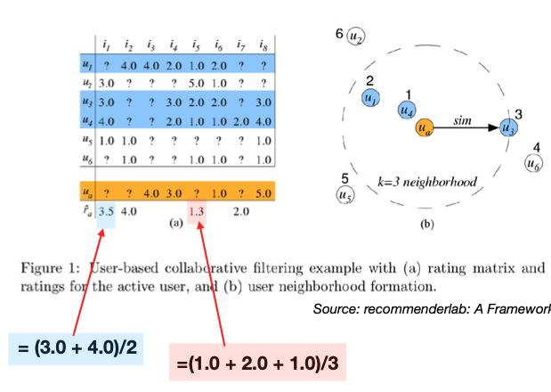
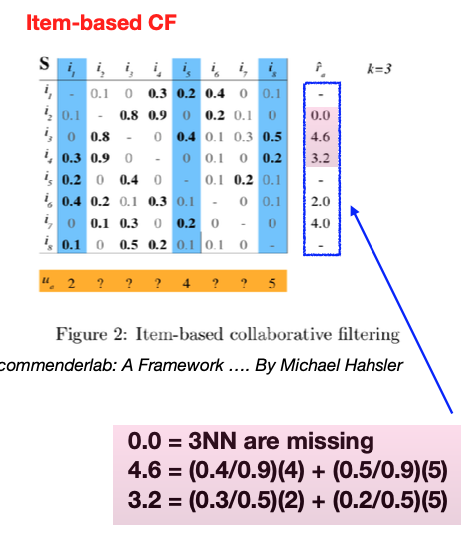

# 13.4. User-Based vs Item-Based Collaborative Filtering

This section provides a comprehensive comparison between User-Based Collaborative Filtering (UBCF) and Item-Based Collaborative Filtering (IBCF), two fundamental approaches in recommendation systems. We'll explore the underlying principles, mathematical foundations, and practical considerations that drive the choice between these methods.

**Intuitive Understanding**: Think of collaborative filtering as having two different ways to make recommendations - like having two different types of smart friends. One friend (UBCF) knows everyone in town and says "People like you enjoyed this." The other friend (IBCF) knows all the products and says "This is similar to what you already like." Both approaches work, but they're good at different things and work better in different situations.

## 13.4.1. Conceptual Foundation and Overview

### The Core Philosophy Behind Collaborative Filtering

Collaborative filtering is based on the principle of **collective intelligence** - the idea that the wisdom of crowds can be harnessed to make predictions about individual preferences. This approach leverages the fact that human preferences often follow patterns that can be discovered through statistical analysis of large datasets.

**Intuition**: Collaborative filtering is like having a massive social network where everyone's opinions and behaviors influence everyone else's recommendations. Instead of analyzing what things are like (content-based), it looks at what people like and finds patterns in their behavior. It's like asking "What do people similar to me enjoy?" rather than "What are the characteristics of things I enjoy?"

### User-Based Collaborative Filtering (UBCF): The "People Like You" Approach

UBCF operates on the fundamental principle that **users with similar preferences in the past will have similar preferences in the future**. This is based on the observation that human preferences often cluster into distinct groups or "taste communities."

**Intuition**: UBCF is like having a smart friend who knows everyone in town and can make recommendations based on what people similar to you have enjoyed. Instead of analyzing the characteristics of movies or books, this friend pays attention to patterns in people's behavior and preferences.

#### Intuitive Understanding

Think of UBCF as finding your "taste doppelgänger" - someone who has rated many of the same items as you and given them similar ratings. If this person loved a movie you haven't seen, there's a good chance you'll like it too.

**Intuition**: This is like the saying "birds of a feather flock together." If you and someone else have liked many of the same things in the past, you're likely to enjoy similar things in the future. It's the same logic that makes friend recommendations work - if you have similar interests, you'll probably get along.

#### Mathematical Intuition

The core assumption can be formalized as:
$$ \text{If } \text{sim}(u, v) \text{ is high, then } P(r_{ui} \approx r_{vi}) \text{ is high} $$

where $`\text{sim}(u, v)`$ measures the similarity between users $`u`$ and $`v`$.

**Intuition**: This mathematical principle is like the foundation of social networks:
- **Similarity Assumption**: Like-minded people tend to like similar things
- **Consistency Assumption**: People's core tastes don't change dramatically overnight
- **Transitivity Assumption**: If you're friends with someone who's friends with another person, you might get along with that third person too

#### Real-World Example

Consider a movie recommendation system:
- User A rates "The Matrix" (5/5), "Inception" (4/5), "Interstellar" (3/5)
- User B rates "The Matrix" (5/5), "Inception" (4/5), "Interstellar" (3/5)
- User B also rated "Blade Runner" (5/5) which User A hasn't seen
- UBCF would recommend "Blade Runner" to User A with high confidence

**Intuition**: This example shows how UBCF works in practice. You find someone who has very similar tastes to you (they liked the same movies in the same order), and then you see what else they've enjoyed that you haven't tried yet. It's like asking your best friend for a recommendation - you trust their opinion because you know they have similar tastes.



### Item-Based Collaborative Filtering (IBCF): The "Similar Items" Approach

IBCF operates on the principle that **users will like items similar to those they have already rated positively**. This approach focuses on item characteristics and relationships rather than user relationships.

**Intuition**: IBCF is like having a smart shopping assistant who knows what products are similar to each other. Instead of asking "What do people like me enjoy?" it asks "What items are similar to the ones I already like?" It's like Amazon's "Customers who bought this also bought..." feature - if you liked one product, you'll probably like similar products.

#### Intuitive Understanding

IBCF is like having a smart shopping assistant who says, "You liked this, so you'll probably like that too." It doesn't care about other people's opinions - it focuses purely on the relationships between items.

**Intuition**: This approach is like organizing a store by product categories rather than by customer preferences. Product categories (like "sci-fi movies" or "Italian restaurants") don't change much, while people's tastes can change frequently. Once you've figured out which products are similar, you can reuse that information for all customers.

#### Mathematical Intuition

The core assumption can be formalized as:
$$ \text{If } \text{sim}(i, j) \text{ is high, then } P(r_{ui} \approx r_{uj}) \text{ is high} $$

where $`\text{sim}(i, j)`$ measures the similarity between items $`i`$ and $`j`$.

**Intuition**: This mathematical principle is like understanding product relationships:
- **Item Similarity**: Products that appeal to the same types of people are similar
- **Consistency**: If you liked one item in a category, you'll probably like others
- **Stability**: Product relationships don't change as quickly as people's preferences

#### Real-World Example

Consider a book recommendation system:
- User rates "Harry Potter and the Sorcerer's Stone" (5/5)
- System finds that users who liked "Harry Potter" also liked "The Hobbit" (similarity = 0.8)
- System recommends "The Hobbit" to this user

**Intuition**: This example shows how IBCF works in practice. You start with something you know you like, and the system finds other things that are similar to it. It's like going to a bookstore and asking "What's similar to Harry Potter?" The system has already figured out that people who like fantasy books for young adults tend to like other fantasy books for young adults.



### Key Conceptual Differences

| Aspect | UBCF | IBCF |
|--------|------|------|
| **Focus** | User relationships | Item relationships |
| **Assumption** | Similar users have similar tastes | Users like similar items |
| **Computation** | User-to-user similarity | Item-to-item similarity |
| **Interpretability** | "People like you liked this" | "This is similar to what you liked" |
| **Scalability** | Limited by user count | Limited by item count |

**Intuition**: This table is like comparing two different ways of organizing a library:
- **UBCF**: Organize by reader types - "People who like sci-fi tend to like these books"
- **IBCF**: Organize by book types - "If you liked this sci-fi book, you'll like these other sci-fi books"

## 13.4.2. Mathematical Formulation and Deep Dive

### Understanding the Prediction Framework

Both UBCF and IBCF follow a **weighted average** approach, but they differ fundamentally in what they average and how they compute weights. Let's break down the mathematical intuition behind each approach.

**Intuition**: Both methods are like having a weighted voting system, but they vote on different things. UBCF is like having your friends vote on what you should try next, while IBCF is like having your past preferences vote on what you should try next.

### UBCF Prediction: The User-Centric Approach

#### Core Mathematical Intuition

UBCF predicts a user's rating for an item by looking at how **similar users** rated that same item. The prediction is essentially a **weighted average** of ratings from similar users, where the weights are the similarities between the target user and each neighbor.

**Intuition**: This is like asking your friends for recommendations, but giving more weight to the opinions of friends who have similar tastes to you. Your best friend (most similar) gets the most voting power, while an acquaintance with different tastes gets less voting power.

#### Detailed Mathematical Formulation

For user $`u`$ and item $`i`$, the prediction is computed as:

$$ \hat{r}_{ui} = \frac{\sum_{v \in N(u)} \text{sim}(u, v) \cdot r_{vi}}{\sum_{v \in N(u)} |\text{sim}(u, v)|} $$

#### Breaking Down the Components

1. **$`N(u)`$ - The Neighborhood**: This is the set of users most similar to user $`u`$. Typically, we select the top-$`k`$ most similar users:
   $$ N(u) = \{v_1, v_2, \ldots, v_k : \text{sim}(u, v_i) \text{ is among the top } k \text{ similarities}\} $$

   **Intuition**: The neighborhood is like your circle of friends - the people most similar to you whose opinions you trust the most.

2. **$`\text{sim}(u, v)`$ - User Similarity**: This measures how similar two users are based on their rating patterns. We'll explore various similarity metrics in detail later.

   **Intuition**: User similarity is like measuring how well you get along with someone based on your shared experiences. The more things you've both tried and liked similarly, the more similar you are.

3. **$`r_{vi}`$ - Neighbor's Rating**: The actual rating given by user $`v`$ for item $`i`$.

   **Intuition**: This is your friend's opinion about the item you're considering.

4. **Normalization Factor**: The denominator ensures the prediction is properly scaled and prevents bias from the magnitude of similarity scores.

   **Intuition**: This is like making sure the total voting power adds up to 100%, so the final recommendation is on the same scale as the original ratings.

#### Mathematical Interpretation

The formula can be interpreted as:
$$ \hat{r}_{ui} = \sum_{v \in N(u)} w_v \cdot r_{vi} $$

where $`w_v = \frac{\text{sim}(u, v)}{\sum_{v' \in N(u)} |\text{sim}(u, v')|}`$ are the normalized weights.

**Intuition**: This interpretation shows that UBCF is really just a weighted voting system. Each friend gets a vote based on how similar their tastes are to yours, and the final recommendation is the weighted average of all their votes.

#### Example Calculation

Consider a user Alice (A) who hasn't rated "The Matrix":
- Bob (B) is 80% similar to Alice and rated "The Matrix" 5/5
- Carol (C) is 60% similar to Alice and rated "The Matrix" 4/5
- David (D) is 40% similar to Alice and rated "The Matrix" 3/5

The prediction would be:
$$ \hat{r}_{A,\text{Matrix}} = \frac{0.8 \times 5 + 0.6 \times 4 + 0.4 \times 3}{0.8 + 0.6 + 0.4} = \frac{4 + 2.4 + 1.2}{1.8} = 4.22 $$

**Intuition**: This calculation shows how UBCF works in practice. Alice's best friend (Bob) loved the movie and gets the most weight (0.8). Her second-best friend (Carol) liked it a lot and gets medium weight (0.6). Her acquaintance (David) thought it was okay and gets the least weight (0.4). The final prediction (4.22) reflects that Alice will probably like it quite a bit, since her closest friends enjoyed it.

### IBCF Prediction: The Item-Centric Approach

#### Core Mathematical Intuition

IBCF predicts a user's rating for an item by looking at how that user rated **similar items**. The prediction is a **weighted average** of the user's own ratings, where the weights are the similarities between the target item and items the user has already rated.

**Intuition**: This is like having a smart shopping assistant who looks at what you've bought before and recommends similar products. Instead of asking other people what they think, it focuses on the relationships between products.

#### Detailed Mathematical Formulation

For user $`u`$ and item $`i`$, the prediction is computed as:

$$ \hat{r}_{ui} = \frac{\sum_{j \in N(i)} \text{sim}(i, j) \cdot r_{uj}}{\sum_{j \in N(i)} |\text{sim}(i, j)|} $$

#### Breaking Down the Components

1. **$`N(i)`$ - The Item Neighborhood**: This is the set of items most similar to item $`i`$ that user $`u`$ has rated:
   $$ N(i) = \{j_1, j_2, \ldots, j_k : \text{sim}(i, j_l) \text{ is among the top } k \text{ similarities AND } r_{uj_l} \text{ exists}\} $$

   **Intuition**: The item neighborhood is like finding the closest relatives of the item you're considering, but only among the items you've already tried.

2. **$`\text{sim}(i, j)`$ - Item Similarity**: This measures how similar two items are based on how users rate them.

   **Intuition**: Item similarity is like measuring how related two products are. Products that appeal to the same types of people are considered similar.

3. **$`r_{uj}`$ - User's Rating**: The actual rating given by user $`u`$ for item $`j``.

   **Intuition**: This is your own opinion about items you've already tried.

#### Mathematical Interpretation

The formula can be interpreted as:
$$ \hat{r}_{ui} = \sum_{j \in N(i)} w_j \cdot r_{uj} $$

where $`w_j = \frac{\text{sim}(i, j)}{\sum_{j' \in N(i)} |\text{sim}(i, j')|}`$ are the normalized weights.

**Intuition**: This interpretation shows that IBCF is like having your past preferences vote on what you should try next. The more similar an item is to something you've already liked, the more weight that item gets in the recommendation.

#### Example Calculation

Consider Alice who hasn't rated "The Matrix":
- Alice rated "Inception" 5/5 (similarity to "The Matrix" = 0.9)
- Alice rated "Blade Runner" 4/5 (similarity to "The Matrix" = 0.7)
- Alice rated "Terminator" 3/5 (similarity to "The Matrix" = 0.5)

The prediction would be:
$$ \hat{r}_{A,\text{Matrix}} = \frac{0.9 \times 5 + 0.7 \times 4 + 0.5 \times 3}{0.9 + 0.7 + 0.5} = \frac{4.5 + 2.8 + 1.5}{2.1} = 4.19 $$

**Intuition**: This calculation shows how IBCF works in practice. "The Matrix" is very similar to "Inception" (which Alice loved), so "Inception" gets the most weight (0.9). It's also similar to "Blade Runner" (which Alice liked a lot), so that gets medium weight (0.7). It's somewhat similar to "Terminator" (which Alice thought was okay), so that gets the least weight (0.5). The final prediction (4.19) reflects that Alice will probably like "The Matrix" quite a bit, since it's most similar to movies she's already enjoyed.

### Key Mathematical Insights

#### 1. Weighted Average Interpretation

Both methods are essentially performing **locally weighted regression**:
- UBCF: Weighted average across users (user space)
- IBCF: Weighted average across items (item space)

**Intuition**: This insight shows that both methods are really just sophisticated averaging techniques, but they average different things. UBCF averages opinions across people, while IBCF averages opinions across products.

#### 2. Sparsity Handling

The neighborhood selection $`N(u)`$ or $`N(i)`$ must handle sparse data:
$$ N(u) = \{v : \text{sim}(u, v) > \text{threshold} \text{ AND } r_{vi} \text{ exists}\} $$

**Intuition**: This is like making sure you only ask friends who have actually tried the thing you're considering. If no one in your circle has seen a particular movie, you can't get a recommendation for it.

#### 3. Cold Start Problem

- **UBCF**: $`N(u) = \emptyset`$ for new users
- **IBCF**: $`N(i) = \emptyset`$ for new items

**Intuition**: This is like the "new kid in town" problem. If you're new to the system, you don't have any friends yet (UBCF problem). If a new product just came out, no one has tried it yet (IBCF problem).

#### 4. Computational Complexity

- **UBCF**: $`O(|N(u)|)`$ per prediction
- **IBCF**: $`O(|N(i)|)`$ per prediction

Where typically $`|N(u)| \ll |\mathcal{U}|`$ and $`|N(i)| \ll |\mathcal{I}|`$ for efficiency.

**Intuition**: This shows that both methods are efficient because they only look at a small subset of the data. Instead of considering everyone in the world, you only consider your closest friends (UBCF) or the most similar products (IBCF).

## 13.4.3. Algorithm Comparison

### UBCF Algorithm Steps

1. **Compute User Similarities**: Calculate similarity between target user and all other users
2. **Select Neighborhood**: Choose top-$`k`$ most similar users
3. **Generate Prediction**: Weighted average of neighbors' ratings for target item

### IBCF Algorithm Steps

1. **Pre-compute Item Similarities**: Calculate similarity between all item pairs
2. **Select Neighborhood**: Choose top-$`k`$ most similar items for target item
3. **Generate Prediction**: Weighted average of user's ratings for similar items

## 13.4.4. Similarity Metrics: The Heart of Collaborative Filtering

The choice of similarity metric is crucial for the performance of collaborative filtering systems. Different metrics capture different aspects of similarity and have varying computational costs and interpretability.

**Intuition**: Similarity metrics are like different ways of measuring friendship or product relationships. Just as you might measure friendship by how many interests you share, how similar your personalities are, or how much time you spend together, similarity metrics measure different aspects of how similar users or items are.

### Understanding Similarity in Recommendation Systems

Similarity metrics in recommendation systems serve to quantify the degree of resemblance between users or items based on their rating patterns. The choice of metric can significantly impact both the accuracy and interpretability of recommendations.

**Intuition**: Think of similarity metrics as the "measuring tape" for relationships. Just as you might use different tools to measure different things (a ruler for length, a scale for weight, a thermometer for temperature), different similarity metrics measure different aspects of how similar users or items are.

### User Similarity Metrics: Finding Your Taste Doppelgänger

#### 1. Pearson Correlation: The Gold Standard

Pearson correlation measures the linear relationship between two users' rating patterns, accounting for different rating scales and biases.

**Intuition**: Pearson correlation is like accounting for different rating styles when measuring friendship. Some people are naturally generous (they give mostly 4s and 5s), while others are naturally critical (they give mostly 2s and 3s). By subtracting each person's average rating, we focus on whether they liked something more or less than their usual, rather than their absolute rating.

##### Mathematical Foundation

$$ \text{Pearson}(u, v) = \frac{\sum_{i \in I_{uv}} (r_{ui} - \bar{r}_u)(r_{vi} - \bar{r}_v)}{\sqrt{\sum_{i \in I_{uv}} (r_{ui} - \bar{r}_u)^2} \sqrt{\sum_{i \in I_{uv}} (r_{vi} - \bar{r}_v)^2}} $$

where:
- $`I_{uv}`$ is the set of items rated by both users $`u`$ and $`v`$
- $`\bar{r}_u`$ and $`\bar{r}_v`$ are the mean ratings of users $`u`$ and $`v`$ respectively

**Intuition**: This formula is like having a sophisticated translator between different rating languages. It converts everyone's ratings to "above average" or "below average" relative to their own scale, then sees how well these relative preferences align.

##### Intuitive Understanding

Pearson correlation measures how well two users' rating patterns align after accounting for their individual rating biases. A correlation of:
- **+1.0**: Perfect positive correlation (users rate items identically relative to their means)
- **0.0**: No linear relationship
- **-1.0**: Perfect negative correlation (users have opposite preferences)

**Intuition**: This is like having two friends who speak different languages. One friend says "good" for things they really like and "okay" for things they don't like much. Another friend says "amazing" for things they really like and "good" for things they don't like much. Pearson correlation translates between these different "languages" so we can compare their preferences fairly.

##### Example Calculation

Consider two users with ratings:
- User A: "Matrix" (5), "Inception" (4), "Interstellar" (3) → Mean = 4
- User B: "Matrix" (4), "Inception" (3), "Interstellar" (2) → Mean = 3

Deviations from mean:
- User A: +1, 0, -1
- User B: +1, 0, -1

Correlation = 1.0 (perfect alignment)

**Intuition**: This example shows how Pearson correlation works. Both users rated "Matrix" higher than their usual, both rated "Inception" at their usual level, and both rated "Interstellar" lower than their usual. Even though they use different rating scales (User A uses 3-5, User B uses 2-4), their relative preferences are identical, giving perfect correlation.

##### Advantages
- Accounts for rating scale differences
- Robust to different rating biases
- Well-understood statistical properties

**Intuition**: These advantages make Pearson correlation very useful:
- **Accounts for rating scale differences**: Works whether people use 1-5 scales or 1-10 scales
- **Robust to different rating biases**: Some people are generous raters, others are harsh raters
- **Well-understood statistical properties**: We know exactly what the numbers mean

##### Disadvantages
- Requires sufficient common items
- Sensitive to outliers
- Computationally expensive for large datasets

**Intuition**: These disadvantages are like the limitations of any sophisticated measurement tool:
- **Requires sufficient common items**: You need to have tried enough of the same things to make a meaningful comparison
- **Sensitive to outliers**: One crazy rating can throw off the whole similarity calculation
- **Computationally expensive**: Takes more time to compute than simpler methods

#### 2. Cosine Similarity: Vector-Based Approach

Cosine similarity measures the angle between two users' rating vectors, treating ratings as vectors in high-dimensional space.

**Intuition**: Cosine similarity is like measuring whether two people are pointing in the same direction with their preferences. It doesn't matter how many things they've rated or how strongly they feel - it just matters whether they tend to like and dislike the same things. Two people who both love action movies and hate romantic comedies would have high cosine similarity, even if one person has rated 100 movies and the other has only rated 10.

##### Mathematical Foundation

$$ \text{Cosine}(u, v) = \frac{\mathbf{r}_u \cdot \mathbf{r}_v}{\|\mathbf{r}_u\| \cdot \|\mathbf{r}_v\|} $$

where $`\mathbf{r}_u`$ and $`\mathbf{r}_v`$ are the rating vectors of users $`u`$ and $`v``.

**Intuition**: This formula is like measuring the angle between two arrows pointing in preference space. When the arrows point in the same direction, similarity is high. When they point in opposite directions, similarity is low.

##### Geometric Interpretation

Cosine similarity measures the cosine of the angle between two rating vectors:
- **1.0**: Vectors point in same direction (perfect similarity)
- **0.0**: Vectors are orthogonal (no similarity)
- **-1.0**: Vectors point in opposite directions (perfect dissimilarity)

**Intuition**: This geometric view is like having a compass for preferences. If two people's preference arrows point in the same direction, they're similar. If they point in opposite directions, they have opposite tastes. If they point at right angles to each other, they have unrelated tastes.

##### Example Calculation

Consider rating vectors:
- User A: [5, 4, 3, 0, 0] (rated 3 items)
- User B: [4, 3, 2, 0, 0] (rated 3 items)

Dot product: 5×4 + 4×3 + 3×2 = 20 + 12 + 6 = 38
Magnitudes: √(25+16+9) = √50, √(16+9+4) = √29
Cosine similarity = 38 / (√50 × √29) ≈ 0.99

**Intuition**: This calculation shows how cosine similarity works. Both users rated the same three items in the same order (highest to lowest), so their preference vectors point in the same direction, giving very high similarity (0.99).

##### Advantages
- Computationally efficient
- Works well with sparse data
- Intuitive geometric interpretation

**Intuition**: These advantages make cosine similarity very practical:
- **Computationally efficient**: Fast to compute, even for large datasets
- **Works well with sparse data**: Doesn't mind that most people haven't rated most items
- **Intuitive geometric interpretation**: Easy to understand as "direction of preferences"

##### Disadvantages
- Doesn't account for rating scale differences
- Sensitive to rating magnitude
- May not capture nuanced preferences

**Intuition**: These disadvantages are like the limitations of using only direction without considering magnitude:
- **Doesn't account for rating scale differences**: Treats a 5-star rating the same whether it's from a generous or harsh rater
- **Sensitive to rating magnitude**: Someone who rates everything 1-2 might appear similar to someone who rates everything 4-5
- **May not capture nuanced preferences**: Focuses on broad patterns rather than subtle differences

#### 3. Jaccard Similarity: Set-Based Approach

Jaccard similarity measures the overlap between sets of items rated by two users, ignoring rating values.

**Intuition**: Jaccard similarity is like measuring how much two people's shopping carts overlap. If you bought 10 items and your friend bought 8 items, and you both bought 4 of the same items, your Jaccard similarity would be 4/(10+8-4) = 4/14 ≈ 0.29. It measures the proportion of shared items relative to all items either of you bought.

##### Mathematical Foundation

$$ \text{Jaccard}(u, v) = \frac{|I_u \cap I_v|}{|I_u \cup I_v|} $$

where $`I_u`$ and $`I_v`$ are sets of items rated by users $`u`$ and $`v``.

**Intuition**: This formula is like measuring friendship based on shared experiences. It doesn't matter whether you both loved or both hated the same movies - just that you both watched them. The more experiences you share, the more similar you are.

##### Set-Theoretic Interpretation

Jaccard similarity measures the proportion of items that both users have rated:
- **1.0**: Users rated exactly the same items
- **0.0**: Users rated completely different items
- **0.5**: Half of their rated items overlap

**Intuition**: This interpretation is like measuring how much two people's lives overlap. If you've both tried exactly the same things, you have perfect overlap (1.0). If you've tried completely different things, you have no overlap (0.0). If half the things you've tried are the same, you have 50% overlap (0.5).

##### Example Calculation

Consider item sets:
- User A rated: {Matrix, Inception, Blade Runner, Terminator}
- User B rated: {Matrix, Inception, Alien, Predator}

Intersection: {Matrix, Inception} → 2 items
Union: {Matrix, Inception, Blade Runner, Terminator, Alien, Predator} → 6 items
Jaccard similarity = 2/6 = 0.33

**Intuition**: This example shows how Jaccard similarity works. Both users have tried 6 different movies total, and they've both tried 2 of the same movies. So their similarity is 2/6 = 0.33, meaning they have 33% overlap in their movie-watching experience.

##### Advantages
- Simple and fast to compute
- Works with binary data
- Robust to rating scale issues

**Intuition**: These advantages make Jaccard similarity very practical:
- **Simple and fast to compute**: Just counting overlapping items
- **Works with binary data**: Doesn't need actual ratings, just whether items were tried
- **Robust to rating scale issues**: Doesn't care about rating values at all

##### Disadvantages
- Ignores rating values
- May miss nuanced preferences
- Less informative than value-based metrics

**Intuition**: These disadvantages are like the limitations of measuring friendship only by shared activities:
- **Ignores rating values**: Doesn't distinguish between loving and hating the same movies
- **May miss nuanced preferences**: Two people could have opposite tastes but high Jaccard similarity
- **Less informative**: Doesn't tell you whether the shared experiences were positive or negative

### Item Similarity Metrics: Finding Related Items

#### 1. Adjusted Cosine Similarity: The IBCF Standard

Adjusted cosine similarity is specifically designed for item-based collaborative filtering, accounting for user rating biases.

**Intuition**: Adjusted cosine similarity is like measuring how similarly two products are rated by the same people, but accounting for each person's rating style. If most people rate Product A higher than their usual and also rate Product B higher than their usual, then A and B are similar. This is more meaningful than just comparing absolute ratings.

##### Mathematical Foundation

$$ \text{AdjustedCosine}(i, j) = \frac{\sum_{u \in U_{ij}} (r_{ui} - \bar{r}_u)(r_{uj} - \bar{r}_u)}{\sqrt{\sum_{u \in U_{ij}} (r_{ui} - \bar{r}_u)^2} \sqrt{\sum_{u \in U_{ij}} (r_{uj} - \bar{r}_u)^2}} $$

where $`U_{ij}`$ is the set of users who rated both items $`i`$ and $`j``.

**Intuition**: This formula is like having a sophisticated product comparison system that accounts for different people's rating styles. It measures how similarly two products are rated relative to each person's average rating, rather than in absolute terms.

##### Key Insight: User-Centered Adjustment

Unlike regular cosine similarity, adjusted cosine subtracts each user's mean rating before computing similarity. This accounts for the fact that different users have different rating scales and biases.

**Intuition**: This is like having a restaurant critic and a casual diner both review the same restaurants. The critic might give 3 stars to a great restaurant, while the casual diner gives 5 stars to a mediocre restaurant. By centering around each person's average rating, we can see that the critic really liked the great restaurant (gave it 3 stars when their average is 2) and the casual diner didn't like the mediocre restaurant much (gave it 5 stars when their average is 4.5).

##### Example Calculation

Consider items "Matrix" and "Inception" rated by users:
- User A (mean=4): Matrix(5), Inception(4) → Deviations: +1, 0
- User B (mean=3): Matrix(4), Inception(3) → Deviations: +1, 0
- User C (mean=2): Matrix(3), Inception(2) → Deviations: +1, 0

Adjusted cosine = 1.0 (perfect similarity after accounting for user biases)

**Intuition**: This example shows how adjusted cosine similarity works. All three users rated "Matrix" higher than their usual and rated "Inception" at their usual level. Even though they use different rating scales, their relative preferences for these two movies are identical, giving perfect similarity.

##### Advantages
- Accounts for user rating biases
- Specifically designed for item-based CF
- Robust to different rating scales

**Intuition**: These advantages make adjusted cosine similarity ideal for comparing products:
- **Accounts for user rating biases**: Handles the fact that different people have different rating styles
- **Specifically designed for item-based CF**: Optimized for finding similar products
- **Robust to different rating scales**: Works whether people use 1-5 or 1-10 scales

##### Disadvantages
- Computationally more expensive
- Requires sufficient user overlap
- May not work well with very sparse data

**Intuition**: These disadvantages are like the trade-offs of any sophisticated measurement tool:
- **Computationally more expensive**: Takes more time to compute than simpler methods
- **Requires sufficient user overlap**: Need enough people to have rated both items
- **May not work well with very sparse data**: If very few people have rated both items, the similarity may not be reliable

#### 2. Pearson Correlation for Items

Pearson correlation for items measures the linear relationship between how different users rate two items.

**Intuition**: This is like measuring whether two products appeal to the same types of people. If people who rate one product highly also rate another product highly, then the products are similar.

##### Mathematical Foundation

$$ \text{Pearson}(i, j) = \frac{\sum_{u \in U_{ij}} (r_{ui} - \bar{r}_i)(r_{uj} - \bar{r}_j)}{\sqrt{\sum_{u \in U_{ij}} (r_{ui} - \bar{r}_i)^2} \sqrt{\sum_{u \in U_{ij}} (r_{uj} - \bar{r}_j)^2}} $$

where $`\bar{r}_i`$ and $`\bar{r}_j`$ are the mean ratings of items $`i`$ and $`j`$.

**Intuition**: This formula is like measuring whether two products are rated similarly relative to their own average ratings. It accounts for the fact that some products are generally rated higher than others.

##### Item-Centered Adjustment

This version subtracts the item's mean rating rather than the user's mean, focusing on how items are rated relative to their own average ratings.

**Intuition**: This is like comparing how two restaurants perform relative to their own standards. A 4-star rating at a fancy restaurant might mean the same as a 5-star rating at a casual restaurant, when compared to each restaurant's typical rating.

### Advanced Similarity Metrics

#### 1. Spearman Rank Correlation

Measures the monotonic relationship between rankings rather than absolute values:

$$ \text{Spearman}(u, v) = 1 - \frac{6 \sum_{i \in I_{uv}} d_i^2}{n(n^2-1)} $$

where $`d_i`$ is the difference in ranks for item $`i`$ between users $`u`$ and $`v``.

**Intuition**: Spearman correlation is like comparing how two people would rank the same set of movies from best to worst. It doesn't matter what ratings they give - only the order matters. If you rank movies A, B, C as 1st, 2nd, 3rd and your friend ranks them as 2nd, 1st, 3rd, you have some similarity (you both think C is worst) but not perfect similarity.

#### 2. Mean Squared Difference

Simple but effective for dense datasets:

$$ \text{MSD}(u, v) = \frac{1}{|I_{uv}|} \sum_{i \in I_{uv}} (r_{ui} - r_{vi})^2 $$

**Intuition**: Mean squared difference is like measuring how far apart two people's ratings are on average. The smaller the difference, the more similar they are. It's simple but effective when you have lots of data.

#### 3. Constrained Pearson Correlation

Addresses the cold start problem by using a minimum threshold:

$$ \text{ConstrainedPearson}(u, v) = \begin{cases}
\text{Pearson}(u, v) & \text{if } |I_{uv}| \geq \text{min\_common} \\
0 & \text{otherwise}
\end{cases} $$

**Intuition**: Constrained Pearson correlation is like requiring a minimum number of shared experiences before considering two people similar. This prevents unreliable similarities based on too few data points.

### Choosing the Right Similarity Metric

#### For UBCF:
- **Pearson**: Best overall performance, accounts for biases
- **Cosine**: Good for sparse data, computationally efficient
- **Jaccard**: Good for binary data, simple implementation

**Intuition**: This is like choosing the right tool for measuring friendship:
- **Pearson**: The most sophisticated tool, gives the most accurate results
- **Cosine**: A good middle ground, fast and reasonably accurate
- **Jaccard**: The simplest tool, good when you only have basic information

#### For IBCF:
- **Adjusted Cosine**: Best for item-based CF, accounts for user biases
- **Pearson**: Good alternative, item-centered adjustment
- **Cosine**: Fast but may miss user bias effects

**Intuition**: This is like choosing the right tool for comparing products:
- **Adjusted Cosine**: Specifically designed for comparing products, accounts for different customer rating styles
- **Pearson**: A good general-purpose tool for comparing products
- **Cosine**: Fast but may not account for rating style differences

#### Performance Considerations:

| Metric | Computational Cost | Accuracy | Interpretability |
|--------|-------------------|----------|------------------|
| Pearson | High | High | High |
| Cosine | Medium | Medium | Medium |
| Jaccard | Low | Low | High |
| Adjusted Cosine | High | High | Medium |

**Intuition**: This table is like comparing different measuring tools:
- **Pearson**: Like a precision instrument - expensive but very accurate
- **Cosine**: Like a good quality tool - reasonable cost and accuracy
- **Jaccard**: Like a simple ruler - cheap and easy to understand
- **Adjusted Cosine**: Like a specialized tool - expensive but perfect for the job

## 13.4.5. Implementation

### Python Implementation: UBCF vs IBCF Comparison

The Python implementation provides a comprehensive comparison between User-Based Collaborative Filtering (UBCF) and Item-Based Collaborative Filtering (IBCF) approaches. The implementation is available in the file `code/ubcf_ibcf_comparison_implementation.py`.

**Key Components:**

1. **UBCF Class**: Implements User-Based Collaborative Filtering with support for different similarity metrics (Pearson correlation, cosine similarity) and configurable neighborhood sizes.

2. **IBCF Class**: Implements Item-Based Collaborative Filtering with adjusted cosine similarity and Pearson correlation options.

3. **HybridRecommender Class**: Combines UBCF and IBCF predictions using weighted averaging with learnable parameters.

4. **Comprehensive Demonstrations**:
   - Basic comparison between UBCF and IBCF methods
   - Similarity analysis and distribution comparisons
   - Hybrid recommendation approaches with different weight combinations
   - Scalability analysis across different dataset sizes
   - Detailed visualizations including rating matrices, similarity heatmaps, and performance comparisons
   - Cold start scenario analysis

5. **Evaluation Framework**: Includes MAE, RMSE, and coverage metrics for comprehensive performance assessment.

6. **Synthetic Data Generation**: Creates clustered datasets to demonstrate the strengths and weaknesses of each approach.

**Usage:**
```bash
python code/ubcf_ibcf_comparison_implementation.py
```

The implementation demonstrates how UBCF excels in interpretability and handling new items, while IBCF provides better scalability and stability. The hybrid approach shows how combining both methods can achieve superior performance in many scenarios.

### R Implementation

The R implementation provides a comprehensive comparison between User-Based Collaborative Filtering (UBCF) and Item-Based Collaborative Filtering (IBCF) approaches using R's `recommenderlab` package and other relevant libraries. The implementation is available in the file `code/r_ubcf_ibcf_comparison_implementation.R`.

**Key Components:**

1. **UBCF Functions**: Implements User-Based Collaborative Filtering with support for different similarity metrics (Pearson correlation, cosine similarity) and configurable neighborhood sizes.

2. **IBCF Functions**: Implements Item-Based Collaborative Filtering with adjusted cosine similarity and Pearson correlation options.

3. **HybridRecommender Functions**: Combines UBCF and IBCF predictions using weighted averaging with learnable parameters.

4. **Comprehensive Demonstrations**:
   - Basic comparison between UBCF and IBCF methods
   - Similarity analysis and distribution comparisons
   - Hybrid recommendation approaches with different weight combinations
   - Scalability analysis across different dataset sizes
   - Detailed visualizations using ggplot2 and gridExtra
   - Cold start scenario analysis

5. **Evaluation Framework**: Includes MAE, RMSE, and coverage metrics for comprehensive performance assessment.

6. **Synthetic Data Generation**: Creates clustered datasets to demonstrate the strengths and weaknesses of each approach.

**Usage:**
```r
source("code/r_ubcf_ibcf_comparison_implementation.R")
main_r()
```

The R implementation leverages the `recommenderlab` package for efficient collaborative filtering and provides comprehensive visualizations using `ggplot2`. It demonstrates the same key insights as the Python version: UBCF excels in interpretability and handling new items, while IBCF provides better scalability and stability.

## 13.4.6. Performance Comparison and Scalability Analysis

### Understanding Computational Complexity

The performance characteristics of UBCF and IBCF are fundamentally different due to their different approaches to similarity computation and prediction. Let's analyze these differences in detail.

### Computational Complexity: A Deep Dive

#### UBCF Complexity Analysis

##### Training Phase Complexity

The training phase involves computing user similarities, which requires comparing each user with every other user:

```math
\text{UBCF Training} = O(n^2 \cdot m \cdot \text{sim\_cost})
```

where:
- $`n`$ is the number of users
- $`m`$ is the number of items
- $`\text{sim\_cost}`$ is the cost of computing similarity between two users

**Detailed Breakdown**:
1. **User Pair Generation**: $`O(n^2)`$ pairs of users
2. **Common Item Finding**: $`O(m)`$ for each pair
3. **Similarity Computation**: $`O(\text{common\_items})`$ per pair

**Total**: $`O(n^2 \cdot m)`$ in worst case

##### Prediction Phase Complexity

For each prediction, we need to:
1. Find the user's neighborhood: $`O(n)`$ (or $`O(\log n)`$ with indexing)
2. Compute weighted average: $`O(k)`$ where $`k`$ is neighborhood size

```math
\text{UBCF Prediction} = O(n + k) \approx O(n)
```

##### Memory Requirements

```math
\text{UBCF Memory} = O(n^2) \text{ for similarity matrix} + O(n \cdot m) \text{ for rating matrix}
```

#### IBCF Complexity Analysis

##### Training Phase Complexity

The training phase involves computing item similarities:

```math
\text{IBCF Training} = O(m^2 \cdot n \cdot \text{sim\_cost})
```

**Detailed Breakdown**:
1. **Item Pair Generation**: $`O(m^2)`$ pairs of items
2. **Common User Finding**: $`O(n)`$ for each pair
3. **Similarity Computation**: $`O(\text{common\_users})`$ per pair

**Total**: $`O(m^2 \cdot n)`$ in worst case

##### Prediction Phase Complexity

For each prediction:
1. Find the item's neighborhood: $`O(m)`$ (or $`O(\log m)`$ with indexing)
2. Compute weighted average: $`O(k)`$ where $`k`$ is neighborhood size

```math
\text{IBCF Prediction} = O(m + k) \approx O(m)
```

##### Memory Requirements

```math
\text{IBCF Memory} = O(m^2) \text{ for similarity matrix} + O(n \cdot m) \text{ for rating matrix}
```

### Scalability Analysis: When Each Method Excels

#### Mathematical Scalability Comparison

Let's define the **scalability ratio** as:

```math
\text{Scalability Ratio} = \frac{\text{UBCF Training Time}}{\text{IBCF Training Time}} = \frac{n^2 \cdot m}{m^2 \cdot n} = \frac{n}{m}
```

This gives us clear guidance:

- **When $`n < m`$**: UBCF is more scalable
- **When $`n > m`$**: IBCF is more scalable
- **When $`n = m`$**: Both have similar complexity

#### Real-World Scaling Patterns

##### E-commerce Scenario
- **Users**: 1,000,000 customers
- **Items**: 100,000 products
- **Ratio**: $`n/m = 10`$

**Result**: IBCF is 10× more scalable for training

##### Social Media Scenario
- **Users**: 100,000 users
- **Items**: 1,000,000 posts
- **Ratio**: $`n/m = 0.1`$

**Result**: UBCF is 10× more scalable for training

#### Prediction Time Comparison

The prediction time depends on the relative sizes of user and item neighborhoods:

```math
\text{UBCF Prediction Time} \propto \min(n, k_{\text{user}})
```

```math
\text{IBCF Prediction Time} \propto \min(m, k_{\text{item}})
```

where $`k_{\text{user}}`$ and $`k_{\text{item}}`$ are the neighborhood sizes.

### Memory Efficiency Analysis

#### Memory Usage Patterns

| Component | UBCF | IBCF |
|-----------|------|------|
| **Rating Matrix** | $`O(n \cdot m)`$ | $`O(n \cdot m)`$ |
| **Similarity Matrix** | $`O(n^2)`$ | $`O(m^2)`$ |
| **Total Memory** | $`O(n^2 + nm)`$ | $`O(m^2 + nm)`$ |

#### Memory Efficiency Decision Rule

```math
\text{Choose UBCF if}: n^2 + nm < m^2 + nm
```

```math
\text{Choose IBCF if}: m^2 + nm < n^2 + nm
```

Simplifying:
- **Choose UBCF if**: $`n < m`$
- **Choose IBCF if**: $`m < n`$

### Practical Decision Framework

#### When to Use UBCF

**Mathematical Conditions**:
- $`n < m`$ (fewer users than items)
- $`n^2 < m^2`$ (user similarity matrix smaller than item similarity matrix)

**Practical Scenarios**:
- **Small to medium user bases** (e.g., enterprise applications)
- **Large item catalogs** (e.g., e-commerce with millions of products)
- **Real-time requirements** (user similarities can be computed on-demand)
- **User preference stability** (similarities don't change frequently)

**Example**: A B2B recommendation system with 10,000 users and 1,000,000 products

#### When to Use IBCF

**Mathematical Conditions**:
- $`m < n`$ (fewer items than users)
- $`m^2 < n^2`$ (item similarity matrix smaller than user similarity matrix)

**Practical Scenarios**:
- **Large user bases** (e.g., social media platforms)
- **Small to medium item catalogs** (e.g., movie recommendation systems)
- **Batch processing acceptable** (item similarities can be pre-computed)
- **Item characteristic stability** (item similarities change slowly)

**Example**: Netflix with 200,000,000 users and 10,000 movies

### Advanced Scalability Considerations

#### Sparse Matrix Optimization

For very sparse datasets, the actual complexity can be much lower:

```math
\text{UBCF Sparse} = O(n^2 \cdot \text{avg\_items\_per\_user})
```

```math
\text{IBCF Sparse} = O(m^2 \cdot \text{avg\_users\_per\_item})
```

#### Parallelization Potential

**UBCF Parallelization**:
- User similarity computation can be parallelized
- Each user pair can be computed independently
- **Speedup**: $`O(\text{number\_of\_cores})`$

**IBCF Parallelization**:
- Item similarity computation can be parallelized
- Each item pair can be computed independently
- **Speedup**: $`O(\text{number\_of\_cores})`$

#### Caching Strategies

**UBCF Caching**:
- User similarities can be cached
- **Cache size**: $`O(n^2)`$
- **Cache invalidation**: When user preferences change

**IBCF Caching**:
- Item similarities can be cached
- **Cache size**: $`O(m^2)`$
- **Cache invalidation**: When item characteristics change (rare)

### Performance Optimization Techniques

#### For UBCF

1. **Approximate Similarity**: Use Locality Sensitive Hashing (LSH)
   ```math
   \text{LSH Complexity} = O(n \cdot \log n)
   ```

2. **Sampling**: Compute similarities on user subsets
   ```math
   \text{Sampling Complexity} = O(s^2 \cdot m) \text{ where } s \ll n
   ```

3. **Dimensionality Reduction**: Use PCA or SVD
   ```math
   \text{Reduced Complexity} = O(n^2 \cdot d) \text{ where } d \ll m
   ```

#### For IBCF

1. **Sparse Similarity**: Only store top-k similarities per item
   ```math
   \text{Sparse Memory} = O(m \cdot k)
   ```

2. **Hierarchical Clustering**: Group similar items
   ```math
   \text{Hierarchical Complexity} = O(m \log m)
   ```

3. **Random Projections**: Use random projections for similarity
   ```math
   \text{Projection Complexity} = O(m \cdot d) \text{ where } d \ll n
   ```

## 13.4.7. Advantages and Disadvantages: A Comprehensive Analysis

### Understanding the Trade-offs

The choice between UBCF and IBCF involves fundamental trade-offs that affect not just performance, but also user experience, system maintainability, and business outcomes. Let's examine these trade-offs in detail.

### UBCF Advantages: The User-Centric Benefits

#### 1. **Interpretability: "People Like You"**

**Mathematical Foundation**: UBCF recommendations can be explained as:
```math
\text{Recommendation} = \text{Weighted average of similar users' preferences}
```

**User Experience**: Users can understand recommendations like:
- "People with similar tastes to you liked this movie"
- "Users who rated the same movies as you also enjoyed this"

**Business Value**: 
- Higher user trust and engagement
- Better compliance with explainability regulations
- Easier to debug and improve recommendations

#### 2. **Real-time Adaptability: Dynamic User Modeling**

**Mathematical Advantage**: User similarities can be updated incrementally:
```math
\text{sim}(u, v)_{\text{new}} = f(\text{sim}(u, v)_{\text{old}}, \text{new\_ratings})
```

**Practical Benefits**:
- Adapts to changing user preferences
- Captures seasonal or trend-based changes
- Responds to user feedback immediately

**Example**: A user who starts rating sci-fi movies highly will immediately see more sci-fi recommendations from similar users.

#### 3. **Serendipity: Discovery of Unexpected Items**

**Mathematical Mechanism**: UBCF can recommend items outside a user's typical preference range through diverse similar users:
```math
\text{Serendipity Score} = \text{Diversity}(N(u)) \times \text{Similarity}(u, v)
```

**User Experience**: 
- Discovers niche items that similar users found
- Introduces variety in recommendations
- Prevents filter bubble effects

#### 4. **Cold Start for New Items: Immediate Integration**

**Mathematical Advantage**: New items can be recommended immediately if any similar user rates them:
```math
P(\text{recommend new item}) = \frac{|\{v \in N(u) : r_{vi} \text{ exists}\}|}{|N(u)|}
```

**Practical Benefits**:
- New products can be promoted immediately
- Fresh content gets exposure quickly
- No waiting period for item similarity computation

### UBCF Disadvantages: The User-Centric Challenges

#### 1. **Scalability: The Quadratic User Problem**

**Mathematical Limitation**: 
```math
\text{UBCF Complexity} = O(n^2 \cdot m)
```

**Practical Impact**:
- **Memory**: User similarity matrix grows as $`O(n^2)`$
- **Computation**: Training time scales quadratically with users
- **Storage**: For 1M users, similarity matrix requires ~4TB (assuming 4 bytes per similarity)

**Real-world Example**: Netflix with 200M users would require:
- 40,000 TB for full similarity matrix
- Years of computation time for training

#### 2. **Sparsity Sensitivity: The Data Hunger Problem**

**Mathematical Challenge**: 
```math
\text{Effective Similarity} = f(\text{Common Items}, \text{Similarity Metric})
```

When common items are few:
```math
\text{Similarity Confidence} \propto \sqrt{|\text{Common Items}|}
```

**Practical Problems**:
- New users have few similar users
- Sparse datasets lead to unreliable similarities
- Cold start problem for new users

#### 3. **Privacy Concerns: The Data Sharing Dilemma**

**Mathematical Risk**: User similarities reveal personal preferences:
```math
\text{Privacy Risk} = \text{Information Leakage}(\text{User Similarities})
```

**Practical Concerns**:
- User preferences can be inferred from similarities
- Collaborative filtering may violate privacy regulations
- Requires careful data anonymization

#### 4. **Recommendation Instability: The Churning Problem**

**Mathematical Issue**: User neighborhoods change frequently:
```math
\text{Stability} = \frac{|\text{Stable Neighbors}|}{|\text{Total Neighbors}|}
```

**User Experience Problems**:
- Recommendations change too frequently
- Users may lose trust in the system
- Inconsistent user experience

### IBCF Advantages: The Item-Centric Benefits

#### 1. **Stability: The Slow-Changing Item World**

**Mathematical Advantage**: Item similarities change slowly:
```math
\text{Item Similarity Stability} = \frac{\text{Time between updates}}{\text{User preference change rate}}
```

**Practical Benefits**:
- Item similarities can be pre-computed and cached
- Recommendations are consistent over time
- Lower computational overhead for updates

#### 2. **Scalability: The Linear User Growth**

**Mathematical Advantage**: 
```math
\text{IBCF Training} = O(m^2 \cdot n)
```

For scenarios where $`m \ll n`$ (common in many applications):
```math
\text{IBCF Advantage} = \frac{n^2}{m^2} \text{ times faster training}
```

**Real-world Example**: Movie recommendation with 10,000 movies and 100M users:
- UBCF: $`O(10^{16})`$ operations
- IBCF: $`O(10^{11})`$ operations
- **100,000× speedup** for IBCF

#### 3. **Caching Efficiency: The Pre-computation Advantage**

**Mathematical Benefit**: Item similarities can be cached indefinitely:
```math
\text{Cache Hit Rate} = \frac{\text{Cached Predictions}}{\text{Total Predictions}} \approx 1.0
```

**Practical Advantages**:
- Predictions can be served from cache
- No real-time similarity computation needed
- Reduced server load and latency

#### 4. **Performance: The Fast Prediction Advantage**

**Mathematical Efficiency**: 
```math
\text{IBCF Prediction} = O(k) \text{ where } k \ll m
```

**Practical Benefits**:
- Sub-millisecond prediction times
- Can handle high-throughput scenarios
- Suitable for real-time applications

### IBCF Disadvantages: The Item-Centric Challenges

#### 1. **Cold Start for New Items: The New Item Problem**

**Mathematical Limitation**: 
```math
\text{New Item Similarity} = \emptyset \text{ (empty set)}
```

**Practical Problems**:
- New items cannot be recommended immediately
- Requires alternative strategies (content-based, popularity-based)
- May miss opportunities to promote new products

#### 2. **Sparsity Sensitivity: The Item Sparsity Problem**

**Mathematical Challenge**: 
```math
\text{Item Similarity Quality} \propto \sqrt{|\text{Common Users}|}
```

**Practical Issues**:
- Niche items have few similar items
- Long-tail items may not get recommended
- Requires sufficient user overlap for reliable similarities

#### 3. **Interpretability: The Black Box Problem**

**Mathematical Limitation**: Item similarities are less intuitive:
```math
\text{Interpretability Score} = \frac{\text{User Understanding}}{\text{Recommendation Complexity}}
```

**User Experience Problems**:
- Harder to explain why an item was recommended
- Users may not understand item relationships
- Lower trust in recommendations

#### 4. **Adaptability: The Slow Response Problem**

**Mathematical Issue**: Item similarities change slowly:
```math
\text{Adaptation Rate} = \frac{\text{Item Similarity Update Frequency}}{\text{User Preference Change Rate}}
```

**Practical Problems**:
- Slow to adapt to changing user preferences
- May miss temporary trends
- Recommendations may become stale

### Comparative Analysis: When Each Excels

#### Decision Matrix

| Factor | UBCF Preference | IBCF Preference | Tie |
|--------|----------------|-----------------|-----|
| **User Base Size** | Small-Medium | Large | Equal |
| **Item Catalog Size** | Large | Small-Medium | Equal |
| **Update Frequency** | High | Low | Equal |
| **Interpretability** | High | Low | Equal |
| **Privacy Concerns** | High | Low | Equal |
| **Real-time Requirements** | High | Low | Equal |
| **Cold Start (Users)** | Low | High | Equal |
| **Cold Start (Items)** | High | Low | Equal |

#### Mathematical Decision Framework

```math
\text{UBCF Score} = w_1 \cdot \text{Interpretability} + w_2 \cdot \text{Adaptability} + w_3 \cdot \text{Serendipity} - w_4 \cdot \text{Scalability Cost}
```

```math
\text{IBCF Score} = w_1 \cdot \text{Stability} + w_2 \cdot \text{Scalability} + w_3 \cdot \text{Performance} - w_4 \cdot \text{Cold Start Cost}
```

Where weights depend on application requirements.

## 13.4.8. Hybrid Approaches: Combining the Best of Both Worlds

### The Motivation for Hybridization

Neither UBCF nor IBCF is universally superior - each has strengths that complement the other's weaknesses. Hybrid approaches aim to leverage the advantages of both methods while mitigating their individual limitations.

### Understanding Hybrid Recommendation

The core idea is to combine predictions from both UBCF and IBCF using various mathematical strategies. This creates a more robust recommendation system that can adapt to different scenarios and user-item combinations.

### Weighted Hybrid: The Adaptive Combination

#### Mathematical Foundation

The weighted hybrid approach combines UBCF and IBCF predictions using a learned weight parameter:

```math
\hat{r}_{ui} = \alpha \cdot \hat{r}_{ui}^{\text{UBCF}} + (1 - \alpha) \cdot \hat{r}_{ui}^{\text{IBCF}}
```

where $`\alpha \in [0, 1]`$ is the weight parameter.

#### Dynamic Weight Learning

The weight $`\alpha`$ can be learned adaptively based on various factors:

```math
\alpha = f(\text{Data Sparsity}, \text{User Activity}, \text{Item Popularity}, \text{Historical Performance})
```

**Example**: For sparse user data, increase IBCF weight:
```math
\alpha = \max(0.1, 1 - \frac{|\text{User Ratings}|}{\text{Avg User Ratings}})
```

#### Mathematical Properties

**Bias-Variance Trade-off**: The hybrid prediction has:
```math
\text{Bias}(\hat{r}_{ui}) = \alpha \cdot \text{Bias}(\hat{r}_{ui}^{\text{UBCF}}) + (1-\alpha) \cdot \text{Bias}(\hat{r}_{ui}^{\text{IBCF}})
```

```math
\text{Variance}(\hat{r}_{ui}) = \alpha^2 \cdot \text{Variance}(\hat{r}_{ui}^{\text{UBCF}}) + (1-\alpha)^2 \cdot \text{Variance}(\hat{r}_{ui}^{\text{IBCF}}) + 2\alpha(1-\alpha)\text{Covariance}
```

#### Optimal Weight Selection

The optimal weight can be found by minimizing prediction error:

```math
\alpha^* = \arg\min_{\alpha} \sum_{(u,i) \in \text{Validation Set}} (r_{ui} - \hat{r}_{ui})^2
```

This leads to the closed-form solution:
```math
\alpha^* = \frac{\sum_{(u,i)} (r_{ui} - \hat{r}_{ui}^{\text{IBCF}})(\hat{r}_{ui}^{\text{UBCF}} - \hat{r}_{ui}^{\text{IBCF}})}{\sum_{(u,i)} (\hat{r}_{ui}^{\text{UBCF}} - \hat{r}_{ui}^{\text{IBCF}})^2}
```

### Switching Hybrid: The Conditional Approach

#### Mathematical Foundation

The switching hybrid uses different methods based on data availability and quality:

```math
\hat{r}_{ui} = \begin{cases}
\hat{r}_{ui}^{\text{UBCF}} & \text{if } |N(u)| \geq \text{threshold}_u \\
\hat{r}_{ui}^{\text{IBCF}} & \text{if } |N(i)| \geq \text{threshold}_i \\
\text{Fallback Method} & \text{otherwise}
\end{cases}
```

#### Threshold Selection

Optimal thresholds can be determined empirically:

```math
\text{threshold}_u^* = \arg\min_{\text{threshold}} \text{MAE}(\text{UBCF predictions})
```

```math
\text{threshold}_i^* = \arg\min_{\text{threshold}} \text{MAE}(\text{IBCF predictions})
```

#### Confidence-Based Switching

More sophisticated switching uses confidence scores:

```math
\text{Confidence}_{\text{UBCF}} = \frac{\sum_{v \in N(u)} |\text{sim}(u, v)|}{|N(u)|}
```

```math
\text{Confidence}_{\text{IBCF}} = \frac{\sum_{j \in N(i)} |\text{sim}(i, j)|}{|N(i)|}
```

Then choose the method with higher confidence:
```math
\hat{r}_{ui} = \begin{cases}
\hat{r}_{ui}^{\text{UBCF}} & \text{if } \text{Confidence}_{\text{UBCF}} > \text{Confidence}_{\text{IBCF}} \\
\hat{r}_{ui}^{\text{IBCF}} & \text{otherwise}
\end{cases}
```

### Cascade Hybrid: The Sequential Refinement

#### Mathematical Foundation

The cascade hybrid uses IBCF as a base prediction and UBCF as a correction:

```math
\hat{r}_{ui} = \hat{r}_{ui}^{\text{IBCF}} + \beta \cdot \text{correction}_{ui}^{\text{UBCF}}
```

where the correction term is:
```math
\text{correction}_{ui}^{\text{UBCF}} = \hat{r}_{ui}^{\text{UBCF}} - \bar{r}_u
```

#### Intuitive Understanding

1. **Base Prediction**: IBCF provides a stable baseline
2. **User-Specific Correction**: UBCF adjusts for user-specific preferences
3. **Bias Correction**: The correction accounts for user rating biases

#### Mathematical Properties

The cascade approach can be viewed as a two-stage regression:
```math
\text{Stage 1}: \hat{r}_{ui}^{\text{IBCF}} = f(\text{Item Features})
```

```math
\text{Stage 2}: \hat{r}_{ui} = \hat{r}_{ui}^{\text{IBCF}} + g(\text{User Features})
```

#### Optimal Correction Weight

The correction weight $`\beta`$ can be learned:

```math
\beta^* = \frac{\sum_{(u,i)} (r_{ui} - \hat{r}_{ui}^{\text{IBCF}}) \cdot \text{correction}_{ui}^{\text{UBCF}}}{\sum_{(u,i)} (\text{correction}_{ui}^{\text{UBCF}})^2}
```

### Advanced Hybrid Techniques

#### 1. Ensemble Hybrid: Multiple Methods

Combine more than two methods:

```math
\hat{r}_{ui} = \sum_{k=1}^{K} \alpha_k \cdot \hat{r}_{ui}^{(k)}
```

where $`\sum_{k=1}^{K} \alpha_k = 1`$ and $`\hat{r}_{ui}^{(k)}`$ are predictions from different methods.

#### 2. Stacking Hybrid: Meta-Learning

Use a meta-learner to combine predictions:

```math
\hat{r}_{ui} = f_{\text{meta}}(\hat{r}_{ui}^{\text{UBCF}}, \hat{r}_{ui}^{\text{IBCF}}, \text{User Features}, \text{Item Features})
```

where $`f_{\text{meta}}`$ is a learned function (e.g., neural network, gradient boosting).

#### 3. Contextual Hybrid: Situation-Aware

Adapt the combination based on context:

```math
\alpha = f(\text{User Context}, \text{Item Context}, \text{Temporal Context})
```

**Examples**:
- High user activity → Higher UBCF weight
- New items → Higher IBCF weight
- Seasonal trends → Adjust weights dynamically

### Mathematical Analysis of Hybrid Performance

#### Bias Analysis

The hybrid prediction bias is:
```