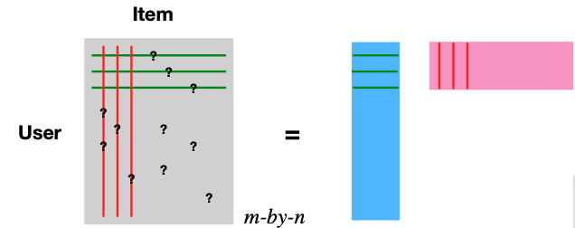
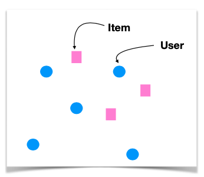
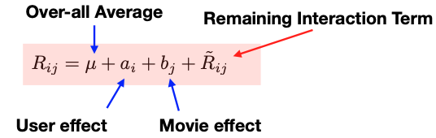

# 13.5. Latent Factor Model

The latent factor model offers a sophisticated approach to handling the rating matrix R. The central concept here is the decomposition of this matrix, using Singular Value Decomposition (SVD). Essentially, we express the matrix as a product of two narrower matrices, one is m-by-d representing users (depicted in blue) and the other with is d-by-n representing items (illustrated in pink).

The decomposition of the rating matrix $R_{m \times n} \approx U_{m \times d} V^t_{d \times n}$ introduces a more compact representation of data. In this framework, the d columns of $U$ represent user features, while the d columns of $V$ (or d rows of $V^t$) correspond to item features.

By adopting this decomposition, we effectively embed users and items into a shared d-dimensional space, allowing their preferences to be measured through inner product or similarity metrics.

The classical SVD algorithm is not directly applicable due to the presence of missing entries in the matrix. To address this, we minimize the quadratic loss, but only over the entries that are not missing. When there are no missing entries, this minimizer would essentially yield the results of an ordinary SVD. However, the adjusted loss function is specifically designed to handle the gaps presented by these missing entries. To further refine this approach and avoid overfitting, penalty terms are incorporated into the loss function. The convex nature of this function makes gradient descent a suitable solution method.

$$\sum_{R_{ij} \ne ?} (R_{ij} - u_i^t v_j)^2 + \lambda_1 \text{Pen}(U) + \lambda_2 \text{Pen}(V)$$

where $u_i$, the i-th row of matrix $U$, is the latent vector for user i, and $v_j$, the j-th row of matrix $V$, is the latent vector for item j.

After determining these latent vectors, the preference predictions for missing entries are then estimated by computing the inner product of the corresponding d-dimensional vectors for users and items.

Taking this model further, the introduction of a baseline model helps to correct biases. This involves analyzing the rating matrix $R_{ij}$ and incorporating both the global average effect and specific effects related to users and items. Similar to the approach used in centered cosine similarity, this baseline model removes user and item effects, refining the latent model's predictive accuracy.

Integrating these bias terms into the loss function, alongside regularization terms for a and b, facilitates gradient descent optimization. This process is straightforward and enhances the model's predictive accuracy.
